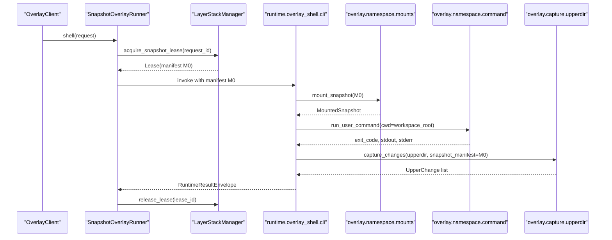

# Phase 02 - Overlay Snapshot Runtime

## 1. Task Specification

Rewrite overlay as a per-call filesystem execution module. It mounts a frozen
leased manifest, runs one command, captures the upperdir, and returns structured
upper changes. It does not own durable layers, OCC policy, gitignore policy, or
publish.

Implementation scope:

```text
create overlay client and runner modules
mount the leased manifest as lowerdir
run commands inside the mounted merged view
capture upperdir writes/deletes/symlinks/opaque dirs
emit UpperChange objects
write a runtime result envelope
release the layer-stack lease in finally
```

Out of scope:

```text
no direct layer publish
no OCC conflict validation
no git check-ignore calls from overlay
no primary NDJSON capture contract
```

Exit condition:

```text
A shell request can run against a leased snapshot, capture its upperdir, and
return a result envelope without overlay importing OCC or git.
```

## 2. Main Data Objects

```python
@dataclass(frozen=True)
class OverlayShellRequest:
    request_id: str
    command: tuple[str, ...]
    cwd: str
    env: Mapping[str, str]
    timeout_seconds: float | None


@dataclass(frozen=True)
class MountedSnapshot:
    manifest: Manifest
    workspace_root: str
    upperdir: str
    workdir: str


@dataclass(frozen=True)
class UpperChange:
    path: str
    kind: Literal["write", "delete", "symlink", "opaque_dir"]
    content_path: str | None
    final_hash: str | None


@dataclass(frozen=True)
class RuntimeResultEnvelope:
    exit_code: int
    stdout_ref: str
    stderr_ref: str
    snapshot_version: int
    upper_changes: tuple[UpperChange, ...]
```

The envelope is runtime-local. OCC results are added in later phases by
`runtime/overlay_shell/capture_to_changeset.py` and the shell cutover pipeline.

## 3. File/Folder Structure Change

Create:

```text
backend/src/sandbox/
+-- overlay/
|   +-- client.py
|   +-- handlers/
|   |   +-- run.py
|   |   +-- shell.py
|   +-- runner/
|   |   +-- snapshot_overlay_runner.py
|   |   +-- runtime_invoker.py
|   |   +-- runtime_bundle.py
|   +-- namespace/
|   |   +-- mounts.py
|   |   +-- command.py
|   +-- capture/
|       +-- upperdir.py
|       +-- changes.py
|
+-- runtime/
    +-- overlay_shell/
        +-- __init__.py
        +-- cli.py
        +-- result_envelope.py
```

Do not create:

```text
backend/src/sandbox/overlay/layer_manager.py
backend/src/sandbox/overlay/capture/ndjson.py
backend/src/sandbox/overlay/occ.py
```

Initial tests:

```text
backend/tests/sandbox/overlay/
+-- test_snapshot_overlay_runner.py
+-- test_upperdir_capture.py
+-- test_overlay_dependency_boundaries.py
```

## 4. Workflow Demonstration



Empty upperdir fast path:

```text
upper_changes == ()
-> no OCC work in later phases
-> no layer publish
-> return command result and empty changeset result
```

## 5. Naming Conventions And Rationale

| Name | Rationale |
|---|---|
| `overlay` | Means per-call filesystem view only. It does not mean durable layer storage. |
| `OverlayClient` | Public caller surface for run/shell requests. |
| `SnapshotOverlayRunner` | States that each run uses a frozen snapshot lease. |
| `namespace.mounts` | Names lowerdir/upperdir mount setup explicitly. |
| `namespace.command` | Isolates command execution from capture and storage. |
| `capture.upperdir` | Names the concrete source of captured writes. |
| `UpperChange` | Names raw filesystem changes before OCC routing. |
| `result_envelope.py` | Boundary-local runtime output; replaces generic transport buckets. |
