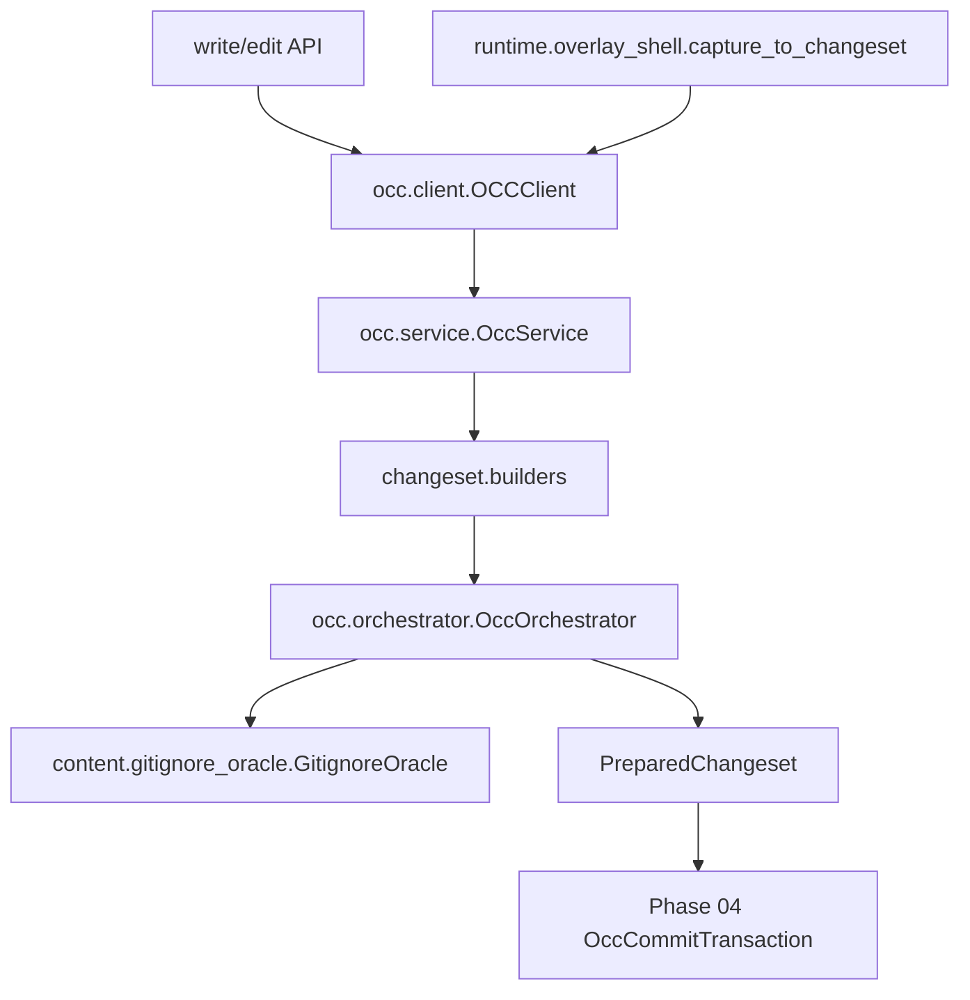

# Phase 03 - OCC Changeset API And Routing

## 1. Task Specification

Build the public OCC changeset surface and routing layer. OCC accepts typed
changes from host write/edit APIs and from the shell capture adapter. It
prepares path groups, evaluates gitignore/direct routing, and attaches
leased-snapshot base hashes where required.

Implementation scope:

```text
create occ/client.py as host write/edit/apply client for the typed service path
create typed changeset data objects
create builders for API write/edit and shell capture sources
create OccOrchestrator and GitignoreOracle
prepare gated/direct/drop path groups
infer tracked base_hash from the leased snapshot manifest
return PreparedChangeset for the commit transaction phase
```

Out of scope:

```text
no overlay capture API inside occ
no layer publish
no final active-manifest validation
no squash or lease pressure policy
no runtime wire codec or in-sandbox occ.apply_changeset handler
no live-root apply coordinator path
```

Exit condition:

```text
Every mutation source enters through OCCClient.apply_changeset as typed Change
objects. OCCClient calls OccService internally; it must not route through a
sandbox-id runtime wire codec. OCC preparation can run concurrently and never
imports overlay.
```

## 2. Main Data Objects

```python
@dataclass(frozen=True)
class Change:
    path: str
    source: Literal["api_write", "api_edit", "shell_capture"]


@dataclass(frozen=True)
class WriteChange(Change):
    final_content: bytes
    base_hash: str | None
    create_only: bool = False


@dataclass(frozen=True)
class EditChange(Change):
    old_text: str
    new_text: str
    expected_occurrences: int = 1


@dataclass(frozen=True)
class DeleteChange(Change):
    base_hash: str


@dataclass(frozen=True)
class PreparedChangeset:
    snapshot: Manifest | None
    path_groups: tuple[PreparedPathGroup, ...]
    atomic: bool
```

Routing objects:

```text
PreparedPathGroup  # ordered changes for one normalized path
RouteDecision      # tracked, direct, drop, reject
GitignoreOracle    # gitignore checks against the selected view
CommitIntent       # atomic flag and caller/source metadata
```

## 3. File/Folder Structure Change

Create:

```text
backend/src/sandbox/
+-- occ/
|   +-- client.py
|   +-- service.py
|   +-- commit_transaction.py
|   +-- orchestrator.py
|   +-- runtime_ops.py
|   +-- changeset/
|   |   +-- builders.py
|   |   +-- intent.py
|   |   +-- types.py
|   +-- content/
|   |   +-- layer_backed_content.py
|   |   +-- gitignore_oracle.py
|   |   +-- hashing.py
|   +-- gated/
|   +-- direct/
```

The Phase 03 `occ/` package should contain only entrypoints, changeset objects,
routing policy, content-policy helpers, and small runtime helpers. The Phase 03
implementation fills the typed changeset and routing pieces; Phase 04 fills
`commit_transaction.py`, `content/layer_backed_content.py`, `direct/`, and
`gated/` in the same package shape.

Extend runtime bridge from Phase 02:

```text
backend/src/sandbox/runtime/overlay_shell/
+-- capture_to_changeset.py
```

Initial tests:

```text
backend/tests/sandbox/occ/
+-- test_changeset_builders.py
+-- test_changeset_routing.py
+-- test_gitignore_oracle.py
+-- test_base_hash_inference.py
+-- test_occ_dependency_boundaries.py
```

Do not create:

```text
backend/src/sandbox/occ/wire.py
backend/src/sandbox/occ/handlers/
backend/src/sandbox/occ/runtime/apply_overlay_capture.py
backend/src/sandbox/occ/routing/
backend/src/sandbox/occ/merge/
```

If the live tree still has these files from an older path, treat them as
cutover debt: Phase 03 should not add tests or callers that depend on them.

## 4. Workflow Demonstration



Tracked hash policy in this phase:

```text
shell capture:
  UpperChange(path, final bytes) + leased Manifest M0
  -> WriteChange(path, final_content, base_hash=hash(path in M0))

api write:
  caller may provide base_hash, or OCC may infer it from snapshot when present

api edit:
  keep EditChange anchors; do not convert it into shell-style full-file CAS
```

Routing:

```text
tracked path     -> PreparedPathGroup(route="tracked")
gitignored path  -> PreparedPathGroup(route="direct")
.git path        -> drop
external path    -> reject by explicit policy
```

## 5. Naming Conventions And Rationale

| Name | Rationale |
|---|---|
| `occ.client` | Public entrypoint for write/edit/apply operations, including shell-capture changesets after `capture_to_changeset`. |
| `OccService` | Generic typed changeset service; not overlay-specific. |
| `changeset.types` | Separates API-level mutation intent from storage `LayerChange`. |
| `changeset.builders` | Keeps adapters close to typed changes without moving overlay logic into OCC. |
| `changeset.intent` | Keeps request intent and prepared path groups together. |
| `occ.orchestrator` | Names path policy selection directly and routes direct vs gated changes. |
| `content.gitignore_oracle` | Keeps gitignore policy under OCC, not overlay or layer_stack. |
| `tracked` and `direct` routes | `tracked` names the CAS-protected workspace path policy; the implementation lives under `gated/` for conflict-gated handling. |
| no `wire.py` | The service path is in-process and typed; generic JSON codecs belong to obsolete sandbox runtime dispatch, not the Phase 03/04 OCC design. |
