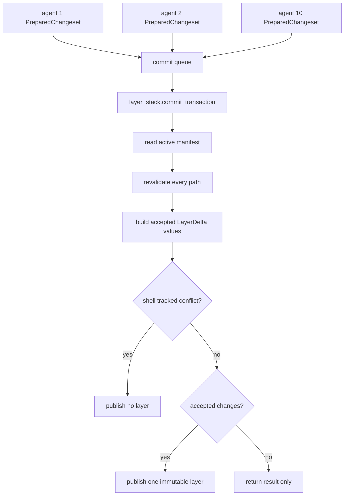

# Phase 04 - Atomic OCC Commit Transaction

## 1. Task Specification

Implement final OCC validation and publish as one short active-manifest
transaction. Preparation remains concurrent, but validation against the current
active manifest and immutable layer publish are serialized under the
layer-stack transaction lock.

Implementation scope:

```text
create occ.merge.transaction.OccCommitTransaction
create tracked/direct/hash merge helpers
wire OccService.apply_changeset to the transaction
compare tracked current_hash against leased-snapshot base_hash
apply EditChange anchors against active/staged content
publish one layer for accepted changes
return per-file ChangesetResult
enforce stricter shell all-or-nothing tracked conflict rule
keep occ package shape aligned with the Phase 03/04 target
```

Out of scope:

```text
no global lock around shell execution
no global lock around upperdir capture
no global lock around changeset prepare
no squash planning
no legacy runtime wire codec
no legacy in-sandbox occ.apply_changeset handler
no live-root direct/gated/orchestrator apply path
```

Exit condition:

```text
Ten concurrent agents may prepare at the same time, but each commit transaction
sees the latest active manifest before publishing. Overlapping tracked writes
cannot overwrite each other without revalidation.

The `occ/` package also matches the Phase 03/04 target structure: `client.py`,
`runtime_ops.py`, `service.py`, `changeset/`, `routing/`, and `merge/`. Legacy
runtime files such as `wire.py`, `handlers/`, `orchestrator.py`, `direct/`, and
`gated/` are not part of the Phase 04 result.
```

## 2. Main Data Objects

```python
@dataclass(frozen=True)
class FileResult:
    path: str
    status: Literal["accepted", "aborted_version", "aborted_overlap", "dropped", "rejected"]
    message: str | None


@dataclass(frozen=True)
class ChangesetResult:
    files: tuple[FileResult, ...]
    published_manifest_version: int | None


@dataclass(frozen=True)
class PathValidation:
    path: str
    result: FileResult
    accepted_delta: LayerDelta | None
```

Transaction objects:

```text
OccCommitTransaction  # owns revalidate_and_publish
GatedMerge          # base_hash and EditChange anchor checks
DirectMerge           # gitignored/direct last-writer-wins staging
ContentHasher         # stable content hash helper
LayerStackTransaction # active-manifest lock and publish boundary
```

## 3. File/Folder Structure Change

Target `occ/` shape after Phase 04:

```text
backend/src/sandbox/
+-- occ/
    +-- __init__.py
    +-- client.py
    +-- runtime_ops.py
    +-- service.py
    +-- changeset/
    |   +-- types.py
    |   +-- builders.py
    |   +-- prepared.py
    +-- routing/
    |   +-- router.py
    |   +-- gitignore.py
    +-- merge/
        +-- transaction.py
        +-- tracked.py
        +-- direct.py
        +-- hashing.py
```

Delete or avoid from the Phase 04 OCC package:

```text
backend/src/sandbox/occ/wire.py
backend/src/sandbox/occ/handlers/
backend/src/sandbox/occ/orchestrator.py
backend/src/sandbox/occ/direct/
backend/src/sandbox/occ/gated/
backend/src/sandbox/occ/runtime/apply_overlay_capture.py
```

These paths describe the old live-root runtime-dispatch apply flow. They should
not be moved under `merge/` or preserved as compatibility wrappers; route
callers to `OccService.apply_changeset(...)` and remove the old path.

Wire existing Phase 03 files:

```text
occ/service.py
  OccService.apply_changeset(...)
  -> OccCommitTransaction.revalidate_and_publish(...)

layer_stack/publisher.py
  LayerPublisher.publish_layer_locked(...)
```

Initial tests:

```text
backend/tests/sandbox/occ/
+-- test_commit_transaction.py
+-- test_tracked_merge.py
+-- test_direct_merge.py
+-- test_concurrent_commits.py
+-- test_shell_atomic_conflicts.py
```

## 4. Workflow Demonstration



Hash policy:

```text
base_hash    = hash(path content in request's leased snapshot)
current_hash = hash(path content in active manifest inside transaction)
accept write = current_hash == base_hash
```

Generic batch behavior:

```text
api write/edit changeset:
  per-file partial success by default
  atomic=True can require all-or-nothing
```

Shell behavior:

```text
shell-captured tracked write:
  strict full-file CAS
  no anchor merge
  any tracked conflict -> publish no layer for that shell request
  direct/gitignored shell outputs are held until tracked validation passes
```

## 5. Naming Conventions And Rationale

| Name | Rationale |
|---|---|
| `OccCommitTransaction` | Names the only place where active validation and publish happen together. |
| `revalidate_and_publish` | Makes the two required atomic operations visible in the method name. |
| `merge.tracked` | Names OCC-guarded tracked path behavior. |
| `merge.direct` | Names gitignored/direct last-writer-wins behavior without pretending it is OCC-guarded. |
| `merge.hashing` | Keeps hash policy helpers small and explicit. |
| `FileResult` | Names the per-path user-visible outcome. |
| `ChangesetResult` | Names the whole request outcome. |
| `ABORTED_VERSION` | Current active content no longer matches the leased snapshot base hash. |
| `ABORTED_OVERLAP` | Anchor edit cannot apply uniquely to the active/staged content. |
| no `wire.py` | Phase 04 validates typed `PreparedChangeset` objects in process; generic JSON wire codecs are obsolete once public callers route through `OccService`. |
