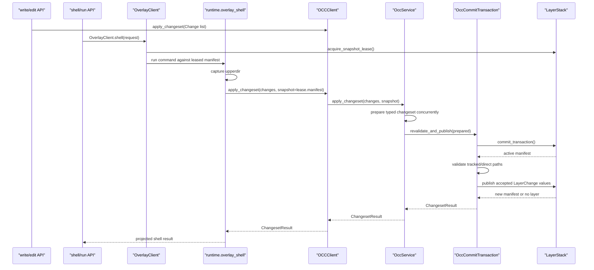

# Phase 06 - Integration Cutover

## 1. Task Specification

Route public write/edit/shell paths to the new modules, remove obsolete
production paths, and verify dependency boundaries. This phase is the cutover
from the old ambiguous overlay-owned shape to the readable module layout.

Implementation scope:

```text
route write/edit APIs through occ.client.OCCClient
route shell/run APIs through overlay.client.OverlayClient
connect runtime.overlay_shell.capture_to_changeset to OCCClient
project command + changeset results through overlay_shell.pipeline
remove production references to old overlay-owned layer manager shapes
remove any occ apply_overlay_capture entrypoint
remove generic wire.py and primary overlay/capture/ndjson.py plans
update tests and architecture docs
```

Out of scope:

```text
no new shell modes
no cross-request coalescing
no direct writes outside the layer stack
no importing stack_overlay into production code
```

Exit condition:

```text
All write/edit/shell mutations enter through OCCClient.apply_changeset,
OCCClient calls OccService internally, every accepted mutation publishes through
OccCommitTransaction, and dependency scans show the target boundaries.
```

## 2. Main Data Objects

Public request/response objects:

```text
OverlayShellRequest       # public shell/run request into overlay client
RuntimeResultEnvelope     # command result plus OCC result projection
Change                    # typed OCC mutation
PreparedChangeset         # routed and base-hash-prepared request
ChangesetResult           # per-file OCC outcome
FileResult                # accepted/aborted/dropped/rejected per path
Manifest                  # active or leased layer list
Lease                     # exact pinned snapshot identity
```

No new generic data object is introduced for cutover. The migration should
reuse boundary-local request/response objects from earlier phases.

## 3. File/Folder Structure Change

Final target:

```text
backend/src/sandbox/
+-- layer_stack/
|   +-- __init__.py
|   +-- manifest.py
|   +-- changes.py
|   +-- stack_manager.py
|   +-- lease_registry.py
|   +-- merged_view.py
|   +-- publisher.py
|   +-- squash.py
|   +-- lease_budget.py
|   +-- runtime_ops.py
|
+-- overlay/
|   +-- __init__.py
|   +-- client.py
|   +-- handlers/
|   |   +-- run.py
|   |   +-- shell.py
|   +-- runner/
|   |   +-- snapshot_overlay_runner.py
|   |   +-- runtime_invoker.py
|   |   +-- runtime_bundle.py
|   +-- namespace/
|   |   +-- mounts.py
|   |   +-- command.py
|   +-- capture/
|       +-- upperdir.py
|       +-- changes.py
|
+-- occ/
|   +-- __init__.py
|   +-- client.py
|   +-- service.py
|   +-- commit_transaction.py
|   +-- orchestrator.py
|   +-- runtime_ops.py
|   +-- changeset/
|   |   +-- builders.py
|   |   +-- intent.py
|   |   +-- types.py
|   +-- content/
|   |   +-- layer_backed_content.py
|   |   +-- gitignore_oracle.py
|   |   +-- hashing.py
|   +-- gated/
|   |   +-- merge.py
|   +-- direct/
|       +-- merge.py
|
+-- runtime/
    +-- overlay_shell/
        +-- __init__.py
        +-- cli.py
        +-- capture_to_changeset.py
        +-- result_envelope.py
        +-- pipeline.py
```

Production paths to delete or avoid:

```text
backend/src/sandbox/overlay/layer_manager.py
backend/src/sandbox/occ/runtime/apply_overlay_capture.py
backend/src/sandbox/occ/routing/
backend/src/sandbox/occ/merge/
backend/src/sandbox/**/wire.py
backend/src/sandbox/overlay/capture/ndjson.py as primary contract
```

## 4. Workflow Demonstration



Verification scans:

```text
rg "stack_overlay" backend/src
rg "apply_overlay_capture|overlay.capture" backend/src/sandbox/occ
rg "git|check-ignore" backend/src/sandbox/layer_stack backend/src/sandbox/overlay
rg "LayerPublisher|publish_layer" backend/src/sandbox/overlay backend/src/sandbox/runtime
```

Expected:

```text
no production import from stack_overlay
no OCC overlay-capture entrypoint
no git policy in layer_stack or overlay
only OCC commit transaction publishes accepted mutations
```

## 5. Naming Conventions And Rationale

| Name | Rationale |
|---|---|
| `OCCClient` | Public host write/edit/apply client. |
| `OverlayClient` | Public shell/run client. |
| `runtime.overlay_shell` | The only bridge that sequences overlay capture into OCC. |
| `capture_to_changeset` | Names conversion from raw upperdir changes to typed OCC changes. |
| `pipeline` | Projects result envelopes; it does not reapply OCC. |
| `layer_stack` | Durable state owner. |
| `overlay` | Per-call filesystem execution owner. |
| `occ` | Mutation policy, conflict, routing, and commit transaction owner. |
| no `wire.py` | Boundary shaping lives beside concrete APIs: `client.py`, `runtime_ops.py`, `result_envelope.py`. |
| no `apply_overlay_capture` | OCC accepts typed changesets only and remains overlay-unaware. |
