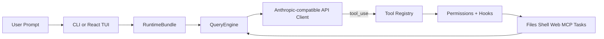

<h1 align="center">&nbsp; <code>oh</code> — EphemeralOS: Open Agent Harness</h1>

**EphemeralOS** delivers core lightweight agent infrastructure: tool-use, memory, and background subagents.

**Join the community**: contribute **Harness** for open agent development.

<p align="center">
  <a href="#-quick-start"></a>
  <a href="#-harness-architecture"></a>
  <a href="#-features"></a>
  <a href="#-test-results"></a>
  <a href="LICENSE"></a>
</p>

<p align="center">
  
  
  
  
  
  <a href="https://github.com/HKUDS/EphemeralOS/actions/workflows/ci.yml"></a>
  <a href="https://github.com/HKUDS/.github/blob/main/profile/README.md"></a>
  <a href="https://github.com/HKUDS/.github/blob/main/profile/README.md"></a>
</p>

One Command (**oh**) to Launch **EphemeralOS** and Unlock All Agent Harnesses. 

Supports CLI agent integration including nanobot, Cursor, and more.

<p align="center">
  
</p>

<p align="center">
  
</p>

---
## ✨ EphemeralOS's Key Harness Features

<table align="center" width="100%">
<tr>
<td width="20%" align="center" style="vertical-align: top; padding: 15px;">

<h3>🔄 Agent Loop</h3>

<div align="center">
  
</div>


<p align="center"><strong>• Streaming Tool-Call Cycle</strong></p>
<p align="center"><strong>• API Retry with Exponential Backoff</strong></p>
<p align="center"><strong>• Parallel Tool Execution</strong></p>
<p align="center"><strong>• Token Counting & Cost Tracking</strong></p>

</td>
<td width="20%" align="center" style="vertical-align: top; padding: 15px;">

<h3>🔧 Harness Tools</h3>

<div align="center">
  
</div>


<p align="center"><strong>• 36 built-in tools in one flat registry</strong></p>
<p align="center"><strong>• Runtime adds background task tools as needed</strong></p>
<p align="center"><strong>• Plugin Ecosystem (Hooks + Agents)</strong></p>

</td>
<td width="20%" align="center" style="vertical-align: top; padding: 15px;">

<h3>🧠 Context & Memory</h3>

<div align="center">
  
</div>


<p align="center"><strong>• CLAUDE.md Discovery & Injection</strong></p>
<p align="center"><strong>• Session Resume & History</strong></p>
<p align="center"><strong>• MEMORY.md Persistent Memory</strong></p>
<p align="center"><strong>• Runtime Context Injection</strong></p>

</td>
<td width="20%" align="center" style="vertical-align: top; padding: 15px;">

<h3>🛡️ Governance</h3>

<div align="center">
  
</div>


<p align="center"><strong>• Multi-Level Permission Modes</strong></p>
<p align="center"><strong>• Path-Level & Command Rules</strong></p>
<p align="center"><strong>• Interactive Approval Dialogs</strong></p>

</td>
<td width="20%" align="center" style="vertical-align: top; padding: 15px;">

<h3>🤝 Background Agents</h3>

<div align="center">
  
</div>


<p align="center"><strong>• Subagent Spawning & Delegation</strong></p>
<p align="center"><strong>• Background Task Lifecycle</strong></p>

</td>
</tr>
</table>

---

## 🤔 What is an Agent Harness?

An **Agent Harness** is the complete infrastructure that wraps around an LLM to make it a functional agent. The model provides intelligence; the harness provides **hands, eyes, memory, and safety boundaries**.

<p align="center">
  
</p>

EphemeralOS is an open-source Python implementation designed for **researchers, builders, and the community**:

- **Understand** how production AI agents work under the hood
- **Experiment** with cutting-edge tools and agent runtime patterns
- **Extend** the harness with custom plugins, providers, and domain knowledge
- **Build** specialized agents on top of proven architecture

---

## 📰 What's New

- **2026-04-01** 🎨 **v0.1.0** — Initial **EphemeralOS** open-source release featuring complete Harness architecture: 

<p align="center">
  <strong>Start here:</strong>
  <a href="#-quick-start">Quick Start</a> ·
  <a href="#-provider-compatibility">Provider Compatibility</a> ·
  <a href="docs/SHOWCASE.md">Showcase</a> ·
  <a href="CONTRIBUTING.md">Contributing</a> ·
  <a href="CHANGELOG.md">Changelog</a>
</p>

---

## 🚀 Quick Start

### Prerequisites

- **Python 3.10+** and [uv](https://docs.astral.sh/uv/)
- **Node.js 18+** (optional, for the React terminal UI)
- An LLM API key

### One-Command Demo

```bash
ANTHROPIC_API_KEY=your_key uv run oh -p "Inspect this repository and list the top 3 refactors"
```

### Install & Run

```bash
# Clone and install
git clone https://github.com/HKUDS/EphemeralOS.git
cd EphemeralOS
uv sync --extra dev

# Example: use Kimi as the backend
export ANTHROPIC_BASE_URL=https://api.moonshot.cn/anthropic
export ANTHROPIC_API_KEY=your_kimi_api_key
export ANTHROPIC_MODEL=kimi-k2.5

# Launch
oh                    # if venv is activated
uv run oh             # without activating venv
```

<p align="center">
  
</p>

### Non-Interactive Mode (Pipes & Scripts)

```bash
# Single prompt → stdout
oh -p "Explain this codebase"

# JSON output for programmatic use
oh -p "List all functions in main.py" --output-format json

# Stream JSON events in real-time
oh -p "Fix the bug" --output-format stream-json
```

## 🔌 Provider Compatibility

EphemeralOS supports two API formats: **Anthropic** (default) and **OpenAI-compatible** (`--api-format openai`). The OpenAI format covers a wide range of providers.

### Anthropic Format (default)

| Provider profile | Detection signal | Notes |
|------------------|------------------|-------|
| **Anthropic** | Default when no custom `ANTHROPIC_BASE_URL` is set | Default Claude-oriented setup |
| **Moonshot / Kimi** | `ANTHROPIC_BASE_URL` contains `moonshot` or model starts with `kimi` | Anthropic-compatible endpoint |
| **Vertex-compatible** | Base URL contains `vertex` or `aiplatform` | Anthropic-style gateways on Vertex |
| **Bedrock-compatible** | Base URL contains `bedrock` | Bedrock-style deployments |
| **Generic Anthropic-compatible** | Any other explicit `ANTHROPIC_BASE_URL` | Proxies and internal gateways |

### OpenAI Format (`--api-format openai`)

Any provider implementing the OpenAI `/v1/chat/completions` API works out of the box:

| Provider | Base URL | Example models |
|----------|----------|----------------|
| **Alibaba DashScope** | `https://dashscope.aliyuncs.com/compatible-mode/v1` | `qwen3.5-flash`, `qwen3-max`, `deepseek-r1` |
| **DeepSeek** | `https://api.deepseek.com` | `deepseek-chat`, `deepseek-reasoner` |
| **OpenAI** | `https://api.openai.com/v1` | `gpt-4o`, `gpt-4o-mini` |
| **GitHub Models** | `https://models.inference.ai.azure.com` | `gpt-4o`, `Meta-Llama-3.1-405B-Instruct` |
| **SiliconFlow** | `https://api.siliconflow.cn/v1` | `deepseek-ai/DeepSeek-V3` |
| **Groq** | `https://api.groq.com/openai/v1` | `llama-3.3-70b-versatile` |
| **Ollama (local)** | `http://localhost:11434/v1` | Any local model |

```bash
# Example: use DashScope
uv run oh --api-format openai \
  --base-url "https://dashscope.aliyuncs.com/compatible-mode/v1" \
  --api-key "sk-xxx" \
  --model "qwen3.5-flash"

# Or via environment variables
export EPHEMERALOS_API_FORMAT=openai
export OPENAI_API_KEY=sk-xxx
export EPHEMERALOS_BASE_URL=https://dashscope.aliyuncs.com/compatible-mode/v1
export EPHEMERALOS_MODEL=qwen3.5-flash
uv run oh
```

### Sandbox Defaults

Sandbox creation uses the provider default unless a sandbox default is configured.
Set the default image or snapshot in `~/.ephemeralos/settings.json`:

```json
{
  "sandbox": {
    "default_snapshot": "sweevo-psf-requests-3738",
    "default_image": "ghcr.io/example/sandbox:latest"
  }
}
```

`default_snapshot` takes precedence over `default_image` because Daytona treats
snapshot and image creation as different APIs. The same values can be supplied
with `EPHEMERALOS_SANDBOX_DEFAULT_SNAPSHOT` and
`EPHEMERALOS_SANDBOX_DEFAULT_IMAGE`.

---

## 🏗️ Harness Architecture

EphemeralOS implements the core Agent Harness pattern across the live backend and frontend runtime surfaces:

```
backend/src/
  engine/          # 🧠 Agent loop, streaming executor, background task lifecycle
  tools/           # 🔧 Built-in tools: sandbox, CI, context, memory, subagent
  skills/          # 📚 Skill registry internals and read-only API
  agents/          # 🤖 Agent definition loading, builder, registry, CRUD API
  server/          # 🌐 FastAPI app, SSE protocol, state snapshots
  sandbox/         # 🧪 Sandbox lifecycle, workspace discovery, credentials
  prompts/         # 📝 Runtime/system prompt assembly and capability awareness
  config/          # ⚙️ Settings, model resolution, paths
backend/config/
  agents/          # 🤖 Optional local agent definitions (empty by default)
  skills/          # 📚 Skill API and registry internals
frontend/
  web/             # 🖥️ React dashboard (agents, tools, sessions, sandboxes)
  terminal/        # 💬 Terminal UI components and backend session controls
```

### The Agent Loop

The heart of the harness. One loop, endlessly composable:

```python
while True:
    response = await api.stream(messages, tools)
    
    if response.stop_reason != "tool_use":
        break  # Model is done
    
    for tool_call in response.tool_uses:
        # Permission check → Hook → Execute → Hook → Result
        result = await harness.execute_tool(tool_call)
    
    messages.append(tool_results)
    # Loop continues — model sees results, decides next action
```

The model decides **what** to do. The harness handles **how** — safely, efficiently, with full observability.

### Harness Flow



---

## ✨ Features

### 🔧 Built-In Tool Surfaces

Current runtime inventory:

| Surface | Count | Description |
|--------|------:|-------------|
| `sandbox_operations` | 7 | Remote sandbox file I/O, atomic edits, semantic rename, and `daytona_shell` execution |
| `context_read` / `context_write` | 3 / 4 | File notes plus scope and staleness checks |
| `memory` | 3 | Exploration cache reuse and edit-history conflict prediction |
| `subagent` | 1 | `run_subagent` for bounded configured subagent work |
| Runtime `background` | 3 | `check_background_task_result`, `wait_background_tasks`, `cancel_background_task` |

Every tool has:
- **Pydantic input validation** — structured, type-safe inputs
- **Self-describing JSON Schema** — models understand tools automatically
- **Permission integration** — checked before every execution

### 📚 Skills System

Agents are not equipped with skill-loading tools by default, and the repo does
not ship built-in `SKILL.md` playbooks under `backend/config/skills/`.

### 🔌 Plugin System

**Compatible with [claude-code plugins](https://github.com/anthropics/claude-code/tree/main/plugins)**. Tested with 12 official plugins:

| Plugin | Type | What it does |
|--------|------|-------------|
| `commit-commands` | Commands | Git commit, push, PR workflows |
| `feature-dev` | Commands | Feature development workflow |
| `code-review` | Agents | Multi-agent PR review |
| `pr-review-agents` | Agents | Specialized PR review agents |

```bash
# Manage plugins
oh plugin list
oh plugin install <source>
oh plugin enable <name>
```

### 🤝 Ecosystem Workflows

EphemeralOS is useful as a lightweight harness layer around Claude-style tooling conventions:

- **Claude-style plugins** stay portable because EphemeralOS keeps those formats familiar.
- **Background subagent work** maps onto the built-in subagent and background execution primitives.

For concrete usage ideas instead of generic claims, see [`docs/SHOWCASE.md`](docs/SHOWCASE.md).

### 🛡️ Permissions

Multi-level safety with fine-grained control:

| Mode | Behavior | Use Case |
|------|----------|----------|
| **Default** | Ask before write/execute | Daily development |
| **Auto** | Allow everything | Sandboxed environments |
| **Plan Mode** | Block all writes | Large refactors, review first |

**Path-level rules** in `settings.json`:
```json
{
  "permission": {
    "mode": "default",
    "path_rules": [{"pattern": "/etc/*", "allow": false}],
    "denied_commands": ["rm -rf /", "DROP TABLE *"]
  }
}
```

### 🖥️ Terminal UI

React/Ink TUI with full interactive experience:

- **Command picker**: Type `/` → arrow keys to select → Enter
- **Permission dialog**: Interactive y/n with tool details
- **Mode switcher**: `/permissions` → select from list
- **Session resume**: `/resume` → pick from history
- **Animated spinner**: Real-time feedback during tool execution
- **Keyboard shortcuts**: Shown at the bottom, context-aware

### 📡 CLI

```
oh [OPTIONS] COMMAND [ARGS]

Session:     -c/--continue, -r/--resume, -n/--name
Model:       -m/--model, --effort
Output:      -p/--print, --output-format text|json|stream-json
Permissions: --permission-mode, --dangerously-skip-permissions
Context:     -s/--system-prompt, --append-system-prompt, --settings
Advanced:    -d/--debug, --mcp-config, --bare

Subcommands: oh mcp | oh plugin | oh auth
```

---

## 📊 Test Results

| Suite | Tests | Status |
|-------|-------|--------|
| Unit + Integration | 114 | ✅ All passing |
| CLI Flags E2E | 6 | ✅ Real model calls |
| Harness Features E2E | 9 | ✅ Retry, parallel, permissions |
| React TUI E2E | 3 | ✅ Welcome, conversation, status |
| TUI Interactions E2E | 4 | ✅ Commands, permissions, shortcuts |
| Real Plugins | 12 | ✅ claude-code/plugins |

```bash
# Run all tests
uv run pytest -q                           # 114 unit/integration
python scripts/test_harness_features.py     # Harness E2E
python scripts/test_real_skills_plugins.py  # Real plugins E2E
```

---

## 🔧 Extending EphemeralOS

### Add a Custom Tool

```python
from pydantic import BaseModel, Field
from ephemeralos.tools.base import BaseTool, ToolExecutionContext, ToolResult

class MyToolInput(BaseModel):
    query: str = Field(description="Search query")

class MyTool(BaseTool):
    name = "my_tool"
    description = "Does something useful"
    input_model = MyToolInput

    async def execute(self, arguments: MyToolInput, context: ToolExecutionContext) -> ToolResult:
        return ToolResult(output=f"Result for: {arguments.query}")
```

### Add a Plugin

Create `.ephemeralos/plugins/my-plugin/.claude-plugin/plugin.json`:

```json
{
  "name": "my-plugin",
  "version": "1.0.0",
  "description": "My custom plugin"
}
```

Add commands in `commands/*.md` and agents in `agents/*.md`.

---

## 🌍 Showcase

EphemeralOS is most useful when treated as a small, inspectable harness you can adapt to a real workflow:

- **Repo coding assistant** for reading code, patching files, and running checks locally.
- **Headless scripting tool** for `json` and `stream-json` output in automation flows.
- **Plugin testbed** for experimenting with Claude-style extensions.
- **Multi-agent prototype harness** for task delegation and background execution.
- **Provider comparison sandbox** across Anthropic-compatible backends.

See [`docs/SHOWCASE.md`](docs/SHOWCASE.md) for short, reproducible examples.

---

## 🤝 Contributing

EphemeralOS is a **community-driven research project**. We welcome contributions in:

| Area | Examples |
|------|---------|
| **Tools** | New tool implementations for specific domains |
| **Plugins** | Workflow plugins with commands and agents |
| **Providers** | Support for more LLM backends (OpenAI, Ollama, etc.) |
| **Agents** | Subagent workflows and background execution |
| **Testing** | E2E scenarios, edge cases, benchmarks |
| **Documentation** | Architecture guides, tutorials, translations |

```bash
# Development setup
git clone https://github.com/HKUDS/EphemeralOS.git
cd EphemeralOS
uv sync --extra dev
uv run pytest -q  # Verify everything works
```

Useful contributor entry points:

- [`CONTRIBUTING.md`](CONTRIBUTING.md) for setup, checks, and PR expectations
- [`CHANGELOG.md`](CHANGELOG.md) for user-visible changes
- [`docs/SHOWCASE.md`](docs/SHOWCASE.md) for real-world usage patterns worth documenting

---

## 📄 License

MIT — see [LICENSE](LICENSE).

---

<p align="center">
  
  <br>
  <strong>Oh my Harness!</strong>
  <br>
  <em>The model is the agent. The code is the harness.</em>
</p>

<div align="center">
  <a href="https://star-history.com/#HKUDS/EphemeralOS&Date">
    <picture>
      <source media="(prefers-color-scheme: dark)" srcset="https://api.star-history.com/svg?repos=HKUDS/EphemeralOS&type=Date&theme=dark" />
      <source media="(prefers-color-scheme: light)" srcset="https://api.star-history.com/svg?repos=HKUDS/EphemeralOS&type=Date" />
      
    </picture>
  </a>
</div>

<p align="center">
  <em> Thanks for visiting ✨ EphemeralOS!</em><br><br>
  
</p>
