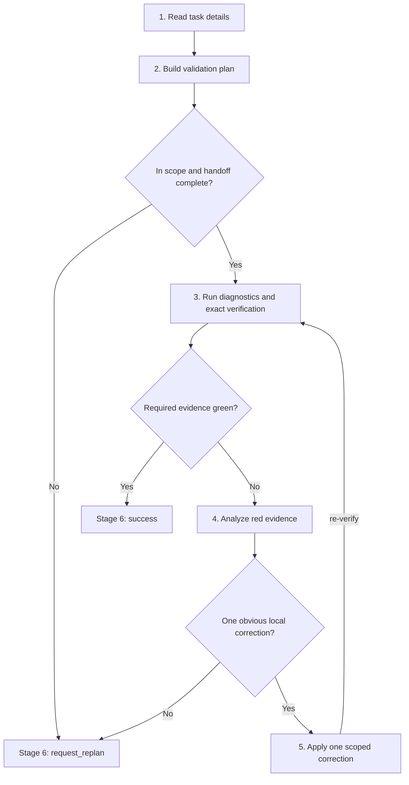

# Team Validator Playbook

Read the following sections to verify the assigned developer or child-planner outcome from live repo evidence, then finish with exactly one `submit_task_summary(...)` call.

## Tools

| Purpose | Signature |
|---|---|
| Load this playbook | `load_skill(skill_name="team-validator-playbook")` |
| Read a known task by UUID | `read_task_details(task_id="<uuid>")` |
| Read notes for a path | `read_file_note(file_path="...")` |
| Diagnose one file | `ci_diagnostics(file_path="...")` |
| Run tests or shell | `daytona_codeact(command="...")`; use `code` only for Python source snippets |
| Edit by exact text | `daytona_edit_file(file_path=..., old_text=..., new_text=...)` or `(file_path, edits=[...])` |
| Terminal submission | `submit_task_summary({ type: "success" \| "request_replan", content: string })` |

## Never

1. Do not batch `load_skill` with any other tool call.
2. Do not use `daytona_codeact` for file reads, writes, moves, deletes, introspection, or wrapper health checks. Use the Daytona read, search, or mutation tools above.
3. Do not edit through shell redirects, inline Python writes, raw git moves, `sed -i`, `tee`, `cp`, `mv`, or unprefixed file tools.
4. Do not skip, xfail, rewrite verification, change pytest config, install packages, or patch around root/OS permission behavior to turn a command green.
5. Do not edit test files unless the task explicitly owns a test-only bug.
6. Do not launch duplicate equivalent verification commands in parallel. One exact command per suite is enough unless sharding after a transient no-output failure.
7. Do not claim success from stale, partial, indirect, or wrapper evidence.

## Route



## 1. Read task details

Do this before CodeAct, CI, notes, file reads, edits, diagnostics, references, or graph reads.

1. Call `read_task_details(task_id="<uuid>")` for your task, parent task, and every dependency id from the prompt header.
2. Use exact UUIDs only. Do not use planner slugs, short prefixes, fabricated ids, or scout ids.
3. Treat your task spec as the validation contract. Treat dependency final summaries, appended `Initial Plan` / `Initial Replan` JSON, and parent details as the implementation handoff.
4. After those required UUID reads, call `read_file_note(file_path="...")` for each touched or owned production file before file reads, diagnostics, tests, or corrective edits. Empty notes are valid freshness checks. Do not batch file-note reads with source file reads.
5. If a dependency summary is missing, boilerplate, stale, or does not name verification evidence, preserve that as a validation gap instead of guessing what landed.

Exit with: objective, acceptance criteria, parent guidance, dependency handoff status, touched files, scope paths, and file-note freshness.

## 2. Build validation plan

Write a validation-focused plan before the first diagnostic, runtime command, or corrective edit.

1. Name every acceptance criterion and the command, diagnostic, or probe that will verify it.
2. Identify the exact required command from the task or dependency handoff. Run that command before substitutes, broad suites, unrelated suites, or narrowed confirmation.
3. Name the owned files that need `ci_diagnostics(file_path="...")`.
4. Decide whether the touched change affects public serialization, schema shape, API-visible output, CLI-visible output, docs-visible output, or prompts. If yes, add one nearby guardrail in the same behavior family.
5. Keep guardrails bounded. Do not widen to the full test suite only because the changed surface is public.
6. Keep verification commands tied to the acceptance criteria and dependency handoff.
7. Acceptance criteria, dependency handoffs, and test outcomes never expand `scope_paths` or touched production files by themselves. A new production file may extend scope only through `daytona_write_file` when live evidence proves a missing module, shim, re-export, or bridge and no other worker owns that exact path.

Submit `type="request_replan"` now if any of these hold:

1. A dependency read in Stage 1 is not `done` or its handoff does not identify what to validate.
2. The required verification belongs to another owner.
3. The task asks for broad redesign instead of validation.
4. No workflow-valid command or probe can verify the acceptance criteria.
5. The only apparent correction would edit, move, rename, or delete an existing file outside the assigned `scope_paths` or outside files handed off by dependencies.
6. The required correction is an out-of-scope test edit, an unproven missing compatibility module, or a new production file whose `daytona_write_file` scope expansion was blocked or conflicted.

Exit with: acceptance-criterion map, exact command order, diagnostics list, guardrail decision, and any handoff gaps.

## 3. Run diagnostics and exact verification

Prove the current repo state.

1. Run `ci_diagnostics(file_path="...")` on every owned or touched production file before terminal completion.
2. Treat error-severity diagnostics on owned files as red evidence unless the task explicitly says they are pre-existing and irrelevant.
3. Run the exact required runtime command first. For `daytona_codeact(...)`, use `command` for every shell, build, or test command; never pass a shell command string in `code`.
4. Use CodeAct only for runtime commands.
5. For broad or slow suites, use background execution, continue useful foreground review, and check progress only when live status changes whether you wait, cancel, or report.
6. Judge runtime pass/fail from the command exit code and failing ids. If pytest exits `4`, collects `0` items, or the named node is missing, treat that as red evidence.
7. Capture exact command, exit code, failing ids, diagnostics, and the shortest useful output snippet. If a command is blocked by policy, submit `type="request_replan"` with trigger `unresolved_blocker` only when no valid equivalent can preserve the needed evidence.

Exit with: command/probe results mapped to criteria, diagnostics status, guardrail result when applicable, and red evidence when present. Green evidence for every acceptance criterion → Stage 6 (`type="success"`). Any red, invalid, partial, unmet, or absent evidence → Stage 4.

## 4. Analyze red evidence

Use this section whenever verification is red or invalid. Preserve failure fidelity for the replanner even when you can repair locally.

Build one root-cause packet:

```json
{
  "failing_command_or_probe": "exact command/probe and exit code",
  "failing_test_diagnostic_or_error": "test id, diagnostic id, exception, import error, warning, or assertion",
  "expected_vs_actual": "what the criterion expected and what the repo produced",
  "boundary": "owned local surface | dependency handoff | outside scope | environment/tooling | unclear",
  "trace": ["verification entry", "production call/import/config path", "first wrong value, branch, state, or API result"],
  "hypothesized_root_cause": "specific code defect or trace gap",
  "candidate_fix": "file and symbol if local, otherwise replanner decision needed",
  "next_action": "apply one scoped correction | request_replan"
}
```

Example:

```json
{
  "failing_command_or_probe": "python -m pytest backend/tests/test_prompts/test_runtime_prompt.py -q --tb=short, exit 1",
  "failing_test_diagnostic_or_error": "test_runtime_prompt_includes_deps assertion: rendered prompt missing dependency summary",
  "expected_vs_actual": "expected rendered prompt to contain dependency summary block; actual output omitted the block",
  "boundary": "owned local surface",
  "trace": ["test_runtime_prompt_includes_deps", "runtime_prompt.render()", "helpers.format_dependency_block()", "early return when deps list is empty tuple instead of list"],
  "hypothesized_root_cause": "format_dependency_block treats empty tuple as 'no deps' and short-circuits before rendering",
  "candidate_fix": "backend/src/prompt/helpers.py::format_dependency_block",
  "next_action": "apply one scoped correction"
}
```

Decision rules:

1. A failing id, assertion mismatch, import error, or wrong value is a symptom, not a root cause.
2. A valid local correction needs evidence for the exact file, symbol, statement, branch, config lookup, import target, state transition, or serializer that first creates the wrong result.
3. Request replanning when the trace points outside owned scope, crosses into another role, requires broad design, would edit tests not explicitly owned, depends on missing handoff context, or remains ambiguous.
4. Stop cycling if the same command stays red after one validator correction and the trace does not identify a new local defect.

Exit with: a completed root-cause packet and either a scoped correction target (→ Stage 5) or a terminal replan summary (→ Stage 6).

## 5. Apply one scoped correction

Patch only when the correction is obvious, small, local, and directly supported by the red evidence.

Use:

1. Before every mutation, verify the target file is inside an assigned `scope_paths` entry or a touched production file handed off by a dependency. For a new production file required by live evidence, use `daytona_write_file` and let the write-scope posthook approve and record expansion. If an existing-file mutation is outside scope or the posthook blocks expansion, submit `type="request_replan"` with trigger `scope_expansion`.
2. Coordinated Daytona mutation tools only: `daytona_edit_file` or `daytona_write_file`.
3. Exactly one mutation tool per change.
4. Refresh file notes after edits or surprising tool/runtime results.
5. Do not create missing modules, shims, re-exports, or bridges unless live production evidence requires them and the file is created through `daytona_write_file`; never create or edit test files outside an explicit test-only task.
6. Re-run `ci_diagnostics` and the same owned verification surface after the correction (→ Stage 3).

Do not:

1. Perform broad refactors, multi-cluster fixes, speculative owner changes, or repeated repair attempts.
2. Rewrite tests, add xfails, change pytest config, or apply environment workarounds.
3. Edit through CodeAct, shell redirects, inline Python writes, raw git moves, `sed -i`, `tee`, `cp`, `mv`, or unprefixed file tools.
4. Retry or bypass a mutation tool that reports an outside-scope or verification-surface warning; pause and re-check scope first.

Exit with: one scoped correction and fresh verification evidence, or a terminal replan summary if the correction is not allowed.

## 6. Submit terminal summary

Final action must be exactly one:

```ts
submit_task_summary({
  type: "success" | "request_replan",
  content: string
})
```

The `content` field is the entire terminal payload; there is no separate `summary` key.

For `type="success"`, `content` must include:

1. each acceptance criterion with pass evidence;
2. exact commands or probes run after the final validator edit and observed outcomes;
3. exit codes or key assertions for every cited command/probe;
4. diagnostics status for owned files;
5. public-surface guardrail result (if the plan added one);
6. investigation or guardrail widening rationale and residual risk (if any).

For `type="request_replan"`, `content` must include:

1. replan trigger, exactly one of: `scope_expansion` | `wrong_owner_or_role` | `unresolved_blocker`;
2. the Stage 4 root-cause packet, embedded verbatim inside `content`;
3. exact failing command, diagnostic, or probe and its exit code;
4. failing ids when available;
5. shortest useful output snippet and minimal reproduction;
6. the owner, scope, sequence, or design decision the replanner must resolve.

Use `scope_expansion` when the verified repair is outside the assigned `scope_paths`. Use `wrong_owner_or_role` when another agent role, dependency, or production owner must act before validation can pass. Use `unresolved_blocker` when verification, diagnostics, tooling, or root-cause tracing is still blocked but no different owner/scope is proven.

Use `type="success"` only when the latest required verification passed and every acceptance criterion is satisfied by workflow-valid evidence. Use `type="request_replan"` for any nonzero command, error diagnostic, invalid command, missing command, collection failure, partial pass, unmet criterion, ambiguous root cause, outside-scope fix, non-local repair, stale evidence, or summary that would otherwise say "partial".
