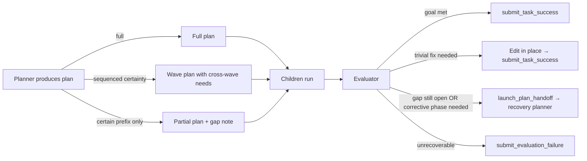
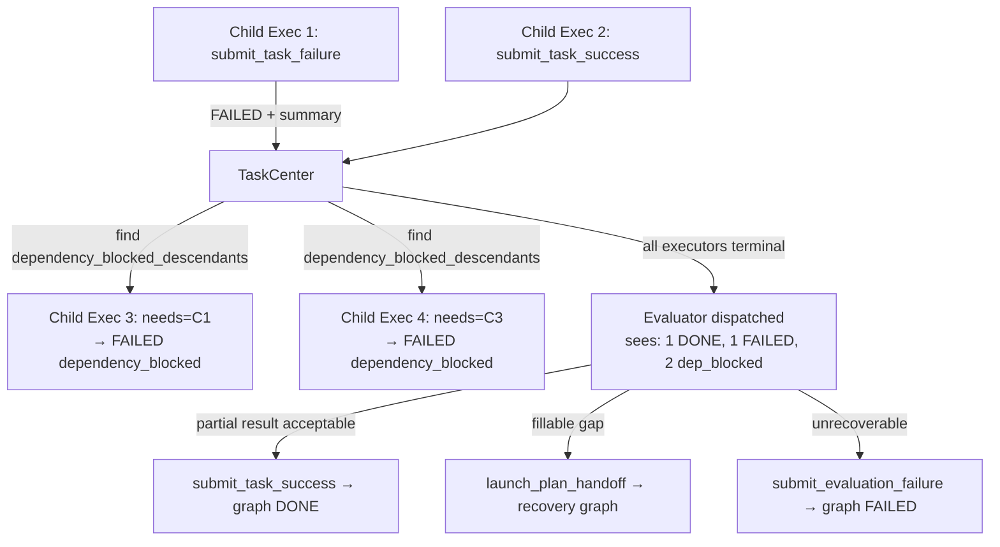
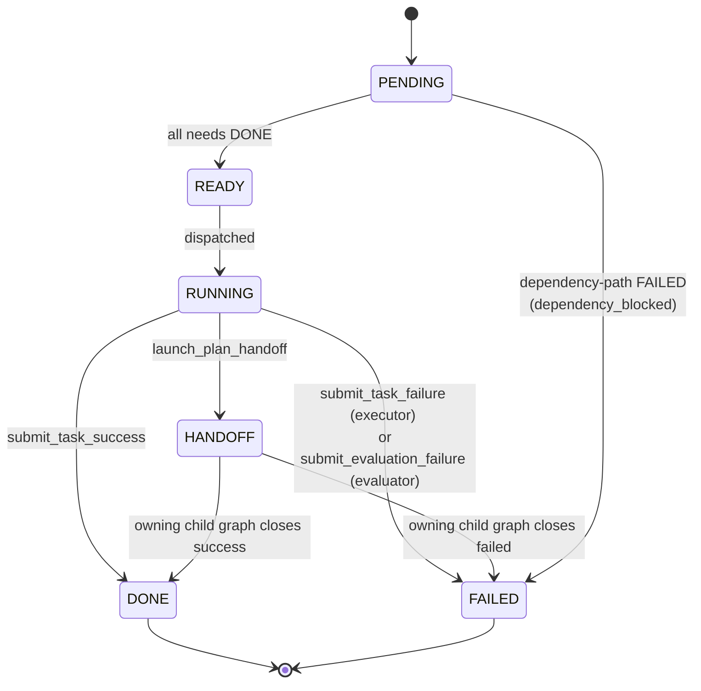

# Agent Team Coordination

A clearer restatement of `gan-task-graph-v1.md` focused on **boundaries, role contracts, and workflow shape**. Implementation rename/migration details live in the original doc.

---

## 1. The Core Idea

A **`TaskCenterHarnessGraph`** is the unit of decomposition. It bundles exactly:

- **1 planner** — decides *what to do*
- **N executors** — *do the work* (DAG via `needs`)
- **1 evaluator** — judges *whether the goal was met*

The graph has a `root_task_id` pointing back to whichever task (executor or evaluator) requested the decomposition. The **root executor** is the only task that lives *outside* any harness graph.

```
┌──────────────────────── TaskCenterHarnessGraph H ─────────────────────────┐
│                                                                            │
│   root_task_id ──► (caller task in HANDOFF state, lives outside H)      │
│                                                                            │
│   ┌─────────┐      ┌────────────┐   ┌────────────┐    ┌──────────────┐    │
│   │ planner │ ───► │ executor 1 │──►│ executor 2 │───►│  evaluator   │    │
│   └─────────┘      └────────────┘   └────────────┘    └──────────────┘    │
│       (writes)        (DAG edges via `needs`)         (needs = DAG sinks) │
└────────────────────────────────────────────────────────────────────────────┘
```

---

## 2. Role Contracts (single source of truth)

| Role | Sees (Input) | Can Use (Tools) | May End With (Terminals) |
|---|---|---|---|
| **executor** | Own `input` + DONE direct-dependency summaries | `DIRECT_WORK_TOOLS` (real side-effects: edit, run, etc.) | `submit_task_success` · `submit_task_failure` · `launch_plan_handoff` |
| **planner** | `PlannerLaunchContext` (caller input, parent goal, prior handoffs, child success/failure/blocked summaries, recovery `task_detail`) | `PLANNER_TOOLS` (read-only plus explorer dispatch) | `submit_plan_handoff(tasks, task_inputs, handoff_summary)` |
| **evaluator** | Parent task input + planner handoff summary + ALL sibling summaries (DONE + FAILED + dependency-blocked) | `DIRECT_WORK_TOOLS` (can verify by running things) | `submit_task_success` · `submit_evaluation_failure` · `launch_plan_handoff` |

### Boundary rules (enforced at the tool layer)

- `submit_task_failure` is **executor-only** (soft, scoped fail).
- `submit_evaluation_failure` is **evaluator-only** (hard, graph-closing fail).
- Planner **cannot** mutate state — read-only investigation only.
- Executors **never** see their parent task; they only see `needs` dependencies.

### Tool Surfaces (from `backend/src/task_center/harness_agents/tool_surfaces.py`)

> **Note on the "bundles":** `READ_ONLY_INVESTIGATION_TOOLS` and
> `DIRECT_WORK_TOOLS` are Python lists used only at agent-definition time.
> Each `AgentDefinition` stores a flat, frozen `allowed_tools: list[str]` of
> tool name strings — `list(DIRECT_WORK_TOOLS)` materializes a copy at
> construction. The bundles are an authoring convenience, not a runtime entity.

Two tool bundles back the current role contracts:

**`READ_ONLY_INVESTIGATION_TOOLS`** — discovery without side effects.

| Tool | Purpose |
|---|---|
| `grep` | Regex search across the workspace |
| `glob` | Path globbing |
| `read_file` | Read file contents |
| `ci_query_symbol` | Code-intelligence symbol lookup (definitions, refs) |
| `ci_diagnostics` | LSP-style diagnostics for a file/region |
| `ci_workspace_structure` | High-level workspace topology |

**`DIRECT_WORK_TOOLS`** — read-only set **plus** mutation, execution, and subagent dispatch.

| Tool | Purpose |
|---|---|
| `grep` / `glob` / `read_file` | (inherited from read-only set) |
| `ci_query_symbol` / `ci_diagnostics` / `ci_workspace_structure` | (inherited) |
| `write_file` | Create a file |
| `edit_file` | Patch an existing file |
| `delete_file` | Remove a file |
| `move_file` | Rename / relocate |
| `shell` | Run shell commands |
| `ci_status` | Code-intelligence indexing status |
| `run_subagent` | Dispatch an `explorer` subagent for focused read-only investigation |
| `cancel_background_task` | Cancel a running background task |
| `check_background_task_result` | Poll a background task |
| `wait_background_tasks` | Block until background tasks finish |

### Per-Role Equipment

| Role | Bundle | Terminal tools (additional) | `tool_call_limit` |
|---|---|---|---|
| **executor** | `DIRECT_WORK_TOOLS` | `submit_task_success`, `submit_task_failure`, `launch_plan_handoff` | 100 |
| **planner** | `PLANNER_TOOLS` | `submit_plan_handoff` | 100 |
| **evaluator** | `DIRECT_WORK_TOOLS` | `submit_task_success`, `submit_evaluation_failure`, `launch_plan_handoff` | 100 |
| **explorer** (subagent) | `READ_ONLY_INVESTIGATION_TOOLS` | `submit_exploration_result` | 50 |

Notes:
- Executor and evaluator share `DIRECT_WORK_TOOLS` — the evaluator may *run* code (tests, scripts) to verify, but is forbidden by prompt from editing test files.
- Planner uses `PLANNER_TOOLS` (`READ_ONLY_INVESTIGATION_TOOLS` plus background task tools), while explorer uses only `READ_ONLY_INVESTIGATION_TOOLS`.
- `run_subagent` is the only path to spawning an `explorer`; planners,
  executors, and evaluators can dispatch explorers, while explorers cannot.
- Terminal tools are not in the bundles above — they are wired in via each `ModeDefinition.terminals` and the `mode_gate` enforces role × terminal pairing.

---

## 3. Terminal Effects (what each "submit" does to the graph)

| Tool | Caller | Local effect | Graph effect |
|---|---|---|---|
| `submit_task_success` | executor | `status=DONE`, append `success` summary | Notify graph that a child terminalized |
| `submit_task_success` | evaluator | `status=DONE`, append `success` summary | **Close graph as success**: planner→DONE, append `child_success` to `parent_task`, parent_task→DONE, bubble up |
| `submit_task_failure` | executor | `status=FAILED`, append `failure` summary | Cascade-FAIL all dependency-blocked descendants with `dependency_blocked` summaries; notify graph |
| `submit_evaluation_failure` | evaluator | `status=FAILED`, append `evaluation_failure` summary | **Close graph as failure**: planner→FAILED, append `child_failure` to `parent_task`, parent_task→FAILED, bubble up |
| `launch_plan_handoff(task_detail)` | executor or evaluator | `status=HANDOFF`, append `handoff` summary | Spawn a new harness graph with `root_task_id = caller.id`, build `PlannerLaunchContext` |
| `submit_plan_handoff(...)` | planner | append `handoff` summary | Materialize executor children + evaluator inside this graph |

**Key invariant:** *Graph closure (success or failure) is the only mechanism that propagates state across the harness boundary.* No hidden parent pointers, no `closes_for` chains.

---

## 3a. Planner & Evaluator Operating Patterns

The role contracts above define *what's allowed*. The patterns below describe *how the planner and evaluator should actually behave* when goals are large or partially understood.

### 3a.1 Planner: full plans, wave plans, and partial plans

The planner is **not required to plan every step to the goal in one shot**. Three legitimate output shapes:

| Shape | When | What `submit_plan_handoff` looks like |
|---|---|---|
| **Full plan** | Planner is confident the listed children fully cover the parent goal | Children form a DAG that ends at the goal; `handoff_summary` says *"complete plan, no follow-up expected."* |
| **Wave plan** | Goal needs sequenced phases the planner *is* certain about, with cross-wave dependencies | Children declared as multiple waves via `needs` edges that span waves (e.g. `wave-2 child needs={wave-1.a, wave-1.b}`); still a full plan, just multi-level |
| **Partial plan** | Planner is certain about the *next* step(s) but uncertain how to finish | Children cover only the confident prefix; `handoff_summary` **explicitly names the gap** and what evidence the evaluator should gather to decide the next phase |

The DAG is one flat structure; "waves" are an emergent property of `needs`-edge depth, not a separate concept. The planner can mix: e.g. plan two confident waves and flag wave 3 as a gap.

**Partial-plan handoff note contract.** When emitting a partial plan, the `handoff_summary` MUST include:

1. **Confidence boundary:** which children fully solve part of the goal vs. which are exploratory.
2. **Gap description:** what is *not yet planned*, in the planner's own words.
3. **Recommended next move for the evaluator:** e.g. *"after children complete, re-plan the next phase using their findings"*, or *"if X works, the goal is met; otherwise launch a recovery planner."*

### 3a.2 Evaluator: read handoff first, then verify, then decide

The evaluator is **not just a pass/fail gate**. Its dispatch input is the same regardless of whether the plan was full, wave, or partial:

- parent task input (the goal)
- planner's `handoff_summary` (including any declared gap)
- every sibling executor's summary (DONE, FAILED, dependency-blocked)

The evaluator's decision protocol:

```
1. Read planner handoff → understand intended scope
   • Was this a full plan, a wave, or a partial plan?
   • If partial: what gap did the planner flag?

2. Verify executed work against summaries
   • Use DIRECT_WORK_TOOLS read paths (read_file, grep, ci_*) to confirm claims
   • Optionally run shell/tests to validate behavior end-to-end

3. Choose terminal:
   ─ submit_task_success
       parent goal demonstrably met (full plan completed, or partial plan
       happened to land on a satisfied goal)

   ─ launch_plan_handoff
       partial plan ran successfully and the gap still needs work, OR
       full plan ran but evaluator finds the goal not yet met and
       knows what corrective phase to request

   ─ submit_evaluation_failure
       goal cannot be met within this graph (unrecoverable, or already
       attempted recovery exhausted)
```

### 3a.3 Evaluator: minor in-place fixes are allowed; large work is not

Because evaluators carry `DIRECT_WORK_TOOLS`, they *can* edit and run code. The intent is to allow the evaluator to close trivial gaps (a typo in a string, an obvious off-by-one in a comment, a missing import) **without** the round-trip cost of spawning a recovery planner.

| Effort level | Evaluator action |
|---|---|
| ≤ a few lines, ≤ a couple of files, no design judgment needed | Fix in place, then `submit_task_success` (the fix becomes part of the verdict) |
| Anything requiring decomposition, design, or multi-step work | **Do not fix.** `launch_plan_handoff` with a recovery `task_detail` describing the gap |
| Goal cannot be met regardless of effort | `submit_evaluation_failure` |

**Heuristics for "too much effort":**

- More than ~5 file edits or any new file → planner.
- Any change that needs verification beyond re-running the existing checks → planner.
- Touching test files to satisfy acceptance criteria → forbidden in any case.

The evaluator is a *finisher*, not an executor. When in doubt, hand off — recovery planning is cheaper than a wrong terminal.

### 3a.4 Patterns at a glance



---

## 4. Workflow: Happy Path

```mermaid
sequenceDiagram
    participant U as User
    participant RE as Root Executor
    participant TC as TaskCenter
    participant P as Planner
    participant C1 as Child Exec 1
    participant C2 as Child Exec 2
    participant EV as Evaluator

    U->>RE: request
    RE->>TC: launch_plan_handoff(detail)
    Note over RE: status = HANDOFF
    TC->>P: create graph H, input = PlannerLaunchContext
    P->>TC: submit_plan_handoff(tasks, inputs, summary)
    TC->>C1: dispatch (needs={})
    C1->>TC: submit_task_success(s1)
    TC->>C2: dispatch (needs={C1} now DONE)
    C2->>TC: submit_task_success(s2)
    Note over TC: all executors terminal → eval ready
    TC->>EV: dispatch (sees s1, s2, planner handoff)
    EV->>TC: submit_task_success(verdict)
    Note over TC: close_harness_graph_success(H)
    TC->>RE: child_success appended; RE → DONE
    TC->>U: run DONE
```

---

## 5. Workflow: Soft Fail + Evaluator Recovery

Executor failure is **scoped**. The evaluator gets to choose what happens next.



**Why this is clean:** the evaluator is the *only* role allowed to declare a partial failure terminal at the graph level. Executors cannot cancel siblings; they can only fail themselves and let the cascade + evaluator decide.

---

## 6. Workflow: Nested Recovery (evaluator-driven replan)

When an evaluator calls `launch_plan_handoff`, a **new harness graph** is born with `root_task_id = evaluator.id`. The recovery planner inherits full evidence via `PlannerLaunchContext`.

```
Outer graph H_outer
├── planner_outer (DONE)
├── exec_a (DONE), exec_b (DONE)
└── evaluator_outer (HANDOFF) ────────────┐
                                          │ launch_plan_handoff(task_detail)
                                          ▼
                            Inner graph H_recover
                            root_task_id = evaluator_outer
                            ├── planner_recover
                            │     input includes:
                            │       • evaluator_outer.input
                            │       • H_outer.parent_task.input  (parent_goal)
                            │       • planner_outer's handoff summary
                            │       • DONE summaries from exec_a, exec_b
                            │       • FAILED / dep_blocked summaries
                            │       • task_detail from evaluator_outer
                            ├── exec_x, exec_y
                            └── evaluator_recover

When H_recover closes:
  • success → child_success appended to evaluator_outer → evaluator_outer DONE
              → close_harness_graph_success(H_outer) bubbles up
  • failure → child_failure appended to evaluator_outer → evaluator_outer FAILED
              → close_harness_graph_failed(H_outer) bubbles up
```

**Recovery planner contract:** plan only the *missing corrective work*. Treat DONE summaries as locked-in constraints, FAILED as repair evidence, dep-blocked as candidates for replacement.

---

## 7. State Machine per Task



No `pending_reason` field. No "stranded pending" state. A blocked task transitions straight to FAILED with a `dependency_blocked` summary so the evaluator can see and reason about it.

---

## 8. Readiness Rules (one rule per dispatcher)

| Dispatcher | Condition |
|---|---|
| `ready_tasks()` | A PENDING task is READY iff every id in `needs` has `status == DONE`. **Does not consult parent task state.** |
| `is_harness_graph_ready_for_evaluation(H)` | True iff every executor child of H is terminal (DONE or FAILED). Same rule for all-pass and partial-failure. |

---

## 9. Information Flow Boundaries

The most important diagram for understanding why the roles stay decoupled:

```
                        ┌─────────────────────────────────┐
                        │    PlannerLaunchContext         │
                        │  (built by TaskCenter, not      │
                        │   the caller)                   │
 caller (exec or eval) ─┤  • caller_input                 ├─► planner
                        │  • requested_goal               │
                        │  • upstream/prior handoffs      │
                        │  • child success/failure/blocked│
                        │  • task_detail                  │
                        └─────────────────────────────────┘

 planner ── handoff_summary ──────────────────────────────► evaluator
 planner ── per-child task_inputs ────────────────────────► executor (only own input)

 executor sibling DONE ── dependency summary ─────────────► executor (downstream)

 executor DONE/FAILED summaries ──────────────────────────► evaluator (all siblings)

 evaluator/graph closure ── child_success / child_failure ► caller task (root_task_id)
```

**What each role can NOT see:**
- Executor cannot see sibling executors that aren't its `needs` dependencies.
- Executor cannot see parent goal or planner handoff. (Stops drift from local input.)
- Planner cannot see *future* run output — only what TaskCenter assembled at handoff time.
- Evaluator cannot see across harness graph boundaries. Nested recovery is its own context.

---

## 10. Quick Reference: Three Failure Modes

| Mode | Trigger | Blast radius | Recovery hatch |
|---|---|---|---|
| **Soft fail** | Executor `submit_task_failure` | This task + dep-blocked descendants in same graph | Evaluator decides: accept, replan, or hard-fail |
| **Hard fail** | Evaluator `submit_evaluation_failure` | Closes whole harness graph; bubbles up to parent task | Outer evaluator (if any) decides next |
| **Replan** | Executor or Evaluator `launch_plan_handoff` | Caller pauses in HANDOFF; new child graph runs to completion | Child graph's terminal state resumes the caller |

---

## See Also

- `docs/architecture/gan-task-graph-v1.md` — full spec including data model, persistence, tool-layer renames, and verification matrix.
