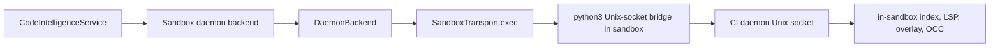

# Phase 5 — process.exec-backed daemon default: Implementation Report

Status: corrected on 2026-05-03.

## Verdict

Phase 5 originally tried to promote code-intelligence daemon command into a first-class sandbox transport verb. That branch has been removed.

The final implementation keeps the simpler and faster path: every code-intelligence daemon request crosses the sandbox boundary through `process.exec`, using the Python Unix-socket bridge owned by `DaemonBackend`.

The key finding from Phase 3.5/3.6 and the Phase 5 live comparison is that the retired native verb was not a true transport improvement. In Daytona it still wrapped `process.exec`, added another abstraction layer, and measured slower/noisier than the direct shim.

## Final active architecture



## Files changed by the correction

| File | Change |
| --- | --- |
| `backend/src/sandbox/api/transport.py` | Removed the code-intelligence-specific daemon command method from the transport protocol. |
| `backend/src/sandbox/daytona/transport.py` | Removed the Daytona native bridge wrapper and inline bridge template. |
| `backend/src/sandbox/code_intelligence/backends/` | Removed provider-capability and forced-shim branching; `_call_once` now always uses the process.exec-backed Python socket bridge. |
| `backend/tests/test_sandbox/test_code_intelligence/test_daemon_client_process_exec.py` | Kept daemon command framing, retry, and daemon-unavailable coverage; removed native-verb selection tests. |
| `backend/tests/test_sandbox/test_daytona_transport.py` | Removed Daytona native-verb tests. |
| `backend/tests/test_e2e/test_live_ci_phase5_default_on.py` | Removed native-vs-shim live A/B measurement; retained daemon-default, warm query, concurrent query, and cross-phase regression coverage. |
| `docs/architecture/code-intelligence-in-sandbox-daemon/phase-05-process-exec-daemon-default.md` | Replaced the retired native-verb rollout plan with the process.exec-backed daemon-default contract. |
| `docs/architecture/code-intelligence-in-sandbox-daemon/overview.md` | Updated the phase index and risk summary to match the corrected transport decision. |

## Why the deletion is correct

The native verb did not remove the expensive operation. It moved the Python socket bridge from `DaemonBackend` into Daytona transport code, but the Daytona implementation still launched a command through `process.exec`. That means the expected optimization target remained in the path while the codebase gained:

1. A wider transport protocol.
2. Provider-specific code-intelligence API surface.
3. Runtime path selection.
4. A forced-shim feature flag.
5. Dedicated A/B tests for two wrappers over the same primitive.

Deleting that branch makes the boundary more honest: code-intelligence is using `process.exec` today. Future work can optimize the real bottleneck through batching or true persistent transport, not a same-cost wrapper.

## Verification status

Before this correction, the broader Phase 0-8 review pass ran the targeted unit/static/live checks for the sandbox daemon path and surfaced the Phase 5 transport finding.

After this correction, the intended focused verification set is:

```bash
uv run pytest backend/tests/test_sandbox/test_code_intelligence/test_daemon_client_process_exec.py backend/tests/test_sandbox/test_daytona_transport.py -q
uv run pytest backend/tests/test_e2e/test_live_ci_phase5_default_on.py -q -m live
```

This report records the intended verification scope, but the correction itself should be verified in a fresh run before commit if required by the current workflow.

## Follow-up performance direction

If `process.exec` remains the hot-path floor, the next useful options are:

1. Batch more service operations into single daemon commands.
2. Keep expensive index/LSP/overlay work in the daemon so one boundary crossing does more work.
3. Measure provider-native persistent streams only if they avoid command launch overhead.
4. Avoid adding transport methods that only wrap `process.exec` internally.
