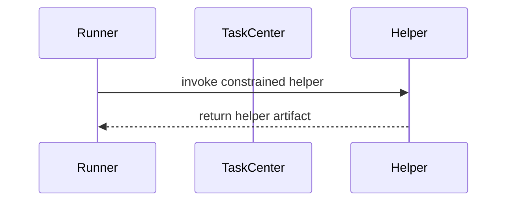

# Ephemeral Agents

An ephemeral agent is a short-lived helper run that produces one constrained artifact from frozen worker transcript evidence. It does not mutate the task graph directly.

## Current Use

Ephemeral agents remain available as short-lived helper runs, but the team
runtime no longer uses a builtin note-taking checkpoint helper.

## Properties

- Uses a narrow system prompt and constrained tool surface.
- Produces one constrained helper artifact.
- Does not interrupt the primary agent.
- Does not pause, cancel, or resume tasks.
- Leaves all graph mutations to TaskCenter and terminal submission handling.

## Flow

