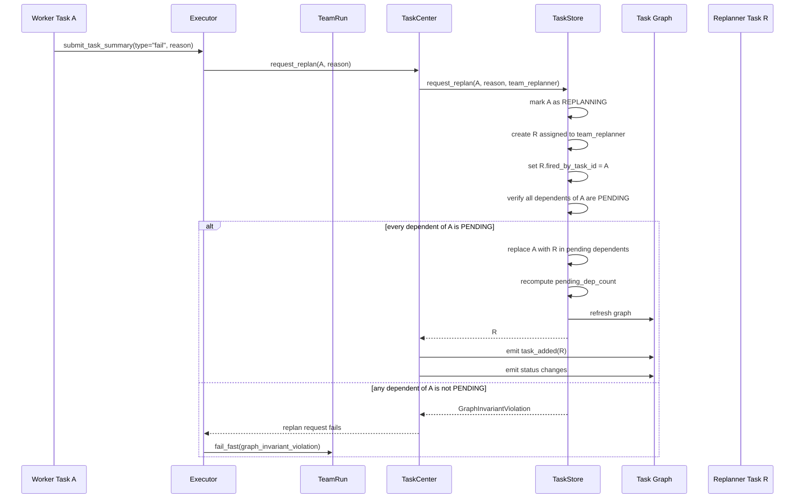
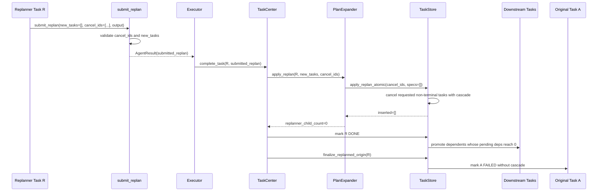
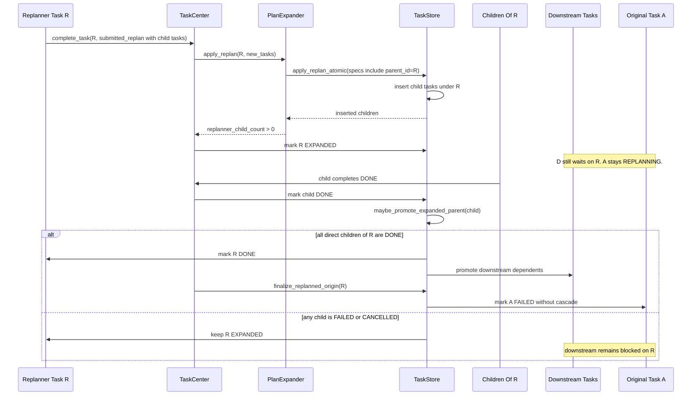
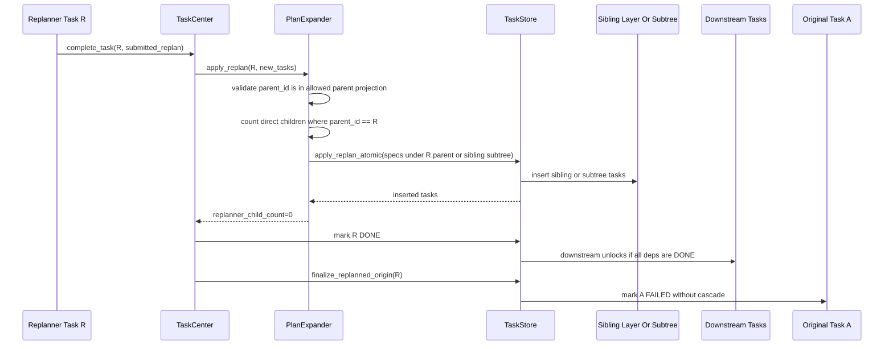
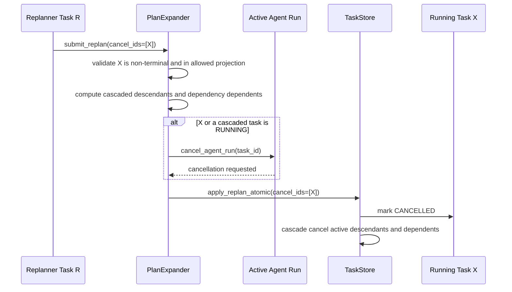
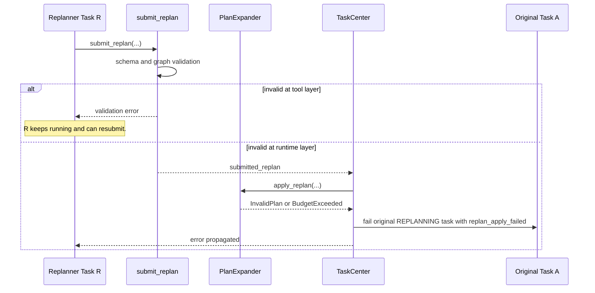
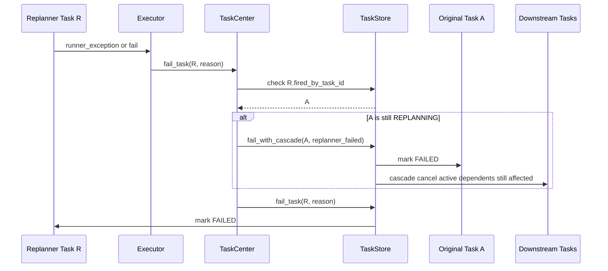

# Replan Workflow Sequence Diagrams

This document shows the task replanning lifecycle for the main runtime scenarios.
The current `submit_replan` payload is:

- `new_tasks`
- `cancel_ids`
- `output`

`team_replanner` is a normal expandable task. When original task `A` fails, `A`
moves to `REPLANNING`, replanner task `R` is created, and pending task graph
nodes that depended on `A` are rewired to depend on `R`. Any dependent of `A`
with a non-pending status is a graph invariant violation.

The scheduler invariant is strict: a task can be `READY` or `RUNNING` only when
all dependencies are `DONE`.

## 1. Failure Creates A Replanner

The executor routes failure through `TaskCenter.request_replan` because the
executor only interprets the agent's terminal submission. TaskCenter owns the
task lifecycle boundary: replan budget checks, replanner selection, event
emission, and the atomic TaskStore mutation that creates `R` and rewires
pending dependents. A graph invariant violation is fatal; the executor fails
the team run immediately instead of treating it as a retryable worker error.

## 2. Replanner Submits No Direct Children

## 3. Replanner Creates Direct Children

## 4. Replanner Adds Sibling Or Subtree Tasks Only

Sibling-layer or sibling-subtree additions do not make `R` `EXPANDED`. Only
direct children of `R` do.

## 5. Replanner Cancels A Running Task

Active runner cancellation is requested before the task is marked cancelled in
storage.

## 6. Invalid Replan Submission

Tool-layer validation is recoverable inside the replanner turn. Runtime apply
failure fails the original replanning task so it cannot remain stuck.

## 7. Replanner Fails

A successful replanner finalizes `A` without cascade. A failed replanner fails
the recovery path.
