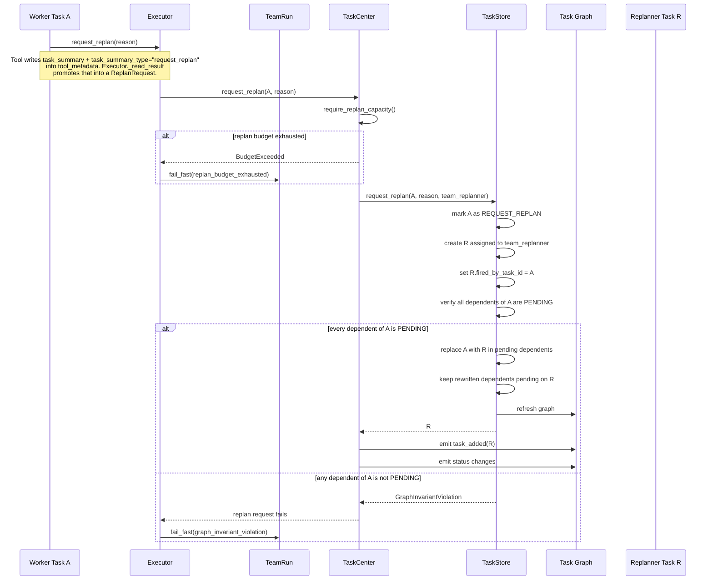
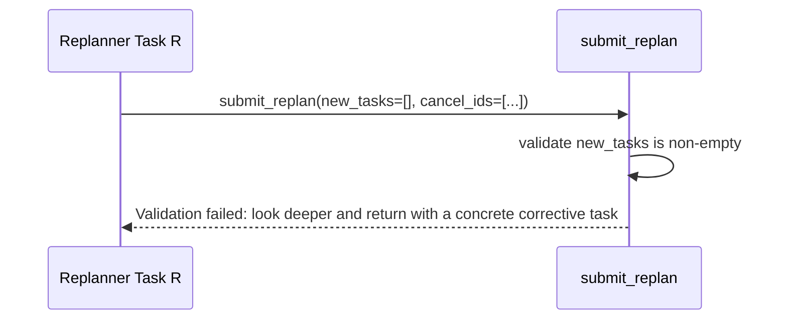
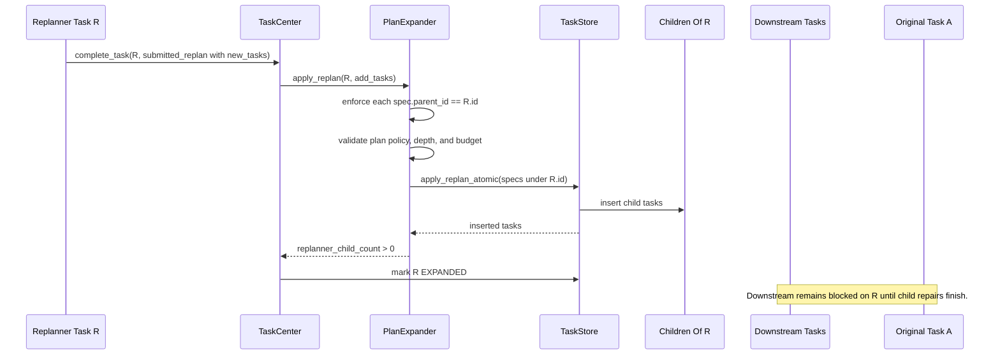
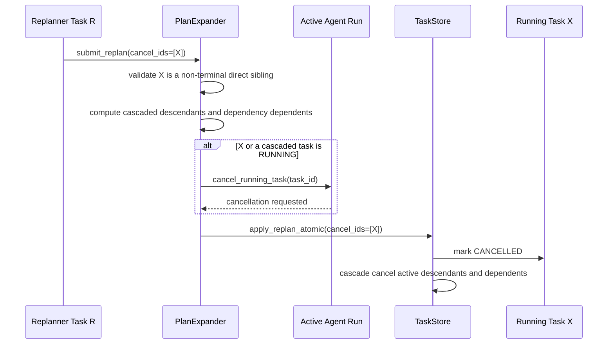
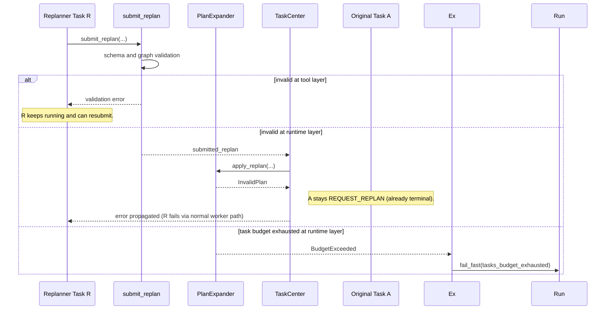
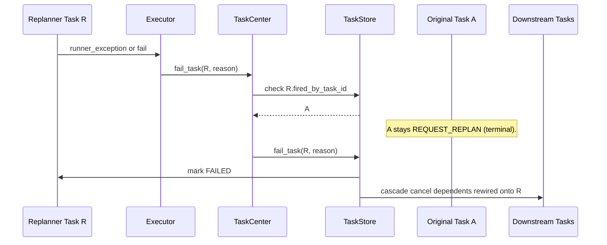

# Replan Workflow Sequence Diagrams

This document shows the task replanning lifecycle for the main runtime scenarios.
The current `submit_replan` payload is:

- `new_tasks`
- `cancel_ids`

`team_replanner` is a normal expandable task. When original task `A` fails, `A`
moves to `REQUEST_REPLAN`, replanner task `R` is created, and pending task
graph nodes that depended on `A` are rewired to depend on `R`. Any dependent
of `A` with a non-pending status is a graph invariant violation.

The scheduler invariant is strict: a task can be `READY` or `RUNNING` only when
all dependencies are `DONE`.

## Detached children and promotion

An `EXPANDED` parent's children fall into two sets:

- **Detached**: `FAILED`, `CANCELLED`, `REQUEST_REPLAN`. All three are terminal
  and are ignored for promotion — treated as resolved but not successful.
- **Non-detached / live**: `PENDING`, `READY`, `RUNNING`, `EXPANDED`,
  `EXPANDED_AWAITING_SUMMARY`, `DONE`.

Promotion rule: the parent transitions out of `EXPANDED` when every
non-detached child is `DONE`.

- If at least one child is `DONE` and the parent is a planner/replanner:
  parent → `EXPANDED_AWAITING_SUMMARY`; `parent_summarizer` reads the parent
  and every direct child detail, posts the roll-up, then parent → `DONE`.
- If at least one child is `DONE` and the parent is not expandable:
  parent → `DONE`.
- If every child is detached (no `DONE`): parent → `FAILED` with reason
  `all_children_detached`, and itself enters the detached set of *its* parent
  — propagates up naturally.

This means cancel-cascades no longer wedge ancestor chains: detached children
simply fall out of the counting set. (Replan-budget exhaustion is a separate
case — it terminates the whole team run via `fail_fast`; see §1a.)

Promotion fires on `DONE`, `FAILED`, and `CANCELLED` child transitions, plus
a sweep after `apply_replan` to catch bulk cascade cancels.

## 1. Failure Creates A Replanner



The executor routes failure through `TaskCenter.request_replan` because the
executor only interprets the agent's terminal submission. TaskCenter owns the
task lifecycle boundary: replan budget checks, replanner selection, event
emission, and the atomic TaskStore mutation that creates `R` and rewires
pending dependents. A graph invariant violation is fatal; the executor fails
the team run immediately.

### 1a. Replan Budget Exhausted

`TaskCenter.request_replan` calls `require_replan_capacity()` before creating
`R`. If the budget is exhausted, `BudgetExceeded` propagates to the executor,
which treats it as terminal for the whole team run: the executor calls
`team_run.fail_fast("replan_budget_exhausted: {exc}")` (same mechanism as a
graph invariant violation). The replan budget is a run-level guarantee, not a
per-branch one — once it's gone, no further recovery is possible anywhere in
the tree, so localizing the failure to `A` would just defer the inevitable
while letting unrelated work keep burning resources.

## 2. Replanner Submits Empty Replan



The tool-level contract rejects empty or cancel-only replans. A replanner that
cannot justify at least one corrective child must keep diagnosing the failed
work instead of closing recovery with no new tasks.

## 3. Replanner Creates Direct Children

```mermaid
sequenceDiagram
    participant R as Replanner Task R
    participant TC as TaskCenter
    participant PE as PlanExpander
    participant TS as TaskStore
    participant C as Children Of R
    participant D as Downstream Tasks
    participant A as Original Task A

    R->>TC: complete_task(R, submitted_replan with new_tasks)
    TC->>PE: apply_replan(R, add_tasks)
    PE->>TS: apply_replan_atomic(specs include parent_id=R)

    TS->>TS: insert child tasks under R
    TS-->>PE: inserted children
    PE-->>TC: replanner_child_count > 0

    TC->>TS: mark R EXPANDED
    Note over D,A: D still waits on R. A stays REQUEST_REPLAN.

    C->>TC: child completes DONE
    TC->>TS: mark child DONE
    TS->>TS: maybe_promote_expanded_parent(child)

    alt every non-detached child of R is DONE (≥1 DONE)
        TS->>R: mark R EXPANDED_AWAITING_SUMMARY
        TC->>R: parent_summarizer reads R + every direct child
        R->>TC: submit_task_success(summary=roll-up)
        TS->>R: mark R DONE
        TS->>D: promote downstream dependents
        TC->>TS: finalize_replanned_origin(R)
        TS->>A: record replanned_by on A (A stays REQUEST_REPLAN; terminal)
    else every child is detached (0 DONE, all FAILED/CANCELLED)
        TS->>R: mark R FAILED (all_children_detached)
        Note over D,A: R joins parent's detached set; propagates up.
    else some child still live
        TS->>R: keep R EXPANDED
    end
```

With the detached-set promotion rule, `CANCELLED` and `FAILED` children do
*not* wedge `R` — they are detached and ignored. `R` goes
`EXPANDED_AWAITING_SUMMARY` when every non-detached child is DONE, then DONE
after `parent_summarizer` posts the roll-up, or FAILED if all children are detached. A failed
direct child still does not trigger a cascading replan (`fail_task` only
cascades cancels to its descendants and doesn't call `request_replan`), but
the failure propagates upward via the detach/promotion chain rather than
wedging state. Recovery at a higher level still requires an ancestor
replanner.

## 4. Replanner Adds Child Tasks Only



All replan-added tasks are direct children of `R` and keep `R`'s depth. This
keeps the original rewire invariant simple: downstream tasks wait on `R`, and
`R` waits on the repair work it owns without spending another `max_depth` level.

### Authoring Boundary

A replanner never specifies `parent_id` in `new_tasks`; the tool/runtime stamp
each new task with `parent_id=R`. The only graph mutation outside `R`'s child
set is cancellation:

- `cancel_ids` may target direct siblings of `R`.
- Cancelling a sibling cascades to active descendants and dependents.
- Replacement work belongs in `new_tasks` under `R`, so downstream work remains
  blocked until recovery completes.
- New tasks cannot depend on downstream tasks already blocked on `R`, because
  that would create a scheduler cycle through the recovery gate.

This bounds the blast radius of a single replan while preserving the guarantee
that `R` is the recovery gate.

## 5. Replanner Cancels A Running Task



Active runner cancellation is requested before the task is marked cancelled in
storage.

## 6. Invalid Replan Submission



Tool-layer validation is recoverable inside the replanner turn. Runtime apply
failure propagates the exception; A is already terminal at REQUEST_REPLAN so
no origin-side transition is needed. The executor treats the exception as an
unrecoverable worker error, and `R` is failed through the normal replanner
failure path. Task-budget exhaustion is handled like other run-level budget
exhaustion: the executor terminates the team run via `fail_fast`.

### Idempotency

`apply_replan_atomic` is **not** idempotent:

- `cancel_ids` filters by non-terminal status, so re-cancelling an already
  CANCELLED task is a no-op.
- New task inserts use `add_all` without upsert, so retrying with the same
  task IDs raises a database integrity error.

Callers must ensure at-most-once delivery of `apply_replan` from executor to
TaskCenter. A crash between `apply_replan_atomic` commit and the executor's
acknowledgement cannot be safely retried with the same spec set.

## 7. Replanner Fails



A is terminal at REQUEST_REPLAN from the moment recovery starts. A successful
replanner records `replanned_by:R` on A without changing its status. A failed
replanner transitions only R to FAILED; cascade from R handles dependents
that were rewired onto R.
