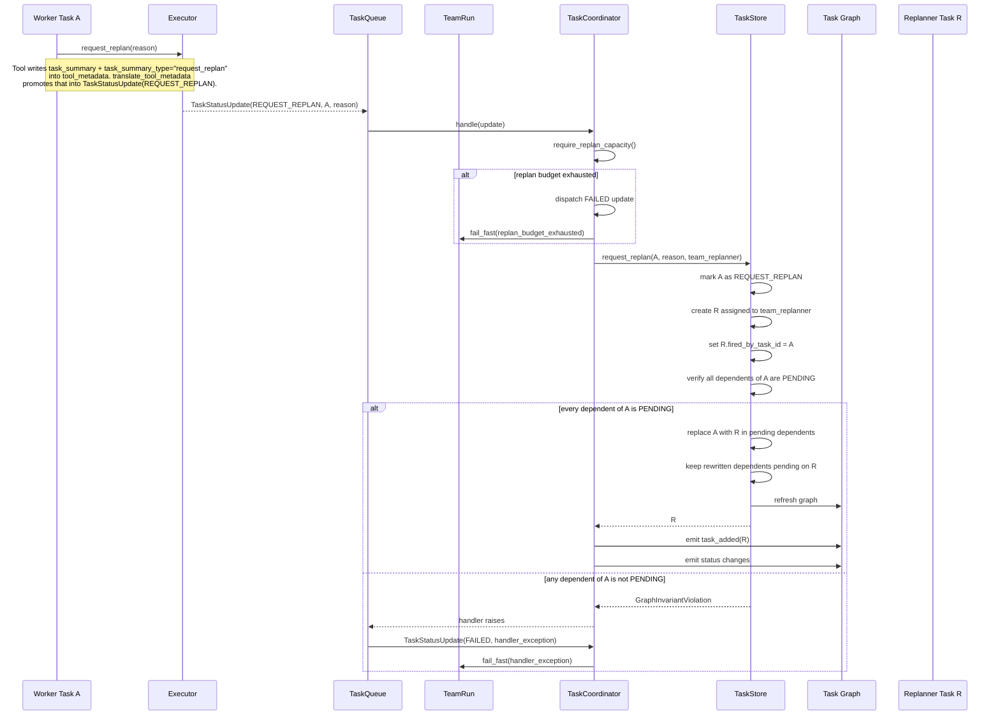
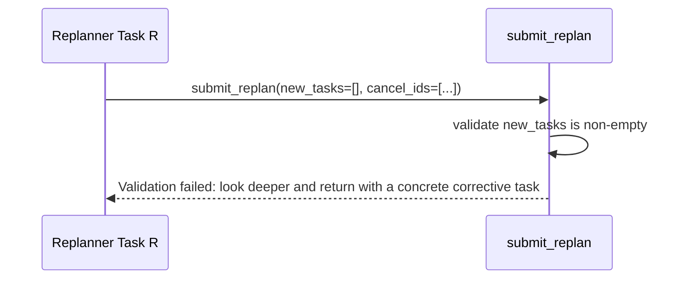
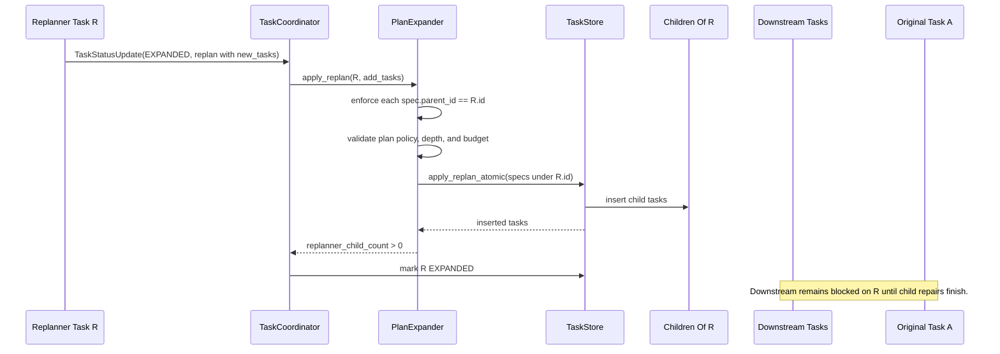
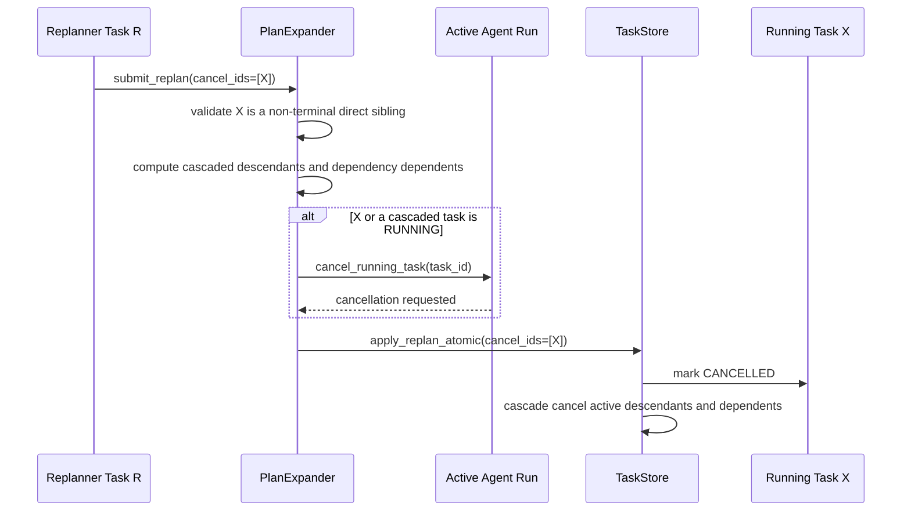
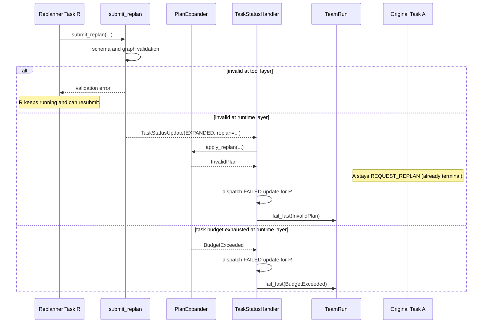
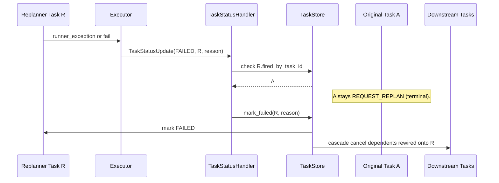

# Replan Workflow Sequence Diagrams

This document shows the task replanning lifecycle for the main runtime scenarios.
The current `submit_replan` payload is:

- `new_tasks`
- `cancel_ids`

`team_replanner` is a normal expandable task. When original task `A` fails, `A`
moves to `REQUEST_REPLAN`, replanner task `R` is created, and pending task
graph nodes that depended on `A` are rewired to depend on `R`. Any dependent
of `A` with a non-pending status is a graph invariant violation.

The scheduler invariant is strict: a task can be `READY` or `RUNNING` only when
all dependencies are `DONE`.

## Detached children and promotion

An `EXPANDED` parent's children fall into two sets:

- **Detached**: `FAILED`, `CANCELLED`, `REQUEST_REPLAN`. All three are terminal
  and are ignored for promotion — treated as resolved but not successful.
- **Non-detached / live**: `PENDING`, `READY`, `RUNNING`, `EXPANDED`, `DONE`.

Promotion rule: the parent transitions out of `EXPANDED` when every
non-detached child is `DONE`.

When every non-detached child is `DONE`, `TaskCoordinator` synthesizes a
roll-up from child terminal summaries and marks the parent `DONE`.

This means cancel-cascades no longer wedge ancestor chains: detached children
simply fall out of the counting set. (Replan-budget exhaustion is a separate
case — it terminates the whole team run via `fail_fast`; see §1a.)

Promotion fires on `DONE`, `FAILED`, and `CANCELLED` child transitions, plus
a sweep after `apply_replan` to catch bulk cascade cancels.

## 1. Failure Creates A Replanner



The executor routes failure through `TaskStatusUpdate(REQUEST_REPLAN, ...)`
because the executor only interprets the agent's terminal submission.
`TaskCoordinator` owns the task lifecycle boundary: replan budget checks,
replanner selection, event
emission, and the atomic TaskStore mutation that creates `R` and rewires
pending dependents. A graph invariant violation is fatal; `TaskQueue` converts
the handler failure into a `FAILED` update and the handler fail-fasts the run.

### 1a. Replan Budget Exhausted

`TaskCoordinator` calls `require_replan_capacity()` before creating `R`. If
the budget is exhausted, it dispatches a `FAILED` update for the task and
fail-fasts the run. The replan budget is a run-level guarantee, not a
per-branch one — once it's gone, no further recovery is possible anywhere in
the tree, so localizing the failure to `A` would just defer the inevitable
while letting unrelated work keep burning resources.

## 2. Replanner Submits Empty Replan



The tool-level contract rejects empty or cancel-only replans. A replanner that
cannot justify at least one corrective child must keep diagnosing the failed
work instead of closing recovery with no new tasks.

## 3. Replanner Creates Direct Children

```mermaid
sequenceDiagram
    participant R as Replanner Task R
    participant H as TaskCoordinator
    participant PE as PlanExpander
    participant TS as TaskStore
    participant C as Children Of R
    participant D as Downstream Tasks
    participant A as Original Task A

    R->>H: TaskStatusUpdate(EXPANDED, replan with new_tasks)
    H->>PE: apply_replan(R, add_tasks)
    PE->>TS: apply_replan_atomic(specs include parent_id=R)

    TS->>TS: insert child tasks under R
    TS-->>PE: inserted children
    PE-->>H: replanner_child_count > 0

    H->>TS: mark R EXPANDED
    Note over D,A: D still waits on R. A stays REQUEST_REPLAN.

    C->>H: TaskStatusUpdate(DONE)
    H->>TS: mark child DONE
    TS->>TS: fetch_promotable_parent(child)

    alt every non-detached child of R is DONE (≥1 DONE)
        H->>H: synthesize roll-up from child summaries
        H->>TS: mark R DONE
        TS->>D: promote downstream dependents
        H->>TS: finalize_replanned_origin(R)
        TS->>A: record replanned_by on A (A stays REQUEST_REPLAN; terminal)
    else every child is detached (0 DONE, all FAILED/CANCELLED)
        H->>H: synthesize empty or available roll-up
        H->>TS: mark R DONE
        Note over D,A: Detached children do not synthesize parent failure.
    else some child still live
        TS->>R: keep R EXPANDED
    end
```

With the detached-set promotion rule, `CANCELLED` and `FAILED` children do
*not* wedge `R` — they are detached and ignored. `R` goes
`DONE` when every non-detached child is DONE and the coordinator synthesizes the
roll-up. A failed direct child still does not trigger a cascading replan by
itself; recovery failure is handled through normal task failure and replanning
paths.

## 4. Replanner Adds Child Tasks Only



All replan-added tasks are direct children of `R` and keep `R`'s depth. This
keeps the original rewire invariant simple: downstream tasks wait on `R`, and
`R` waits on the repair work it owns without spending another `max_depth` level.

### Authoring Boundary

A replanner never specifies `parent_id` in `new_tasks`; the tool/runtime stamp
each new task with `parent_id=R`. The only graph mutation outside `R`'s child
set is cancellation:

- `cancel_ids` may target direct siblings of `R`.
- Cancelling a sibling cascades to active descendants and dependents.
- Replacement work belongs in `new_tasks` under `R`, so downstream work remains
  blocked until recovery completes.
- New tasks cannot depend on downstream tasks already blocked on `R`, because
  that would create a scheduler cycle through the recovery gate.

This bounds the blast radius of a single replan while preserving the guarantee
that `R` is the recovery gate.

## 5. Replanner Cancels A Running Task



Active runner cancellation is requested before the task is marked cancelled in
storage.

## 6. Invalid Replan Submission



Tool-layer validation is recoverable inside the replanner turn. Runtime apply
failure becomes a `FAILED` update for `R`; A is already terminal at
REQUEST_REPLAN so no origin-side transition is needed. Task-budget exhaustion
is handled like other run-level budget exhaustion: `TaskStatusHandler`
terminates the team run via `fail_fast`.

### Idempotency

`apply_replan_atomic` is **not** idempotent:

- `cancel_ids` filters by non-terminal status, so re-cancelling an already
  CANCELLED task is a no-op.
- New task inserts use `add_all` without upsert, so retrying with the same
  task IDs raises a database integrity error.

Callers must ensure at-most-once delivery of `apply_replan` from the status
handler to persistence. A crash between `apply_replan_atomic` commit and the executor's
acknowledgement cannot be safely retried with the same spec set.

## 7. Replanner Fails



A is terminal at REQUEST_REPLAN from the moment recovery starts. A successful
replanner records `replanned_by:R` on A without changing its status. A failed
replanner transitions only R to FAILED; cascade from R handles dependents
that were rewired onto R.
