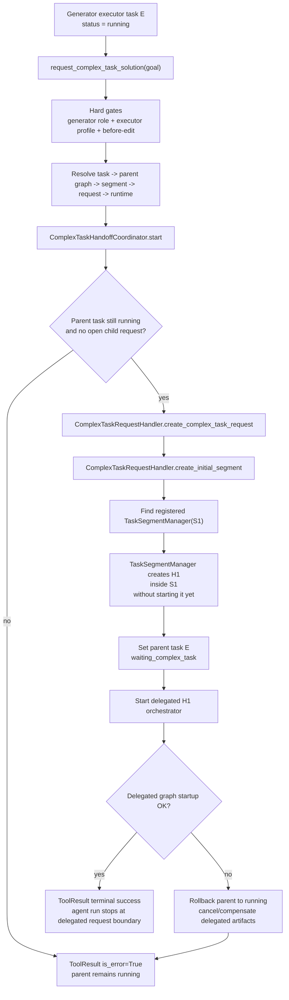
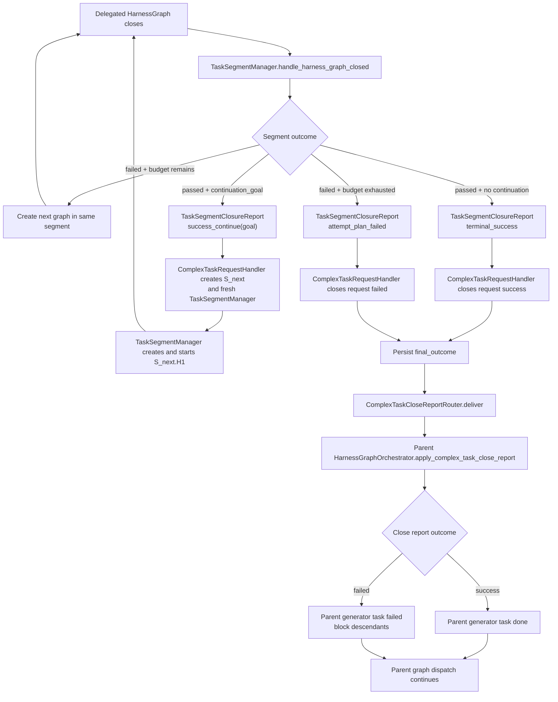
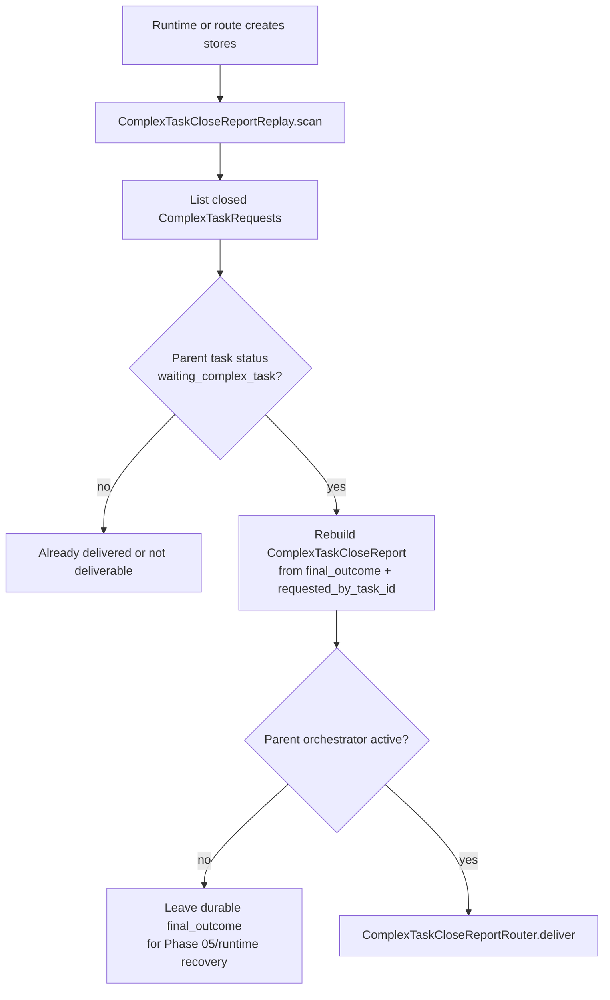
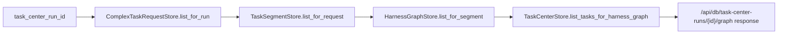

# Phase 04 - Implementation Plan

Companion to
[`phase-04-complex-task-spawning.md`](./phase-04-complex-task-spawning.md).
This document is the actionable build plan for complex-task spawning, parent
executor handoff, close-report delivery, and the persistence API walk over
the durable request / segment / graph model.

Phase 04 does not redefine the Phase 01 durable model, the Phase 02
single-graph orchestrator, or the Phase 03 public terminal-tool layer. It
hardens the pieces that were partially introduced in Phase 03 and closes the
remaining delivery/API gaps.

***

## 1. Scope

Phase 04 implements the runtime bridge from a generator executor's
`request_complex_task_solution(goal)` call to a delegated
`ComplexTaskRequest`, and from the delegated request's close report back to the
requesting generator task.

Deliverables:

1. A single orchestration service for complex-task handoff, replacing
   the tool file's inline request/segment/graph construction.
2. An executor-profile hard gate so only the generator executor agent can call
   `request_complex_task_solution`, `submit_execution_success`, and
   `submit_execution_failure`; verifier terminals remain verifier-only.
3. Handoff creation that avoids leaving the parent task stuck in
   `waiting_complex_task` when delegated graph startup fails.
4. Initial delegated request creation through `ComplexTaskRequestHandler`, initial
   segment creation through the handler, and initial graph creation through the
   segment-owned `TaskSegmentManager`.
5. Continuation segment creation after `success_continue(goal)`, using the
   existing `ComplexTaskRequestHandler.handle_segment_closed(...)` path.
6. Close-report delivery through one router that calls
   `HarnessGraphOrchestrator.apply_complex_task_close_report(...)` for the
   parent graph.
7. Replay semantics for already-closed complex requests whose parent task is
   still `waiting_complex_task`. Phase 04 must make the report durable and
   replayable; full process resurrection for missing orchestrators remains
   Phase 05.
8. `/api/db/task-center-runs/{id}/graph` backed by
   `complex_task_requests -> task_segments -> harness_graphs`, with task rows
   attached per graph for the UI.
9. Focused tests covering handoff startup, startup failure, delegated
   success, delegated failure, continuation, retry, replay, profile gates, and
   the graph API route.

Not in scope:

- Rebuilding process-local orchestrators from only persisted rows after a cold
  restart. Phase 05 owns cutover and durable recovery of live graph runtimes.
- Rich context packets, evidence summaries, failure landscapes, or
  `harness_graph_summary_id` population. Phase 06 owns that data.
- Reintroducing `submit_request_plan`, `submit_task_plan`,
  `declare_blocker`, `DeclareBlockerTool`, or conductor flows.
- A frontend implementation. This repository snapshot has no
  `frontend/web/src`; Phase 04 only restores the backend route contract.

***

## 2. Prerequisite Implementation Check

| Prerequisite                     | Current implementation                                                                                                                           | Phase 04 stance                                                                                             |
| -------------------------------- | ------------------------------------------------------------------------------------------------------------------------------------------------ | ----------------------------------------------------------------------------------------------------------- |
| Phase 01 durable records         | `ComplexTaskRequestRecord`, `TaskSegmentRecord`, and `HarnessGraphRecord` exist under `backend/src/db/models/`; stores return frozen DTOs.       | Reuse. Add only query helpers needed by delivery and route walking.                                         |
| Request/segment lifecycle        | `ComplexTaskRequestHandler` creates requests and segments, emits close reports through an optional callback, and spawns `TaskSegmentManager`.    | Reuse. Do not create requests or segments from any other class.                                             |
| Segment retry lifecycle          | `TaskSegmentManager` is the only creator of graphs inside one segment and already handles retry vs segment closure.                              | Reuse. Add a narrow deferred-start seam only if needed for safe handoff startup.                            |
| Phase 02 graph orchestration     | `HarnessGraphOrchestrator` starts planner, schedules generators, spawns evaluator, closes graphs, and keeps `waiting_complex_task` non-terminal. | Reuse. Harden close-report idempotency and validation.                                                      |
| Parent resume entry              | `HarnessGraphOrchestrator.apply_complex_task_close_report(...)` exists and maps delegated success to parent `done`, failure to parent `failed`.  | Keep as the single parent resume method. Add replay/idempotency behavior around it.                         |
| Phase 03 public tool             | `request_complex_task_solution` is registered and currently performs delegated request creation inline.                                          | Refactor the body into a coordinator. The tool should validate input and delegate.                              |
| Phase 03 planner validation      | Nonblank validation is implemented in `planner/_schemas.py`; valid input values are preserved rather than stripped.                               | No Phase 04 work.                                                                                           |
| Phase 03 executor/verifier split | Current hard gate checks only persisted structural role `generator`; it does not prove executor vs verifier profile.                             | Wave 0 must add profile gates before relying on executor-only handoff behavior.                   |
| Runtime store initialization     | Server initializes `TaskCenterStore`, `AgentRunStore`, and `ModelStore`; request/segment/graph stores are test-only or runtime-object-only.      | Initialize `ComplexTaskRequestStore`, `TaskSegmentStore`, and `HarnessGraphStore` in app/runtime bootstrap. |
| Graph API route                  | `persistence.py` still returns `{"harness_graphs": []}` with `TODO(phase-04)`.                                                                   | Implement the route from the new schema.                                                                    |

Important current risk:

`request_complex_task_solution` currently marks the parent generator task
`waiting_complex_task` before `segment_manager.create_initial_harness_graph()`
returns. If graph creation or startup raises, the tool returns an inline error
while the parent task can remain waiting. Phase 04 must eliminate this state.

***

## 3. Workflow Diagrams

### 3a. Executor Handoff Creation



The coordinator owns the ordering. The tool should not call
`ComplexTaskRequestHandler`, `TaskSegmentManager`, or `TaskCenterStore`
directly after Phase 04.

### 3b. Delegated Request Closure and Parent Resume



Retry and continuation never return to the requesting executor. Only the final
`ComplexTaskRequest` close report resumes the parent generator task.

Continuation startup is mandatory. When
`ComplexTaskRequestHandler.handle_segment_closed(...)` receives
`success_continue(goal)`, it must create the next `TaskSegment`, obtain the fresh
`TaskSegmentManager`, create that segment's initial `HarnessGraph` through the
manager, and start the graph. A continuation must not leave an open request with
a fresh segment but no running graph. If continuation graph creation or startup
fails, the implementation must close the delegated request through a durable,
tested failure path and deliver a failed close report to the waiting parent; the
parent executor run is not resumed inline.

### 3c. Durable Close-Report Replay



Phase 04 replay must be idempotent. A report whose parent task is already
`done` or `failed` should be treated as already delivered, not as an error.

### 3d. Persistence Graph Route



The route should keep top-level `harness_graphs` for compatibility, while also
returning enough request/segment lineage for the new model.

***

## 4. Runtime Ownership

Ownership remains strict:

| Entity / transition                               | Owner                                    |
| ------------------------------------------------- | ---------------------------------------- |
| `ComplexTaskRequest` creation                     | `ComplexTaskRequestHandler` only         |
| `TaskSegment` creation                            | `ComplexTaskRequestHandler` only         |
| `TaskSegmentManager` spawning                     | `ComplexTaskRequestHandler` only         |
| `HarnessGraph` creation inside a segment          | that segment's `TaskSegmentManager` only |
| Initial complex-task handoff orchestration      | new `ComplexTaskHandoffCoordinator`          |
| Close-report routing to parent graph              | new `ComplexTaskCloseReportRouter`       |
| Parent generator state mutation from close report | parent `HarnessGraphOrchestrator` only   |
| Frontend graph serialization                      | persistence router helper functions only |

The coordinator composes existing owners; it must not bypass them.

***

## 5. Folder Layout

```text
backend/src/task_center/complex_task/
|-- request.py                         # existing DTOs; keep ComplexTaskCloseReport here
|-- handler.py                         # edit only if callback/replay hook needs shaping
|-- handoff.py                   # NEW: ComplexTaskHandoffCoordinator
|-- close_report_delivery.py           # NEW: ComplexTaskCloseReportRouter + replay helpers
`-- validation.py                      # existing request invariants

backend/src/task_center/segment/
`-- manager.py                         # EDIT: optional deferred graph start seam

backend/src/task_center/harness_graph/
|-- orchestrator.py                    # EDIT: close-report idempotency/validation
|-- runtime.py                         # EDIT: ensure manager registry/lifecycle config stay required for Phase 04 paths
`-- factory.py                         # existing factory used by the coordinator

backend/src/tools/submission/hooks/
|-- harness_role_gate.py               # existing structural role gate
`-- harness_agent_profile_gate.py      # NEW: executor vs verifier profile gate

backend/src/tools/submission/main_agent/generator/
|-- executor/
|   |-- request_complex_task_solution.py # EDIT: delegate to handoff coordinator
|   |-- submit_execution_success.py      # EDIT: add executor profile gate
|   `-- submit_execution_failure.py      # EDIT: add executor profile gate
`-- verifier/
    |-- submit_verification_success.py   # EDIT: add verifier profile gate
    `-- submit_verification_failure.py   # EDIT: add verifier profile gate

backend/src/db/stores/
|-- complex_task_request_store.py      # EDIT: list_for_run + closed-report queries
|-- task_center_store.py               # EDIT: compare-and-set status helper
|-- task_segment_store.py              # existing list_for_request
`-- harness_graph_store.py             # existing list_for_segment

backend/src/server/
|-- app_factory.py                     # EDIT: initialize and pass request/segment/graph stores
`-- routers/persistence.py             # EDIT: implement graph route from new schema

backend/tests/task_center/lifecycle/
|-- test_phase04_complex_task_handoff.py
|-- test_phase04_close_report_delivery.py
`-- test_phase04_replay.py

backend/tests/test_tools/
|-- test_submission_tool_gates.py      # EDIT: executor/verifier profile coverage
`-- test_submission_terminal_routing.py # EDIT: handoff delegates to coordinator

backend/tests/server/
`-- test_persistence_graph_route.py
```

***

## 6. Files, Classes, and Functions

### 6a. `task_center/complex_task/handoff.py`

Create a coordinator that turns an accepted executor tool call into a durable
delegated request plus initial graph. This is not a domain model; it is the
use-case boundary that composes the existing request, segment, graph, and parent
task owners.

```python
@dataclass(frozen=True, slots=True)
class ComplexTaskHandoffResult:
    parent_task_id: str
    parent_harness_graph_id: str
    complex_task_request_id: str
    initial_segment_id: str
    initial_harness_graph_id: str
    goal: str


class ComplexTaskHandoffCoordinator:
    def __init__(self, *, runtime: HarnessGraphRuntime) -> None: ...

    def start(
        self,
        *,
        task_center_run_id: str,
        parent_task_id: str,
        parent_harness_graph_id: str,
        goal: str,
    ) -> ComplexTaskHandoffResult: ...
```

Required behavior:

1. Re-read the parent task from `runtime.task_store`.
2. Require parent status `running` and parent graph id matching the resolved
   submission context.
3. Reject if `ComplexTaskRequestStore.list_for_executor_task(parent_task_id)`
   contains any `OPEN` request.
4. Build a `ComplexTaskRequestHandler` with:
   - `runtime.request_store`
   - `runtime.segment_store`
   - `runtime.graph_store`
   - `runtime.manager_registry`
   - `runtime.lifecycle_config`
   - `ComplexTaskCloseReportRouter(runtime).deliver`
   - `make_harness_graph_orchestrator_factory(...)`
5. Call `create_complex_task_request(...)`.
6. Call `create_initial_segment(...)`.
7. Get the registered `TaskSegmentManager` for the new segment.
8. Create the initial delegated graph through the manager without starting its
   orchestrator yet.
9. Mark the parent task `waiting_complex_task` with a delegated request summary that
   names the delegated request, segment, graph, and goal.
10. Start the delegated graph orchestrator.
11. If startup fails, roll the parent task back to `running` and compensate the
    delegated request/segment/graph state.
12. Return `ComplexTaskHandoffResult`.

Startup failure handling:

- The parent task must still be `running` when the tool returns an inline
  error.
- If a delegated request/segment was created before the failure, mark the request
  and segment `cancelled` or otherwise make the compensation explicit in tests.
- Do not leave an open request with no running graph unless the plan also adds
  a replay/recovery path for that exact state.

Recommended implementation - `StartHandle` seam:

Add a single deferred-start seam to `TaskSegmentManager` that returns a
one-shot starter alongside the created graph. Avoids growing a second
`start_harness_graph(id)` method and a `created/not_started` vs `running`
state on the manager.

```python
@dataclass(frozen=True, slots=True)
class HarnessGraphStartHandle:
    """One-shot starter returned alongside a created (but not started) graph.

    Calling start() is required exactly once. The manager rejects a second
    create_initial_harness_graph(...) for the same segment until either start()
    has run or the handle has been discarded via cancel().
    """
    graph: HarnessGraph
    _start: Callable[[], None]
    _cancel: Callable[[], None]

    def start(self) -> None: ...
    def cancel(self) -> None: ...   # used only by compensation


class TaskSegmentManager:
    def create_initial_harness_graph(self) -> HarnessGraphStartHandle: ...
```

Existing Phase 01/02 callers that want eager start become a one-liner:

```python
manager.create_initial_harness_graph().start()
```

The coordinator persists the parent waiting-summary between create and start,
which prevents a synchronously closing test orchestrator from delivering a
close report before the parent task has entered `waiting_complex_task`.

Compensation primitive on the coordinator:

Rather than scattering `cancel()` verbs across two stores, route all rollback
through one coordinator-private method. Store-level cancels stay
package-private (`_cancel_for_compensation`) so nothing else takes a
dependency on partial-cancel semantics.

```python
class ComplexTaskHandoffCoordinator:
    def _compensate_failed_handoff(
        self,
        *,
        request: ComplexTaskRequest | None,
        segment: TaskSegment | None,
        start_handle: HarnessGraphStartHandle | None,
    ) -> None:
        """Best-effort rollback. Order: handle -> segment -> request.

        Each step is independently no-op-safe. Errors are logged but not
        re-raised; the caller is already returning an inline tool error.
        """
```

Order matters: discard the unstarted handle first (no orchestrator coroutine
to leak), then mark the segment cancelled, then the request. Parent rollback
to `running` uses `set_task_status_if_current` (see §6f).

### 6b. `task_center/complex_task/close_report_delivery.py`

Create one delivery service for final reports.

```python
CloseReportDeliveryStatus = Literal[
    "delivered",
    "already_delivered",
    "deferred_no_orchestrator",
]


@dataclass(frozen=True, slots=True)
class CloseReportDeliveryResult:
    status: CloseReportDeliveryStatus
    requested_by_task_id: str
    parent_harness_graph_id: str | None


class ComplexTaskCloseReportRouter:
    def __init__(self, *, runtime: HarnessGraphRuntime) -> None: ...

    def deliver(
        self, report: ComplexTaskCloseReport
    ) -> CloseReportDeliveryResult: ...
```

Delivery algorithm:

1. Load `report.requested_by_task_id` from `runtime.task_store`.
2. If the task does not exist, raise `GraphInvariantViolation`.
3. Read `task_center_harness_graph_id` from the parent task.
4. If the parent task is `done` or `failed`, return `already_delivered`.
   Delivery idempotency does not scan summary payloads.
5. If the parent task is not `waiting_complex_task`, raise
   `GraphInvariantViolation` because the report is not applicable.
6. If no parent orchestrator is registered for the graph id, return
   `deferred_no_orchestrator`; the durable `final_outcome` remains the replay
   source.
7. Call `orchestrator.apply_complex_task_close_report(report)`.
8. Return `delivered`.

Replay helper:

```python
def build_close_report_from_request(
    request: ComplexTaskRequest,
) -> ComplexTaskCloseReport | None: ...


def deliver_pending_complex_task_close_reports(
    *,
    runtime: HarnessGraphRuntime,
    task_center_run_id: str | None = None,
) -> list[CloseReportDeliveryResult]: ...
```

`build_close_report_from_request(...)` reconstructs a report from:

- `ComplexTaskRequest.id`
- `ComplexTaskRequest.requested_by_task_id`
- `ComplexTaskRequest.final_outcome["outcome"]`
- `ComplexTaskRequest.final_outcome["final_segment_id"]`
- `ComplexTaskRequest.final_outcome["final_harness_graph_id"]`

If `final_outcome` is missing or malformed for a closed request, raise
`GraphInvariantViolation`.

### 6c. `task_center/harness_graph/orchestrator.py`

Edit `apply_complex_task_close_report(...)` in place.

Current behavior is the right core behavior:

- delegated success -> parent generator `done`
- delegated failure -> parent generator `failed`
- failure blocks pending descendants and lets graph quiescence close the graph

Add:

1. Idempotency via CAS: route the parent transition through
   `task_store.set_task_status_if_current(task_id, expected_status="waiting_complex_task", status=...)`
   (see §6f). A `None` return means another delivery already moved the parent
   off `waiting_complex_task` — treat this as already-delivered and return
   without mutation. No summary-payload scan, no separate idempotency state;
   the storage CAS *is* the check.
2. Stronger summary payload (carried in the CAS write):

```python
{
    "outcome": report.outcome,
    "summary": "...",
    "payload": {
        "complex_task_close_report": asdict(report),
        "submission_kind": "complex_task_close_report",
    },
}
```

3. A tight invariant when the parent task belongs to another graph. The current
   `assert_generator_task_for_submission(...)` already does most of this; keep
   that as the durable guard.

Do not make the orchestrator create delegated requests or segments.

### 6d. `tools/submission/main_agent/generator/request_complex_task_solution.py`

Keep the public schema and terminal registration, but reduce the body to
validation plus delegation.

```python
class RequestComplexTaskSolutionInput(BaseModel):
    goal: str = Field(..., min_length=1)

    @field_validator("goal")
    @classmethod
    def _validate_goal(cls, value: str) -> str: ...
```

The validator rejects empty or whitespace-only goals and returns the original
value unchanged. The request-start path should not strip or normalize the durable
goal.

Tool handler flow:

1. Resolve `HarnessSubmissionContext`.
2. Confirm the persisted task is `running`.
3. Instantiate `ComplexTaskHandoffCoordinator(runtime=submission_context.runtime)`.
4. Call `start_handoff(...)`.
5. Return terminal `ToolResult` with metadata from `ComplexTaskHandoffResult`.

The tool should not contain delivery callbacks, handler factories, registry
lookups, or direct task status mutation after Phase 04.

Import-isolation rule (the actual test of the refactor): after Phase 04 the
tool file's imports from `task_center.*` must be exactly two —
`ComplexTaskHandoffCoordinator` and `ComplexTaskHandoffResult`. No
`ComplexTaskRequestHandler`, no `make_harness_graph_orchestrator_factory`,
no store imports, no exception-class imports beyond what
`HarnessSubmissionContext` already raises. If the import list still names
handler / factory / store, the refactor leaked.

### 6e. `tools/submission/hooks/harness_agent_profile_gate.py`

Add a gate for profile-level roles such as `executor` and `verifier`.

```python
@dataclass(frozen=True, slots=True)
class HarnessAgentProfileGate:
    target_tool: str
    expected_profile_role: str

    async def run(
        self,
        tool_input: BaseModel,
        context: ToolExecutionContextService,
    ) -> HookResult[Any]: ...
```

Read the profile role from `ExecutionMetadata["role"]`, which is already set
from the launched `AgentDefinition.role` by `engine/runtime/agent.py`.

Attach it to:

| Tool                            | Expected profile role |
| ------------------------------- | --------------------- |
| `request_complex_task_solution` | `executor`            |
| `submit_execution_success`      | `executor`            |
| `submit_execution_failure`      | `executor`            |
| `submit_verification_success`   | `verifier`            |
| `submit_verification_failure`   | `verifier`            |

Keep `HarnessRoleGate(..., HarnessTaskRole.GENERATOR)` on all of these tools.
The structural role proves the persisted graph task is a generator; the profile
gate proves the currently running agent has the matching executor/verifier tool
contract.

### 6f. Store Helpers

`backend/src/db/stores/complex_task_request_store.py`

```python
def list_for_run(self, task_center_run_id: str) -> list[ComplexTaskRequest]: ...

def list_closed_for_run(
    self, task_center_run_id: str
) -> list[ComplexTaskRequest]: ...

def list_closed(self) -> list[ComplexTaskRequest]: ...

def set_status(
    ...,
    # existing method remains
) -> ComplexTaskRequest: ...
```

Use `list_for_run(...)` for the route and `list_closed_for_run(...)` for
targeted replay. `list_closed()` is useful for process-level replay when a
runtime has no specific run id.

Compensation helper (package-private — only the coordinator's
`_compensate_failed_handoff` may call it):

```python
def _cancel_for_compensation(
    self, request_id: str, *, closed_at: datetime | None = None
) -> ComplexTaskRequest: ...
```

`backend/src/db/stores/task_segment_store.py`

Compensation helper (package-private, same rule):

```python
def _cancel_for_compensation(
    self, segment_id: str, *, closed_at: datetime | None = None
) -> TaskSegment: ...
```

The underscore prefix is intentional: any caller reaching for these has to
justify why their path isn't compensation. There is no public `cancel(...)`
on either store in Phase 04.

`backend/src/db/stores/task_center_store.py`

Add the canonical compare-and-set primitive for parent-task transitions in
this phase:

```python
def set_task_status_if_current(
    self,
    task_id: str,
    *,
    expected_status: str,
    status: str,
    summary: SerializedRow | None = None,
) -> SerializedRow | None: ...
```

Returns the new row on success, `None` on mismatch. This is the only path
Phase 04 uses to mutate parent generator task status:

| Transition                 | Caller                  | `expected_status`         | `status`                   | On `None`                       |
| -------------------------- | ----------------------- | ------------------------- | -------------------------- | ------------------------------- |
| handoff entry              | coordinator             | `running`                 | `waiting_complex_task`     | `GraphInvariantViolation`       |
| handoff rollback           | coordinator             | `waiting_complex_task`    | `running`                  | log + swallow (already moved)   |
| close-report deliver       | parent orchestrator     | `waiting_complex_task`    | `done` / `failed`          | silent return (already delivered) |
| replay deliver             | router → orchestrator   | `waiting_complex_task`    | `done` / `failed`          | `already_delivered` status      |

Plain `set_task_status(...)` must not be used for any of the above. The CAS
miss *is* the idempotency check — no summary-payload scan, no extra
in-memory delivery set.

### 6g. Runtime Store Initialization

`backend/src/server/app_factory.py`

Add module-level stores:

```python
complex_task_request_store = ComplexTaskRequestStore()
task_segment_store = TaskSegmentStore()
harness_graph_store = HarnessGraphStore()
```

Initialize them in `ensure_runtime_stores_ready(...)` when a session factory is
available. Pass them to `create_persistence_router(...)`.

This does not by itself build the TaskCenter runtime used by spawned harness
agents. It only makes the persistence API route and replay helpers able to use
the same DB-backed stores.

### 6h. Persistence Router

`backend/src/server/routers/persistence.py`

Change the factory signature:

```python
def create_persistence_router(
    task_center_store: TaskCenterStore,
    agent_run_store: AgentRunStore,
    complex_task_request_store: ComplexTaskRequestStore,
    task_segment_store: TaskSegmentStore,
    harness_graph_store: HarnessGraphStore,
) -> APIRouter: ...
```

Route behavior for `/api/db/task-center-runs/{task_center_run_id}/graph`:

1. Return `503` if any store is not ready.
2. Load all complex-task requests for the run ordered by creation time.
3. For each request, load segments ordered by `sequence_no`.
4. For each segment, load graphs ordered by `graph_sequence_no`.
5. For each graph, attach `TaskCenterStore.list_tasks_for_harness_graph(...)`.
6. Return a single nested representation plus a thin lookup index. Avoid
   duplicating lineage fields (no `request_status` / `segment_status` /
   `task_segment_id` re-embedded on each graph) — those are already implied
   by the parent in the tree.

```python
{
    "complex_task_requests": [
        {
            "id": "...",
            "task_center_run_id": "...",
            "requested_by_task_id": "...",   # null for root requests
            "status": "open|succeeded|failed|cancelled",
            "goal": "...",
            "final_outcome": {...} | None,
            "created_at": "...",
            "closed_at": None,
            "task_segments": [
                {
                    "id": "...",
                    "sequence_no": 1,
                    "status": "open|succeeded|failed|cancelled",
                    "goal": "...",
                    "continuation_goal": None,
                    "harness_graphs": [
                        {
                            "id": "...",
                            "graph_sequence_no": 1,
                            "stage": "planning|generating|evaluating|closed",
                            "status": "running|passed|failed",
                            "planner_task_id": "...",
                            "generator_task_ids": [...],
                            "evaluator_task_id": "...",
                            "fail_reason": None,
                            "tasks": [...],
                            "created_at": "...",
                            "updated_at": "...",
                            "closed_at": None,
                        }
                    ],
                }
            ],
        }
    ],
    "harness_graphs_index": [
        {
            "harness_graph_id": "...",
            "complex_task_request_id": "...",
            "task_segment_id": "...",
        }
    ],
}
```

The frontend builds any flat view it wants from the nesting;
`harness_graphs_index` is the only flat artifact, and it carries lookup keys
only — no status, no timestamps, nothing that can drift from the nested
truth. Phase 06's rich-context fields land on the nested graph node, not on
the index.

If route compatibility with an existing UI client matters, expose the old
top-level `harness_graphs` key as an alias for `harness_graphs_index` (same
shape). Do not re-introduce denormalized status fields.

***

## 7. Build Waves

### Wave 0 - Close Phase 03 Gate Gaps

1. Add `HarnessAgentProfileGate`.
2. Attach it to executor and verifier tools.
3. Add tests:
   - verifier profile cannot call `submit_execution_success`
   - verifier profile cannot call `request_complex_task_solution`
   - executor profile cannot call verifier terminals
4. Run the focused submission gate tests.

Ship Wave 0 as its own PR ahead of Wave 1. It is referenced by every test
in Waves 1–6 but depends on nothing in those waves; decoupling lowers review
risk and lets profile-gate coverage land before the larger refactor.

### Wave 1 - Extract Handoff Coordinator

1. Add `ComplexTaskHandoffCoordinator` and `ComplexTaskHandoffResult`.
2. Move handler factory and close-report sink construction out of
   `request_complex_task_solution.py`.
3. Add duplicate-open-request and parent-status checks.
4. Refactor the tool to delegate.
5. Preserve existing successful delegated request behavior in
   `test_request_complex_task_solution_starts_delegated_request`.

### Wave 2 - Safe Startup and Compensation

1. Implement the `HarnessGraphStartHandle` seam from §6a:
   `TaskSegmentManager.create_initial_harness_graph()` returns a one-shot handle
   whose `start()` begins the orchestrator and whose `cancel()` is used only by
   compensation.
2. Ensure startup failure returns an inline tool error and leaves the parent
   task `running`.
3. Ensure no orphan open request is left without an initial graph.
4. Add tests using a factory that raises during delegated graph startup.

### Wave 3 - Close-Report Router and Replay

1. Add `ComplexTaskCloseReportRouter`.
2. Wire `ComplexTaskRequestHandler.deliver_close_report` to the router from
   the coordinator-created handler.
3. Add idempotency to `HarnessGraphOrchestrator.apply_complex_task_close_report`.
4. Add `build_close_report_from_request(...)` and
   `deliver_pending_complex_task_close_reports(...)`.
5. Add tests:
   - final success resumes parent generator and dispatches evaluator
   - final failure blocks descendants and closes/advances parent graph
   - replay delivers a closed request whose parent is still waiting
   - replay skips already-delivered reports
   - replay defers when parent orchestrator is not active

### Wave 4 - Continuation and Retry Integration

1. Add an end-to-end lifecycle test where delegated segment 1 passes with
   `continuation_goal`, segment 2 passes terminally, and only then the parent
   generator resumes.
2. Add an end-to-end lifecycle test where delegated graph 1 fails, graph 2 passes
   within the same segment, and only the final request close resumes the
   parent.
3. Assert continuation creates a new `TaskSegment`, while retry creates a new
   `HarnessGraph` in the same segment.

### Wave 5 - Persistence Route

1. Initialize request/segment/graph stores in `app_factory.py`.
2. Expand `create_persistence_router(...)` dependencies.
3. Implement route serialization helpers.
4. Add route tests with:
   - one request, one segment, one graph
   - one request, two continuation segments
   - one segment with two retry graphs
   - delegated request linked by `requested_by_task_id`

### Wave 6 - Verification and Docs Sync

1. Update `phase-04-complex-task-spawning.md` only if the
   implementation changes the target behavior.
2. Add `phase-04-implementation-report.md` after implementation.
3. Run:

```bash
uv run pytest backend/tests/test_tools/test_submission_tool_gates.py backend/tests/test_tools/test_submission_terminal_routing.py -q
uv run pytest backend/tests/task_center/lifecycle/test_phase04_complex_task_handoff.py backend/tests/task_center/lifecycle/test_phase04_close_report_delivery.py backend/tests/task_center/lifecycle/test_phase04_replay.py -q
uv run pytest backend/tests/server/test_persistence_graph_route.py -q
uv run pytest backend/tests/task_center -q
uv run ruff check backend/src/task_center backend/src/tools/submission backend/src/server backend/tests
uv run mypy --config-file backend/mypy.ini backend/src/task_center backend/src/agents
```

1. If code files changed, run:

```bash
graphify update .
```

***

## 8. Test Plan

| Test                                                                            | Purpose                                                                                                |
| ------------------------------------------------------------------------------- | ------------------------------------------------------------------------------------------------------ |
| `test_executor_profile_required_for_complex_task_request`                       | Verifier-owned generator run cannot call `request_complex_task_solution`.                              |
| `test_executor_profile_required_for_execution_terminals`                        | Verifier cannot submit executor terminals even though persisted role is `generator`.                   |
| `test_verifier_profile_required_for_verification_terminals`                     | Executor cannot submit verifier terminals.                                                             |
| `test_handoff_creates_request_segment_graph_and_marks_parent_waiting`     | Main happy path from tool/coordinator.                                                                     |
| `test_handoff_startup_failure_leaves_parent_running`                      | Regression for Phase 03 review finding.                                                               |
| `test_handoff_rejects_second_open_child_request_for_same_executor`        | Prevent duplicate delegated requests from one running task.                                            |
| `test_delegated_success_close_report_marks_parent_done`                         | Final delegated success resumes parent graph.                                                          |
| `test_delegated_failure_close_report_marks_parent_failed_and_blocks_dependents` | Final delegated failure propagates as generator failure.                                               |
| `test_delegated_continuation_waits_until_final_segment`                         | `success_continue` creates a later segment and does not resume parent early.                           |
| `test_delegated_retry_waits_until_final_graph`                                  | Failed first graph with remaining budget retries inside same segment and does not resume parent early. |
| `test_replay_delivers_closed_request_to_waiting_parent`                         | Durable final outcome can be replayed after callback was missed.                                       |
| `test_replay_is_idempotent_after_delivery`                                      | Duplicate replay does not append duplicate parent summaries.                                           |
| `test_replay_defers_without_parent_orchestrator`                                | Phase 04 does not pretend to recover absent process-local orchestrators.                               |
| `test_graph_route_walks_request_segment_graph_schema`                           | API returns harness graphs through the new stores.                                                     |
| `test_graph_route_includes_tasks_per_graph`                                     | UI can render task rows attached to each graph.                                                        |

***

## 9. Exit Criteria

Phase 04 is complete when:

- `request_complex_task_solution` creates a delegated `ComplexTaskRequest`, its
  initial `TaskSegment`, and its initial `HarnessGraph` through the proper
  owners.
- The requesting executor task enters `waiting_complex_task` only when the
  delegated graph startup has succeeded or when the implementation has a tested
  rollback path.
- Delegated request success becomes the requesting generator task's final success
  result.
- Delegated request failure becomes the requesting generator task's final failure
  result and blocks downstream generator dependents.
- Continuation creates later ordered `TaskSegment` records and does not resume
  the parent until the whole complex request closes.
- Retry creates later `HarnessGraph` records inside the same segment and does
  not resume the parent until the request closes.
- Closed request reports can be replayed idempotently when the parent task is
  still `waiting_complex_task`.
- `/api/db/task-center-runs/{id}/graph` returns graph data from
  `complex_task_requests`, `task_segments`, and `harness_graphs` instead of an
  empty stub.
- Focused tests, `backend/tests/task_center`, ruff, and strict mypy for
  `task_center` and `agents` are green.
