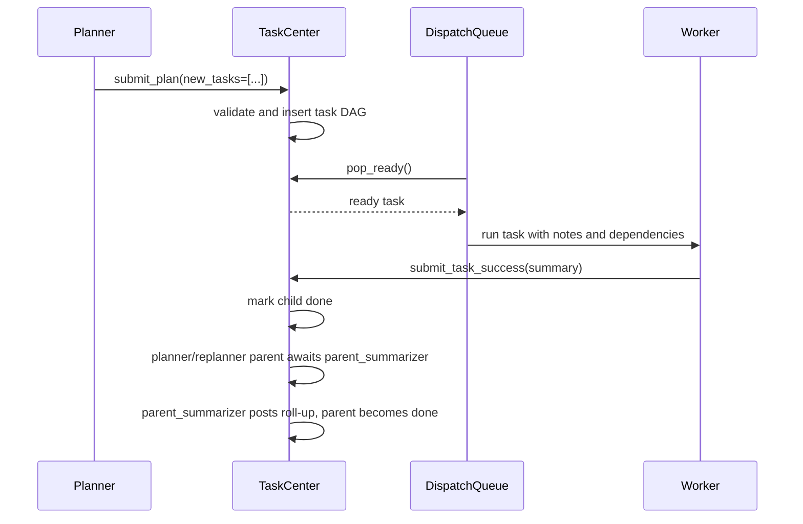
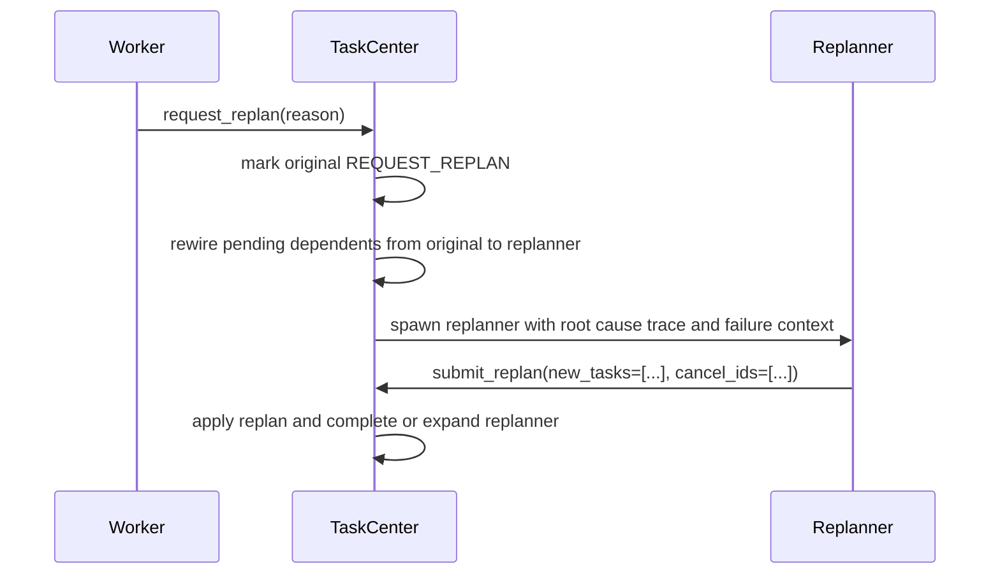

# Team Coordination

EphemeralOS team coordination separates work execution from failure recovery across two core roles: **worker agents** complete assigned tasks, and **replanners** turn failed work into corrective task graph changes.

## Plan And Dispatch

## Failure Recovery

When a task enters `request_replan`, pending dependent tasks are rewired from the failed task to the replanner task, so they remain gated until the replanner is `DONE`. Any dependent of the failed task with a non-pending status is a graph invariant violation, because a task that still depends on an unfinished or failed dependency cannot already be ready, running, expanded, `request_replan`, or terminal. The executor reaches this path by calling `TaskCenter.request_replan`; TaskCenter owns the lifecycle mutation and persistence transaction. The failed task summary should carry the developer's root cause trace when verification failed, including the failing command, expected-vs-actual behavior, traced production path, root-cause mechanism, and fix location.

Graph invariant violations fail the team run immediately. Across dispatch,
recovery, and checkpoint restore, scheduler-owned work states (`ready`,
`running`, `expanded`, `request_replan`, and `done`) are valid only when all
dependencies are `done`; failed or cancelled dependencies are not satisfied.
For the broader run-failure taxonomy, see
[`team-failure-conditions.md`](team-failure-conditions.md).

The replanner is the recovery gate for downstream work. Corrective work goes into `new_tasks`, every new task is inserted as a direct child of the replanner at the replanner's depth, and `cancel_ids` may target only the replanner's direct siblings; their subtrees cancel by cascade. The submitted corrective task JSON is appended to the replanner detail as `Initial Replan`, while downstream context is produced by the parent summarizer after the replanner's children terminate. New replan tasks may depend on local new tasks or schedulable existing tasks that do not already depend on the replanner/original failure pair. `submit_replan` rejects empty `new_tasks`; a replanner that cannot justify at least one corrective child must keep diagnosing the failed work. The replanner becomes `EXPANDED` after submitting direct child tasks, then `EXPANDED_AWAITING_SUMMARY` after all direct children are terminal, and reaches `DONE` only after `parent_summarizer` posts the roll-up.

## Status Model

Task statuses are:

- `pending`
- `ready`
- `running`
- `expanded`
- `expanded_awaiting_summary`
- `request_replan`
- `done`
- `failed`
- `cancelled`

Terminal statuses are `done`, `failed`, `cancelled`, and `request_replan`.

## Design Principles

- Worker agents do not change the graph directly; they submit success summaries or request replanning with evidence. Verification failures should include a root cause trace deep enough to name the first production mechanism that created the wrong result.
- Replanners are the only agents that mutate the recovery graph through `submit_replan`.
- Planner and replanner `new_tasks` items carry `description` as a required short, planner-authored label; full instructions belong in `spec`.
- Planner and replanner submissions carry structured task JSON only. They do not author free-text outcome summaries; their `Initial Plan` / `Initial Replan` JSON is stored on the parent detail, and `parent_summarizer` later writes the outcome roll-up.
- Parent summarizers finalize parents only when the child evidence is actually delivered; unresolved roll-ups use `request_replan(reason=...)` so the summarized parent is replanned instead of marked `done`.
- Ready tasks dispatch as soon as dependencies are satisfied.
- Scope change auto-checks warn workers when another agent edits overlapping paths.
- Developer and validator lanes read Task Center notes and use CI ownership/diagnostic tools before falling back to raw sandbox file reads.
- `daytona_shell` is runtime-only on coordinated lanes. File edits go through `daytona_edit_file`, `daytona_write_file`, or `daytona_rename_symbol`; shell/Python edit side channels such as `sed -i`, standalone `tee`, and inline Python writes are rejected before sandbox execution. The global daytona_shell prehook sanitizes output-shaping syntax such as pipes, `head`/`tail`, output redirects, stderr merges/suppression, and leading repo-root `cd` before execution so runtime output remains visible in the captured tool result.
- Every team task exits through a terminal submission tool: `submit_plan`, `submit_replan`, `submit_task_success`, or `request_replan`.
