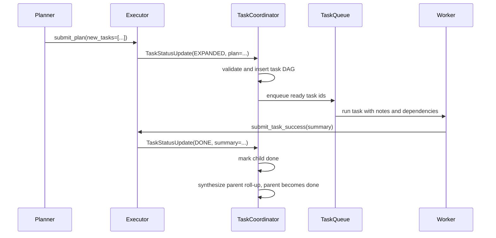
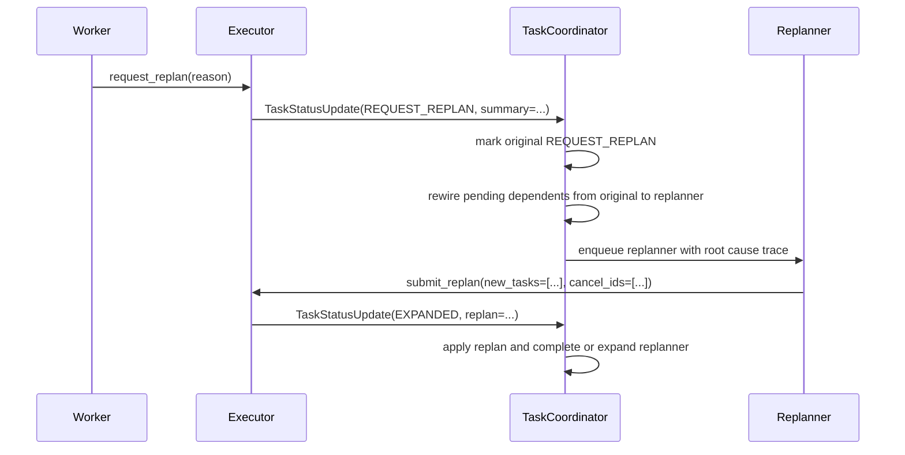

# Team Coordination

EphemeralOS team coordination separates work execution from failure recovery across two core roles: **worker agents** complete assigned tasks, and **replanners** turn failed work into corrective task graph changes.

## Plan And Dispatch

## Failure Recovery

When a task enters `request_replan`, pending dependent tasks are rewired from the failed task to the replanner task, so they remain gated until the replanner is `DONE`. Any dependent of the failed task with a non-pending status is a graph invariant violation, because a task that still depends on an unfinished or failed dependency cannot already be ready, running, expanded, `request_replan`, or terminal. The executor reaches this path by translating terminal metadata into `TaskStatusUpdate(REQUEST_REPLAN, ...)`; `TaskCoordinator` owns the lifecycle mutation and persistence transaction. The failed task summary should carry the developer's root cause trace when verification failed, including the failing command, expected-vs-actual behavior, traced production path, root-cause mechanism, and fix location.

Graph invariant violations fail the team run immediately. Across dispatch
and recovery, scheduler-owned work states (`ready`,
`running`, `expanded`, `request_replan`, and `done`) are valid only when all
dependencies are `done`; failed or cancelled dependencies are not satisfied.
For the broader run-failure taxonomy, see
[`team-failure-conditions.md`](team-failure-conditions.md).

The replanner is the recovery gate for downstream work. Corrective work goes into `new_tasks`, every new task is inserted as a direct child of the replanner at the replanner's depth, and `cancel_ids` may target only the replanner's direct siblings; their subtrees cancel by cascade. New replan tasks may depend on local new tasks or schedulable existing tasks that do not already depend on the replanner/original failure pair. `submit_replan` rejects empty `new_tasks`; a replanner that cannot justify at least one corrective child must keep diagnosing the failed work. The replanner becomes `EXPANDED` after submitting direct child tasks and reaches `DONE` when its direct children are terminal and `TaskCoordinator` synthesizes the roll-up from child submissions.

## Status Model

Task statuses are:

- `pending`
- `ready`
- `running`
- `expanded`
- `request_replan`
- `done`
- `failed`
- `cancelled`

Terminal statuses are `done`, `failed`, `cancelled`, and `request_replan`.

## Design Principles

- Worker agents do not change the graph directly; they submit success summaries or request replanning with evidence. Verification failures should include a root cause trace deep enough to name the first production mechanism that created the wrong result.
- Replanners are the only agents that mutate the recovery graph through `submit_replan`.
- Planner and replanner `new_tasks` items carry full task instructions in `spec`; they do not require a separate short `description` field.
- Planner and replanner submissions carry structured task JSON only. They do not author free-text outcome summaries or file notes; `TaskCoordinator` synthesizes parent roll-ups from child terminal summaries.
- Ready tasks dispatch as soon as dependencies are satisfied.
- Scope change auto-checks warn workers when another agent edits overlapping paths.
- Developer and validator lanes read file notes and use CI ownership/diagnostic tools before falling back to raw sandbox file reads.
- `daytona_shell` is runtime-only on coordinated lanes. File edits go through `daytona_edit_file` or `daytona_write_file`; shell/Python edit side channels such as `sed -i`, standalone `tee`, and inline Python writes are rejected before sandbox execution. The global daytona_shell prehook sanitizes output-shaping syntax such as pipes, `head`/`tail`, output redirects, stderr merges/suppression, and leading repo-root `cd` before execution so runtime output remains visible in the captured tool result.
- Every team task exits through a terminal submission tool: `submit_plan`, `submit_replan`, `submit_task_success`, or `request_replan`.
