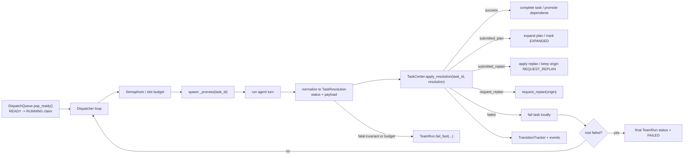

# Implementation Plan: Dispatcher Simplification

## Overview

Simplify team execution plumbing without changing the current task model.

The redesign target is:

- one dispatcher loop per `TeamRun`
- bounded fan-out for runnable work
- one TaskCenter entry point for status-based agent completions
- no change to the current failure, replan, or parent-summary semantics

The key correction from the earlier draft is architectural:

- `Dispatcher` should own execution plumbing only
- `TaskCenter` should remain the sole owner of graph policy

This keeps the execution layer task-status based and agent-type agnostic while
preserving the existing runtime invariants:

- `FAILED` is usually a task-local outcome, not a run-fatal one
- `REQUEST_REPLAN` remains terminal on the original failed task
- run-fatal paths stay explicit: graph invariants, budget exhaustion, and
  unrecoverable runtime or persistence failures

## Locked Shape

### Three runtime roles

1. `TeamRun`
   - owns lifecycle, startup, shutdown, rollback, and final-status computation
   - owns the dispatcher loop task and the set of in-flight processor tasks
   - owns the explicit `fail_fast(...)` escape hatch

2. `Dispatcher`
   - owns `pop_ready` polling
   - owns bounded fan-out of runnable work
   - owns agent execution and status normalization
   - does not own graph mutation policy

3. `TaskCenter`
   - owns task graph mutation, status promotion, parent-summary lifecycle,
     replanner creation, replan application, and recovery scans
   - provides one main policy entry point for agent completions:
     `apply_resolution(task_id, resolution)`

### Non-goals

- Do not redefine `FAILED` to mean run failure.
- Do not make `REQUEST_REPLAN` non-terminal.
- Do not force `READY -> RUNNING`, bulk cancel, or shutdown teardown through a
  fake universal `transition(...)` API.
- Do not move replan rewiring, parent-summary injection, or promotion policy
  into the dispatcher.

## Simplified Control Flow



## Why This Is Simpler

The simplification target is not "every write goes through one method."
That sounds clean, but it fights the actual runtime shape:

- `READY -> RUNNING` is scheduler-owned and already atomic in `DispatchQueue`
- bulk cancel is teardown-oriented and intentionally batched
- replan application is already a composite, atomic graph mutation

The simpler boundary is:

- one execution entry point: `Dispatcher._process(...)`
- one policy entry point for terminal agent results:
  `TaskCenter.apply_resolution(...)`
- existing lower-level store methods kept for the operations that are already
  naturally atomic and well-scoped

That removes the current "executor dispatch knows too much" problem without
turning the dispatcher into a second TaskCenter.

## Desired Properties

### 1. Execution plumbing is status based

The dispatcher should hand TaskCenter a normalized completion object whose
primary routing key is task status, not agent type or tool name.

Status remains the top-level contract, with payload only where status alone is
insufficient:

```python
@dataclass
class TaskResolution:
    status: TaskStatus
    summary: str = ""
    submitted_plan: Plan | None = None
    submitted_replan: ReplanPlan | None = None
    explicit_replan: bool = False
    fatal: bool = False
    reason: str | None = None
```

`Dispatcher._read_result(...)` becomes the only place that translates tool
metadata into this status-first resolution.

### 2. Dispatcher is agent-type agnostic

The dispatcher should not branch on planner vs worker vs replanner vs
parent-summary role. It runs a task and hands `TaskResolution` to `TaskCenter`.

### 3. TaskCenter handles semantic exceptions

Some outcomes need task context beyond raw status:

- an explicit `REQUEST_REPLAN` from a parent-summary task targets the parent,
  not the sidecar itself
- a replanner completion may finalize `replanned_by:<replanner_id>` on the
  original failed task
- parent-summary success finalizes the parent, not the summary sidecar only

Those are graph semantics, so they stay in `TaskCenter`.

The rule is:

- execution layer is agent-type agnostic
- lifecycle layer may use task traits and graph metadata where necessary

## Runtime Semantics To Preserve

### Failure

- `fail_task(task_id, reason)` remains task-local.
- `FAILED` only becomes a run failure when:
  - the failed task is the root, or
  - detached-child propagation reaches the root, or
  - a separate fatal path explicitly calls `fail_fast(...)`

### Replan

- `request_replan(...)` keeps the original task at `REQUEST_REPLAN`
- the original task remains terminal and detached
- recovery lives on the replanner branch
- replanner success records `replanned_by:<replanner_id>` on the origin and
  does not transition the origin back to `DONE`

### Parent Summary

- `EXPANDED_AWAITING_SUMMARY` stays TaskCenter-owned
- summary-sidecar creation and finalization remain graph-policy operations
- explicit replan from the summary sidecar targets the summarized parent

## Proposed Design

## Phase 1: Introduce `TaskResolution` + `TaskCenter.apply_resolution`

No behavior change in this phase.

### 1.1 Add status-first completion normalization

Add a small shared outcome type, either in:

- `backend/src/team/runtime/task_resolution.py`, or
- `backend/src/team/models.py`

Responsibilities:

- represent terminal agent completion as status plus payload
- keep status as the main routing primitive
- keep the dispatcher decoupled from tool metadata and raw runner exceptions

Recommended status mapping:

- success summary -> `TaskStatus.DONE`
- submitted plan -> `TaskStatus.EXPANDED` with `submitted_plan`
- submitted replan -> `TaskStatus.EXPANDED` with `submitted_replan`
- request replan -> `TaskStatus.REQUEST_REPLAN`
- local failure -> `TaskStatus.FAILED`

### 1.2 Add `TaskCenter.apply_resolution(...)`

File: `backend/src/team/task_center.py`

```python
async def apply_resolution(
    self, task_id: str, resolution: TaskResolution
) -> list[Task]:
    ...
```

Responsibilities:

- load the current task
- route the normalized outcome to the existing lifecycle methods
- preserve special cases that depend on task semantics

Suggested shape:

```python
async def apply_resolution(
    self, task_id: str, resolution: TaskResolution
) -> list[Task]:
    task = self.graph.get(task_id)
    if task is None:
        raise RuntimeError(f"task {task_id} missing")

    if resolution.status is TaskStatus.REQUEST_REPLAN:
        target_id = self._replan_target(task, resolution)
        await self.request_replan(
            target_id,
            ReplanRequest(
                reason=resolution.reason or resolution.summary,
                explicit=resolution.explicit_replan,
            ),
        )
        if target_id != task_id and resolution.summary:
            return await self.complete_task(
                task_id, AgentResult(summary=resolution.summary)
            )
        return []

    if (
        resolution.status is TaskStatus.EXPANDED
        and resolution.submitted_replan is not None
    ):
        return await self.complete_task(
            task_id,
            AgentResult(summary="", submitted_replan=resolution.submitted_replan),
        )

    if (
        resolution.status is TaskStatus.EXPANDED
        and resolution.submitted_plan is not None
    ):
        return await self.complete_task(
            task_id,
            AgentResult(summary="", submitted_plan=resolution.submitted_plan),
        )

    if resolution.status is TaskStatus.DONE:
        return await self.complete_task(
            task_id, AgentResult(summary=resolution.summary)
        )

    if resolution.status is TaskStatus.FAILED:
        if resolution.fatal:
            await self.force_fail_task(
                task_id, resolution.reason or "fatal_task_failure"
            )
        else:
            await self.fail_task(task_id, resolution.reason or "task_failed")
        return []

    raise RuntimeError(f"unsupported resolution status: {resolution.status}")
```

### 1.3 Keep current TaskCenter primitives

Keep these as the actual graph-policy methods:

- `complete_task`
- `fail_task`
- `force_fail_task`
- `request_replan`
- `apply_replan`
- `finalize_parent_awaiting_summary`
- `fail_parent_awaiting_summary`

The simplification is "one dispatcher handoff point keyed by status," not
"collapse all graph logic into one huge transition method."

### 1.4 Move startup recovery into TaskCenter-owned recovery helpers

Recovery is graph policy, so it belongs with `TaskCenter`, not `Dispatcher`.

Suggested helper:

```python
async def startup_recovery(self) -> None:
    await self.store.recover_running()
    await self._ensure_missing_parent_summary_tasks()
```

Current semantics to preserve:

- `RUNNING` tasks are downgraded to `READY` during resume
- missing parent-summary sidecars are re-injected
- orphaned `REQUEST_REPLAN` remains a compatibility no-op under the current
  detached-origin model

## Phase 2: Replace `Executor` with a thin `Dispatcher`

This is the main plumbing change.

### 2.1 New file: `backend/src/team/runtime/dispatcher.py`

Define `Dispatcher`:

- `__init__(team_run, runner, agent_lookup, build_query_context=None, after_dispatch=None, max_inflight=2)`
- `async run_forever()`
- `async _process(task)`
- `async _run_agent(task) -> TaskResolution`

### 2.2 Dispatcher loop is single-threaded, fan-out is bounded

Use one claim loop and a semaphore to preserve bounded concurrency.

Suggested shape:

```python
class Dispatcher:
    def __init__(..., max_inflight: int = 2) -> None:
        self._slots = asyncio.Semaphore(max_inflight)
        self._inflight: set[asyncio.Task[None]] = set()

    async def run_forever(self) -> None:
        while not self.team_run.cancel_event.is_set():
            await self._slots.acquire()
            try:
                rec = await self.team_run.dispatch_queue.pop_ready(self.team_run.id)
            except Exception:
                self._slots.release()
                raise

            if rec is None:
                self._slots.release()
                await asyncio.sleep(0.05)
                continue

            task = record_to_task(rec)
            proc = asyncio.create_task(self._process(task))
            self._inflight.add(proc)
            self.team_run.register_processor_task(proc)
            proc.add_done_callback(self._on_done)
```

Where `_on_done(...)`:

- removes the processor task from `_inflight`
- unregisters it from `TeamRun`
- releases the semaphore slot

This is the missing piece from the earlier draft: single dispatcher loop does
not imply single async task in the run. The loop claims work, but processing
still happens in tracked fan-out tasks.

### 2.3 `_process(...)` is thin

`_process(...)` should:

1. call `_run_agent(task)` to get `TaskResolution`
2. call `task_center.apply_resolution(task.id, resolution)`
3. emit checkpoints and `after_dispatch` callbacks
4. escalate only true fatal paths to `team_run.fail_fast(...)`

It should not:

- create replanners directly
- inject summary sidecars directly
- promote parents directly
- interpret graph lifecycle rules directly

### 2.4 `_run_agent(...)` owns normalization, not lifecycle

Move the current executor responsibilities here:

- context construction
- runner invocation
- missing terminal-tool fallback
- conversion from tool metadata to `TaskResolution`
- conversion from ordinary runner exceptions to
  `TaskResolution(status=TaskStatus.FAILED, ...)`

Fatal path remains explicit:

- graph invariant violations
- task/replan budget exhaustion
- unrecoverable persistence/runtime cleanup

These still route to `team_run.fail_fast(...)`.

## Phase 3: TeamRun lifecycle updates

### 3.1 Track the right tasks

`TeamRun` should track:

- `_dispatcher_loop_task: asyncio.Task | None`
- `_processor_tasks: set[asyncio.Task[None]]`
- `_active_agent_runs: dict[str, asyncio.Task[object]]`

These are different layers:

- dispatcher loop task = claims new work
- processor tasks = own `_process(...)`
- active agent runs = own the runner coroutine for a specific agent turn

### 3.2 Join and stop semantics

`wait()`, rollback, and `fail_fast()` must account for all three layers.

Required behavior:

- stop claim loop
- wait for processor tasks to finish or cancel them on timeout
- cancel active agent runs when fail-fast or rollback requires it

Suggested helpers:

- `_spawn_dispatcher()`
- `_join_dispatcher()`
- `_stop_dispatcher_loop()`
- `_drain_processor_tasks()`

### 3.3 Startup sequence

`TeamRun.start(...)` / `resume(...)` sequence:

1. initialize TaskCenter and DispatchQueue
2. call `task_center.startup_recovery()`
3. construct dispatcher
4. spawn dispatcher loop

This keeps recovery policy in `TaskCenter` and execution policy in the
dispatcher.

## Preserved State Machine

| From | To | Owner | Notes |
|---|---|---|---|
| `pending` | `ready` | TaskCenter/store | plan insertion and dependent promotion |
| `ready` | `running` | DispatchQueue | atomic claim path only |
| `running` | `done` | TaskCenter | normal successful completion |
| `running` | `expanded` | TaskCenter | planner or replanner submitted child tasks |
| `running` | `request_replan` | TaskCenter | origin becomes terminal and detached |
| `running` | `failed` | TaskCenter | task-local failure |
| `running` | `cancelled` | TaskCenter/store | teardown or replan cancel |
| `expanded` | `expanded_awaiting_summary` | TaskCenter/store | planner or replanner parent summary gate |
| `expanded` | `done` | TaskCenter/store | non-expandable parent with successful children |
| `expanded` | `failed` | TaskCenter/store | `all_children_detached` propagation |
| `expanded_awaiting_summary` | `done` | TaskCenter | summary sidecar finalization |
| `expanded_awaiting_summary` | `failed` | TaskCenter | summary failure path |
| `request_replan` | terminal | TaskCenter/store | success only updates `failure_reason` |

## Better Design Than The Earlier Draft

The earlier draft tried to simplify by making the dispatcher own
`on_status(...)`. That overcorrects:

- it enlarges the scheduler into a graph-policy object
- it still cannot honestly claim a single write path
- it changes failure and replan semantics in the process

The better design is:

- thin dispatcher
- bounded fan-out
- one normalized status-first completion object
- one TaskCenter policy entry point keyed by status
- existing atomic store methods kept where they already fit the model

This gives the runtime a much simpler execution story without rewriting the
task model.

## Concrete File Plan

### New or renamed files

- `backend/src/team/runtime/dispatcher.py`
- optionally `backend/src/team/runtime/task_resolution.py`

### Main edits

- `backend/src/team/runtime/team_run.py`
- `backend/src/team/task_center.py`
- `backend/src/team/runtime/services.py`
- `backend/src/team/runtime/__init__.py`

### Keep load-bearing primitives

- `backend/src/team/runtime/dispatch_queue.py`
- `backend/src/team/persistence/task_store.py::request_replan`
- `backend/src/team/persistence/task_store.py::apply_replan_atomic`
- `backend/src/team/task_center.py` promotion and parent-summary helpers
- `backend/src/team/runtime/transitions.py`

## Test Impact

Targeted test updates should focus on:

1. dispatcher loop shutdown and draining semantics
2. bounded fan-out preserving current concurrency limits
3. `TaskCenter.apply_resolution(...)` preserving current planner, worker,
   replanner, and parent-summary behavior
4. resume/startup recovery still re-injecting parent-summary tasks
5. replan origin remaining terminal at `REQUEST_REPLAN`
6. non-root `FAILED` remaining task-local unless a fatal path explicitly
   triggers `fail_fast(...)`

## Summary

The simplified design should be:

- single dispatcher loop
- bounded processor fan-out
- one normalized `TaskResolution`
- one `TaskCenter.apply_resolution(...)` handoff
- unchanged team fault model
- unchanged `REQUEST_REPLAN` semantics

That is the narrow redesign that actually improves execution plumbing without
quietly rewriting the team runtime contract.
