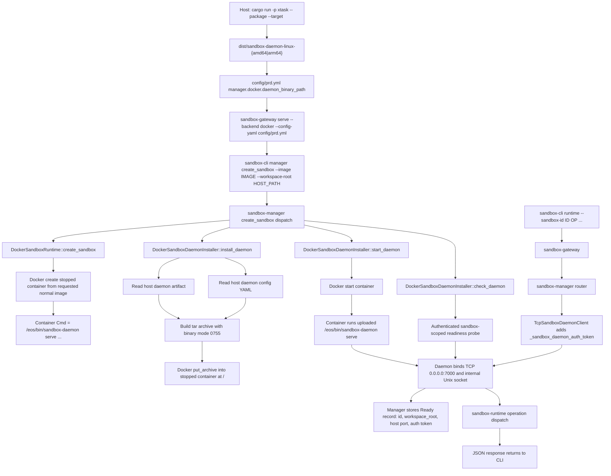

# Sandbox Daemon Upload Workflow Spec

**Status:** proposed

**Scope:** `xtask`, `config/prd.yml`, `sandbox-gateway`, `sandbox-manager`,
`sandbox-provider-docker`, `sandbox-daemon`, and `sandbox-e2e-live-test`.

**Core rule:** do not build Rust inside the sandbox container and do not build a
custom sandbox image. The host builds a Linux musl `sandbox-daemon` binary, the
Docker provider uploads that binary plus daemon config into a stopped normal
base-image container, then Docker starts the container with the uploaded daemon
as its foreground command.

This spec uses the old `eosd` lane only as the reference idea. It does not
restore or copy the old `sandbox/` tree. The current codebase already contains
the replacement pieces.

---

## 1. Objective

Make the current Docker-backed lane explicit and reliable:

```text
host build -> create stopped sandbox container -> upload daemon/config ->
start daemon in container -> authenticate readiness -> forward runtime ops
```

The end result is that this public path works:

```sh
cargo run -p xtask -- package --target <linux-musl-target>

sandbox-gateway serve --backend docker --config-yaml config/prd.yml \
  --gateway-socket 127.0.0.1:7878 --auth-token <gateway-token>

sandbox-cli manager create_sandbox \
  --image python:3.11-bookworm \
  --workspace-root /absolute/host/workspace

sandbox-cli runtime --sandbox-id <id> exec_command pwd
```

---

## 2. Non-goals

- No custom runtime image build.
- No Rust compilation inside the sandbox container.
- No reintroduction of old `eosd`, `eos-api`, or `eos-sandbox-host` crates.
- No `docker exec` forwarding for runtime operations. Runtime operations go over
  authenticated TCP to `sandbox-daemon`.
- No image auto-pull in this lane. The requested image should already be present
  on the Docker host unless a later spec changes that policy.

---

## 3. Component Mapping

| Old idea | Current component | Responsibility |
|---|---|---|
| `eosd` in-container daemon | `crates/sandbox-daemon` | Serve TCP, authenticate daemon requests, dispatch runtime ops. |
| `xtask package` producing `dist/eosd-*` | `xtask package` producing `dist/sandbox-daemon-*` | Host-side Linux musl artifact build. |
| `eos-sandbox-host` container lifecycle | `crates/sandbox-provider-docker` | Docker create/upload/start/recover/remove. |
| `ProtocolClient` | `TcpSandboxDaemonClient` | Host-side authenticated TCP client to daemon. |
| `eos-api` host router | `sandbox-gateway` + `sandbox-manager` | Gateway transport, manager lifecycle, runtime forwarding. |

---

## 4. Workflow



### 4.1 Host Build

`xtask package` is the only supported production packaging entrypoint:

```sh
cargo run -p xtask -- package --target x86_64-unknown-linux-musl --builder cargo --profile package-local
cargo run -p xtask -- package --target aarch64-unknown-linux-musl --builder cargo --profile package-local
```

If the target has C dependencies, the musl C compiler/linker is host setup. Put
the local cross-toolchain on `PATH` and/or set `CC_<target>`,
`CXX_<target>`, `AR_<target>`, and `CARGO_TARGET_<TARGET>_LINKER` before running
`xtask`. Do not install packages inside the sandbox container, do not compile
Rust inside the sandbox, and do not build a Docker builder image.

Use `package-local` for live Docker E2E iteration. Use `package-fast` or
`release` only when you need a more optimized daemon artifact.

Expected artifacts:

```text
dist/sandbox-daemon-linux-amd64
dist/sandbox-daemon-linux-arm64
dist/SHA256SUMS
dist/sandbox-daemon-linux-amd64.json
dist/sandbox-daemon-linux-arm64.json
```

The artifact configured in `config/prd.yml` must match the Docker platform. On
an arm64 Docker engine, `daemon_binary_path` should normally point at
`dist/sandbox-daemon-linux-arm64`. If the gateway forces `platform: linux/amd64`,
the configured artifact should be `dist/sandbox-daemon-linux-amd64`.

### 4.2 Gateway Start

Docker mode is selected only when the gateway is started with:

```sh
sandbox-gateway serve --backend docker --config-yaml config/prd.yml
```

In Docker mode, `sandbox-gateway` must construct:

- `DockerSandboxRuntime`
- `DockerSandboxDaemonInstaller`
- `TcpSandboxDaemonClient`
- an in-memory `SandboxStore`, seeded by Docker label recovery where possible

### 4.3 Sandbox Creation

`sandbox-cli manager create_sandbox` must perform this order:

1. `DockerSandboxRuntime::create_sandbox`
   - generate sandbox id and per-sandbox daemon auth token
   - create a stopped Docker container from the requested image
   - set the container command to the uploaded daemon path
   - bind-mount the host workspace to the configured container workspace path
   - publish the daemon TCP port to `127.0.0.1:0`
   - label the container with sandbox id, gateway instance id, auth token,
     workspace root, daemon port, and cleanup policy
2. `SandboxStore::create`
   - create a `Creating` manager record
3. `DockerSandboxDaemonInstaller::install_daemon`
   - read the host daemon binary from `manager.docker.daemon_binary_path`
   - read the host daemon config YAML from `manager.docker.daemon_config_yaml_path`
   - build an in-memory tar archive containing:
     - daemon binary at `container_daemon_binary_path`, mode `0755`
     - config YAML at `container_daemon_config_yaml_path`, mode `0644`
     - required parent directories, mode `0755`
   - upload the tar with Docker `put_archive` into the stopped container
4. `DockerSandboxDaemonInstaller::start_daemon`
   - start the container
   - resolve Docker's published host port
   - recover the auth token from labels
5. `DockerSandboxDaemonInstaller::check_daemon`
   - send an authenticated readiness request over TCP
   - require a success JSON response from the daemon
6. Store endpoint and transition `Creating -> Ready`

Any failure after runtime create must roll back:

```text
stop daemon best effort -> remove Docker container -> remove manager record
```

### 4.4 In-container Daemon

The container command must use the uploaded daemon path and container-side paths:

```text
/eos/bin/sandbox-daemon serve
  --config-yaml /eos/config/daemon.yml
  --workspace-root /workspace
  --socket /tmp/eos-runtime.sock
  --pid-file /tmp/eos-runtime.pid
  --tcp-host 0.0.0.0
  --tcp-port 7000
  --auth-token <per-sandbox-token>
  --sandbox-id <sandbox-id>
```

`sandbox-daemon serve` must:

- load daemon/runtime config from the uploaded YAML
- construct `SandboxRuntimeOperations`
- bind the internal Unix socket
- bind the TCP listener when `--tcp-host` and `--tcp-port` are set
- require `_sandbox_daemon_auth_token` on TCP requests
- strip the auth token before request decode/dispatch
- accept only sandbox-scoped daemon requests

### 4.5 Readiness Contract

The readiness probe must prove more than a bare TCP connect. It should prove:

- the uploaded binary starts
- the uploaded config can be loaded
- the TCP listener is bound
- the per-sandbox auth token is accepted
- request decode and daemon dispatch are functional
- the daemon agrees with the expected sandbox id

Add a private daemon op:

```text
sandbox_daemon_ready
```

Request:

```json
{
  "op": "sandbox_daemon_ready",
  "request_id": "docker-readiness",
  "scope": { "kind": "sandbox", "sandbox_id": "<sandbox-id>" },
  "args": {},
  "_sandbox_daemon_auth_token": "<per-sandbox-token>"
}
```

Response:

```json
{
  "status": "ready",
  "sandbox_id": "<sandbox-id>",
  "daemon": "sandbox-daemon"
}
```

The Docker installer must treat any response that is not successful JSON with the
expected `status` and `sandbox_id` as not ready.

### 4.6 Runtime Forwarding

After the manager record is `Ready`, runtime operations follow this lane:

```text
sandbox-cli runtime --sandbox-id <id> <op>
  -> sandbox-gateway
  -> SandboxManagerRouter
  -> store lookup for Ready record
  -> TcpSandboxDaemonClient
  -> sandbox-daemon TCP listener
  -> sandbox-runtime dispatch_operation
  -> one newline-terminated JSON response
```

The manager must not inspect container filesystem state to answer runtime
operations. The daemon is the runtime authority.

---

## 5. Resulting File Folder Structure

The intended structure is the current workspace plus one narrow Docker daemon
upload lane. No old tree is restored.

```text
ephemeral-os/
  Cargo.toml

  xtask/
    src/main.rs
      # package sandbox-daemon for linux-musl targets into dist/

  dist/
    sandbox-daemon-linux-amd64
    sandbox-daemon-linux-arm64
    SHA256SUMS
    sandbox-daemon-linux-amd64.json
    sandbox-daemon-linux-arm64.json

  config/
    prd.yml
      # daemon/runtime config consumed by sandbox-daemon
      # manager.docker config consumed by sandbox-gateway in Docker mode

  crates/
    sandbox-gateway/
      src/gateway/main.rs
        # CLI entry for gateway serve; selects Docker backend
      src/gateway/
        config.rs
        connection.rs
        lifecycle.rs
        server.rs
      src/cli/
        main.rs
        client.rs
        config.rs
        output.rs
        request_builder.rs
      tests/

    sandbox-manager/
      src/model.rs
        # SandboxId, SandboxRecord, SandboxDaemonEndpoint, SandboxState
      src/runtime.rs
        # SandboxRuntime trait
      src/daemon_install.rs
        # SandboxDaemonInstaller trait and local implementation
      src/daemon_client.rs
        # TcpSandboxDaemonClient
      src/store.rs
      src/router/
        dispatch.rs
        forward.rs
        mod.rs
      src/operation/
        dispatch.rs
        specs.rs
        impls/management/
          create_sandbox.rs
          destroy_sandbox.rs
          inspect_sandbox.rs
          list_sandboxes.rs
          get_observability_tree.rs
      tests/

    sandbox-provider-docker/
      src/lib.rs
      src/runtime.rs
        # DockerSandboxRuntime: create/remove/recover containers
      src/installer.rs
        # DockerSandboxDaemonInstaller: upload/start/readiness
      src/engine.rs
        # bollard wrapper: create, put_archive, start, inspect, logs, remove
      src/archive.rs
        # tar archive for daemon binary and config YAML
      src/launch.rs
        # container command argv for uploaded sandbox-daemon
      src/labels.rs
        # Docker label vocabulary for recovery and auth
      src/artifact.rs
        # optional hardening: host artifact validation before upload
      tests/

    sandbox-daemon/
      src/main.rs
        # subcommand router: serve | ns-runner | ns-holder
      src/serve.rs
        # parse serve args, load config, build runtime services
      src/server/
        mod.rs
        runtime.rs
          # ServerConfig and SandboxDaemonServer
        lifecycle.rs
          # Unix listener, optional TCP listener, shutdown
        connection.rs
          # read one JSON line, write one JSON line
        dispatch.rs
          # TCP auth strip, private readiness op, runtime dispatch
        error.rs
      src/runner/
      src/holder.rs
      src/cgroup_setup.rs
      src/observability/
      tests/

    sandbox-protocol/
      src/auth.rs
        # _sandbox_daemon_auth_token and _sandbox_gateway_auth_token
      src/request.rs
      src/response.rs
      src/scope.rs
      src/catalog.rs
      tests/

    sandbox-runtime/
      operation/
        src/operation.rs
          # runtime operation catalog and dispatch_operation
        src/services.rs
          # SandboxRuntimeOperations service graph
        src/command/
        src/workspace_session/
        src/layerstack/
        tests/
      workspace/
      namespace-process/
      namespace-execution/
      layerstack/
      overlay/

    sandbox-config/
      src/configs/manager.rs
        # manager.docker schema
      src/configs/daemon.rs
      src/configs/runtime.rs
      tests/

    sandbox-e2e-live-test/
      src/bin/eos-e2e.rs
        # live orchestrator and preflight
      src/fixtures.rs
        # create_sandbox through public CLI
      src/cli_client.rs
      tests/manager/
      tests/runtime/
```

If `src/artifact.rs` is added, it should stay provider-local. It must validate
the host artifact before upload; it must not run inside the sandbox container.

---

## 6. Expected Production Code Changes

The baseline lane already exists. The expected production delta is small.

| File | Expected change |
|---|---|
| `crates/sandbox-daemon/src/server/dispatch.rs` | Add private `sandbox_daemon_ready` handling before public runtime dispatch. |
| `crates/sandbox-manager/src/daemon_install.rs` | Change `check_daemon` to receive the `SandboxRecord` or sandbox id, so readiness can be sandbox-scoped. |
| `crates/sandbox-manager/src/operation/impls/management/create_sandbox.rs` | Pass the record into daemon readiness. |
| `crates/sandbox-provider-docker/src/installer.rs` | Build the sandbox-scoped readiness request and validate the response. |
| `crates/sandbox-provider-docker/src/artifact.rs` | Optional but recommended: validate host daemon artifact before upload. |
| `crates/sandbox-provider-docker/src/lib.rs` | Add `mod artifact;` if artifact validation is implemented. |

No production code should be added to build Rust inside Docker or inside the
sandbox container.

---

## 7. Acceptance Criteria

1. `cargo run -p xtask -- package --target <linux-musl-target>` produces a
   matching `dist/sandbox-daemon-linux-*` artifact.
2. `sandbox-gateway serve --backend docker --config-yaml config/prd.yml` starts
   with Docker services wired.
3. `sandbox-cli manager create_sandbox` creates a normal requested-image
   container, uploads daemon/config, starts the container, and returns a `ready`
   manager record.
4. A readiness failure includes Docker state and daemon log context where
   available.
5. `sandbox-cli runtime --sandbox-id <id> exec_command pwd` reaches the daemon
   over TCP and returns a successful runtime response.
6. `sandbox-cli manager destroy_sandbox --sandbox-id <id>` removes the container
   and manager record.
7. The live E2E manager and runtime suites exercise this public workflow rather
   than direct provider internals.
