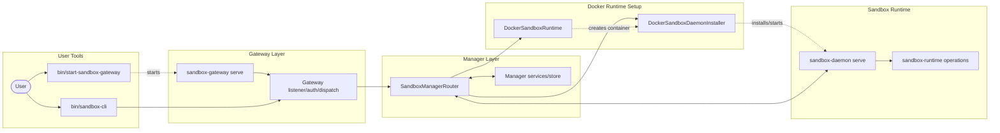
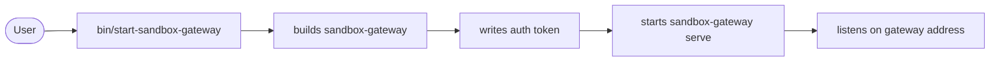
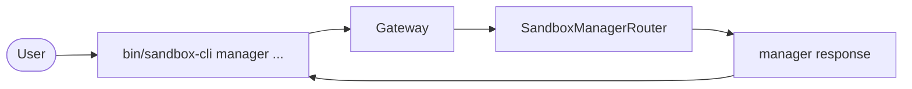
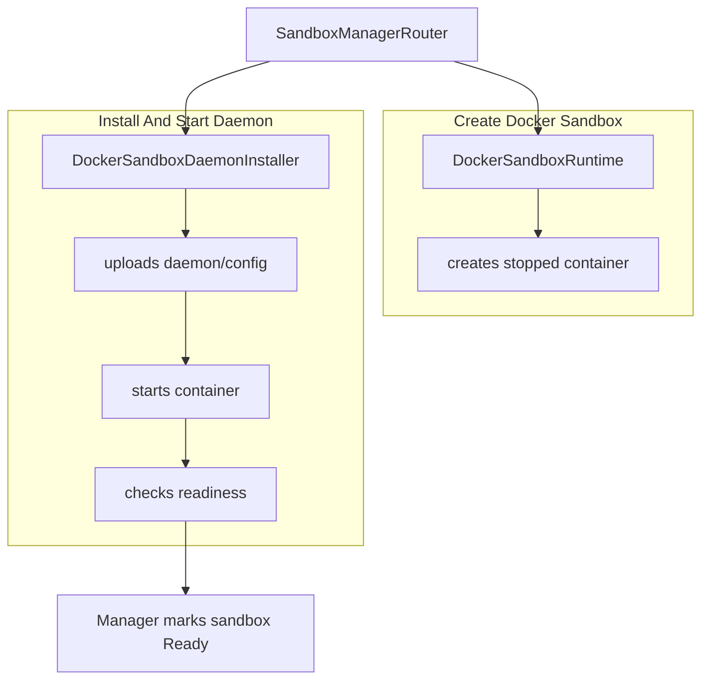
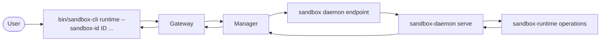

# CLI Gateway Manager Runtime

This note shows the normal operator path: start the gateway, send manager commands through `bin/sandbox-cli`, create a Docker-backed sandbox, then forward runtime commands to the sandbox daemon.

The gateway is the public entry point. The manager owns sandbox records and lifecycle. The Docker runtime creates containers, the installer places and starts `sandbox-daemon`, and the daemon runs `sandbox-runtime` operations inside the sandbox.

The useful mental model is: operators talk to one gateway, the gateway talks to one manager, and the manager either handles the request itself or forwards it to the daemon for a specific sandbox. A sandbox is only usable for runtime commands after the manager has marked it `Ready`.

## System Map



The system is split into layers so each command has a clear owner. User tools are the shell entry points. The gateway layer handles listening, authentication, and request dispatch. The manager layer owns sandbox records and decides whether a request is a manager operation or a sandbox-scoped runtime operation.

Docker runtime setup only matters during sandbox lifecycle operations such as `create_sandbox` and `destroy_sandbox`. Once a sandbox is ready, normal runtime commands go through the manager to that sandbox's daemon endpoint.

Implementation paths:

- `bin/start-sandbox-gateway`
- `bin/sandbox-cli`
- `crates/sandbox-gateway/src/gateway/main.rs`
- `crates/sandbox-gateway/src/gateway/server.rs`
- `crates/sandbox-manager/src/router/dispatch.rs`
- `crates/sandbox-provider-docker/src/runtime.rs`
- `crates/sandbox-provider-docker/src/installer.rs`
- `crates/sandbox-daemon/src/serve.rs`
- `crates/sandbox-runtime/operation/src/services.rs`

## Starting The Gateway



`bin/start-sandbox-gateway` builds the gateway binary, stops the old pid-file-owned gateway if one is running, writes the gateway auth token, and starts `sandbox-gateway serve` in the background.

For normal Docker-backed operation, start the gateway with `--backend docker --config-yaml config/prd.yml`. The helper writes the token to the token file used by `bin/sandbox-cli`, so users normally do not need to copy the token by hand. The default gateway address is local, so the gateway is meant to be the local control point for CLI requests.

If startup fails, check the gateway log printed by the helper first. The common operator checks are: Docker is available, the configured daemon binary exists, the config path is correct, and the old gateway process was stopped cleanly.

Implementation paths:

- `bin/start-sandbox-gateway`
- `crates/sandbox-gateway/src/gateway/main.rs`
- `crates/sandbox-gateway/src/gateway/server.rs`
- `crates/sandbox-config/src/configs/cli.rs`

## CLI Request Path



Use `manager` commands for sandbox lifecycle work such as listing, creating, inspecting, and destroying sandboxes. These requests are system-scoped and return directly from the manager.

`bin/sandbox-cli manager ...` is the operator interface for manager-owned operations. The CLI prepares a request, connects to the gateway address, includes the gateway auth token, and waits for one response. The gateway validates and dispatches the request to `SandboxManagerRouter`.

The manager handles these requests without entering a sandbox daemon. That is why `list_sandboxes`, `create_sandbox`, `inspect_sandbox`, and `destroy_sandbox` do not need `--sandbox-id` in the same way runtime commands do.

Implementation paths:

- `bin/sandbox-cli`
- `crates/sandbox-gateway/src/cli/client.rs`
- `crates/sandbox-gateway/src/cli/output.rs`
- `crates/sandbox-gateway/src/gateway/server.rs`
- `crates/sandbox-manager/src/router/dispatch.rs`
- `crates/sandbox-manager/src/operation/impls/management/list_sandboxes.rs`
- `crates/sandbox-manager/src/operation/impls/management/create_sandbox.rs`
- `crates/sandbox-manager/src/operation/impls/management/inspect_sandbox.rs`
- `crates/sandbox-manager/src/operation/impls/management/destroy_sandbox.rs`

## Sandbox Creation And Runtime Setup



For `create_sandbox`, the manager first asks `DockerSandboxRuntime` for a stopped container. It then uses `DockerSandboxDaemonInstaller` to upload `sandbox-daemon` and config, start the container, check readiness, and store the daemon endpoint before marking the sandbox `Ready`.

This is the longest lifecycle path because the manager is turning a user request into a running per-sandbox control plane. The stopped container is created first so the daemon binary and config can be installed before the sandbox starts serving runtime requests.

Readiness matters because the manager should not report a sandbox as usable just because Docker accepted the container. The installer waits for the daemon to answer a readiness request, then the manager stores the daemon endpoint and moves the sandbox record to `Ready`.

Implementation paths:

- `crates/sandbox-manager/src/operation/impls/management/create_sandbox.rs`
- `crates/sandbox-provider-docker/src/runtime.rs`
- `crates/sandbox-provider-docker/src/installer.rs`
- `crates/sandbox-provider-docker/src/readiness.rs`
- `crates/sandbox-daemon/src/serve.rs`
- `crates/sandbox-daemon/src/server/dispatch.rs`

## Runtime Command Forwarding



Use `runtime` commands after a sandbox is `Ready`. The CLI sends the sandbox id, the gateway routes to the manager, and the manager forwards the request to the stored daemon endpoint for that sandbox.

Runtime commands are sandbox-scoped because they must run against one specific sandbox. The manager looks up the sandbox record, verifies it is ready, reads the stored daemon endpoint, and forwards the request to `sandbox-daemon serve`.

The daemon is the boundary where the request becomes an in-sandbox runtime operation. For `exec_command "pwd"`, the runtime operation service handles command execution and returns the response back through the same path: daemon, manager, gateway, CLI.

Implementation paths:

- `bin/sandbox-cli`
- `crates/sandbox-gateway/src/cli/client.rs`
- `crates/sandbox-gateway/src/gateway/server.rs`
- `crates/sandbox-manager/src/router/dispatch.rs`
- `crates/sandbox-manager/src/router/forward.rs`
- `crates/sandbox-manager/src/daemon_client.rs`
- `crates/sandbox-daemon/src/server/dispatch.rs`
- `crates/sandbox-runtime/operation/src/services.rs`
- `crates/sandbox-runtime/operation/src/cli_definition/command_operations.rs`

## Minimal Commands

```sh
bin/start-sandbox-docker-gateway --rebuild-binary
bin/sandbox-cli manager list_sandboxes
bin/sandbox-cli manager create_sandbox --image ubuntu:24.04 --workspace-root "$PWD"
bin/sandbox-cli runtime --sandbox-id ID exec_command "pwd"
```

Replace `ID` with the sandbox id returned by `create_sandbox` or shown by `list_sandboxes`.

The first command starts the local gateway. The second confirms the manager is reachable. The third creates a Docker-backed sandbox for the current workspace. The fourth proves that runtime forwarding works by executing `pwd` inside the selected sandbox.
