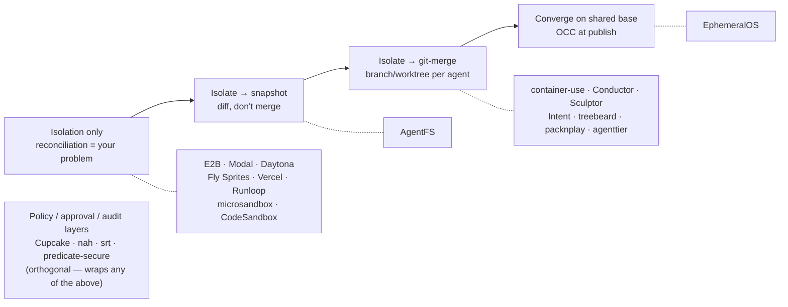

# Agent Sandbox Landscape

Where [[ephemeral-os|EphemeralOS]] sits among the ~60 agent-sandbox projects in
the wild. The field looks crowded, but it organizes cleanly around **one
question**:

> When multiple agents make durable changes, how are those changes reconciled?

Almost every project answers in one of five ways. EphemeralOS is alone in its
answer.

> [!note] Evidence basis
> EphemeralOS rows are verified against this repo's code. Other projects are
> summarized from the [2026-05 sandbox list](https://gist.github.com/wincent/2752d8d97727577050c043e4ff9e386e),
> vendor docs, and project READMEs — stated design, not all verified.

## The reconciliation spectrum

## The five camps

| Camp                        | Reconciliation model                            | Isolation primitive                             | Representative projects                                                                                      | EphemeralOS relation                                                            |
| --------------------------- | ----------------------------------------------- | ----------------------------------------------- | ------------------------------------------------------------------------------------------------------------ | ------------------------------------------------------------------------------- |
| **Isolation-only infra**    | None — merge is your problem                    | microVM (Firecracker) / gVisor / Kata / libkrun; vendor-run container | E2B, Modal, Daytona, Fly Sprites, Vercel Sandbox, Runloop, microsandbox, CodeSandbox SDK, Morph, K7, BoxLite; **Anthropic managed container** (CMA / code-exec, vendor-run — see [[anthropic-managed-container]]) | Substrate it could sit *beside or on*, not a competitor                         |
| **Isolate → git-merge**     | Git branch/worktree per agent, merged like a PR | Container (often Dagger/Docker) or worktree     | **container-use**, Conductor, Sculptor, Intent, treebeard, packnplay, agenttier                              | The **intent twin** — same goal, opposite mechanism. See [[container-use]]      |
| **Isolate → snapshot**      | None — snapshot/diff, no merge                  | CoW filesystem (SQLite/FUSE)                    | **AgentFS**                                                                                                  | The **mechanism twin** — same CoW-FS idea, opposite philosophy. See [[agentfs]] |
| **Converge on shared base** | OCC at publish against a moving base            | Kernel overlayfs + namespaces                   | **EphemeralOS**                                                                                              | **This is us.** Currently a camp of one                                         |
| **Policy / guardrails**     | N/A — not a reconciliation model                | OS sandbox (Seatbelt / bubblewrap / OPA)        | Cupcake, nah, Anthropic `srt`, predicate-secure, punkgo-jack                                                 | Orthogonal — a control layer that could wrap EphemeralOS                        |

## Why EphemeralOS is a camp of one

The other four camps each gave something up:

- **Isolation-only infra** punts reconciliation entirely — great isolation,
  no opinion on collaboration.
- **Git-merge** (the popular camp) reconciles with git, but only at merge time
  and usually human-gated; agents don't see each other's work until a branch
  lands. Strong tooling, deferred convergence.
- **Snapshot** (AgentFS) reconciles never — it gives you audit and rollback,
  not a shared mainline.
- **Policy layers** aren't about change at all; they gate behavior.

EphemeralOS is the only one betting on **kernel-overlayfs shared base + OCC merge
at publish**: agents converge on one base continuously, and the runtime — not a
human, not git at review time — arbitrates conflicts per source path. That bet is
the reason it exists, and the part it has to prove (see the OCC cost discussion
in [[container-use]]).

## Nearest neighbors (read these next)

- [[container-use]] — the intent twin: same parallel-coding-agent goal, git-merge
  instead of OCC. The "why not just use this" comparison.
- [[agentfs]] — the mechanism twin: same CoW-filesystem idea, isolate-and-snapshot
  instead of shared-base-and-merge.
- [[anthropic-managed-container]] — the first-party, vendor-run member of the
  isolation-only camp: Anthropic's code-execution tool and Managed Agents
  per-session container (with a `self_hosted` BYO-infra option).
- **treebeard** and **Intent** each share *half* of EphemeralOS's design
  (treebeard: CoW + network gating on worktrees; Intent: a coordinator/merge
  workflow) — candidates if a third head-to-head is ever worth writing.

## Sources

- [List of coding agent sandboxes, 2026-05 (wincent gist)](https://gist.github.com/wincent/2752d8d97727577050c043e4ff9e386e)
- [Dagger container-use](https://github.com/dagger/container-use)
- [Turso AgentFS](https://github.com/tursodatabase/agentfs)
- [Augment: How to run a multi-agent coding workspace (2026)](https://www.augmentcode.com/guides/how-to-run-a-multi-agent-coding-workspace)
- [andyrewlee/awesome-agent-orchestrators](https://github.com/andyrewlee/awesome-agent-orchestrators)
