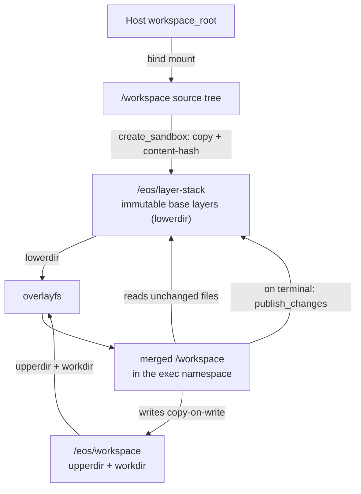

# EphemeralOS

EphemeralOS is a Rust workspace that runs commands — and the agents that drive
them — against a project's source tree inside a disposable sandbox. It is built
on two primitives borrowed from container internals: a **layerstack** of
copy-on-write base layers (overlayfs lowerdirs) and an **ephemeral workspace**
that mounts a writable overlay over that base for each execution.

The goal is a substrate where **many agents collaborate on one shared base**
rather than each working in a private fork. Execution is isolated per workspace;
durable change is mediated through the layerstack and guarded by optimistic
concurrency at publish time. That trades the deferred, all-at-once merge of a
worktree-per-agent model for continuous convergence on a shared mainline.

## Why this shape

- **Worktrees don't scale for many agents.** A worktree is a full tree copy; an
  overlay upperdir is just the diff. Branching in space stays cheap.
- **Shared base, just-in-time visibility.** Agents publish small changes back to
  the layerstack and read each other's published work, instead of drifting apart
  until a painful merge.
- **Isolation where it matters.** Each command runs in its own mount/pid/user
  namespace over the overlay, optionally in its own network namespace, so an
  experiment that binds a port or runs a server can't disturb the host or peers.

## Core model



- **Layerstack** — immutable, content-addressed base layers stored under
  `/eos/layer-stack`. `create_sandbox` builds the initial base by copying and
  hashing the bind-mounted source tree. Layers are the durable, shareable
  history; they are the lower side of every overlay.
- **Workspace** — a writable overlay mounted over the layerstack. Its
  `upperdir`/`workdir` live under `/eos/workspace`; the merged view is the
  `/workspace` a command sees. Unchanged files read through to the lower layers;
  writes copy up into the upperdir. See [[overlay_mount|Overlay Mount Backing Storage]]
  for why this scratch root must be a disk-backed volume, not the container root.
- **Network profile** — a workspace is either `shared` (joins the host network
  namespace, still isolated in mount/pid/user) or `isolated` (its own network
  namespace). Defaults to `shared` when omitted.

### One-shot vs. session execution

`exec_command` has two modes, selected by whether a `workspace_session_id` is
supplied:

- **One-shot (no session id)** — the runtime creates an ephemeral,
  shared-network workspace, runs the command, publishes its changes back to the
  layerstack when the command reaches a terminal state, and tears the workspace
  down. Stateless and self-cleaning; the unit of "apply a change."
- **Session (with session id)** — the command runs inside a caller-owned
  workspace created by `create_workspace_session` and destroyed by
  `destroy_workspace_session`. The overlay persists across commands, so the
  session is a living environment for multi-step work: start a server, run a
  test loop, experiment under an `isolated` network profile.

A long-running command returns a `command_session_id`. Callers stream output
with `read_command_lines` (stable line offsets) and drive stdin — including
Ctrl-C / Ctrl-D — with `write_command_stdin`.

## Publishing and concurrency

Durable change lands through the layerstack's `publish_changes` path, validated
against the base revision the workspace started from. This is the optimistic
concurrency guard: a publish is **rejected**, not silently merged, when it
conflicts. Rejection reasons are explicit, including:

- `invalid_base_revision` — the layerstack head moved since this workspace's base.
- `source_conflict` — a path changed underneath the writer; the rejection
  carries the expected vs. actual content fingerprint for that path.
- `protected_path` — writes into layerstack-internal paths (`manifest.json`,
  `workspace.json`, `layers/`, `staging/`, `.layer-metadata`) the layerstack
  refuses to accept. (`.git` is not special-cased; git internals route as
  ordinary source or, if gitignored, as wholesale ignored writes.)

Because the lower layer is the base and each upperdir is a self-contained diff,
the materials for a three-way merge are present even though today's policy is
OCC-reject. Layer **squash** (collapsing history to keep the shared stack
shallow and within overlayfs limits) is planned, not yet implemented.

## Architecture

The full component table and boundary law live in the repository `README.md`.
The request path:

```text
operator or agent
  → sandbox-gateway / sandbox-cli   (newline-delimited JSON protocol)
  → sandbox-manager                 (sandbox lifecycle, daemon endpoints)
  → sandbox-daemon                  (dispatch runtime requests, in-sandbox)
  → sandbox-runtime                 (command + workspace-session orchestration)
  → sandbox-runtime-{workspace, layerstack, namespace-execution,
                     namespace-process, overlay}
  → sandbox-config
```

The protocol vocabulary is owned by `sandbox-protocol`; the Docker-backed
runtime and daemon installer live in `sandbox-provider-docker`. A sandbox is a
privileged Linux Docker container with kernel overlayfs support; the host source
tree is bind-mounted at `/workspace`, the layerstack at `/eos/layer-stack`, and
the overlay scratch root at `/eos/workspace` on a per-sandbox named volume.

## Operation surface

| Family | Operation | Purpose |
|---|---|---|
| `management` | `create_sandbox` | Create the sandbox, build the layerstack base, start its daemon |
| `management` | `destroy_sandbox` | Stop the daemon, destroy the runtime sandbox, drop the record |
| `management` | `list_sandboxes` / `inspect_sandbox` | Enumerate / inspect sandbox records and daemon endpoints |
| `management` | `snapshot` | Aggregate daemon-local observability snapshots |
| `command` | `exec_command` | Run a command one-shot or inside a session |
| `command` | `read_command_lines` | Read command output by stable line offset |
| `command` | `write_command_stdin` | Write stdin (incl. Ctrl-C / Ctrl-D) to a running command |
| `workspace_session` | `create_workspace_session` | Create a caller-owned session (`shared` / `isolated`) |
| `workspace_session` | `destroy_workspace_session` | Destroy a session when no commands are active |

## Status

Early. The layerstack, overlay workspace, namespace execution, one-shot and
session command flows, network profiles, OCC publish validation, and Docker
provider are in place. Layer squash and richer conflict resolution (merge rather
than reject) are the main open pieces of the collaboration model.

## See also

- [[overlay_mount|Overlay Mount Backing Storage]] — why the overlay scratch root
  must be a disk-backed volume.
- [[landscape|Agent Sandbox Landscape]] — where EphemeralOS sits among the ~60
  agent-sandbox projects, organized by reconciliation model.
- [[container-use|container-use vs EphemeralOS]] — the intent twin: parallel
  coding agents via git-branch-per-agent instead of a shared OCC base.
- [[agentfs|AgentFS vs EphemeralOS]] — the mechanism twin: Turso's SQLite-backed
  CoW agent filesystem.
- [[anthropic-managed-container|Anthropic Managed Container vs EphemeralOS]] —
  the vendor-run option: Anthropic's code-execution tool and Managed Agents
  container.
