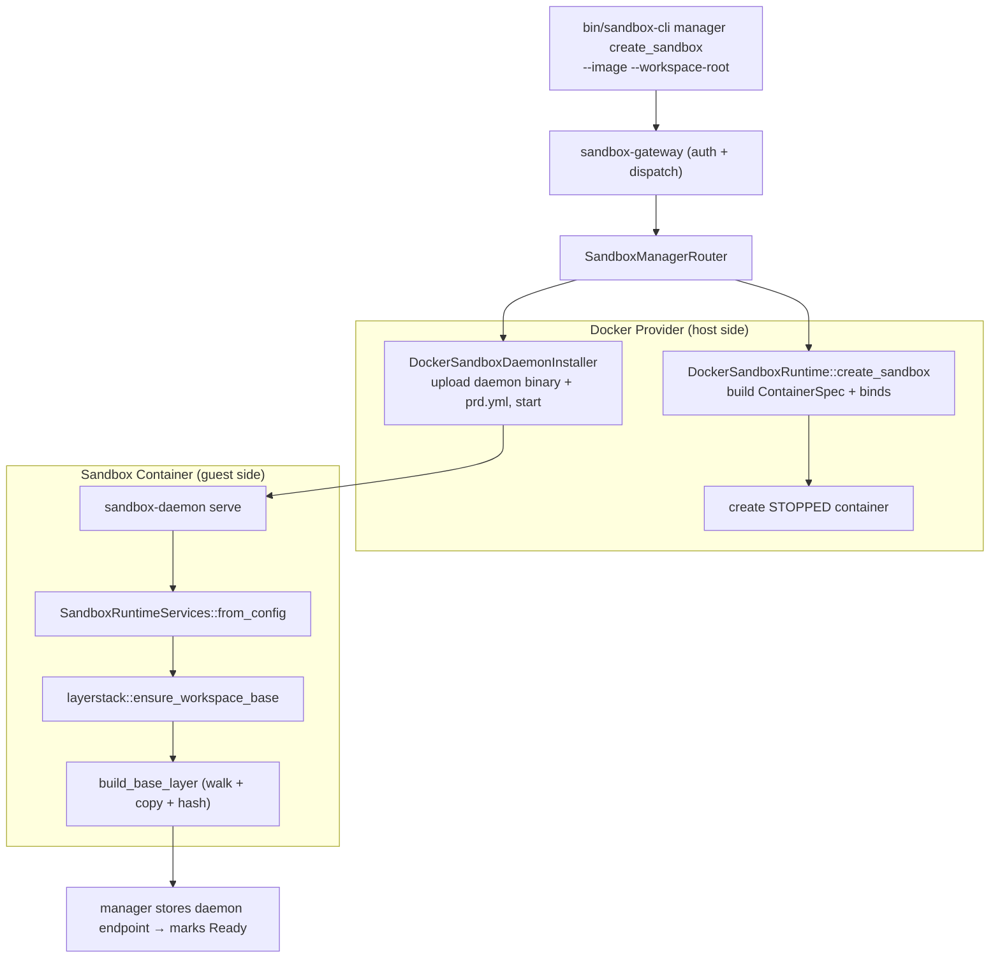
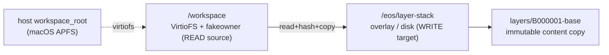
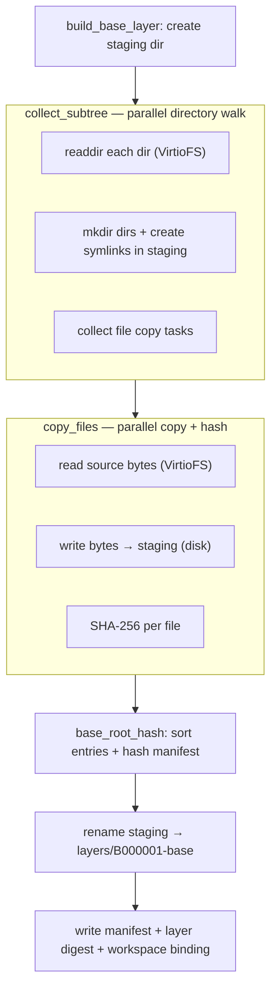

# Create Sandbox — Layerstack Workflow & Optimizations

This note traces a single `create_sandbox` from the operator command down to the
moment the workspace is bound into the sandbox, with the **layerstack base-layer
build** in the centre, and breaks down the performance work applied at each
point.

The mental model: `create_sandbox` turns a host workspace directory into an
immutable, content-addressed **base layer** inside the sandbox, then presents it
back to commands through an overlay. The base build is the dominant cost of
creation, and it is bound by **per-file I/O latency across the Docker bind
mount**, not by CPU.

See also [[cli-gateway-manager-runtime]] for the generic operator path.

## End-to-End Path (daemon to bind)

1. **CLI → Gateway → Manager.** `bin/sandbox-cli` sends the request to the
   gateway, which authenticates and dispatches to `SandboxManagerRouter`.
2. **Provider creates a stopped container.**
   `DockerSandboxRuntime::create_sandbox` builds a `ContainerSpec` and creates
   the container **stopped**, so the daemon and config can be installed before
   it serves.
3. **Bind mount.** The spec binds the host workspace into the container:
   `host workspace_root → container_workspace_root` (default `/workspace`). On
   Docker Desktop this surfaces as a **VirtioFS** mount with a `fakeowner` FUSE
   shim (`/run/host_mark/private … type fakeowner`) — every `open`/`read`/
   `readdir` on it is a round-trip across the macOS↔Linux-VM boundary.
4. **Installer uploads and starts.** `DockerSandboxDaemonInstaller` uploads the
   static `sandbox-daemon` binary and `config/prd.yml`, starts the container,
   and waits for readiness.
5. **Daemon boots and assembles services.** `sandbox-daemon serve` builds
   `SandboxRuntimeServices::from_config`, which calls
   `layerstack::ensure_workspace_base(layer_stack_root, workspace_root)` **once**
   per sandbox during startup.
6. **Base layer is built** (next section), then the manager records the daemon
   endpoint and marks the sandbox `Ready`.

Implementation paths:

- `crates/sandbox-manager/src/operation/impls/management/create_sandbox.rs`
- `crates/sandbox-provider-docker/src/runtime.rs`
- `crates/sandbox-provider-docker/src/installer.rs`
- `crates/sandbox-daemon/src/serve.rs`
- `crates/sandbox-runtime/operation/src/services.rs`

## Storage Layout Inside The Container

- **Source** = the bind-mounted `/workspace` (VirtioFS, latency-heavy).
- **Target** = `/eos/layer-stack`. Historically a **tmpfs (RAM)** mount; now a
  normal directory on the container **overlay (disk)** — see the storage
  optimization below.
- The finished `layers/B000001-base` becomes the **lowerdir** of the overlay
  workspace that runtime commands later see; their writes go to a separate
  upperdir under `/eos/workspace` (disk).

## Layerstack Base-Layer Build

`ensure_workspace_base` returns early if a binding already exists; otherwise it
calls `build_base_layer`, which is the hot path.

1. **Walk (`collect_subtree`).** Recursively `readdir` the workspace, recreating
   the directory skeleton and symlinks in the staging dir and collecting a flat
   list of file-copy tasks. Subdirectories are recursed **in parallel**.
2. **Copy (`copy_files`).** For every file, stream it through a buffer: read
   from VirtioFS, write to staging on disk, and update a SHA-256 digest — all
   files processed **concurrently**.
3. **Manifest hash.** `base_root_hash` sorts all entries by path and folds
   `(kind, path, size, content_hash)` into one `root_hash` (order-independent).
4. **Promote.** The staging dir is atomically `rename`d into
   `layers/B000001-base`; the manifest, layer digest, and workspace binding are
   written.

> [!note] Invariant
> The `root_hash` is fully determined by file contents and metadata. Every
> optimization below was verified to keep it **byte-identical**
> (`c66f29da14bb…` for the reference workspace), so the on-disk format and CAS
> addressing never change.

Implementation paths:

- `crates/sandbox-runtime/layerstack/src/workspace_base/build.rs`
- `crates/sandbox-runtime/layerstack/src/workspace_base/layer.rs`
- `crates/sandbox-runtime/layerstack/src/workspace_base/collect.rs`

## The Bottleneck

The reference workspace is **11,258 files / 833 MB**, of which **75% are < 4 KB
and 98% < 64 KB** — a tiny-file-dominated tree. Effective copy throughput sits
around 400 MB/s, far below VirtioFS bandwidth, which means the build is
**bound by per-file `open`/`readdir` round-trip latency**, not bandwidth and not
CPU. The VM exposes only **4 vCPUs and ~4 GB RAM**, so the cores were never the
limit — they sit idle waiting on I/O.

The governing principle for every optimization: **a thread blocked on a syscall
is not using a core, so overlapping in-flight I/O (more concurrency) hides
latency without needing more cores.**

## Optimizations By Point

| # | Point | Change | Effect |
|---|---|---|---|
| 1 | copy | Parallel copy + per-worker buffer reuse | parallelize 833 MB copy+hash; kill ~11 GB of per-file buffer zeroing |
| 2 | copy | Drop redundant `create_dir_all(parent)` + `remove_path(target)` | ~22k fewer syscalls (staging is fresh; dirs pre-made) |
| 3 | walk | Fold out per-file `lstat` (use readdir `d_type` + worker `fstat`) | ~11k fewer VirtioFS round-trips; removes the serial-walk stall |
| 4 | storage | Move `/eos/layer-stack` off tmpfs → disk | frees scarce VM RAM; lifts the 2 GB tmpfs import ceiling |
| 5 | pool | Bounded I/O-concurrency pool, **P=32** (not core count) | overlap VirtioFS open latency; biggest single win |
| 6 | copy | Exact-size read (reuse `fstat` len, drop trailing EOF probe) | ~11k fewer `read` syscalls |
| 7 | walk | Parallel recursive directory walk | overlap the ~1,697 serial `readdir`s |

### 1–2. Parallel copy, buffer reuse, fewer syscalls

The original `copy_workspace_dir` was a single-threaded recursion that, per file,
allocated and zeroed a fresh 1 MiB buffer, re-`create_dir_all`'d the parent, and
`remove_path`'d a target that never existed. The copy is now a `rayon`
`par_iter` with a **per-worker reused buffer** (`map_init`), and the two
redundant per-file syscalls are gone. Buffer zeroing dropped from ~11 GB
(11,258 × 1 MiB) to ~32 MiB (once per worker).

### 3. lstat fold

`collect_subtree` takes the entry type from `readdir`'s `d_type` instead of a
separate `symlink_metadata`, and file permissions come from an `fstat` on the
already-open fd in the copy worker. This removed ~11,258 serial `lstat` calls
from the critical path — the change that eliminated the visible "walk stall"
before any files were copied.

### 4. Off tmpfs

`/eos/layer-stack` was a tmpfs mount, so each sandbox's base layer (833 MB) lived
in the 4 GB VM's RAM — four sandboxes exhausted it and creation spiked/failed.
Removing it from the runtime tmpfs mounts puts the base layer on the container
overlay (141 GB disk). Writes are not the bottleneck, so build time is
unchanged, but RAM is freed, **density** rises, and the **2 GB tmpfs import
ceiling** (a workspace > 2 GB would `ENOSPC`) is lifted. The `staging → layer`
directory `rename` was verified to work on overlayfs.

### 5. I/O-concurrency pool (P=32)

The copy and walk both run inside one bounded `rayon::ThreadPoolBuilder`
(`BASE_BUILD_WORKER_THREADS = 32`). This is sized for **I/O concurrency**, not
cores: with 4 in-flight reads the VirtioFS pipe is starved; with ~32 the pipe
stays full and per-open latency is hidden. A direct in-container sweep confirmed
the curve (reading all files): **P=1 → 2.2 s, P=4 → 1.35 s, P=32 → 1.0 s**,
flattening by P=32–64. The pool is fixed so per-container load stays predictable
regardless of how many host cores the VM is later given.

### 6. Exact-size read

The copy loop previously needed a trailing `read()` returning 0 to detect EOF —
a wasted VirtioFS round-trip on every file. Since the worker already `fstat`s for
permissions, it now reads exactly `len` bytes and stops, removing ~11k reads.
Small in wall-clock at P=32 (the extra reads were already overlapped) but it
permanently lowers VirtioFS request volume, which matters most under concurrent
creates.

### 7. Parallel walk

`collect_subtree` recurses into subdirectories with `par_iter`, so the ~1,697
serial `readdir` round-trips overlap the same way the copy does. Each call
returns its own `Collected` result (`entries`, `file_tasks`, `special`,
`unstable`) and the parent merges them — no shared mutable state. Ordering is
safe because a subdir's target is created before recursion, and `base_root_hash`
sorts, so the merge order never affects `root_hash`.

### Considered and rejected: SHA-256 → BLAKE3

SHA-256 is already hardware-accelerated on this chip (~1.9 GB/s, openssl), so
hashing 833 MB is ~0.43 core-seconds — a small slice of a ~2 s build, mostly
hidden under I/O. BLAKE3 is only ~2× faster here (not the headline 10× vs
software SHA-256) and would change the **persisted** `content_hash` / `root_hash`
format (schema bump + migration). Measured/estimated wall-clock gain ≈ 0–5%,
inside the noise — **not worth the format break in this I/O-bound regime.**

## Measured Results

Base-build phase (median of fresh builds), reference workspace:

| Stage | base-build |
|---|---|
| Original (serial single-thread copy+hash) | ~5–6 s* |
| + parallel copy, buffer reuse, fewer syscalls, lstat fold | ~3.4 s |
| + off-tmpfs (disk-backed) | ~3.4 s (RAM fixed) |
| + I/O pool P=32 | ~2.0 s |
| + exact-size read | ~2.0 s |
| + parallel walk | **~1.6 s** |

End-to-end `create_sandbox` ≈ base-build + ~0.5 s container overhead ≈
**~2.1 s**, down from **~6.7 s** — roughly a **3× speedup**, all
format-compatible and `root_hash`-identical.

## Remaining Floor

~1.6 s now splits into a short parallel walk plus the ~1.0–1.3 s concurrent
copy, which is the genuine floor for **reading 833 MB across 11,258 files
through VirtioFS once** under the "cannot skip files" constraint. Going lower
means changing the boundary itself, not the algorithm:

- more VM vCPUs/RAM (raises the concurrency ceiling),
- a faster file-sharing backend, or
- not re-reading the workspace per sandbox (shared/imported base).

Implementation paths:

- `crates/sandbox-runtime/layerstack/src/workspace_base/layer.rs`
- `crates/sandbox-provider-docker/src/runtime.rs`
- `config/prd.yml`
