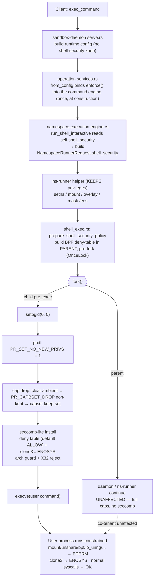

# Daemon Command Child Policy Refined — Spec

This is the authoritative command-child security design. It supersedes both the
full [[daemon-command-syscall-hardening-spec]] (too heavy, not generic enough)
and the interim [[daemon-command-child-policy-lite-spec]] (right direction,
under-specified). It reconciles them against the code that is actually on `main`,
which currently implements the *heavy* variant (a vendored Docker default-deny
allowlist plus a deny table). The refinement's headline move is to **delete the
vendored allowlist** and keep a **deny-table-only** seccomp filter, because a
default-deny allowlist contradicts the "arbitrary Docker image" contract and is a
standing per-arch maintenance liability.

## 1. Executive decision

> **Implementation status (2026-07-03):** three changes have landed and are
> compile- and test-verified (§15–16):
> 1. the core refinement — deleting the vendored `DOCKER_DEFAULT_SYSCALLS`
>    allowlist and the `build_docker_default_allowlist_filter` pass so seccomp is
>    a pure deny table;
> 2. the policy is **renamed** `command_security` → `shell_security`
>    (`ShellSecurityPolicy`/`ShellSecurityMode`, module `runner/shell_security.rs`);
> 3. the policy is now **owned by the namespace-execution engine — the shell
>    runner — as a required construction property**, not by the command layer
>    (`CommandConfig`/`ExecCommand` carry no security field). See §9.
> 4. the operator-facing mode knob (`manager.shell_security.mode`) and the
>    `relaxed` mode are **removed**: the command child is hardened unconditionally
>    in `enforce`, and `off()` survives only as an internal constructor for the
>    setup engine (§12). The live e2e suite is repointed to
>    `runtime/shell_security/` (enforce-only).
>
> Remaining: superseded-spec frontmatter, Phase 3.

Enforce a security policy **only on the user-command child**, installed at its
`pre_exec` boundary in this order:

```text
setpgid(0, 0)                    # existing — process-group leader
prctl(PR_SET_NO_NEW_PRIVS, 1)    # neutralize setuid/file-cap gain; unlocks seccomp
drop_capabilities()              # clear ambient → PR_CAPBSET_DROP non-kept → capset keep-set
install_seccomp_lite()           # deny table (default ALLOW), arch-guarded
execve(user command)             # permitted by the filter
```

Do this and nothing more:

- **Keep** `no_new_privs`, **targeted** capability drop, and a **seccomp-lite
  deny table** on the command child.
- **Remove** the vendored `DOCKER_DEFAULT_SYSCALLS` allowlist and the
  `build_docker_default_allowlist_filter` third pass. Seccomp becomes a pure
  reject table whose default action is `ALLOW`.
- **Keep** the daemon, ns-holder, ns-runner, overlay/layerstack, workspace, and
  network-setup paths fully privileged. The policy must never touch them.
- **No** Phase 2 telemetry, **no** `/dev/kmsg` scanning, **no** request-path
  kernel-log reads, **no** browser/Bazel/rootless-Docker compatibility gates.

This is a **net code reduction** (−57 LOC of code, measured; see §16), not a new
subsystem.

## 2. Threat model

The user command is **untrusted code running as mapped root** in a per-command
user namespace (`uid_map 0 <container-uid> 1`) and a child PID namespace, inside
a **currently `--privileged`** Docker container that shares one Linux kernel with
every other sandbox on the host (or the host's Linux VM on macOS/Windows).

In scope — what a command child could attempt and what we block:

| # | Attacker action | Consequence if unblocked | Control |
|---|---|---|---|
| T1 | `mount`/`unshare(NEWNS)`/new-mount-API to remount or undo the `/eos` mount mask | Reach daemon state hidden by the mask; overlay tampering | seccomp mount + namespace denial (mask is set with `CAP_SYS_ADMIN` in the ns-runner's mount ns — `runner/mod.rs`) |
| T2 | `unshare/clone(CLONE_NEWUSER)` to mint a fresh full cap set, then pivot | Classic userns escape primitive | seccomp namespace denial + `SYS_ADMIN` drop + bounding-set restriction |
| T3 | `init_module`/`finit_module`/`kexec_*` | Arbitrary kernel code execution — total compromise of the shared kernel | seccomp module denial + `SYS_MODULE`/`SYS_BOOT` drop |
| T4 | `bpf`/`io_uring`/`userfaultfd`/`perf_event_open` | Reach the most-exploited kernel-LPE surfaces; win UAF/race exploits | seccomp kernel-surface denial (mostly **not** capability-gated) |
| T5 | `mknod` char/block device node | Raw disk / `/dev/mem` / host-device access (acute while privileged) | seccomp mode-filtered mknod denial |
| T6 | `open_by_handle_at` (Shocker), keyring `add_key`/`keyctl` | Inode-handle filesystem breakout; keyring UAF LPEs | seccomp handle/keyring denial (`DAC_READ_SEARCH` is **kept**, so seccomp is the only barrier) |
| T7 | `reboot`/`swapon` | DoS of the shared kernel/VM affecting co-tenant sandboxes | seccomp system-control denial |

Out of scope (see §3 and §7): a memory-corruption 0-day reachable through an
**allowed** core syscall (`read`/`write`/`ioctl`/`futex`/`mmap`/net), CPU
side-channels, and anything that requires a separate kernel per sandbox to stop.

Trust boundary the policy does **not** move: the command child already cannot see
or `ptrace` the daemon/ns-runner, because they live in a different PID namespace.

## 3. Non-goals

- No gVisor/`runsc`, no userspace kernel, no per-command syscall emulation.
- No QEMU/VM/microVM/emulation boundary (explicitly excluded).
- No default-deny seccomp allowlist; no vendoring or tracking of Docker's
  allow-set.
- No Phase 2 denied-syscall telemetry, `/dev/kmsg` parsing, or audit integration
  on the request path.
- No host-native macOS (XNU) or Windows (NT) process sandbox. seccomp/caps are
  Linux-kernel features and protect only the Linux-in-container boundary.
- No guaranteed support for nested namespaces / nested containers / browser
  sandboxes / Bazel sandboxing / rootless Docker/Podman unless one becomes a
  declared product workload (then use the app's `--no-sandbox`).
- No change to the outer container's `--privileged` posture in this phase (that
  is Phase 3, §14).

## 4. Non-goals vs goals summary (tiered privilege model)

| Tier | Process | Privilege policy |
|---|---|---|
| Setup admin | daemon, ns-holder, ns-runner, overlay/layerstack/workspace/network setup | Keep every cap and syscall these paths need. Untouched. |
| User command | shell command child only | `no_new_privs` + targeted cap drop + seccomp-lite deny table at `pre_exec`. |
| Outer container | Docker container | De-privilege later (Phase 3), only after live workflows prove the minimal caps/devices/security-opts. |

## 5. Host compatibility model: Linux, macOS, Windows

The policy is a Linux-kernel mechanism applied to a process that is *always*
Linux-in-a-container. What differs per host is **which** Linux kernel it protects
and **what** protects the native host kernel.

| Host | Where the sandbox kernel lives | What seccomp/caps protect | What protects the native host kernel |
|---|---|---|---|
| **Linux** | The host's own kernel (shared) | Sandbox → shared host kernel surface | *Nothing extra* — same kernel; only our surface reduction |
| **macOS** | LinuxKit VM kernel (Docker Desktop, Virtualization.framework) | Sandbox → the Linux **VM** kernel surface | The hypervisor VM boundary — **not** our seccomp/caps |
| **Windows** | WSL2 / LinuxKit Linux kernel (lightweight Hyper-V) | Sandbox → the Linux **VM** kernel surface | The Hyper-V VM boundary — **not** our seccomp/caps |

Explicit statements required by the mandate:

- **seccomp and capability drops do not protect the native macOS or Windows host
  kernel.** On those hosts the XNU/NT kernel is isolated (if at all) by Docker's
  VM boundary, which is outside this design's control. Our policy hardens the
  Linux-in-container boundary that exists identically on all three hosts.
- On **Linux** there is no VM layer: the container shares the host kernel, so the
  only defense between a sandbox and the host kernel is the surface reduction
  this spec provides plus the outer-container posture (Phase 3).
- The daemon is a **static musl binary built per-arch** (`x86_64` / `aarch64`),
  so `libc::SYS_*` and the seccomp arch constant resolve correctly per target
  with no runtime arch table. `CONFIG_SECCOMP_FILTER` is present on all three
  host kernels (Docker's own default seccomp runs there).

## 6. Docker image compatibility model

The policy must work with **any** image. It achieves that by construction:

- **Ships in the daemon binary**, not the image. Zero in-image dependency; no
  distro, shell, package manager, libc, or interpreter is assumed.
- **Denylist, not allowlist.** A reject table only blocks a fixed, named set of
  dangerous syscalls; everything else — including uncommon-but-legitimate and
  future syscalls — passes. This is the single most important change for
  arbitrary-image compatibility: a default-deny allowlist breaks any image whose
  runtime issues a syscall we forgot to list, and the list drifts every kernel
  release.
- **Targeted cap keep-set + mode-filtered `mknod`** keep package managers working
  generically (`apt`/`apk`/`dnf`/`pacman`/`zypper` all rely on `CHOWN`,
  `DAC_OVERRIDE`, `FOWNER`, `FSETID`, `SETFCAP`, and FIFO/regular `mknod`).
- **`ptrace` kept allowed**, so `gdb`/`strace`/sanitizers work on the workload's
  own processes (confined by the PID namespace).

Images/workloads **not** supported (need `--no-sandbox`, and are not declared
product workloads): anything that creates namespaces —
nested containers, rootless Docker/Podman, Bazel sandboxing, bubblewrap/flatpak,
Chromium/Puppeteer/Playwright sandboxes. The one *rising* compatibility risk in
the deny table is `io_uring` (§10, T4): modern async runtimes increasingly use it
but all fall back to epoll/threadpool.

## 7. Is native kernel-level isolation between sandboxes achievable here?

**No. Not in the current single-container, shared-kernel architecture — and
seccomp/caps cannot make it so. State this plainly to stakeholders.**

Reasoning:

- Every sandbox on a host runs in a Docker container that **shares one Linux
  kernel** (the host's on Linux; the VM's on macOS/Windows). Namespaces (user,
  pid, mnt, net) isolate *views and resources*, not the kernel. They give each
  sandbox a private *interface* to the same kernel code and data.
- A single kernel memory-corruption bug reached from inside one sandbox
  compromises that shared kernel and therefore **every co-tenant sandbox and the
  host/VM**. No amount of syscall filtering changes the fact that there is one
  kernel.
- seccomp + capability drop **reduce the reachable attack surface** of that shared
  kernel — they shrink the set of syscalls (and thus kernel code paths) an
  attacker can touch. That lowers the *probability* of finding a reachable bug.
  It is **surface reduction, not isolation**. A 0-day in an allowed syscall still
  reaches the shared kernel.
- **True kernel-level isolation between sandboxes requires a separate kernel per
  sandbox.** The only architectures that deliver it are (a) a VM/microVM boundary
  (Kata, Firecracker, QEMU) — excluded by mandate; or (b) a userspace kernel that
  re-implements the syscall ABI (gVisor/`runsc`) — a different runtime boundary
  we are told not to copy. Both replace the container boundary itself.

Therefore the honest deliverable is **pseudo kernel isolation** (§8): apply the
gVisor *principle* (shrink the attack surface, mediate dangerous operations)
using in-kernel primitives (seccomp/caps/namespaces) instead of gVisor's
*architecture* (a userspace kernel intercepting every syscall). That is the best
practical design under the three constraints (cross-host, any image, no VM).

## 8. Pseudo kernel isolation design and what "80% security" means

**Design.** Treat the command child as hostile and squeeze its kernel interface
to the minimum that still runs arbitrary developer workloads:

1. `no_new_privs` — no privilege gain across `execve`.
2. Targeted capability drop — remove the system-power caps; keep the
   act-as-root-on-the-overlay caps package managers need.
3. seccomp-lite deny table — reject the syscall families implicated in
   container-escape and kernel-LPE chains.
4. Mount/namespace-mutation denial — the command cannot undo the `/eos` mount
   mask or mint a fresh cap set via a new user namespace.
5. Device-node denial — no char/block `mknod` (raw disk / `/dev/mem`).
6. Kernel attack-surface denial — no `bpf`/`io_uring`/`userfaultfd`/`perf`.
7. (Phase 3) outer-container de-privileging — restore Docker's own default
   seccomp + drop container caps once live workflows prove the minimal set.
8. Clear unsupported-workload boundaries — namespace-creating tooling is
   unsupported (a future declared workload would need a gated mode or
   `--no-sandbox`).

**Why this is the gVisor *principle* without its architecture.** gVisor's value
is that a compromised workload talks to a tiny, mediated kernel interface rather
than the full Linux syscall table. We reproduce the *goal* — a small, mediated
interface — with a seccomp deny table plus cap drop, at a fraction of the cost
and with no per-syscall userspace round-trip (so no gVisor-style performance
tax). We do **not** reproduce its *guarantee*: gVisor actually runs a separate
kernel; we do not, so a bug in an allowed syscall still reaches the host kernel.

**What "80% security" means — and does not.** It is a **qualitative posture
label, not a measured metric.** Concretely:

- **The ~80% we get:** we block the syscall/capability families that appear in
  the large majority of *published* container escapes and kernel LPE chains —
  namespace/mount abuse, kernel-module loading, `bpf`/`io_uring`/`userfaultfd`/
  `perf_event_open`, keyring UAFs, `open_by_handle_at` filesystem breakout, and
  device-node creation. These are the routes real-world escapes take.
- **The ~20% we do not get** (and only a separate kernel could): memory-corruption
  0-days reachable through the *allowed* core surface (`read`/`write`/`ioctl`/
  `futex`/`mmap`/net stack), CPU/microarchitectural side-channels, and bugs in
  the shared kernel's fundamental machinery. Filtering cannot close these because
  the workload legitimately needs those syscalls to run.

The number is a communication device: **most of the realistically-exploited
surface, none of the theoretically-complete isolation.** Do not represent it as a
guarantee of sandbox-to-sandbox kernel isolation.

## 9. Refined Phase 1 command-child policy

**Patch point (unchanged, already on `main`):** the command-child `pre_exec` in
`crates/sandbox-runtime/namespace-process/src/runner/shell_exec.rs`. This is the
**sole** enforcement site. The other `pre_exec`
(`namespace-execution/src/launcher.rs::install_pgid_leader_hook`) is on the
**ns-runner helper**, which must keep `setns`/`mount` privileges — the policy
must **never** be installed there.

**Policy ownership — bound to the shell runner (engine), not the command.**
`ShellSecurityPolicy` is a **required construction parameter** of the
`NamespaceExecutionEngine` (`new`/`with_launcher`) — the shell runner itself. No
engine can be built without one, so **every** `run_shell_interactive` caller is
constrained, not only `exec_command`: the guarantee is enforced by the type
system at construction, not smuggled in through one operation. `run_shell_interactive`
reads `self.shell_security` and stamps it into the request; the privileged setup
entry points (`mount_overlay`, `remount_overlay`, `run_file_op`) hard-code
`off()` because they are infrastructure, not user shells. `CommandConfig` and
`ExecCommand` carry **no** security field. The `enforce` policy is bound **once,
at engine construction** (§12) — it never rides the per-command request path as an
argument.

**Order and async-signal-safety.** The BPF program(s) are built in the parent
before `fork` (via `prepare_shell_security_policy`, cached in a `OnceLock`); the
child's `pre_exec` closure (`apply_shell_security_policy`) issues only
`prctl`/`capset`/`seccomp` syscalls over prebuilt, immutable data — no allocation,
`Vec`, or formatting. The child is single-threaded post-fork, so the `prctl`/
`seccomp(2)` form is used (no `TSYNC`). Order is fixed:

1. `setpgid(0, 0)` (existing).
2. `prctl(PR_SET_NO_NEW_PRIVS, 1, 0, 0, 0)` — required before an unprivileged
   process may install a seccomp filter; also blocks setuid/file-cap gain across
   `execve`.
3. Capability drop — needs effective `CAP_SETPCAP` (still held here), so it
   precedes seccomp.
4. `seccomp(SECCOMP_SET_MODE_FILTER, …)` with the prebuilt deny-table program(s).
5. `execve` — allowed (the deny table's default action is `ALLOW`; `execve` is
   never denied).

**Seccomp program shape after the refinement.** `build_seccomp_programs()`
returns exactly **two** stacked filters, each with default action `ALLOW`
(seccomp evaluates all filters and takes the most restrictive result, so
`ALLOW`-default filters compose as the union of their denials):

1. **Deny filter** — the reject table (§10), returning `EPERM`, plus the
   namespace rules and mode-filtered `mknod`. Prefixed with the arch
   guard and (on x86_64) the X32-ABI reject, so the filter cannot be bypassed via
   the foreign ABI.
2. **`clone3` filter** — `clone3` → `ENOSYS` (a separate filter because it needs a
   different errno than the deny table; `ENOSYS` makes glibc/musl fall back to
   `clone(2)`, which the deny filter's flag mask *can* inspect — seccomp cannot
   dereference the `clone3` args pointer).

The removed third filter was `build_docker_default_allowlist_filter`
(default-deny over `DOCKER_DEFAULT_SYSCALLS`). Delete it and both per-arch
`DOCKER_DEFAULT_SYSCALLS` tables.

## 10. Refined deny table with keep/remove/add decisions

Each row: threat blocked · breakage risk on normal commands/package managers/tests
· whether capability drop already covers it · whether seccomp still earns its
place. **The recurring theme: the highest-value denials are NOT capability-gated
(`unshare`, `io_uring`, `userfaultfd`, `perf_event_open`, `open_by_handle_at`,
keyrings), so seccomp is load-bearing, not redundant.**

### Keep (validated)

| Family | Syscalls | Return | Threat | Breakage | Cap already covers? | seccomp still useful? | Decision |
|---|---|---|---|---|---|---|---|
| Mount mutation | `mount`, `umount2`, `pivot_root`, `move_mount`, `open_tree`, `fsopen`, `fsconfig`, `fsmount`, `fspick`, `mount_setattr` | `EPERM` | Undo `/eos` mount mask (T1); overlay tampering; new-mount-API escapes | Very low — builds/tests/pkg installs don't mount | Partly (`SYS_ADMIN` dropped), but reachable inside a fresh userns | **Yes** — clean, cap-independent barrier for the mask boundary | **KEEP all** |
| Namespace mutation | `setns`, `unshare` | `EPERM` | Fresh userns → full cap set (T2); mount-ns to undo mask | Low for declared workloads; blocks nested-container tooling | **No** — `unshare(NEWUSER)` needs no capability | **Yes — primary barrier** | **KEEP** |
| Namespace via clone | `clone` when flags contain any `CLONE_NEW*` bit | `EPERM` | Programmatic form of T2 | Low — plain `fork` (SIGCHLD, no NEW*) passes | **No** | **Yes** | **KEEP** |
| Opaque clone args | `clone3` | `ENOSYS` | `clone3(CLONE_NEWUSER)` would bypass the flag-mask check | Low — glibc/musl fall back to `clone`; **highest-compat-risk rule** (§20) | No | **Yes — required** for the namespace denial to hold | **KEEP** |
| Kernel module / control | `init_module`, `finit_module`, `delete_module`, `kexec_load`, `kexec_file_load`, `reboot` | `EPERM` | Kernel code exec (T3); reboot DoS (T7) | None | Yes (`SYS_MODULE`/`SYS_BOOT` dropped; not namespaced) | Defense-in-depth (free; guards cap-misconfig) for the highest-severity outcome | **KEEP all** |
| Kernel attack surface | `bpf`, `perf_event_open`, `userfaultfd`, `fanotify_init`, `io_uring_setup`, `io_uring_enter`, `io_uring_register` | `EPERM` | The most-exploited LPE surfaces (T4) | `bpf`/`perf`/`uffd` low; `io_uring` low-but-**rising**; `fanotify` none | **Mostly no** — `perf`/`uffd`/`io_uring` are not cap-gated | **Yes — load-bearing** | **KEEP all** (watch `io_uring`, §20) |
| Device nodes | `mknod`, `mknodat` when `mode & S_IFMT ∈ {S_IFCHR, S_IFBLK}` | `EPERM` | Raw disk / `/dev/mem` / host device (T5) | Low — FIFO/socket/regular still allowed for pkg postinst | **No** — `MKNOD` cap is deliberately **kept** | **Yes — the barrier** | **KEEP (mode-filtered)** |
| Handle / keyring escape | `open_by_handle_at`, `add_key`, `request_key`, `keyctl` | `EPERM` | Shocker fs breakout; keyring UAF LPEs (T6) | None for normal builds/tests | **No** — `DAC_READ_SEARCH` kept; keyrings not cap-gated | **Yes — the barrier** | **KEEP all** |
| Swap / quota | `swapon`, `swapoff`, `quotactl` | `EPERM` | Resource/DoS; `quotactl` CVEs (T7) | None | Yes (`SYS_ADMIN` dropped) | Cheap redundant defense-in-depth | **KEEP** (belt-and-suspenders; zero breakage) |

### Remove

| Item | Why remove |
|---|---|
| **`DOCKER_DEFAULT_SYSCALLS` allowlist + `build_docker_default_allowlist_filter`** | The default-deny allowlist is the "too heavy / not generic" direction. It breaks arbitrary images on any unlisted/future syscall, is a per-arch table that drifts each kernel release, and duplicates a control Phase 3 restores at the container boundary (Docker's own default seccomp). Removing it makes the filter a pure deny table (default `ALLOW`). **This is the core refinement — implemented (§15–16).** |

No deny **family** is removed — each blocks a clear threat with low breakage. The
swap/quota and `fanotify_init`/module rows are noted as cap-covered
(belt-and-suspenders) rather than load-bearing, but are retained because they are
free and never used by real workloads (conservative: retain zero-breakage rules
that block a clear threat).

### Add — considered, not adopted (be conservative)

| Candidate | Verdict |
|---|---|
| `ptrace` / `process_vm_readv`/`writev` | **Do not add.** PID namespace confines the command to tracing its own descendants; blocking breaks `gdb`/`strace`/sanitizers for no boundary gain. Keep **allowed**. |
| `syslog`(2)/klogctl | **Do not add.** KASLR-leak surface, but already covered by dropping `CAP_SYSLOG` and by `dmesg_restrict`; no normal workload calls it. Speculative — omit. |
| `ioperm`/`iopl` (x86 only) | **Do not add.** Cap-covered (`SYS_RAWIO` dropped), arch-specific, no workload need. |
| `ioctl` cmd-filtering (e.g. `TIOCSTI` terminal injection) | **Do not add.** Blanket `ioctl` deny breaks everything; per-cmd arg filtering is fragile, and `TIOCSTI` is sysctl-mitigated on modern kernels (`dev.tty.legacy_tiocsti=0`). Documented gap (§20), not a rule. |
| `move_pages`/`migrate_pages`/`mbind`, `kcmp` | **Do not add.** Niche, low-severity, some legitimate NUMA use. Speculative. |

## 11. Capability policy

Capabilities are per-process; the drop applies only in the command child. Most
kept caps are **already neutered against host resources** because the command runs
in a non-initial user namespace (a userns-root process's caps apply only to
resources owned by that userns's mappings). So the cap drop is defense-in-depth
under seccomp; seccomp is the primary barrier for the not-cap-gated syscalls.

**Keep (sandbox-root must work):**

| Cap | Reason |
|---|---|
| `CHOWN`, `DAC_OVERRIDE`, `DAC_READ_SEARCH`, `FOWNER`, `FSETID` | Package extraction as root; overlay writes; preserve setuid bits |
| `SETUID`, `SETGID`, `SETFCAP` | Package scripts drop privs; `dpkg`/`rpm` set file caps (e.g. `cap_net_raw` on `ping`) |
| `KILL` | Signal own processes across uids in the sandbox |
| `NET_BIND_SERVICE` | Bind ports < 1024 (dev servers) |
| `NET_RAW` | `ping`/raw sockets — confined to the sandbox's own net namespace (most debatable keep; reconsider if a workload doesn't need it) |
| `MKNOD` | FIFO/regular nodes in pkg postinst; char/block blocked precisely in seccomp |

**Drop (system-power / kernel surfaces):** `SYS_ADMIN` (**the** highest-value
removal — breaks the userns+`SYS_ADMIN` escape), `NET_ADMIN`, `SYS_MODULE`,
`SYS_BOOT`, `SYS_RAWIO`, `SYS_TIME`, `SYS_PACCT`, `SYS_TTY_CONFIG`, `BPF`,
`PERFMON`, `SYSLOG`, `AUDIT_CONTROL`, `AUDIT_READ`, `AUDIT_WRITE`, `MAC_ADMIN`,
`MAC_OVERRIDE`, `LINUX_IMMUTABLE`, `IPC_LOCK`, `IPC_OWNER`, `WAKE_ALARM`,
`BLOCK_SUSPEND`, `CHECKPOINT_RESTORE`, `LEASE`, `SYS_NICE`, `SYS_PTRACE`, and any
other cap not in the keep set.

Note `SYS_PTRACE` is **dropped** while `ptrace(2)` stays **allowed** — consistent,
because tracing one's own same-uid children within the PID namespace needs no
capability.

**Mechanics (async-signal-safe, unchanged):** (1) `prctl(PR_CAP_AMBIENT,
PR_CAP_AMBIENT_CLEAR_ALL, …)`; (2) `prctl(PR_CAPBSET_DROP, cap, …)` for each
non-kept cap (needs effective `SETPCAP`, still held); (3) `capset()`
(`_LINUX_CAPABILITY_VERSION_3`) with effective = permitted = inheritable = keep
set — where effective `SETPCAP` finally goes away.

## 12. Config model

The command child is hardened **unconditionally**; there is no operator-facing
mode knob. `enforce` is applied to every user command, with no config surface that
can weaken it.

- **`enforce`** (the only policy the command child ever receives):
  `no_new_privs` + targeted cap drop + full deny table (including
  namespace-mutation denials).
- **`off`** (`ShellSecurityPolicy::off()`): `no_new_privs` + cap drop only, no
  seccomp filter. **Internal-only** — used by the privileged setup engine
  (`mount_overlay`/`remount_overlay`/`run_file_op`), which runs no user shells,
  and by tests. It is **not** selectable via config.

The former `relaxed` mode and the `manager.shell_security.mode` config key have
been **removed**. `relaxed` dropped the namespace-mutation denials — the
userns-escape primitives — for a workload that does not exist: speculative,
security-reducing surface (YAGNI) with no live consumer and no default-suite
coverage. A future declared nested-namespace workload would reintroduce a gated
mode *with a test*, not resurrect a latent one.

Plumbing (engine-owned; the value is bound once at construction, never threaded
per call): `operation/services.rs::from_config` passes
`ShellSecurityPolicy::enforce()` to `CommandOperationService::new`, which builds
the command engine with the engine's **required** `shell_security` →
`run_shell_interactive` reads `self.shell_security` →
`namespace-execution/engine.rs::build_request` →
`NamespaceRunnerRequest.shell_security` → `shell_exec.rs` prepare/apply.
`CommandConfig`/`ExecCommand` hold nothing about security. The setup engine
(`workspace/src/namespace/mod.rs`) constructs with `off()` — it runs no shells.

## 13. Simplified Phase 2 position

**No Phase 2 telemetry.** Kernel seccomp denials surface only via `/dev/kmsg` or
audit; request-path scanning of either risks the performance regression the
mandate forbids. The current product need is *enforcement*, not deny analytics.

If telemetry is ever justified, it must be a **bounded, opt-in, off-request-path**
collector — e.g. a per-process denied-syscall **counter** incremented from a
`SECCOMP_RET_ERRNO`-adjacent path and read only on explicit inspect, never a
log-scanning loop in `exec_command`. Until such a design is written and approved,
Phase 2 stays removed.

## 14. Simplified Phase 3 outer-container hardening

Separate track from the command-child policy; it reduces the **container's** (not
the command's) privilege. Keep it small and evidence-driven:

1. Inventory the real daemon/ns-holder/ns-runner/overlay/network requirements
   from **live** product workflows.
2. Replace `--privileged` with the minimal Docker caps/devices/security-opts that
   still pass those workflows — candidate direction only, subject to live proof:
   add back `SYS_ADMIN`, `NET_ADMIN`, `MKNOD` if setup needs them; re-enable
   Docker's **default seccomp** at the container boundary (this is the allowlist
   backstop that justifies removing our in-daemon allowlist in §10); add
   `no-new-privileges` at the container level.
3. Do **not** apply a container-level seccomp/cap profile that constrains the
   daemon's own privileged setup until proven safe against the ns-holder/ns-runner
   path.
4. Keep Phase 1 command-child enforcement in place after outer hardening — it
   blocks the userns+`SYS_ADMIN` chain, `io_uring`, and `userfaultfd` that reduced
   container caps alone do not fully close.

Phase 3 tests cover real product paths only: create sandbox · daemon ready ·
normal `exec_command` · workspace read/write · overlay/layerstack whiteout ·
package-install smoke · destroy cleanup. No browser/Bazel/rootless-Docker/Podman
unless declared.

## 15. File / folder structure (every file touched)

Landed workstreams: **(A)** allowlist removal, **(B)** rename
`command_security` → `shell_security`, **(C)** move ownership to the engine
(shell runner) and off the command layer, **(D)** remove the operator-facing mode
knob and the `relaxed` mode (command child hardcoded `enforce`; `off()`
internal-only for the setup engine).

```
docs/obsidian/ephemeral-os/implementation_plan/
├── daemon-command-child-policy-refined-spec.md      NEW  (this spec)
├── daemon-command-child-policy-lite-spec.md         EDIT (frontmatter: superseded-by, pending)
└── daemon-command-syscall-hardening-spec.md         EDIT (frontmatter: superseded-by, pending)

crates/sandbox-runtime/namespace-process/
├── src/runner/shell_security.rs                   DONE A+B (git mv from command_security.rs; allowlist gone; 2-filter build)
├── src/runner/mod.rs                              DONE B  (`mod shell_security;`)
├── src/runner/protocol.rs                         DONE B+D (ShellSecurityPolicy/Mode; 2-mode enum Enforce/Off; Relaxed removed)
├── src/runner/shell_exec.rs                       DONE B  (calls prepare/apply_shell_security_policy)
└── tests/unit/runner/shell_security.rs            DONE A+B (git mv; denylist decision model)

crates/sandbox-runtime/namespace-execution/
├── src/engine.rs                                  DONE C  (engine owns shell_security: required `new`/`with_launcher` param; run_shell_interactive reads self.shell_security; setup paths hard-code off())
└── tests/engine.rs, tests/support/mod.rs          DONE C  (construct engines with the required policy; binding regression test)

crates/sandbox-runtime/operation/
├── src/command/contract.rs                        DONE C  (CommandConfig loses shell_security)
├── src/command/service/exec.rs                    DONE C  (ExecCommand loses shell_security)
├── src/command/service/exec_command.rs            DONE C  (no per-call policy argument)
├── src/command/service/core.rs                    DONE C  (`new` takes shell_security, forwards to engine)
├── src/services.rs                                DONE C+D (from_config passes enforce() to new; SandboxRuntimeConfig.shell_security removed)
└── tests/*.rs                                      DONE C  (construction sites carry the policy)

crates/sandbox-runtime/workspace/src/namespace/mod.rs  DONE C  (setup engine constructs with off())
crates/sandbox-config/src/configs/manager.rs           DONE B+D (ShellSecurityConfig/Mode + shell_security key removed; ManagerConfig keeps only docker)
crates/sandbox-daemon/src/serve.rs                     DONE B+D (manager section no longer loaded; command engine hardcoded enforce)
config/prd.yml                                         DONE B+D (manager.shell_security key removed)

cli-operation-e2e-live-test/runtime/shell_security/    DONE B+D (git mv from command_security/; enforce-only, mode config dropped)
```

The Rust unit/behavioral suites stay green: removing the allowlist only changes
the fate of obscure syscalls the probe never issues, and the ownership move
(C) is observable only as "the request always carries the engine's policy" —
covered by a new engine binding test. The live e2e Python is **renamed** to
`runtime/shell_security/` and rewritten enforce-only; its former
`command_security.mode` config branch is gone (there is no mode knob).

## 16. LOC impact (actuals + pending)

Split into what this change **applied** (actuals, `git diff --numstat`) and what
the spec still leaves **pending**.

**Applied — allowlist removal (the core refinement):**

| File | Kind | Added | Removed | Net |
|---|---|---|---:|---:|
| `runner/shell_security.rs` | edit | +5 | −57 | −52 |
| `tests/unit/runner/shell_security.rs` | edit | +3 | −8 | −5 |
| **Total code** | | **+8** | **−65** | **−57** |

The applied change is a **pure code reduction**: the two per-arch
`DOCKER_DEFAULT_SYSCALLS` tables and the allowlist-filter builder are gone;
`build_seccomp_programs` now returns two filters (deny table + `clone3`). No new
dependency — `seccompiler` stays (it still builds the arch-guarded deny filter,
the clone-flag mask rule, and the `mknod` mode rules). No production or e2e
behavior changed for any syscall the tests exercise. Verified with
`cargo fmt --check` and `cargo clippy --target aarch64-unknown-linux-musl -p
sandbox-runtime-namespace-process --all-targets` (clean); the Linux-gated unit
tests must run on Linux/CI, since the dev host is macOS and the module is
`#[cfg(target_os = "linux")]`.

**Also applied — ownership move (C) and knob/relaxed removal (D):** net-negative
LOC across `protocol.rs`, `shell_security.rs`, `manager.rs`, `serve.rs`,
`services.rs`, and the e2e (renamed to `runtime/shell_security/`, rewritten
enforce-only). See §15 for the file-by-file ledger.

**Pending — doc only, not yet applied:**

| File | Kind | Est. LOC |
|---|---|---:|
| two superseded specs (`…lite`, `…syscall-hardening`) | frontmatter edit | +4 |

## 17. Workflow diagram — command-child policy enforcement



## 18. Verification plan

**Build / unit (no daemon):**

```sh
cargo fmt --check
cargo clippy --all-targets
cargo test -p sandbox-runtime-namespace-process
```

Unit assertions to update/keep:
- Keep/drop cap sets partition all caps with no overlap; keep set ⊇ {CHOWN,
  DAC_OVERRIDE, DAC_READ_SEARCH, FOWNER, FSETID, SETUID, SETGID, SETFCAP, KILL,
  NET_BIND_SERVICE, NET_RAW, MKNOD}; drop set ⊇ {SYS_ADMIN, NET_ADMIN, SYS_MODULE,
  BPF, PERFMON}.
- `build_seccomp_programs` returns **two** filters (arch guard first; X32 reject
  present on x86_64); no reference to `DOCKER_DEFAULT_SYSCALLS`.
- Deny families → `EPERM`; `clone3` → `ENOSYS`; `execve`/`execveat` and a normal
  `fork` (`clone` with `SIGCHLD`, no `NEW*`) → `ALLOW`.
- `enforce` denies `unshare`/`setns`/`clone(NEW*)`; the internal `off()` (setup
  engine) produces no seccomp filter but still drops caps.
- `mknod`/`mknodat` char/block → `EPERM`; regular/FIFO → `ALLOW`.

**Live e2e** (`cli-operation-e2e-live-test/runtime/shell_security/`; rebuild
first with `bin/start-sandbox-docker-gateway --rebuild-binary`):

```sh
export PATH="$PWD/bin:$PATH"
cd cli-operation-e2e-live-test
E2E_REBUILD_BINARY=1 pytest runtime/shell_security -v
```

Headline cases (unchanged by the refinement):
- CS-01 normal commands + overlay writes unaffected (daemon path intact).
- CS-02 `mount`/`unshare`/device-`mknod`/`keyctl`/`add_key`/`bpf`/`io_uring` → `EPERM`.
- CS-03 FIFO-`mknod`/`ptrace`/DAC-override/`renameat`/`fchmodat2` → `OK`.
- CS-04 `NoNewPrivs=1`, `Seccomp=2`; `CapEff` drops SYS_ADMIN/NET_ADMIN/SYS_MODULE,
  keeps CHOWN/DAC_OVERRIDE/FOWNER/SETFCAP; `CapBnd` drops SYS_ADMIN.
- CS-05 image `util-linux` (`unshare -m`, `mount`, `umount`) rejected.
- CS-06 package manager operates under reduced caps/seccomp (networked install
  skipped when the profile has no egress).

**Run matrix (required for sign-off):** full suite green on **aarch64** *and*
**x86_64** native Docker. No VM/QEMU/emulated path counts as x86_64 evidence.
macOS/Windows sign-off means "Docker's Linux-VM path is green there," not
host-kernel syscall filtering.

## 19. Acceptance criteria

- Command child shows `NoNewPrivs=1` and `Seccomp=2`.
- Command child has the drop-set caps removed and the keep-set caps present in
  both `CapEff` and `CapBnd`.
- Every deny-table syscall fails as specified (`EPERM`, `clone3` → `ENOSYS`);
  the namespace denials (`unshare`/`setns`/`clone(NEW*)`) are always on.
- Normal commands, package installs (`apt`/`apk`/`dnf`), overlay/layerstack
  whiteout, workspace read/write, and destroy cleanup all still pass.
- The daemon, ns-holder, ns-runner, and setup paths are demonstrably unaffected
  (they retain full privilege; CS-01 and setup succeed).
- No `DOCKER_DEFAULT_SYSCALLS` allowlist remains; the seccomp filter is a pure
  deny table with default `ALLOW`.
- No request-path telemetry or `/dev/kmsg` scanning exists.

## 20. Explicit risks and unsupported workloads

**Residual security risk (by design).**
- Not kernel isolation: a 0-day in an allowed core syscall reaches the shared
  host/VM kernel and can cross to co-tenant sandboxes (§7). Only a separate
  kernel per sandbox would close this.
- Denylist gap: unlike a default-deny allowlist, the deny table does not
  auto-close *future/obscure* syscalls. Mitigation: the outer container's own
  default seccomp returns in Phase 3 as the allowlist backstop; the highest-risk
  *known* surfaces are explicitly denied.
- `TIOCSTI` terminal-injection `ioctl` is not filtered (too fragile to arg-filter;
  sysctl-mitigated on modern kernels). Documented gap, not closed here.
- While the container is still `--privileged` (pre-Phase-3), device-node and mount
  denials are doing acute work; do not defer Phase 3 indefinitely.

**Compatibility risk.**
- **`io_uring` (rising).** Modern async runtimes increasingly use it (libuv,
  some DB/proxy stacks). All known ones fall back to epoll/threadpool, but this is
  the deny-table row most likely to need a future carve-out. Monitor; if a
  declared workload breaks, consider a future gated mode rather than removing
  the rule outright.
- **`clone3` → `ENOSYS`.** Relies on libc/runtime falling back to `clone(2)`.
  glibc and musl do; confirm shipped Go/Node/Python/Bazel toolchains tolerate it
  and capture any that cannot.
- **`perf_event_open` denial** breaks `perf`-based profiling in the sandbox
  (acceptable — profiling is not a declared workload; the syscall is a heavy LPE
  surface and not cap-gated).

**Unsupported workloads (need `--no-sandbox`; not declared product workloads):**
nested containers, rootless Docker/Podman, Bazel sandboxing, bubblewrap/flatpak,
Chromium/Puppeteer/Playwright sandboxes — all require namespace creation, which
the command-child policy denies.

**Open items to confirm during implementation:**
- Confirm no PTY path in `namespace-execution` execs user argv directly (current
  reading: it only spawns the ns-runner helper, so the command-child `pre_exec` is
  the sole user-command site).

## References

- Superseded: [[daemon-command-child-policy-lite-spec]],
  [[daemon-command-syscall-hardening-spec]], [[daemon-command-syscall-hardening]]
- Test catalog (behavioral cases carry over):
  [[daemon-command-syscall-hardening-test-case]]
- gVisor security model (principle, not dependency):
  https://gvisor.dev/docs/architecture_guide/security/
- seccompiler (pure-Rust BPF compiler, retained):
  https://github.com/firecracker-microvm/seccompiler
- New mount API (`fsopen`/`fsconfig`/`fsmount`): https://lwn.net/Articles/759499/
