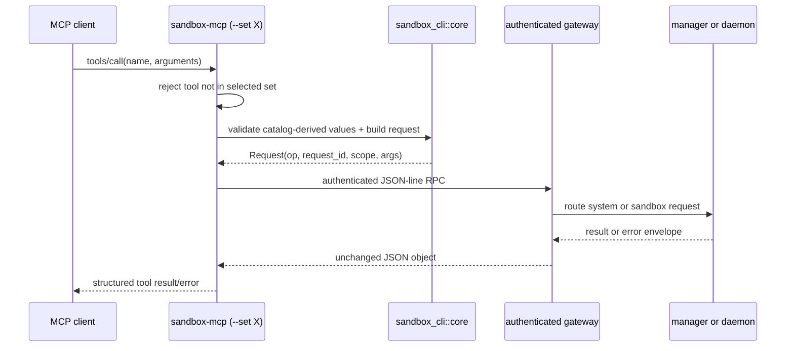

# MCP public surface and implementation design

This document is the detailed design for the MCP boundary. It is the
authoritative public-tool contract after the cutover. The sibling documents
[[cli]] and [[http]] describe the same product boundary projected as command
line programs and direct daemon HTTP respectively.

> [!important] Boundary rule
> MCP exposes every public management, runtime, and observability operation.
> It does **not** expose direct daemon transport operations, workspace-session
> lifecycle, file listing, or export-stream internals. `POST /files/list` is
> the sole operation endpoint that remains direct daemon HTTP; see [[http]].

## Outcome

There is one `sandbox-mcp` executable and exactly three server registrations.
They are separate deployments/grants, not three independent implementations.

| MCP registration | Process command | Public tool set | Authority boundary |
| --- | --- | --- | --- |
| `ephemeral-os-management` | `sandbox-mcp --set management` | sandbox lifecycle, layer compaction, published-delta export | manager/system scope |
| `ephemeral-os-runtime` | `sandbox-mcp --set runtime` | commands and file read/write/edit/blame for a selected sandbox | one required sandbox per tool call |
| `ephemeral-os-observability` | `sandbox-mcp --set observability` | read-only snapshots, traces, events, resource, and layer views | one sandbox except aggregate `snapshot` |

The MCP host grants access by registering only the selected process for a
principal. A `--set runtime` process cannot enumerate management or
observability tools, and the server never accepts the set as a tool argument.

Example host configuration, with gateway options supplied by regular config
discovery or command-line overrides:

```json
{
  "mcpServers": {
    "ephemeral-os-management": {
      "command": "sandbox-mcp",
      "args": ["--set", "management"]
    },
    "ephemeral-os-runtime": {
      "command": "sandbox-mcp",
      "args": ["--set", "runtime"]
    },
    "ephemeral-os-observability": {
      "command": "sandbox-mcp",
      "args": ["--set", "observability"]
    }
  }
}
```

## MCP protocol surface

`sandbox-mcp` is a stdio MCP server. Its only protocol methods are the normal
server lifecycle and tool methods:

| MCP method | Behaviour |
| --- | --- |
| `initialize` | advertises the server name/version and the `tools` capability |
| `notifications/initialized` | accepted; no side effect |
| `ping` | returns a normal MCP ping result |
| `tools/list` | returns tools for the server's fixed selected set only |
| `tools/call` | validates a selected-set tool, sends its canonical request through the authenticated gateway, and returns the unchanged result object |

There are deliberately no MCP resources, prompts, sampling, elicitation,
roots, server-specific RPC methods, or a fourth all-operations server.

## Common tool contract

### Names, schemas, and compatibility

- Tool names are exactly the public operation names below, in `snake_case`.
- Tool descriptions, requiredness, argument names, defaults, and scalar types
  are generated from the existing `CliOperationSpec` / `ArgSpec` catalog
  crates. MCP does not define a second business-operation registry.
- JSON Schema uses `type: string` for `ArgKind::String` and `ArgKind::Path`,
  `type: integer`, `minimum: 0` for `ArgKind::Integer`, and `type: number` for
  `ArgKind::Float`. Operation-specific enum/range validation occurs in the
  canonical request handler; schema descriptions carry the constraints listed
  below.
- Unknown properties are rejected by the MCP adapter. A caller cannot inject
  `request_id`, gateway credentials, protocol scope, daemon endpoint, `view`,
  export token, or other transport/internal fields.
- Every call has one JSON-object result. The result is returned as structured
  tool content, not serialized prose. Unspecified extra fields are not a
  compatibility promise.

### Authentication, scope, and routing

The MCP process reads the same gateway socket/token configuration as the CLI.
It creates a UUID request id and authenticates to the gateway itself. Neither
value appears in a tool schema.

| Tool set | Wire operation and scope | Caller-visible selector |
| --- | --- | --- |
| management | tool operation name, `system` scope | `sandbox_id` is an ordinary operation argument where needed |
| runtime | tool operation name, `sandbox(sandbox_id)` scope | every tool requires `sandbox_id` |
| observability `snapshot` without `sandbox_id` | `snapshot`, `system` scope | omitted `sandbox_id` means aggregate ready manager-known sandboxes |
| observability with `sandbox_id` | `get_observability`, `sandbox(sandbox_id)` scope; adapter adds internal `view` | every view except aggregate `snapshot` requires `sandbox_id` |

The last row is intentionally a transport translation. MCP callers use tools
named `trace`, `events`, `cgroup`, `layerstack`, and sandbox-scoped `snapshot`;
they never see the daemon-local `get_observability` operation or its `view`
argument.

### Success and failure result

On success, the structured tool result is the operation response object. For
example, a tool that produces `{ "sandboxes": [...] }` returns that object,
not an MCP wrapper around a JSON string.

Any gateway or operation failure is an MCP tool error and retains this
machine-readable envelope in structured content:

```json
{
  "error": {
    "kind": "invalid_request | not_found | operation_failed | connection_error | ...",
    "message": "human-readable failure",
    "details": {}
  }
}
```

Schema/argument failures use `invalid_request`. Gateway transport failures use
`connection_error` or `protocol_error`. The MCP adapter must not turn a
structured daemon failure into a generic string and lose `kind` or `details`.

## Management tools

Registration: `ephemeral-os-management`. All calls use manager/system scope.

| Tool | Input schema and validation | Result |
| --- | --- | --- |
| `create_sandbox` | required `image: string`; required `workspace_root: string` absolute host path; optional `count: integer`, default `1`, minimum `1` | one `SandboxRecord` when `count = 1`; otherwise `{ "sandboxes": SandboxRecord[] }` |
| `destroy_sandbox` | required `sandbox_id: string` | removed `SandboxRecord` after daemon stop, runtime teardown, and registry removal |
| `list_sandboxes` | no arguments | `{ "sandboxes": SandboxRecord[] }` |
| `inspect_sandbox` | required `sandbox_id: string` | one `SandboxRecord` |
| `squash_layerstacks` | required `sandbox_id: string` | squash result described below |
| `export_changes` | required `sandbox_id: string`; required `dest: string` absolute host path; optional `format: "dir" \| "tar" \| "tar-zst"`, default `"dir"` | published-delta export result described below |

`SandboxRecord` contains the host and lifecycle metadata needed to identify a
sandbox. Its stable shape is:

```json
{
  "id": "sbox-1",
  "workspace_root": "/absolute/host/workspace",
  "state": "creating | ready | destroying | ...",
  "daemon": { "host": "127.0.0.1", "port": 1234 },
  "daemon_http": { "host": "127.0.0.1", "port": 5678 },
  "shared_base": {
    "source": "/host/path",
    "target": "/sandbox/path",
    "root_hash": "...",
    "readonly": true
  }
}
```

`daemon`, `daemon_http`, and `shared_base` may be absent when not applicable.
`daemon_http` is metadata for direct daemon `health`, `forward`, and
`files/list` only; it is not an MCP route or an authorization token.

`squash_layerstacks` forwards one **internal** daemon operation named
`squash_layerstack`. Its success object is:

```json
{
  "manifest_version": 17,
  "squashed_blocks": [
    {
      "squashed_layer_id": "layer-new",
      "replaced_layer_ids": ["layer-a", "layer-b"],
      "replaced_layers": 2,
      "blocked_reasons": []
    }
  ],
  "faulty_sessions": [
    {
      "session_id": "ws-1",
      "class_detail": "...",
      "lease_errors": []
    }
  ]
}
```

`faulty_sessions` and a block’s `blocked_reasons` are optional. The plural
public name is intentional: it describes compaction across the selected
sandbox’s layer stacks. The singular daemon operation remains an internal
implementation detail.

`export_changes` exports the merged, newest-wins, whiteout/opaque-aware
**published-layer delta above the base**. It is not named `export_workspace`:
it does not materialize/archive the full base workspace and does not include
unfinalized live workspace-session changes. `dir` applies the delta to an
existing destination; archive formats write a delta archive.

Every export returns `manifest_version` and `layers_exported`. Directory mode
also returns `files_written`, `symlinks_written`, `deletes_applied`,
`opaque_clears`, `skipped_unchanged`, and `bytes_written`. `tar` / `tar-zst`
mode returns `files_written`, `symlinks_written`, `whiteouts_emitted`, and
`bytes_written`. Either result may include `live_workspace_sessions` as
metadata. The MCP adapter sends the public `export_changes` request once; the
manager composes internal `export_layerstack` and repeated
`read_export_chunk` gateway RPC calls. Neither component calls daemon HTTP
`/export/*`.

## Runtime tools

Registration: `ephemeral-os-runtime`. Every input object below has required
`sandbox_id: string`; it selects the sandbox and is not forwarded in the
operation’s argument object.

### Command tools

| Tool | Additional input schema and validation | Result |
| --- | --- | --- |
| `exec_command` | required `cmd: string`; optional `workspace_session_id: string`; optional `timeout_ms: integer ≥ 0`; optional `yield_time_ms: integer ≥ 0` | command result below |
| `write_command_stdin` | required `command_session_id: string`; required `stdin: string`; optional `yield_time_ms: integer ≥ 0` | command result below |
| `read_command_lines` | required `command_session_id: string`; optional `start_offset: integer ≥ 0`, default `0`; optional `limit: integer`, default `200`, range `1..=1000` | command result below |

`exec_command` without a `workspace_session_id` creates an internal session
with `publish_then_destroy` finalization. When its last command reaches a
terminal state, the runtime captures/publishes its changes and destroys the
session. Supplying an existing session runs in that live workspace instead.
The public MCP surface has no create/destroy-session tools.

Command results have this common shape; terminal/result-dependent fields may
be absent:

```json
{
  "status": "running | completed | failed | ...",
  "exit_code": 0,
  "wall_time_seconds": 0.01,
  "command_total_time_seconds": 0.01,
  "start_offset": 0,
  "end_offset": 3,
  "total_lines": 3,
  "original_token_count": 42,
  "output": "...",
  "command_session_id": "cmd-1",
  "workspace_session_id": "ws-1",
  "publish_rejected": false,
  "publish_reject_class": "optional"
}
```

A running command returns `command_session_id`; use it with
`write_command_stdin` or `read_command_lines`. Offset reads are stable
transcript-line reads rather than a second command execution.

### File tools

| Tool | Additional input schema and validation | Result |
| --- | --- | --- |
| `file_read` | required `path: string`; optional `offset: integer ≥ 0`, default `1`; optional `limit: integer`, default `2000`, range `1..=2000`; optional `workspace_session_id: string` | `{ path, content, start_line, num_lines, total_lines, bytes_read, total_bytes, next_offset, truncated }` |
| `file_write` | required `path: string`; required `content: string`; optional `workspace_session_id: string` | `{ "type": "write", "path": "...", "bytes_written": 12 }` |
| `file_edit` | required `path: string`; required `edits: Edit[]`; optional `workspace_session_id: string` | `{ "type": "edit", "path": "...", "edits_applied": 1, "replacements": 1, "bytes_written": 12 }` |
| `file_blame` | required `path: string` | `{ "path": "...", "ranges": [{ "start_line": 1, "line_count": 3, "owner": "..." }] }` |

`Edit` is an object with required `old_string: string`, required
`new_string: string`, and optional `replace_all: boolean` (default false).
Edits run in order. Each `old_string` must occur and be unique unless
`replace_all` is true.

Paths are repository-relative or workspace-root-absolute as permitted by the
runtime path validator. A `workspace_session_id` selects a live mounted
workspace. Without one, reads project the latest published snapshot, while
writes/edits publish a new layer attributed to the operation request id.

> [!warning] Deliberate omission: `file_list`
> `file_list` is not an MCP tool, although the runtime continues to dispatch
> it internally. Directory listing remains direct `POST /files/list` daemon
> HTTP only. Do not add it to the runtime MCP catalog later without an
> explicit boundary decision.

## Observability tools

Registration: `ephemeral-os-observability`. These tools are read-only.

| Tool | Input schema and validation | Result |
| --- | --- | --- |
| `snapshot` | optional `sandbox_id: string` | with id: one live snapshot; without id: `{ "sandboxes": Snapshot[] }` across ready manager-known sandboxes |
| `trace` | required `sandbox_id: string`; optional `trace_id: string`, default `"last"` | `{ "view": "trace", "trace": ..., "spans": Span[] }` |
| `events` | required `sandbox_id: string`; optional `name: string`; optional `since_ms: integer ≥ 0`; optional `last_n: integer ≥ 0` | `{ "view": "events", "events": Event[] }` |
| `cgroup` | required `sandbox_id: string`; optional `scope: "sandbox" \| workspace_id`, default `"sandbox"`; optional `window_ms: integer`, default `60000`, maximum `600000` | `{ "view": "cgroup", "scope": "...", "series": Sample[] }` |
| `layerstack` | required `sandbox_id: string`; optional `workspace_id: string`; optional `window_ms: integer`, default `60000`, maximum `600000` | layer inventory/leases/bookings, stack trend, and optional workspace detail |

A single-sandbox `snapshot` has this stable top-level shape:

```json
{
  "sandbox_id": "sbox-1",
  "lifecycle_state": "ready",
  "availability": "available | partial",
  "sampled_at_unix_ms": 0,
  "errors": [],
  "daemon": { "daemon_pid": 1, "runtime_dir": "/..." },
  "resources": { "latest": {}, "history": [] },
  "workspaces": [],
  "stack": {}
}
```

Each cgroup sample is `{ "ts": ..., "sample_delta_ms": ...,
"metrics": {...}, "deltas": {...} }`. Concrete event, trace/span, and
layer-record fields retain their serialized daemon observability-record shape;
the named top-level fields above are the compatibility promise.

## Explicitly non-public operations

The following protocol operations remain dispatchable implementation
mechanics only. They must be absent from every MCP `tools/list` result:

| Internal operation | Reason it is hidden |
| --- | --- |
| `create_workspace_session` | internal lifecycle primitive; `exec_command` creates its own auto-finalizing session when needed |
| `destroy_workspace_session` | internal lifecycle primitive; exposing it would reveal/require manual session ownership |
| `file_list` | sole direct daemon HTTP operation exception |
| `sandbox_daemon_ready` | daemon readiness protocol |
| `get_observability` | daemon view multiplexer behind public observability tools |
| `squash_layerstack` | daemon-local singular operation behind `squash_layerstacks` |
| `export_layerstack` | starts internal published-delta spool/chunk composition |
| `read_export_chunk` | reads internal export chunks |

## Target implementation structure

`sandbox-mcp` is a new small workspace package. It imports catalogs and shared
client/request-building functionality; it must not import the manager, daemon,
or runtime-engine implementation crates.

```text
crates/
├── sandbox-mcp/
│   ├── Cargo.toml
│   ├── src/
│   │   ├── main.rs                 # Tokio entry point; parse fixed --set
│   │   ├── lib.rs                  # public server start/run boundary
│   │   ├── config.rs               # selected set + gateway config discovery
│   │   ├── catalog.rs              # set -> exact catalog document
│   │   ├── schema.rs               # ArgSpec -> MCP input JSON Schema
│   │   ├── server.rs               # initialize/ping/tools/list/tools/call
│   │   └── tools.rs                # tool validation, scope mapping, gateway call
│   └── tests/
│       └── server.rs               # stdio contract tests with fake gateway
├── sandbox-cli/
│   └── src/core/request_builder.rs # shared value-based validation/request build
├── sandbox-manager-operations/     # management catalog source
├── sandbox-runtime-operations/     # runtime catalog source
└── sandbox-observability-operations/ # observability catalog source
```

The exact file split inside `sandbox-mcp/src/` may be compacted, but these
responsibilities must remain separate: set selection/catalog access, schema
projection, and gateway dispatch must not become duplicated operation logic.

### Required implementation changes by location

| Location | Change |
| --- | --- |
| workspace `Cargo.toml` | add `crates/sandbox-mcp`; add the maintained Rust MCP stdio-server dependency once at workspace scope if it is shared |
| `crates/sandbox-mcp/Cargo.toml` | depend on `sandbox-cli` with **no** set feature, all three operation-catalog crates, `sandbox-protocol`, serde/JSON, Tokio, and the MCP library; do not depend on manager/runtime/daemon engines |
| `crates/sandbox-mcp/src/config.rs` | require exactly one `--set management|runtime|observability`; accept normal `--gateway-socket` / `--gateway-auth-token` overrides and use existing config discovery |
| `crates/sandbox-mcp/src/catalog.rs` | map the selected set to the existing catalog and cache its owned `CliOperationCatalogDocument`; no hand-maintained tool list |
| `crates/sandbox-mcp/src/schema.rs` | generate descriptions, required arrays, defaults, types, and `sandbox_id` additions from catalog data; reject internal/unlisted entries |
| `crates/sandbox-mcp/src/tools.rs` | add value-object validation via `sandbox_cli::core`; mint request id; construct scope; translate observability tool name to daemon `get_observability` only after validation; call `GatewayClient` |
| `crates/sandbox-mcp/src/server.rs` | expose only MCP lifecycle/tool protocol handlers and turn result/error JSON into structured MCP content |
| `crates/sandbox-cli/src/core/request_builder.rs` | add a value-based sibling of argv parsing so CLI and MCP share coercion, defaults, requiredness, operation lookup, scope construction, and error shape |
| operation catalog crates | rename public `checkpoint_squash` spec to `squash_layerstacks`; remove workspace lifecycle specs from the runtime public catalog; move canonical `snapshot` ownership to observability catalog |

### Tool-call sequence



## Tests and acceptance checks

`crates/sandbox-mcp/tests/server.rs` must launch each selected set against a
fake gateway and prove:

1. `tools/list` for management contains exactly `create_sandbox`,
   `destroy_sandbox`, `list_sandboxes`, `inspect_sandbox`,
   `squash_layerstacks`, and `export_changes`.
2. Runtime contains exactly `exec_command`, `write_command_stdin`,
   `read_command_lines`, `file_read`, `file_write`, `file_edit`, and
   `file_blame`; it contains no `file_list`, `create_workspace_session`, or
   `destroy_workspace_session`.
3. Observability contains exactly `snapshot`, `trace`, `events`, `cgroup`, and
   `layerstack`; it contains no manager lifecycle tool.
4. Requiredness, defaults, and generated types match the catalog, including
   required runtime `sandbox_id` and optional observability `snapshot`
   `sandbox_id`.
5. A tool call constructs the expected wire operation/scope; sandbox-scoped
   observability calls become `get_observability` with private `view`, and
   aggregate `snapshot` remains system-scoped.
6. Unknown input, missing required input, wrong integer type, and tool not in
   selected set fail before gateway dispatch with the documented error shape.
7. Gateway error envelopes preserve `kind`, `message`, and `details` in MCP
   structured error content.

## Related documents

- [[cli]] — the identical operation catalog rendered as three feature-gated
  command-line executables.
- [[http]] — the intentionally tiny direct daemon HTTP allowlist.
- [[operation-contract]] — concise cross-boundary contract.
- [[implementation-spec]] — migration phases, LOC budget, and cutover plan.
