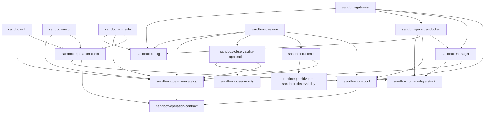

# Sandbox operation ownership migration

This specification separates operation-owned semantic and application code
from operation-facing transport and presentation code by changing **package
ownership, names, and dependency direction**. Applications, product
adapters, and composition roots keep their paths; four new packages are
added under the `crates/sandbox-operations/` and
`crates/sandbox-observability/` namespace directories, and the observability
primitives crate relocates one level to pair with its application. On
approval, it supersedes the physical layout decisions in
[[cli_migration/spec|the legacy CLI migration plan]] and extends the already
implemented [[mcp_cli_surface/implementation-spec|MCP and three-set CLI
specification]]. The existing
[[mcp_cli_surface/operation-contract|operation contract]] remains the
behavioral baseline unless this specification explicitly identifies a breaking
internal change.

Until approval, this document is a proposal and has no superseding force. At
adoption, change its status and mark the legacy plan as superseded.

> [!important] Architectural decision
> Exactly three organizational namespace directories exist under `crates/`:
> `sandbox-runtime/` (existing), `sandbox-operations/` (retained, holding
> the operation vocabulary packages), and `sandbox-observability/` (new,
> pairing the observability application with its primitives). A namespace
> directory is grouping only: it is not a Rust module, Cargo package, facade
> crate, dependency, or re-export layer; it has no root `Cargo.toml` or
> `src/lib.rs`; and it carries no enforcement semantics. The earlier
> `crates/sandbox-operation-core/` + `crates/sandbox-operation-adapters/`
> design remains rejected: the 2026-07-10 adversarial architecture review
> showed that a deny-by-default package layer map enforced from
> `cargo metadata` gives identical mechanical strength to any path-based
> rule, while that reparenting created a `sandbox-runtime` name/path
> inversion, put Python and TypeScript source under `crates/`, and maximized
> churn for concurrent work. The dependency boundary is owned by the layer
> map in the architecture check, not by directory shape.

## Outcome

After the migration, ownership of the operation system is explicit:

- `sandbox-operation-contract` (new) owns the adapter-neutral semantic
  vocabulary: operation/argument/family types, catalog document model, scope,
  route policy, the application request/response envelope, and application
  error vocabulary;
- `sandbox-operation-catalog` (new, replacing the three catalog packages)
  owns every public operation declaration in manager/runtime/observability
  domain modules, canonical internal identifiers, and the route manifest;
- `sandbox-operation-client` (new) owns gateway transport, client discovery
  configuration, and value-based request construction shared by CLI, MCP, and
  console;
- `sandbox-observability-application` (new) owns structured observability
  query and response construction extracted from the daemon;
- `sandbox-protocol` narrows in place to wire concerns only: codec, framing,
  authentication fields, limits, and the daemon readiness handshake;
- `sandbox-manager` and `sandbox-runtime` stay at their current paths and
  become protocol-free applications; the concrete daemon TCP client and local
  daemon installer move into `sandbox-gateway` composition;
- `sandbox-cli` owns all CLI projection metadata (paths, flags, positionals,
  usage, examples, help) moved out of the semantic declarations;
- the live operation E2E suite moves to the repository root as `e2e/` with
  its 7,977 tracked generated report files deleted; `web/console` stays where
  it is.

Transport composition, providers, low-level runtime primitives, deployment
entrypoints, configuration, and documentation remain in their current
locations. They may consume operation contracts but may not define public
operation metadata or business handlers.

The migration is intentionally source-breaking. Old package aliases,
re-export shims, compatibility crates, symlinks, and duplicate directory
trees are not part of the target. Public executable names and user-visible
operation behavior are preserved except for the approved changes listed in
[Approved external behavior changes](#approved-external-behavior-changes).

## Why the current layout is not extensible enough

| Current location | Responsibility currently owned there | Architectural problem |
| --- | --- | --- |
| `crates/sandbox-protocol` | Catalog types, CLI metadata, help rendering, scope, request/response values, wire parsing | Core operation vocabulary, CLI presentation, and transport are coupled in one crate. |
| `crates/sandbox-operations/{manager,runtime,observability}` | Three public catalog packages | Three packages duplicate catalog entry points, and cross-domain integrity exists only as a dev-dependency disjointness test. |
| `crates/sandbox-manager` | Manager handlers, store, router, ports, and daemon transport | The concrete daemon TCP client and local installer pull wire and process concerns into the application. |
| `crates/sandbox-daemon/src/observability` | Sampling, query service, view routing, response construction | Operation query logic is fused to daemon lifecycle and concrete runtime state. |
| `crates/sandbox-cli/src/core` | Gateway transport, value request construction, argv parsing, output, help | MCP and console depend on a CLI package to reuse non-CLI behavior. |
| `cli-operation-e2e-live-test` | Cross-adapter operation proof | The suite name misstates its scope, and 7,977 tracked generated report files dwarf the maintained source. |

The current shape creates five concrete extensibility problems:

1. `CliOperation*` names make adapter-neutral concepts appear CLI-owned.
2. Applications consume protocol `Request`/`Response` types directly, so
   application code cannot be separated from wire concerns.
3. MCP and console reuse `sandbox_cli::core`, creating an adapter-to-adapter
   dependency.
4. observability rewrites concrete public operations to the private
   `get_observability` multiplexer, duplicating routing in the CLI, manager,
   daemon, console, and tests.
5. Public catalogs and executable handler registries can drift because their
   equivalence is not enforced as a `(scope kind, operation)` invariant.

### Why ownership changes, not reparenting

All five problems are ownership and dependency problems; none is a path
problem. Reparenting was evaluated and rejected on this evidence:

- **No enforcement gain.** The architecture check must already classify
  every workspace package and fail on unknown packages; with that
  deny-by-default rule, a path-based "core must not import adapters"
  prohibition adds nothing a package-level edge allowlist does not.
- **Name/path inversion.** Moving the `sandbox-runtime` application under a
  core namespace while `crates/sandbox-runtime/` continues to hold five other
  packages makes the tree lie about the one package contributors look up
  most.
- **Non-Rust source under `crates/`.** `crates/` is the Cargo workspace
  (root `README.md`); an 18,571-line Python suite and a 6,424-line TypeScript
  application do not belong under it, and a `tests/` directory under a
  non-package root mimics Cargo layout without being one.
- **Churn.** Reparenting ten packages/products invalidates freshness
  watchers, scripts, docs, and E2E source assertions wholesale, and this
  repository expects concurrent workers making localized edits.

Namespace *grouping* is orthogonal to that rejection: `crates/sandbox-runtime/`
already groups the runtime primitives, and this target adds
`crates/sandbox-operations/` for the operation vocabulary packages and
`crates/sandbox-observability/` for the observability pair. Those groupings
place new packages and relocate only the observability primitives manifest
one level, name unchanged; they carry no enforcement claims.

## Scope boundary

### New packages

- `sandbox-operation-contract` (`crates/sandbox-operations/contract/`) —
  semantic definitions, catalog document model, route policy, scope, domain,
  argument types, request/response envelopes, application error vocabulary.
- `sandbox-operation-catalog` (`crates/sandbox-operations/catalog/`) — one
  merged catalog package with manager/runtime/observability domain modules,
  per-domain Cargo features, canonical internal identifiers, and the route
  manifest.
- `sandbox-operation-client` (`crates/sandbox-operations/client/`) — gateway
  transport, discovery configuration, and value-based request construction.
- `sandbox-observability-application`
  (`crates/sandbox-observability/application/`) — observability operation
  selection and structured response construction.

### Reshaped in place

- `sandbox-protocol` — keeps its path and name; narrows to wire
  encoding/decoding, framing, authentication field vocabulary, the readiness
  handshake, and protocol limits.
- `sandbox-manager` — keeps its path and name; loses the concrete TCP daemon
  client, local daemon installer, and every `ProtocolLimits` mention; keeps
  port traits, handlers, store, and a scope-kind-first router.
- `sandbox-runtime` (at `crates/sandbox-runtime/operation`) — keeps its path
  and name; replaces protocol envelope imports with contract types and splits
  public from internal registries.
- `sandbox-cli` — keeps its path, package, feature, and binary names; gains
  the `projection` module (CLI-only paths/flags/usage/examples), help, and
  compatibility catalog JSON; drops its `sandbox-config` dependency.
- `sandbox-mcp`, `sandbox-console` — keep their paths and names; replace the
  `sandbox-cli` dependency with `sandbox-operation-client`.
- `sandbox-gateway` — gains the concrete manager-to-daemon TCP adapter and
  the local daemon process installer.
- `sandbox-daemon` — loses observability query/response construction; keeps
  sampling, rotation, lifecycle, transport, and composition.
- `sandbox-config` — loses `configs/cli.rs` (gateway-client discovery, an
  env-and-overrides-only module) to the client crate.

### Remains outside, unchanged

| Location/component | Why it stays |
| --- | --- |
| `crates/sandbox-provider-docker` | Docker infrastructure implements manager ports; it is not operation business logic. |
| `crates/sandbox-runtime/{workspace,layerstack,namespace-process,namespace-execution,overlay}` | Low-level runtime primitives used by the runtime application. |
| `sandbox-observability` primitives | The leaf tracing, event, sampling, and reading primitive; it relocates to `crates/sandbox-observability/primitives/` with package name and content unchanged when the namespace forms. |
| `web/console` | The SPA is staged into root `dist/console` at build time either way; relocation buys colocation only and breaks watchers, staging, and server asset defaults. Tracked `*.tsbuildinfo` files are untracked. |
| root `bin/`, `xtask/`, configuration, CI, `docs/` | Repository entrypoints, build orchestration, and documentation; references are updated in place. |
| generated `target/`, `dist/`, `node_modules/`, caches, `*.tsbuildinfo`, test reports | Outputs, not source; ignored or removed rather than migrated. |

### Moves outside `crates/`

The live operation E2E suite moves from `cli-operation-e2e-live-test/` to
root `e2e/`. It is system verification — it asserts against manager and
runtime application source and drives the Docker gateway — so it belongs at
the repository level, not inside any package tree. The rename fixes a
misnomer (it exercises CLI, MCP, and console). Root discovery switches from
parent-count arithmetic to a tested root-marker resolver.

## Target filesystem and package structure

```text
ephemeral-os/
├── bin/  config/  dist/  docs/  xtask/           # unchanged homes
├── web/
│   └── console/                                  # tracked SPA source (unchanged)
├── e2e/                                          # live Python operation E2E suite (moved)
│   ├── .gitignore  conftest.py  pytest.ini  requirements.txt  test_smoke.py
│   ├── README.md  RUNNING.md
│   └── config/  core/  manager/  observability/  repo/  runtime/
└── crates/
    ├── sandbox-operations/                       # namespace directory (root retained)
    │   ├── contract/                             # sandbox-operation-contract (NEW)
    │   │   ├── Cargo.toml
    │   │   ├── src/
    │   │   │   ├── argument.rs
    │   │   │   ├── document.rs                   # catalog document model
    │   │   │   ├── domain.rs
    │   │   │   ├── error.rs
    │   │   │   ├── family.rs
    │   │   │   ├── operation.rs
    │   │   │   ├── request.rs
    │   │   │   ├── response.rs
    │   │   │   ├── route.rs
    │   │   │   ├── scope.rs
    │   │   │   └── lib.rs
    │   │   └── tests/
    │   ├── catalog/                              # sandbox-operation-catalog (NEW, merges the three)
    │   │   ├── Cargo.toml                        # features: manager, runtime, observability
    │   │   ├── src/
    │   │   │   ├── manager.rs
    │   │   │   ├── runtime.rs
    │   │   │   ├── observability.rs
    │   │   │   ├── internal/
    │   │   │   │   ├── mod.rs
    │   │   │   │   ├── runtime.rs                # workspace-session/squash/export/read_export_chunk/file_list ids
    │   │   │   │   ├── observability.rs
    │   │   │   │   └── migration.rs              # Phases 2–5 only; deleted in Phase 6
    │   │   │   ├── routes.rs
    │   │   │   └── lib.rs
    │   │   └── tests/
    │   └── client/                               # sandbox-operation-client (NEW)
    │       ├── Cargo.toml
    │       ├── src/
    │       │   ├── client.rs
    │       │   ├── config.rs                     # discovery moved from sandbox-config
    │       │   ├── request.rs                    # value-based builder
    │       │   └── lib.rs
    │       └── tests/
    ├── sandbox-observability/                    # namespace directory (converted)
    │   ├── primitives/                           # package sandbox-observability (grandfathered path)
    │   │   ├── Cargo.toml
    │   │   └── src/                              # unchanged content, relocated one level
    │   └── application/                          # sandbox-observability-application (NEW)
    │       ├── Cargo.toml
    │       ├── src/
    │       │   ├── query.rs
    │       │   ├── registry.rs
    │       │   ├── response.rs                   # structured values only
    │       │   ├── ports.rs                      # neutral runtime-state input port
    │       │   └── lib.rs
    │       └── tests/
    ├── sandbox-protocol/                          # narrowed in place
    │   └── src/{auth,codec,error,framing,handshake,limits,lib}.rs
    ├── sandbox-manager/                           # cleaned in place
    │   └── src/{operations/,ports/,router/,services/,model.rs,store.rs,lib.rs}
    ├── sandbox-cli/                               # projection added in place
    │   └── src/{bin/,projection/,help.rs,input.rs,output.rs,manager.rs,observability.rs,runtime.rs,lib.rs}
    ├── sandbox-mcp/                               # dependency swap only
    ├── sandbox-console/                           # dependency swap only
    ├── sandbox-gateway/                           # + daemon_client.rs, local_daemon_installer.rs
    ├── sandbox-daemon/                            # − observability query/response
    ├── sandbox-provider-docker/                   # unchanged (uses protocol handshake helper)
    ├── sandbox-config/                            # − configs/cli.rs
    └── sandbox-runtime/                           # namespace directory (unchanged)
        ├── operation/                             # package sandbox-runtime (grandfathered path)
        ├── workspace/
        ├── layerstack/
        ├── namespace-execution/
        ├── namespace-process/
        └── overlay/
```

The root workspace lists each Cargo package explicitly. Every directory
directly under `crates/` is a Cargo package or one of the three namespace
directories (`sandbox-runtime/`, `sandbox-operations/`,
`sandbox-observability/`), whose children are all packages. No facade,
umbrella, or namespace-root package exists; no code imports a namespace
name.

### Naming policy

1. Every directory directly under `crates/` contains a `Cargo.toml`, except
   the three namespace directories — `crates/sandbox-runtime/`,
   `crates/sandbox-operations/`, and `crates/sandbox-observability/` — whose
   children all contain one.
2. Flat package name = `sandbox-` + directory name. Namespaced package name
   = namespace prefix + `-` + child directory name, with prefixes
   `sandbox-runtime`, `sandbox-operation` (the directory keeps its
   historical plural name; package vocabulary stays singular), and
   `sandbox-observability`. Two grandfathered exceptions, listed in the
   architecture check: `crates/sandbox-runtime/operation` → package
   `sandbox-runtime`, and `crates/sandbox-observability/primitives` →
   package `sandbox-observability`.
3. Rust crate names are the package names with `-` → `_`; no `[lib] name`
   overrides.
4. Package vocabulary is singular: `operation-contract`, `operation-catalog`,
   `operation-client`.
5. Binary names are preserved: `sandbox-manager-cli`, `sandbox-runtime-cli`,
   `sandbox-observability-cli`, `sandbox-mcp`, `sandbox-console`,
   `sandbox-gateway`, `sandbox-daemon`. New binaries take their package name.
6. Non-Rust product and test source lives outside `crates/` (`web/`, `e2e/`).

## Resulting crates and target LOC

The resulting `crates/` tree contains **20 Cargo crates**: four new operation
packages, ten reshaped packages, and six unchanged packages. Root `xtask`
remains the twenty-first workspace member, reported separately as repository
tooling.

Production LOC means physical lines in tracked `src/**/*.rs` plus a
crate-root `build.rs`, including comments and blank lines. It excludes tests,
examples, manifests, lockfiles, documentation, fixtures, generated assets,
caches, and historical reports. Exact straight-move values use committed
`HEAD` `cc5f9974e`; working-tree changes are excluded. Ranges are
responsibility-split estimates and must be replaced with measured
post-migration counts in Phase 8. They are planning bounds, not code-growth
targets.

### New operation packages

| Resulting Cargo package | Target path | Expected production LOC | Basis |
| --- | --- | ---: | --- |
| `sandbox-operation-contract` | `crates/sandbox-operations/contract/` | 600–750 | Adapter-neutral catalog model, semantic argument types, scope/routes, and application envelopes; CLI-only fields are excluded. |
| `sandbox-operation-catalog` | `crates/sandbox-operations/catalog/` | 800–1,000 | Current three-package baseline is 963 LOC; CLI declarations leave while route manifest, internal identifiers, and integrity checks are added. |
| `sandbox-operation-client` | `crates/sandbox-operations/client/` | 550–650 | Gateway transport (177 LOC today), discovery config (93 LOC today), and the value-based half of request construction extracted from CLI. |
| `sandbox-observability-application` | `crates/sandbox-observability/application/` | 550–800 | Structured query/response behavior extracted from daemon plus neutral input-port DTOs (~40 LOC mirrored runtime snapshot types); sampling, lifecycle, and rendering stay outside. |

Expected new-package production total: **2,500–3,200 LOC**.

### Reshaped packages

| Resulting Cargo package | Target path | Expected production LOC | Basis |
| --- | --- | ---: | --- |
| `sandbox-protocol` | `crates/sandbox-protocol/` | 150–250 | Auth field vocabulary (2), framing (11), limits (26), wire codec split out of request/response, wire errors, and the readiness handshake. |
| `sandbox-manager` | `crates/sandbox-manager/` | about 2,800 | Current 3,266 LOC minus the 537 LOC of concrete TCP client and local-process installer moved to gateway composition, plus registry/bijection tests glue. |
| `sandbox-runtime` | `crates/sandbox-runtime/operation/` | 6,024 | Exact straight baseline; dependency and registry renames only. |
| `sandbox-cli` | `crates/sandbox-cli/` | 1,400–1,600 | Current 1,305 LOC minus client/value-builder extraction, plus `help.rs` (273) from protocol and 350–400 LOC of CLI paths, flags, usage, and examples removed from catalog declarations. |
| `sandbox-mcp` | `crates/sandbox-mcp/` | 414 | Dependency swap only. |
| `sandbox-console` | `crates/sandbox-console/` | about 1,160 | Dependency swap plus public-route validation and a client-owned request-size bound. |
| `sandbox-gateway` | `crates/sandbox-gateway/` | about 1,030 | Current 572 LOC plus manager TCP client and local daemon installer composition. |
| `sandbox-daemon` | `crates/sandbox-daemon/` | 2,424–2,674 | Current 3,224 LOC minus observability query/response behavior; lifecycle, sampling, and composition remain. |
| `sandbox-config` | `crates/sandbox-config/` | about 1,407 | Current 1,501 LOC minus client-discovery configuration moved to the client. |
| `sandbox-provider-docker` | `crates/sandbox-provider-docker/` | 1,970–1,988 | Duplicated protocol readiness construction may be removed. |

Expected reshaped production total: **18,779–19,347 LOC**.

### Unchanged packages

| Resulting Cargo package | Target path | Production LOC |
| --- | --- | ---: |
| `sandbox-observability` | `crates/sandbox-observability/primitives/` | 1,582 |
| `sandbox-runtime-layerstack` | `crates/sandbox-runtime/layerstack/` | 6,146 |
| `sandbox-runtime-namespace-execution` | `crates/sandbox-runtime/namespace-execution/` | 2,416 |
| `sandbox-runtime-namespace-process` | `crates/sandbox-runtime/namespace-process/` | 3,460 |
| `sandbox-runtime-overlay` | `crates/sandbox-runtime/overlay/` | 489 |
| `sandbox-runtime-workspace` | `crates/sandbox-runtime/workspace/` | 3,678 |

`sandbox-observability` keeps its package name, crate name, and content;
only its manifest path relocates one level when the observability namespace
forms in Phase 6.

Unchanged production total: **17,771 LOC**.
Expected production across all 20 Cargo crates under `crates/`:
**39,050–40,318 LOC** (current baseline 39,391).

### Workspace tooling outside `crates/`

| Resulting Cargo package | Target path | Expected source LOC | Basis |
| --- | --- | ---: | --- |
| `xtask` | `xtask/` | 1,600–1,750 | Current baseline is 1,439 LOC; the operation architecture checker adds the layer map, edge, feature-closure, and route/projection gates. |

The Cargo workspace therefore has **21 members**.

### Maintained non-Cargo source

| Area | Expected source LOC | Basis |
| --- | ---: | --- |
| `web/console/` | 6,424 | Tracked TypeScript, TSX, CSS, and `index.html`; generated output and `*.tsbuildinfo` excluded and untracked. |
| `e2e/` | 18,571 | Maintained Python test and harness source (87 tracked files), reported separately from production. |
| `crates/sandbox-provider-docker/examples/` | 82 | Rust example source, excluded from crate production totals. |

Adding frontend and provider example source to the 20-crate production
total, but excluding E2E and root tooling, gives **45,556–46,824 LOC**.
Including `xtask` gives **47,156–48,574 LOC** of maintained non-test
workspace/frontend/example source. The goal is near-zero net feature LOC:
most change is responsibility splitting, type renaming, and deletion of
duplicated routing.

The current E2E tree also contains 7,977 tracked report files totaling
**4,274,972 lines** of generated/historical output (measured at `cc5f9974e`
by summing newline counts of tracked file contents). Those files are
explicitly outside the target LOC inventory. Remove them from Git, archive
any required summary outside the source tree, and add durable ignore rules
before moving the 87 maintained files to `e2e/`.

## Target dependency law

The normative law is the table below, enforced from `cargo metadata` over
normal, dev, build, and optional edges. The diagram is informative.



Edges to the contract are elided for readability: any package that may
depend on the catalog, protocol, or client may also depend on the contract
directly.

| Package | May depend on (workspace) | Must never depend on |
| --- | --- | --- |
| `sandbox-operation-contract` | nothing in the workspace | any workspace crate |
| `sandbox-operation-catalog` | contract | everything else |
| `sandbox-manager` | contract; catalog (`manager`, `observability` features); `sandbox-runtime-layerstack` | protocol; client; CLI/MCP/console; gateway/daemon; runtime or observability applications; provider-docker |
| `sandbox-runtime` (application) | contract; catalog (`runtime` feature); `sandbox-runtime-{workspace,layerstack,namespace-execution,namespace-process}`; `sandbox-observability` | protocol; client; any adapter; manager or observability applications; daemon |
| `sandbox-observability-application` | contract; catalog (`observability` feature); `sandbox-observability`; `sandbox-runtime-layerstack` (data types only) | protocol; client; any adapter; the concrete runtime application; daemon |
| `sandbox-protocol` | contract | catalog; applications; CLI/MCP/console; client |
| `sandbox-operation-client` | contract; protocol | catalog; applications; CLI/MCP/console; sandbox-config |
| `sandbox-cli` | client; contract; catalog (own-domain features only, forwarded per binary feature) | protocol; applications; MCP/console; sandbox-config |
| `sandbox-mcp` | client; contract; catalog (all domain features) | protocol; applications; CLI/console |
| `sandbox-console` | client; contract; catalog (all domain features); sandbox-config (console YAML loading and validation only) | protocol; applications; CLI/MCP; direct daemon RPC |
| `sandbox-gateway` | contract; catalog; protocol; manager application; provider-docker; sandbox-config | CLI/MCP/console; client; runtime/observability applications |
| `sandbox-daemon` | contract; catalog; protocol; runtime application; observability application; `sandbox-observability`; `sandbox-runtime-namespace-process`; sandbox-config; dev: layerstack, workspace | CLI/MCP/console; client; manager application |
| `sandbox-provider-docker` | manager application ports/models; protocol (readiness helper only); sandbox-config; `sandbox-runtime-layerstack` | CLI/MCP/console; client; daemon; application handler internals |
| `sandbox-config` | nothing in the workspace | any workspace crate |
| `sandbox-observability`, `sandbox-runtime-{layerstack,overlay}` | nothing in the workspace | any workspace crate |
| `sandbox-runtime-{workspace,namespace-execution,namespace-process}` | their current primitive edges only | any operation, application, or product crate |
| `xtask` | nothing in the workspace | — (and no package may depend on `xtask`) |

Enforcement rules:

- The architecture check assigns **every** workspace package (by canonical
  manifest path) to a layer in an explicit map and **fails on any package
  absent from the map**, so future packages cannot bypass the law.
- The check inspects normal, dev, build, and optional dependency edges, so
  tests cannot conceal a forbidden edge.
- The shared client is the only operation-facing product crate allowed to
  depend on `sandbox-protocol`. Provider-docker's protocol edge is limited to
  the protocol-owned daemon readiness helper.
- No application crate (`sandbox-manager`, `sandbox-runtime`,
  `sandbox-observability-application`) may depend on `sandbox-protocol`,
  `sandbox-operation-client`, any product adapter, or a composition root.

## Contract and vocabulary decisions

### The inner contract owns the application envelope

The current protocol `Request` and `Response` types are used by handlers, so
they are not purely wire details. Split them as follows:

- `sandbox-operation-contract` owns `OperationRequest`, `OperationResponse`,
  `OperationError`, `OperationScope`, operation arguments, and validation
  helpers used by applications.
- `sandbox-protocol` owns JSON/wire decoding and encoding, newline framing,
  authentication fields, malformed-wire errors, and size limits.
- gateway and daemon composition decode wire input into an
  `OperationRequest`, call an application, then encode the
  `OperationResponse`.
- application crates do not import `sandbox-protocol`.

This separation makes it possible to add another transport without changing
operation handlers.

### Semantic names lose the historical `Cli` prefix

| Current name | Target name |
| --- | --- |
| `CliOperationSpec` | `OperationSpec` |
| `CliOperationFamilySpec` | `OperationFamilySpec` |
| `CliOperationCatalog` | `OperationCatalog` |
| `CliOperationCatalogDocument` | `OperationCatalogDocument` |
| `CliOperationExecutionSpace` | `OperationDomain` |
| `CliOperationScope` | `OperationScope` |
| protocol `Request` | contract `OperationRequest` |
| protocol `Response` | contract `OperationResponse` |

The core contract owns only semantic fields: name, domain, description,
required/default values, argument relationships, scope policy, and routes.
`CliSpec`, `ArgCliSpec`, CLI paths, flags, positionals, usage, and CLI
examples move to `sandbox-cli::projection`. The CLI adapter joins that
projection with the semantic catalog for argv parsing, help, and its
compatibility catalog document. MCP and console consume the adapter-neutral
catalog directly.

This is an approved serialized-document break at the core boundary: the
merged catalog's document is semantic-only. The existing CLI-bearing catalog
JSON remains a supported adapter output; `sandbox-cli` owns its projection
and byte compatibility. That compatibility is not achieved by putting
adapter fields back into the contract.

### Package naming

| Current package | Target package | Decision |
| --- | --- | --- |
| none | `sandbox-operation-contract` | New inner contract at `crates/sandbox-operations/contract/`. |
| `sandbox-manager-operations`, `sandbox-runtime-operations`, `sandbox-observability-operations` | `sandbox-operation-catalog` | Merge three packages into one catalog at `crates/sandbox-operations/catalog/` with domain modules, domain features, and one integrity boundary; the `crates/sandbox-operations/` root is retained as the namespace directory. |
| `sandbox-protocol` | `sandbox-protocol` | Preserve package name **and path**; narrow its responsibility in place. |
| `sandbox-manager` | `sandbox-manager` | Preserve package name **and path**; clean in place. |
| `sandbox-runtime` | `sandbox-runtime` | Preserve package name **and path** (`crates/sandbox-runtime/operation`, one of the two grandfathered naming-policy exceptions). |
| none | `sandbox-observability-application` | New query/dispatch application at `crates/sandbox-observability/application/`, extracted from daemon. |
| `sandbox-observability` | `sandbox-observability` | Preserve package name; relocate to `crates/sandbox-observability/primitives/` when the observability namespace forms. |
| none | `sandbox-operation-client` | New shared wire client at `crates/sandbox-operations/client/`, extracted from CLI and `sandbox-config`. |
| `sandbox-cli`, `sandbox-mcp`, `sandbox-console` | unchanged | Preserve package, feature, binary names, and paths. |

The three CLI binaries remain `sandbox-manager-cli`, `sandbox-runtime-cli`,
and `sandbox-observability-cli`. The root wrapper scripts keep their
existing names.

### Catalog domain features preserve per-binary authority

The current design guarantees at compile time that one CLI binary cannot
enumerate another authority: each `sandbox-cli` feature gates an optional
dependency on exactly one catalog package, and the boundary law in root
`README.md` declares "let one binary enumerate another authority" a
*must never*. A naive merge would silently void that guarantee.

The merged catalog therefore exposes per-domain Cargo features:

- `sandbox-operation-catalog` has features `manager`, `runtime`, and
  `observability`, no default features. Each domain module and its route
  manifest contribution are gated by its feature. The `internal` module
  (identifier constants only, never projected) is always compiled.
- `routes.rs` exposes per-domain manifest slices; the unified manifest and
  the cross-domain integrity tests are gated on all three features and run
  under `--all-features`.
- `sandbox-cli` features forward: `manager = ["dep:clap",
  "sandbox-operation-catalog/manager"]`, and likewise for `runtime` and
  `observability`. A binary built with `--no-default-features --features
  manager` contains no runtime or observability public declarations.
- MCP, console, and daemon enable the domain features they project or
  execute (MCP and console: all three; daemon: `runtime` +
  `observability`; manager application: `manager` + `observability`).
- The architecture check verifies the per-binary feature closure: for each
  CLI binary, the resolved `sandbox-operation-catalog` features contain only
  that binary's domain.

Because workspace-level builds unify features, the cross-domain integrity
tests must be executed with `--all-features`; the verification matrix and
the architecture check both mandate it.

## Operation registration and routing

Routing uses three distinct concepts defined by the contract:

- `OperationScope` is the actual validated request value: `System` or
  `Sandbox { sandbox_id }`.
- `OperationScopePolicy` is static declaration metadata: `System`,
  `SandboxRequired`, or `SystemOrSandbox`.
- `OperationScopeKind` is the normalized routing discriminator, `System` or
  `Sandbox`, derived from the actual request without discarding its
  `sandbox_id`.

`OperationDomain` identifies the catalog/product surface (`Manager`,
`Runtime`, or `Observability`); it does not choose the executing
application. Its existing serialized catalog field remains unchanged for
baseline compatibility. `OperationExecutionOwner` in the route manifest makes
execution ownership explicit and may differ from the domain.

The value-based builder used by CLI and MCP separates
`scope_selector: Option<String>` from operation `args`; `sandbox_id` is
interpreted according to policy rather than by its field name alone:

- `System` constructs `OperationScope::System`. A `sandbox_id` declared by a
  manager operation remains a business argument in `args`; an out-of-band
  scope selector is rejected.
- `SandboxRequired` requires a non-empty selector, removes any compatibility
  copy from `args`, and constructs `OperationScope::Sandbox`.
- `SystemOrSandbox` constructs system scope when the selector is absent and
  sandbox scope when it is present, removing the selector from `args` in the
  latter case.

Runtime's CLI projection synthesizes its selector input from semantic route
policy. The observability CLI projection consumes its existing `sandbox_id`
input as a selector. Manager operations with a business `sandbox_id` remain
unchanged. Routers derive `OperationScopeKind` for lookup and pass the
actual scope, including its identifier, unchanged to the selected handler.

Every application route is keyed by `(OperationScopeKind, operation name)`,
not by operation name alone. Every route belongs to exactly one of four
classes:

| Class | Source of truth | Exposure rule |
| --- | --- | --- |
| Public catalog operation | Exactly one domain module in `sandbox-operation-catalog` | Projected to its permitted CLI/MCP/console surfaces and executable for every declared scope. |
| Canonical internal application operation | The merged catalog's `internal` domain submodules, outside `OperationCatalog` | Callable only by trusted composition/application flows; rejected at the enforcement chokepoints below; never projected. |
| Transport handshake | protocol declaration, for example `sandbox_daemon_ready` | Used only by transport/provider readiness code. |
| Deliberate HTTP-only exception | `internal::runtime::FILE_LIST` | Served only by the documented read-only HTTP path and excluded from public CLI/MCP catalogs. |

The `internal` module is organized as per-domain submodules
(`internal/runtime.rs`, `internal/observability.rs`), each entry naming its
owning application, so internal identifiers keep exactly one owner and the
module cannot become an unowned dumping ground. This lets the manager and
daemon share `export_layerstack`, `read_export_chunk`, and
`squash_layerstack` without duplicating string literals or introducing a
manager-to-runtime-application dependency.

The canonical runtime-internal set is exactly `create_workspace_session`,
`destroy_workspace_session`, `squash_layerstack`, `export_layerstack`, and
`read_export_chunk`. The first two are daemon-owned workspace-lifecycle
operations. `file_list` shares the internal runtime identifier module but
remains the deliberate HTTP-only exception, not a canonical internal
application operation.

Each domain module contributes to one Rust-only static route manifest of
`OperationRouteSpec { operation, scope_policy, scope_kind, execution_owner,
visibility }`.
`execution_owner` is one of `Manager`, `Runtime`, or `Observability`. An
operation with `SystemOrSandbox` policy expands to two route entries and may
assign different owners; this is how system `snapshot` belongs to the
manager application while sandbox `snapshot` belongs to the observability
application. The merged semantic `OperationCatalogDocument` contains route
and scope-policy metadata but no CLI paths, flags, positionals, usage, or
examples. CLI joins the semantic document with its own projection when
producing legacy CLI-bearing JSON and help. CLI and MCP resolve routes
through their domain manifest slices and pass the resulting policy/spec into
the shared client's value-based builder. The gateway client does not depend
on the catalog package or switch on operation-name/domain literals.

### Visibility enforcement chokepoints

"Callable only by trusted flows" must have enforcement points, not just
documentation:

- The console server validates each `/api/rpc` request against the
  **public** route manifest only and rejects everything else with an
  invalid-request error. The browser preserves its existing request shape,
  `{ op, scope, args }`; the console validates the fully scoped
  `OperationRequest` and passes it to the shared client's lower-level send
  API. (Transitionally, Phases 2–5 additionally accept the single migration
  declaration described below.)
- The manager router rejects gateway-arriving requests whose route
  visibility is internal. Manager services call the daemon-client port
  directly for internal forwarding (`export_layerstack`,
  `read_export_chunk`, `squash_layerstack`), so internal flows bypass the
  public dispatch path by construction.
- The live Docker E2E harness is a trusted operator-side test flow, not a
  product adapter. Its direct authenticated daemon helper is allowlisted to
  `create_workspace_session` and `destroy_workspace_session` only, resolves
  the per-sandbox daemon endpoint through `inspect_sandbox`, resolves the
  daemon token through Docker control-plane metadata, and never logs or
  persists that token. Public, migration, and HTTP-only operations do not
  use this helper.
- Both product chokepoints have tests: console returns invalid-request for
  `export_layerstack`; a manager router test proves every canonical internal
  route, including both workspace-session lifecycle routes, is unreachable
  from public dispatch while `export_changes` still succeeds end-to-end. The
  live workspace-session E2E proves the trusted direct-daemon lifecycle path
  remains available.

### CLI projection integrity is bidirectional

The current single-declaration design cannot drift: semantic and CLI fields
live in one constant. Splitting them introduces a silent-omission failure
mode (the spec type's `cli` field is already `Option`, and `file_list`
already exercises `None`), so the integrity tests must check both
directions:

- every projected operation and argument exists in the semantic catalog;
  flags and positional slots are unique; no internal declaration is
  projected; **and**
- every public route entry whose domain a CLI binary projects has exactly
  one projection entry — an operation added to the catalog without a
  projection fails the suite instead of vanishing from help and argv
  parsing.

CLI presentation metadata has no second owner.

Each application has two explicit registries:

- a public registry whose `(scope kind, name)` keys must be a bijection with
  all public route entries whose `execution_owner` names that application,
  including entries declared by another domain module; and
- an internal registry whose entries must match canonical internal
  declarations and must not appear in the semantic public catalog.

Merged-catalog integrity tests assert that public `(scope kind, name)` route
keys are globally unique across domain modules with no exception. A
multi-scope semantic operation produces distinct keys in one manifest; it
does not permit duplicate keys across modules.

### Transitional observability route

Phases 2–5 retain one canonical, migration-only internal declaration for
`(Sandbox, get_observability)` in
`sandbox_operation_catalog::internal::migration`. That module also owns the
temporary semantic resolver from public observability operations to a
contract-owned neutral dispatch target/argument set; it contains no CLI
metadata. CLI and MCP depend on the merged catalog and invoke the resolver
independently before calling the shared gateway client. They do not depend
on one another, and the client does not import the merged catalog or switch
on operation names. The manager aggregate path imports the same canonical
declaration instead of copying the literal. During the transition, console's
existing fully scoped `get_observability` request is validated against the
same internal declaration and sent directly. The declaration is excluded
from the semantic public document and final route set. Phase 4 may make
manager routing scope-kind-first, but concrete public sandbox observability
routes are not activated until the atomic Phase 6 client/manager/daemon
cutover. Phase 6 deletes this declaration, resolver, all temporary
translations, and the synthetic `view` argument together.

### Remove the observability multiplexer

Delete the private `get_observability` operation and preserve concrete
public names end-to-end:

| Route | Owner |
| --- | --- |
| `(system, snapshot)` | manager application aggregate snapshot |
| `(sandbox, snapshot)` | observability application in the daemon |
| `(sandbox, trace)` | observability application in the daemon |
| `(sandbox, events)` | observability application in the daemon |
| `(sandbox, cgroup)` | observability application in the daemon |
| `(sandbox, layerstack)` | observability application in the daemon |

For aggregate system `snapshot`, the manager constructs a canonical
sandbox-scoped `snapshot` request for each selected sandbox and aggregates
the responses. It does not call a private alias or bypass the sandbox route
manifest.

The manager router becomes scope-kind-first. A sandbox-scoped operation must
be forwarded or dispatched according to its declared route even when its
name is also declared for system scope. The request builder no longer
inserts a `view` argument or rewrites the operation name.

### Approved external behavior changes

1. The merged semantic catalog document excludes CLI-only fields; the
   CLI-bearing catalog JSON remains byte-compatible as a `sandbox-cli`-owned
   projection output.
2. The internal observability wire shape changes at the atomic Phase 6
   cutover: concrete public names replace `get_observability` + `view`. CLI
   syntax, MCP tool names, console request envelope, and response shapes
   remain unchanged after all in-repository clients and servers are migrated
   together. For this observability cutover, the web console changes only its
   observability `op` values; the independent lifecycle-control change is
   described in item 3.
3. The console `/api/rpc` endpoint rejects operations absent from the public
   route manifest with a console-side invalid-request error. Requests for
   canonical internal operations were previously forwarded and could be
   accepted downstream; the public endpoint no longer exposes that path.
   Consequently, the web console retires its manual workspace-session create
   and destroy controls, while preserving session browsing, filtering,
   selection, and public command auto-publish behavior. The rejected request
   envelope shape is unchanged.
4. The console's HTTP request-body size bound is owned by the shared client
   (which re-exports the wire limit it enforces); console no longer imports
   `sandbox-protocol` for it. The numeric bound is unchanged.

## Exact current-to-target move map

| Current | Target | Required transformation |
| --- | --- | --- |
| `crates/sandbox-protocol/src/lib.rs` | `crates/sandbox-operations/contract/src/lib.rs` and (in place) `crates/sandbox-protocol/src/lib.rs` | Export semantic/application types from the contract; export only wire APIs from protocol; add no compatibility re-exports. |
| `crates/sandbox-protocol/src/cli_operation_spec.rs` | `crates/sandbox-operations/contract/src/{operation,family,argument}.rs`, `crates/sandbox-operations/catalog/src/{manager,runtime,observability}.rs`, and `crates/sandbox-cli/src/projection/` | Split semantic types, semantic declarations, and CLI-only metadata; apply semantic type renames. |
| `crates/sandbox-protocol/src/catalog.rs` | `crates/sandbox-operations/contract/src/{document,domain}.rs` plus `crates/sandbox-cli/src/projection/document.rs` | Keep semantic catalog conversion/validation in the contract; put the compatibility CLI-bearing document serializer in CLI. The contract module is named `document.rs` so "catalog" names exactly one package. |
| `crates/sandbox-protocol/src/scope.rs` | `crates/sandbox-operations/contract/src/{scope,route}.rs` | Rename actual scope and add scope-policy, scope-kind, executor, and route-spec types. |
| Application portions of protocol `request.rs`, `response.rs`, and `error_kind.rs` | `crates/sandbox-operations/contract/src/{request,response,error}.rs` | Move envelope, argument helpers, application results, and shared application error vocabulary. |
| Wire portions of protocol `request.rs`, `response.rs`, and `error_kind.rs`, plus `auth.rs`, `framing.rs`, and `limits.rs` | `crates/sandbox-protocol/src/{codec,error,auth,framing,limits}.rs` (in place) | Keep wire codec and wire rejection vocabulary; preserve package name and external response strings. |
| Raw readiness declaration/encoding duplicated by provider and daemon dispatch | `crates/sandbox-protocol/src/handshake.rs` | Provide one canonical readiness request/encoder. Provider retains Docker polling and response validation. |
| `crates/sandbox-protocol/src/help.rs` | `crates/sandbox-cli/src/help.rs` | Help/search/rendering is CLI presentation. |
| `crates/sandbox-protocol/tests/unit.rs` | contract, protocol, merged catalog, and CLI test targets | Split every proof by the owner of the behavior. |
| `crates/sandbox-operations/{manager,runtime,observability}` | `crates/sandbox-operations/catalog/` | Merge all three Cargo packages into `sandbox-operation-catalog` with `manager`, `runtime`, `observability`, `internal/*`, and unified `routes` modules plus per-domain features; delete the three old packages in the same atomic change. The `crates/sandbox-operations/` root is retained as the operation namespace directory. |
| CLI metadata embedded in the three current catalog declaration sets | `crates/sandbox-cli/src/projection/{manager,runtime,observability}.rs` | Keep flags, CLI paths, positionals, usage, and CLI examples at the CLI boundary; join by semantic operation/argument identity; enforce bidirectional integrity. |
| `crates/sandbox-manager/src/operation/cli_definition` | `crates/sandbox-manager/src/operations/registry` (in place) | Rename: it binds handlers and does not define CLI behavior. |
| Concrete `TcpSandboxDaemonClient` and the `ProtocolLimits`-derived timeout policy imported by manager `router/forward.rs` | `crates/sandbox-gateway/src/daemon_client.rs` | Gateway composition implements the manager daemon-client port and owns protocol authentication, framing, limits, and transport deadline enforcement. The manager port and forwarding service no longer mention `ProtocolLimits`; a future business deadline, if needed, must be an application-owned policy. |
| Concrete `LocalSandboxDaemonInstaller`, launch/process/socket helpers, and focused tests in manager `daemon_install.rs` and manager tests | `crates/sandbox-gateway/src/local_daemon_installer.rs` and gateway tests | Keep only the `SandboxDaemonInstaller` port and neutral `StartedDaemon` DTO in the manager application. Gateway composition owns the local-process adapter and its lifecycle-focused proofs. |
| `crates/sandbox-runtime/operation/src/operation_adapter` | `crates/sandbox-runtime/operation/src/operations/registry` (in place) | Rename; replace protocol envelope dependency with contract; split public from internal registries. |
| `crates/sandbox-daemon/src/observability/{mod.rs,service.rs,layerstack.rs,view/**}` query/response responsibilities | `crates/sandbox-observability/application/src/` | Extract structured query and response behavior; retain sampling/rotation/lifecycle/acquisition in daemon. The application defines neutral input DTOs for the runtime snapshot types and may use `sandbox-runtime-layerstack` data types (`LayerRef`, `StackObservation`, `LayerDeltaDescription`, `LayerDeltaEntryKind`) directly. |
| Pure cases from `crates/sandbox-daemon/tests/unit/{observability.rs,observability_layerstack.rs}` | `crates/sandbox-observability/application/tests/` | Move transport-independent query/response proofs; retain daemon wiring/lifecycle cases in place. |
| `crates/sandbox-observability` (package `sandbox-observability`) | `crates/sandbox-observability/primitives/` | Relocate the manifest path one level in the same atomic change that creates `application/`; package name, crate name, and content unchanged; update workspace path dependencies and the gateway freshness watch. |
| Daemon observability sampling, rotation, process/runtime collection, and wiring | stays in `crates/sandbox-daemon` | Feed neutral snapshots/readers to the observability application through a daemon-owned adapter newtype implementing the app-owned port. |
| `crates/sandbox-cli/src/core/client.rs` | `crates/sandbox-operations/client/src/client.rs` | Generic gateway transport. |
| `crates/sandbox-config/src/configs/cli.rs` | `crates/sandbox-operations/client/src/config.rs` | Env-and-overrides discovery only; the client gains no `sandbox-config` dependency, and `sandbox-cli` drops its `sandbox-config` dependency (its only use is this re-export). |
| `crates/sandbox-config/tests/unit/configs/cli.rs` | `crates/sandbox-operations/client/tests/config.rs` | Move client-discovery tests and repoint old module declarations. |
| Value-based portion of `sandbox-cli/src/core/request_builder.rs` | `crates/sandbox-operations/client/src/request.rs` | Typed values, scope, request ID, and generic validation; callers supply resolved semantic specs; the client exposes the request-size bound it enforces. |
| Argv/flag portion of `request_builder.rs`, `output.rs`, and remaining CLI | stays in `crates/sandbox-cli/` | CLI owns projection lookup, string parsing, help, output, progress, exit behavior, and binaries. |
| `crates/sandbox-mcp`, `crates/sandbox-console` | unchanged paths | Replace the `sandbox-cli` dependency with `sandbox-operation-client`; console adds public-route validation and takes its body bound from the client. |
| `web/console` | unchanged path | Untrack `web/console/*.tsbuildinfo`; no source moves. |
| The `get_observability` literals in the CLI request builder, daemon RPC dispatch, and manager observability snapshot | nowhere | Delete atomically in Phase 6 after concrete route manifests and handlers exist. |
| 87 maintained non-report files in `cli-operation-e2e-live-test/` | `e2e/` | Move; replace parent-count root discovery with a tested root-marker resolver; repoint commands, documentation metrics, and source assertions. |
| 7,977 tracked E2E report files (4,274,972 lines) | nowhere in source | Untrack/delete; archive only outside the source tree if required. |

## Migration phases

This is a design specification, not the execution tracker.
[[phase-plan|The phase plan]] beside this file owns phase checkboxes,
owners, command output, deviations, and approval evidence, and enforces
strict sequencing: a phase may not start until the previous phase's gate is
approved there. The final cutover checkboxes in this specification are a
summary: update them only from evidence linked in the phase plan, not as a
second execution log.

Every phase must leave the whole workspace green. At minimum, run
`cargo check --workspace --all-targets --all-features` plus focused tests
after each phase. Run the relevant workspace clippy/test commands whenever a
dependency boundary or public behavior changes, then run the complete matrix
in Phase 8. A responsibility move and its Cargo/path updates are one atomic
phase change; no temporary compatibility package is kept after the phase
gate.

### Phase 0 — Characterize behavior, freeze the inventory, purge generated weight

- Record `cargo metadata` package names, paths, features, binaries, and the
  current dependency graph.
- Record current production LOC by source owner using this specification's
  counting rule; use those measurements as the allocation baseline for the
  target estimates.
- Generate an audit table for every dispatchable route with domain, scope
  policy, expanded scope kind, visibility, catalog owner, execution owner,
  handler owner, and wire destination.
- Snapshot catalog JSON, CLI help fixtures, CLI error envelopes and exit
  codes, MCP tool schemas, console RPC behavior, and internal daemon RPC
  behavior.
- Run the current unit/integration suites and record the live E2E baseline
  from the current suite location.
- Then, in one change: untrack/delete the 7,977 tracked E2E report files and
  the two tracked `web/console/*.tsbuildinfo` files, add durable ignore
  rules, move the 87 maintained E2E files to root `e2e/`, replace
  parent-count root discovery with a root-marker resolver, and rerun the E2E
  smoke to prove relocation.

Exit gate: every current operation is classified, behavior that must remain
stable has an executable characterization test, no generated report or build
info remains tracked, and the relocated suite discovers the repository root
and passes its smoke test.

### Phase 1 — Create the contract and narrow protocol in place

- Create `sandbox-operation-contract` at `crates/sandbox-operations/contract/`;
  the retained namespace root transiently also holds the three legacy
  catalog packages until Phase 2.
- Move catalog/spec/scope/route types into the contract and split the
  application envelope from the wire codec; `sandbox-protocol` keeps its
  path and narrows to wire concerns.
- Apply all semantic type renames in one change.
- Move CLI paths, flags, positionals, usage, examples, help, and search into
  `sandbox-cli::projection`; the contract retains no CLI fields.
- Centralize the daemon readiness handshake in protocol and update provider
  polling plus daemon dispatch to use that declaration/encoder.
- Move the concrete `TcpSandboxDaemonClient` implementation and its
  `ProtocolLimits`-derived timeout/deadline enforcement from manager to
  gateway composition before dropping the manager protocol dependency.
  Manager forwarding retains only its neutral daemon-client port and
  business logic. Move `LocalSandboxDaemonInstaller`, local
  launch/process/socket helpers, and their focused tests into gateway
  composition, keeping the `SandboxDaemonInstaller` port and neutral
  `StartedDaemon` DTO in manager.
- Split the current 497-line protocol test suite by ownership.
- Update all application consumers to contract envelopes directly; do not
  add deprecated aliases or re-exports.

Exit gate: applications can construct and handle `OperationRequest` and
`OperationResponse` without importing `sandbox-protocol`; manager contains
no concrete TCP or local-process adapter; protocol tests prove wire
compatibility for all behavior not explicitly broken later.

### Phase 2 — Merge and refeature the catalogs

- Create `crates/sandbox-operations/catalog/` named
  `sandbox-operation-catalog`; move the three existing catalog crates into
  its `manager`, `runtime`, and `observability` modules behind per-domain
  features; delete the three old sibling packages (`manager/`, `runtime/`,
  `observability/`) in the same atomic change, retaining the
  `crates/sandbox-operations/` root as the namespace directory; update
  workspace dependencies, callers, fixtures, and `Cargo.lock`.
- Separate semantic public declarations from canonical internal declarations
  (`internal/runtime.rs`, `internal/observability.rs`) and from the
  CLI-owned projection.
- Build the route manifest with scope policy, concrete scope kind, execution
  owner, and visibility; expose per-domain slices and the all-features
  unified manifest.
- Add the single migration-only route and semantic resolver under
  `internal::migration`; keep both out of the semantic public document and
  free of CLI metadata.
- Replace cross-catalog disjointness tests with cross-domain
  route-uniqueness tests gated on all features. In `sandbox-cli`, add
  bidirectional projection-integrity and compatibility-JSON fixtures; the
  catalog's tests never depend on CLI.
- Forward `sandbox-cli` features to catalog domain features and verify each
  binary's feature closure contains only its own domain.
- Assert the catalog's only workspace dependency is the operation contract.

Exit gate: the merged semantic document contains every public operation
once, CLI fixtures characterize the intentionally separate legacy
projection, route expansion is deterministic, public route keys are globally
unique under `--all-features`, every declaration has one execution owner,
and `cargo tree -p sandbox-cli --no-default-features --features manager`
shows no runtime or observability catalog feature. Handler bijection is
deferred to the application phases.

### Phase 3 — Extract the shared gateway client

- Create `sandbox-operation-client` at `crates/sandbox-operations/client/`
  from gateway transport, client discovery config (moved from
  `sandbox-config/configs/cli.rs`), and value-based request construction;
  callers supply resolved semantic specs, and the client exposes the
  request-size bound it enforces.
- Keep argv parsing, help, output formatting, progress presentation, and
  exit-code behavior in `sandbox-cli`; CLI owns catalog-to-flag lookup.
- Replace the existing observability mapping table with independent CLI and
  MCP calls to the merged catalog's temporary semantic resolver. No adapter
  owns a shared projection API or depends on a peer adapter. The client
  remains independent of both the merged catalog and application crates.
- Preserve console `/api/rpc` as a fully scoped request API. The console
  server validates its `OperationRequest` against the public route manifest
  (plus, transitionally, the migration declaration) and calls the shared
  client's send API; its body bound comes from the client.
- Change MCP and console to depend on `sandbox-operation-client`, never
  `sandbox-cli`; drop `sandbox-cli`'s `sandbox-config` dependency.
- Remove direct `sandbox-protocol` dependencies and imports from CLI, MCP,
  and console. Among operation-facing product crates, only the shared client
  owns the wire protocol.
- Split request-builder tests according to their new owners.

Exit gate: CLI and MCP share the value-based builder, console shares the
same client transport through its validated-request send API, none depends
on or imports `sandbox-protocol`, and no code outside the CLI package
imports CLI parsing/help/output modules.

### Phase 4 — Clean the manager application in place

- Rename `operation/cli_definition` to `operations/registry`; it binds
  handlers and does not define CLI behavior.
- Keep the `SandboxDaemonClient` trait as an application port and verify the
  concrete TCP/protocol implementation remains in gateway composition; keep
  the `SandboxDaemonInstaller` port and neutral `StartedDaemon` DTO.
- Make the router select by scope kind before operation name, and reject
  gateway-arriving requests whose route visibility is internal.
- Retain only the declared migration route for sandbox observability; do not
  claim final concrete-route completeness before Phase 6.
- Depend on the single catalog package (`manager` + `observability`
  features) and explicitly import manager public specs, the observability
  system snapshot, and runtime internal forwarding declarations; do not
  duplicate names.
- Add public route-subset/handler bijection, internal registry, and
  internal-rejection tests.

Exit gate: the manager application has no protocol or adapter dependency,
contains no concrete TCP or local-process adapter, every system-scoped
public route has exactly one handler, and internal-visibility routes are
unreachable from public dispatch while `export_changes` still succeeds end
to end.

### Phase 5 — Clean the runtime application in place

- Rename `operation_adapter` to `operations/registry`.
- Replace protocol request/response imports with contract types.
- Split the public registry from the exact canonical runtime-internal set:
  `create_workspace_session`, `destroy_workspace_session`,
  `squash_layerstack`, `export_layerstack`, and `read_export_chunk`; retain
  `file_list` separately as the HTTP-only exception.
- Import canonical runtime internal identifiers in both manager forwarding
  and runtime dispatch.
- Add `(scope kind, name)` route-subset/handler bijection and
  internal-exclusion tests.

Exit gate: the runtime application has no protocol or presentation
dependency; every runtime public entry and every canonical internal entry
has exactly one handler.

### Phase 6 — Extract observability application and remove multiplexing

- Convert `crates/sandbox-observability/` into a namespace directory in one
  atomic change: relocate the primitives package to
  `crates/sandbox-observability/primitives/` (package name, crate name, and
  content unchanged; update workspace path dependencies and the gateway
  freshness watch) and create `sandbox-observability-application` at
  `crates/sandbox-observability/application/` from the daemon's structured
  observability query/response behavior. Keep collection and lifecycle in
  daemon; the application returns structured values only.
- Permit direct use of `sandbox-observability` leaf `Reader`/`RawFilter`
  primitives and `sandbox-runtime-layerstack` data types; define an
  app-owned port with neutral DTOs for daemon/runtime state acquisition.
- Add a daemon-owned adapter newtype that implements the app-owned port and
  wraps concrete daemon/runtime state; do not attempt an
  orphan-rule-invalid implementation for a runtime-owned concrete type.
- Move pure query/structured-response tests and retain daemon
  wiring/lifecycle tests with their owners.
- Route the six declared `(scope kind, operation)` combinations directly
  from the route manifest and execution owner.
- Delete `get_observability` and the synthetic `view` argument from CLI,
  manager, daemon, the migration manifest, console, the web console's
  observability API module, MCP tests, and E2E expectations, atomically.
- Keep the console `/api/rpc` envelope stable while changing its
  observability `op` values from the temporary multiplexer to concrete
  public names; console validation becomes public-manifest-only.
- Prove that the system `snapshot` and sandbox `snapshot` routes cannot
  shadow each other.

Exit gate: the observability application has no concrete runtime, daemon,
protocol, or presentation dependency; it returns structured responses,
concrete names survive end-to-end, and outward behavior matches Phase 0.

### Phase 7 — Update documentation, scripts, and law statements

- Update normative architecture docs, root `README.md`, `CLAUDE.md`,
  `AGENTS.md`, console and E2E READMEs, package docs, CI, and executable
  scripts: the boundary law statements that protocol owns operation
  vocabulary and that adapters reuse `sandbox_cli::core` both become false.
- Extend the `bin/start-sandbox-docker-gateway` freshness watch with the
  contract, catalog, and observability-application source paths that feed
  the bundled daemon binary.
- Replace every `cargo -p sandbox-*-operations` selector with
  `cargo -p sandbox-operation-catalog`.
- Mark historical plans/reports as superseded or exempt instead of
  mechanically rewriting historical evidence.

Exit gate: no normative document, executable script, or CI reference names a
deleted package, the old catalog paths, `sandbox_cli::core`, or the old E2E
location.

### Phase 8 — Enforce boundaries and cut over

- Add `cargo run -p xtask -- operation-architecture-check`, backed by
  `cargo metadata`, enforcing: the layer map with deny-by-default package
  classification, the exact dependency allowlist over all edge kinds, the
  single-catalog invariant, per-binary catalog feature closure,
  CLI-metadata confinement, bidirectional projection completeness, route
  completeness for public and internal registries, visibility chokepoints,
  the naming policy (including the two grandfathered paths), and the
  stale-path gates in this specification.
- Measure all 20 resulting `crates/` packages plus root `xtask` using the
  LOC rule above, replace planning ranges with cutover values, and verify
  the allocation accounts for moved/deleted production source.
- Verify the Phase 2 catalog/root deletion remains complete; delete stale
  re-exports, package-name references, and temporary migration code.
- Run the full verification matrix and required live Docker gateway proof.

Exit gate: every acceptance criterion below is checked with command evidence
recorded in [[phase-plan|the phase plan]].

## Hard-coded caller audit

The following references must be updated as part of the same phase as their
targets:

| Caller | Current coupling to repair |
| --- | --- |
| root `Cargo.toml` and `Cargo.lock` | Workspace members and path dependencies for the new contract, single catalog, client, and observability application; removal of the three catalog packages; the observability primitives path relocation to `crates/sandbox-observability/primitives/`. |
| `bin/start-sandbox-docker-gateway` | Freshness watch names `crates/sandbox-protocol`, `crates/sandbox-runtime`, and `crates/sandbox-observability/{Cargo.toml,src}` today; the last must repoint to the relocated primitives package (or watch the namespace root), and the watch must add `crates/sandbox-operations/contract`, `crates/sandbox-operations/catalog`, and `crates/sandbox-observability/application`, which feed the bundled daemon binary. Existing `cargo -p sandbox-cli` invocations remain valid. |
| `.gitignore` | E2E report/cache rules move from `cli-operation-e2e-live-test/**/test-reports/` to `e2e/**/test-reports/`; add `*.tsbuildinfo`. |
| live E2E `core/config.py`, root `conftest.py`, README/RUNNING/spec files, and `manager/management/squash/measure.py:18` | The root-level rename preserves directory depth, so `parents[N]` arithmetic happens to survive; replace it anyway with one tested root-marker resolver, and update documentation metrics and command paths. |
| `cli-operation-e2e-live-test/manager/management/squash/helpers.py:1110-1112` | Source assertions name the manager catalog package path (changes to `crates/sandbox-operations/catalog/src/manager.rs`), the manager registry (`operation/cli_definition` renames to `operations/registry`), and the runtime squash implementation (path unchanged); repoint the first two. |
| `crates/sandbox-provider-docker/src/readiness.rs` and `crates/sandbox-daemon/src/rpc/dispatch.rs:10-11` | `sandbox_daemon_ready` is duplicated today; both must use the protocol-owned handshake declaration. |
| `crates/sandbox-daemon/src/http/api.rs:89` | `file_list` must import the merged catalog's canonical runtime-internal identifier. |
| `crates/sandbox-cli/src/core/request_builder.rs:225`, `crates/sandbox-daemon/src/rpc/dispatch.rs:10`, and `crates/sandbox-manager/src/operation/management/service/impls/observability_snapshot.rs` | The three production `get_observability` definitions to delete atomically in Phase 6, together with `web/console/src/api/observability.ts:62`. |
| `crates/sandbox-config/src/configs/mod.rs:3` and `crates/sandbox-config/tests/unit.rs` | Remove/repoint module declarations when CLI client discovery and its tests move to the client crate. |
| CI and local scripts using `cargo -p sandbox-*-operations` | Replace all three package selectors with `cargo -p sandbox-operation-catalog`. |
| root `README.md`, `CLAUDE.md`, `AGENTS.md`, `docs/README/sandbox-runtime.md`, `docs/daemon-http/README.md`, console README, and `docs/obsidian/ephemeral-os/docs/{cli-gateway-manager-runtime.md,ephemeral-os.md}` | Current boundary law says protocol owns operation vocabulary and adapters use `sandbox-cli::core`; both statements become false. |

`bin/start-sandbox-console-stack`, `bin/start-sandbox-console`, xtask SPA
staging, and `crates/sandbox-console/src/config.rs` asset defaults are
**unchanged**: `web/console` does not move.

The historical experiment scripts
`docs/obsidian/ephemeral-os/implementation_plan/squash/experiments/performance-parallelization/perf-20260703-052525/scripts/{run_combo.sh,ab_driver.py}`
hard-code old E2E report paths. Update them only if they remain executable;
otherwise mark them frozen and keep them outside normative stale-path
checks.

## Required removals and stale-reference gates

At cutover, the architecture command must enforce all of these exact gates:

- No `crates/sandbox-operation-core/` or
  `crates/sandbox-operation-adapters/` directory exists. The only namespace
  directories under `crates/` are `sandbox-runtime/`, `sandbox-operations/`,
  and `sandbox-observability/`; none has a root `Cargo.toml`, Rust facade,
  or package identity.
- `crates/sandbox-operations/` contains exactly `contract/`, `catalog/`, and
  `client/`; the legacy `manager/`, `runtime/`, and `observability/` catalog
  children are gone. `crates/sandbox-observability/` contains exactly
  `primitives/` and `application/`.
- No `cli-operation-e2e-live-test/` source tree remains; the maintained
  suite lives at `e2e/`.
- No package named `sandbox-manager-operations`,
  `sandbox-runtime-operations`, or `sandbox-observability-operations`
  remains.
- No package named `sandbox-manager-operation-catalog`,
  `sandbox-runtime-operation-catalog`, or
  `sandbox-observability-operation-catalog` is introduced; exactly one
  package named `sandbox-operation-catalog` exists.
- No import of `sandbox_cli::core` remains.
- No core package (contract, catalog, manager, runtime, observability
  application) exports or imports `CliSpec`, `ArgCliSpec`, any
  `CliOperation*` identifier, or a `cli_definition`/`cli_metadata` module.
  Contract `OperationSpec` and `ArgSpec` have no `cli` field; CLI projection
  structs exclusively own `flag`, `positional`, `path`, `usage`, and
  `examples` fields.
- MCP and console manifests do not depend on `sandbox-cli`; `sandbox-cli`
  does not depend on `sandbox-config`.
- CLI, MCP, and console manifests and source do not depend on or import
  `sandbox-protocol`; the shared gateway client is their sole wire-protocol
  owner.
- No application package (`sandbox-manager`, `sandbox-runtime`,
  `sandbox-observability-application`) depends on `sandbox-protocol`,
  `sandbox-operation-client`, any product adapter, or a composition root,
  across all dependency kinds.
- Every workspace package is present in the architecture check's layer map;
  an unmapped package fails the check.
- For each CLI binary, the resolved `sandbox-operation-catalog` feature set
  contains only that binary's domain.
- Manager application source contains no `ProtocolLimits`, concrete
  `TcpSandboxDaemonClient`, concrete `LocalSandboxDaemonInstaller`, or local
  process/socket implementation.
- Production source contains no duplicate literals for canonical internal
  operations or transport handshakes.
- Production source contains no `get_observability` literal or synthetic
  observability `view` routing, including in `web/console` TypeScript.
- No semantic public operation definition is owned outside the contract and
  the one merged catalog; CLI presentation metadata has exactly one owner in
  `sandbox-cli::projection`; every public route a CLI binary projects has
  exactly one projection entry.
- The console rejects operations absent from the public route manifest; the
  manager router rejects internal-visibility routes arriving from public
  dispatch.
- No manager/runtime/observability business handler is owned outside its
  application package.
- No generated E2E report, frontend build output, dependency directory,
  cache, or TypeScript build-info file is tracked.
- `cargo metadata` reports exactly the 20 package manifest paths listed in
  the LOC tables under `crates/`, plus root `xtask/Cargo.toml`; no hidden
  facade or compatibility package remains.
- No package other than `xtask` depends on `xtask`.
- The naming policy holds for every package, with
  `crates/sandbox-runtime/operation` and
  `crates/sandbox-observability/primitives` as the two listed exceptions.

References in explicitly marked historical documents are not production
violations. Normative docs, executable scripts, manifests, CI, and
maintained tests have no exemption.

## Verification matrix

### Structural and dependency proof

```bash
cargo metadata --format-version 1
cargo run -p xtask -- operation-architecture-check
cargo fmt --all -- --check
cargo clippy --workspace --all-targets --all-features -- -D warnings
cargo test --workspace --all-features
cargo test -p sandbox-operation-catalog --all-features
cargo tree -p sandbox-cli --no-default-features --features manager -e features
```

The architecture check must fail on a forbidden dependency edge, an unmapped
package, a missing public route, an extra public handler, a public/internal
overlap, a missing or extra CLI projection entry, an out-of-closure catalog
feature, or use of an old package/path in maintained configuration.

### Adapter proof

```bash
cargo test -p sandbox-cli --all-features
cargo test -p sandbox-mcp
cargo test -p sandbox-console
npm --prefix web/console ci
npm --prefix web/console run build
```

Compare the merged semantic catalog, CLI-owned compatibility projection, CLI
help/error fixtures, MCP tool schemas, and console API behavior to the
Phase 0 characterization baseline. Only the four approved behavior changes
are acceptable deltas.

### Live proof

Run the migrated E2E suite from `e2e/` according to its `RUNNING.md`. Do not
rerun only a convenient subset as final evidence. Rebuild the Docker gateway
binary with the repository-required command:

```bash
bin/start-sandbox-docker-gateway --rebuild-binary
```

Use the `sandbox-manager-cli`, `sandbox-runtime-cli`, and
`sandbox-observability-cli` binaries/root wrappers for manual sandbox
operations. The final smoke must cover at least one manager operation,
runtime operation, system-scoped observability snapshot, sandbox-scoped
observability query, MCP tool call, and console RPC call.

## Risks and mitigations

| Risk | Mitigation |
| --- | --- |
| Renames and splits hide behavior changes | Characterize first, keep each phase green, and separate semantic changes from mechanical renames except where client/server cutover must be atomic. |
| Contract/protocol split creates circular dependencies | Contract has no workspace dependencies; applications consume contract only; composition consumes both protocol and applications. Enforce with metadata. |
| Catalog integrity tests silently skipped without features | Cross-domain tests are feature-gated; the verification matrix and architecture check both mandate `cargo test -p sandbox-operation-catalog --all-features`. |
| Feature unification masks per-binary authority leaks | The gate checks each binary's resolved feature closure with `--no-default-features`, matching how `bin/` builds the binaries. |
| Manager routing shadows sandbox observability operations | Route by scope kind before name and test every declared `(scope kind, name)` pair. |
| Observability extraction drags runtime into the new app | Daemon retains collection/runtime access and passes neutral data through an app-owned port; layerstack data types are the only permitted runtime-primitive dependency. |
| Generic client becomes another CLI core | Keep argv, flags, help, output, progress, and exit codes in CLI; the client accepts typed values and resolved specs. |
| CLI metadata drifts from semantic operation declarations | Join by stable semantic identities and test both directions: projected ⊆ catalog and public catalog ⊆ projected, plus flag/position uniqueness and internal exclusion. |
| Package renames break scripts and CI silently | Audit every `cargo -p`, workspace dependency, feature, and freshness watcher; regenerate the lockfile. |
| Nested E2E root discovery points at the wrong repository root | Replace parent-count assumptions with a tested root-marker search even though the root-level rename preserves depth. |
| Millions of report lines dominate the move | Untrack/delete reports in Phase 0 before moving source and enforce ignores at the target. |
| Historical documents keep old paths | Exempt only explicitly historical notes; update all normative and executable references. |

## Acceptance criteria

### Ownership and structure

- [ ] The target tree matches this specification: four new packages under
  the operation and observability namespace directories, applications and
  product adapters at their existing paths, exactly three namespace
  directories, no super-crates.
- [ ] Every intentionally external component is listed in the "Remains
  outside" table and owns no public operation metadata or business handler.
- [ ] The live E2E suite runs from `e2e/`; `web/console` remains at its
  existing path with no source move, and its source changes are limited to
  approved behavior changes 2–3 (concrete observability operation values and
  retirement of manual workspace-session create/destroy controls).
- [ ] All required-removal and stale-reference gates pass.

### Dependency integrity

- [ ] Contract has no workspace dependencies.
- [ ] The merged catalog and protocol each point inward to the contract; the
  catalog has no other workspace dependency.
- [ ] Applications do not depend on protocol, the client, presentation
  adapters, composition roots, or each other's implementations.
- [ ] CLI, MCP, and console depend on the shared client rather than one
  another or directly on protocol.
- [ ] One automated metadata check enforces all forbidden edges over normal,
  dev, build, and optional dependencies, with deny-by-default package
  classification.
- [ ] Each CLI binary's catalog feature closure contains only its own
  domain.

### Operation integrity

- [ ] Every public `(scope kind, operation)` key is globally unique and has
  exactly one route, execution owner, and public catalog declaration.
- [ ] Every dispatch entry has either a public specification or a documented
  canonical internal declaration.
- [ ] Public and internal registries are disjoint, and internal-visibility
  routes are rejected at the console and manager-router chokepoints.
- [ ] Exactly one catalog package owns all semantic domains; CLI projection
  integrity tests prove both directions: every projected operation/argument
  exists, every public projected-domain operation has exactly one projection
  entry, and every flag/position is unambiguous.
- [ ] Concrete observability names survive end-to-end; `get_observability`
  no longer exists anywhere, including the web console.
- [ ] Internal routing and readiness identifiers have exactly one production
  definition each.

### Compatibility and proof

- [ ] Existing binary names, CLI features, public operation
  names/arguments, CLI-owned compatibility JSON, help text, errors/exit
  codes, MCP schemas, console APIs, and response shapes match the baseline,
  modulo only the four approved behavior changes.
- [ ] The production-LOC table has measured post-migration values for all 20
  crates under `crates/`, plus the separate root `xtask` tooling row, using
  the documented counting rule.
- [ ] Workspace format, clippy, unit, integration, adapter, frontend, and
  live E2E checks pass.
- [ ] `bin/start-sandbox-docker-gateway --rebuild-binary` succeeds and the
  rebuilt gateway passes representative manual manager, runtime, and
  observability CLI operations.

## Deliberate non-goals

- The `sandbox-operation-core/` and `sandbox-operation-adapters/` namespace
  design, facade or super-crates for any namespace directory, physical
  reparenting of applications or product adapters, the web frontend under
  `crates/`, or the E2E suite under `crates/`.
- A dynamic plugin system, runtime crate discovery, procedural macros, or a
  code generation framework.
- Facade or super-crates of any kind.
- Compatibility aliases for old package names or source paths.
- Moving gateway/daemon transport, Docker providers, runtime primitives,
  observability primitives, configuration, root scripts, or documentation
  merely because it implements a generic port.
- Redesigning operation arguments, responses, CLI UX, MCP tools, or console
  UI beyond changes required to remove architectural coupling.
- Rewriting historical reports and completed implementation plans to pretend
  they used the new paths.
- Preserving generated test reports or frontend build products in Git.

## Decision log

| Decision | Rationale |
| --- | --- |
| Change ownership without reparenting applications or product adapters | A deny-by-default package layer map from `cargo metadata` enforces the same law as any path rule; the rejected core/adapters reparenting added a `sandbox-runtime` name/path inversion, non-Rust source under `crates/`, and churn hostile to concurrent work. |
| Group the operation vocabulary under `crates/sandbox-operations/` and pair the observability application with its primitives under `crates/sandbox-observability/` | Organizational grouping mirroring `crates/sandbox-runtime/`; it places new packages, relocates only the primitives manifest one level with its name preserved, and carries no enforcement semantics. |
| Merge all operation catalogs into one package | One package with domain modules removes duplicated entry points and makes cross-domain route uniqueness a first-class, testable invariant instead of a dev-dependency disjointness hack. |
| Per-domain catalog features | Preserves the compile-time "one binary, one authority" law from root `README.md` after the merge; integrity tests run under `--all-features`. |
| Split contract from catalog | The client must construct requests from resolved specs without reaching declarations; the current client-side `get_observability` switch is the demonstrated failure mode this prevents. |
| Put the application envelope in the contract | Handlers need it independently of JSON framing/authentication and future transports. |
| Keep CLI metadata in CLI, with bidirectional integrity tests | Flags, paths, positionals, usage, and examples are an outward projection; the `Option<CliSpec>` precedent shows the silent-omission failure mode the reverse test closes. |
| Put concrete daemon TCP/process adapters in gateway | Manager defines ports and business policy; the composition root owns protocol limits, transport deadlines, sockets, and child-process lifecycle. |
| Extract a shared gateway client | MCP and console should not depend on CLI presentation code. |
| Remove `get_observability` | Scope-aware concrete routing removes duplicated translation and supports future operation sets cleanly. |
| Enforce visibility at console and manager-router chokepoints | "Callable only by trusted flows" is otherwise documentation, not a property; today any token holder can invoke internal operations. |
| Keep `web/console` at the repository root | The SPA stages into root `dist/console` either way; relocation buys colocation only and breaks watchers, staging, and asset defaults. |
| Move the E2E suite to root `e2e/` | It is system verification asserting against manager and runtime source, misnamed and wrongly scoped as a CLI/adapter artifact; `crates/` holds Cargo packages only. |
| Delete generated reports instead of moving them | 4,274,972 lines of generated evidence is not maintained source and overwhelms the code footprint. |
| Avoid compatibility shims | Destructive change is accepted, and duplicate APIs would preserve the dependency ambiguity this migration removes. |
