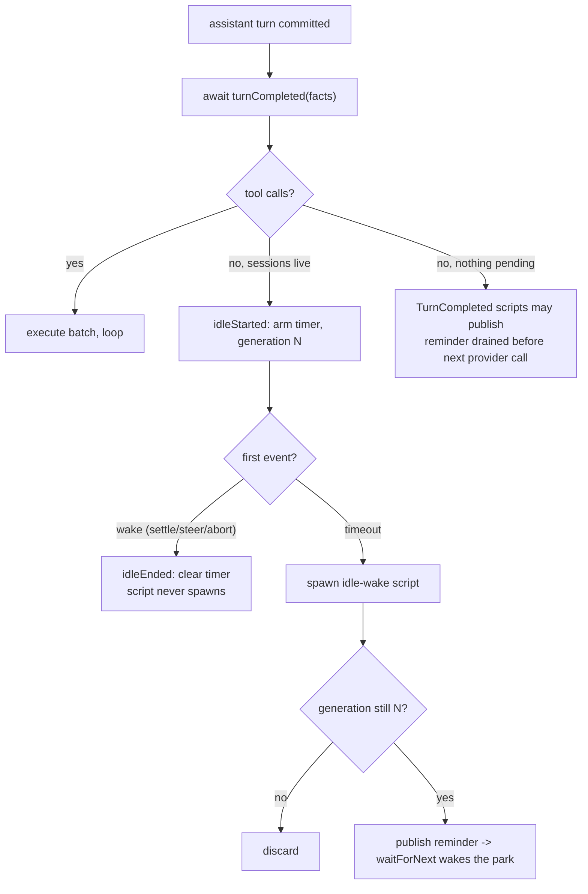

# EOS Agent Core Rust to TypeScript Migration - Phase 04.9 Notification Trigger Engine

Status: Proposed
Date: 2026-06-11
Owner: eos-agent-core
Note: the notification system was later extracted into `@eos/notifications`
(`packages/notifications/`): the inbox, the `LoopObserver` port, the
notification-rule schemas (`CommandScriptSchema`, owned by the package, not
shared with tool hooks), and the trigger engine live there; the spawn-backed
`runTriggerCommand` stays in `@eos/tool` and the rules loader in the runtime's
`notification-rules-config.ts`. Paths below were updated to match.
Depends on: Phase 03 (agent loop engine), Phase 04 (tool framework / hook
runner), Phase 04.5 (agent runtime), Phase 04.6 (agent runtime e2e baseline)

## 1. Intent

Give the agent loop a generic, operator-configurable notification trigger
system: rules that observe loop lifecycle facts and publish system
notifications into the run's `NotificationInbox`, with rule conditions and
message text owned by command scripts under
`.eos-agents/notification-rules/*.cjs`.

This phase adds:

- a `LoopObserver` port on `StartAgentRunInput` (engine),
- a `NotificationTriggerEngine` implementing that port (runtime),
- trigger rule entries in `.eos-agents/notification_rules.json`
  (`TurnCompleted`, `IdleParked` with `timeout_ms`), a sibling config to
  `hooks.json` with the same loading pattern, applied to every agent run,
- a narrow trigger script contract (`{ notification?: string }`),
- a `{type: "reminder"}` notification payload family,
- and three reference scripts:

| Script | Trigger | Purpose |
| --- | --- | --- |
| `remind-terminal-submission.cjs` | `TurnCompleted` | A no-tool-call turn with no background sessions and no pending steers gets a reminder naming the run's terminal tool. |
| `budget-reminder.cjs` | `TurnCompleted` | When the turn count hits a percentage of `max_turns` (argv, default 80), remind the model to wrap up and submit; one registered rule per percentage forms a ladder (the baseline registers 50 and 80). |
| `idle-wake.cjs` | `IdleParked` | A park that outlives `timeout_ms` gets a reminder listing the running sessions; the publish itself wakes the park. |

Triggers are notification-only. Scripts inform; the model acts. No trigger
may cancel sessions, rewrite state, or deny anything.

## 2. Current Evidence

The seam is anticipated but absent:

| Surface | Current behavior |
| --- | --- |
| `packages/engine/src/agent-loop.ts` | The loop doc comment defers exactly this: "the engine appends no reminder on a text turn - that nudge is a future notification rule." A bare-text turn with no live sessions loops with an unchanged conversation until `max_turns` fails the run. |
| `packages/notifications/src/inbox.ts` | The inbox doc comment anticipates new publishers: "trigger rules and agent-to-agent messages later, with no inbox change." Publishers today: `BackgroundSupervisor` (`session_settled`) and the loop's hook-context publisher. |
| `packages/tool/src/hooks/protocol.ts` | `HookEventSchema` is strictly tool-scoped: `PreToolUse`, `PostToolUse`, `PostToolUseFailure`. A bare-text turn has no tool call, so no existing hook can observe any of this phase's triggers. |
| `packages/engine/src/agent-loop.ts` `waitForWake` | The park races the steer queue against `inbox.waitForNext`; any publish wakes it. A trigger publish needs no park changes. |
| `packages/agent-runtime/e2e/auto-wait.e2e.ts` | The trigger-off baseline is already pinned live: park with zero provider calls across a measured window, working-while-session-runs, and the bare-text spin to `failed: max_turns` with exactly one user message. |

## 3. Design Decisions

1. **Triggers are loop-lifecycle rules, not tool hooks.** The facts they need
   (turn shape, turn count, park entry) are visible only inside
   `runAgentLoop`. The engine announces those facts through one port; it
   never reads config, spawns processes, or owns timers.

2. **The port is `LoopObserver`; the implementation is
   `NotificationTriggerEngine`.** The engine defines the interface on
   `StartAgentRunInput`; the runtime implements it and passes it in, the same
   dependency direction as `ToolExecutor`. An absent observer means today's
   behavior exactly.

3. **`turnCompleted` is awaited, on every assistant turn.** Including turns
   with tool calls and batches - the budget rule must see every turn number.
   Awaiting is what guarantees a reminder lands in the inbox before the next
   provider call; without it the spin case wastes one extra turn per
   reminder. With no matching rules the host resolves immediately.

4. **`idleStarted`/`idleEnded` bracket the park; timers live in the host.**
   The engine stays clock-free (its unit tests stay deterministic). The host
   arms one `setTimeout` per park entry and clears it on any wake. A timer
   that fires publishes through the inbox, so the park wakes through the
   same `waitForNext` path as a `session_settled` - `waitForWake` is not
   modified.

5. **One shot per park, re-armed on re-park.** No repeat flag. A model that
   answers a wake with bare text while sessions are still live re-parks,
   which re-arms the timer; escalation emerges from the park/re-park cycle.

6. **A generation counter makes timer fires atomic per park epoch.** Script
   spawn takes time; a natural wake can land mid-spawn. `idleStarted` and
   `idleEnded` both bump the generation; a fire whose generation no longer
   matches is discarded, never published into a later phase of the run.

7. **Own script contract, not `HookOutputSchema`.** Trigger scripts answer
   `{ notification?: string }`; empty stdout or `{}` means skip. `decision`
   and `updatedInput` are meaningless here and must not be accepted.

8. **The observer contract is "never throws, never rejects."** The trigger
   engine catches script failures (spawn errors, bad JSON, schema
   mismatches), logs them, and drops the firing. The loop adds no defensive
   branch, matching the inbox's `onDrained` precedent.

9. **Steer priority is preserved for free.** Reminders are ordinary inbox
   entries; the loop drains steers first, notifications second, unchanged.

10. **Reference scripts ship registered in the repo baseline
    `.eos-agents/notification_rules.json`, applied to every agent run.**
    Test suites never customize rules: every runtime fixture loads the repo
    baseline, exactly like production. The two consequences are accepted:
    the live spin-to-`max_turns` scenario is no longer reachable through
    the runtime (the rescue rule completes it - that IS the feature), so
    the raw spin stays pinned at the engine unit level; and live scenarios
    are written so their turn shapes keep unrelated rules silent (tool-call
    turns for the budget scenario, parks under 60s where idle-wake must not
    speak).

## 4. Engine Port

`packages/notifications/src/loop-observer.ts` (the engine imports the port):

```ts
/**
 * Loop facts announced to the runtime after each committed assistant
 * turn; in-process camelCase. Two axes: the SHAPE of the turn that just
 * committed (`toolCalls`, `liveSessions`, `hasPendingSteers`) and the
 * run's BUDGET position (`turn`, `maxTurns`).
 */
export interface TurnFacts {
  /** Budget axis: 1-based number of the turn that just committed. */
  turn: number;
  /** Budget axis: the run's fixed turn budget (profile `max_turns`). */
  maxTurns: number;
  /** Shape axis: `tool_use` blocks in this turn; 0 means bare text. */
  toolCalls: number;
  /** Shape axis: running background sessions at this boundary. */
  liveSessions: number;
  /** Shape axis: a user steer is already queued at this boundary. */
  hasPendingSteers: boolean;
}

/**
 * The loop's announcement port. Implementations must never throw or
 * reject; the loop adds no defensive handling around these calls.
 */
export interface LoopObserver {
  /** Awaited after every committed assistant turn, before any branch. */
  turnCompleted(facts: TurnFacts): Promise<void>;
  /** The loop is entering auto-wait. */
  idleStarted(): void;
  /** The park woke (settlement, steer, abort) or the run is finishing. */
  idleEnded(): void;
}
```

One facts object serves both rule families; each script slices its axis and
ignores the other:

| Fields | Axis | Read by |
| --- | --- | --- |
| `toolCalls`, `liveSessions`, `hasPendingSteers` | shape of this turn | `remind-terminal-submission.cjs`: `tool_calls === 0 && live_sessions === 0 && !has_pending_steers` |
| `turn`, `maxTurns` | run budget position | `budget-reminder.cjs`: `turn === ceil(max_turns * 0.8)` |

`StartAgentRunInput` and `AgentLoopContext` gain `observer?: LoopObserver`.

Loop placement - the entire engine diff:

```ts
const calls = toolUses(turn.message);
await ctx.observer?.turnCompleted({
  turn: turns,
  maxTurns: ctx.maxTurns,
  toolCalls: calls.length,
  liveSessions: ctx.background?.liveCount() ?? 0,
  hasPendingSteers: handle.hasPendingSteers(),
});
if (calls.length === 0) {
  if (!handle.hasPendingSteers() && (ctx.background?.liveCount() ?? 0) > 0) {
    ctx.observer?.idleStarted();
    try {
      await waitForWake(ctx);
    } finally {
      ctx.observer?.idleEnded();
    }
  }
  continue;
}
```

A published reminder is drained at the next loop top, so:

- spin case: the reminder is in the very next provider call,
- park case: the publish wakes the park and is drained on resume,
- tool-call case: the reminder is drained after the batch, at the boundary.

## 5. Trigger Rule Config

Trigger rules live in `.eos-agents/notification_rules.json`, a sibling of
`hooks.json` sharing its command shape and loading pattern (missing file =
no rules, malformed = loud startup error, command `cwd` defaults to the
repo root for a `.eos-agents` config). The inner key is `rules`, not
`hooks`, to keep notification rules visually distinct from tool hooks. The
schema is owned by `@eos/notifications` (`CommandScriptSchema` is the
package's own command shape, look-alike to but independent of the tool
layer's hook command schema):

```ts
const TriggerRuleMatchers = {
  /** Exact profile name; absent matches all agents. */
  agent_name: z.string().min(1).optional(),
  /** Profile kind; absent matches all kinds. Present with `agent_name`: AND. */
  agent_kind: AgentKindSchema.optional(),
};

export const TriggerRuleEntrySchema = z.discriminatedUnion("event", [
  z.object({
    event: z.literal("TurnCompleted"),
    ...TriggerRuleMatchers,
    rules: z.array(CommandScriptSchema).min(1),
  }),
  z.object({
    event: z.literal("IdleParked"),
    ...TriggerRuleMatchers,
    /** Park lifetime before the rule fires; one shot per park entry. */
    timeout_ms: z.number().int().positive(),
    rules: z.array(CommandScriptSchema).min(1),
  }),
]);
```

`loadNotificationRules` parses the file as `TriggerRuleEntry[]`; at
`startRun` the runtime narrows the list per run with
`triggerRuleAppliesTo(rule, { agent_name, agent_kind })` before handing it
to that run's `NotificationTriggerEngine`. `loadHookConfig` stays
tool-events-only. Script parameters ride the command line, so one script
serves many rules. The repo baseline (matcher-free: it applies to every
agent):

```json
[
  { "event": "TurnCompleted",
    "rules": [{ "type": "command", "command": "node .eos-agents/notification-rules/remind-terminal-submission.cjs" }] },
  { "event": "TurnCompleted",
    "rules": [{ "type": "command", "command": "node .eos-agents/notification-rules/budget-reminder.cjs 50" }] },
  { "event": "TurnCompleted",
    "rules": [{ "type": "command", "command": "node .eos-agents/notification-rules/budget-reminder.cjs 80" }] },
  { "event": "IdleParked", "timeout_ms": 60000,
    "rules": [{ "type": "command", "command": "node .eos-agents/notification-rules/idle-wake.cjs" }] }
]
```

## 6. Trigger Script Contract

Serialized payload (snake_case; crosses the process boundary):

```ts
export interface TriggerPayload {
  /** Config subscribes to "IdleParked"; the occurrence is "IdleTimeout". */
  event: "TurnCompleted" | "IdleTimeout";
  facts: TurnCompletedFacts | IdleTimeoutFacts;
  run: AgentRunSnapshot;
  /** From the profile; scripts never hardcode submit_* names. */
  terminal_tool: string;
  /** Running plus settled-but-undelivered, as in tool hook payloads. */
  background_sessions: readonly HookBackgroundSession[];
}

/** Serialized mirror of `TurnFacts`; same two axes (section 4). */
export interface TurnCompletedFacts {
  /** Budget axis. */
  turn: number;
  /** Budget axis. */
  max_turns: number;
  /** Shape axis; 0 means bare text. */
  tool_calls: number;
  /** Shape axis. */
  live_sessions: number;
  /** Shape axis. */
  has_pending_steers: boolean;
}

export interface IdleTimeoutFacts {
  idle_elapsed_ms: number;
  timeout_ms: number;
}
```

Output (validated; anything else is a logged, dropped failure):

```ts
export const TriggerOutputSchema = z.object({
  notification: z.string().min(1).optional(),
});
```

Empty stdout, `{}`, or an absent `notification` means skip. A returned
`notification` is published as:

```ts
inbox.publish(
  systemNotificationMessage({
    type: "reminder",
    source: payload.event, // "TurnCompleted" | "IdleTimeout"
    text: output.notification,
  }),
);
```

## 7. `NotificationTriggerEngine`

`packages/notifications/src/trigger-engine.ts`, created per run
in `startRun` beside the inbox and supervisor:

```ts
export class NotificationTriggerEngine implements LoopObserver {
  constructor(deps: {
    rules: readonly TriggerRuleEntry[];
    runCommand: TriggerCommandRunner; // @eos/tool's spawn-backed runTriggerCommand
    inbox: NotificationInbox;
    // Session list at fire time, not park time; the runtime projects its
    // supervisor so the package stays engine-free.
    listSessions: () => readonly BackgroundSessionSnapshot[];
    runSnapshot: () => AgentRunSnapshot;
    terminalTool: string;
  });

  async turnCompleted(facts: TurnFacts): Promise<void>;
  idleStarted(): void;
  idleEnded(): void;
}
```

Behavior:

- `turnCompleted`: for each `TurnCompleted` rule, build the payload, run the
  command, validate output, publish if a notification came back. No rules:
  return a resolved promise. All failures: log and drop.
- `idleStarted`: bump the generation; if an `IdleParked` rule exists, record
  the park start and arm `setTimeout(fire(generation), timeout_ms)`.
- `idleEnded`: bump the generation and clear the timer.
- `fire(generation)`: run the script with `idle_elapsed_ms` and the current
  session list; discard the answer if the generation moved during the spawn;
  otherwise publish - the publish is the wake.
- Run finish rides the loop's `finally`-guaranteed `idleEnded`; the engine
  holds no timer after the run ends.

The trigger lifecycle:



## 8. Reference Scripts

`.eos-agents/notification-rules/remind-terminal-submission.cjs` - the spin
rescue. The `live_sessions === 0` check is load-bearing: it is the same fact
the engine's park gate reads, so script and engine classify the turn
identically (sessions live: the engine parks and `idle-wake` owns it; none:
this script speaks).

```js
const fs = require("node:fs");
const p = JSON.parse(fs.readFileSync(0, "utf8"));
if (
  p.event === "TurnCompleted" &&
  p.facts.tool_calls === 0 &&
  p.facts.live_sessions === 0 &&
  !p.facts.has_pending_steers
) {
  process.stdout.write(JSON.stringify({
    notification:
      "You produced no tool call and have no background work. " +
      `To finish this run you must call your terminal tool ${p.terminal_tool}.`,
  }));
}
```

`.eos-agents/notification-rules/budget-reminder.cjs` - the percentage rides
the command line (default 80), so one script serves a whole reminder ladder
(one registered rule per percentage). Each rule is stateless once-per-run
via equality with its threshold turn, not `>=`; an invalid percent exits 1,
which the runner logs as a dropped firing:

```js
const fs = require("node:fs");

const raw = process.argv[2] ?? "80";
const percent = Number(raw);
if (!Number.isFinite(percent) || percent <= 0 || percent > 100) {
  process.stderr.write(`budget-reminder: invalid percent argument "${raw}"`);
  process.exit(1);
}

const p = JSON.parse(fs.readFileSync(0, "utf8"));
const threshold = Math.ceil(p.facts.max_turns * (percent / 100));
if (p.event === "TurnCompleted" && p.facts.turn === threshold) {
  process.stdout.write(JSON.stringify({
    notification:
      `Turn ${p.facts.turn} of ${p.facts.max_turns} (${String(percent)}% of budget). ` +
      `Wrap up and submit via ${p.terminal_tool}.`,
  }));
}
```

`.eos-agents/notification-rules/idle-wake.cjs` - unconditional output is
correct: being invoked at all proves the run is parked past the timeout.
The notification is the wake.

```js
const fs = require("node:fs");
const p = JSON.parse(fs.readFileSync(0, "utf8"));
const running = p.background_sessions.filter((s) => s.status === "running");
process.stdout.write(JSON.stringify({
  notification:
    `You have been waiting ${Math.round(p.facts.idle_elapsed_ms / 1000)}s ` +
    `for background work: ${running.map((s) => `${s.type}:${s.id}`).join(", ")}. ` +
    "Choose one: keep waiting (reply without tool calls), inspect with " +
    "list_background_sessions, or cancel with cancel_background_session and proceed.",
}));
```

## 9. Interaction Matrix

What one turn shape means across contexts, with triggers configured:

| Assistant turn | Live sessions | Pending steers | Engine | Trigger that speaks |
| --- | --- | --- | --- | --- |
| no tool calls | > 0 | no | parks; timer armed | `idle-wake`, only if the park outlives `timeout_ms` |
| no tool calls | 0 | no | loops immediately | `remind-terminal-submission`, drained before the next provider call |
| no tool calls | any | yes | loops; steer drains first | none - scripts see `has_pending_steers` and stay silent |
| tool calls / batch | - | - | executes batch | none for shape rules; `budget-reminder` still sees the turn number |

Advisory interplay: the terminal-submission reminder names the terminal tool
but does not instruct an immediate call, because Phase 04.8's
`require_advisory_pass` prehook denies protected terminals without an exact
advisor pass. Profile prose keeps owning the advisory choreography; the
reminder only points at the destination.

## 10. Implementation Plan

1. Add `LoopObserver`/`TurnFacts` to `@eos/notifications`; thread `observer` through
   `StartAgentRunInput` and `AgentLoopContext`; place the three calls in
   `runAgentLoop` as in section 4.
2. Engine unit tests: `turnCompleted` awaited on every turn shape (text,
   single call, batch) with exact facts; `idleStarted`/`idleEnded` bracket
   the park including the abort path; no observer means byte-identical
   behavior.
3. Add `TriggerRuleEntrySchema` to `@eos/notifications`;
   add `loadNotificationRules` over `.eos-agents/notification_rules.json`
   with the `loadHookConfig` mechanics (missing file, loud Zod errors, cwd
   defaulting); `loadHookConfig` stays tool-events-only.
4. Add `TriggerPayload`/`TriggerOutputSchema` and a command runner reusing
   the tool hook runner mechanics (spawn, JSON stdin/stdout, timeout).
5. Implement `NotificationTriggerEngine`; create it per run in `startRun`
   and pass it as the engine observer.
6. Unit tests for the trigger engine: rule matching, publish-on-answer,
   skip-on-empty, failure swallowing, timer arm/clear, generation guard
   (timer fire racing a wake), re-arm on re-park.
7. Ship the three reference scripts under `.eos-agents/notification-rules/`
   and register them in the repo baseline
   `.eos-agents/notification_rules.json` (the budget ladder at 50 and 80),
   applied to every agent run.
8. E2e over the repo baseline (suites never customize rules):
   - spin rescue: the drifter scenario completes instead of failing
     `max_turns`, and the drained reminder names the profile's terminal
     tool;
   - idle wake: a gate-held park outliving the baseline 60s `timeout_ms`
     wakes on the reminder, and the idle reminder is absent when the gate
     releases first;
   - budget ladder: a five-turn tool choreography carries exactly one 50%
     and one 80% reminder in `outcome.llm`.
9. Rebase `auto-wait.e2e.ts` on the registered baseline: the two park
   scenarios stay (their parks sit far below the idle timeout and the
   budget thresholds); the spin-to-`max_turns` leg is superseded by the
   rescue scenario, with the raw spin pinned in engine unit tests.
10. Run the verification ladder: `pnpm run typecheck`, `pnpm run lint`,
    `pnpm run test`, then the focused e2e files.

## 11. Acceptance Criteria

| ID | Criterion | Verification |
| --- | --- | --- |
| T1 | `runAgentLoop` awaits `turnCompleted` after every committed assistant turn, including batch turns, with exact facts. | `packages/engine/tests/agent-loop.test.ts` |
| T2 | `idleStarted`/`idleEnded` bracket every park, including abort wakes; no timer or clock exists in `@eos/engine`. | engine unit tests; source scan |
| T3 | Without an observer, loop behavior and existing tests are unchanged. | full engine suite |
| T4 | Trigger rules parse from `notification_rules.json` with the `hooks.json` mechanics; events in the wrong file fail startup loudly. | `hook-config` tests |
| T5 | A `TurnCompleted` script answer is published as `{type:"reminder", source:"TurnCompleted"}` and drained before the next provider call. | trigger engine unit test + spin-rescue e2e |
| T6 | An `IdleParked` timer fires only if the park outlives `timeout_ms`; a wake first means the script never spawns. | trigger engine unit tests |
| T7 | A timer fire that loses the race to a natural wake is discarded by the generation guard. | trigger engine unit test |
| T8 | Re-park re-arms the timer; repeated reminders emerge across park cycles without a repeat flag. | trigger engine unit test |
| T9 | Script failures (spawn error, bad JSON, schema mismatch) are logged and dropped; the run proceeds. | trigger engine unit tests |
| T10 | Spin rescue e2e: drifter + reminder rule completes via its terminal tool instead of failing `max_turns`. | `agent-runtime/e2e` |
| T11 | Reference scripts are registered in the repo baseline `notification_rules.json` and apply to every agent run; test suites load that baseline, never a customized rule set. | baseline file; fixture source; e2e suite |
| T12 | Full local gate stays green. | `pnpm run check`, focused e2e |

## 12. Open Questions

1. **Baseline registration.** Resolved: the three reference rules (with the
   budget ladder at 50 and 80) are registered in
   `.eos-agents/notification_rules.json` for every agent run, and the live
   suites were re-based on that reality (the runtime-level
   spin-to-`max_turns` shape no longer exists because the rescue rule
   completes it).
2. **Per-profile matchers.** Resolved: entries carry optional
   `agent_name`/`agent_kind` matchers (absent matches all, present fields
   AND), applied by the runtime at `startRun` so a non-matching run never
   spawns the rule's commands.
3. **Assistant text in the payload.** Shape rules currently see counts, not
   content. Exposing the turn's text would enable content-aware rules but
   widens the payload and invites prompt-coupling; deferred until a rule
   needs it.
4. **Multiple `IdleParked` entries.** This phase allows them (each arms its
   own timer). If that proves noisy, a later phase can restrict the config
   to one idle rule per file.
