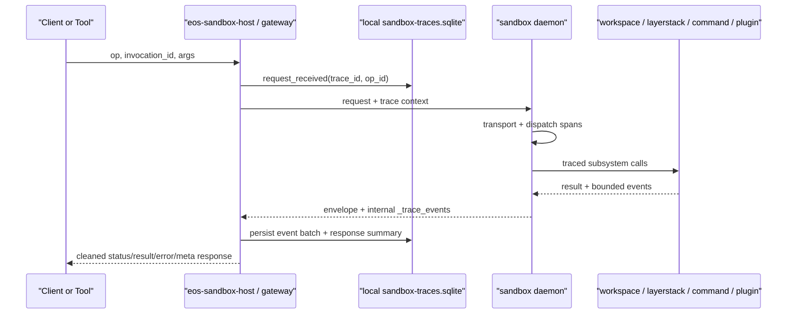

# Sandbox Event Tracing And Response Contract Plan

Status: Draft
Date: 2026-06-12
Owner: sandbox + eos-agent-core
Inputs:
- `docs/plans/agent-core-rust-to-typescript-migration/sandbox-response-observability-findings.md`
- Live scan of `sandbox/crates/eos-operation/src/core`
- Live scan of daemon dispatch, transport, host forwarding, command session, plugin, workspace, LayerStack, OCC, and e2e protocol helpers

## 1. Intent

Build one generic tracing and response model for every sandbox operation:

1. Event tracing: every operation is traceable through daemon protocol from
   host request, daemon dispatch, workspace route selection, subsystem work,
   resource samples, and final response. The trace must explain total time,
   resource usage, and modules touched.
2. User-facing response: stop using raw top-level JSON blobs as the result
   delivery shape. Separate operation payload from delivery status, trace
   metadata, timings, resources, and errors.

The trace store is local to the user's computer. It is not stored inside the
sandbox container, isolated workspace, overlay scratch, command transcript
folder, or plugin working directory.

## 2. Current Facts

| Area | Current implementation | Problem for this goal |
| --- | --- | --- |
| Response core | `OpResponse::{Success(Value), Refused(OpError), Error(OpResponseError)}` in `eos-operation/src/core/response.rs` | Success payloads are untyped raw JSON. Metadata, domain result, and operation status compete at the same top level. |
| Timing injection | `eos-daemon/src/dispatch/dispatcher.rs` mutates object responses and inserts `timings.runtime.*` | Dispatch is the right choke point, but it only updates response JSON and does not create a durable event chain. |
| Wire request identity | `Request { op, invocation_id, args }` in `eos-daemon/src/wire/message.rs`; host also duplicates `args.invocation_id` | `invocation_id` is the right initial `op_id`, but response correlation is mostly absent. Top-level identity must become canonical. |
| Host forwarding | `eos-sandbox-host` forwards daemon responses and treats any response except `success:false` as success | The host is the right local persistence boundary, but it currently has no trace database or response declassification step. |
| Existing audit | Active Rust sandbox has response-visible mutation/timing fields and transient command finals; older audit ring and `audit_jsonl_path` are historical | There is no active durable Rust audit sink to reuse. |
| Workspace state | Current live split is ephemeral one-op transactions vs caller-keyed isolated workspaces | Trace taxonomy must describe route choice without turning `workspace_mode` into runtime control flow again. |
| TypeScript state | `eos-agent-core/packages/db` already uses `better-sqlite3` + `Kysely`; run audit writes JSONL beside transcripts | The TS side already has a local SQL pattern. Sandbox traces should align with it instead of inventing a second long-term store model. |

## 3. Storage Decision

Use SQLite as the primary durable trace store. Keep JSONL only as an optional
export/debug format, not the system of record.

| Option | Fit | Decision |
| --- | --- | --- |
| Plain text or JSONL files | Excellent append-only crash evidence, easy to inspect, matches run audit logs | Weak for queries like "find all failed plugin overlay ops touching isolated workspace last week"; needs a separate index once the audit goal becomes useful. |
| SQLite | Local file, durable, queryable by trace/op/module/status/time/resource, works from Rust (`rusqlite`) and TypeScript (`better-sqlite3` + `Kysely`) | Best fit. Use one local database under the host/runtime data directory. |

Recommended locations:

| Runtime phase | Location |
| --- | --- |
| Current Rust sandbox host | `eos-sandbox-host` `state_dir` owns `sandbox-traces.sqlite` with `0600` file permissions and parent `0700`. |
| TypeScript `eos-agent-core` target | `@eos/db` owns the same logical schema under `<dataDir>/sandbox-traces.sqlite`, using `better-sqlite3` + `Kysely`. |
| Export/debug | Optional derived `trace-<trace_id>.jsonl` export command, rebuilt from SQLite. |

Persistence rule: once tracing is enabled, the host records the request-start
event before forwarding a mutating operation. If that write fails, the host must
not execute the mutating op. After forwarding, daemon event-batch persistence
failures are recorded as degraded trace state because the operation may already
have happened.

## 4. Trace Model

Use three identity levels:

| Identity | Source | Meaning |
| --- | --- | --- |
| `trace_id` | Host minted if absent; propagated through daemon protocol | Correlates one user-visible sandbox call or a long-lived command/session chain. |
| `op_id` | Existing top-level `invocation_id` | One daemon request-response operation. |
| `span_id` | Minted by host/daemon per span | One timed unit inside the operation, parented into a tree. |

Long-lived resources get their own link ids:

| Link id | Why |
| --- | --- |
| `command_session_id` | A running command returns before final settlement; later stdin/poll/collect/cancel ops must link back. |
| `workspace_handle_id` | Isolated workspace enter/status/exit and private operations must link to the same lifecycle. |
| `plugin_service_instance_id` | Plugin ensure/status/PPC/overlay events need stable service correlation. |
| `layer_manifest_version` | LayerStack/OCC events should identify the snapshot or published layer they touched. |

### Workspace Route Taxonomy

Do not use response `workspace_mode` as a control-flow primitive. Record a trace
field named `workspace_route.kind`:

| Route kind | Meaning |
| --- | --- |
| `ephemeral_workspace` | One-op ephemeral workspace or overlay route with publish/capture/OCC semantics. |
| `isolated_workspace` | Caller-keyed isolated workspace route, private upperdir, no publish unless a later explicit flow does it. |
| `skip` | No workspace execution route. Used for control, metrics, readiness, host bookkeeping, and LayerStack fast paths that do not enter a workspace. Include `skip_reason`. |

## 5. Event Taxonomy

The base category comes from the existing operation catalog:
`served_by`, `family`, `visibility`, and `mutates_state`.

Subsystem events use a stable phase vocabulary:

| Module | Required events |
| --- | --- |
| `host.protocol` | request_received, request_persisted, forward_started, forward_finished, response_missing, uncertain_outcome |
| `daemon.transport` | read_started, read_finished, auth_checked, decoded, response_written |
| `daemon.dispatch` | dispatch_started, op_resolved, parse_finished, plugin_fallback_checked, dispatch_finished |
| `workspace.route` | route_selected with `ephemeral_workspace`, `isolated_workspace`, or `skip` |
| `layerstack` | binding_loaded, snapshot_acquired, lease_released, manifest_read, auto_squash_started, auto_squash_finished |
| `overlay` | workspace_prepared, mount_started, mount_finished, capture_started, capture_finished, unmount_finished |
| `occ` | commit_started, validate_groups_finished, publish_layer_finished, conflict_detected, commit_finished |
| `command_session` | prepared, spawned, yielded, stdin_written, progress_read, cancelled, timed_out, reaped, settled, final_persisted |
| `isolated_workspace` | enter_started, holder_started, network_configured, status_read, exit_started, teardown_phase_finished, exited |
| `plugin` | ensure_started, package_checked, service_started, service_health_checked, ppc_message_sent, ppc_message_received, overlay_started, overlay_finished |
| `file` | read_started, read_finished, mutation_started, edit_applied, write_applied |
| `message` | daemon_request, daemon_response, plugin_ppc_request, plugin_ppc_response, callback_request, callback_response |
| `resource` | resource_sampled with cgroup/process/tree/layer counters |

Event payloads must stay bounded. Do not store raw command stdout/stderr, full
file contents, plugin result blobs, or provider-like deltas in trace events by
default. Store sizes, hashes, path counts, status, and references to the owning
response/transcript when content already exists elsewhere.

## 6. SQLite Schema

Start with a compact schema that supports the audit questions without storing
large payloads in many places:

| Table | Purpose |
| --- | --- |
| `sandbox_trace_ops` | One row per daemon op: `trace_id`, `op_id`, `op`, `family`, `sandbox_id`, `caller_id`, `workspace_route_kind`, `status`, start/end timestamps, total duration, response status, response digest. |
| `sandbox_trace_spans` | Timed span tree: `span_id`, `trace_id`, `op_id`, `parent_span_id`, `module`, `phase`, status, start/end timestamps, duration. |
| `sandbox_trace_events` | Instant events or span annotations: `event_id`, `seq`, `trace_id`, `op_id`, `span_id`, `module`, `event`, `level`, timestamp, bounded JSON details. |
| `sandbox_trace_resources` | Resource samples and deltas: CPU, memory, disk I/O, tree stats, layer depth, path count, keyed by `trace_id`, `op_id`, and optional `span_id`. |
| `sandbox_trace_modules` | Aggregated modules touched per op for fast filtering. |
| `sandbox_trace_links` | Cross-op links such as command session, isolated workspace handle, plugin service instance, manifest version, and parent message id. |

The full response is not duplicated in the trace DB. Store a digest plus a
small response summary. The cleaned user response carries a `meta.trace`
pointer that can retrieve the event chain from the local store.

## 7. Daemon Protocol Shape

Add trace context as envelope metadata, not operation payload.

```json
{
  "op": "sandbox.command.exec",
  "invocation_id": "op_123",
  "trace": {
    "trace_id": "tr_abc",
    "parent_span_id": null
  },
  "args": {
    "cmd": "make test",
    "caller_id": "run_1",
    "layer_stack_root": "/eos/layerstack"
  }
}
```

Daemon-to-host responses may include an internal sidecar event batch:

```json
{
  "status": "ok",
  "meta": {
    "op": "sandbox.command.exec",
    "op_id": "op_123",
    "trace": {
      "trace_id": "tr_abc",
      "root_span_id": "sp_root",
      "event_count": 18
    }
  },
  "result": {},
  "_trace_events": []
}
```

`_trace_events` is daemon-to-host only. The host/gateway writes it into SQLite
and strips it before returning the user-facing response. Direct low-level daemon
clients may opt into seeing it for contract tests.

For background command sessions, the initial `sandbox.command.exec` response
gets its own op trace and also returns a `command_session_id` link. Later
`write_stdin`, `poll`, `collect_completed`, and `cancel` calls each have their
own op trace and link to the same command session chain.

## 8. User-Facing Response Contract

Target shape:

```json
{
  "status": "ok",
  "result": {},
  "error": null,
  "meta": {
    "protocol_version": 2,
    "op": "sandbox.file.write",
    "op_id": "op_123",
    "caller_id": "run_1",
    "sandbox_id": "sb_1",
    "trace": {
      "trace_id": "tr_abc",
      "root_span_id": "sp_root",
      "store": "local_sqlite",
      "event_count": 12
    },
    "workspace_route": {
      "kind": "ephemeral_workspace"
    },
    "duration_ms": 42,
    "modules_touched": ["daemon.dispatch", "layerstack", "occ"],
    "resource_summary": {
      "changed_path_count": 1,
      "layer_stack_manifest_depth": 3
    },
    "warnings": []
  }
}
```

`status` is the single top-level outcome:

| Status | Meaning |
| --- | --- |
| `ok` | Operation completed successfully. |
| `running` | Operation accepted and continues through a linked resource such as a command session. |
| `rejected` | Domain-level rejection such as OCC conflict or policy refusal with expected caller action. |
| `cancelled` | Operation or linked session was cancelled. |
| `timed_out` | Operation or linked session timed out. |
| `error` | Transport, parse, internal, or unexpected failure. |

`result` contains only the domain payload:

| Operation family | Result shape direction |
| --- | --- |
| Files | `{ "file": { ... } }` for reads; `{ "mutation": { status, published, changed_paths, changed_path_kinds, conflict } }` for writes/edits. |
| Command session | `{ "command": { status, exit_code, output, command_session_id }, "mutation": ... }` when settled. Running responses omit mutation and use `status: "running"`. |
| Checkpoint | `{ "checkpoint": { ... } }`, keeping layer metrics as domain data, not top-level timings. |
| Isolated workspace | `{ "isolated_workspace": { open, workspace_handle_id, workspace_root, inspection } }`. |
| Plugin | `{ "plugin": { ... }, "overlay": ... }`; plugin worker result stays under `result.plugin`, not top-level. |
| Control/workspace-run | Narrow typed objects with counts, readiness, heartbeat, or cancelled resources. |

`error` is the only error channel:

```json
{
  "status": "error",
  "result": null,
  "error": {
    "kind": "invalid_request",
    "message": "cmd is required",
    "details": {}
  },
  "meta": { "...": "..." }
}
```

Compatibility: keep `success` only in a temporary protocol-v1 flattening adapter.
Do not let new code branch on `success`, top-level `workspace`, or flat
`timings`. Delete the adapter after host, gateway, e2e helpers, and TS sandbox
tools consume protocol v2.

## 9. Ownership Map

| Owner | Responsibility |
| --- | --- |
| New Rust crate `eos-sandbox-trace` | Storage-neutral trace DTOs: `TraceContext`, `TraceEvent`, `TraceSpan`, `TraceSink`, `NoopTraceSink`, `WorkspaceRouteKind`, schema version, bounded JSON helpers. |
| `eos-operation` | Public response envelope DTOs and per-family result DTOs. It owns contract shape, not persistence. |
| `eos-daemon` | Dispatch context propagation, span/event emission, subsystem trace stubs, response stamping, daemon-side internal `_trace_events` batch. |
| `eos-sandbox-host` | Host-local SQLite persistence, request-start event before forwarding, response event-batch ingestion, degraded/uncertain outcome records. |
| `eos-sandbox-gateway` | Client-facing declassification: strip daemon-only `_trace_events`, return cleaned envelope, expose host trace lookup only on operator/debug surfaces. |
| Mechanism crates | Accept optional trace context or return typed timing facts. Avoid depending on host persistence or gateway policy. |
| `@eos/db` | TypeScript mirror of the SQLite schema and migrations once the TS sandbox host owns this path. |
| `@eos/contracts` | Shared TypeScript response/trace ID schemas only when TS tools consume the new response shape. |

Third-party Rust libraries:

| Library | Use |
| --- | --- |
| `rusqlite` | Current Rust host-local SQLite persistence. |
| `tracing` | Optional structured span/event facade inside Rust crates. Use stable field names and a custom layer that emits `TraceEvent`; do not make raw `tracing` logs the audit schema. |
| `tracing-subscriber` | Optional local debug output and custom layer wiring. |
| OpenTelemetry crates | Future exporter only. OTel complements the durable local SQLite audit store; it is not the source of truth. |

## 10. Implementation Phases

### Phase A: Contracts First

1. Add `eos-sandbox-trace` with storage-neutral IDs, DTOs, route kinds, module
   names, and bounded detail helpers.
2. Add `OperationEnvelope<T>`, `OperationStatus`, `ResponseMeta`, `TraceRef`,
   `OperationError`, and per-family result wrappers in `eos-operation`.
3. Add serialization tests for envelope shape and v1 flattening.

Verification:
- `cargo metadata --no-deps` in `sandbox/`
- `cargo test -p eos-operation --all-targets`

### Phase B: Host Store

1. Add `sandbox-traces.sqlite` migration and writer in `eos-sandbox-host`.
2. Record request-start before daemon forwarding.
3. Record response, response-missing, and `uncertain_outcome` paths.
4. Add operator/debug lookup helpers by `trace_id`, `op_id`, and linked
   `command_session_id`.

Verification:
- `cargo test -p eos-sandbox-host --all-targets`
- Host unit tests that mutating ops do not forward when request-start
  persistence fails.

### Phase C: Daemon Propagation And Stub Events

1. Extend daemon `Request` and host request encoding with optional `trace`.
2. Carry `TraceContext` and a per-op event collector through `DispatchContext`.
3. Emit mandatory dispatcher events for every op, including parse failures,
   plugin fallback, and unknown-op errors.
4. Attach `meta.trace` and internal `_trace_events` at `finalize_response`.

Verification:
- `cargo test -p eos-daemon --all-targets`
- Wire-message tests for request trace metadata and response trace refs.

### Phase D: Subsystem Events

Instrument the stubs with bounded facts:

1. Workspace route selection: `ephemeral_workspace`, `isolated_workspace`, or
   `skip`.
2. LayerStack, snapshot, lease, auto-squash, OCC commit, and conflict events.
3. Overlay prepare/mount/capture events.
4. Command session prepare/spawn/yield/stdin/progress/cancel/reap/settle
   events.
5. Isolated enter/status/exit/teardown phase events.
6. Plugin ensure/status/PPC/overlay/callback events.
7. Resource samples using existing cgroup/process/tree/layer metrics.

Verification:
- Focused crate tests for each touched mechanism crate.
- `cargo test -p eos-e2e-test --features e2e --test core`
- `cargo test -p eos-e2e-test --features e2e --test daemon`
- Focused live suites for command session, isolated workspace, plugin, and
  LayerStack.

### Phase E: Response Migration

1. Migrate low-risk responses first: runtime ready, heartbeat/cancel/count,
   checkpoint metrics, workspace-run cleanup.
2. Migrate file read/write/edit.
3. Migrate isolated workspace lifecycle.
4. Migrate command session responses.
5. Migrate plugin ensure/status and plugin overlay last.
6. Remove top-level metadata splices from command/plugin response builders.
7. Delete the v1 flattening adapter once all clients consume protocol v2.

Verification:
- `cargo test -p eos-operation --all-targets`
- `cargo test -p eos-daemon --all-targets`
- `cargo test -p eos-sandbox-gateway --all-targets`
- Update e2e assertions from top-level `timings`, `workspace`, and `success`
  to `meta`, `status`, and `result`.

### Phase F: TypeScript Mirror

1. Add trace tables to `@eos/db` migrations or a sibling sandbox trace database
   factory.
2. Add Zod schemas for trace refs and operation envelopes in `@eos/contracts`.
3. Bind sandbox tool responses to the new `status/result/error/meta` contract.
4. Preserve the existing run audit JSONL files. They are run lifecycle audit;
   sandbox trace SQLite is operation/subsystem audit.

Verification:
- In `eos-agent-core/`: `pnpm run typecheck`, `pnpm run lint`, `pnpm run test`
- `pnpm run check` when the TS sandbox tool family consumes the response
  contract.

## 11. End-To-End Flow



## 12. Non-Goals

- Do not store trace data inside isolated workspaces, overlays, command scratch,
  plugin package roots, or the sandbox container as the durable source.
- Do not persist raw stdout/stderr, full file contents, or large plugin payloads
  in trace events by default.
- Do not revive historical `api.audit.*` as the primary contract.
- Do not make OpenTelemetry replace durable local audit storage.
- Do not let `workspace_mode` become runtime branching again. Use trace-only
  `workspace_route.kind`.

## 13. Open Decisions

| Decision | Recommendation |
| --- | --- |
| Strictness when trace DB is unavailable | Fail before forwarding mutating ops; allow read-only ops only if response metadata marks trace persistence as degraded. |
| Event batch transport | Start with daemon response sidecar `_trace_events`; add streaming/drain only if background command/event volume requires it. |
| Trace store path naming | Rust: host `state_dir/sandbox-traces.sqlite`; TS: `<dataDir>/sandbox-traces.sqlite`. |
| Public trace lookup | Operator/debug API only at first. User-facing responses carry trace refs, not full audit chains. |
| Protocol compatibility | Add protocol v2 envelope and a short-lived v1 flattening adapter. Delete the adapter after client migration. |
