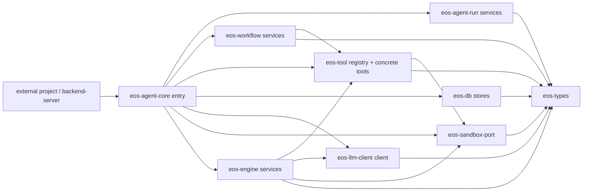

# Agent-Core Workspace Architecture Rules - Index

Status: Phase 05 implemented; Phase 04 closeout and Phase 06 draft remain tracked
Date: 2026-06-09
Owner: agent-core workspace

## Purpose

This plan defines the destructive cleanup target for `agent-core`. The goal is a
smaller Rust workspace whose crate and file names show ownership without
historical explanation.

The cleanup is intentionally aggressive:

- remove misleading `port` vocabulary except for `eos-sandbox-port`,
- reserve `api` for external contract language, not crate/module names,
- reserve `service` for owner-crate surfaces consumed by sibling crates,
- remove `composition` and `deps` as folder/type vocabulary,
- remove vague bucket folders such as `common`, `helpers`, `shared`, and
  `utils`,
- fold request runtime wiring into `eos-agent-core`,
- fold generic config, agent definitions, and audit wiring into their real
  owners,
- collapse shallow one-file-per-command module trees,
- avoid separate tool `catalog.rs`, tool `executor.rs`, and tool `handles.rs`
  splits unless the final code proves they remove real complexity,
- keep `eos-engine` execution-only,
- keep concrete model-callable tools in `eos-tool`,
- reduce the class inventory from 291 modules to 150-170 modules.

## Current Inventory

Source: `agent-core/docs/class-inventory/html/assets/inventory.json`

| Metric | Current | Target |
| --- | ---: | ---: |
| Crates | 18 | 10 |
| Modules | 291 | 150-170 |
| Items | 1701 | lower after crate, module, and compatibility collapse |
| Methods | 987 | lower after service/resource split collapse |

Current high-module crates:

| Crate | Current modules | Target direction |
| --- | ---: | --- |
| `eos-tools` | 51 | collapse tiny tool files; rename to lean `eos-tool` |
| `eos-engine` | 33 | execution only; no tool ownership or service subfolder |
| `eos-types` | 28 | passive contracts only; no generic config dumping |
| `eos-sandbox-port` | 23 | allowed port boundary; keep focused |
| `eos-workflow` | 23 | workflow domain with one sibling-facing `services.rs` |
| `eos-runtime` | 21 | fold into private `eos-agent-core/runtime/` |

## Vocabulary Rules

| Word | Meaning | Allowed use |
| --- | --- | --- |
| `api` | external-project-facing contract language | docs and public contract descriptions only |
| `service` | public owner-crate callable surface used by at least one sibling crate | behavior-owning crates with sibling consumers |
| `runtime` | hidden request-running wiring inside `eos-agent-core` | `eos-agent-core/src/runtime.rs` and `runtime/` |
| `handles` | grouped concrete resources with lifecycle | private runtime internals; avoid standalone handle files unless needed |
| `catalog` | loaded definitions with lifecycle | agents and plugins; tool defaults stay in `registry.rs` |
| `context` | per-call facts, not resource wiring | immutable call/run facts |
| `model` | DTOs, enums, typed IDs, request/response values | any crate |
| `stores` | persistence contracts or DB-backed state access | `eos-types`, `eos-db`, owning domain crates |
| `client` | outbound external provider client | `eos-llm-client` |
| `port` | true external infrastructure boundary | only `eos-sandbox-port` |

Forbidden vocabulary:

```text
composition
deps
runtime_services
```

Strict service rule:

```text
A file, module, trait, or type may be named service only if:
1. it is part of the owning crate's public or intentionally exported surface, and
2. at least one different workspace crate imports or calls it.

If both are not true, rename it to the canonical replacement that matches the
ownership semantics: runtime, handles, context, client, or records.
```

Canonical service replacements:

| Private use | Replacement |
| --- | --- |
| local object graph or executable wiring | `Runtime` |
| owned long-lived resources | `Handles` |
| per-call immutable facts | `Context` |
| outbound external provider | `Client` |
| persisted record surface | `Records` |

The guard's automatic service failure message suggests only these five words.
Other domain names, such as `registry.rs` or `printer.rs`, remain valid only
when a phase spec assigns that module ownership directly; they are not generic
fallbacks for private `Service` names.

## Structure Guardrails

| Area | Rule |
| --- | --- |
| crate roots | keep `lib.rs`, `main.rs`, and root `mod.rs` under 200 nonblank lines |
| test placement | keep test modules under each crate's `tests/` tree, not `src/**/tests.rs` or `src/**/tests/` |
| module shape | do not use both `foo.rs` and `foo/mod.rs` for the same module |
| `mod.rs` routing | final target crates avoid nested `mod.rs` routing |
| vague folders | final target crates do not use `common`, `helpers`, `shared`, or `utils` |
| architecture folders | final target crates do not use exact folder names `api`, `services`, `ports`, `composition`, `deps`, or `runtime_services` |
| public surface | crate roots export narrow `pub use` surfaces instead of broad `pub mod` trees |
| budget report | `module_budget.rs` reports module count, max source-folder depth, and root file LOC, but remains advisory |

Folder bans are exact-name checks. They do not ban owner-specific names such as
`tool_api` when a phase spec keeps that contract.

## Target Crate Map

```text
agent-core/crates/
├── eos-agent-core/       # request entry + hidden runtime composition root
├── eos-agent-run/        # agent-run lifecycle: spawn/wait/poll/cancel/finalize
├── eos-engine/           # execution loop, turns, events, records, background accounting
├── eos-tool/             # tool model, registry, hooks, concrete tools, skills
├── eos-workflow/         # workflow lifecycle and attempt/iteration domain
├── eos-types/            # passive shared contracts
├── eos-db/               # persistence implementations
├── eos-llm-client/       # outbound provider clients and provider DTOs
├── eos-sandbox-port/     # only allowed port crate
└── eos-testkit/          # dev-only test support
```

Retired or folded crates:

| Current crate | Target |
| --- | --- |
| `eos-runtime` | fold into private `eos-agent-core/src/runtime/` |
| `eos-agent-ports` | split into `eos-agent-core`, `eos-agent-run`, `eos-engine`, and `eos-types` |
| `eos-tool-ports` | fold into `eos-tool` |
| `eos-agent-message-records` | fold into `eos-engine::records` |
| `eos-tools` | rename/consolidate as singular `eos-tool` |
| `eos-agent-runner` | rename/consolidate as `eos-agent-run` |
| `eos-skills` | fold skill registry/package loading into `eos-tool` |
| `eos-plugin-catalog` | fold into private `eos-agent-core/runtime/plugins.rs` |
| `eos-agent-def` | passive DTOs go to `eos-types`; loader/validation goes to `eos-agent-core/src/agents.rs` |
| `eos-config` | config structs go to owning crates; pure frontmatter parser goes to `eos-types`; file loader goes to `eos-agent-core/runtime/config.rs` |
| `eos-audit` | fold runtime audit sink into `eos-agent-core/src/runtime/audit.rs` |

## Target Architecture



Rules behind the graph:

- `eos-agent-core` owns request entry and hidden runtime composition wiring.
- `eos-agent-run` owns lifecycle rows and final outcome handoff. It consumes the
  `AgentLoopLauncher` contract from `eos-types`; `eos-agent-core` wires the
  concrete `eos-engine` launcher.
- `eos-engine` owns the loop, turns, event emission, record writing, and
  midflight printing.
- `eos-tool` owns the tool framework, concrete model-callable tools, and skills.
- `eos-workflow` owns workflow lifecycle and workflow state transitions. It has
  no crate edge to `eos-agent-run`; run spawning crosses the `AgentRunApi`
  contract from `eos-types`, and `eos-agent-core` wires the concrete run
  lifecycle.
- `eos-llm-client` owns outbound provider clients; it does not need a
  `services.rs` module, and neutral transcript DTOs shared by lower crates live
  in `eos-types`.
- Config structs live with their owner: provider config in `eos-llm-client`,
  agent profiles in `eos-agent-core`, workflow config in `eos-workflow`, DB
  config in `eos-db`. The pure frontmatter parser lives in `eos-types`; the
  file-merge loader lives in `eos-agent-core/runtime/config.rs`.
- `eos-types` owns passive contracts only: trait contracts, typed DTOs, store
  traits, neutral LLM DTOs, agent DTOs, and pure parsers. `AgentType` is the
  only profile launch axis (`agent`, `subagent`, `advisor`); there is no
  `AgentRole`, and a run's workflow role is the `TaskRole` on its lineage row.
  Advisor profiles use `agent_type: advisor`.
- `eos-sandbox-port` is the only crate allowed to be called a port.

## Resulting Folder Structure

```text
agent-core/
├── Cargo.toml
├── crates/
│   ├── eos-agent-core/
│   │   └── src/
│   │       ├── lib.rs
│   │       ├── error.rs
│   │       ├── model.rs
│   │       ├── agent_core.rs
│   │       ├── request.rs
│   │       ├── state.rs
│   │       ├── cancellation.rs
│   │       ├── agents.rs
│   │       ├── runtime.rs
│   │       └── runtime/
│   │           ├── builder.rs
│   │           ├── database.rs
│   │           ├── engine.rs
│   │           ├── sandbox.rs
│   │           ├── audit.rs
│   │           └── plugins.rs
│   ├── eos-agent-run/
│   │   └── src/
│   │       ├── lib.rs
│   │       ├── error.rs
│   │       ├── model.rs
│   │       ├── services.rs
│   │       ├── active_runs.rs
│   │       ├── request.rs
│   │       ├── persistence.rs
│   │       ├── completion.rs
│   │       └── cancellation.rs
│   ├── eos-engine/
│   │   └── src/
│   │       ├── lib.rs
│   │       ├── error.rs
│   │       ├── model.rs
│   │       ├── events.rs
│   │       ├── services.rs
│   │       ├── agent_loop.rs
│   │       ├── agent_loop/
│   │       │   ├── executor.rs
│   │       │   ├── state.rs
│   │       │   └── turn.rs
│   │       ├── records.rs
│   │       ├── printer.rs
│   │       ├── background.rs
│   │       └── background/
│   │           ├── command_sessions.rs
│   │           ├── subagent_sessions.rs
│   │           └── workflow_sessions.rs
│   ├── eos-tool/
│   │   └── src/
│   │       ├── lib.rs
│   │       ├── error.rs
│   │       ├── model.rs
│   │       ├── registry.rs
│   │       ├── hooks.rs
│   │       ├── tools.rs
│   │       ├── tools/
│   │       │   ├── sandbox.rs
│   │       │   ├── command.rs
│   │       │   ├── workflow.rs
│   │       │   ├── subagent.rs
│   │       │   ├── submission.rs
│   │       │   ├── skills.rs
│   │       │   └── terminal.rs
│   ├── eos-workflow/
│   │   └── src/
│   │       ├── lib.rs
│   │       ├── error.rs
│   │       ├── model.rs
│   │       ├── services.rs
│   │       ├── attempts.rs
│   │       ├── iterations.rs
│   │       ├── planning.rs
│   │       └── context.rs
│   ├── eos-types/
│   ├── eos-db/
│   ├── eos-llm-client/
│   │   └── src/
│   │       ├── lib.rs
│   │       ├── error.rs
│   │       ├── model.rs
│   │       ├── client.rs
│   │       ├── providers.rs
│   │       ├── providers/
│   │       │   ├── anthropic.rs
│   │       │   └── openai.rs
│   │       └── stream.rs
│   ├── eos-sandbox-port/
│   └── eos-testkit/
├── workspace-guard/
│   └── tests/
│       ├── dependency_dag.rs
│       ├── crate_inventory.rs
│       ├── crate_layout.rs
│       ├── naming_rules.rs
│       ├── service_boundaries.rs
│       ├── public_surface.rs
│       └── module_budget.rs
└── docs/
    └── plans/
        └── agent-core-workspace-architecture-rules/
            ├── index.md
            ├── phase-00-architecture-lock_SPEC.md
            ├── phase-01-workspace-guardrails_SPEC.md
            ├── phase-02-crate-map-and-dag_SPEC.md
            ├── phase-03-eos-tool_SPEC.md
            ├── phase-03b-execution-lineage-materialization_SPEC.md
            ├── phase-04-eos-engine-agent-run_SPEC.md
            ├── phase-05-agent-core-workflow-types_SPEC.md
            └── phase-06-verification-module-budget_SPEC.md
```

## Phase Index

| Phase | Spec | Scope | Parallel lane |
| --- | --- | --- | --- |
| 0 | `phase-00-architecture-lock_SPEC.md` | final decisions, vocabulary, crate map, budgets | Sequential |
| 1 | `phase-01-workspace-guardrails_SPEC.md` | executable architecture rules | Guardrails |
| 2 | `phase-02-crate-map-and-dag_SPEC.md` | crate collapse, renames, dependency DAG | Integration |
| 3 | `phase-03-eos-tool_SPEC.md` | `eos-tool` consolidation and service surface | Tool |
| 3B | `phase-03b-execution-lineage-materialization_SPEC.md` | request/task/workflow/agent-run lineage, DB store contract, message-record materialization | Store/materialization |
| 4 | `phase-04-eos-engine-agent-run_SPEC.md` | engine execution and run lifecycle split over established lineage | Engine/run |
| 5 | `phase-05-agent-core-workflow-types_SPEC.md` | request-entry runtime, workflow, types cleanup | Agent-core/workflow |
| 6 | `phase-06-verification-module-budget_SPEC.md` | inventory reduction, tests, clippy, final cleanup | Verification |

## Progress Tracker

Every phase must end by updating this shared tracker before the phase is treated
as complete. The final status note should name the exit artifact and the last
verification command or evidence used for that phase.

| Phase | Status | Exit artifact |
| --- | --- | --- |
| 0. Architecture lock | Accepted | final 10-crate map and vocabulary are approved |
| 1. Workspace guardrails | Implemented | `cargo test -p workspace-guard` enforces staged naming, layout, DAG, public-surface, and budget rules |
| 2. Crate map and DAG | Implemented | final 10-crate agent-core map is active; `eos-runtime` folded into `eos-agent-core`; verified with `CARGO_TARGET_DIR=/tmp/eos-agent-core-check-runtime-fold cargo check --workspace --all-targets`, `cargo test -p eos-agent-core --all-targets`, and `cargo test -p workspace-guard` |
| 3. `eos-tool` | Implemented | `eos-tool-ports` is gone; tool modules collapsed; hook execution is engine-owned |
| 3B. Execution lineage/materialization | Implemented (bridge-compatible v1) | normalized `task_runs`/`parented_runs`, workflow launch lineage, request-rooted record dirs, and bounded execution-tree reader are active; verified with `cargo test -p eos-db`, `cargo test -p eos-agent-run`, `cargo test -p eos-workflow`, and `cargo test -p eos-agent-core` |
| 4. `eos-engine` and `eos-agent-run` | In progress | records moved to `eos-engine::records`, loop contracts live in `eos-types`, engine exposes concrete launcher/event/provider/background surfaces, run lifecycle owns `ActiveAgentRunRegistry`; verified with `cargo test -p eos-engine --all-targets`, `cargo test -p eos-agent-run --all-targets`, `cargo test -p eos-agent-core root_run_writes_engine_owned_records --all-targets`, `cargo check -p eos-agent-core --all-targets`, changed-crate clippy, `cargo fmt --all --check`, and depth-1 `cargo tree` edge checks |
| 5. Agent core/workflow/types | Implemented | `eos-agent-core-server` owns backend-facing request lifecycle orchestration, backend agent-core resources live under `/api/agent-core/*`, and request-scoped cancellation is store-owned; verified with `cargo check -p eos-agent-core-server --all-targets`, `cargo check -p eos-agent-run --all-targets`, `cargo check -p eos-types --all-targets`, `cargo check -p eos-db --all-targets`, `cargo check -p eos-workflow --all-targets`, `cargo check -p eos-backend-api --all-targets`, and `cargo test -p eos-backend-api` |
| 6. Verification and budget | Not started | module count is 150-170 and full checks pass |

## Global Acceptance Criteria

- `agent-core` has exactly 10 target crates unless Phase 0 explicitly amends the
  target.
- No crate named `eos-runtime`, `eos-agent-ports`, `eos-tool-ports`, or
  `eos-agent-message-records` remains.
- No standalone `eos-config`, `eos-agent-def`, `eos-audit`, `eos-skills`, or
  `eos-plugin-catalog` crate remains.
- No crate except `eos-sandbox-port` uses `port` in crate, module, or type names
  unless explicitly allowlisted for protocol text.
- `api` is not used as a crate or module name unless Phase 0 explicitly allows
  an external transport adapter.
- Every `*Service`, `service.rs`, or `services.rs` has at least one sibling-crate
  behavior consumer, or it is renamed to the canonical replacement that matches
  its ownership: `Runtime`, `Handles`, `Context`, `Client`, or `Records`.
  `eos-tool` uses `ToolRuntime` in `registry.rs`, not `services.rs` or
  `handles.rs`.
- `composition`, `deps`, and `runtime_services` are not used as module or type
  names.
- Final target crates do not use vague bucket folders, exact
  architecture-smell folders, duplicate `foo.rs` plus `foo/mod.rs` module
  shapes, nested `mod.rs` mazes, or source-local test modules.
- `eos-engine` contains no concrete model-facing tool family modules.
- `eos-tool` owns tool model, registry, hooks, concrete tool behavior, and
  skills.
- Each phase spec has a final progress item requiring an `index.md` Progress
  Tracker update, and no phase is considered complete until this shared tracker
  records the phase result.
- `eos-workflow` depends on `eos-types` and `eos-tool`, not `eos-agent-run`.
- `eos-agent-core` owns request entry plus hidden request runtime wiring.
- `eos-llm-client` uses `client` and `providers`, not `services`.
- `eos-types` has no runtime, I/O, provider, DB, or service logic, and holds the
  cross-crate contract floor.
- Agent profiles and `AgentDefinition` use `AgentType` only. The target code has
  no `AgentRole` enum, no `AgentDefinition.role`, and no `role:` agent-profile
  frontmatter; workflow scheduling roles live only as `TaskRole` lineage data.
- `cargo test -p workspace-guard` passes.
- `cargo check --workspace --all-targets` passes.
- The class inventory reports 150-170 modules.
