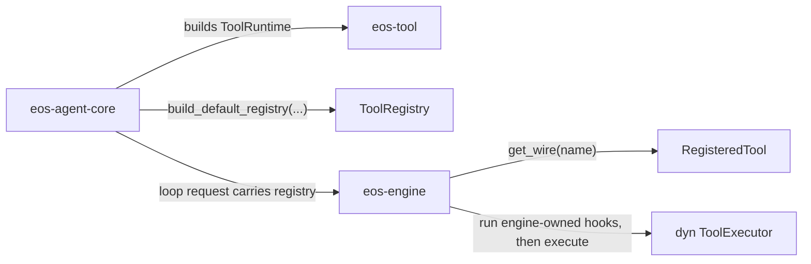

# Phase 03 - eos-tool Spec

Status: Implemented
Date: 2026-06-09
Owner: eos-tool

Implementation 2026-06-09: `agent-core/crates/eos-tool` is the renamed,
14-source-file implementation crate. Tool-owned framework contracts moved into
`eos-tool`; workflow submission contracts moved to `eos-types`; cancellation and
notification contracts remain outside `eos-tool` pending their owner phases.

Revision 2026-06-09: conformed the target file tree to the Phase 00 locked
`eos-tool` shape (flat `tools/` families, no `config.rs`, no
`isolated_workspace.rs`, flat `submission.rs`) with one deliberate deviation —
`tools/ask_advisor.rs` stays its own family because `ask_advisor` is an
**inline (spawned-and-awaited) agent run**, a different lifecycle from the
**background** `run_subagent` in `tools/subagent.rs`; the two must not share a
file. The markdown tool-config loader folds into `registry.rs` and
isolated-workspace tools fold into `tools/sandbox.rs`. Mandated the `ToolRuntime`
runtime simplifications (no `Option`/`MissingPort` defensive layer; typed ports
instead of closure callbacks) and corrected two over-stated equivalence claims.
The `ask_advisor.rs` split needs Phase-0 reconciliation against the locked tree;
the previously proposed `config.rs` and `tools/submission/` splits are recorded
under Known Costs as the relief valve if Phase 0 is reopened.

Revision 2026-06-09 (runtime shape): named `ToolRuntime` fields by capability
(raw `Arc<dyn …>` handles, no `*Service`/`*Resource` field types) and unified the
subagent / command / workflow session trackers into a single `BackgroundSessions`
manager port implemented by `eos-engine`'s existing `BackgroundSessionRuntime`.
The isolated-workspace toggle stays a small `WorkspaceMode` port. Both stay
inside `registry.rs`; the locked module tree is unchanged.

Revision 2026-06-09 (hook execution ownership): removed the previously implied
hook-resource bundle from `ToolRuntime` / `RegisteredTool`. `eos-tool` owns only
hook declarations (`Hook` tokens on `RegisteredTool`). `eos-engine` owns the
tool-call hook runner and its fields: the run-local `BackgroundManagers` aggregate
for background-session counts/cancellation, plus engine/store lineage helpers for
nested workflow depth. No `HookServices`, `HookRuntime`, `HookHandles`, or other
hook execution resource type is exported by `eos-tool`.

## Scope

This phase rebuilds `eos-tool` as the owner of the tool framework contracts,
default tool registry construction, and concrete model-callable tool behavior.

It removes the current `eos-tool-ports` dependency by moving tool-owned
contracts into `eos-tool` and routing non-tool contracts to their real owner in
the crate-map/integration phases. It also collapses the current
one-file-per-tool command layout into the Phase 00 locked family-level handlers.

Phase 03 does not own root workspace member edits, retired-crate removal, or the
final dependency DAG. Those are Phase 02 / integration responsibilities. Phase
03 owns the resulting `eos-tool` crate shape, which must match the Phase 00 lock.

## Local Architecture

`eos-tool` owns:

- tool names and keys,
- tool intent and output shape,
- execution metadata facts,
- tool result DTOs,
- registered tool entries,
- tool registry,
- tool executor trait,
- hook declarations and config tokens,
- default registry construction,
- externalized tool config loading and validation, keyed by `ToolName::ALL` and
  the `TerminalTool` catalog, owned by `registry.rs` (the `ToolConfigSet` loader
  plus the `ToolSpec` schema helpers),
- concrete model-callable tool behavior,
- skill registry and skill package loading,
- `ToolRuntime`, the small executable dependency bundle passed into registry
  construction by `eos-agent-core`.

`eos-tool` does not own:

- agent-loop turn control,
- foreground tool-batch dispatch,
- pre-hook execution policy,
- `HookOutcome` or other hook-pipeline internals,
- model provider streaming,
- agent-run lifecycle rows,
- workflow state transitions,
- sandbox daemon protocol internals,
- workspace crate-map edits.

`eos-engine` receives a `ToolRegistry`, runs its own pre-hook execution pipeline,
looks up `RegisteredTool` entries, and calls the stored `ToolExecutor`. A
`RegisteredTool` carries only static hook declarations (`Vec<Hook>`), not hook
execution resources. The dependency direction is `eos-engine -> eos-tool`;
`eos-tool` must not depend on `eos-engine`.



## Resulting File Structure

This is the Phase 00 locked `eos-tool` source shape with one deliberate
deviation — `tools/ask_advisor.rs` is kept separate from `tools/subagent.rs`
(inline vs background agent runs; see Runtime Rules). Every other file matches
`phase-00-architecture-lock_SPEC.md` (Boundary Rules / eos-tool); the
`ask_advisor.rs` split is flagged for Phase-0 reconciliation.

```text
agent-core/crates/eos-tool/
├── Cargo.toml
├── src/
│   ├── lib.rs
│   ├── error.rs
│   ├── model.rs
│   ├── registry.rs
│   ├── hooks.rs
│   ├── tools.rs
│   └── tools/
│       ├── sandbox.rs
│       ├── command.rs
│       ├── workflow.rs
│       ├── subagent.rs
│       ├── ask_advisor.rs
│       ├── submission.rs
│       ├── skills.rs
│       └── terminal.rs
└── tests/
    ├── registry/
    ├── sandbox/
    ├── command/
    ├── workflow/
    ├── subagent/
    ├── ask_advisor/
    ├── submission/
    └── skills/
```

`tools.rs` is the routing module for the `tools/` folder: it declares the family
modules and owns the small shared registration seam (`CallerScope`,
`register_tool`, `parse_input`). `tools/` holds concrete model-callable
behavior, one family file per Phase 00 family. `tools.rs` plus `tools/` is the
allowed `foo.rs` + `foo/` shape (a sibling file and folder), not the banned
`foo.rs` + `foo/mod.rs` duplicate shape, and there is no nested `mod.rs` router.

`registry.rs` owns the registry data structure, the executor trait,
`ToolRuntime`, default tool registration, and the externalized tool-config
loader/validator (`ToolConfigSet::load_from_dir` plus the `ToolSpec` schema
helpers). There is no first-target `catalog.rs`, `config.rs`, `executor.rs`,
`runtime.rs`, `resources.rs`, `handles.rs`, `services.rs`, `services/`, or
`hooks/` folder. The built-in tool set is closed and is represented through
default registry registration plus the family handlers in `tools/`; there is no
`builtins.rs` or `builtins/`.

## Module Collapse Plan

| Current pattern | Target |
| --- | --- |
| `tools/sandbox/exec_command.rs` | `registry.rs` default entry plus `tools/command.rs` handler |
| `tools/sandbox/write_stdin.rs` | `registry.rs` default entry plus `tools/command.rs` handler |
| `tools/sandbox/read_command_progress.rs` | `registry.rs` default entry plus `tools/command.rs` handler |
| `tools/sandbox/read_file.rs` | `registry.rs` default entry plus `tools/sandbox.rs` handler |
| `tools/sandbox/write_file.rs` | `registry.rs` default entry plus `tools/sandbox.rs` handler |
| `tools/sandbox/edit_file.rs` | `registry.rs` default entry plus `tools/sandbox.rs` handler |
| `tools/sandbox/multi_edit.rs` | `registry.rs` default entry plus `tools/sandbox.rs` handler |
| `tools/isolated_workspace/*.rs` | `registry.rs` default entry plus `tools/sandbox.rs` handler (folded; both use the sandbox resource) |
| `tools/workflow/*.rs` | `registry.rs` default entry plus `tools/workflow.rs` handler |
| `tools/subagent/*.rs` | `registry.rs` default entry plus `tools/subagent.rs` handler |
| `tools/ask_helper/*.rs` (`ask_advisor`) | `registry.rs` default entry plus `tools/ask_advisor.rs` handler (inline agent run; kept separate from the background `tools/subagent.rs`) |
| `tools/submission/<family>/*.rs` | `registry.rs` default entry plus `tools/submission.rs` handler (flat; six executors in one file) |
| `tools/skills/*.rs` | `registry.rs` default entry plus `tools/skills.rs` handler |
| `tools/terminal.rs` | `tools/terminal.rs` |
| `registry/config.rs` (markdown tool-config loader) | `registry.rs` |
| `registry/spec.rs` (`ToolSpec` schema helpers) | `registry.rs` |

`tools/sandbox.rs` owns the file/edit tools and the isolated-workspace
enter/exit tools, because the isolated-workspace tools already take only the
sandbox resource. `tools/subagent.rs` owns the **background** agent-launch tool
`run_subagent`; `tools/ask_advisor.rs` owns the **inline** agent-launch tool
`ask_advisor`. Both consume the shared `AgentRunApi` handle but stay in separate
files because they are different run lifecycles (detached background vs
spawned-and-awaited; see Runtime Rules). `tools/submission.rs` owns all six
terminal submission executors and their shared file-private helpers
(`SubmissionStatus`, `OutcomeInput`, `is_blank`, `meta_obj`,
`submission_ack_result`).

## `eos-tool-ports` Ownership Split

Do not dump every old `eos-tool-ports` item into `eos-tool`. Move each contract
to the crate that owns its behavior or to an owner-neutral contract module.

| Current item family | Target owner |
| --- | --- |
| `ToolError` | `eos-tool/error.rs` |
| `ToolName`, `ToolKey`, `ToolIntent`, `ExecutionMetadata`, `OutputShape`, `ToolResult` | `eos-tool/model.rs` |
| `ToolRegistry`, `RegisteredTool`, `ToolExecutor`, `ToolRuntime` | `eos-tool/registry.rs` |
| `Hook` | `eos-tool/hooks.rs` |
| `HookOutcome` | engine-private hook execution internals; not exported by `eos-tool` |
| `PlannerPlan`, `PlanTask`, `PlanReducer`, `SubmissionAck` | owner-neutral workflow submission contracts, not concrete tool behavior |
| `AttemptSubmissionPort` | workflow submission contract implemented by `eos-workflow`; consumed by `eos-tool` |
| `CancelPort` | cancellation contract owned by the lifecycle/cancellation phase, not by concrete tools |
| `SystemNotification`, `NotificationSink`, background-session count/status DTOs | engine/background contracts unless a passive DTO must move to `eos-types` |

The agent-launch contracts (`AgentType`, `AgentName`, `AgentRunApi`,
`SpawnAgentRequest`, `AgentRunRecordKind`, `TaskRole`) are **not**
`eos-tool-ports` items; they arrive from `eos-types` via the Phase 02 contract
floor (the `eos-agent-ports` split). `tools/subagent.rs` consumes them to build
spawn requests and select the record kind. `eos-tool` adds no launch-class types
of its own, performs no `AgentType` validation, and references the `AgentType`
launch axis only — it does not consume the `AgentRole` behavioral axis, which
Phase 02 retires. (`TaskRole` is the lineage-row workflow role from Phase 00,
not a profile axis.)

## Runtime Rules

`eos-tool` should not export `*Service` types. It exports a small runtime
struct passed into registry construction and captured by concrete tools.

The first target uses `ToolRuntime` in `registry.rs`; it does not create
`runtime.rs`, `resources.rs`, `handles.rs`, or `services.rs`. `ToolRuntime`
replaces the current ten `*Service` structs (the two `services.rs` files in
`eos-tools` and `eos-tool-ports`) and the eleven-argument
`build_default_registry_with_services` entry point.

`ToolRuntime` fields are named by capability and hold raw handles for concrete
tool executors; there are no `*Service` / `*Resource` field types and no per-tool
service. It does **not** carry a hook-resource bundle. The three run-local session
trackers (subagent, command, workflow) collapse into one `BackgroundSessions`
manager port (see Mandated runtime simplifications):

| Field | Type | Built by | Used by |
| --- | --- | --- | --- |
| `sandbox` | `Arc<dyn SandboxTransport>` | `eos-agent-core` | `tools/sandbox.rs` (file/edit + isolated-workspace); `tools/command.rs`'s `SandboxCommandApi` derives from it in the registry, not a separate field |
| `workflow` | `Arc<dyn WorkflowApi>` | `eos-agent-core` | `tools/workflow.rs` |
| `launcher` | `Arc<dyn AgentRunApi>` | `eos-agent-core` | `tools/subagent.rs` (`run_subagent`), `tools/ask_advisor.rs` (`ask_advisor`) |
| `skills` | `Arc<SkillRegistry>` | `eos-agent-core` | `tools/skills.rs` |
| `submission` | root stores + `AttemptSubmissionPort` | `eos-agent-core`, `eos-agent-run` if needed | `tools/submission.rs` |
| `background` | `Arc<dyn BackgroundSessions>` | `eos-engine` (its `BackgroundSessionRuntime`) | `tools/subagent.rs`, `tools/command.rs`, `tools/workflow.rs` |
| `workspace_mode` | `WorkspaceMode` (isolated-workspace toggle) | `eos-agent-core` | `tools/sandbox.rs` |

There is no `command-session` field (command execution derives from `sandbox`;
command-session tracking is a `background` method) and no separate
`subagent-session` / `workflow-session` field (both are `background` methods).
`tools/subagent.rs` reaches `launcher` to spawn and `background` to register the
detached subagent run; `tools/ask_advisor.rs` reaches only `launcher` and blocks,
so there is no advisor session field — the subagent/advisor asymmetry is a
capability difference, not a per-tool service.

```rust
pub struct ToolRuntime {
    pub sandbox:        Arc<dyn SandboxTransport>,   // file/edit/isolated-ws; command API derives from this
    pub workflow:       Arc<dyn WorkflowApi>,
    pub launcher:       Arc<dyn AgentRunApi>,        // run_subagent + ask_advisor share this one handle
    pub skills:         Arc<SkillRegistry>,
    pub submission:     Submission,                  // root stores + attempt port
    pub background:     Arc<dyn BackgroundSessions>, // one manager, not three trackers
    pub workspace_mode: WorkspaceMode,
}

// trait defined in registry.rs; impl = eos-engine BackgroundSessionRuntime.
// count / cancel_all are NOT here — engine-side hook execution reads the aggregate directly.
#[async_trait]
pub trait BackgroundSessions: Send + Sync {
    async fn register_subagent(&self, run: AgentRunId) -> Result<(), ToolError>;
    async fn register_command(&self, id: CommandSessionId, sandbox: SandboxId) -> Result<(), ToolError>;
    async fn register_workflow(&self, started: StartedWorkflow) -> Result<(), ToolError>;
    async fn cancel_subagent(&self, run: AgentRunId, reason: &str) -> Result<bool, ToolError>;
}
```

Engine-side tool-call hooks use normal engine fields, not a `RegisteredTool`
resource bundle:

```rust
pub(crate) struct ToolCallHooks {
    background: BackgroundManagers,
    lineage: WorkflowLineageReader, // engine/store-owned helper; no eos-tool port
}
```

`RequireNoBackgroundSessions` reads and optionally cancels through
`BackgroundManagers`, which already tracks subagent runs, delegated workflows, and
background command sessions for the current agent run. It does not call the
sandbox daemon directly and does not receive sandbox transport through
`RegisteredTool`. `DisallowNestedPlannerDeferral` reads workflow ancestry through
engine/store-owned lineage state (today this may be the existing workflow-depth
helper; the target is a store-backed helper owned outside `eos-tool`), not a
tool-stamped `WorkflowApi` handle.

Fields are non-optional per Mandated runtime simplification 1; that requires the
`eos-agent-core` composition root to build `launcher` / `workflow` before the
per-run `ToolRuntime`, removing the current `eos-runtime` `OnceLock` that defers
them. The same per-run build order lets the engine wire one `AgentRunApi` into
`BackgroundSessionRuntime`.

Each `tools/<family>.rs` registration takes only the narrow slice of
`ToolRuntime` it needs; the bundle is destructured at the composition root, not
passed wholesale into every family.

`run_subagent` and `ask_advisor` share the one injected `launcher`
(`Arc<dyn AgentRunApi>`) but live in **separate family files**
(`tools/subagent.rs` and `tools/ask_advisor.rs`) because they are different run
lifecycles. They are **not** the same executor and do **not** "differ only in
record kind". `run_subagent` is a **detached background** launch — it registers
the run through `background.register_subagent` and returns immediately.
`ask_advisor` is an **inline (blocking)** run — it awaits `wait_for_agent_outcome`
and re-maps the result, with a hardcoded `advisor` agent name, advisor messages,
a forced non-isolated workspace, and `is_terminal = false`, and touches the
`background` manager not at all. They share the `AgentRunApi` **port**, not a
behavior; `ToolRuntime` carries one `launcher` field, and each tool stamps its
own `AgentRunRecordKind` (`Subagent` vs `Advisor`), which `eos-agent-run` maps to
the required `AgentType` (`subagent` / `advisor`) and validates against the
spawned profile. `eos-tool` owns no launch-class policy: it never matches on
`AgentType`, it only sets the record kind. `ask_advisor` needs no session field
because it blocks; `run_subagent` reaches `background` because it is a tracked
background run — the asymmetry is a capability difference, not a per-tool service.

The six submission executors in `tools/submission.rs` are parameterized by their
submission target, not by a record kind: `submit_root_outcome` uses the
two-store root-submission resource (task/request stores with a compare-and-set
commit); `submit_planner_outcome`, `submit_generator_outcome`, and
`submit_reducer_outcome` call distinct `AttemptSubmissionPort` methods; and
`submit_subagent_result` and `submit_advisor_feedback` are service-less
metadata-only terminals with no port call. They share only the file-private
helpers, not a single dispatch axis.

### Mandated runtime simplifications

1. **No `Option` / `MissingPort` defensive layer.** `ToolRuntime` carries
   non-optional live handles. Schema-snapshot and registry-validation use a
   separate constructor (`build_registry_schema(config, caller)`) that builds the
   registry from config and schema alone and never holds executable handles.
   Because the snapshot path no longer fakes services, there is no `Option<...>`
   field on `ToolRuntime`, no `ToolError::MissingPort` variant, and no
   `InertSandboxTransport` shim.
2. **One background-session manager, not per-family closures.** The three
   run-local session trackers (subagent register/cancel, command register,
   workflow register) collapse into a single object-safe `BackgroundSessions`
   port defined in `eos-tool` and implemented by `eos-engine`'s existing
   `BackgroundSessionRuntime` aggregate — the engine already holds all three
   family managers, so the tool side stops receiving them destructured into loose
   callbacks. The isolated-workspace mode update is the one remaining run-local
   port (`WorkspaceMode`). Both replace the
   `Arc<dyn Fn(...) -> BoxServiceFuture<...>>` closure aliases and the
   `BoxServiceFuture` machinery in the current `services.rs`. `count` /
   `cancel_all` are **not** on the tool-facing port: engine-side hook execution
   reads the aggregate directly. `WorkflowApi` and `AgentRunApi` stay the
   `eos-types`-owned `dyn` ports they already are.

Each `ToolRuntime` field is an injected handle used by concrete tool executors.
Its **trait is defined in `eos-tool`** (or, for `WorkflowApi`/`AgentRunApi`, in
`eos-types`) and its **concrete impl is built at the `eos-agent-core`
composition root**, then passed into the engine via `AgentLoopExecutionRequest`.
This keeps the graph acyclic:

- `eos-engine` builds the `background` manager — its own
  `BackgroundSessionRuntime`, the `BackgroundSessions` impl — because it already
  depends on `eos-tool` (`eos-engine -> eos-tool`); the composition root injects
  the `dyn AgentRunApi` / `dyn WorkflowApi` that the manager tracks for cancel and
  poll.
- The `workflow` and `agent-launch` resources must **not** be built by
  `eos-engine`. `eos-engine` consumes `dyn WorkflowApi` and `dyn AgentRunApi`
  from `eos-types` and has no crate edge to the concrete `eos-workflow` or
  `eos-agent-run` crates. Building either impl would require such an edge:
  `eos-agent-run -> eos-engine` already exists (Phase 00 locked DAG), so an
  `eos-engine -> eos-agent-run` edge would close a cycle, and `eos-workflow` is
  simply unreachable from the engine. Only `eos-agent-core`, which depends on
  every domain crate, may build them.
- Concrete tools and engine hooks invoke these handles only through the
  `eos-tool`-defined trait in `ToolRuntime`; they never gain a crate dependency
  on `eos-workflow` or `eos-agent-run`.

Hook *declarations* live in `hooks.rs`. Hook *execution* — the pipeline and
`HookOutcome` — lives in `eos-engine`. The hook runner owns the live state it
needs as class fields. `RequireNoBackgroundSessions` counts open sessions from
the engine-owned `BackgroundManagers` aggregate and cancels subagents through the
same aggregate for terminal/exit tools. `DisallowNestedPlannerDeferral` reads
nested workflow depth through engine/store-owned lineage helpers. Nothing is
stamped onto `RegisteredTool` for hook execution.

Rejected `Service` names:

| Pattern | Replacement |
| --- | --- |
| private tool executor resource group | `ToolRuntime` |
| static registry config holder | `ToolRegistry` default entries |
| hook-only injected resources | engine-owned tool-call hook runner fields |
| hook-only policy/pattern state | engine-private hook policy state |
| test-only helper | test fixture name |

## Public Surface

Target `lib.rs` exports only:

```rust
pub use error::ToolError;
pub use hooks::Hook;
pub use model::{ExecutionMetadata, OutputShape, ToolIntent, ToolKey, ToolName, ToolResult};
pub use registry::{
    build_default_registry, build_registry_schema, BackgroundSessions, CallerScope, RegisteredTool,
    Submission, ToolConfig, ToolConfigError, ToolConfigSet, ToolExecutor, ToolRegistry, ToolRuntime,
    WorkspaceMode,
};
pub use tools::terminal::{render_tool_instruction, TerminalTool, ToolInstructions};
```

The exact names may change during implementation, but the surface must stay
small and owner-accurate. `HookOutcome` is not public `eos-tool` API.

`ToolConfigSet` / `ToolConfig` / `ToolConfigError` are exported from `registry`
(the loader's new home) and the `terminal` descriptors from `tools::terminal`
because `eos-agent-core` and the request runtime consume them today; dropping
them silently narrows load-bearing API. The previous 11-argument
`build_default_registry_with_services` entry point is **replaced** by
`build_default_registry(config, caller, runtime)` taking one `ToolRuntime`, and
the previous 2-argument inert builder is **replaced** by
`build_registry_schema(config, caller)`. That collapse is the purpose of
`ToolRuntime`, not an incidental rename.

## Known Costs

Conforming to the Phase 00 flat tree concentrates load-bearing logic into two
files that sit near or over the repo's 800-1000 LOC review-smell line:

- `registry.rs` carries the registry, the executor trait, `ToolRuntime`, default
  registration, and the markdown config loader/validator.
- `tools/submission.rs` carries six executors; planner and root hold genuinely
  distinct logic (planner DAG validation; root two-store compare-and-set), so the
  file does not reduce to scaffolding.

The mandated runtime simplifications (no `Option`/`MissingPort` layer, typed
ports) shrink `registry.rs` relative to today's services, and moving the inline
executor tests to `tests/submission/` keeps the source files smaller than the
combined source-plus-test footprint. These two files remain the accepted cost of
matching the lock. If Phase 0 is ever reopened, the documented relief valve is
the originally proposed `config.rs` (the cohesive loader) and `tools/submission/`
subfolder splits, which trade two large cohesive files for two folders.

## Progress Tracker

| Item | Status |
| --- | --- |
| Confirm Phase 02 handoff has created or renamed the `eos-tool` crate | Done |
| Move tool-owned `eos-tool-ports` contracts into `error.rs`, `model.rs`, `registry.rs`, and `hooks.rs` | Done |
| Route non-tool `eos-tool-ports` contracts to owner crates or owner-neutral contract modules | Done for Phase 03 scope |
| Fold registry, executor trait, default tool registration, and the markdown tool-config loader/`ToolSpec` helpers into `registry.rs` | Done |
| Move hook declarations into `eos-tool/hooks.rs` and keep hook execution in `eos-engine` | Done |
| Move concrete tool behavior into the Phase 00 `tools/` family modules | Done |
| Keep `tools/submission.rs` flat with all six submission executors and shared file-private helpers | Done |
| Define `ToolRuntime` in `registry.rs` with non-optional live handles and the shared agent-launch field; keep hook execution resources out of `ToolRuntime` / `RegisteredTool` | Done |
| Split the schema-snapshot builder (`build_registry_schema`) from the live builder and delete the `Option`/`MissingPort`/`InertSandboxTransport` layer | Done |
| Delete `HookServices` / hook-resource stamping and move tool-call hook dependencies to engine-owned runner fields | Done |
| Unify subagent/command/workflow session tracking into one `BackgroundSessions` port (impl = engine `BackgroundSessionRuntime`; register/cancel only); keep the `WorkspaceMode` toggle as the one run-local port | Done |
| Name `ToolRuntime` fields by capability with raw `Arc<dyn …>` handles; drop the `*Service`/`*Resource` field types and the separate command field (derive `SandboxCommandApi` from `sandbox`) | Done |
| Collapse sandbox file/edit and isolated-workspace tools into `tools/sandbox.rs` | Done |
| Collapse shell/session tools into `tools/command.rs` | Done |
| Collapse `run_subagent` into `tools/subagent.rs` (background) and `ask_advisor` into `tools/ask_advisor.rs` (inline); keep the two lifecycles in separate files | Done |
| Collapse workflow and skill tool files into `tools/workflow.rs` and `tools/skills.rs` | Done |
| Remove obsolete one-file-per-tool deep tree | Done |
| Update engine and agent-core imports through the Phase 02 integration lane | Done |
| Update `index.md` Progress Tracker with Phase 03 result and exit artifact | Done |

Implementation verification (2026-06-09):

- `cargo test -p eos-tool`
- `cargo check -p eos-engine --all-targets`
- `cargo check -p eos-runtime --all-targets`
- `find crates/eos-tool/src -maxdepth 3 -type f | sort | wc -l` = `14`

## Acceptance Criteria

- `eos-tool` matches the Phase 00 locked source shape — `lib.rs`, `error.rs`,
  `model.rs`, `registry.rs`, `hooks.rs`, `tools.rs`, and the flat `tools/`
  family files (`sandbox`, `command`, `workflow`, `subagent`, `submission`,
  `skills`, `terminal`) — with one deliberate, Phase-0-reconcilable deviation:
  `tools/ask_advisor.rs` is kept as a separate family for the inline agent run.
- `eos-tool` has `hooks.rs`.
- `registry.rs` owns the externalized tool-config loader and the `ToolSpec`
  schema helpers; there is no `config.rs`.
- `eos-tool` has no first-target `catalog.rs`, `config.rs`, `executor.rs`,
  `runtime.rs`, `resources.rs`, `handles.rs`, `services.rs`, `services/`, or
  `hooks/` folder, and no nested `mod.rs` router under `tools/`.
- `tools/submission.rs` is a single flat file holding all six submission
  executors (root, planner, generator, reducer, subagent, advisor) and their
  shared file-private helpers; it is not a `tools/submission/` subfolder.
- `eos-tool` has no one-file-per-tool-command module tree.
- `eos-tool` exports no `*Service` types.
- Private resource groups are fields on `ToolRuntime`, not `Service`.
- `ToolRuntime` fields are named by capability (`sandbox`, `workflow`,
  `launcher`, `skills`, `submission`, `background`, `workspace_mode`) and hold raw
  `Arc<dyn …>` handles; there are no `*Service` / `*Resource` field types and no
  per-tool service. `tools/command.rs`'s `SandboxCommandApi` derives from
  `sandbox` in the registry, so there is no separate command field.
- `ToolRuntime` has no `Option<...>` field and `eos-tool` has no
  `ToolError::MissingPort` variant or `InertSandboxTransport`; the
  schema-snapshot path is `build_registry_schema(config, caller)` and the live
  path is `build_default_registry(config, caller, runtime)`.
- The subagent, command, and workflow session trackers are one
  `BackgroundSessions` port defined in `eos-tool` and implemented by
  `eos-engine`'s `BackgroundSessionRuntime`; `ToolRuntime` carries one
  `background` field, not three trackers, and the port exposes only
  register/cancel (`count` / `cancel_all` stay engine-internal — engine-side hook
  execution reads the aggregate directly). The isolated-workspace toggle is the
  one remaining run-local port; neither is an `Arc<dyn Fn(...) -> BoxFuture>`
  closure.
- `HookOutcome` is not exported from `eos-tool`.
- Hook *declarations* live in `eos-tool/hooks.rs`; hook *execution* (the pipeline
  and `HookOutcome`) lives in `eos-engine`. Phase 04 confirms this split: its
  `tool_dispatch/execution.rs` owns "one registered-tool execution glue" and it
  states `eos-engine` does not own hook *contracts*; the two specs must use
  "hook contracts/declarations" for `eos-tool` and "hook execution" for
  `eos-engine` consistently.
- Stateful pre-hook dependencies are normal fields on the engine-owned tool-call
  hook runner, not `eos-tool` API and not stamped onto `RegisteredTool`.
  `RequireNoBackgroundSessions` reads `BackgroundManagers`; nested deferral reads
  engine/store-owned workflow lineage. There is no `HookServices`,
  `HookRuntime`, `HookHandles`, or `RegisteredTool.hook_services`.
- `tools/command.rs` owns `exec_command`, `write_stdin`, and
  `read_command_progress`.
- `tools/sandbox.rs` owns the file/edit tools and `enter_isolated_workspace` /
  `exit_isolated_workspace`.
- `tools/subagent.rs` owns the background `run_subagent`; `tools/ask_advisor.rs`
  owns the inline `ask_advisor` (the advisor prompt/result behavior). They share
  one injected `AgentRunApi` handle and `ToolRuntime` does not carry two separate
  `AgentRunApi` fields, but they stay in separate family files because they are
  different run lifecycles (detached background vs spawned-and-awaited), not
  "only in record kind".
- `eos-tool` consumes `AgentType`, `AgentName`, `AgentRunApi`,
  `SpawnAgentRequest`, and `AgentRunRecordKind` from `eos-types`; it performs no
  `AgentType` validation (that stays in `eos-agent-run`) and references the
  `AgentType` launch axis only, never the retired `AgentRole` axis.
- `eos-engine` imports tool framework contracts from `eos-tool`.
- `eos-tool` has no dependency on `eos-engine`.
- `eos-agent-core` builds `ToolRuntime` through `eos-tool`.
- Non-tool contracts from the old `eos-tool-ports` crate are not hidden in
  `eos-tool` solely to avoid dependency-DAG decisions.
- `cargo test -p eos-tool` passes.
- `cargo check -p eos-engine --all-targets` and
  `cargo check -p eos-agent-core --all-targets` pass after import updates.
- `eos-tool` final module count is 14: the Phase 00 locked 13-module tree
  (`lib`, `error`, `model`, `registry`, `hooks`, `tools`, plus the seven flat
  `tools/` family files) plus the deliberate `tools/ask_advisor.rs` family. No
  other first-target split raises it.
