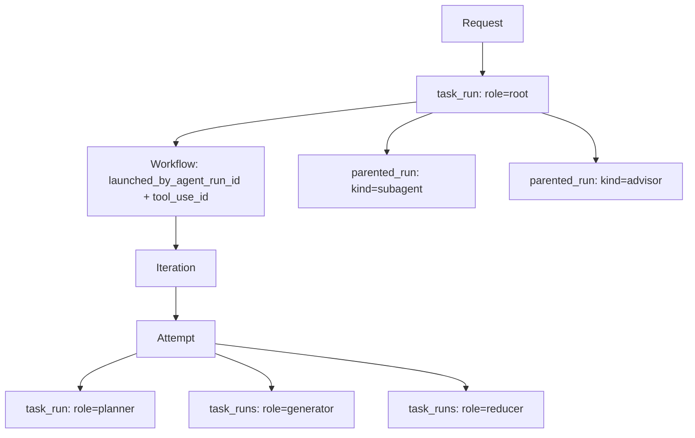
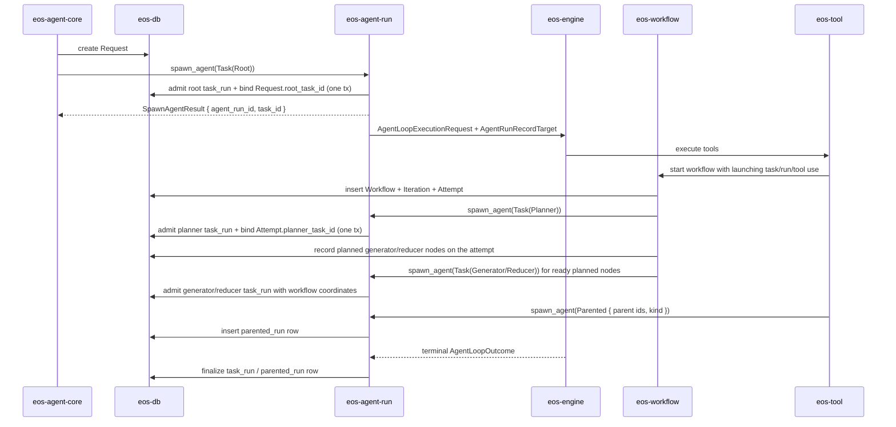

# Phase 03B - Execution Lineage and Materialization Spec

Status: Draft
Date: 2026-06-09
Owner: eos-db / eos-agent-run / eos-workflow / eos-engine / eos-agent-core

## Placement

This phase runs after Phase 03 and before Phase 04.

Phase 04 cannot cleanly split `eos-engine` from `eos-agent-run` until the
durable execution-lineage model is explicit. This phase defines that model:
which rows are created, which crate owns each transition, which metadata reaches
the agent loop, and how record folders are derived from durable state.

## Lineage Model Summary

Durable lineage uses **two total tables**, not a nullable union plus reference
tables:

- `task_runs` is the schedulable unit and its 1:1 main agent run in **one row**.
  Root, planner, generator, and reducer runs are `task_runs` rows; `role`
  distinguishes them.
- `parented_runs` holds subagent and advisor runs, which have no task. A closed
  `kind` discriminator (`Subagent` | `Advisor`) lives on this row.

Each table is total: every column is meaningful for every row of that table, so
there are no "either `task_id`, or both parent ids" CHECK invariants and no
separate `subagent_agent_runs` / `advisor_agent_runs` reference tables. The
record folder layout, the message/event rows, and the read-side execution tree
are pure projections of these two tables plus `workflows` / `iterations` /
`attempts`.

The agent profile carries one launch/dispatch axis, `AgentType`
(`Agent` | `Subagent` | `Advisor`), owned by `eos-types`. It is orthogonal to the
lineage discriminators above and is validated at spawn. There is no `AgentRole`
on the profile: a run's workflow role is the `task_runs` `role`, not a profile
field. There is no generic standalone `agent` run; every top-level run of a
request is a root `task_run`, so `AgentType::Agent` always resolves to a
`task_runs` row.

The merge holds while a task has exactly one main run. If multi-run-per-task
retries become near-term, the model splits `task_runs` back into `tasks` plus
`agent_runs`; see [Open Decision: Task/Run Merge vs Retry Split](#open-decision-taskrun-merge-vs-retry-split).
Resolve that fork before the `eos-db` migration; the rest of this spec is
identical across both branches.

## Scope

This phase establishes:

- the durable relationship between request, task run, workflow, iteration,
  attempt, and parented run,
- task-owned (`task_runs`) and parent-owned (`parented_runs`) run rows,
- workflow launch lineage,
- the passive `AgentRunRecordTarget` passed into the engine loop, resolved from
  the typed `AgentRunRecordIndex` before engine startup,
- record path generation for `messages.jsonl` and `events.jsonl`,
- read-side materialization for request/task/workflow execution trees.

It does not move the agent loop, rename crates, or split files. Those stay in
Phase 04 after this contract exists.

## Non-Goals

- Do not create wrapper persistence objects such as `WorkflowNode`,
  `IterationNode`, or `AttemptNode`.
- Do not add nested run arrays to `task_runs` for workflows, subagents, or
  advisors.
- Do not turn every subagent or advisor into a task run; they remain
  `parented_runs` rows unless they become schedulable workflow work.
- Do not put engine execution, tool behavior, provider clients, or runtime
  wiring into `eos-db`.
- Do not create a second durable tree just for records. Record folders are a
  projection of execution lineage.
- Do not reintroduce a separate `tasks` table plus a 1:1 `agent_runs` table, a
  nullable-union run table, or `subagent_agent_runs` / `advisor_agent_runs`
  reference tables under the default (merged) model.
- Do not add a generic standalone `agent` run shape or a task-less
  `requests/<id>/agent-run-<id>/` layout; every top-level run is a root
  `task_run`. Do not reintroduce an `AgentRole` axis on the profile; `AgentType`
  plus the lineage `TaskRole` / `ParentedRunKind` are the only classification
  inputs.

## Target Model



Rules:

| Concept | Meaning | Persistence rule |
| --- | --- | --- |
| `Request` | user intake boundary | owns `root_task_id` |
| `task_run` | schedulable unit and its 1:1 main agent run | root and workflow-role runs; `role` distinguishes them; `task_id` is the schedulable id, `agent_run_id` is the execution/record id |
| `Workflow` | workflow lifecycle | owns iterations and attempts; records `parent_task_id`, `launched_by_agent_run_id`, and `tool_use_id` |
| `Iteration` | workflow progress unit | belongs to one workflow |
| `Attempt` | one workflow attempt | names planner task id and planned generator/reducer nodes |
| `parented_run` | one parent-owned agent-loop execution | subagent/advisor runs; carry `parent_task_id`, `parent_agent_run_id`, and `kind` |

## Durable Store Contract

The exact SQL and Rust store names follow `eos-db` conventions, but the logical
fields below are required.

### task_runs

One row per schedulable unit and its 1:1 main agent run.

| Field | Required | Meaning |
| --- | --- | --- |
| `task_id` | yes | schedulable identity; primary key |
| `agent_run_id` | yes | execution/record identity; unique; referenced by child runs and record folders |
| `request_id` | yes | request anchor for direct query and audit |
| `role` | yes | `root`, `planner`, `generator`, or `reducer` |
| `status` | yes | `pending`, `running`, `done`, `failed`, `blocked`, or `cancelled` |
| `workflow_id` | nullable | set for planner/generator/reducer rows |
| `iteration_id` | nullable | set for planner/generator/reducer rows |
| `attempt_id` | nullable | set for planner/generator/reducer rows |
| `agent_name` | yes | selected agent profile |
| `needs` | yes | dependency task ids for generator/reducer rows; `[]` otherwise |
| `initial_messages` | yes | single model-visible loop input |
| `message_history` | nullable | terminal/replay history |
| `outcomes` | yes | normalized execution outcomes; `[]` until terminal |
| `terminal_tool_result` | nullable | flattened terminal tool result payload |
| `token_count` | yes | run token accounting |
| `error` | nullable | terminal error string |
| timestamps | yes | `created_at`, `updated_at`, `finished_at` |

There is no `instruction` column. Model-visible intent is `initial_messages`,
audited through `messages.jsonl`.

Indexes and constraints:

| Constraint | Rule |
| --- | --- |
| schedulable uniqueness | `task_id` is the primary key; the 1:1 task/run identity is structural, not a UNIQUE-on-nullable trick |
| run identity | `agent_run_id` is unique |
| request index | index `request_id` |
| workflow coordinate index | index `workflow_id`, `iteration_id`, and `attempt_id` together for workflow-role rows |
| workflow role invariant | planner/generator/reducer rows require `workflow_id`, `iteration_id`, and `attempt_id` |
| root invariant | the `role=root` row must match `Request.root_task_id` |

There is no `AgentRunKind`, `run_kind`, or category column. Role is the typed
discriminator and it already lives on the row.

### parented_runs

One row per subagent/advisor run. These runs have no task.

| Field | Required | Meaning |
| --- | --- | --- |
| `agent_run_id` | yes | execution/record identity; primary key |
| `request_id` | yes | request anchor for direct query and audit |
| `parent_task_id` | yes | task whose main run launched this run |
| `parent_agent_run_id` | yes | exact parent agent run that launched this run |
| `kind` | yes | `subagent` or `advisor`; closed two-variant discriminator |
| `tool_use_id` | nullable | model tool-use id that launched this run |
| `agent_name` | yes | selected agent profile |
| `initial_messages` | yes | single model-visible loop input |
| `message_history` | nullable | terminal/replay history |
| `terminal_tool_result` | nullable | flattened terminal tool result payload |
| `token_count` | yes | run token accounting |
| `error` | nullable | terminal error string |
| timestamps | yes | `created_at`, `finished_at` |

Indexes and constraints:

| Constraint | Rule |
| --- | --- |
| parent index | index `parent_task_id` and `parent_agent_run_id` together |
| request index | index `request_id` |
| kind is closed | `kind` is the `ParentedRunKind` enum; it is not a free string and it is not on `task_runs` |

`kind` is the durable subagent-vs-advisor discriminator. It lives on the
parent-owned row, not on the shared task lifecycle row, so it never becomes an
engine-readable classification flag (see Forbidden engine input). The category
is also derivable from `tool_use_id` to the originating tool call (`run_subagent`
vs `ask_advisor`); persisting `kind` denormalizes that derivable fact onto the
one row that owns the launch, which is the only place placement resolution reads
it. Do not split this into two reference tables.

### workflows

Add or preserve these launch-lineage columns:

| Field | Required | Meaning |
| --- | --- | --- |
| `id` | yes | `WorkflowId` |
| `request_id` | yes | request anchor |
| `parent_task_id` | yes | task whose agent launched the workflow |
| `launched_by_agent_run_id` | yes | agent run that executed the workflow tool call |
| `tool_use_id` | nullable | exact model tool-use id that launched the workflow |
| lifecycle fields | existing | workflow status, iteration ids, attempt ids |

`WorkflowService::find_outstanding_workflows` must query by
`launched_by_agent_run_id`. It must not accept an agent-run id and then ignore
it; the launching run is now a durable column, so the query is exact.

### attempts and planned nodes

`Attempt` keeps its planner task id and carries the planned generator/reducer
nodes that have not yet been admitted to run. Planned nodes live on the
materialized plan, not as `task_runs` rows:

| Attempt-owned data | Meaning |
| --- | --- |
| planner task id | the planner `task_runs` row id bound when the planner is admitted |
| `MaterializedPlan.generators` | planned generator nodes with reserved task ids and spawn input |
| `MaterializedPlan.reducers` | planned reducer nodes with reserved task ids and spawn input |

A `task_runs` row for a generator/reducer exists only after its planned node is
admitted. Until then the node is found through the plan.

## Agent Run Record Index Contract

`eos-types` owns a passive DTO that names where an agent run sits in the request
execution tree. It is the **input** to record-dir resolution in `eos-db`; it is
not passed to the engine.

```rust
pub struct AgentRunRecordIndex {
    pub request_id: RequestId,
    pub agent_run_id: AgentRunId,
    pub task_id: Option<TaskId>,
    pub task_role: Option<TaskRole>,
    pub parent_task_id: Option<TaskId>,
    pub parent_agent_run_id: Option<AgentRunId>,
    pub parented_kind: Option<ParentedRunKind>,
    pub workflow_id: Option<WorkflowId>,
    pub iteration_id: Option<IterationId>,
    pub attempt_id: Option<AttemptId>,
    pub tool_use_id: Option<ToolUseId>,
}
```

The names may be adjusted to match existing type names, but the invariants may
not be weakened. A task-owned index sets `task_id` and `task_role`; a
parent-owned index sets `parent_task_id`, `parent_agent_run_id`, and
`parented_kind`.

Terminology:

| Term | Meaning |
| --- | --- |
| `task_id` | set when this is a `task_runs` row |
| `task_role` | role of the task-owned run, used to choose the role folder |
| `parent_task_id` | task whose main agent run launched this parented run |
| `parent_agent_run_id` | exact parent agent run that launched this parented run |
| `parented_kind` | `Subagent` or `Advisor`; chooses `subagents/` vs `advisors/` |

## Creation Flow



Creation rules:

| Event | Owner | Required write |
| --- | --- | --- |
| user request accepted | `eos-agent-core` runtime through `eos-db` | `Request` row only |
| root agent spawned | `eos-agent-run` | root `task_run` row and `Request.root_task_id` binding in one transaction |
| task agent enters main loop | `eos-agent-run` | `task_run` row with `request_id`, `role`, and any workflow coordinates |
| workflow tool accepted | `eos-workflow` | `Workflow` with `parent_task_id`, `launched_by_agent_run_id`, and optional `tool_use_id` |
| workflow attempt starts planner work | `eos-agent-run` called by `eos-workflow` | planner `task_run` and `Attempt.planner_task_id` in one transaction |
| workflow plan materializes role work | `eos-workflow` | planned generator/reducer nodes and reserved task ids on the attempt; no `task_runs` rows yet |
| workflow role task enters main loop | `eos-agent-run` | generator/reducer `task_run` with workflow coordinate fields |
| subagent tool accepted | `eos-agent-run` through `eos-tool` caller | `parented_run` with `parent_task_id`, `parent_agent_run_id`, and `kind = Subagent` |
| advisor tool accepted | `eos-agent-run` through `eos-tool` caller | `parented_run` with `parent_task_id`, `parent_agent_run_id`, and `kind = Advisor` |
| loop finishes | `eos-agent-run` | terminal run status and final outcome fields |

Atomicity is structural, not orchestrated. Because the `eos-db` store that owns
`requests` also owns `task_runs`, root and planner admission are single
transactions in one store. There is no cross-store transaction threading and no
"either persist all three rows or none" sequence across separate stores, because
the task and its main run are one row.

## Agent Run Spawn Contract

`eos-agent-run` owns executable run creation inside `spawn_agent`.
There is no standalone `create_task`, `create_agent_task`, or
`create_agent_tasks` method in the target contract.

This keeps request entry and workflow orchestration away from direct row writes
while avoiding a generic TaskCenter owner.

```rust
pub enum SpawnAgentTaskArgs {
    Root {
        request_id: RequestId,
    },
    Planner {
        request_id: RequestId,
        workflow_id: WorkflowId,
        iteration_id: IterationId,
        attempt_id: AttemptId,
    },
    Generator {
        request_id: RequestId,
        workflow_id: WorkflowId,
        iteration_id: IterationId,
        attempt_id: AttemptId,
        local_id: PlanNodeId,
        needs: Vec<TaskId>,
    },
    Reducer {
        request_id: RequestId,
        workflow_id: WorkflowId,
        iteration_id: IterationId,
        attempt_id: AttemptId,
        local_id: PlanNodeId,
        needs: Vec<TaskId>,
    },
}

pub enum SpawnTarget {
    Task(SpawnAgentTaskArgs),
    Parented {
        parent_task_id: TaskId,
        parent_agent_run_id: AgentRunId,
        kind: ParentedRunKind,
    },
}

pub struct SpawnAgentRequest {
    pub agent_run_id: Option<AgentRunId>,
    pub agent_name: AgentName,
    pub target: SpawnTarget,
    pub initial_messages: Vec<Message>,
    pub tool_use_id: Option<ToolUseId>,
    // sandbox/workspace/model/cancellation inputs
}

pub struct SpawnAgentResult {
    pub agent_run_id: AgentRunId,
    pub task_id: Option<TaskId>,
}
```

`SpawnTarget` makes task-owned versus parent-owned a closed choice. The illegal
both-set and neither-set states that a flat bag of optional ids allows are
unrepresentable.

Rules:

| Rule | Reason |
| --- | --- |
| `Task(Root)` inserts the root `task_run` and binds `Request.root_task_id` in one transaction | root bootstrap is one atomic write, not a partial-write sequence in request entry |
| `Task(Planner)` inserts the planner `task_run` and binds `Attempt.planner_task_id` in one transaction | an attempt with a planner row but no planner binding is invalid |
| `Task(Generator/Reducer)` inserts the `task_run` when the scheduler admits the planned node | unlaunched plan nodes do not need pending rows |
| generated ids use the existing root/planner/generator/reducer id rules | stable ids remain predictable for audit and tests |
| planner submission records planned generator/reducer nodes on the attempt | workflow can materialize the DAG without creating run rows early |
| callers pass workflow decisions; `eos-agent-run` persists run rows at spawn | workflow topology stays in `eos-workflow`; row creation is unified |
| `spawn_agent` may load parent request/workflow/attempt rows only to validate invariants | validation is allowed; workflow lifecycle decisions are not |
| `Parented { parent_task_id, parent_agent_run_id, kind }` creates only a `parented_run` | subagent/advisor runs are not tasks unless the design later makes them schedulable workflow work |
| `SpawnAgentResult.task_id` is `Some` for `Task(..)` targets and `None` for `Parented` targets | callers do not re-derive task ids after spawn |
| `SpawnAgentTaskArgs` has no `Existing { task_id }` or pre-existing-task variant | every task spawn owns the row creation/admission path |
| parented runs derive `request_id` from the parent task/run lineage | callers do not pass duplicate request facts |
| `SpawnAgentTaskArgs` carries record-index/admission facts only | rows do not duplicate model prompt content |
| every spawn provides non-empty `initial_messages` | this is the single loop input for task-owned and parent-owned runs |
| rows do not store instruction text | model-visible intent is audited through `messages.jsonl` |

Forbidden ownership:

| Do not put in `eos-agent-run` | Owner |
| --- | --- |
| workflow start policy | `eos-workflow` |
| iteration continuation policy | `eos-workflow` |
| attempt retry/budget policy | `eos-workflow` |
| planner DAG validation | `eos-workflow` |
| provider stream execution | `eos-engine` |
| concrete tool behavior | `eos-tool` |

Admission:

```text
spawn_agent(Task(Root))
  -> begin tx: insert root task_run; bind Request.root_task_id; commit
  -> pass initial_messages to the engine
  -> return SpawnAgentResult { agent_run_id, task_id: Some(root_task_id) }

spawn_agent(Task(Planner))
  -> begin tx: insert planner task_run; bind Attempt.planner_task_id; commit
  -> pass initial_messages to the engine
  -> return SpawnAgentResult { agent_run_id, task_id: Some(planner_task_id) }

spawn_agent(Task(Generator | Reducer))
  -> insert generator/reducer task_run with workflow coordinates
  -> pass initial_messages to the engine
  -> return SpawnAgentResult { agent_run_id, task_id: Some(...) }

spawn_agent(Parented { parent_task_id, parent_agent_run_id, kind })
  -> insert parented_run with parent ids + kind
  -> pass initial_messages to the engine
  -> return SpawnAgentResult { agent_run_id, task_id: None }
```

Because generator/reducer rows are not inserted until spawn, `MaterializedPlan`
persists the planned spawn **inputs** (reserved task id, `local_id`,
`agent_name`, `needs`, and the goal/scope needed to compose `initial_messages`).
It does not store a rendered prompt and it does not rely on pending rows. The
actual `initial_messages` are composed when the node is admitted, which is the
only point at which a reducer's dependency outcomes exist.

### Agent type launch validation

`eos-agent-run` resolves the launched profile's `eos-types::AgentType` and
rejects a mismatch with a `WrongAgentType` error. `AgentType` is the only profile
launch axis; the lineage discriminators (`TaskRole`, `ParentedRunKind`) are
validated against it:

| `SpawnTarget` | Required `AgentType` |
| --- | --- |
| `Task(Root \| Planner \| Generator \| Reducer)` | `Agent` |
| `Parented { kind: Subagent }` | `Subagent` |
| `Parented { kind: Advisor }` | `Advisor` |

There is no generic standalone `agent` launch: `AgentType::Agent` is always a
`task_runs` row, never a task-less request-level run. Behavior that previously
keyed off a profile `AgentRole` (the planner generator-capability check,
context-recipe selection) reads the admitted `TaskRole`, so an `agent`-type
profile is not pinned to one workflow role.

## Task-Run Class Contract

`task_runs` is the persisted executable unit and its main agent run. It is not
the workflow tree and it is not a planned-but-unspawned node.

```rust
pub struct TaskRun {
    pub task_id: TaskId,
    pub agent_run_id: AgentRunId,
    pub request_id: RequestId,
    pub role: TaskRole,            // Root | Planner | Generator | Reducer
    pub status: TaskStatus,        // Pending|Running|Done|Failed|Blocked|Cancelled
    pub workflow_id: Option<WorkflowId>,
    pub iteration_id: Option<IterationId>,
    pub attempt_id: Option<AttemptId>,
    pub agent_name: AgentName,
    pub needs: Vec<TaskId>,
    pub initial_messages: Option<Vec<JsonObject>>,
    pub message_history: Option<Vec<JsonObject>>,
    pub outcomes: Vec<ExecutionTaskOutcome>,
    pub terminal_tool_result: Option<JsonObject>,
    pub token_count: i64,
    pub error: Option<String>,
    pub created_at: UtcDateTime,
    pub updated_at: UtcDateTime,
    pub finished_at: Option<UtcDateTime>,
}
```

Under the target flow, root and planner rows are created as running rows at
spawn. Generator/reducer rows are created only when their planned node is
admitted to run. A materialized workflow plan may therefore contain planned
generator/reducer nodes that do not yet have `task_runs` rows.

## Parented-Run Class Contract

`parented_runs` is the persisted subagent/advisor run. It has no task identity.

```rust
pub struct ParentedRun {
    pub agent_run_id: AgentRunId,
    pub request_id: RequestId,
    pub parent_task_id: TaskId,
    pub parent_agent_run_id: AgentRunId,
    pub kind: ParentedRunKind,     // Subagent | Advisor
    pub tool_use_id: Option<ToolUseId>,
    pub agent_name: AgentName,
    pub initial_messages: Option<Vec<JsonObject>>,
    pub message_history: Option<Vec<JsonObject>>,
    pub terminal_tool_result: Option<JsonObject>,
    pub token_count: i64,
    pub error: Option<String>,
    pub created_at: UtcDateTime,
    pub finished_at: Option<UtcDateTime>,
}

pub enum ParentedRunKind {
    Subagent,
    Advisor,
}
```

`ParentedRunKind` is the durable projection of the parented `AgentType`s:
`Subagent` maps to `AgentType::Subagent` and `Advisor` to `AgentType::Advisor`.
It is set from the launching tool (`run_subagent` / `ask_advisor`) and must equal
the launched profile's `AgentType`; `eos-agent-run` rejects a mismatch. There is
no `Agent` variant, because a parented run is never the generic profile class.

## Agent Loop Input Contract

`eos-agent-run` creates the durable run row before the engine loop starts. The
engine receives one passive, pre-resolved record target. It does not receive the
full lineage coordinate set and it does not resolve placement.

Allowed engine input:

```rust
pub struct AgentLoopExecutionRequest {
    pub agent_run_id: AgentRunId,
    pub record_target: AgentRunRecordTarget,
    // prompt, model, tools, cancellation, event sink, and runtime inputs
}

pub struct AgentRunRecordTarget {
    pub request_id: RequestId,
    pub agent_run_id: AgentRunId,
    pub task_id: Option<TaskId>,
    pub record_dir: AgentRunRecordDir,
}

pub struct AgentRunRecordDir(/* normalized, request-rooted record directory */);
```

`AgentRunRecordDir` is produced by `eos-db`/`eos-agent-core` from the
`AgentRunRecordIndex` before engine startup, by walking durable lineage. It is
not caller-provided metadata. The engine writes into this directory and the
four anchors above into each row; it does not decide whether a parented run
belongs under `subagents/` or `advisors/`.

`AgentRunRecordTarget` is the only record DTO that crosses into the engine. The
lineage coordinates that resolve `record_dir` stay in `AgentRunRecordIndex`,
consumed by the resolver. The engine is not handed both the index and a
near-duplicate target.

Forbidden engine input:

| Do not pass | Reason |
| --- | --- |
| active-run registry handles | owned by `eos-agent-run` |
| lifecycle finalization callbacks | finalization is one terminal handoff from engine to run |
| DB mutation handles for run status | run lifecycle writes stay in `eos-agent-run` |
| tool-family-specific placement strings | the record dir is typed and pre-resolved |
| subagent/advisor classification flags | the record directory is resolved before engine startup |
| the full `AgentRunRecordIndex` | the engine needs the resolved `record_dir` and four anchors, not the lineage coordinate set |
| a generic metadata bag with resource wiring | metadata is facts only, not dependency injection |

## Record Layout Contract

The normal production layout is request-rooted and generated from persisted
lineage.

```text
requests/<request_id>/
  root-task-<task_id>/
    agent-run-<agent_run_id>/
      messages.jsonl
      events.jsonl
      workflows/
        workflow-<workflow_id>/
          iteration-<iteration_id>/
            attempt-<attempt_id>/
              planner-task-<task_id>/agent-run-<agent_run_id>/
                messages.jsonl
                events.jsonl
              generator-task-<task_id>/agent-run-<agent_run_id>/
                messages.jsonl
                events.jsonl
              reducer-task-<task_id>/agent-run-<agent_run_id>/
                messages.jsonl
                events.jsonl
      subagents/subagent-run-<agent_run_id>/
        messages.jsonl
        events.jsonl
      advisors/advisor-run-<agent_run_id>/
        messages.jsonl
        events.jsonl
```

Rules:

| Rule | Owner |
| --- | --- |
| `messages.jsonl` is plural | `eos-engine` records |
| `events.jsonl` is plural | `eos-engine` records |
| root path uses `Request.root_task_id` | `eos-db` lineage query |
| workflow paths use workflow coordinate fields on `task_runs` | `eos-db` lineage query |
| subagent paths use `parented_runs` where `parent_task_id = task` and `kind = Subagent` | `eos-db` lineage query |
| advisor paths use `parented_runs` where `parent_task_id = task` and `kind = Advisor` | `eos-db` lineage query |
| a parented run's enclosing path is derived from `parented_runs.parent_agent_run_id` | `eos-db` lineage query, not a filesystem scan |
| records do not reconstruct hierarchy from ad hoc callsite strings | `eos-engine` records consume `AgentRunRecordTarget` |
| `parents-missing/` is not part of the normal production path | parent lineage is a durable row that exists before the child row is admitted |
| there is no task-less `requests/<id>/agent-run-<id>/` layout | every top-level run is a root `task_run`; the generic `Agent` record kind is removed |

`parents-missing/` is removed. Because `parented_runs.parent_agent_run_id` is a
durable column written at admission, the enclosing path is resolved from
lineage, not by scanning the filesystem for the parent's directory. If a
repair/debug fallback for orphaned rows is retained, it must be isolated from
the normal writer path, must emit a hard diagnostic event, and must not be used
to satisfy acceptance tests.

### messages.jsonl Rows

Each row represents one model-visible message or message delta committed to the
record.

Required base fields:

| Field | Meaning |
| --- | --- |
| `sequence` | monotonic sequence within one agent run |
| `timestamp` | write time |
| `request_id` | request anchor |
| `agent_run_id` | run anchor |
| `task_id` | task anchor when this run owns a task |
| `role` | system, user, assistant, or tool |
| `message` | serialized provider-neutral message payload |
| `tool_use_id` | set when the row belongs to a tool call/result |

### events.jsonl Rows

Each row represents one audit or lifecycle event visible to record readers.

Required base fields:

| Field | Meaning |
| --- | --- |
| `sequence` | monotonic event sequence within one agent run |
| `timestamp` | write time |
| `request_id` | request anchor |
| `agent_run_id` | run anchor |
| `task_id` | task anchor when this run owns a task |
| `event_type` | node_started, messages_initialized, agent_run_started, subagent_started, advisor_started, turn_started, tool_started, tool_finished, workflow_started, node_finished, or record_error |
| `payload` | event-specific structured payload |

`subagent_started`, `advisor_started`, and `workflow_started` events must
include the run or workflow ids they announce. The durable DB row is still the
source of truth; the event row is the audit trail.

## Materialized Read Model

The database stores normalized lineage. `eos-agent-core` exposes the read-side
execution tree as a facade; the nested DTOs live with that facade, not in
`eos-types`. `eos-types` owns only the flat `TaskExecutionIndex`, which is the
load-bearing child-id surface (it also drives record-path generation).

Flat index, owned by `eos-types`:

```rust
pub struct TaskExecutionIndex {
    pub task_id: TaskId,
    pub agent_run_id: AgentRunId,
    pub workflow_ids: Vec<WorkflowId>,
    pub subagent_ids: Vec<AgentRunId>,
    pub advisor_ids: Vec<AgentRunId>,
}
```

Nested tree, owned by the `eos-agent-core` materialization facade:

```rust
pub struct RequestExecutionTree {
    pub request: Request,
    pub root: TaskExecutionNode,
}

pub struct TaskExecutionNode {
    pub task_run: TaskRun,                  // the task AND its main run (merged)
    pub index: TaskExecutionIndex,          // stable child-id surface
    pub subagents: Vec<ParentedRun>,
    pub advisors: Vec<ParentedRun>,
    pub workflows: WorkflowsHydration,      // not eagerly recursive
}

pub enum WorkflowsHydration {
    Ids(Vec<WorkflowId>),                   // default: cheap; caller fetches on demand
    Hydrated(Vec<WorkflowExecutionTree>),   // opt-in deep walk
}

pub struct WorkflowExecutionTree {
    pub workflow: Workflow,
    pub iterations: Vec<IterationExecutionTree>,
}

pub struct IterationExecutionTree {
    pub iteration: Iteration,
    pub attempts: Vec<AttemptExecutionTree>,
}

pub struct AttemptExecutionTree {
    pub attempt: Attempt,
    pub planner: Option<TaskExecutionNode>, // None only before planner spawn
    pub generators: Vec<PlanNodeView>,
    pub reducers: Vec<PlanNodeView>,
}

pub enum PlanNodeView {
    Planned(PlannedNode),                   // in MaterializedPlan; no task_runs row yet
    Spawned(TaskExecutionNode),             // admitted: task_runs row exists
}
```

`TaskExecutionNode.task_run` is the merged task and main run; there is no
separate `main_agent_run: Option<AgentRun>` field, because the task and its 1:1
run are one row that is always present once the node is spawned. The "node
without a run yet" state is the planned generator/reducer case, represented by
`PlanNodeView::Planned`, not by an optional run on a spawned node.

The tree is bounded: deep nesting is reachable through `WorkflowsHydration` but
not eagerly materialized, matching the v1 read requirement of one workflow level
plus subagents and advisors.

Materialization sources:

| Index field | Source |
| --- | --- |
| `agent_run_id` | `task_runs.agent_run_id` for `task_id` |
| `workflow_ids` | `workflows.parent_task_id = task_id` |
| `subagent_ids` | `parented_runs.parent_task_id = task_id AND kind = Subagent` |
| `advisor_ids` | `parented_runs.parent_task_id = task_id AND kind = Advisor` |

`workflow_ids` are not created by `spawn_agent`. They are created by
`eos-workflow` when a workflow is accepted, because only the workflow service
owns workflow lifecycle, iteration creation, attempt creation, and workflow
policy. `spawn_agent` can later create planner/generator/reducer rows for that
workflow, but it does not create the workflow row itself.

Rules:

| Rule | Reason |
| --- | --- |
| materialization is read-side only | avoids duplicating workflow/task ownership |
| `TaskExecutionIndex` is derived, not stored on `task_runs` | keeps the row flat while giving audit and UI a stable child-id surface |
| the facade does not store workflow/iteration/attempt wrapper nodes | `Workflow`, `Iteration`, and `Attempt` already own those identities |
| subagent/advisor runs appear under the parent task node | they are `parented_runs`, not scheduled tasks |
| planned nodes appear as `PlanNodeView::Planned` until admitted | planned generator/reducer nodes materialize before their rows exist |
| deep workflow nesting is `WorkflowsHydration::Ids` by default | eager unbounded recursion is not required for v1 |
| ordering is deterministic | stable audit and UI rendering |

## Crate Ownership

| Crate | Owns | Must not own |
| --- | --- | --- |
| `eos-types` | passive ids, DTOs, `AgentType`, `AgentRunRecordIndex`, `AgentRunRecordTarget`, `TaskExecutionIndex`, `ParentedRunKind` | DB queries, lifecycle behavior, or the nested execution-tree facade |
| `eos-db` | migrations, constraints, repository queries, record-dir resolution, materialization queries | engine loop or tool behavior |
| `eos-agent-run` | `SpawnTarget`/`SpawnAgentTaskArgs`, `task_runs`/`parented_runs` admission at spawn, run finalization, record-index validation, `AgentType` launch-class validation | workflow lifecycle, planner DAG policy, or record path guessing |
| `eos-workflow` | workflow/iteration/attempt lifecycle, planner DAG validation, planned spawn input, workflow launch lineage | direct run-row writes or agent-loop execution |
| `eos-engine` | writes loop-visible `messages.jsonl` and `events.jsonl` from `AgentRunRecordTarget` (Phase-04 owner; see seam below) | run-row lifecycle ownership |
| `eos-agent-core` | request creation, call into `spawn_agent(Task(Root))`, public read-side execution-tree facade | direct run-row writes or normalized workflow persistence internals |
| `eos-tool` | passes typed launch facts (including `kind`) for workflow/subagent/advisor tools | durable lineage derivation |

Temporal seam. In Phase 03B the record writer is still in `eos-agent-run` (today
`eos-agent-message-records`), consuming `AgentRunRecordTarget`. Phase 04 folds
`eos-agent-message-records` into `eos-engine` records internals and moves the
write into the engine. The `eos-engine` row above is the Phase-04 end state, not
a 03B move. Either way the record DTO is `AgentRunRecordTarget`, so the consumer
move does not change the contract.

## Redundancy Rules

- Use two total tables (`task_runs`, `parented_runs`); do not reintroduce a
  nullable-union run table, a separate 1:1 `tasks` plus `agent_runs`, or
  `subagent_agent_runs` / `advisor_agent_runs` reference tables under the
  default model.
- Do not maintain a separate record hierarchy independent of DB lineage.
- Pass the engine only `AgentRunRecordTarget`; do not also pass the full
  `AgentRunRecordIndex`. The index is the resolver input; the target is the
  engine contract.
- Do not pass `record_kind` strings to the engine; placement is resolved into
  `record_dir` before engine startup.
- Do not introduce target API names that combine `Message` and `Record`. Use
  `AgentRunRecordTarget`, sibling-facing `RecordService`, `records_root`, or
  `record_dir` when a name is needed; never `AgentRunMessageRecordKind`,
  `MessageRecordService`, or `message_records`.
- Do not add an `instruction` field; `initial_messages` is the single
  model-visible input for every spawned run and `messages.jsonl` is the audit
  record.
- Do not duplicate planned generator/reducer ids as `task_runs` rows; planned
  nodes live in `MaterializedPlan` until `spawn_agent` admits them.
- Do not persist child arrays on `task_runs`; `agent_run_id`, `workflow_ids`,
  `subagent_ids`, and `advisor_ids` belong to the derived `TaskExecutionIndex`.
- Parented runs store both `parent_task_id` and `parent_agent_run_id`; the pair
  is the stable audit/materialization anchor.
- Denormalized `request_id` on `task_runs`, `parented_runs`, and `workflows` is
  required, not optional; it is the audit/query anchor and the only way to
  locate a parented run by request.
- `kind` on `parented_runs` is the only category discriminator; do not add a
  category column to `task_runs`.

## Open Decision: Task/Run Merge vs Retry Split

The default model merges a task and its 1:1 main run into one `task_runs` row.
This removes a table, removes the cross-store atomic-admission requirement, and
removes the "task present, run absent" inconsistency class. It holds only while
a task has exactly one main run.

| If multi-run-per-task retries are… | Then |
| --- | --- |
| not near-term (default) | keep `task_runs`; admission is a single-store transaction; `agent_run_id` is a unique column on the row |
| near-term | split `task_runs` into `tasks` plus `agent_runs` (with a `task_execution_id` and non-unique `task_id`); root/planner admission becomes a multi-write transaction across the task and run stores |

The split affects only the `task_runs` section and the admission atomicity. The
`parented_runs` table, the record layout, the read model, and every other
contract in this spec are identical across both branches. Resolve this fork
before Migration Step 2 (the `eos-db` migration).

## Migration Steps

1. Add passive `AgentRunRecordIndex`, `AgentRunRecordTarget`, `AgentRunRecordDir`,
   `TaskExecutionIndex`, and `ParentedRunKind` DTOs in `eos-types`; rename the
   `Task`/`AgentRun` DTOs into the merged `TaskRun` and the new `ParentedRun`.
2. Add the `eos-db` migration: `task_runs` and `parented_runs` tables, the
   `workflows` launch-lineage columns, and focused repository tests. Resolve the
   [task/run merge fork](#open-decision-taskrun-merge-vs-retry-split) first.
3. Extend `MaterializedPlan` to persist planned generator/reducer spawn inputs
   and reserved task ids without inserting `task_runs` rows.
4. Update `spawn_agent` to take `SpawnTarget` and return
   `SpawnAgentResult { agent_run_id, task_id }`.
5. Update request intake to call `spawn_agent(Task(Root))` so the root
   `task_run` and `Request.root_task_id` are persisted before the root run.
6. Update `eos-agent-run` admission to insert the merged `task_run` (or
   `parented_run`), validate the profile's `AgentType` against `SpawnTarget`, and
   resolve `AgentRunRecordTarget` before engine startup.
7. Update workflow start APIs to persist `launched_by_agent_run_id` and
   `tool_use_id`, and `find_outstanding_workflows` to query by
   `launched_by_agent_run_id`.
8. Update workflow planner startup to call `spawn_agent(Task(Planner))`.
9. Update workflow role scheduling to call `spawn_agent(Task(Generator/Reducer))`
   for ready planned nodes.
10. Update subagent/advisor spawning to call `spawn_agent(Parented { .., kind })`,
   persisting `parented_runs` rows with `kind`.
11. Move record-dir resolution into `eos-db`/`eos-agent-core` from lineage, and
   remove the `parents-missing/` filesystem-scan path and the generic `Agent`
   record kind / task-less agent layout.
12. Add the `TaskExecutionIndex` query in `eos-db` and the request/task execution
   tree facade in `eos-agent-core`.
13. Only then start Phase 04 engine/run file and crate-boundary movement,
   including folding `eos-agent-message-records` into `eos-engine`.

## Progress Tracker

| Item | Status |
| --- | --- |
| Resolve the task/run merge vs retry-split fork | Not started |
| Add passive record-index, record-target, and `ParentedRunKind` DTOs in `eos-types` | Not started |
| Add `task_runs` and `parented_runs` tables and the `workflows` launch columns | Not started |
| Store planned generator/reducer spawn input on the materialized plan | Not started |
| Update `spawn_agent` to take `SpawnTarget` and return `SpawnAgentResult` | Not started |
| Update root request flow to call `spawn_agent(Task(Root))` | Not started |
| Update workflow launch and role-run creation flow to use `SpawnTarget` | Not started |
| Update subagent/advisor parent-owned run creation flow with `kind` | Not started |
| Resolve `AgentRunRecordTarget` from lineage and remove `parents-missing/` | Not started |
| Add `TaskExecutionIndex` query and the execution-tree facade | Not started |
| Add focused store and materialization tests | Not started |
| Update `index.md` Progress Tracker with Phase 03B result and exit artifact | Not started |

## Acceptance Criteria

- `eos-agent-core` request entry does not insert run rows directly; it creates
  the request row and calls `eos-agent-run::spawn_agent(Task(Root))`.
- `eos-workflow` does not insert planner/generator/reducer rows directly; it
  validates workflow decisions, stores planned generator/reducer spawn input on
  the materialized plan, and calls `spawn_agent(Task(Planner|Generator|Reducer))`
  when each node is admitted.
- There is no standalone `create_task`, `create_agent_task`, or
  `create_agent_tasks` method in the target public contract.
- `SpawnAgentTaskArgs` has no `Existing { task_id }` variant, and `SpawnTarget`
  makes task-owned versus parent-owned a closed choice.
- `spawn_agent` returns `SpawnAgentResult`, not a bare `AgentRunId`.
- `SpawnAgentResult.task_id` is `Some` for root/planner/generator/reducer runs
  and `None` for subagent/advisor parented runs.
- `TaskRun`, `ParentedRun`, and `SpawnAgentTaskArgs` do not contain instruction
  text.
- Every `spawn_agent` call requires non-empty `initial_messages`.
- `Request`, the root `task_run`, and the `Request.root_task_id` binding are
  persisted before the root engine loop starts.
- Root admission persists the root `task_run` and `Request.root_task_id` in one
  transaction; planner admission persists the planner `task_run` and
  `Attempt.planner_task_id` in one transaction.
- Planned generator/reducer nodes can be materialized as `PlanNodeView::Planned`
  before their `task_runs` rows exist.
- Every task that enters the agent loop has its merged `task_run` row.
- Workflow start persists `parent_task_id`, `launched_by_agent_run_id`, and
  `tool_use_id` when available; `find_outstanding_workflows` queries by
  `launched_by_agent_run_id`.
- Planner, generator, and reducer runs are `task_runs` rows with workflow,
  iteration, attempt, and role coordinates.
- Subagent and advisor launches produce `parented_runs` rows with
  `parent_task_id`, `parent_agent_run_id`, and `kind`.
- `TaskExecutionIndex` exposes `agent_run_id`, `workflow_ids`, `subagent_ids`,
  and `advisor_ids` without storing those arrays on `task_runs`.
- The audit layout keeps `subagents/subagent-run-...` and
  `advisors/advisor-run-...`; placement is derived from `parented_runs.kind`,
  not from an `AgentRunKind` column on the lifecycle row.
- `eos-agent-run` validates the launched profile's `AgentType` against
  `SpawnTarget` (`WrongAgentType` on mismatch). There is no generic standalone
  `agent` run, no task-less `requests/<id>/agent-run-<id>/` layout, and no
  `AgentRole` axis on the profile.
- `AgentLoopExecutionRequest` carries only `AgentRunRecordTarget`; it does not
  carry the full `AgentRunRecordIndex`, active-run registries, or lifecycle
  finalization handles.
- `messages.jsonl` and `events.jsonl` are created from the request-rooted
  lineage layout above.
- Normal production tests do not create or rely on `parents-missing/`; the
  enclosing path is derived from `parented_runs.parent_agent_run_id`.
- The materialized read model returns
  request -> root task run -> workflows -> iterations -> attempts ->
  planner/generator/reducer runs (planned or spawned), plus subagents and
  advisors, with deep workflow nesting hydrated on demand.
- The facade does not grow wrapper nodes or child arrays for workflow,
  iteration, attempt, subagent, or advisor ownership.
- `cargo test -p eos-db` passes for lineage and materialization tests.
- `cargo test -p eos-agent-run` passes for spawn/finalization lineage tests.
- `cargo test -p eos-workflow` passes for workflow launch-lineage tests.
- Phase 04 work does not start unless this phase is implemented or explicitly
  waived in the index.
