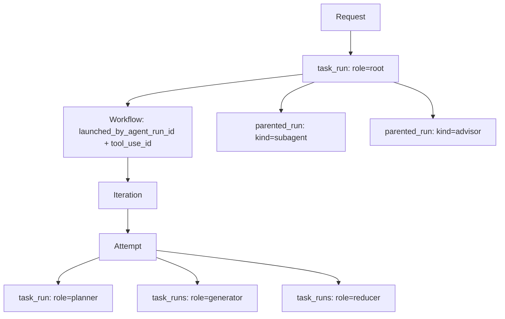
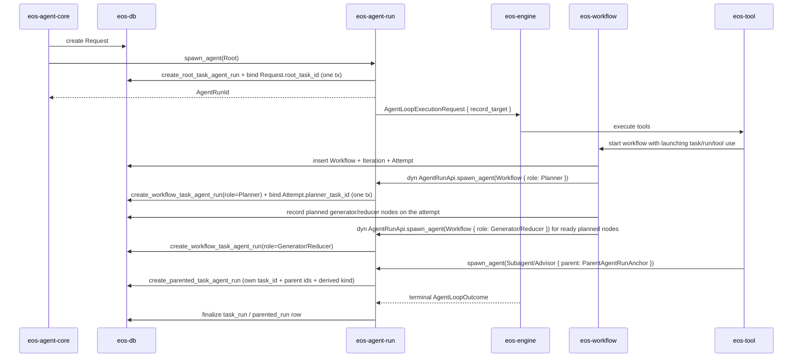

# Phase 03B - Execution Lineage and Materialization Spec

Status: Implemented for bridge-compatible v1 (end-state cleanups tracked)
Date: 2026-06-09
Owner: eos-db / eos-agent-run / eos-workflow / eos-engine / eos-agent-core

> Revised against `phase-03b-...REVIEW.md`. Incorporated: merge committed (no
> longer a migration gate); `SpawnAgentTarget`/`ParentAgentRunAnchor`/
> `SpawnAgentRequest` live in `eos-types`; `spawn_agent` returns the
> `AgentRunId` public lifecycle handle, while row creation returns task ids
> through the row-creation-local result shape; record-dir
> resolution split into an `eos-db` record-index query
> plus a pure `eos-types` path formatter; `AgentRunRecordIndex` uses the closed
> `TaskAgentRunKind` enum;
> the deep `*ExecutionTree` read model is deferred; **every run is task-backed**
> (subagent/advisor own a `task_id`, so `task_id` is non-optional everywhere);
> `needs` is plan/context data, not a spawn input or a `task_runs` column;
> redundant id duplications removed (`AgentLoopExecutionRequest.agent_run_id`,
> `TaskExecutionNode.index`, row replay snapshots, and overlapping terminal
> result projections) and derivable parent-id pairs labeled as denormalized
> indexes.
> Cross-phase cleanup with Phase 02/03: `SpawnAgentRequest.agent_run_id` and
> `persist` are removed; `AgentState` is renamed/narrowed to
> `AgentRunRuntimeSnapshot`; legacy `AgentRun` replay/terminal row fields are
> removed/collapsed. The remaining spawn bridge is root/workflow own `task_id`
> input, which disappears when row creation fully owns those ids.

## Phase Order

This phase runs after Phase 03 and before Phase 04.

Phase 04 cannot cleanly split `eos-engine` from `eos-agent-run` until the
durable execution-lineage model is explicit. This phase defines that model:
which rows are created, which crate owns each transition, which metadata reaches
the agent loop, and how record folders are derived from durable state.

## Lineage Model Summary

Durable lineage uses **two total tables**, not a nullable union plus reference
tables:

- `task_runs` is a **workflow-scheduled** unit and its 1:1 main agent run in
  **one row**. Root, planner, generator, and reducer runs are `task_runs` rows;
  `role` distinguishes them.
- `parented_runs` holds **parent-launched** subagent and advisor runs. Each run
  is itself task-backed — it owns its own `task_id` (1:1 with `agent_run_id`), a
  `status`, and an outcome, exactly like any task — but it is launched by a
  parent agent's tool call rather than by the workflow scheduler. A closed `kind`
  discriminator (`Subagent` | `Advisor`) lives on this row.

Both tables are total: every column is meaningful for every row of that table.
Every run is a `(task_id, agent_run_id)` pair; the split is purely
*workflow-scheduled* vs *parent-launched*, not *has-task* vs *no-task*. There are
no nullable-union CHECK invariants and no separate `subagent_agent_runs` /
`advisor_agent_runs` reference tables. The record folder layout, the
message/event rows, and the read-side execution tree are pure projections of
these two tables plus `workflows` / `iterations` / `attempts`.

The agent profile carries one launch/dispatch axis, `AgentType`
(`Agent` | `Subagent` | `Advisor`), owned by `eos-types`. It is orthogonal to the
lineage discriminators above and is validated at spawn. There is no `AgentRole`
on the profile: a run's workflow role is the `task_runs` `role`, not a profile
field. There is no generic standalone `agent` run; every top-level run of a
request is a root `task_run`, so `AgentType::Agent` always resolves to a
`task_runs` row.

The merge is **committed**: a task has exactly one main run (verified — retries
are attempt-level and spawn new tasks, never a second run on a live task). It is
not a migration gate. A documented contingency remains if single-run-per-task
resume is ever prioritized; see [Contingency: Task/Run Merge vs Retry Split](#contingency-taskrun-merge-vs-retry-split).

## Scope

This phase establishes:

- the durable relationship between request, task run, workflow, iteration,
  attempt, and parented run,
- task-owned (`task_runs`) and parent-owned (`parented_runs`) run rows,
- workflow launch lineage,
- the passive `AgentRunRecordTarget` passed into the engine loop, resolved from
  the typed `AgentRunRecordIndex` before engine startup,
- record path generation for `messages.jsonl` and `events.jsonl`,
- read-side materialization for request/task/workflow execution trees.

It does not move the agent loop, rename crates, or split files. Those stay in
Phase 04 after this contract exists.

## Non-Goals

- Do not create wrapper persistence objects such as `WorkflowNode`,
  `IterationNode`, or `AttemptNode`.
- Do not add nested run arrays to `task_runs` for workflows, subagents, or
  advisors.
- Subagent and advisor runs are task-backed (they own a `task_id`) but they are
  **not workflow-schedulable**: they stay `parented_runs` rows, launched by a
  parent's tool call, and never enter the planner/iteration/attempt DAG. Do not
  add them to `task_runs` or to workflow scheduling.
- Do not put engine execution, tool behavior, provider clients, or runtime
  wiring into `eos-db`.
- Do not create a second durable tree just for records. Record folders are a
  projection of execution lineage.
- Do not reintroduce a separate `tasks` table plus a 1:1 `agent_runs` table, a
  nullable-union run table, or `subagent_agent_runs` / `advisor_agent_runs`
  reference tables under the default (merged) model.
- Do not add a generic standalone `agent` run shape or a task-less
  `requests/<id>/agent-run-<id>/` layout; every top-level run is a root
  `task_run`. Do not reintroduce an `AgentRole` axis on the profile; `AgentType`
  plus the lineage `TaskRole` / `ParentedAgentRunKind` are the only classification
  inputs.

## Target Model



Rules:

| Concept | Meaning | Persistence rule |
| --- | --- | --- |
| `Request` | user intake boundary | owns `root_task_id` |
| `task_run` | schedulable unit and its 1:1 main agent run | root and workflow-role runs; `role` distinguishes them; `task_id` is the schedulable id, `agent_run_id` is the execution/record id |
| `Workflow` | workflow lifecycle | owns iterations and attempts; records `parent_task_id`, `launched_by_agent_run_id`, and `tool_use_id` |
| `Iteration` | workflow progress unit | belongs to one workflow |
| `Attempt` | one workflow attempt | names planner task id and planned generator/reducer nodes |
| `parented_run` | one parent-launched, task-backed agent-loop execution | subagent/advisor runs; own `task_id` + `agent_run_id` + `status`; carry `parent_agent_run_id` (source of truth) and `kind`; `parent_task_id` is a denormalized index |

## Durable Store Contract

The exact SQL and Rust store names follow `eos-db` conventions, but the logical
fields below are required.

### task_runs

One row per schedulable unit and its 1:1 main agent run.

| Field | Required | Meaning |
| --- | --- | --- |
| `task_id` | yes | schedulable identity; primary key |
| `agent_run_id` | yes | execution/record identity; unique; referenced by child runs and record folders |
| `request_id` | yes | request anchor for direct query and audit |
| `role` | yes | `root`, `planner`, `generator`, or `reducer` |
| `status` | yes | `pending`, `running`, `done`, `failed`, `blocked`, or `cancelled` |
| `workflow_id` | nullable | set for planner/generator/reducer rows |
| `iteration_id` | nullable | set for planner/generator/reducer rows |
| `attempt_id` | nullable | set for planner/generator/reducer rows |
| `agent_name` | yes | selected agent profile |
| `terminal_payload` | nullable | terminal tool payload snapshot; `ExecutionTaskOutcome` is derived from this where workflow context needs it |
| `token_count` | yes | run token accounting |
| `error` | nullable | terminal error string |
| timestamps | yes | `created_at`, `updated_at`, `finished_at` |

There is no `instruction`, `initial_messages`, or `message_history` column.
Model-visible input and replay history are audited through `messages.jsonl`.

There is no `needs` column. Dependency edges for generator/reducer nodes are
plan/context data on `MaterializedPlan` (used by `eos-workflow` for readiness
gating and for composing `initial_messages` from dependency outcomes before
spawn). They are neither a `task_runs` column nor a `spawn_agent` input.

Indexes and constraints:

| Constraint | Rule |
| --- | --- |
| schedulable uniqueness | `task_id` is the primary key; the 1:1 task/run identity is structural, not a UNIQUE-on-nullable trick |
| run identity | `agent_run_id` is unique |
| request index | index `request_id` |
| workflow coordinate index | index `workflow_id`, `iteration_id`, and `attempt_id` together for workflow-role rows |
| workflow role invariant | planner/generator/reducer rows require `workflow_id`, `iteration_id`, and `attempt_id` |
| root invariant | the `role=root` row must match `Request.root_task_id` |

There is no `AgentRunKind`, `run_kind`, or category column. Role is the typed
discriminator and it already lives on the row.

### parented_runs

One row per subagent/advisor run. Each run is task-backed (owns a `task_id`) but
is launched by a parent rather than scheduled by the workflow.

| Field | Required | Meaning |
| --- | --- | --- |
| `task_id` | yes | own schedulable-style identity; primary key; 1:1 with `agent_run_id` |
| `agent_run_id` | yes | execution/record identity; unique; referenced by child runs and record folders |
| `request_id` | yes | request anchor for direct query and audit |
| `status` | yes | `pending`, `running`, `done`, `failed`, `blocked`, or `cancelled` |
| `parent_agent_run_id` | yes | exact parent agent run that launched this run; **source of truth** for parent lineage |
| `parent_task_id` | yes | denormalized child-grouping index; derivable from `parent_agent_run_id` via the 1:1 invariant (Redundancy Rules R3) |
| `kind` | yes | `subagent` or `advisor`; closed two-variant discriminator |
| `tool_use_id` | nullable | model tool-use id that launched this run |
| `agent_name` | yes | selected agent profile |
| `terminal_payload` | nullable | terminal tool payload snapshot |
| `token_count` | yes | run token accounting |
| `error` | nullable | terminal error string |
| timestamps | yes | `created_at`, `finished_at` |

The parented `task_id` has no natural workflow-derived id rule (root/planner use
`Request.root_task_id` / `{attempt}:planner`; generator/reducer use
`{attempt}:gen|red:{plan_node_id}`). Derive it deterministically from the launch —
`{parent_agent_run_id}:sub:{tool_use_id}` / `:adv:{tool_use_id}` — so ids stay
predictable for audit and tests.

Indexes and constraints:

| Constraint | Rule |
| --- | --- |
| schedulable-style identity | `task_id` is the primary key; 1:1 with `agent_run_id` |
| run identity | `agent_run_id` is unique |
| parent index | index `parent_agent_run_id` (source of truth) and `parent_task_id` (denormalized grouping) together |
| request index | index `request_id` |
| kind is closed | `kind` is the `ParentedAgentRunKind` enum; it is not a free string and it is not on `task_runs` |

`kind` is the durable subagent-vs-advisor discriminator. It lives on the
parent-owned row, not on the shared task lifecycle row, so it never becomes an
engine-readable classification flag (see Forbidden engine input). The category
is also derivable from `tool_use_id` to the originating tool call (`run_subagent`
vs `ask_advisor`); persisting `kind` denormalizes that derivable fact onto the
one row that owns the launch, which is the only row record-dir resolution reads
for the subagent/advisor folder choice. Do not split this into two reference
tables.

### workflows

Add or preserve these launch-lineage columns:

| Field | Required | Meaning |
| --- | --- | --- |
| `id` | yes | `WorkflowId` |
| `request_id` | yes | request anchor |
| `launched_by_agent_run_id` | yes | agent run that executed the workflow tool call; **source of truth** for launch lineage; the `list_open_delegated_workflows_for_agent_run` query key |
| `parent_task_id` | yes | denormalized child-grouping index for `workflow_ids` materialization; derivable from `launched_by_agent_run_id` via the 1:1 invariant (Redundancy Rules R4) |
| `tool_use_id` | nullable | exact model tool-use id that launched the workflow |
| lifecycle fields | existing | workflow status, iteration ids, attempt ids |

The `WorkflowApi::list_open_delegated_workflows_for_agent_run` implementation
must query by `launched_by_agent_run_id`. It must not accept an agent-run id and
then ignore it; the launching run is now a durable column, so the query is
exact.

### attempts and planned nodes

`Attempt` keeps its planner task id and carries the planned generator/reducer
nodes that have not yet been admitted to run. Planned nodes live on the
materialized plan, not as `task_runs` rows:

| Attempt-owned data | Meaning |
| --- | --- |
| planner task id | the planner `task_runs` row id bound when the planner is admitted |
| `MaterializedPlan.generators` | planned generator nodes with `plan_node_id` and spawn input |
| `MaterializedPlan.reducers` | planned reducer nodes with `plan_node_id` and spawn input |

A `task_runs` row for a generator/reducer exists only after its planned node is
admitted. Until then the node is found through the plan.

## Task-Agent-Run Creation and Record Index Contracts

`eos-types` owns passive DTOs that name where a task-backed agent run sits in the
request execution tree.

### Record Index

`AgentRunRecordIndex` is the **input** to record-dir
resolution; it is not passed to the engine. Its `kind` is a **closed enum**, not
a flat optional-id bag: root task, workflow task, and parented task-agent-run
shapes are structural, mirroring `SpawnAgentTarget`.

```rust
pub struct AgentRunRecordIndex {
    pub request_id: RequestId,
    pub agent_run_id: AgentRunId,
    pub task_id: TaskId,            // shared, non-optional: every run is task-backed
    pub kind: TaskAgentRunKind,
}

pub enum TaskAgentRunKind {
    Root,
    Workflow {
        workflow: WorkflowCoordinates,
        role: WorkflowTaskRole,
    },
    Parented {
        parent_agent_run_id: AgentRunId,    // source of truth for the enclosing path
        kind: ParentedAgentRunKind,         // chooses subagents/ vs advisors/
    },
}

pub struct WorkflowCoordinates {
    pub workflow_id: WorkflowId,
    pub iteration_id: IterationId,
    pub attempt_id: AttemptId,
}
```

### Creation Result

`CreatedTaskAgentRun` is the row-creation-local result of the concrete
task-agent-run row creation operation. It returns the minted ids and the
pre-resolved record target together without making the public `spawn_agent`
contract return a broad result wrapper, echoing the input classification, or
duplicating record-target anchors.

```rust
pub struct CreatedTaskAgentRun {
    pub agent_run_id: AgentRunId,
    pub task_id: TaskId,
    pub record_target: AgentRunRecordTarget,
}
```

The closed shape may not be weakened back into a flat optional bag. `task_id` is
shared and non-optional because every run (including subagent/advisor) is
task-backed. Use `TaskAgentRunKind` for the Rust-facing classification; do not
use names like `RunLineage`, `RunCommon`, `AgentRunRecordLocus`,
`ExecutionLineageStore`, or `admit_run`.
`tool_use_id` is **not** on this DTO — no record path segment uses it; it is a
row-creation fact persisted on `parented_runs` / `workflows`, not a record-dir
input.

Terminology:

| Term | Meaning |
| --- | --- |
| `task_id` | the run's own task id (always present) |
| `TaskAgentRunKind::Root` | root task-agent-run for the request |
| `TaskAgentRunKind::Workflow.role` | `WorkflowTaskRole` for the workflow task-agent-run, used to choose the role folder |
| `TaskAgentRunKind::Workflow.workflow` | workflow coordinates for planner/generator/reducer |
| `Parented.parent_agent_run_id` | exact parent agent run that launched this run; resolves the enclosing path |
| `Parented.kind` | `Subagent` or `Advisor`; chooses `subagents/` vs `advisors/` |

## Creation Flow



`eos-workflow` calls `spawn_agent` only through the injected
`eos-types::AgentRunApi` API contract (called as a `dyn` trait object); it has
**no crate edge** to `eos-agent-run`. `eos-agent-core` wires the concrete run
service as that API implementation.

Creation rules:

| Event | Owner | Required write |
| --- | --- | --- |
| user request accepted | `eos-agent-core` runtime through `eos-db` | `Request` row only |
| root agent spawned | `eos-agent-run` | `create_root_task_agent_run`: root `task_run` row and `Request.root_task_id` binding in one transaction |
| task-agent-run enters main loop | `eos-agent-run` | `task_run` row with `request_id`, `role`, and any workflow coordinates |
| workflow tool accepted | `eos-workflow` | `Workflow` with `launched_by_agent_run_id` (source of truth), denormalized `parent_task_id`, and optional `tool_use_id` |
| workflow attempt starts planner work | `eos-agent-run` via `dyn AgentRunApi`, called by `eos-workflow` | `create_workflow_task_agent_run`: planner `task_run` and `Attempt.planner_task_id` in one transaction |
| workflow plan materializes role work | `eos-workflow` | planned generator/reducer nodes and spawn input on the attempt; no `task_runs` rows or task ids yet |
| workflow role task enters main loop | `eos-agent-run` via `dyn AgentRunApi` | `create_workflow_task_agent_run`: generator/reducer `task_run` with workflow coordinate fields |
| subagent tool accepted | `eos-agent-run` through `eos-tool` caller | `create_parented_task_agent_run`: `parented_run` with own `task_id`; `ParentAgentRunAnchor` maps to parent ids; `kind` is derived as `Subagent` |
| advisor tool accepted | `eos-agent-run` through `eos-tool` caller | `create_parented_task_agent_run`: `parented_run` with own `task_id`; `ParentAgentRunAnchor` maps to parent ids; `kind` is derived as `Advisor` |
| loop finishes | `eos-agent-run` | terminal run status and final outcome fields |

Atomicity is structural, not orchestrated. Because the `eos-db` store that owns
`requests` also owns `task_runs`, root and planner task-agent-run row creation are single
transactions in one store. There is no cross-store transaction threading, because
the task and its main run are one row. (This removes a genuine current gap: today
`tasks` and `agent_runs` are written through two separate non-transactional
repositories, so atomic task+run row creation is not expressible.)

## Agent Run Spawn Contract

`eos-agent-run` owns task-agent-run row creation (the durable row writes) inside its
implementation of `spawn_agent`. The `spawn_agent` **contract** — the
`AgentRunApi` trait plus the `SpawnAgentTarget` / `SpawnAgentRequest` types it
consumes — lives in `eos-types`, so `eos-workflow` can construct
`SpawnAgentTarget::Workflow { role: WorkflowTaskRole::Planner, .. }` and call
that API without a crate edge to `eos-agent-run`. The public lifecycle return is
the `AgentRunId`; task ids stay inside row creation and record-target
resolution. There is no standalone `create_task`, `create_agent_task`, or
`create_agent_tasks` method.

The DB-facing row creation operations are named by the exact task-agent-run row
shape they create. Do not introduce a generic `admit_run` operation:

```rust
async fn create_root_task_agent_run(...) -> Result<CreatedTaskAgentRun, CoreError>;
async fn create_workflow_task_agent_run(...) -> Result<CreatedTaskAgentRun, CoreError>;
async fn create_parented_task_agent_run(...) -> Result<CreatedTaskAgentRun, CoreError>;
```

```rust
// in eos-types (the AgentRunApi contract)
pub enum SpawnAgentTarget {
    Root {
        request_id: RequestId,
        task_id: TaskId,                // bridge: existing root task until row creation moves here
    },
    Workflow {
        request_id: RequestId,
        task_id: TaskId,                // bridge: existing workflow task until row creation moves here
        workflow: WorkflowCoordinates,
        role: WorkflowTaskRole,
    },
    Subagent {
        parent: ParentAgentRunAnchor,
    },
    Advisor {
        parent: ParentAgentRunAnchor,
    },
}

pub struct ParentAgentRunAnchor {
    pub request_id: RequestId,
    pub parent_task_id: TaskId,
    pub agent_run_id: AgentRunId,       // parent agent-run id
}

pub struct SpawnAgentRequest {
    pub agent_name: AgentName,
    pub target: SpawnAgentTarget,
    pub initial_messages: Vec<Message>, // for generator/reducer, already composed from dependency outcomes
    pub tool_use_id: Option<ToolUseId>,  // durable launch fact; not a record-dir input
    // sandbox/workspace/model/cancellation inputs
}

```

`SpawnAgentTarget` makes each launch shape a closed choice. Root/workflow targets
cannot accidentally carry parent anchors; subagent/advisor targets cannot forget
their parent anchor; and `ParentedAgentRunKind` is derived from the `Subagent` or
`Advisor` variant instead of passed as a separate field.

Current bridge: root/workflow targets still carry an existing `task_id` because
the concrete `create_root_task_agent_run` / `create_workflow_task_agent_run`
row-creation operations have not landed yet. End-state rule: a run **never**
names its own `task_id` on input; the own `task_id` is row-creation output,
returned by `CreatedTaskAgentRun` while the public spawn API keeps returning
`AgentRunId`. At that point the only parent task id crossing into `spawn_agent`
is `ParentAgentRunAnchor.parent_task_id`. The current code may also accept an
optional caller-provided `agent_run_id`; that is bridge-only. The target
row-creation path mints the run id and returns it through the public
`AgentRunId` handle.
Dependency edges (`needs`) are not a spawn input; `eos-workflow` resolves
dependency context into `initial_messages` before the call. `tool_use_id` stays
on `SpawnAgentRequest` as a row-creation fact for workflow/parented launches
where available; it is not part of `SpawnAgentTarget`, `CreatedTaskAgentRun`,
`AgentRunRecordIndex`, or `AgentRunRecordTarget`.

Rules:

| Rule | Reason |
| --- | --- |
| `Root` calls `create_root_task_agent_run` and binds `Request.root_task_id` in one transaction | root bootstrap is one atomic write, not a partial-write sequence in request entry |
| `Workflow { role: Planner, .. }` calls `create_workflow_task_agent_run` and binds `Attempt.planner_task_id` in one transaction | an attempt with a planner row but no planner binding is invalid |
| `Workflow { role: Generator/Reducer, .. }` calls `create_workflow_task_agent_run` when the scheduler admits the planned node | unlaunched plan nodes do not need pending rows |
| generated ids use the existing root/planner/generator/reducer id rules | stable ids remain predictable for audit and tests |
| planner submission records planned generator/reducer nodes on the attempt | workflow can materialize the DAG without creating run rows early |
| callers pass workflow decisions; `eos-agent-run` persists run rows at spawn | workflow topology stays in `eos-workflow`; row creation is unified |
| `spawn_agent` may load parent request/workflow/attempt rows only to validate invariants | validation is allowed; workflow lifecycle decisions are not |
| `Subagent` / `Advisor` calls `create_parented_task_agent_run` for a `parented_run` with its **own** row-created `task_id` | subagent/advisor runs are task-backed but parent-launched, not workflow-schedulable |
| `CreatedTaskAgentRun.task_id` is present for every target | every run is task-backed; record resolution does not re-derive task ids after row creation |
| `SpawnAgentRequest` has no caller-supplied `agent_run_id` or `persist` flag in the target contract | id minting and persistence policy are lifecycle-owned |
| compatibility `agent_runs.task_id` is populated only for root/workflow rows that still reference legacy `tasks(id)` | parented run task ids live in `parented_runs.task_id`; copying them into the legacy FK breaks advisor/subagent spawn |
| end-state `SpawnAgentTarget` has no `Existing { task_id }`; the current bridge carries root/workflow task ids only until row creation moves into `eos-agent-run` | every spawn should eventually own its own row creation; the run should not name its own task id |
| `ParentAgentRunAnchor.agent_run_id` is the parent source of truth; `request_id` and `parent_task_id` are validated/denormalized parent indexes | parented rows stay queryable by request and parent task without making those fields the lineage source of truth |
| generator/reducer `needs` are not a spawn input | dependency edges are plan/context data resolved into `initial_messages` by `eos-workflow` before the call |
| `SpawnAgentTarget` carries only the closed launch shape | rows do not duplicate model prompt content or record-dir-only facts |
| every spawn provides non-empty `initial_messages` | this is the single loop input for task-owned and parent-owned runs |
| rows do not store instruction text | model-visible intent is audited through `messages.jsonl` |

Forbidden ownership:

| Do not put in `eos-agent-run` | Owner |
| --- | --- |
| workflow start policy | `eos-workflow` |
| iteration continuation policy | `eos-workflow` |
| attempt retry/budget policy | `eos-workflow` |
| planner DAG validation | `eos-workflow` |
| provider stream execution | `eos-engine` |
| concrete tool behavior | `eos-tool` |

Task-agent-run row creation:

```text
spawn_agent(Root)
  -> create_root_task_agent_run: insert root task_run; bind Request.root_task_id; commit
  -> pass initial_messages to the engine
  -> return AgentRunId

spawn_agent(Workflow { role: Planner, .. })
  -> create_workflow_task_agent_run: insert planner task_run; bind Attempt.planner_task_id; commit
  -> pass initial_messages to the engine
  -> return AgentRunId

spawn_agent(Workflow { role: Generator | Reducer, .. })
  -> create_workflow_task_agent_run: insert generator/reducer task_run with workflow coordinates
  -> pass initial_messages to the engine
  -> return AgentRunId

spawn_agent(Subagent { parent } | Advisor { parent }) with tool_use_id on SpawnAgentRequest
  -> derive own task_id (e.g. {parent.agent_run_id}:sub|adv:{tool_use_id})
  -> create_parented_task_agent_run: insert parented_run with own task_id + parent ids + kind derived from the variant
  -> pass initial_messages to the engine
  -> return AgentRunId
```

Because generator/reducer rows are not inserted until spawn, `MaterializedPlan`
persists the planned spawn **inputs** (`plan_node_id`,
`agent_name`, `needs`, and the goal/scope needed to compose `initial_messages`).
`needs` is plan-owned here — it drives readiness gating and the composition of
`initial_messages`, and is **not** copied to a `task_runs` column or passed to
`spawn_agent`. `MaterializedPlan` does not store a rendered prompt and does not
rely on pending rows. The actual `initial_messages` are composed when the node is
admitted, which is the only point at which a reducer's dependency outcomes exist.

### Agent type launch validation

`eos-agent-run` resolves the launched profile's `eos-types::AgentType` and
rejects a mismatch with a `WrongAgentType` error. `AgentType` is the only profile
launch axis; the lineage discriminators (`TaskRole`, `ParentedAgentRunKind`) are
validated against it:

| `SpawnAgentTarget` | Required `AgentType` |
| --- | --- |
| `Root` / `Workflow { role: Planner/Generator/Reducer, .. }` | `Agent` |
| `Subagent { .. }` | `Subagent` |
| `Advisor { .. }` | `Advisor` |

There is no generic standalone `agent` launch: `AgentType::Agent` is always a
`task_runs` row, never a task-less request-level run. Behavior that previously
keyed off a profile `AgentRole` (the planner generator-capability check,
context-recipe selection) reads the admitted `TaskRole`, so an `agent`-type
profile is not pinned to one workflow role.

## Task-Run Class Contract

`task_runs` is the persisted executable unit and its main agent run. It is not
the workflow tree and it is not a planned-but-unspawned node.

```rust
pub struct TaskRun {
    pub task_id: TaskId,
    pub agent_run_id: AgentRunId,
    pub request_id: RequestId,
    pub role: TaskRole,            // Root | Planner | Generator | Reducer
    pub status: TaskStatus,        // Pending|Running|Done|Failed|Blocked|Cancelled
    pub workflow_id: Option<WorkflowId>,
    pub iteration_id: Option<IterationId>,
    pub attempt_id: Option<AttemptId>,
    pub agent_name: AgentName,
    // no `needs`: dependency edges live on MaterializedPlan/PlannedNode
    // no `initial_messages` / `message_history`: messages.jsonl is canonical
    pub terminal_payload: Option<JsonObject>,
    pub token_count: i64,
    pub error: Option<String>,
    pub created_at: UtcDateTime,
    pub updated_at: UtcDateTime,
    pub finished_at: Option<UtcDateTime>,
}
```

Under the target flow, root and planner rows are created as running rows at
spawn. Generator/reducer rows are created only when their planned node is
admitted to run. A materialized workflow plan may therefore contain planned
generator/reducer nodes that do not yet have `task_runs` rows.

## Parented-Run Class Contract

`parented_runs` is the persisted subagent/advisor run. It is task-backed (owns a
`task_id`, 1:1 with `agent_run_id`) but parent-launched, not workflow-scheduled.

```rust
pub struct ParentedRun {
    pub task_id: TaskId,                // own task id (distinct from parent_task_id)
    pub agent_run_id: AgentRunId,
    pub request_id: RequestId,
    pub status: TaskStatus,             // Pending|Running|Done|Failed|Blocked|Cancelled
    pub parent_agent_run_id: AgentRunId, // source of truth for parent lineage
    pub parent_task_id: TaskId,         // denormalized grouping index (R3)
    pub kind: ParentedAgentRunKind,     // Subagent | Advisor
    pub tool_use_id: Option<ToolUseId>,
    pub agent_name: AgentName,
    // no `initial_messages` / `message_history`: messages.jsonl is canonical
    pub terminal_payload: Option<JsonObject>,
    pub token_count: i64,
    pub error: Option<String>,
    pub created_at: UtcDateTime,
    pub finished_at: Option<UtcDateTime>,
}

pub enum ParentedAgentRunKind {
    Subagent,
    Advisor,
}
```

`ParentedAgentRunKind` is the durable projection of the parented `AgentType`s:
`Subagent` maps to `AgentType::Subagent` and `Advisor` to `AgentType::Advisor`.
It is set from the launching tool (`run_subagent` / `ask_advisor`) and must equal
the launched profile's `AgentType`; `eos-agent-run` rejects a mismatch. There is
no `Agent` variant, because a parented run is never the generic profile class.

## Agent Loop Input Contract

`eos-agent-run` creates the durable run row before the engine loop starts. The
engine receives one passive, pre-resolved record target. It does not receive the
full lineage coordinate set and it does not choose the record-folder layout.

Allowed engine input:

```rust
pub struct AgentLoopExecutionRequest {
    pub record_target: AgentRunRecordTarget,   // carries agent_run_id; no duplicate top-level field (R1)
    // prompt, model, tools, cancellation, event sink, and runtime inputs
}

pub struct AgentRunRecordTarget {
    pub request_id: RequestId,
    pub agent_run_id: AgentRunId,
    pub task_id: TaskId,           // non-optional: every run is task-backed
    pub record_dir: AgentRunRecordDir,
}

pub struct AgentRunRecordDir(/* normalized, request-rooted record directory */);
```

`AgentLoopExecutionRequest` does not carry a top-level `agent_run_id`; it reads
`record_target.agent_run_id` (the run id appeared twice before — Redundancy Rules
R1). `AgentRunRecordDir` is produced by the resolver (an `eos-db` record-index query
feeding a pure `eos-types` path formatter) from the `AgentRunRecordIndex` before
engine startup. It is not caller-provided metadata. The engine writes into this
directory and the four anchors (`request_id`, `agent_run_id`, `task_id`,
`record_dir`) into each row; it does not decide whether a parented run belongs
under `subagents/` or `advisors/`.

`AgentRunRecordTarget` is the only record DTO that crosses into the engine. The
lineage coordinates that resolve `record_dir` stay in `AgentRunRecordIndex`,
consumed by the resolver. The engine is not handed both the index and a
near-duplicate target.

Forbidden engine input:

| Do not pass | Reason |
| --- | --- |
| active-run registry handles | owned by `eos-agent-run` |
| lifecycle finalization callbacks | finalization is one terminal handoff from engine to run |
| DB mutation handles for run status | run lifecycle writes stay in `eos-agent-run` |
| record-folder classification strings | the record dir is typed and pre-resolved |
| subagent/advisor classification flags | the record directory is resolved before engine startup |
| the full `AgentRunRecordIndex` | the engine needs the resolved `record_dir` and four anchors, not the lineage coordinate set |
| a generic metadata bag with resource wiring | metadata is facts only, not dependency injection |

## Record Layout Contract

The normal production layout is request-rooted and generated from persisted
lineage.

```text
requests/<request_id>/
  root-task-<task_id>/
    agent-run-<agent_run_id>/
      messages.jsonl
      events.jsonl
      workflows/
        workflow-<workflow_id>/
          iteration-<iteration_id>/
            attempt-<attempt_id>/
              planner-task-<task_id>/agent-run-<agent_run_id>/
                messages.jsonl
                events.jsonl
              generator-task-<task_id>/agent-run-<agent_run_id>/
                messages.jsonl
                events.jsonl
              reducer-task-<task_id>/agent-run-<agent_run_id>/
                messages.jsonl
                events.jsonl
      subagents/subagent-run-<agent_run_id>/
        messages.jsonl
        events.jsonl
      advisors/advisor-run-<agent_run_id>/
        messages.jsonl
        events.jsonl
```

Rules:

Resolution is split into two responsibilities (Review §2.2): the **record-index
query** (walk durable rows → coordinates → `AgentRunRecordIndex`) is owned by
`eos-db`; the **path format** (coordinates → the request-rooted string) is a pure
`fn format_record_dir(&AgentRunRecordIndex) -> AgentRunRecordDir` owned by
`eos-types`, co-located with the record-layout contract (precedent:
`parse_markdown_frontmatter` is a pure `eos-types` function). The path-segment
literals (`requests/`, `root-task-`, `subagents/`, `advisors/`, …) live only in
that formatter — never in `eos-engine` and never inline in `eos-db` SQL.

| Rule | Owner |
| --- | --- |
| `messages.jsonl` / `events.jsonl` are plural | `eos-engine` records |
| coordinates resolved from durable rows | `eos-db` record-index query |
| coordinates formatted into the path string | pure `eos-types::format_record_dir` |
| root path uses `Request.root_task_id` | `eos-db` query → `eos-types` format |
| workflow paths use workflow coordinate fields on `task_runs` | `eos-db` query → `eos-types` format |
| parented paths use `parented_runs.parent_agent_run_id` (source of truth) + `kind` | `eos-db` query → `eos-types` format |
| a parented run's enclosing path is derived from `parented_runs.parent_agent_run_id` | durable lineage, **not** a filesystem scan |
| no filesystem scan resolves ANY path — parent, workflow-root, or read-side | the legacy `find_*_dir` / `resolve_agent_run` scans are all replaced by lineage |
| records do not reconstruct hierarchy from ad hoc callsite strings | `eos-engine` records consume `AgentRunRecordTarget` |
| `parents-missing/` is not part of the normal production path | parent lineage is a durable row that exists before the child row is admitted |
| there is no task-less `requests/<id>/agent-run-<id>/` layout | every top-level run is a root `task_run`; the generic `Agent` record-layout variant is removed |

`parents-missing/` is removed. Because `parented_runs.parent_agent_run_id` is a
durable column written when the parented row is created, the enclosing path is resolved from
lineage, not by scanning the filesystem for the parent's directory. The same
applies to the current workflow-root scan (`find_root_agent_dir`) and the
read-side `resolve_agent_run` scan: all three are replaced by lineage queries.
If a repair/debug fallback for orphaned rows is retained, it must be isolated
from the normal writer path, must emit a hard diagnostic event, and must not be
used to satisfy acceptance tests.

### messages.jsonl Rows

Each row represents one model-visible message or message delta committed to the
record.

Required base fields:

| Field | Meaning |
| --- | --- |
| `sequence` | monotonic sequence within one agent run |
| `timestamp` | write time |
| `request_id` | request anchor |
| `agent_run_id` | run anchor |
| `task_id` | task anchor; always present (every run is task-backed) |
| `role` | system, user, assistant, or tool |
| `message` | serialized provider-neutral message payload |
| `tool_use_id` | set when the row belongs to a tool call/result |

### events.jsonl Rows

Each row represents one audit or lifecycle event visible to record readers.

Required base fields:

| Field | Meaning |
| --- | --- |
| `sequence` | monotonic event sequence within one agent run |
| `timestamp` | write time |
| `request_id` | request anchor |
| `agent_run_id` | run anchor |
| `task_id` | task anchor; always present (every run is task-backed) |
| `event_type` | node_started, messages_initialized, agent_run_started, subagent_started, advisor_started, turn_started, tool_started, tool_finished, workflow_started, node_finished, or record_error |
| `payload` | event-specific structured payload |

`subagent_started`, `advisor_started`, and `workflow_started` events must
include the run or workflow ids they announce. The durable DB row is still the
source of truth; the event row is the audit trail.

## Materialized Read Model

The database stores normalized lineage. `eos-agent-core` exposes the read-side
execution tree through an execution-tree reader; the nested DTOs live with that
reader, not in
`eos-types`. `eos-types` owns only the flat `TaskExecutionIndex`, which is the
load-bearing child-id surface (it also drives record-path generation).

Flat index, owned by `eos-types`:

```rust
pub struct TaskExecutionIndex {
    pub task_id: TaskId,
    pub agent_run_id: AgentRunId,
    pub workflow_ids: Vec<WorkflowId>,
    pub subagent_ids: Vec<AgentRunId>,
    pub advisor_ids: Vec<AgentRunId>,
}
```

v1 node, owned by the `eos-agent-core` execution-tree reader (the deep
`*ExecutionTree` types are **deferred** — Review §3.2 — until a reader needs the
recursive walk):

```rust
pub struct RequestExecutionTree {
    pub request: Request,
    pub root: TaskExecutionNode,
}

pub struct TaskExecutionNode {
    pub task_run: TaskRun,                  // the task AND its main run (merged); carries task_id + agent_run_id
    pub subagents: Vec<ParentedRun>,        // their agent_run_ids are the subagent ids
    pub advisors: Vec<ParentedRun>,         // their agent_run_ids are the advisor ids
    pub workflow_ids: Vec<WorkflowId>,      // ids only; caller fetches the workflow tree on demand
}
```

`TaskExecutionNode` does **not** embed a `TaskExecutionIndex` field (Review R2):
its ids are already on `task_run`, and `subagents`/`advisors`/`workflow_ids`
already expand the child surface, so an embedded index would be pure duplication.
`TaskExecutionIndex` stays a standalone `eos-types` type for the cheap flat query
(it also drives record-path generation); it is not nested inside the hydrated
node.

`TaskExecutionNode.task_run` is the merged task and main run; there is no
separate `main_agent_run: Option<AgentRun>` field, because the task and its 1:1
run are one row that is always present once the node is spawned. The "node
without a run yet" state is the planned generator/reducer case, surfaced through
the workflow plan, not by an optional run on a spawned node.

The tree is bounded: `workflow_ids` are ids only, matching the v1 read
requirement of one task level plus subagents and advisors. The deferred
`WorkflowExecutionTree` / `IterationExecutionTree` / `AttemptExecutionTree` /
`PlanNodeView` types are added only when a consumer needs the deep workflow walk;
the `eos-db` record-index query already returns enough to reconstruct them later.

Materialization sources:

| Index field | Source |
| --- | --- |
| `agent_run_id` | `task_runs.agent_run_id` for `task_id` |
| `workflow_ids` | `workflows.parent_task_id = task_id` |
| `subagent_ids` | `parented_runs.parent_task_id = task_id AND kind = Subagent` |
| `advisor_ids` | `parented_runs.parent_task_id = task_id AND kind = Advisor` |

`workflow_ids` are not created by `spawn_agent`. They are created by
`eos-workflow` when a workflow is accepted, because only the workflow service
owns workflow lifecycle, iteration creation, attempt creation, and workflow
policy. `spawn_agent` can later create planner/generator/reducer rows for that
workflow, but it does not create the workflow row itself.

Rules:

| Rule | Reason |
| --- | --- |
| materialization is read-side only | avoids duplicating workflow/task ownership |
| `TaskExecutionIndex` is derived, not stored on `task_runs` | keeps the row flat while giving audit and UI a stable child-id surface |
| the execution-tree reader does not store workflow/iteration/attempt wrapper nodes | `Workflow`, `Iteration`, and `Attempt` already own those identities |
| subagent/advisor runs appear under the parent task node | they are `parented_runs`, not scheduled tasks |
| `TaskExecutionNode` does not embed a `TaskExecutionIndex` field | its ids and child lists are already present; an index field would duplicate them (R2) |
| the v1 node carries `workflow_ids` only; the deep workflow tree is deferred | eager unbounded recursion is not required for v1 |
| ordering is deterministic | stable audit and UI rendering |

## Crate Ownership

| Crate | Owns | Must not own |
| --- | --- | --- |
| `eos-types` | passive ids, DTOs, `AgentType`, the `AgentRunApi` contract + `SpawnAgentTarget`/`SpawnAgentRequest`/`ParentAgentRunAnchor`, `TaskAgentRunKind`, `AgentRunRecordIndex`, `AgentRunRecordTarget`, `TaskExecutionIndex`, `ParentedAgentRunKind`, the pure `format_record_dir` formatter | DB queries, lifecycle behavior, I/O, or the nested execution-tree reader |
| `eos-db` | migrations, constraints, repository queries, the **record-index query** that resolves coordinates (feeding `eos-types::format_record_dir`), materialization queries | engine loop, tool behavior, or path-string formatting |
| `eos-agent-run` | task-agent-run row creation at spawn via `create_root_task_agent_run`, `create_workflow_task_agent_run`, and `create_parented_task_agent_run` using injected store traits, run finalization, record-index validation, `AgentType` launch-class validation; implements `eos-types::AgentRunApi` | the `SpawnAgentTarget` type definitions (they live in `eos-types`), workflow lifecycle, planner DAG policy, record path formatting, or generic `admit_run` wrappers |
| `eos-workflow` | workflow/iteration/attempt lifecycle, planner DAG validation, planned spawn input (incl. `needs`), workflow launch lineage; spawns via `dyn AgentRunApi` | direct run-row writes, an `eos-agent-run` crate edge, or agent-loop execution |
| `eos-engine` | execution loop, provider stream handling, tool dispatch, and terminal `AgentLoopOutcome` production | run-row lifecycle ownership, record-dir resolution, path formatting, or durable record ownership |
| `eos-agent-core` | request creation, call into `spawn_agent(Root)`, wiring concrete `eos-db` stores and `AgentRunApi` implementations, public read-side execution-tree reader (`TaskExecutionNode`) | direct run-row writes or normalized workflow persistence internals |
| `eos-tool` | passes typed launch facts for workflow/subagent/advisor tools, including `ParentAgentRunAnchor` and tool-use ids where needed | durable lineage derivation |

Temporal seam. The active record writer is `eos-agent-run::records`; the retired
`eos-agent-message-records` crate stays folded into the run lifecycle owner, not
into `eos-engine`. The engine consumes loop inputs and returns outcomes; the
runner owns record handles and durable record lifecycle.

## Redundancy Rules

- Use two total tables (`task_runs`, `parented_runs`); do not reintroduce a
  nullable-union run table, a separate 1:1 `tasks` plus `agent_runs`, or
  `subagent_agent_runs` / `advisor_agent_runs` reference tables under the
  default model.
- Do not maintain a separate record hierarchy independent of DB lineage.
- Pass the engine only `AgentRunRecordTarget`; do not also pass the full
  `AgentRunRecordIndex`. The index is the resolver input; the target is the
  engine contract.
- Do not pass `record_kind` strings to the engine; record-folder choice is
  resolved into `record_dir` before engine startup.
- Do not introduce target API names that combine `Message` and `Record`. Use
  `AgentRunRecordTarget`, sibling-facing `RecordService`, `records_root`, or
  `record_dir` when a name is needed; never `AgentRunMessageRecordKind`,
  `MessageRecordService`, or `message_records`.
- Do not add `instruction`, `initial_messages`, or `message_history` columns to
  `task_runs` / `parented_runs`; `initial_messages` is spawn input and
  `messages.jsonl` is the replay/audit record.
- Do not duplicate planned generator/reducer ids as `task_runs` rows; planned
  nodes live in `MaterializedPlan` until `spawn_agent` admits them.
- Do not persist child arrays on `task_runs`; `agent_run_id`, `workflow_ids`,
  `subagent_ids`, and `advisor_ids` belong to the derived `TaskExecutionIndex`.
- Do not store `needs` on `task_runs` or pass it to `spawn_agent`; dependency
  edges are `MaterializedPlan`/`PlannedNode` data used for readiness gating and
  for composing `initial_messages` before the call (fix #7).
- The only parent task id input to `spawn_agent` is
  `ParentAgentRunAnchor.parent_task_id`; a run never names its own `task_id`
  after row creation moves fully into `eos-agent-run` (it is row-creation output
  in `CreatedTaskAgentRun`).
- Denormalized `request_id` on `task_runs`, `parented_runs`, and `workflows` is
  required, not optional; it is the audit/query anchor and the only way to
  locate a parented run by request.
- `kind` on `parented_runs` is the only category discriminator; do not add a
  category column to `task_runs`.
- Use `TaskAgentRunKind` for the Rust-facing root/workflow/parented run shape;
  do not use `RunLineage`, `RunCommon`, `AgentRunRecordLocus`,
  `ExecutionLineageStore`, or `admit_run`.

Resolved redundancies (from the review's Round 2 audit; ids are stable references):

| # | Field | Decision |
| --- | --- | --- |
| R1 | `AgentLoopExecutionRequest.agent_run_id` | **removed** — duplicated `record_target.agent_run_id`; the engine reads it from the target |
| R2 | `TaskExecutionNode.index` | **removed** — duplicated `task_run` ids + `subagents`/`advisors`/`workflow_ids`; `TaskExecutionIndex` stays a standalone flat-query type only |
| R3 | `parented_runs.parent_task_id` | **kept as a labeled denormalized grouping index**; `parent_agent_run_id` is the source of truth (derivable via the 1:1 invariant) |
| R4 | `workflows.parent_task_id` | **kept as a labeled denormalized grouping index**; `launched_by_agent_run_id` is the source of truth and the `list_open_delegated_workflows_for_agent_run` key |
| R5 | `initial_messages` / `message_history` row columns | **removed** — `messages.jsonl` is canonical for model input and replay |
| R6 | `outcomes` + `terminal_tool_result` | **collapsed** into one `terminal_payload`; workflow-specific `ExecutionTaskOutcome` is derived where workflow context needs it |

## Contingency: Task/Run Merge vs Retry Split

The committed model merges a task and its 1:1 main run into one `task_runs` row.
This removes a table, removes the cross-store atomic row-creation requirement, and
removes the "task present, run absent" inconsistency class. It holds only while
a task has exactly one main run.

| If multi-run-per-task retries are… | Then |
| --- | --- |
| not near-term (default) | keep `task_runs`; row creation is a single-store transaction; `agent_run_id` is a unique column on the row |
| near-term | split `task_runs` into `tasks` plus `agent_runs` (with a `task_execution_id` and non-unique `task_id`); root/planner row creation becomes a multi-write transaction across the task and run stores |

This is a contingency note, not a migration gate. The split would affect only
the `task_runs` section and the row-creation atomicity. The
`parented_runs` table, the record layout, the read model, and every other
contract in this spec are identical across both branches.

## Migration Steps

1. Add passive `SpawnAgentTarget`, `ParentAgentRunAnchor`, `TaskAgentRunKind`,
   `AgentRunRecordIndex`,
   `AgentRunRecordTarget`, `AgentRunRecordDir`, `TaskExecutionIndex`, and
   `ParentedAgentRunKind` DTOs in `eos-types`; rename the `Task`/`AgentRun` DTOs into
   the merged `TaskRun` and the new `ParentedRun`.
2. Add the `eos-db` migration: `task_runs` and `parented_runs` tables, the
   `workflows` launch-lineage columns, and focused repository tests.
3. Extend `MaterializedPlan` to persist planned generator/reducer spawn inputs
   keyed by `plan_node_id` without inserting `task_runs` rows.
4. Keep `spawn_agent` as `SpawnAgentTarget` input and `AgentRunId` output; keep
   task id exposure inside row creation and record-target resolution. The
   bridge-only `SpawnAgentRequest.agent_run_id` and `persist` fields are already
   removed from the public contract.
5. Update request intake to call `spawn_agent(Root)` so the root
   `task_run` and `Request.root_task_id` are persisted before the root run.
6. Update `eos-agent-run` task-agent-run row creation to call
   `create_root_task_agent_run`, `create_workflow_task_agent_run`, or
   `create_parented_task_agent_run`, validate the profile's `AgentType` against
   `SpawnAgentTarget`, and resolve `AgentRunRecordTarget` before engine startup.
7. Update workflow start APIs to persist `launched_by_agent_run_id` and
   `tool_use_id`, and `list_open_delegated_workflows_for_agent_run` to query by
   `launched_by_agent_run_id`.
8. Update workflow planner startup to call
   `spawn_agent(Workflow { role: Planner, .. })`.
9. Update workflow role scheduling to call
   `spawn_agent(Workflow { role: Generator/Reducer, .. })` for ready planned
   nodes.
10. Update subagent/advisor spawning to call
   `spawn_agent(Subagent/Advisor { parent: ParentAgentRunAnchor })`, with
   `tool_use_id` supplied on `SpawnAgentRequest` when available, persisting
   `parented_runs` rows with `kind` derived from the target variant.
11. Move record-target resolution to an `eos-db` record-index query plus the pure
   `eos-types::format_record_dir` formatter, and remove the `parents-missing/`
   filesystem-scan path and the generic `Agent` record-layout variant / task-less agent
   layout.
12. Add the `TaskExecutionIndex` query in `eos-db` and the request/task execution
   tree reader in `eos-agent-core`.
13. Only then start Phase 04 engine/run file and crate-boundary movement,
   preserving `eos-agent-run::records` as the message-record owner.

## Progress Tracker

| Item | Status |
| --- | --- |
| Keep the committed task/run merge and contingency note | Done |
| Add passive spawn-target, parent anchor, `TaskAgentRunKind`, record-index, record-target, and `ParentedAgentRunKind` DTOs in `eos-types` | Done — `SpawnAgentTarget`, `ParentAgentRunAnchor`, `WorkflowCoordinates`, `TaskAgentRunKind`, `AgentRunRecordIndex`, `AgentRunRecordTarget`, `AgentRunRecordDir`, `CreatedTaskAgentRun`, `TaskExecutionIndex`, and `ParentedAgentRunKind` are in `eos-types`. |
| Add `task_runs` and `parented_runs` tables and the `workflows` launch columns | Done — `0001_initial.sql` creates the normalized lineage tables and workflow launch columns. |
| Store planned generator/reducer spawn input on the materialized plan | Bridge retained — existing workflow code still materializes legacy task rows for planned generator/reducer inputs; end-state removal of that bridge remains tracked. |
| Update `spawn_agent` to take `SpawnAgentTarget` and keep task ids row-owned | In progress — input uses `SpawnAgentTarget`, return is `AgentRunId`, and parented run task ids are row-created; root/workflow targets still carry bridge task ids until their row creation fully moves behind `eos-agent-run`. |
| Remove bridge-only spawn request fields and legacy run-row replay fields | Done — `SpawnAgentRequest.agent_run_id`, `persist`, row `initial_messages`, row `message_history`, and `terminal_tool_result` are removed/collapsed. |
| Update root request flow to call `spawn_agent(Root)` | Done for the current bridge |
| Update workflow launch and role-run creation flow to use `SpawnAgentTarget` | Done for the current bridge |
| Update subagent/advisor parent-owned run creation flow with `ParentAgentRunAnchor` | Done — parented runs create `parented_runs` rows with row-derived task ids. |
| Resolve `AgentRunRecordTarget` from lineage and remove `parents-missing/` | Done — row creation returns `CreatedTaskAgentRun.record_target` from `AgentRunRecordIndex` + `format_record_dir`; engine startup receives the resolved target. |
| Add `TaskExecutionIndex` query and the execution-tree reader | Done for bounded v1 — `TaskAgentRunStore::task_execution_index` and `StateReader::request_execution_tree` materialize direct child surfaces. |
| Add focused store and materialization tests | Done for current surface — db integration tests cover lineage/store indexes; agent-core unit tests cover request execution tree materialization. |
| Update `index.md` Progress Tracker with Phase 03B result and exit artifact | Done — shared index records the bridge-compatible v1 exit artifact and verification commands. |

## Acceptance Criteria

The progress tracker above records the current bridge state. The criteria below
remain the Phase 03B exit contract.

- `eos-agent-core` request entry does not insert run rows directly; it creates
  the request row and calls `spawn_agent(Root)`.
- `eos-workflow` does not insert planner/generator/reducer rows directly; it
  validates workflow decisions, stores planned generator/reducer spawn input on
  the materialized plan, and calls
  `spawn_agent(Workflow { role: Planner|Generator|Reducer, .. })` when each node
  is admitted.
- There is no standalone `create_task`, `create_agent_task`, or
  `create_agent_tasks` method in the target public contract.
- End-state `SpawnAgentTarget` has no `Existing { task_id }` variant, no target
  passes its own `task_id`, and `Subagent` / `Advisor` carry
  `ParentAgentRunAnchor`.
- `spawn_agent` returns `AgentRunId`; the row-creation path returns a
  `CreatedTaskAgentRun` with `agent_run_id`, `task_id`, and record target.
- `SpawnAgentRequest` has no `agent_run_id` field and no `persist` flag in the
  target public contract.
- `CreatedTaskAgentRun.task_id` is present for root/planner/generator/reducer
  runs and for subagent/advisor parented runs.
- `TaskRun`, `ParentedRun`, and `SpawnAgentTarget` do not contain instruction
  text, `initial_messages`, or `message_history` replay snapshots.
- `TaskRun` and `ParentedRun` expose a single `terminal_payload` field; they do
  not carry both `outcomes` and `terminal_tool_result`.
- Every `spawn_agent` call requires non-empty `initial_messages`.
- `Request`, the root `task_run`, and the `Request.root_task_id` binding are
  persisted before the root engine loop starts.
- Root task-agent-run row creation persists the root `task_run` and
  `Request.root_task_id` in one transaction; planner task-agent-run row creation
  persists the planner `task_run` and
  `Attempt.planner_task_id` in one transaction.
- Planned generator/reducer nodes can live on `MaterializedPlan` before their
  `task_runs` rows exist.
- Every task that enters the agent loop has its merged `task_run` row.
- Workflow start persists `parent_task_id`, `launched_by_agent_run_id`, and
  `tool_use_id` when available; `list_open_delegated_workflows_for_agent_run`
  queries by `launched_by_agent_run_id`.
- Planner, generator, and reducer runs are `task_runs` rows with workflow,
  iteration, attempt, and role coordinates.
- Subagent and advisor launches produce `parented_runs` rows with their own
  `task_id`, `ParentAgentRunAnchor` mapped to `parent_task_id` /
  `parent_agent_run_id`, and `kind` derived from the launch variant.
- `TaskExecutionIndex` exposes `agent_run_id`, `workflow_ids`, `subagent_ids`,
  and `advisor_ids` without storing those arrays on `task_runs`.
- The audit layout keeps `subagents/subagent-run-...` and
  `advisors/advisor-run-...`; folder choice is derived from `parented_runs.kind`,
  not from an `AgentRunKind` column on the lifecycle row.
- `eos-agent-run` validates the launched profile's `AgentType` against
  `SpawnAgentTarget` (`WrongAgentType` on mismatch). There is no generic standalone
  `agent` run, no task-less `requests/<id>/agent-run-<id>/` layout, and no
  `AgentRole` axis on the profile.
- `AgentLoopExecutionRequest` carries only `AgentRunRecordTarget`; it does not
  carry the full `AgentRunRecordIndex`, active-run registries, or lifecycle
  finalization handles.
- `messages.jsonl` and `events.jsonl` are created from the request-rooted
  lineage layout above.
- Normal production tests do not create or rely on `parents-missing/`; v1
  parented paths are request-rooted, with folder choice derived from
  `parented_runs.kind`.
- The bounded v1 materialized read model returns request -> root task run, with
  direct `workflow_ids`, subagents, and advisors. Deep workflow nesting remains
  deferred until a consumer needs the recursive walk.
- The execution-tree reader does not grow wrapper nodes or child arrays for workflow,
  iteration, attempt, subagent, or advisor ownership.
- `cargo test -p eos-db` passes for lineage and materialization tests.
- `cargo test -p eos-agent-run` passes for spawn/finalization lineage tests.
- `cargo test -p eos-workflow` passes for workflow launch-lineage tests.
- Phase 04 work does not start unless this phase is implemented or explicitly
  waived in the index.
