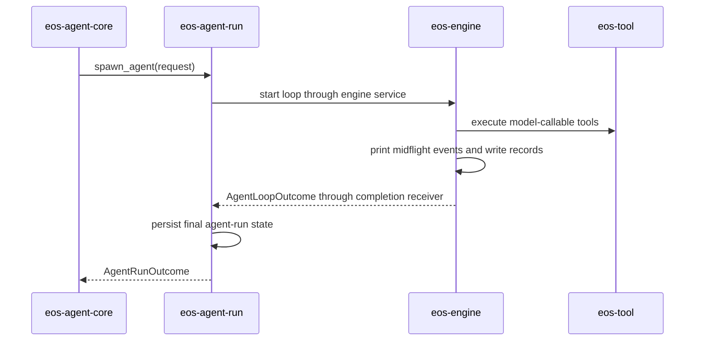

# Phase 04 - eos-engine and eos-agent-run Spec

Status: Draft
Date: 2026-06-09
Owner: eos-engine / eos-agent-run

## Scope

This phase makes `eos-engine` execution-only and `eos-agent-run` lifecycle-only.

The engine keeps the agent loop, turn execution, event emission, midflight
printing, message records, and background accounting. The run crate keeps
spawn/wait/poll/cancel/finalization and durable agent-run state updates.

## Local Architecture

### eos-engine

`eos-engine` owns:

- full agent loop execution,
- assistant turn execution,
- provider stream consumption,
- batch tool dispatch,
- engine events,
- midflight event printing,
- message record writing for loop-visible events,
- background session accounting and notifications.

`eos-engine` does not own:

- concrete tool families,
- tool registry definitions,
- agent-run lifecycle rows,
- request runtime wiring,
- external API facades.

### eos-agent-run

`eos-agent-run` owns:

- starting an agent run,
- active run registry,
- waiting for run completion,
- polling run completion,
- cancellation,
- final lifecycle handoff from engine outcome,
- agent-run persistence updates.

`eos-agent-run` does not own:

- engine turn execution,
- tool behavior,
- message event interpretation,
- request runtime wiring.

## Resulting File Structure

```text
agent-core/crates/eos-engine/
├── Cargo.toml
├── src/
│   ├── lib.rs
│   ├── error.rs
│   ├── model.rs
│   ├── events.rs
│   ├── services.rs
│   ├── loop.rs
│   ├── loop/
│   │   ├── executor.rs
│   │   ├── state.rs
│   │   └── turn.rs
│   ├── records.rs
│   ├── printer.rs
│   ├── background.rs
│   └── background/
│       ├── command_sessions.rs
│       ├── subagent_sessions.rs
│       └── workflow_sessions.rs
└── tests/
    ├── loop/
    ├── records/
    └── background/
```

```text
agent-core/crates/eos-agent-run/
├── Cargo.toml
├── src/
│   ├── lib.rs
│   ├── error.rs
│   ├── model.rs
│   ├── services.rs
│   ├── active_runs.rs
│   ├── persistence.rs
│   ├── request.rs
│   ├── completion.rs
│   └── cancellation.rs
└── tests/
    ├── lifecycle/
    ├── cancellation/
    └── completion/
```

## Engine Service Surface

`eos-engine/src/services.rs` exports only sibling-facing execution surfaces.
It must not re-export every internal engine helper.
There is no first-target `services/` folder; execution internals stay in
`loop/`, `records.rs`, `printer.rs`, and `background/`.

Allowed examples:

```text
AgentLoopService
AgentLoopLauncher
AgentLoopExecutionRequest
AgentLoopOutcome
EngineEventSink
```

Names to avoid:

```text
NotificationService       # engine-internal queue, rename if private
BackgroundTeardownService # engine-internal finalizer, rename if private
MessageRecordService      # engine-internal records, unless sibling-consumed
EventPrinterService       # printer/sink, not service unless sibling-consumed
```

## Lifecycle Handoff

Completion flow:



This is a lifecycle handoff, not an event-driven callback into the runner.

## Message Records and Midflight Printing

Target ownership:

| Behavior | Owner |
| --- | --- |
| event emission during loop | `eos-engine` |
| midflight printing | `eos-engine/printer.rs` |
| message-record interpretation | `eos-engine/records.rs` |
| durable run finalization | `eos-agent-run` |
| external message-record contract | `eos-agent-core`, if externally exposed |

Reason: the engine sees stream events, tool calls, assistant messages, and
terminal transitions as they happen. The runner only sees the final outcome.

## Progress Tracker

| Item | Status |
| --- | --- |
| Add engine `services.rs` execution surface | Not started |
| Move message records into engine internals | Not started |
| Add engine midflight printer/sink | Not started |
| Remove concrete tool ownership from engine | Not started |
| Rename private `*Service` internals where needed | Not started |
| Rename `eos-agent-runner` to `eos-agent-run` | Not started |
| Keep active run registry in run crate | Not started |
| Keep finalization persistence in run crate | Not started |
| Update `eos-agent-core` runtime wiring | Not started |

## Acceptance Criteria

- `eos-engine` has no `tools/` concrete tool family folder.
- `eos-engine` does not own tool registry definitions or hook contracts.
- `eos-engine/services.rs` exports only sibling-facing execution surfaces.
- `eos-engine` has no first-target `services/` folder.
- Engine message records and midflight printing work during loop execution.
- `eos-agent-run` does not import concrete tool modules.
- `eos-agent-run` owns spawn/wait/poll/cancel/finalization.
- Engine completion returns to run lifecycle through an outcome receiver or
  equivalent lifecycle handoff.
- `cargo test -p eos-engine` passes.
- `cargo test -p eos-agent-run` passes.
- `eos-engine` final module count is at or below 22.
- `eos-agent-run` final module count is at or below 10.
