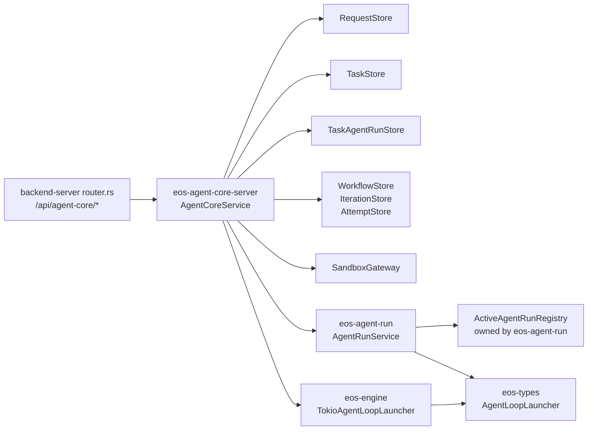
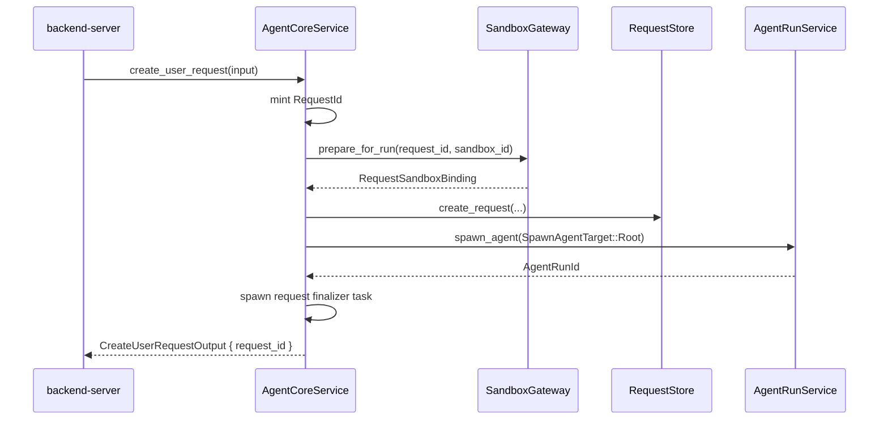
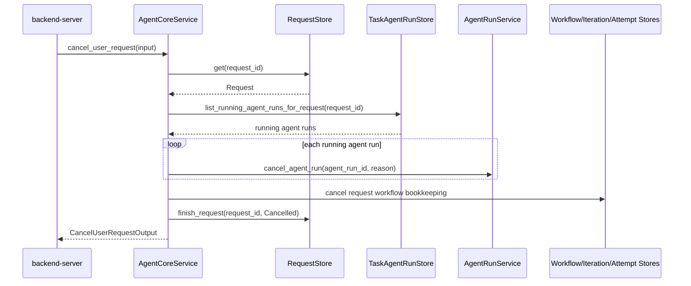

# Phase 05 - Agent Core Server Boundary Spec

Status: Implemented
Date: 2026-06-09
Owner: eos-agent-core-server / eos-agent-run / eos-types / eos-workflow

## Decision

Phase 05 creates a new backend-facing crate named `eos-agent-core-server`.

The crate exposes one concrete service, `AgentCoreService`, that implements the
agent-core operations needed by the backend `/api/agent-core/*` routes:

- create a user request and start its root agent run,
- cancel a user request as a normal service operation,
- read one user request,
- list user requests,
- list task-agent-runs for a user request.

This replaces the older facade shape that tried to make `eos-agent-core` itself
the external request facade. It also rejects the intermediate names
`AgentCoreRuntime`, `AgentCoreHost`, `AgentCoreReads`, `reads()`,
`active_requests`, `message_records` on the request service, and any public
cancellation handler.

`backend-server` remains the HTTP/router owner. `eos-agent-core-server` is not
an axum router crate. `/api/agent-core` is a backend HTTP namespace, not the
resource being created; concrete resources stay under that namespace.

## Boundary Map



| Layer | Owns | Must not own |
| --- | --- | --- |
| `backend-server` | HTTP routes, status-code mapping, SSE transport, backend-only stats and sandbox list/delete routes | agent-core request lifecycle rules |
| `eos-agent-core-server` | backend-facing request service methods and request-level orchestration | axum routing, transcript storage, active run maps |
| `eos-agent-run` | spawn, wait, poll, cancel, message records, active process handles | user-request HTTP/API DTOs |
| `eos-workflow` | workflow/iteration/attempt lifecycle rules | backend-facing user-request facade |
| `eos-types` | typed IDs, state DTOs, store traits, passive API contracts | runtime/service behavior |

## Backend Route Mapping

The public service surface is derived from
`backend-server/crates/eos-backend-api/src/router.rs`.

| Current backend route | Target backend route | Target service method |
| --- | --- | --- |
| `POST /api/user-requests` | `POST /api/agent-core/requests` | `AgentCoreService::create_user_request` |
| `DELETE /api/user-requests/{request_id}` | `DELETE /api/agent-core/requests/{request_id}` | `AgentCoreService::cancel_user_request` |
| `GET /api/user-requests/{request_id}` | `GET /api/agent-core/requests/{request_id}` | `AgentCoreService::read_user_request` |
| `GET /api/user-requests` | `GET /api/agent-core/requests` | `AgentCoreService::list_user_requests` |
| `GET /api/user-requests/{request_id}/tasks` | `GET /api/agent-core/requests/{request_id}/tasks` | `AgentCoreService::list_user_request_tasks` |

These routes should stop depending on `RunControl` and `AgentCoreReads`.

The following routes do not belong to `AgentCoreService` in this phase:

| Current backend route | Target backend route | Owner |
| --- | --- | --- |
| `GET /api/user-requests/{request_id}/events` | `GET /api/agent-core/requests/{request_id}/events` | backend event log/SSE layer |
| `GET /api/user-requests/{request_id}/stream` | `GET /api/agent-core/requests/{request_id}/stream` | backend event log/SSE layer |
| `GET /api/tasks/{task_id}` | `GET /api/agent-core/tasks/{task_id}` | task read handler over store rows |
| `GET /api/tasks/{task_id}/transcript` | `GET /api/agent-core/tasks/{task_id}/transcript` | `eos-engine::records::AgentRunRecordWriter` read path |
| `GET /api/agent-runs/{agent_run_id}/messages` | `GET /api/agent-core/agent-runs/{agent_run_id}/messages` | `eos-engine::records::AgentRunRecordWriter` read path |
| `GET /api/agent-runs/{agent_run_id}/events` | `GET /api/agent-core/agent-runs/{agent_run_id}/events` | `eos-engine::records::AgentRunRecordWriter` read path |
| `GET /api/agent-runs/{agent_run_id}/stream` | `GET /api/agent-core/agent-runs/{agent_run_id}/stream` | backend SSE layer over agent-run records |

Do not pull transcript/record routes into `eos-agent-core-server` just to reduce
backend fields. Agent-run records are already an `eos-engine` responsibility.

Do not add bare resource operations directly on `/api/agent-core`, such as
`POST /api/agent-core` or `GET /api/agent-core/{request_id}`. The namespace
groups agent-core resources; it is not itself the request resource.

## Resulting File Structure

```text
agent-core/crates/eos-agent-core-server/
├── Cargo.toml
├── src/
│   ├── lib.rs
│   ├── service.rs
│   ├── request_state.rs
│   ├── dto.rs
│   ├── error.rs
│   └── user_request/
│       ├── mod.rs
│       ├── create.rs
│       ├── cancel.rs
│       ├── read.rs
│       ├── list.rs
│       ├── list_tasks.rs
│       └── finalizer.rs
└── tests/
    ├── create_user_request.rs
    ├── cancel_user_request.rs
    ├── read_user_requests.rs
    ├── list_user_requests.rs
    ├── list_user_request_tasks.rs
    └── finalize_user_request.rs
```

No additional implementation folders are part of the first target.

Do not create these files:

```text
user_request.rs
user_request_task.rs
root_agent.rs
agent_records.rs
agent_core_service.rs
request_handler.rs
request_handler/
service_impl.rs
service_impl/
wiring.rs
runtime.rs
host.rs
reads.rs
server_inner.rs
```

### `src/lib.rs`

Thin export surface only:

```rust
mod dto;
mod error;
mod request_state;
mod service;
mod user_request;

pub use dto::{
    CancelUserRequestInput, CancelUserRequestOutput, CreateUserRequestInput,
    CreateUserRequestOutput, UserRequestDetail, UserRequestSummary,
};
pub use error::AgentCoreServerError;
pub use service::{AgentCoreService, AgentCoreServiceDependencies, AgentCoreServiceSettings};
```

### `src/service.rs`

Owns the concrete service, constructor, and thin method forwarding.

This module is allowed to contain:

- `AgentCoreService`,
- `AgentCoreServiceDependencies`,
- `AgentCoreServiceSettings`,
- public `AgentCoreService` methods that delegate to `user_request::*`.

It must not contain an HTTP router, a host trait, a runtime struct, or an active
request registry. It must not be named `service_impl`, because that name
describes Rust mechanics rather than the domain behavior.

### `src/request_state.rs`

Owns the grouped durable store handles used by request lifecycle operations.
This is an internal implementation detail, not a public read facade.

### `src/dto.rs`

Owns the public request/response DTOs used by `AgentCoreService`.

### `src/user_request/`

Owns user-request lifecycle behavior by operation. The folder is named by the
domain resource, not by HTTP mechanics. Do not call it `request_handler/`.

| File | Owns |
| --- | --- |
| `create.rs` | creating the request row, provisioning the sandbox binding, and spawning the root agent |
| `cancel.rs` | request-scoped cancellation orchestration |
| `read.rs` | one-request detail projection |
| `list.rs` | paged request summaries |
| `list_tasks.rs` | request task-agent-run projection |
| `finalizer.rs` | root agent outcome to top-level request terminal status |

### `src/error.rs`

Owns one error enum, `AgentCoreServerError`, with enough detail for
backend-server to map errors to HTTP responses.

## Public Service Type

```rust
#[derive(Clone)]
pub struct AgentCoreService {
    request_store: Arc<dyn RequestStore>,
    task_store: Arc<dyn TaskStore>,
    agent_run_store: Arc<dyn AgentRunStore>,
    task_agent_run_store: Arc<dyn TaskAgentRunStore>,

    workflow_store: Arc<dyn WorkflowStore>,
    iteration_store: Arc<dyn IterationStore>,
    attempt_store: Arc<dyn AttemptStore>,

    agent_run_service: AgentRunService,
    sandbox_gateway: Arc<dyn SandboxGateway>,

    settings: AgentCoreServiceSettings,
}
```

Field naming rules:

| Field | Reason |
| --- | --- |
| `request_store` | durable top-level request rows |
| `task_store` | durable task rows |
| `agent_run_store` | durable compatibility agent-run rows |
| `task_agent_run_store` | durable task-agent-run lineage rows |
| `workflow_store` | delegated workflow bookkeeping |
| `iteration_store` | delegated workflow iteration bookkeeping |
| `attempt_store` | delegated workflow attempt bookkeeping |
| `agent_run_service` | active and durable agent-run lifecycle |
| `sandbox_gateway` | request sandbox binding plus sandbox tool transport |
| `settings` | fixed service settings, not runtime state |

Do not shorten these names to `requests`, `tasks`, `runs`, `stores`, `deps`, or
`runtime`.

## Constructor Types

```rust
#[derive(Clone)]
pub struct AgentCoreServiceSettings {
    pub workspace_root: String,
    pub root_agent_name: AgentName,
}
```

```rust
pub struct AgentCoreServiceDependencies {
    pub request_store: Arc<dyn RequestStore>,
    pub task_store: Arc<dyn TaskStore>,
    pub agent_run_store: Arc<dyn AgentRunStore>,
    pub task_agent_run_store: Arc<dyn TaskAgentRunStore>,

    pub workflow_store: Arc<dyn WorkflowStore>,
    pub iteration_store: Arc<dyn IterationStore>,
    pub attempt_store: Arc<dyn AttemptStore>,

    pub agent_run_service: AgentRunService,
    pub sandbox_gateway: Arc<dyn SandboxGateway>,
    pub settings: AgentCoreServiceSettings,
}
```

```rust
impl AgentCoreService {
    #[must_use]
    pub fn new(dependencies: AgentCoreServiceDependencies) -> Self;
}
```

No builder is required in the first target. Add a builder only if construction
call sites become unreadable after the implementation lands.

## Public API

```rust
impl AgentCoreService {
    pub async fn create_user_request(
        &self,
        input: CreateUserRequestInput,
    ) -> Result<CreateUserRequestOutput, AgentCoreServerError>;

    pub async fn cancel_user_request(
        &self,
        input: CancelUserRequestInput,
    ) -> Result<CancelUserRequestOutput, AgentCoreServerError>;

    pub async fn read_user_request(
        &self,
        request_id: &RequestId,
    ) -> Result<Option<UserRequestDetail>, AgentCoreServerError>;

    pub async fn list_user_requests(
        &self,
        page: Page,
    ) -> Result<PageResult<UserRequestSummary>, AgentCoreServerError>;

    pub async fn list_user_request_tasks(
        &self,
        request_id: &RequestId,
    ) -> Result<Vec<TaskRun>, AgentCoreServerError>;
}
```

There is no `run_root_agent` method in the public API. Root-agent spawning is an
implementation detail of `create_user_request`.

There is no separate cancellation handler or cancellation registry in the public
API. Cancellation is just `cancel_user_request`.

## API DTOs

```rust
#[derive(Debug, Clone)]
pub struct CreateUserRequestInput {
    pub prompt: String,
    pub sandbox_id: Option<SandboxId>,
    pub client_label: Option<String>,
    pub client_metadata: serde_json::Value,
}
```

```rust
#[derive(Debug, Clone)]
pub struct CreateUserRequestOutput {
    pub request_id: RequestId,
}
```

```rust
#[derive(Debug, Clone)]
pub struct CancelUserRequestInput {
    pub request_id: RequestId,
    pub reason: String,
}
```

```rust
#[derive(Debug, Clone)]
pub struct CancelUserRequestOutput {
    pub request_id: RequestId,
    pub cancelled_agent_run_count: usize,
}
```

```rust
#[derive(Debug, Clone)]
pub struct UserRequestSummary {
    pub request_id: RequestId,
    pub status: RequestStatus,
    pub root_task_id: Option<TaskId>,
    pub sandbox_id: Option<SandboxId>,
    pub created_at: UtcDateTime,
    pub finished_at: Option<UtcDateTime>,
}
```

```rust
#[derive(Debug, Clone)]
pub struct UserRequestDetail {
    pub request_id: RequestId,
    pub status: RequestStatus,
    pub root_task_id: Option<TaskId>,
    pub sandbox_id: Option<SandboxId>,
    pub prompt: String,
    pub created_at: UtcDateTime,
    pub updated_at: UtcDateTime,
    pub finished_at: Option<UtcDateTime>,
}
```

DTO names use full nouns. Avoid names like `RunInput`, `RunOutput`, `Snapshot`,
`Record`, or `Context` at this boundary.

## Error Type

```rust
#[derive(Debug, thiserror::Error)]
#[non_exhaustive]
pub enum AgentCoreServerError {
    #[error("user request {0} was not found")]
    UserRequestNotFound(RequestId),

    #[error("user request {request_id} already finished with status {status:?}")]
    UserRequestAlreadyFinished {
        request_id: RequestId,
        status: RequestStatus,
    },

    #[error("root agent is not configured: {0}")]
    RootAgentConfiguration(String),

    #[error("sandbox provisioning failed: {0}")]
    SandboxProvision(String),

    #[error("agent run failed: {0}")]
    AgentRun(#[from] AgentRunError),

    #[error("store failed: {0}")]
    Store(#[from] CoreError),
}
```

Backend-server maps these errors to HTTP status codes. `eos-agent-core-server`
does not depend on axum response types.

## Create Flow

`create_user_request` returns after the root agent run is accepted. It does not
block until the request finishes.



Required behavior:

1. Mint `RequestId` inside the service.
2. Resolve sandbox binding through `sandbox_gateway.provisioner()`.
3. Create the request row in `request_store`.
4. Spawn the root agent through `agent_run_service.spawn_agent`.
5. Let `TaskAgentRunStore::create_root_task_agent_run` create and bind the root
   task-agent-run row.
6. Spawn a private finalizer task that waits on the root `AgentRunId`.
7. Return `CreateUserRequestOutput { request_id }`.

If root spawn fails after the request row is created, mark the request failed
before returning the error.

## Request Finalization

The private finalizer waits for the root agent outcome and writes the top-level
request terminal status.

```rust
async fn finish_user_request_after_root_agent(
    request_store: Arc<dyn RequestStore>,
    agent_run_service: AgentRunService,
    request_id: RequestId,
    root_agent_run_id: AgentRunId,
);
```

Outcome mapping:

| `AgentRunStatus` | `RequestStatus` |
| --- | --- |
| `Completed` | `Done` |
| `Failed` | `Failed` |
| `Cancelled` | `Cancelled` |

The finalizer should log failures with `tracing`; it must not panic.

## Cancellation Flow

Cancellation is a normal `AgentCoreService` API step. It is not exposed as a
handler, registry, or host method.



Required behavior:

1. Return `UserRequestNotFound` if the request does not exist.
2. Return `UserRequestAlreadyFinished` if the request status is terminal.
3. Load all running agent runs for the request from durable lineage rows.
4. Call `agent_run_service.cancel_agent_run` for each running agent run.
5. Close request-scoped workflow bookkeeping.
6. Mark the request `Cancelled`.
7. Return the number of cancelled agent runs.

Do not add `active_requests` to `AgentCoreService`. In-process active handles
belong inside `eos-agent-run::ActiveAgentRunRegistry`.

## Required Store Contract Additions

`TaskAgentRunStore` needs one request-scoped cancellation query:

```rust
#[derive(Debug, Clone, PartialEq, Eq)]
pub struct RunningRequestAgentRun {
    pub request_id: RequestId,
    pub task_id: TaskId,
    pub agent_run_id: AgentRunId,
    pub status: TaskStatus,
}
```

```rust
async fn list_running_agent_runs_for_request(
    &self,
    request_id: &RequestId,
) -> Result<Vec<RunningRequestAgentRun>, CoreError>;
```

The SQL implementation reads both `task_runs` and `parented_runs` where
`request_id = ?` and `status = 'running'`.

Workflow bookkeeping also needs request-scoped closure helpers because
`workflows` already has `request_id`, and `iterations` / `attempts` can be
closed by joining through `workflows`:

```rust
async fn cancel_open_workflows_for_request(
    &self,
    request_id: &RequestId,
    reason: &str,
) -> Result<usize, CoreError>;

async fn cancel_open_iterations_for_request(
    &self,
    request_id: &RequestId,
    reason: &str,
) -> Result<usize, CoreError>;

async fn cancel_open_attempts_for_request(
    &self,
    request_id: &RequestId,
    reason: &str,
) -> Result<usize, CoreError>;
```

These methods belong on `WorkflowStore`, `IterationStore`, and `AttemptStore`
respectively, not on `AgentCoreService` as ad hoc SQL.

## Naming Rules

| Concept | Target name |
| --- | --- |
| backend-facing crate | `eos-agent-core-server` |
| Rust import path | `eos_agent_core_server` |
| public service type | `AgentCoreService` |
| constructor input | `AgentCoreServiceDependencies` |
| fixed settings | `AgentCoreServiceSettings` |
| create method | `create_user_request` |
| cancel method | `cancel_user_request` |
| detail read method | `read_user_request` |
| list method | `list_user_requests` |
| task list method | `list_user_request_tasks` |
| implementation folder | `user_request/` |
| backend agent-core namespace | `/api/agent-core` |
| active agent-run owner | `eos-agent-run::ActiveAgentRunRegistry` |
| record writer owner | `eos-engine::records::AgentRunRecordWriter` |

Forbidden target names:

```text
AgentCoreRuntime
AgentCoreHost
AgentCoreServerInner
AgentCoreReads
RunControl
reads
active_requests
Runtime
Host
Context
deps
wiring
stores
tasks_sore
request_handler
service_impl
RequestCancellations
cancel_registry
```

`RequestCancellations` and `cancel_registry` may remain only as deleted-code
references during migration. They must not appear in the final target.

## Migration Plan

| Step | Target | Status |
| --- | --- | --- |
| 1 | Add `agent-core/crates/eos-agent-core-server` crate | Implemented |
| 2 | Add `AgentCoreService`, dependencies, settings, API DTOs, and error type | Implemented |
| 3 | Add `TaskAgentRunStore::list_running_agent_runs_for_request` and SQL implementation | Implemented |
| 4 | Add request-scoped workflow bookkeeping cancellation methods | Implemented |
| 5 | Move create/cancel user-request orchestration from backend runtime into `AgentCoreService` | Implemented |
| 6 | Move backend agent-core HTTP routes under `/api/agent-core/*` and call `AgentCoreService` from request routes | Implemented |
| 7 | Remove `RunControl` from backend API state | Implemented |
| 8 | Remove `AgentCoreReads` from backend API state | Implemented |
| 9 | Remove top-level agent-core cancellation registry/handler from public exports | Implemented |
| 10 | Keep message/transcript routes backed by `eos-engine::records::AgentRunRecordWriter` | Implemented |
| 11 | Update backend OpenAPI and API contract tests for `/api/agent-core/*` paths | Implemented |
| 12 | Update `agent-core/Cargo.toml` workspace members and workspace dependencies | Implemented |
| 13 | Update phase index and architecture docs after compile gates pass | Implemented |

## Acceptance Criteria

- `agent-core/crates/eos-agent-core-server` exists and builds.
- The crate exports `AgentCoreService`; it does not export
  `AgentCoreRuntime`, `AgentCoreHost`, `AgentCoreServerInner`, or
  `AgentCoreReads`.
- `AgentCoreService` has no `active_requests`, `message_records`,
  `RequestCancellations`, or `cancel_registry` field.
- Backend request create/detail/list/cancel/tasks routes are exposed under
  `/api/agent-core/requests` and depend on `AgentCoreService`.
- Backend task and agent-run read/stream routes that expose agent-core resources
  are exposed under `/api/agent-core/tasks` and `/api/agent-core/agent-runs`.
- The target backend router does not expose agent-core resources under the old
  `/api/user-requests`, `/api/tasks`, or `/api/agent-runs` paths.
- Backend OpenAPI output and API contract tests use the `/api/agent-core/*`
  route namespace for agent-core resources.
- Cancellation flows through `AgentCoreService::cancel_user_request`.
- Cancellation resolves running agent runs from durable task-agent-run rows and
  delegates active handle teardown to `AgentRunService`.
- Workflow, iteration, and attempt cancellation bookkeeping is request-scoped
  and store-owned.
- Message and transcript routes still use `eos-engine::records::AgentRunRecordWriter`.
- `router.rs` remains in `backend-server`; no axum router is added under
  `agent-core`.
- `cargo check -p eos-agent-core-server --all-targets` passes.
- `cargo check -p eos-agent-run --all-targets` passes.
- `cargo check -p eos-types --all-targets` passes.
- `cargo check -p eos-db --all-targets` passes.
