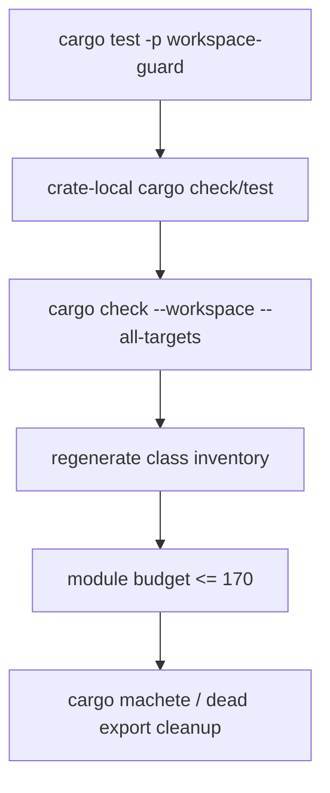

# Phase 06 - Verification and Module Budget Spec

Status: In progress - final module total achieved, LOC cleanup still open
Date: 2026-06-09
Owner: agent-core verification

## Scope

This phase proves the refactor is complete. It removes leftover compatibility
shims, checks workspace behavior, verifies naming guardrails, and confirms the
layout, public-surface, and module budget reduction.

No new architecture should be introduced in this phase. If a new boundary is
needed, the relevant earlier phase spec must be updated first.

## Verification Architecture

Verification uses four layers:

1. architecture guard tests,
2. crate-local cargo checks and tests,
3. workspace-wide cargo checks,
4. class inventory regeneration and budget comparison.



## Required Commands

Run from `agent-core` unless noted.

```bash
cargo test -p workspace-guard
cargo check --workspace --all-targets
cargo test --workspace
cargo clippy --workspace --all-targets -- -D warnings
```

The default guard run keeps module-budget reporting advisory so staged cleanup
can continue while the final target is still above budget. The final closeout
must also run the enforcing gate:

```bash
EOS_WORKSPACE_GUARD_FINAL_LAYOUT=1 cargo test -p workspace-guard module_budget_report_is_available -- --nocapture
```

That command fails only while the total module count is above 170. Per-crate
caps remain advisory because forced per-crate merges can violate the cohesion
rules below.

If the inventory generator remains available:

```bash
cargo run --manifest-path scripts/class-inventory/Cargo.toml
```

If the command differs, document the actual command in this file when the phase
is executed.

Optional dependency cleanup:

```bash
cargo machete
```

## Final Module Budget

| Crate | Current modules | Advisory budget |
| --- | ---: | ---: |
| `eos-agent-core-server` | 9 | <= 10 |
| `eos-agent-run` | 7 | <= 10 |
| `eos-engine` | 32 | <= 22 |
| `eos-tool` | 14 | <= 16 |
| `eos-workflow` | 18 | <= 10 |
| `eos-types` | 29 | <= 12 |
| `eos-db` | 15 | <= 12 |
| `eos-llm-client` | 15 | <= 12 |
| `eos-sandbox-port` | 23 | <= 23 |
| `eos-testkit` | 6 | <= 8 |
| **Total** | **168** | **150-170** |

The per-crate caps above sum to 147, so the 170 upper bound is the only strict
gate; the "150" is an aspiration, not a floor. A run that lands at 147 by hitting
every cap is acceptable, but per-crate caps must not be enforced by merging
unrelated behavior. Do not raise caps just to reach 150.

## LOC Reduction Status

The module target is met, but the expected LOC cleanup is not. Current nonblank
Rust LOC after the first consolidation pass:

| Folder | Current nonblank Rust LOC | Expected net LOC cut status |
| --- | ---: | --- |
| `agent-core/crates/eos-types/src/` | 4,014 | Not achieved - down only ~28 LOC from the 4,042 baseline |
| `agent-core/crates/eos-engine/src/` | 6,729 | Not achieved - currently above the 6,629 baseline because behavior/tests were added in parallel |
| `agent-core/crates/eos-workflow/src/` | 4,657 | Not achieved - down only ~45 LOC from the 4,702 baseline |
| `agent-core/crates/eos-agent-core-server/src/` | 489 | Not a meaningful LOC source |
| `agent-core/crates/eos-db/src/` | 3,282 | Unchanged |
| `agent-core/crates/eos-llm-client/src/` | 3,353 | Unchanged |
| `agent-core/crates/eos-sandbox-port/src/` | 2,974 | Unchanged |

Further LOC reduction must delete or simplify behavior. Pure module inlining has
already reached the strict module gate and should not be used as a substitute for
the expected net LOC cuts.

### Cohesion outranks file count

Module count is a coarse proxy, not the goal. The budget counts *files*, so it
can be satisfied by merging small files while concentrating LOC into a few large
ones — which is a worse SRP outcome, not a better one. The guard's
`module_budget` check is therefore **advisory by default** and **gating only
when `EOS_WORKSPACE_GUARD_FINAL_LAYOUT=1` is set**. The gate must not be
satisfied by creating god-files.

Two rules keep the collapse honest:

1. **No merge may create a new god-file.** A consolidation that produces a file
   over ~600 LOC of non-mechanical implementation must instead keep a real
   ownership split. Concretely, `eos-workflow/src/attempt/` is 2414 LOC today
   (`orchestrator.rs` 653, `run_stage.rs` 611, `launch.rs` 540, `plan_dag.rs`
   506); collapsing it into a single `attempts.rs` would yield a ~1900 LOC file.
   Keep it split by ownership boundary (e.g. `attempts.rs` for attempt
   lifecycle, `planning.rs` for the plan DAG, plus run-stage orchestration)
   rather than concatenating to satisfy the `<= 10` budget.

2. **Name the real large files explicitly.** Phase 6 success is measured by
   whether these existing god-files are either split or justified-as-cohesive,
   not by the headline count:

   | File | LOC | Disposition |
   | --- | ---: | --- |
   | `eos-db/src/rows.rs` | 836 | split by row family or justify as mechanical row mapping |
   | `eos-llm-client/src/clients/anthropic_api_client.rs` | 756 | maps to `providers/anthropic.rs`; split request/stream/response or justify |
   | `eos-llm-client/src/clients/openai_api_client.rs` | 554 | maps to `providers/openai.rs`; same review |
   | `eos-sandbox-port/src/tool_api/parse.rs` | 642 | review (crate is otherwise frozen) or justify as parser/state-machine |
   | merged `eos-workflow` `attempts.rs` | target ~600 | must not become a ~1900 LOC merge of the `attempt/` tree |

A module-count reduction that leaves these untouched while growing new large
files does not satisfy this phase.

## Remaining Budget Remediation Ownership

The original 195-module report was not a Phase 06 design target. The current
168-module report meets the strict total gate, while the remaining advisory
per-crate overages return to their owning specs before more code movement:

| Crate | Current | Budget | Owning spec to amend before code movement |
| --- | ---: | ---: | --- |
| `eos-engine` | 32 | <= 22 | Phase 04 - more cuts require owner-local behavior simplification, not router-file churn |
| `eos-types` | 29 | <= 12 | Phase 02 - narrow the contract floor or amend the cap; do not collapse all persisted DTOs into a god-file |
| `eos-workflow` | 18 | <= 10 | Phase 03B / workflow follow-up - keep `attempt/` split unless real behavior can be deleted |
| `eos-db` | 15 | <= 12 | Phase 06 cleanup review - split/justify large cohesive files, do not force a merge |
| `eos-llm-client` | 15 | <= 12 | Phase 06 cleanup review - provider file cohesion review |

Do not treat tiny router-file churn as the main simplification lever while these
owner crates remain above advisory budget. Further reductions should come from
real behavior deletion or better owner-local cohesion.

## Cleanup Rules

- Remove compatibility modules that only re-export old names.
- Remove retired crate dependencies from workspace dependencies.
- Remove standalone `eos-config`, `eos-agent-def`, and `eos-audit` members after
  their owner-local folds are complete.
- Remove the obsolete `eos-agent-core` facade/runtime crate; keep
  `eos-agent-core-server` as the backend-facing request service.
- Remove dead tests that only protect old paths.
- Update docs that mention retired crates.
- Keep any behavior-changing cleanup tied to a failing test or explicit
  acceptance criterion.
- Do not preserve old names solely to reduce diff size.

## Final Resulting File Structure

```text
agent-core/
├── Cargo.toml
├── crates/
│   ├── eos-agent-core-server/
│   ├── eos-agent-run/
│   ├── eos-engine/
│   ├── eos-tool/
│   ├── eos-workflow/
│   ├── eos-types/
│   ├── eos-db/
│   ├── eos-llm-client/
│   ├── eos-sandbox-port/
│   └── eos-testkit/
├── workspace-guard/
└── docs/
    └── class-inventory/
```

## Progress Tracker

| Item | Status |
| --- | --- |
| Run workspace guard | Done - `cargo test -p workspace-guard`; `cargo test -p workspace-guard --test module_budget -- --nocapture` reports 168 modules |
| Run crate-local checks for changed crates | Done - `cargo check -p eos-agent-core-server --all-targets`, `cargo check -p eos-workflow --all-targets`, `cargo check -p eos-types --all-targets`, `cargo check -p eos-backend-audit --all-targets`, `cargo check -p eos-backend-runtime --all-targets`, `cargo check -p eos-backend-api --all-targets` |
| Run workspace check | Done - `cargo check --workspace --all-targets` in `agent-core` and `backend-server` |
| Run workspace tests | Not started |
| Run clippy | Done for touched agent-core crates - `cargo clippy -p eos-workflow -p eos-types -p eos-agent-core-server -p eos-engine --all-targets -- -D warnings` |
| Regenerate class inventory | Done - `cargo run --manifest-path scripts/class-inventory/Cargo.toml` wrote 10 crate inventories |
| Compare crate/module/item/method counts | Done for module total - guard reports 168 Rust modules, within the 150-170 target; item/method and LOC cleanup remain open |
| Add executable final-budget gate | Done - `EOS_WORKSPACE_GUARD_FINAL_LAYOUT=1` enforces the 170 total and reports per-crate caps as advisory |
| Remove dead dependencies | Done for obsolete `eos-agent-core` workspace dependencies; `cargo machete --with-metadata` is clean in `agent-core` and `backend-server` |
| Remove compatibility re-exports | Done for the obsolete `eos-agent-core` crate path and unused workflow service-support handles |
| Clean stale backend inventory docs | Done - regenerated backend class inventory and deleted orphaned `host.rs` / `launcher.rs` / `reaper.rs` pages; stale-reference grep is clean |
| Reconnect live event publishing | Done - backend `EventBus` again exposes replay-safe live sinks via the engine launcher sink factory; verified by `cargo test -p eos-backend-runtime event_bus -- --nocapture` and `cargo test -p eos-backend-api --test stream -- --nocapture` |
| Update final docs and index tracker | In progress - index records regenerated 10-crate inventory and 168-module status |
| Update `index.md` Progress Tracker with Phase 06 result and exit artifact | Done - Phase 06 entry records the default guard budget and final-layout gate |
| Confirm `index.md` Progress Tracker records every phase result and exit artifact | In progress |

## Acceptance Criteria

- `cargo test -p workspace-guard` passes.
- `cargo check --workspace --all-targets` passes.
- `cargo test --workspace` passes, or every remaining failure is documented as
  pre-existing and unrelated with command output evidence.
- `cargo clippy --workspace --all-targets -- -D warnings` passes, or every
  remaining warning is documented as pre-existing and unrelated.
- No retired crate names, including `eos-agent-core`, appear in workspace
  members or normal dependencies.
- No forbidden `api`, `router`, `service`, or `port` vocabulary appears outside
  the allowlisted target locations; `service` requires a real sibling-crate or
  backend composition consumer.
- `composition`, `deps`, and `runtime_services` do not appear as target module
  or type names.
- Final target crates do not use vague bucket folders (`common`, `helpers`,
  `shared`, `utils`), exact architecture-smell folders (`api`, `services`,
  `ports`, `composition`, `deps`, `runtime_services`), duplicate `foo.rs` plus
  `foo/mod.rs` module shapes, nested `mod.rs` mazes, or source-local test
  modules.
- Class inventory reports at most 170 modules (150 is an aspiration, not a floor).
- The module budget report includes total/per-crate modules, max source-folder
  depth, and root file nonblank LOC.
- No consolidation creates a file over ~600 LOC of non-mechanical
  implementation; the `eos-workflow/attempt/` tree is kept split, not merged into
  a single ~1900 LOC `attempts.rs`.
- The named large files (`eos-db/rows.rs`, the two provider `*_api_client.rs`,
  `eos-sandbox-port/tool_api/parse.rs`) are each either split or explicitly
  justified as mechanically cohesive.
- The final diff removes more architecture surface than it adds.
