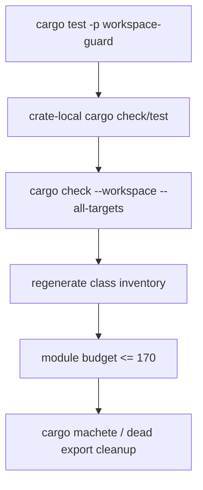

# Phase 06 - Verification and Module Budget Spec

Status: Draft
Date: 2026-06-09
Owner: agent-core verification

## Scope

This phase proves the refactor is complete. It removes leftover compatibility
shims, checks workspace behavior, verifies naming guardrails, and confirms the
layout, public-surface, and module budget reduction.

No new architecture should be introduced in this phase. If a new boundary is
needed, the relevant earlier phase spec must be updated first.

## Verification Architecture

Verification uses four layers:

1. architecture guard tests,
2. crate-local cargo checks and tests,
3. workspace-wide cargo checks,
4. class inventory regeneration and budget comparison.



## Required Commands

Run from `agent-core` unless noted.

```bash
cargo test -p workspace-guard
cargo check --workspace --all-targets
cargo test --workspace
cargo clippy --workspace --all-targets -- -D warnings
```

If the inventory generator remains available:

```bash
cargo run -p class-inventory -- agent-core
```

If the command differs, document the actual command in this file when the phase
is executed.

Optional dependency cleanup:

```bash
cargo machete
```

## Final Module Budget

| Crate | Current modules | Final budget |
| --- | ---: | ---: |
| `eos-agent-core` | new plus `eos-runtime`, agent-def, config, audit folds | <= 22 |
| `eos-agent-run` | 6 from runner baseline | <= 10 |
| `eos-engine` | 33 | <= 22 |
| `eos-tool` | 66 combined tools/tool-ports baseline | <= 16 |
| `eos-workflow` | 23 | <= 10 |
| `eos-types` | 28 | <= 12 |
| `eos-db` | 13 | <= 12 |
| `eos-llm-client` | 14 | <= 12 |
| `eos-sandbox-port` | 23 | <= 23 |
| `eos-testkit` | 6 | <= 8 |
| **Total** | **291** | **150-170** |

The per-crate caps above sum to 147, so the 170 upper bound is the only strict
gate; the "150" is an aspiration, not a floor. A run that lands at 147 by hitting
every cap is acceptable. Do not raise caps just to reach 150.

### Cohesion outranks file count

Module count is a coarse proxy, not the goal. The budget counts *files*, so it
can be satisfied by merging small files while concentrating LOC into a few large
ones — which is a worse SRP outcome, not a better one. The guard's
`module_budget` check is therefore **advisory/reporting only**; it never gates a
merge that would create a god-file.

Two rules keep the collapse honest:

1. **No merge may create a new god-file.** A consolidation that produces a file
   over ~600 LOC of non-mechanical implementation must instead keep a real
   ownership split. Concretely, `eos-workflow/src/attempt/` is 2414 LOC today
   (`orchestrator.rs` 653, `run_stage.rs` 611, `launch.rs` 540, `plan_dag.rs`
   506); collapsing it into a single `attempts.rs` would yield a ~1900 LOC file.
   Keep it split by ownership boundary (e.g. `attempts.rs` for attempt
   lifecycle, `planning.rs` for the plan DAG, plus run-stage orchestration)
   rather than concatenating to satisfy the `<= 10` budget.

2. **Name the real large files explicitly.** Phase 6 success is measured by
   whether these existing god-files are either split or justified-as-cohesive,
   not by the headline count:

   | File | LOC | Disposition |
   | --- | ---: | --- |
   | `eos-db/src/rows.rs` | 836 | split by row family or justify as mechanical row mapping |
   | `eos-llm-client/src/clients/anthropic_api_client.rs` | 756 | maps to `providers/anthropic.rs`; split request/stream/response or justify |
   | `eos-llm-client/src/clients/openai_api_client.rs` | 554 | maps to `providers/openai.rs`; same review |
   | `eos-sandbox-port/src/tool_api/parse.rs` | 642 | review (crate is otherwise frozen) or justify as parser/state-machine |
   | merged `eos-workflow` `attempts.rs` | target ~600 | must not become a ~1900 LOC merge of the `attempt/` tree |

A module-count reduction that leaves these untouched while growing new large
files does not satisfy this phase.

## Cleanup Rules

- Remove compatibility modules that only re-export old names.
- Remove retired crate dependencies from workspace dependencies.
- Remove standalone `eos-config`, `eos-agent-def`, and `eos-audit` members after
  their owner-local folds are complete.
- Remove dead tests that only protect old paths.
- Update docs that mention retired crates.
- Keep any behavior-changing cleanup tied to a failing test or explicit
  acceptance criterion.
- Do not preserve old names solely to reduce diff size.

## Final Resulting File Structure

```text
agent-core/
├── Cargo.toml
├── crates/
│   ├── eos-agent-core/
│   ├── eos-agent-run/
│   ├── eos-engine/
│   ├── eos-tool/
│   ├── eos-workflow/
│   ├── eos-types/
│   ├── eos-db/
│   ├── eos-llm-client/
│   ├── eos-sandbox-port/
│   └── eos-testkit/
├── workspace-guard/
└── docs/
    └── class-inventory/
```

## Progress Tracker

| Item | Status |
| --- | --- |
| Run workspace guard | Not started |
| Run crate-local checks for changed crates | Not started |
| Run workspace check | Not started |
| Run workspace tests | Not started |
| Run clippy | Not started |
| Regenerate class inventory | Not started |
| Compare crate/module/item/method counts | Not started |
| Remove dead dependencies | Not started |
| Remove compatibility re-exports | Not started |
| Update final docs and index tracker | Not started |
| Update `index.md` Progress Tracker with Phase 06 result and exit artifact | Not started |
| Confirm `index.md` Progress Tracker records every phase result and exit artifact | Not started |

## Acceptance Criteria

- `cargo test -p workspace-guard` passes.
- `cargo check --workspace --all-targets` passes.
- `cargo test --workspace` passes, or every remaining failure is documented as
  pre-existing and unrelated with command output evidence.
- `cargo clippy --workspace --all-targets -- -D warnings` passes, or every
  remaining warning is documented as pre-existing and unrelated.
- No retired crate names appear in workspace members or normal dependencies.
- No forbidden `api`, `router`, `service`, or `port` vocabulary appears outside the
  allowlisted target locations.
- `composition`, `deps`, and `runtime_services` do not appear as target module
  or type names.
- Final target crates do not use vague bucket folders (`common`, `helpers`,
  `shared`, `utils`), exact architecture-smell folders (`api`, `services`,
  `ports`, `composition`, `deps`, `runtime_services`), duplicate `foo.rs` plus
  `foo/mod.rs` module shapes, nested `mod.rs` mazes, or source-local test
  modules.
- Class inventory reports at most 170 modules (150 is an aspiration, not a floor).
- The module budget report includes total/per-crate modules, max source-folder
  depth, and root file nonblank LOC.
- No consolidation creates a file over ~600 LOC of non-mechanical
  implementation; the `eos-workflow/attempt/` tree is kept split, not merged into
  a single ~1900 LOC `attempts.rs`.
- The named large files (`eos-db/rows.rs`, the two provider `*_api_client.rs`,
  `eos-sandbox-port/tool_api/parse.rs`) are each either split or explicitly
  justified as mechanically cohesive.
- The final diff removes more architecture surface than it adds.
