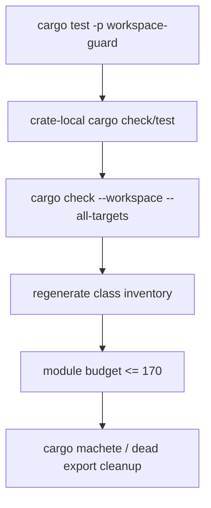

# Phase 06 - Verification and Module Budget Spec

Status: Draft
Date: 2026-06-09
Owner: agent-core verification

## Scope

This phase proves the refactor is complete. It removes leftover compatibility
shims, checks workspace behavior, verifies naming guardrails, and confirms the
module budget reduction.

No new architecture should be introduced in this phase. If a new boundary is
needed, the relevant earlier phase spec must be updated first.

## Verification Architecture

Verification uses four layers:

1. architecture guard tests,
2. crate-local cargo checks and tests,
3. workspace-wide cargo checks,
4. class inventory regeneration and budget comparison.



## Required Commands

Run from `agent-core` unless noted.

```bash
cargo test -p workspace-guard
cargo check --workspace --all-targets
cargo test --workspace
cargo clippy --workspace --all-targets -- -D warnings
```

If the inventory generator remains available:

```bash
cargo run -p class-inventory -- agent-core
```

If the command differs, document the actual command in this file when the phase
is executed.

Optional dependency cleanup:

```bash
cargo machete
```

## Final Module Budget

| Crate | Current modules | Final budget |
| --- | ---: | ---: |
| `eos-agent-core` | new plus `eos-runtime`, agent-def, config, audit folds | <= 22 |
| `eos-agent-run` | 6 from runner baseline | <= 10 |
| `eos-engine` | 33 | <= 22 |
| `eos-tool` | 66 combined tools/tool-ports baseline | <= 16 |
| `eos-workflow` | 23 | <= 10 |
| `eos-types` | 28 | <= 12 |
| `eos-db` | 13 | <= 12 |
| `eos-llm-client` | 14 | <= 12 |
| `eos-sandbox-port` | 23 | <= 23 |
| `eos-testkit` | 6 | <= 8 |
| **Total** | **291** | **150-170** |

The final total is allowed to land below 150 if the code remains clearer. The
170 upper bound is strict.

## Cleanup Rules

- Remove compatibility modules that only re-export old names.
- Remove retired crate dependencies from workspace dependencies.
- Remove standalone `eos-config`, `eos-agent-def`, and `eos-audit` members after
  their owner-local folds are complete.
- Remove dead tests that only protect old paths.
- Update docs that mention retired crates.
- Keep any behavior-changing cleanup tied to a failing test or explicit
  acceptance criterion.
- Do not preserve old names solely to reduce diff size.

## Final Resulting File Structure

```text
agent-core/
├── Cargo.toml
├── crates/
│   ├── eos-agent-core/
│   ├── eos-agent-run/
│   ├── eos-engine/
│   ├── eos-tool/
│   ├── eos-workflow/
│   ├── eos-types/
│   ├── eos-db/
│   ├── eos-llm-client/
│   ├── eos-sandbox-port/
│   └── eos-testkit/
├── workspace-guard/
└── docs/
    └── class-inventory/
```

## Progress Tracker

| Item | Status |
| --- | --- |
| Run workspace guard | Not started |
| Run crate-local checks for changed crates | Not started |
| Run workspace check | Not started |
| Run workspace tests | Not started |
| Run clippy | Not started |
| Regenerate class inventory | Not started |
| Compare crate/module/item/method counts | Not started |
| Remove dead dependencies | Not started |
| Remove compatibility re-exports | Not started |
| Update final docs and index tracker | Not started |

## Acceptance Criteria

- `cargo test -p workspace-guard` passes.
- `cargo check --workspace --all-targets` passes.
- `cargo test --workspace` passes, or every remaining failure is documented as
  pre-existing and unrelated with command output evidence.
- `cargo clippy --workspace --all-targets -- -D warnings` passes, or every
  remaining warning is documented as pre-existing and unrelated.
- No retired crate names appear in workspace members or normal dependencies.
- No forbidden `api`, `router`, `service`, or `port` vocabulary appears outside the
  allowlisted target locations.
- `composition`, `deps`, and `runtime_services` do not appear as target module
  or type names.
- Class inventory reports 150-170 modules.
- The final diff removes more architecture surface than it adds.
