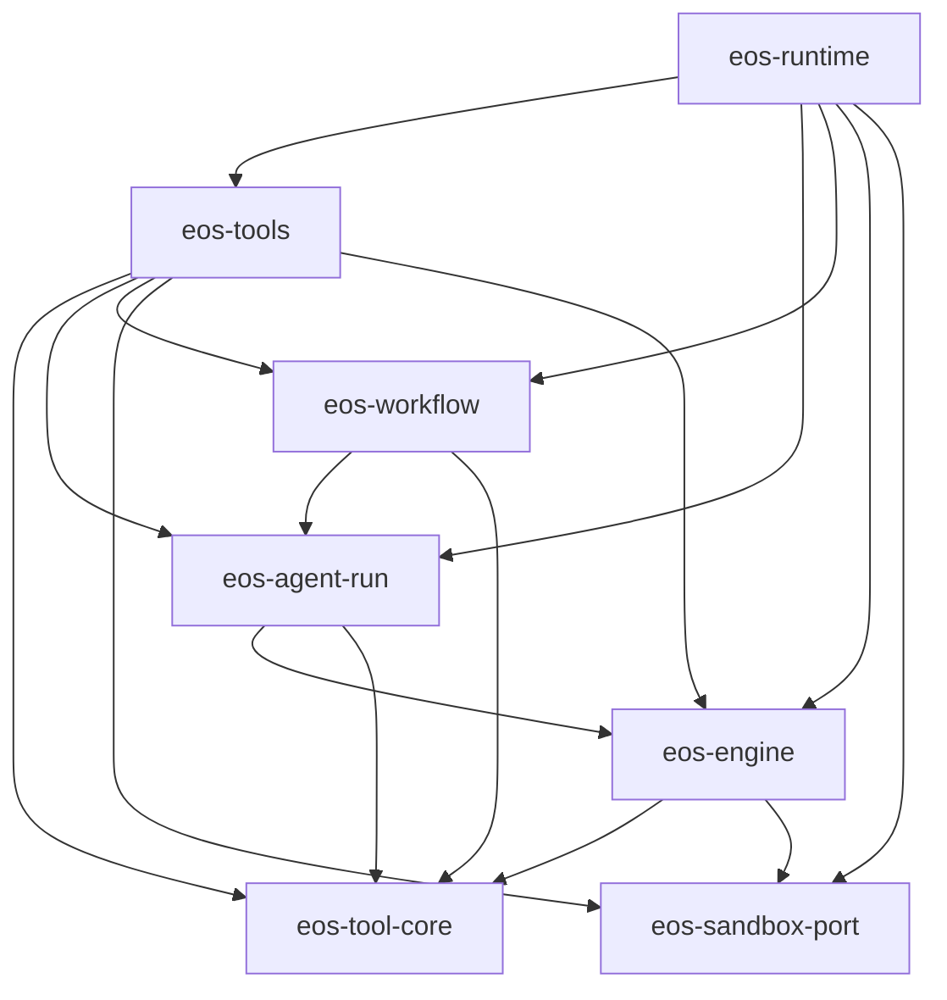

# Agent Run Ultra Architecture Simplification - SPEC

Status: Proposed
Date: 2026-06-08
Owner: agent-core runtime / agent-run / engine / tools
Scope: `agent-core/crates/eos-agent-run`, `agent-core/crates/eos-tool-core`,
`agent-core/crates/eos-engine`, `agent-core/crates/eos-tools`,
`agent-core/crates/eos-workflow`, `agent-core/crates/eos-sandbox-port`,
`agent-core/crates/eos-runtime`
Supersedes:
- `docs/plans/background_session_manager_refactor_SPEC.md`
- the agent-core implementation shape in
  `docs/plans/agent_run_local_background_supervisor_SPEC.md`

Related:
- `docs/plans/runtime_services_tool_metadata_split_SPEC.md`
- `docs/plans/uniform_recursive_cancellation_SPEC.md`
- `docs/plans/daemon_workspace_run_registry_SPEC.md`

## 1. Intent

This is not a narrow refactor. It is a destructive architecture simplification.
The target is to cut service objects, port objects, wrapper DTOs, and wiring
code by roughly half while keeping the actual product behavior:

- one generic way to launch any agent,
- one optional wait path for foreground/synchronous behavior,
- concrete engine-local background managers,
- model-facing tools that call domain services directly,
- no generic `eos-ports` crate,
- no engine-owned generic service folder,
- no engine-dispatched `ask_advisor` special case.

The central API is:

```rust
async fn spawn_agent(request: SpawnAgentRequest) -> Result<AgentRunId, AgentRunError>;

async fn wait_for_agent_outcomes(
    agent_run_id: &AgentRunId,
) -> Result<AgentRunOutcome, AgentRunError>;
```

`spawn_agent` and `wait_for_agent_outcomes` are agent-run service APIs. They are
not model tools and must not return `ToolResult`. Tools may call them internally
and then convert the result into model-facing `ToolResult` values.

## 2. Problems In The Current Shape

The current implementation has too many layers for the behavior it implements:

- `eos-ports` is a generic contract crate containing unrelated tool-core,
  workflow, agent-run, command, and background-session concepts.
- `eos-engine/src/services` makes the engine look like a composition/service
  layer even though the engine should only drive one agent loop.
- `ask_advisor` is registered as a tool in `eos-tools` but executed by an
  engine dispatch special case.
- `run_subagent` uses a subagent launch service and a separate subagent session
  registration port, producing a synthetic subagent session id instead of using
  the natural child `AgentRunId`.
- background is over-modeled as service ports and generic abstractions. In
  practice, background session stores track natural ids, managers poll
  completion by id, emit notifications, and cancel owned work for the
  request/run.
- root, workflow agents, subagents, and advisor agents still have divergent
  launch paths.

The target shape treats background as an engine-local implementation detail and
agent-run lifecycle as its own domain capability.

## 3. Design Rules

- `eos-engine` owns the engine loop, foreground resources, notification service,
  cancellation token, and concrete background managers for one running agent.
- `eos-agent-run` owns agent lifecycle: create ids, create controls, spawn the
  engine loop, publish outcomes, wait for outcomes, and cancel runs.
- All production agent starts enter through `AgentRunApi::spawn_agent`.
  Root requests, workflow agents, subagents, and advisor agents must not call
  `eos_engine::run_agent` directly. `eos_engine::run_agent` is the engine worker
  invoked by `AgentRunService` after the run has an `AgentRunId`, durable record,
  control, tool registry, active-run entry, and completion channel.
- `eos-tools` owns model-facing tool implementations and rendering.
- `eos-tool-core` owns neutral tool primitives required by both engine and tools.
- `eos-workflow` owns workflow lifecycle and exposes its own workflow API.
- `eos-sandbox-port` owns sandbox command RPC contracts and the command service
  over `SandboxTransport`.
- `eos-runtime` is the composition root.
- `ExecutionMetadata` remains a flat per-call fact bag. No service dependencies
  or managers are stored in metadata.
- Use concrete structs inside each crate. Use `dyn Trait` only at real runtime
  selection boundaries: LLM client, sandbox transport, tool executor, agent-run
  API injection, workflow API injection, sandbox command API injection.
- Background is not a public domain model. There is no `BackgroundWork`,
  `BackgroundWorkStart`, or shared public background-session port.

## 4. Target Crate Layout

```text
agent-core/crates/
  eos-tool-core/                         # new
    Cargo.toml
    src/
      lib.rs
      error.rs                           # ToolError
      metadata.rs                        # ExecutionMetadata
      result.rs                          # ToolResult, OutputShape
      intent.rs                          # ToolIntent
      name.rs                            # ToolName, ToolKey
      executor.rs                        # ToolExecutor, RegisteredTool
      registry.rs                        # ToolRegistry
      hooks.rs                           # Hook, HookOutcome, HookDenial
      execution.rs                       # execute_tool_once, run_pre_hooks
      dispatch_policy.rs                 # terminal/batch dispatch decisions

  eos-agent-run/                         # new
    Cargo.toml
    src/
      lib.rs
      error.rs                           # AgentRunError
      service.rs                         # AgentRunService
      request.rs                         # SpawnAgentRequest
      outcome.rs                         # AgentRunOutcome, AgentRunStatus
      active_runs.rs                     # ActiveAgentRuns, ActiveAgentRun
      control_factory.rs                 # optional home if moved out of engine

  eos-engine/
    src/
      lib.rs
      runtime/
        agent_loop.rs                    # run_agent only
        types.rs                         # EngineRunInput/Output/Handles
        control.rs                       # AgentRunControl, cancellation
        factory.rs                       # transitional if not moved yet
        foreground.rs
        persistence.rs
        registry.rs
        setup.rs
      background/
        mod.rs
        notification.rs
        background_session_manager/
          mod.rs                         # BackgroundManagers, BackgroundSessions, shared status/errors
          command_session_manager.rs     # CommandSession, CommandSessions, CommandSessionManager
          workflow_session_manager.rs    # WorkflowSession, WorkflowSessions, WorkflowSessionManager
          subagent_session_manager.rs    # SubagentSession, SubagentSessions, SubagentSessionManager
      query/
      tool_call/
      notifications/
      telemetry/
      support/
      # delete services/
      # delete runtime/advisor.rs

  eos-tools/
    src/
      lib.rs
      registry.rs                        # build_default_registry(...)
      services.rs                        # service bundle for tool constructors
      hooks/
      tools/
        ask_helper/
          mod.rs
          ask_advisor.rs                 # real executor
          advisor_prompt.rs              # prompt/transcript helpers
        subagent/
          mod.rs
          run_subagent.rs
          cancel_subagent.rs
        workflow/
          cancel_workflow.rs
        sandbox/
        submission/
        skills/
      # delete ports/

  eos-workflow/
    src/
      lib.rs
      api.rs                             # WorkflowApi trait + DTOs
      service.rs                         # WorkflowService
      ports.rs                           # delete or fold into api/service
      agent_runner.rs                    # uses AgentRunApi

  eos-sandbox-port/
    src/
      command_service.rs                 # SandboxCommandApi + service
      tool_api/
        command.rs                       # low-level daemon RPC helpers
      ...

  eos-runtime/
    src/
      entry.rs                           # root spawn + optional wait
      agent_runner.rs                    # may shrink or disappear
      runtime_services/
      tool_context.rs

  # delete eos-ports/
```

Workspace changes:

```toml
# agent-core/Cargo.toml
[workspace]
members = [
  "crates/eos-tool-core",
  "crates/eos-agent-run",
  # existing crates except "crates/eos-ports"
]

[workspace.dependencies]
eos-tool-core = { path = "crates/eos-tool-core" }
eos-agent-run = { path = "crates/eos-agent-run" }
# remove eos-ports
```

## 5. Dependency Direction



`eos-engine` must not depend on concrete tool implementations. It should receive
a `ToolRegistry` or a registry factory through the agent-run/runtime layer. This
is the dependency change that makes `ask_advisor` a normal tool and makes
`eos-agent-run` possible without circular dependencies.

`eos-tools` may depend on `eos-engine` for the concrete background session
handle types used by per-run tool executors. The dependency must not be
reversed: engine executes neutral `eos-tool-core` tool contracts and never
imports concrete tool implementations.

Manager service fields create one compile-time constraint: `AgentRunApi`,
`WorkflowApi`, and `SandboxCommandApi` must be available to `eos-engine`
background managers without pulling in concrete implementations that depend back
on `eos-engine`. Do not solve that by recreating `eos-ports`. If a concrete
owner crate would create a cycle, keep the trait in the owner's narrow API
surface and re-export it from the owner crate. The ownership remains
agent-run/workflow/sandbox-command, not a generic shared port module.

## 6. Class And Field Model

Rust "classes" here means structs, enums, and object-safe traits used at runtime
boundaries.

### 6.1 `eos-tool-core`

```rust
pub struct ExecutionMetadata {
    pub agent_name: String,
    pub agent_run_id: Option<AgentRunId>,
    pub request_id: Option<RequestId>,
    pub task_id: Option<TaskId>,
    pub attempt_id: Option<AttemptId>,
    pub workflow_id: Option<WorkflowId>,
    pub tool_use_id: Option<ToolUseId>,
    pub sandbox_invocation_id: Option<InvocationId>,
    pub sandbox_id: Option<SandboxId>,
    pub is_isolated_workspace_mode: bool,
    pub workspace_root: String,
    pub conversation: Arc<[Message]>,
}

pub struct ToolResult {
    pub output: String,
    pub is_error: bool,
    pub metadata: JsonObject,
    pub is_terminal: bool,
}

pub struct RegisteredTool {
    pub name: ToolName,
    pub description: String,
    pub input_schema: JsonObject,
    pub intent: ToolIntent,
    pub output_shape: OutputShape,
    pub pre_hooks: Vec<Arc<dyn Hook>>,
    pub executor: Arc<dyn ToolExecutor>,
}

pub struct ToolRegistry {
    tools: BTreeMap<ToolName, RegisteredTool>,
}

#[async_trait]
pub trait ToolExecutor: Send + Sync {
    async fn execute(
        &self,
        input: &JsonObject,
        ctx: &ExecutionMetadata,
    ) -> Result<ToolResult, ToolError>;
}
```

`ToolError`, `ToolResult`, `ExecutionMetadata`, `ToolExecutor`, and
`ToolRegistry` move out of `eos-ports`/`eos-tools::core` into `eos-tool-core`.

### 6.2 `eos-agent-run`

```rust
#[async_trait]
pub trait AgentRunApi: Send + Sync {
    async fn spawn_agent(&self, request: SpawnAgentRequest)
        -> Result<AgentRunId, AgentRunError>;

    async fn wait_for_agent_outcomes(&self, agent_run_id: &AgentRunId)
        -> Result<AgentRunOutcome, AgentRunError>;

    async fn poll_agent_run_outcome(&self, agent_run_id: &AgentRunId)
        -> Result<Option<AgentRunOutcome>, AgentRunError>;

    async fn cancel_agent_run(
        &self,
        agent_run_id: &AgentRunId,
        reason: &str,
    ) -> Result<(), AgentRunError>;
}

pub struct AgentRunService {
    engine: EngineRunner,
    agent_registry: Arc<AgentRegistry>,
    agent_run_store: Arc<dyn AgentRunStore>,
    control_factory: AgentRunControlFactory,
    tool_registry_factory: Arc<dyn ToolRegistryFactory>,
    active_runs: ActiveAgentRuns,
}

pub struct SpawnAgentRequest {
    pub agent_name: AgentName,
    pub agent_run_id: Option<AgentRunId>,
    pub initial_messages: Vec<Message>,
    pub parent_agent_run_id: Option<AgentRunId>,
    pub request_id: Option<RequestId>,
    pub task_id: Option<TaskId>,
    pub attempt_id: Option<AttemptId>,
    pub workflow_id: Option<WorkflowId>,
    pub sandbox_id: Option<SandboxId>,
    pub workspace_root: String,
    pub is_isolated_workspace_mode: bool,
    pub persist: bool,
    pub record_kind: AgentRunRecordKind,
}

pub struct AgentRunOutcome {
    pub agent_run_id: AgentRunId,
    pub status: AgentRunStatus,
    pub terminal_result: Option<ToolResult>,
    pub terminal_payload: Option<JsonObject>,
    pub message_history: Vec<Message>,
    pub token_count: Option<i64>,
    pub error: Option<String>,
}

pub enum AgentRunStatus {
    Completed,
    Failed,
    Cancelled,
}

pub struct ActiveAgentRuns {
    runs: Mutex<HashMap<AgentRunId, ActiveAgentRun>>,
}

pub struct ActiveAgentRun {
    pub control: Arc<AgentRunControl>,
    pub abort_handle: AbortHandle,
    pub outcome_tx: watch::Sender<Option<AgentRunOutcome>>,
}
```

`ActiveAgentRuns` is an in-process runtime registry, not the durable source of
truth. The durable source of truth remains `AgentRunStore` and the database rows
for agent runs. `ActiveAgentRuns` exists because active Tokio tasks have process
local resources that cannot live in the database: `AgentRunControl`,
`AbortHandle`, cancellation state, background managers, and the `watch` channel
used to wake waiters.

Do not implement the normal wait/cancel path by repeatedly querying
"running agent runs" from the database. Database `get_running_agent_runs` style
queries are useful for startup reconciliation, admin/status views, or detecting
orphaned rows after a crash. They are not a replacement for the in-process
registry while this process owns spawned tasks.

`spawn_agent` starts a new Tokio task and immediately returns the
`AgentRunId`. The spawned task owns execution and publishes exactly one terminal
`AgentRunOutcome` into the run's `watch` channel when the engine loop completes,
fails, or is cancelled. This is an internal completion signal, not a callback
API exposed to tools or callers.

Completion publication order:

1. Build the terminal `AgentRunOutcome`.
2. Persist the terminal outcome when the run is durable.
3. Publish `Some(outcome.clone())` through `outcome_tx`.
4. Remove or reap the live entry only after the outcome is reachable through
   either the durable store or the live `watch` value.

This invariant prevents lost completions without introducing a database watch.

Wait path:

1. Check the durable store first. If the run already has a terminal outcome,
   return it immediately.
2. Look up the active in-process run and subscribe to its `watch` channel only
   when a caller actually waits.
3. Re-check the current watch value before parking, so a just-finished run
   returns without an extra wake.
4. Park on `rx.changed().await` until the spawned task publishes the terminal
   outcome.

```rust
loop {
    if let Some(outcome) = rx.borrow().clone() {
        return Ok(outcome);
    }
    rx.changed().await?;
}
```

This is resource-effective: no interval loop, no busy wait, no per-call
background task, and no DB watch for the normal same-process case. The waiting
future is asleep until the `watch` channel is changed. If the run is not active
in this process and the durable store has no terminal outcome, return a typed
`AgentRunError::NotActiveInProcess`. Do not add a DB polling fallback in this
simplification. A future cross-process API can add a database notification or
queue-backed wakeup, but that is outside this spec.

Poll path:

`poll_agent_run_outcome` is intentionally different from
`wait_for_agent_outcomes`. It is a nonblocking status query for engine-local
background managers that already run on a configured interval.

```rust
pub async fn poll_agent_run_outcome(
    &self,
    agent_run_id: &AgentRunId,
) -> Result<Option<AgentRunOutcome>, AgentRunError> {
    if let Some(outcome) = self.active_runs.current_outcome(agent_run_id) {
        return Ok(Some(outcome));
    }

    self.agent_run_store
        .load_terminal_outcome(agent_run_id)
        .await
}
```

It must not call `rx.changed().await`, must not create its own timer, and must
not loop. It returns `Ok(None)` immediately while the run is still active or not
yet durably terminal. `SubagentSessionManager::poll_session_completions` calls
this API for active child `AgentRunId`s on the manager's configured poll
interval.

### 6.3 `eos-engine`

```rust
pub struct EngineRunInput {
    pub agent: AgentDefinition,
    pub initial_messages: Vec<Message>,
    pub metadata: ExecutionMetadata,
    pub tool_registry: ToolRegistry,
    pub cancellation: AgentRunCancellation,
    pub foreground: Arc<ForegroundExecutor>,
    pub notifications: NotificationService,
    pub background: BackgroundManagers,
    pub event_source: Option<Box<dyn EventSource>>,
    pub workspace_root: String,
    pub max_tokens: u32,
    pub persist_agent_run: bool,
    pub record_kind: AgentRunRecordKind,
}

pub struct EngineRunOutput {
    pub terminal_result: Option<ToolResult>,
    pub message_history: Vec<Message>,
    pub token_count: Option<i64>,
    pub error: Option<String>,
}

pub struct EngineRunHandles {
    pub llm_client: Arc<dyn LlmClient>,
    pub audit: Option<Arc<dyn AuditSink>>,
    pub message_records: Option<AgentMessageRecords>,
    pub event_source_factory: Option<EventSourceFactory>,
}

pub struct AgentRunControl {
    pub agent_run_id: AgentRunId,
    pub task_id: Option<TaskId>,
    pub cancellation: AgentRunCancellation,
    pub foreground: Arc<ForegroundExecutor>,
    pub notifications: NotificationService,
    pub background: BackgroundManagers,
}
```

Remove these fields from `EngineRunInput` / current `AgentRunInput`:

- `agent_run_service`,
- `subagent_sessions`,
- `workflow_service`,
- `workflow_sessions`,
- `command_session_port`,
- `attempt_submission`.

Those dependencies are captured by concrete tool executors inside the
`ToolRegistry` before the engine loop starts.

### 6.4 Engine-Local Background Managers

The concrete background managers stay, but only as engine-local implementation
details:

```rust
pub struct BackgroundManagers {
    pub sessions: BackgroundSessions,
    pub subagents: SubagentSessionManager,
    pub workflows: WorkflowSessionManager,
    pub commands: CommandSessionManager,
}

pub struct BackgroundSessions {
    pub subagents: SubagentSessions,
    pub workflows: WorkflowSessions,
    pub commands: CommandSessions,
}

pub struct SubagentSessions {
    sessions: Arc<Mutex<HashMap<AgentRunId, SubagentSession>>>,
}

pub struct WorkflowSessions {
    sessions: Arc<Mutex<HashMap<WorkflowId, WorkflowSession>>>,
}

pub struct CommandSessions {
    sessions: Arc<Mutex<HashMap<CommandSessionId, CommandSession>>>,
}

pub struct SubagentSessionManager {
    owner_agent_run_id: AgentRunId,
    sessions: SubagentSessions,
    agent_run_service: Arc<dyn AgentRunApi>,
    notifications: NotificationService,
}

pub struct WorkflowSessionManager {
    owner_agent_run_id: AgentRunId,
    sessions: WorkflowSessions,
    workflow_service: Arc<dyn WorkflowApi>,
    notifications: NotificationService,
}

pub struct CommandSessionManager {
    owner_agent_run_id: AgentRunId,
    sessions: CommandSessions,
    command_service: Arc<dyn SandboxCommandApi>,
    notifications: NotificationService,
}
```

Manager responsibilities:

| Manager | Active id source | Poll source | Bulk cancel source |
| --- | --- | --- | --- |
| `SubagentSessionManager` | `SubagentSessions::active_ids` | `AgentRunApi::poll_agent_run_outcome` | `AgentRunApi::cancel_agent_run` |
| `WorkflowSessionManager` | `WorkflowSessions::active_ids` | `WorkflowApi::poll_terminal_workflow` | `WorkflowApi::cancel_workflow` |
| `CommandSessionManager` | `CommandSessions::active_ids` | `SandboxCommandApi::collect_completed_commands` | `SandboxCommandApi::cancel_commands_for_run` |

There is no `BackgroundWorkStart`, `BackgroundWork`, `BackgroundSessionPort`,
`SubagentSessionPort`, `WorkflowSessionPort`, or `CommandSessionPort`.

The managers use the real service APIs for their kind. There is no new
subagent-specific poll service: `AgentRunApi` owns the methods required to poll
and cancel child agent runs.

The per-kind managers are lifecycle workers. They do not register sessions and
do not produce model-facing progress views. Snapshot-style APIs should not exist
in the background session surface. Single-session cancellation exists only for
subagents and workflows because `cancel_subagent` and `cancel_workflow` need to
route cancellation through the same concrete manager that owns the relevant
service dependency.

Manager methods should be private to `eos-engine::background` at the widest.
Target visibility is `pub(super)` from each kind manager to the background
scheduler for polling/count/list methods. `pub(in crate::background)` is
acceptable as a temporary migration step if the current module layout needs it.
`cancel(...)` on subagent and workflow managers is public because model-facing
cancel tools call it:

```rust
impl SubagentSessionManager {
    pub(super) async fn poll_session_completions(&self) -> usize;
    pub async fn cancel(&self, child_run_id: &AgentRunId, reason: &str)
        -> Result<bool, BackgroundSessionError>;
    pub(super) async fn cancel_all_active_sessions(&self, reason: &str);
    pub(super) async fn get_active_session_count(&self) -> usize;
    pub(super) async fn get_active_session_ids(&self) -> Vec<AgentRunId>;
}

impl WorkflowSessionManager {
    pub(super) async fn poll_session_completions(&self) -> usize;
    pub async fn cancel(&self, workflow_id: &WorkflowId, reason: &str)
        -> Result<bool, BackgroundSessionError>;
    pub(super) async fn cancel_all_active_sessions(&self, reason: &str);
    pub(super) async fn get_active_session_count(&self) -> usize;
    pub(super) async fn get_active_session_ids(&self) -> Vec<WorkflowId>;
}

impl CommandSessionManager {
    pub(super) async fn poll_session_completions(&self) -> usize;
    pub(super) async fn cancel_all_active_sessions(&self, reason: &str);
    pub(super) async fn get_active_session_count(&self) -> usize;
    pub(super) async fn get_active_session_ids(&self) -> Vec<CommandSessionId>;
}
```

Session-state handles own registration and active-id enumeration:

```rust
impl SubagentSessions {
    pub async fn track(&self, child_run_id: AgentRunId, agent_name: AgentName);
    pub async fn active_ids(&self) -> Vec<AgentRunId>;
}

impl WorkflowSessions {
    pub async fn track(&self, workflow_id: WorkflowId, goal: String);
    pub async fn active_ids(&self) -> Vec<WorkflowId>;
}

impl CommandSessions {
    pub async fn track(&self, command_session_id: CommandSessionId, sandbox_id: SandboxId);
    pub async fn active_ids(&self) -> Vec<CommandSessionId>;
}
```

The target module layout is flat under `background_session_manager`:

```text
eos-engine/src/background/
  mod.rs
  notification.rs
  background_session_manager/
    mod.rs
    command_session_manager.rs
    workflow_session_manager.rs
    subagent_session_manager.rs
```

Do not keep nested `session_managers/<kind>/{mod,manager,monitor,session}.rs`
folders in the target. Each kind gets one flat `[kind]_session_manager.rs` file
declared from `background_session_manager/mod.rs`.

Per-run session handles are injected into the tool executors that create
background work. Subagent and workflow manager handles are injected into the
tool executors that cancel one active subagent/workflow. They are not exposed
through `ExecutionMetadata`, and they are not global singleton services. The
registry factory builds these tool instances for one `AgentRunControl`, so the
injected handles are the current parent run's concrete background state.

Registration happens in the tool-call path through the concrete session store
for the kind of work being launched:

| Tool path | Per-run executor fields | Operation |
| --- | --- | --- |
| `run_subagent` | `Arc<dyn AgentRunApi>`, `SubagentSessions` | After `spawn_agent` returns a child `AgentRunId`, call `SubagentSessions::track(child_run_id, agent_name)`. |
| `cancel_subagent` | `SubagentSessionManager` | Call `SubagentSessionManager::cancel(child_run_id, reason)`. |
| `delegate_workflow` | `Arc<dyn WorkflowApi>`, `WorkflowSessions` | After `WorkflowService::start_workflow` returns `WorkflowId`, call `WorkflowSessions::track(workflow_id, goal)`. |
| `cancel_workflow` | `WorkflowSessionManager` | Call `WorkflowSessionManager::cancel(workflow_id, reason)`. |
| `exec_command` / `write_stdin` | `Arc<dyn SandboxCommandApi>`, `CommandSessions` | If the command is still running after `yield_time_ms`, call `CommandSessions::track(command_session_id, sandbox_id)`. |

If a tool creates external work and then fails to register it with the parent
run, it must cancel or clean up that work before returning an error. Returning a
handle that is not tracked by the parent background session store is invalid.

Target tool fields:

```rust
pub struct DelegateWorkflow {
    workflow: Arc<dyn WorkflowApi>,
    workflow_sessions: WorkflowSessions,
}

pub struct CancelWorkflow {
    workflow_sessions: WorkflowSessionManager,
}

pub struct ExecCommand {
    command: Arc<dyn SandboxCommandApi>,
    command_sessions: CommandSessions,
}

pub struct CancelSubagent {
    subagent_sessions: SubagentSessionManager,
}
```

`ExecCommand` must not depend on `AgentRunApi`. It talks to the sandbox command
service to create or continue command work, and it talks to
`CommandSessions` to track a still-running command for the current parent run.

Target command registration flow:

```rust
let result = self.command.exec_command(&sandbox_id, &request).await?;

if result.is_still_running_after_yield() {
    let command_session_id = result.require_command_session_id()?;
    self.command_sessions
        .track(command_session_id.clone(), sandbox_id.clone())
        .await;

    return Ok(command_running_result(command_session_id));
}

Ok(command_finished_result(result))
```

Target workflow registration flow:

```rust
let started = self.workflow.start_workflow(request).await?;
self.workflow_sessions
    .track(started.workflow_id.clone(), started.goal.clone())
    .await;

Ok(workflow_started_result(started.workflow_id))
```

### 6.5 `eos-sandbox-port`

```rust
#[async_trait]
pub trait SandboxCommandApi: Send + Sync {
    async fn exec_command(
        &self,
        sandbox_id: &SandboxId,
        request: &ExecCommandRequest,
    ) -> Result<ExecCommandResult, SandboxPortError>;

    async fn write_stdin(
        &self,
        sandbox_id: &SandboxId,
        request: &ExecStdinRequest,
    ) -> Result<ExecCommandResult, SandboxPortError>;

    async fn read_command_progress(
        &self,
        sandbox_id: &SandboxId,
        request: &ReadCommandProgressRequest,
    ) -> Result<ExecCommandResult, SandboxPortError>;

    async fn cancel_command_session(
        &self,
        sandbox_id: &SandboxId,
        request: &CommandSessionCancelRequest,
    ) -> Result<ExecCommandResult, SandboxPortError>;

    async fn collect_completed_commands(
        &self,
        sandbox_id: &SandboxId,
        caller_id: &AgentRunId,
        command_session_ids: &[CommandSessionId],
    ) -> Result<Vec<JsonObject>, SandboxPortError>;

    async fn cancel_commands_for_run(
        &self,
        sandbox_id: &SandboxId,
        caller_id: &AgentRunId,
        reason: &str,
    ) -> Result<(), SandboxPortError>;
}

pub struct SandboxCommandService {
    transport: Arc<dyn SandboxTransport>,
}
```

`eos-tools` maps `SandboxPortError` to `ToolError::Sandbox` when rendering tool
results. `eos-engine` background command managers can also depend on this API.

### 6.6 `eos-workflow`

```rust
#[async_trait]
pub trait WorkflowApi: Send + Sync {
    async fn start_workflow(&self, request: StartWorkflowRequest)
        -> Result<StartedWorkflow, WorkflowError>;

    async fn check_workflow_status(
        &self,
        workflow_id: &WorkflowId,
    ) -> Result<String, WorkflowError>;

    async fn cancel_workflow(
        &self,
        workflow_id: &WorkflowId,
        reason: &str,
    ) -> Result<(), WorkflowError>;

    async fn poll_terminal_workflow(
        &self,
        workflow_id: &WorkflowId,
    ) -> Result<Option<TerminalWorkflow>, WorkflowError>;

    async fn find_outstanding_workflows(
        &self,
        parent_task_id: &TaskId,
        agent_run_id: &AgentRunId,
    ) -> Result<Vec<OutstandingWorkflow>, WorkflowError>;
}

pub struct WorkflowService {
    stores: WorkflowStores,
    orchestrators: AttemptOrchestratorRegistry,
    context_engine: ContextEngine,
    agent_run: Arc<dyn AgentRunApi>,
    config: WorkflowLifecycleConfig,
}
```

Workflow agents launch through `AgentRunApi::spawn_agent`, not by manually
calling `eos_engine::run_agent`.

## 7. `ask_advisor` Implementation

`ask_advisor` becomes a normal model-facing tool executor in
`eos-tools/src/tools/ask_helper/ask_advisor.rs`.

Target fields:

```rust
pub struct AskAdvisor {
    agent_run: Arc<dyn AgentRunApi>,
}
```

Execution:

```rust
#[async_trait]
impl ToolExecutor for AskAdvisor {
    async fn execute(
        &self,
        input: &JsonObject,
        ctx: &ExecutionMetadata,
    ) -> Result<ToolResult, ToolError> {
        let parsed: AskAdvisorInput = parse_input(ToolName::AskAdvisor, input)?;
        let messages = build_advisor_messages(
            ctx,
            &parsed.tool_name,
            &parsed.tool_payload,
        );

        let advisor_run_id = self.agent_run.spawn_agent(SpawnAgentRequest {
            agent_name: AgentName::new("advisor")?,
            initial_messages: messages,
            parent_agent_run_id: ctx.agent_run_id.clone(),
            request_id: ctx.request_id.clone(),
            task_id: ctx.task_id.clone(),
            sandbox_id: ctx.sandbox_id.clone(),
            workspace_root: ctx.workspace_root.clone(),
            is_isolated_workspace_mode: ctx.is_isolated_workspace_mode,
            persist: true,
            record_kind: AgentRunRecordKind::Advisor {
                parent_agent_run_id: ctx.agent_run_id.clone(),
            },
            ..Default::default()
        }).await?;

        let outcome = self
            .agent_run
            .wait_for_agent_outcomes(&advisor_run_id)
            .await?;

        Ok(advisor_outcome_to_tool_result(outcome))
    }
}
```

Required behavior:

- no engine dispatch special case,
- no unreachable executor,
- no `eos-engine/src/runtime/advisor.rs`,
- no background manager registration,
- advisor is synchronous only because the tool waits,
- advisor terminal result is converted into a non-terminal parent `ToolResult`,
- advisor crash/no-terminal-output becomes in-band `ToolResult::error`.

Files:

```text
eos-tools/src/tools/ask_helper/
  ask_advisor.rs       # executor + input/output conversion
  advisor_prompt.rs    # moved prompt/transcript construction from engine

eos-engine/src/runtime/advisor.rs       # delete
eos-engine/src/tool_call/dispatch.rs    # remove ask_advisor interception
```

## 8. `run_subagent` Implementation

`run_subagent` remains an async launch tool. It calls `spawn_agent` and returns
the child `AgentRunId`. It does not wait.

Target fields:

```rust
pub struct RunSubagent {
    agent_run: Arc<dyn AgentRunApi>,
    subagent_sessions: SubagentSessions,
}
```

Execution:

```rust
#[async_trait]
impl ToolExecutor for RunSubagent {
    async fn execute(
        &self,
        input: &JsonObject,
        ctx: &ExecutionMetadata,
    ) -> Result<ToolResult, ToolError> {
        let parsed: RunSubagentInput = parse_input(ToolName::RunSubagent, input)?;
        validate_subagent_input(&parsed)?;

        let parent_agent_run_id = ctx.require_agent_run_id()?.clone();
        let agent_name = AgentName::new(&parsed.agent_name)?;
        let child_run_id = self.agent_run.spawn_agent(SpawnAgentRequest {
            agent_name: agent_name.clone(),
            initial_messages: vec![
                Message::from_user_text(parsed.prompt),
                Message::from_user_text(explorer_launch_guidance()),
            ],
            parent_agent_run_id: Some(parent_agent_run_id.clone()),
            request_id: ctx.request_id.clone(),
            sandbox_id: ctx.sandbox_id.clone(),
            workspace_root: ctx.workspace_root.clone(),
            is_isolated_workspace_mode: ctx.is_isolated_workspace_mode,
            persist: true,
            record_kind: AgentRunRecordKind::Subagent {
                parent_agent_run_id: parent_agent_run_id.clone(),
            },
            ..Default::default()
        }).await?;

        self.subagent_sessions
            .track(child_run_id.clone(), agent_name)
            .await;

        Ok(subagent_launched_result(&child_run_id, &parsed.agent_name))
    }
}
```

Launch result:

```text
[SUBAGENT LAUNCHED] agent_run_id="<id>" status=running agent_name="<name>"
```

Metadata:

```json
{
  "agent_run_id": "...",
  "status": "running",
  "agent_name": "explorer"
}
```

Registration with the parent session store is a tool-call side effect, not
an internal side effect of `AgentRunService::spawn_agent`. This keeps
`spawn_agent` generic: it launches an agent and returns `AgentRunId`; the tool
decides whether that id becomes background work for the parent.

There is no `check_subagent_progress` tool in the target shape. Progress is
delivered by background completion notifications. `cancel_subagent` remains a
model-facing tool, but it calls `SubagentSessionManager::cancel(child_run_id,
reason)` rather than using a session port or a session-state mutation API.

## 9. Root, Workflow, Subagent, Advisor Flow

```mermaid
flowchart TD
  RootApi["root API request"] --> SpawnRoot["AgentRunService::spawn_agent(root)"]
  SpawnRoot --> WaitRoot["wait_for_agent_outcomes(root_id)"]

  Workflow["workflow service"] --> SpawnWorkflowAgent["spawn_agent(workflow agent)"]
  SpawnWorkflowAgent --> WaitWorkflowAgent["wait_for_agent_outcomes(agent_id)"]

  SubTool["run_subagent tool"] --> SpawnSub["spawn_agent(subagent)"]
  SpawnSub --> TrackSub["SubagentSessions.track(child id)"]
  TrackSub --> ReturnSubId["return child AgentRunId"]
  CancelSub["cancel_subagent tool"] --> CancelSubMgr["SubagentSessionManager.cancel(child id)"]

  WorkflowTool["delegate_workflow tool"] --> StartWorkflow["WorkflowApi::start_workflow"]
  StartWorkflow --> TrackWorkflow["WorkflowSessions.track(workflow id)"]
  TrackWorkflow --> ReturnWorkflowId["return WorkflowId"]
  CancelWorkflow["cancel_workflow tool"] --> CancelWorkflowMgr["WorkflowSessionManager.cancel(workflow id)"]

  CommandTool["exec_command tool"] --> ExecCommand["SandboxCommandApi::exec_command"]
  ExecCommand --> CommandDone["return completed command output"]
  ExecCommand --> TrackCommand["CommandSessions.track(command session id)"]
  TrackCommand --> ReturnCommandId["return CommandSessionId"]

  AdvisorTool["ask_advisor tool"] --> SpawnAdvisor["spawn_agent(advisor)"]
  SpawnAdvisor --> WaitAdvisor["wait_for_agent_outcomes(advisor_id)"]
  WaitAdvisor --> AdvisorResult["convert to parent ToolResult"]

  SpawnRoot --> Engine["eos_engine::run_agent"]
  SpawnWorkflowAgent --> Engine
  SpawnSub --> Engine
  SpawnAdvisor --> Engine
```



Agent foreground/background behavior is not encoded in launch kind. For agent
runs, it is determined by whether the caller invokes
`wait_for_agent_outcomes`. Workflow and command background behavior is
determined by whether the tool registers the natural id with the concrete
manager before returning.

The production launch path has no bypass around `AgentRunService::spawn_agent`.
Direct calls to `eos_engine::run_agent` are allowed only inside focused
`eos-engine` tests, benchmarks, or temporary migration shims that are removed by
the final phase.

## 10. Removal Plan

| Remove | Replacement |
| --- | --- |
| `agent-core/crates/eos-ports/` | `eos-tool-core`, `eos-agent-run`, `eos-workflow::api`, `eos-sandbox-port::command_service` |
| `eos-engine/src/services/agent_run.rs` | `eos-agent-run/src/service.rs` |
| `eos-engine/src/services/command.rs` | `eos-sandbox-port/src/command_service.rs` |
| `eos-engine/src/services/mod.rs` | no replacement |
| `eos-engine/src/runtime/advisor.rs` | `eos-tools/src/tools/ask_helper/{ask_advisor,advisor_prompt}.rs` |
| `eos-tools/src/ports/mod.rs` | direct imports from owner crates |
| `AgentRunServicePort::start_subagent_run` | `AgentRunApi::spawn_agent` |
| `AgentRunServicePort::poll_terminal_agent_run` | `AgentRunApi::poll_agent_run_outcome` |
| `SubagentSessionPort` | parent `BackgroundManagers.subagents` internal tracking |
| `WorkflowSessionPort` | parent `BackgroundManagers.workflows` internal tracking |
| `CommandSessionPort` | parent `BackgroundManagers.commands` internal tracking |
| `BackgroundSessionService` as public port bundle | `AgentRunControl.background: BackgroundManagers` |
| `BackgroundTeardownPort` | `AgentRunControl::cancel_background(reason)` concrete method |
| engine `ask_advisor` dispatch branch | normal tool executor |

## 11. Migration Phases

### Phase 1 - Extract `eos-tool-core`

- Add `eos-tool-core`.
- Move `ToolError`, `ToolResult`, `ExecutionMetadata`, `ToolName`,
  `ToolIntent`, `ToolRegistry`, `RegisteredTool`, `ToolExecutor`, hooks,
  execution helpers, and dispatch policy.
- Update `eos-tools` to become concrete tool registration/executor crate over
  `eos-tool-core`.
- Keep temporary re-exports from `eos-tools` if needed for a short compile
  bridge.

Verification:

```bash
cd agent-core
cargo check -p eos-tool-core --all-targets
cargo check -p eos-tools --all-targets
```

### Phase 2 - Add `eos-agent-run`

- Add `AgentRunApi`, `AgentRunService`, `SpawnAgentRequest`, `AgentRunOutcome`,
  `ActiveAgentRuns`.
- Move agent-run orchestration out of `eos-engine/src/services/agent_run.rs`.
- Implement watch-based outcome delivery.

Verification:

```bash
cd agent-core
cargo check -p eos-agent-run --all-targets
cargo test -p eos-agent-run
```

### Phase 3 - Simplify Engine Background

- Keep concrete command/workflow/subagent managers.
- Add `BackgroundManagers` aggregate.
- Make `AgentRunControl` own `BackgroundManagers` directly.
- Remove public background/session ports.
- Remove `BackgroundSessionService` as a multi-port bundle.
- Replace teardown port with concrete `AgentRunControl` cancellation methods.

Verification:

```bash
cd agent-core
cargo check -p eos-engine --all-targets
cargo test -p eos-engine background
```

### Phase 4 - Move Command Service To `eos-sandbox-port`

- Add `SandboxCommandApi` and `SandboxCommandService`.
- Move the transport adapter from `eos-engine/src/services/command.rs`.
- Keep low-level `tool_api/command.rs` helpers.
- Update tools and engine command manager to use `SandboxCommandApi`.

Verification:

```bash
cd agent-core
cargo check -p eos-sandbox-port --all-targets
cargo check -p eos-engine --all-targets
```

### Phase 5 - Convert `ask_advisor`

- Move advisor prompt/transcript construction into `eos-tools`.
- Inject `Arc<dyn AgentRunApi>` into `AskAdvisor`.
- Call `spawn_agent`, then `wait_for_agent_outcomes`.
- Remove engine dispatch interception and `runtime/advisor.rs`.

Verification:

```bash
cd agent-core
cargo test -p eos-tools ask_advisor
cargo test -p eos-engine tool_call
```

### Phase 6 - Convert `run_subagent`

- Inject `Arc<dyn AgentRunApi>` into `RunSubagent`.
- Call `spawn_agent` and return child `AgentRunId`.
- Remove `SubagentSessionPort` and `SubagentSessionId` from model-facing
  launch result.
- Delete `check_subagent_progress` as a model-facing subagent-session tool.
- Convert `cancel_subagent` to call `SubagentSessionManager::cancel` with child
  `AgentRunId`.

Verification:

```bash
cd agent-core
cargo test -p eos-tools run_subagent
cargo test -p eos-runtime subagent
```

### Phase 7 - Delete `eos-ports` And Engine Services

- Remove `eos-ports` from workspace members and dependencies.
- Delete `eos-engine/src/services`.
- Delete compatibility re-exports.
- Update docs and golden outputs.

Verification:

```bash
cd agent-core
cargo check --workspace --all-targets
cargo test --workspace
```

## 12. Acceptance Criteria

- There is no `agent-core/crates/eos-ports` crate.
- There is no `agent-core/crates/eos-engine/src/services` folder.
- `eos-engine` no longer special-cases `ask_advisor` in tool dispatch.
- `ask_advisor` is a normal tool executor that calls `spawn_agent` and
  `wait_for_agent_outcomes`.
- `run_subagent` calls `spawn_agent` and returns `agent_run_id`.
- `run_subagent` does not call a session registration port.
- There is no model-facing `check_subagent_progress` subagent-session tool.
- `cancel_subagent` calls `SubagentSessionManager::cancel` with child
  `AgentRunId`.
- `cancel_workflow` calls `WorkflowSessionManager::cancel` with `WorkflowId`.
- `delegate_workflow` registers `WorkflowId` with `WorkflowSessions`
  directly after workflow start.
- `exec_command` registers a still-running `CommandSessionId` with
  `CommandSessions` directly after the sandbox command yields.
- `ExecCommand` does not depend on `AgentRunApi`.
- `CommandSessionManager` exposes only `poll_session_completions`,
  `cancel_all_active_sessions`, `get_active_session_count`, and
  `get_active_session_ids` to the background scheduler.
- `SubagentSessionManager` and `WorkflowSessionManager` expose the same
  scheduler methods plus public `cancel(...)` for model-facing cancel tools.
- Background session state exposes no `snapshot` API and no single-session
  cancellation API; single cancellation is a manager operation for subagents and
  workflows only.
- `SubagentSessionPort`, `WorkflowSessionPort`, and `CommandSessionPort` are
  removed.
- `BackgroundManagers` is a concrete field on `AgentRunControl`.
- `eos-engine/src/background` still contains concrete command, workflow, and
  subagent managers under flat `background_session_manager/*_session_manager.rs`
  files.
- `eos-engine/src/background/session_managers/<kind>/...` nested folders are
  removed.
- `spawn_agent` always returns `AgentRunId`.
- Root, workflow, subagent, and advisor launch paths call
  `AgentRunApi::spawn_agent`; production code outside `eos-agent-run` does not
  call `eos_engine::run_agent` directly.
- `wait_for_agent_outcomes` always returns `AgentRunOutcome`.
- `wait_for_agent_outcomes` uses watch-based completion delivery and parks on
  `rx.changed().await`; it does not poll the store on an interval.
- `poll_agent_run_outcome` is nonblocking, returns `Option<AgentRunOutcome>`,
  and is called by background managers on their configured interval.
- `ActiveAgentRuns` stores only in-process runtime handles; durable running-run
  queries are used for reconciliation/status, not as the wait/cancel handle
  store.
- Agent foreground/background behavior is determined only by whether the caller
  waits.
- `ExecutionMetadata` remains flat and contains only facts.
- Tool services are captured by tool constructors, not by metadata.

## 13. Risks And Guardrails

| Risk | Guardrail |
| --- | --- |
| Moving too much at once hides behavior regressions | Keep phases compiling one by one; tests must prove root/workflow/subagent/advisor launch paths. |
| `eos-engine` accidentally depends on concrete `eos-tools` again | Engine accepts `ToolRegistry`; registry construction happens in runtime/agent-run/tools layer. |
| `eos-tools -> eos-engine` grows beyond background handles | Allow session handles for launch tools and subagent/workflow manager handles for cancel tools; do not import engine loop, dispatch, query, or runtime internals into tool implementations. |
| Background managers become public service objects again | Keep them concrete under `eos-engine::background`; pass manager handles to `AgentRunControl` and only to cancel tools that need single subagent/workflow cancellation. |
| Polling and waiting collapse into one hidden loop | Managers only call `poll_agent_run_outcome`; foreground callers only call `wait_for_agent_outcomes`, which uses a `watch` receiver and no timer. |
| `ToolError` leaks into sandbox port | `eos-sandbox-port` returns `SandboxPortError`; tools map it at the boundary. |
| Subagent launch loses progress/cancel UX | Use child `AgentRunId` as the handle and keep manager-backed progress/cancel behavior. |

## 14. Expected Net Simplification

Deleted or collapsed:

- one crate: `eos-ports`,
- one engine folder: `eos-engine/src/services`,
- three session ports,
- one generic background service bundle,
- synthetic subagent session ids for launch,
- engine advisor special dispatch,
- duplicated command service adapter,
- per-agent-run service fields on engine input.

The surviving runtime objects are the ones that carry real state:

- `AgentRunService`,
- `ActiveAgentRuns`,
- `AgentRunControl`,
- `BackgroundManagers`,
- `SubagentSessionManager`,
- `WorkflowSessionManager`,
- `CommandSessionManager`,
- `ToolRegistry`,
- concrete tool executors.

That is the intended simplification boundary: fewer object types, fewer trait
objects, fewer constructor parameters, and one launch path for every agent.
