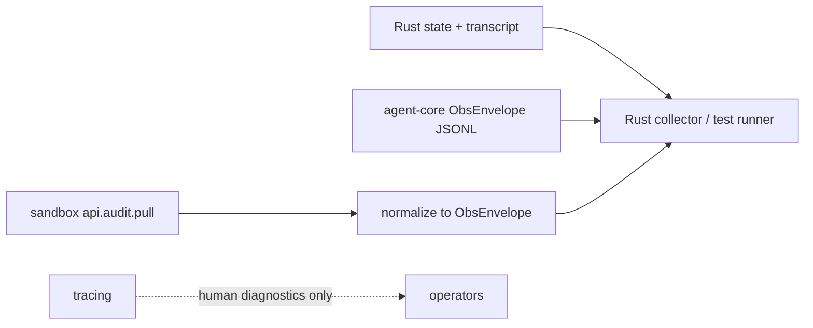
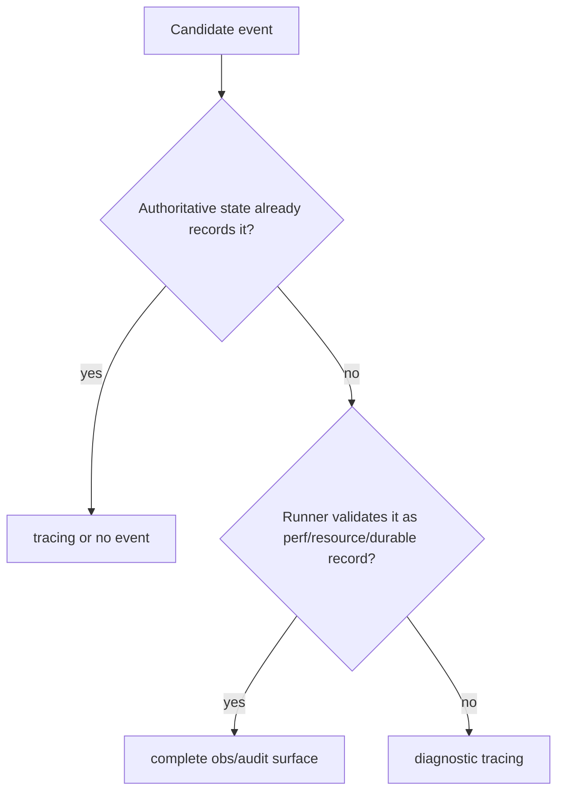

# Rust audit / observability consumption plan

## Goal

Build a Rust-only audit/observability contract for `agent-core/`, `sandbox/`, and
the future Rust test runner.

Python under `backend/src` is legacy migration context only. This plan does not
add new Python audit code, does not preserve Python-specific report shapes as a
target, and should not introduce new Python compatibility shims. The target
consumer is a Rust collector/test runner that validates:

- tool use
- performance stats
- resource usage
- message correctness

The design goal is a small, coherent consumption path, not a richer audit
framework.

## Current Direction

The shared layer now lives in:

- `base/crates/eos-obs-contract`

That crate is the only shared audit/observability module. It owns the normalized
contract row used by collectors:

- `ObsEnvelope`
- `ObsIds`
- `ObsSource`
- `SCHEMA = "eos.obs.v1"`
- canonical event constants and aliases
- JSONL parse/serialize helpers

It must stay contract-only. It must not own sinks, daemon rings, tracing setup,
producer policy, plugin wrappers, report rendering, or test-runner orchestration.

## Architecture



| Surface | Owner | Guarantee | Consumer | Carries |
|---|---|---|---|---|
| Authoritative state and transcript | `agent-core` | complete by construction | Rust runner | tool use, terminal outcomes, message correctness |
| Agent-core obs JSONL | `agent-core` | complete or counted-loss in test mode | Rust runner | agent/tool durations, process resource samples |
| Sandbox audit ring | `sandbox` | bounded ring with seq/lane/loss counters | Rust runner through normalizer | sandbox timings, OCC, layer stack, overlay, background command, plugin/resource records |
| Tracing | owning Rust crate | best effort | humans only | reconstructable lifecycle shadows and diagnostics |

## Event Routing Rule



Consequences:

- Tool use and message correctness come from Rust state/transcript, not audit
  shadows.
- Performance and resource data are event-only signals, so they must be emitted
  on a complete/counted-loss obs surface, never only through tracing.
- Reconstructable lifecycle rows such as `workflow.task.*`, agent-core
  `background_tool.*`, and dead `engine.tool.*` projections move to tracing or
  are deleted.

## Shared Contract

`base/crates/eos-obs-contract` is the normalized collector contract:

```json
{
  "schema": "eos.obs.v1",
  "source": "agent_core",
  "type": "tool_call.completed",
  "ids": {
    "request_id": "req-1",
    "task_id": "task-1",
    "agent_run_id": "ar-1",
    "tool_use_id": "toolu-1",
    "sandbox_id": "sbx-1"
  },
  "payload": {
    "tool_call": {
      "tool_name": "exec_command",
      "duration_ms": 42.0,
      "status": "ok"
    }
  }
}
```

Rules:

- `ids` contains ids only. Labels such as `tool_name` stay in `payload`.
- `payload` preserves native sections such as `tool_call`, `occ`,
  `layer_stack`, `overlay_workspace`, `background_tool`, `plugin`, and
  `os_resource`.
- Event categories are reader-side only. Do not add `category` to producer wire
  shapes.
- Canonical event names live in the contract. Legacy aliases can be normalized
  by the collector, but producers should emit canonical names.

## Producer Contracts

### Agent-core

Agent-core emits normalized `ObsEnvelope` JSONL directly.

Minimum event set:

| Event | Payload section | Purpose |
|---|---|---|
| `agent_run.completed` | `agent_run` | agent-run duration, status, exit reason |
| `tool_call.completed` | `tool_call` | per-tool duration, status, terminal flag, optional timings |
| `os_resource.sampled` | `os_resource` | process RSS/CPU/IO sample |

Do not emit audit rows for tool correctness or message correctness. The runner
reads those from state/transcript.

### Sandbox

Sandbox keeps `api.audit.pull` / `api.audit.snapshot` as the daemon-owned read
surface. The ring keeps its own native mechanics:

- seq
- lane
- bounded retention
- pressure/loss counters
- pull/snapshot RPCs

The Rust collector converts pulled daemon events into `ObsEnvelope` rows.

Required sandbox cleanup:

- Replace ad hoc dispatcher `json!` payload construction with typed
  `eos-protocol::audit::*Section` values.
- Canonicalize event names, especially `tool_call.finished` vs
  `tool_call.completed`.
- Wire `OsResourceSection` emission on a sample lane.
- Keep sandbox-native sections local to `sandbox`; do not force agent-core to use
  sandbox section structs.

### Tracing

Tracing is for human diagnostics only. It may carry:

- workflow task ready/launched/failed shadows
- subagent/background lifecycle shadows
- engine stream progress diagnostics
- publish failures and unexpected states

The Rust runner must not validate pass/fail criteria from tracing.

## Cleanup Plan

1. **Keep `base/eos-obs-contract` small.**
   - No internal EphemeralOS crate dependencies.
   - No runtime sinks.
   - No daemon ring logic.
   - No report builder.

2. **Shrink `agent-core/crates/eos-audit`.**
   - Delete `AuditEventBus`.
   - Delete dead `engine_stream` projection if no production caller exists.
   - Remove plugin audit wrappers unless they are wired to a real Rust execution
     path.
   - Remove redaction helpers if they become unused after deleting the engine
     projection.
   - Keep only the local agent-core obs writer/adapter needed to emit
     `ObsEnvelope` JSONL.

3. **Move reconstructable shadows to tracing.**
   - `workflow.task.*`
   - agent-core `background_tool.*`
   - dead `engine.tool.*` audit rows

4. **Reduce dependency edges.**
   - `eos-workflow` should not depend on audit after workflow shadows move to
     tracing.
   - `eos-engine` should depend on the minimal obs writer only where it emits
     real perf/resource rows.
   - `eos-tools` should not depend on audit unless a real tool-level emission
     site remains.

5. **Type sandbox emitters.**
   - Keep behavior and wire shape stable where possible.
   - Use canonical event names for new/changed emissions.
   - Add tests that pulled events normalize to valid `ObsEnvelope` rows.

6. **Build the Rust collector later.**
   - Read agent-core obs JSONL.
   - Pull sandbox daemon audit events.
   - Normalize both into `ObsEnvelope`.
   - Join with Rust state/transcript for correctness checks.

## Staged Execution

| Stage | Work | Verification |
|---|---|---|
| 0 | `base/crates/eos-obs-contract` contract crate | `cargo test --manifest-path base/Cargo.toml -p eos-obs-contract`; clippy |
| 1 | Update plan/docs to Rust-only contract direction | markdown review; no Python target paths |
| 2 | Agent-core audit deletion pass | `cargo test -p eos-audit`; affected agent-core crates |
| 3 | Agent-core obs JSONL using `ObsEnvelope` | JSONL unit/integration smoke test |
| 4 | Shadow events to tracing + dependency edge cleanup | affected crate tests; dependency guard updates if still present |
| 5 | Sandbox typed emitters + resource samples | `cargo test -p eos-protocol -p eos-daemon`; pull smoke test |
| 6 | Rust collector normalizer | normalization tests from agent-core row + sandbox pull event |
| 7 | Rust runner/report gates | state/transcript correctness + obs perf/resource gates |

Stages 2-4 and 5 can proceed in parallel if the only shared dependency is the
stable `base/eos-obs-contract` crate.

## Verification Gates

- `base`: `cargo test --manifest-path base/Cargo.toml -p eos-obs-contract`
- `base`: `cargo clippy --manifest-path base/Cargo.toml -p eos-obs-contract --all-targets -- -D warnings`
- `agent-core`: targeted crate tests from the owning workspace.
- `sandbox`: targeted crate tests from the owning workspace.
- Normalization smoke:
  - one agent-core `ObsEnvelope` JSONL row parses
  - one sandbox `api.audit.pull` event normalizes to `ObsEnvelope`
  - `tool_call.finished` aliases to `tool_call.completed`
  - `tool_use_id` joins agent-core and sandbox rows for the same tool call

## Open Decisions

- Whether agent-core keeps the crate name `eos-audit` for its local writer or
  renames to an obs-focused name.
- Exact process-resource sampling cadence for agent-core.
- Whether isolated-workspace JSONL remains a separate sandbox source or is
  mirrored into the daemon audit ring.

## Risks

- Do not let `base/` become a junk drawer. If a type needs runtime state, sinks,
  locks, async tasks, daemon lanes, or report rendering, it does not belong in
  `base/`.
- Do not validate runner pass/fail criteria from tracing.
- Do not create a shared producer framework across `agent-core` and `sandbox`.
  Share only the normalized contract.
- Verify correlation wiring explicitly. The join depends on the provider
  `tool_use_id` flowing into sandbox invocation metadata or an explicit mapping
  row.
- Keep edits scoped around concurrent work in `agent-core/` and `sandbox/`; this
  repo often has parallel agent edits in progress.
