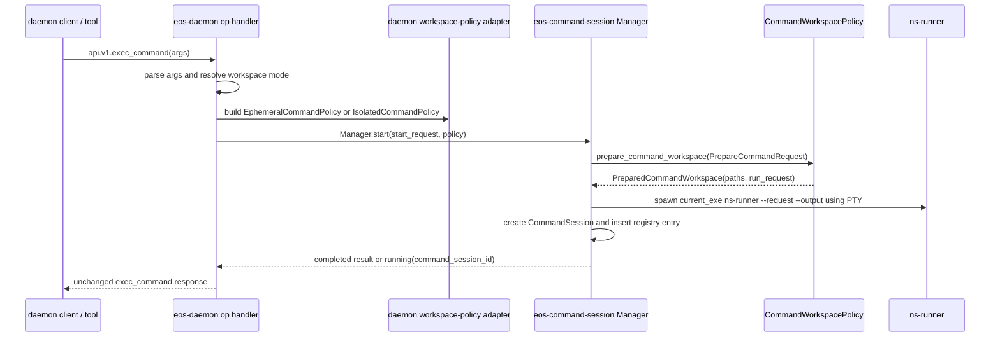
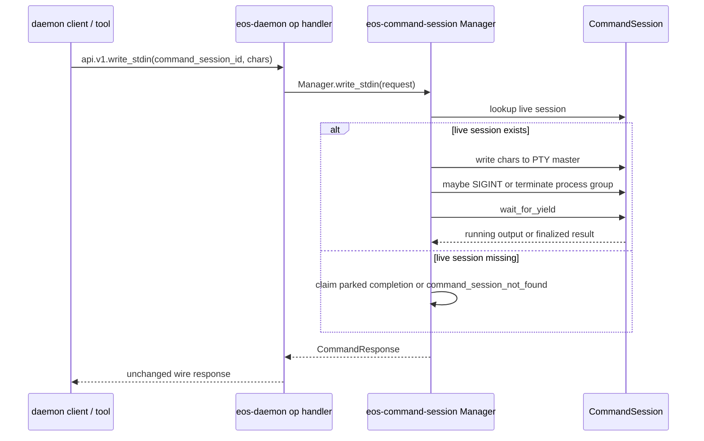
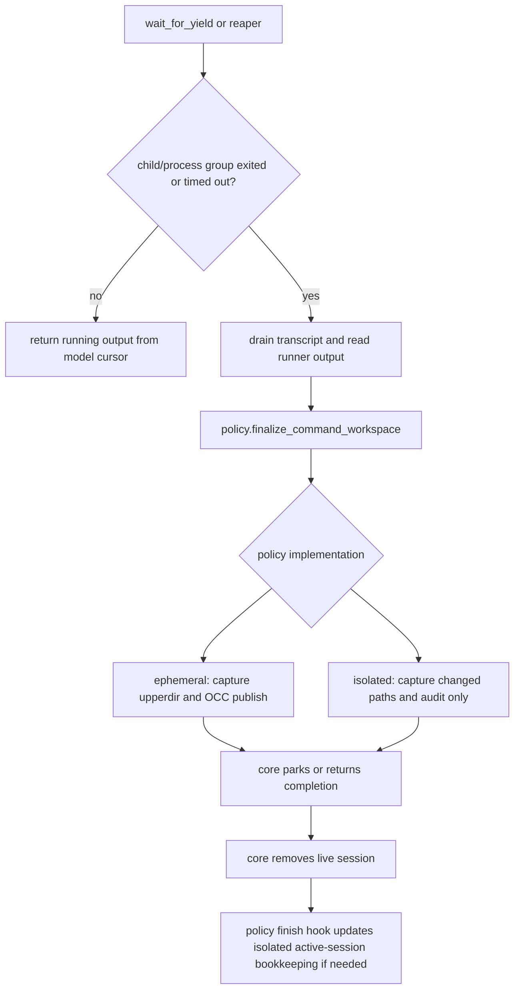

# SPEC: Workspace-Mode-Agnostic `eos-command-session`

Status: DRAFT
Date: 2026-06-05
Owner doc: `docs/plans/eos-command-session-workspace-mode-agnostic_SPEC.md`
Scope: `sandbox/crates/eos-command-session` as a new crate,
`sandbox/crates/eos-workspace-api` as the existing shared contract crate,
`sandbox/crates/eos-daemon` as the composition and daemon-op adapter layer, and
the existing workspace policy crates:
`sandbox/crates/eos-ephemeral-workspace` and
`sandbox/crates/eos-isolated-workspace`.

This spec extracts daemon-owned command-session runtime behavior into a
workspace-mode-agnostic crate without making that crate depend on either
workspace-mode implementation. `eos-ephemeral-workspace` and
`eos-isolated-workspace` remain responsible only for command workspace policy:
prepare a runner workspace and finalize the runner result according to that
workspace mode's rules.

The existing public command contract stays unchanged:

```text
exec_command(...)
write_stdin(command_session_id, ...)
```

Internal daemon controls also stay unchanged:

```text
api.v1.command.cancel
api.v1.command.collect_completed
api.v1.command_session_count
```

---

## 1. Goals

1. Make `eos-command-session` the single owner of command-session runtime
   lifecycle: session id generation, PTY/process group, output buffering,
   cursors, yield waiting, stdin writes, cancel/terminate, completion parking,
   timeout sweep, orphan recovery hooks, and result delivery.
2. Make `eos-command-session` workspace-mode agnostic. It must not import or
   depend on `eos-ephemeral-workspace`, `eos-isolated-workspace`, `eos-layerstack`,
   `eos-occ`, or `eos-daemon`.
3. Keep `eos-ephemeral-workspace` and `eos-isolated-workspace` as workspace-mode
   policy implementations behind shared `eos-workspace-api` traits and DTOs.
4. Keep `eos-daemon` as the composition root for sandbox daemon command
   sessions: it resolves the workspace mode, builds the concrete policy adapter,
   wires daemon ports, registers wire ops, and maps daemon config into
   `eos-command-session` config.
5. Preserve current behavior for `exec_command`, `write_stdin`, cancel,
   collect-completed, command-session count, reaper cleanup, and isolated
   no-publish finalization.
6. Prevent new dependency back-edges by making the allowed dependency graph
   explicit and testable.

## 2. Non-Goals

- No model-facing tool rename.
- No daemon wire op rename.
- No isolated workspace promotion path.
- No plugin or LSP execution inside isolated mode.
- No new public isolated workspace id routing parameter.
- No new abstraction for file operations in this spec beyond what
  `eos-workspace-api` already owns or separately specifies.
- No broad rewrite of LayerStack, OCC, overlay, runner, or isolated namespace
  internals.
- No `eos-command-session` dependency on workspace-mode crates. If a command
  session change appears to require that dependency, the responsibility belongs
  in a daemon adapter or a workspace policy crate instead.

---

## 3. Implementation State Summary

Command-session runtime code now lives in the new runtime crate, with the daemon
kept as the composition and wire adapter layer:

```text
sandbox/crates/eos-command-session/src/
  manager.rs    # policy-erased manager, Linux process-backed start/write/cancel/sweep
  registry.rs   # typed live/completed registry used by the manager
  output.rs     # output buffer/cursors and UTF-8 handling
  wait.rs       # generic yield waiting
  process/      # Linux PTY, process group, runner request/output handling

sandbox/crates/eos-daemon/src/services/command_session/
  mod.rs        # daemon op handlers, cleanup/reaper/orphan recovery entry points
  config.rs     # daemon config -> eos-command-session config
  wire.rs       # serde_json parse and response helpers
  ports/        # daemon concrete workspace policy ports
```

The workspace policy contract lives in the existing shared crate:

```text
sandbox/crates/eos-workspace-api/src/command_session.rs
```

That file defines `CommandWorkspacePolicy` and states the boundary:
mode-specific command workspace policy belongs behind the trait, while
PTY/process/session registry behavior stays outside it.

The old daemon runtime files have been retired:

```text
sandbox/crates/eos-daemon/src/services/command_session/finalize.rs
sandbox/crates/eos-daemon/src/services/command_session/lifecycle.rs
sandbox/crates/eos-daemon/src/services/command_session/session.rs
```

The remaining daemon-owned pieces are composition-only: parse and shape wire
JSON, select the workspace mode, build the concrete workspace-policy port,
maintain isolated active-session bookkeeping through policy hooks, and scan
scratch metadata at startup so orphaned sessions can be parked in the runtime
registry.

---

## 4. Target Ownership Model

| Owner | Owns | Must Not Own |
|---|---|---|
| `eos-command-session` | Command-session aggregate, registry, PTY/process lifecycle, output/cursors, wait/yield, stdin, cancel, timeout sweep, completion parking, generic result delivery | LayerStack leases, OCC publishing, isolated handle lifecycle, daemon op registration |
| `eos-workspace-api` | Shared command workspace DTOs and policy trait | Concrete policy implementation, daemon services |
| `eos-ephemeral-workspace` | Fresh-overlay command prepare/finalize policy, snapshot/run-dir/publish semantics through ports | PTY, process lifecycle, command registry, daemon wire ops |
| `eos-isolated-workspace` | Existing-handle command prepare/finalize policy, namespace/setns request shape, audit-only no-publish semantics | PTY, process lifecycle, command registry, daemon wire ops |
| `eos-daemon` | Wire op handlers, mode selection, concrete policy ports, isolated active-session hook wiring, config mapping | Reimplementing command-session runtime after extraction |

The important distinction:

- Workspace crates manage **command workspace policy**.
- `eos-command-session` manages **command session lifecycle**.
- `eos-daemon` wires them together.

---

## 5. Dependency Contract

Allowed dependency direction:

```text
eos-workspace-api
  ↑
  ├── eos-command-session
  ├── eos-ephemeral-workspace
  └── eos-isolated-workspace

eos-daemon
  ├── eos-command-session
  ├── eos-ephemeral-workspace
  └── eos-isolated-workspace
```

`eos-command-session` allowed dependencies:

- `eos-workspace-api`
- `eos-runner`
- `eos-protocol` only if response DTO reuse is cleaner than local DTOs
- `serde`, `serde_json`, `thiserror`
- `nix` and `rustix` under Linux target dependencies

`eos-command-session` forbidden dependencies:

- `eos-daemon`
- `eos-ephemeral-workspace`
- `eos-isolated-workspace`
- `eos-layerstack`
- `eos-occ`
- `eos-overlay`
- plugin crates

The dependency check is an acceptance gate, not a preference.

---

## 6. Rust OOP, Polymorphism, Generics, and API Rules

This design uses Rust's version of OOP: small trait interfaces, concrete structs
with private state, explicit ownership, and composition. It must not introduce an
inheritance-style base class or a broad workspace superclass. Polymorphism is
used where the runtime actually needs substitutability.

### 6.1 Polymorphism Decision Table

| Boundary | Mechanism | Why |
|---|---|---|
| Workspace command policy contract | Object-safe trait in `eos-workspace-api` | `eos-command-session` needs one interface for prepare/finalize without depending on concrete workspace crates. |
| Ephemeral policy implementation | `EphemeralCommandPolicy<P>` implements `CommandWorkspacePolicy` | The policy object owns prepare/finalize state while the daemon supplies a concrete port. |
| Isolated policy implementation | `IsolatedCommandPolicy<P>` implements `CommandWorkspacePolicy` | Same pattern as ephemeral; no shared base class and no dependency between workspace modes. |
| Daemon policy selection | concrete factory returns a boxed policy | The selected mode is known only after daemon request/context inspection. |
| Live session registry | `Box<dyn CommandWorkspacePolicy + Send + Sync + 'static>` stored in `CommandSession` | The registry holds both ephemeral and isolated sessions at the same time, so this is the one justified dynamic-dispatch boundary. |
| Policy lifecycle hooks | `CommandWorkspacePolicy::command_session_started/finished` | Lets isolated bookkeeping stay mode-specific without making `eos-command-session` inspect `WorkspaceMode`. |
| Process spawner | concrete `NativeProcessSpawner`; optional test-only trait/generic seam | Do not abstract process spawning unless tests need a fake. Keep the production API narrow. |

### 6.2 Interface Rules

- Traits are named by capability, not by implementation:
  `CommandWorkspacePolicy` and optionally `CommandProcessSpawner`.
- Trait methods used behind `dyn` must be object-safe: no generic methods, no
  `Self` return, no associated types required by callers, and no `Self: Sized`
  bound on the trait.
- Prefer generics for concrete policy and port implementations. Use `dyn` only
  where heterogeneous runtime storage is required.
- Do not make `eos-command-session` generic over workspace mode. The mode is not
  a type parameter of the command-session aggregate; it is hidden behind the
  policy interface.
- Keep public DTOs concrete and serializable. Do not expose type parameters in
  wire-adjacent request/result types.
- Use typed IDs/newtypes for domain identifiers where practical:
  `CommandSessionId`, `AgentId`, `InvocationId`, and `WorkspaceHandleId`.
- Keep fields private on runtime aggregates. State transitions go through
  methods like `write_stdin`, `cancel`, `try_finalize`, and `sweep`.
- Prefer `&str`, `&Path`, and slices for borrowed inputs; use owned values only
  for cross-session or cross-thread state.
- Public crate roots must be thin re-export surfaces. Implementation stays in
  focused modules.

### 6.3 API Compatibility Rules

- `CommandWorkspacePolicy` lives in `eos-workspace-api` because both workspace
  policy crates implement it and `eos-command-session` consumes it.
- `eos-command-session` may expose a generic convenience method:

  ```rust
  pub fn start<P>(
      &self,
      request: StartCommandSession,
      policy: P,
  ) -> Result<CommandResponse, CommandSessionError>
  where
      P: CommandWorkspacePolicy + 'static,
  {
      self.start_boxed(request, Box::new(policy))
  }
  ```

- `start_boxed` is the explicit erasure point for daemon-selected policies:

  ```rust
  pub type DynCommandWorkspacePolicy =
      Box<dyn CommandWorkspacePolicy + Send + Sync + 'static>;

  pub fn start_boxed(
      &self,
      request: StartCommandSession,
      policy: DynCommandWorkspacePolicy,
  ) -> Result<CommandResponse, CommandSessionError>;
  ```

- Workspace crates should not construct `Box<dyn CommandWorkspacePolicy>` for
  their own internal work. They implement the trait generically over their port
  structs and let daemon erase the selected concrete type at the boundary.
- If object-safety pressure appears, do not add boxed futures or generic methods
  to the policy trait. Move mode-specific needs into concrete policy state or
  concrete port structs.

---

## 7. Workflow With Demonstration

### 7.1 Start Flow



Demonstration:

```rust
// eos-daemon: composition and routing only.
pub fn op_exec_command(args: &Value, context: DispatchContext<'_>) -> Result<Value, DaemonError> {
    let start = parse_exec_command(args)?;
    let policy = command_policy_factory.policy_for(&start, args, context)?;

    command_session_manager.start_boxed(start, policy)
        .map_err(DaemonError::from)
        .map(command_response_to_wire)
}
```

```rust
// eos-command-session: mode-agnostic start path.
pub fn start(
    &self,
    request: StartCommandSession,
    policy: impl CommandWorkspacePolicy + 'static,
) -> Result<CommandResponse, CommandSessionError> {
    self.start_boxed(request, Box::new(policy))
}

pub fn start_boxed(
    &self,
    request: StartCommandSession,
    policy: DynCommandWorkspacePolicy,
) -> Result<CommandResponse, CommandSessionError> {
    let id = self.registry.next_id();
    let prepared = policy.prepare_command_workspace(request.prepare(id.clone()))?;
    let process = self.process_spawner.spawn(&prepared)?;
    let session = CommandSession::new(id, request, prepared, process, policy);

    self.registry.insert(session.clone());
    wait_for_yield(&session, request.yield_time_ms, request.max_output_tokens)
}
```

### 7.2 `write_stdin` and Poll Flow



`chars=""` remains progress polling. This path does not branch on workspace mode.

### 7.3 Completion, Reaper, and Finalization Flow



Demonstration:

```rust
impl CommandSession {
    fn try_finalize(&self, publish: bool) -> Option<CommandResponse> {
        let exit = self.process.try_reap()?;
        self.process.terminate_group();

        let runner_result = self.runner_result();
        let transcript = self.output.completed_stdout();

        let outcome = self.policy.finalize_command_workspace(FinalizeCommandRequest {
            runner_result,
            command_elapsed_s: self.started_at.elapsed().as_secs_f64(),
            spool_truncated: self.output.spool_truncated(),
            status: exit.status,
            exit_code: exit.code,
            stdout: transcript,
            stderr: String::new(),
            command_session_id: publish.then(|| self.id.to_string()),
        })?;

        Some(CommandResponse::from_workspace_outcome(outcome))
    }
}
```

The core does not know whether `outcome` came from an OCC-publish finalizer or
an audit-only finalizer.

---

## 8. API Shape

### 8.1 `eos-workspace-api`

The former `CommandWorkspaceOps` name has been retired in favor of the
object-safe `CommandWorkspacePolicy`. The new crate should not own this trait
because both workspace crates must implement it without depending on
command-session runtime internals.

Target trait:

```rust
pub trait CommandWorkspacePolicy: Send + Sync {
    fn prepare_command_workspace(
        &self,
        request: PrepareCommandRequest,
    ) -> Result<PreparedCommandWorkspace, WorkspaceApiError>;

    fn finalize_command_workspace(
        &self,
        request: FinalizeCommandRequest,
    ) -> Result<WorkspaceCommandOutcome, WorkspaceApiError>;
}
```

Object-safety compile guard:

```rust
fn _assert_command_workspace_policy_object_safe(_: &dyn CommandWorkspacePolicy) {}
```

Concrete implementation pattern:

```rust
pub struct EphemeralCommandPolicy<P>
where
    P: EphemeralCommandSessionPort,
{
    port: P,
    state: Mutex<Option<EphemeralCommandWorkspace>>,
}

impl<P> CommandWorkspacePolicy for EphemeralCommandPolicy<P>
where
    P: EphemeralCommandSessionPort + Send + Sync,
{
    fn prepare_command_workspace(
        &self,
        request: PrepareCommandRequest,
    ) -> Result<PreparedCommandWorkspace, WorkspaceApiError> {
        let prepared = prepare::prepare_command_workspace(&self.port, request)?;
        *self.state.lock()? = Some(prepared.workspace);
        Ok(prepared.prepared)
    }

    fn finalize_command_workspace(
        &self,
        request: FinalizeCommandRequest,
    ) -> Result<WorkspaceCommandOutcome, WorkspaceApiError> {
        let workspace = self.state.lock()?.take().ok_or_else(...)?;
        let context = self.finalize_context(&workspace)?;
        finalize::finalize_command_workspace(&self.port, context, request)
    }
}
```

`PreparedCommandWorkspace` should contain all mode-agnostic paths the command
runtime needs:

```rust
pub struct PreparedCommandWorkspace {
    pub run_request: Value,
    pub request_path: PathBuf,
    pub output_path: PathBuf,
    pub final_path: PathBuf,
    pub session_dir: PathBuf,
    pub transcript_path: PathBuf,
}
```

This prevents `eos-command-session` from deriving session paths differently per
mode.

### 8.2 `eos-command-session`

Public crate facade:

```rust
pub type DynCommandWorkspacePolicy =
    Box<dyn CommandWorkspacePolicy + Send + Sync + 'static>;

pub struct CommandSessionManager {
    registry: CommandSessionRegistry,
    config: CommandSessionConfig,
    spawner: ProcessSpawner,
}

impl CommandSessionManager {
    pub fn start(
        &self,
        request: StartCommandSession,
        policy: impl CommandWorkspacePolicy + 'static,
    ) -> Result<CommandResponse, CommandSessionError>;

    pub fn start_boxed(
        &self,
        request: StartCommandSession,
        policy: DynCommandWorkspacePolicy,
    ) -> Result<CommandResponse, CommandSessionError>;

    pub fn write_stdin(
        &self,
        request: WriteStdin,
    ) -> Result<CommandResponse, CommandSessionError>;

    pub fn cancel(
        &self,
        request: CancelCommandSession,
    ) -> Result<CommandResponse, CommandSessionError>;

    pub fn collect_completed(&self, request: CollectCompleted) -> CollectCompletedResponse;

    pub fn count_by_caller(&self, caller_id: Option<&str>) -> usize;

    pub fn sweep(&self) -> SweepReport;
}
```

`eos-command-session` does not call isolated workspace services and does not
inspect `WorkspaceMode`. Isolated active-session bookkeeping is driven by the
`CommandWorkspacePolicy` start/finish hooks on the isolated policy object.

### 8.3 `eos-daemon`

Daemon owns concrete policy factories:

```rust
pub trait DaemonCommandPolicyFactory {
    fn policy_for(
        &self,
        request: &StartCommandSession,
        args: &Value,
        context: DispatchContext<'_>,
    ) -> Result<DynCommandWorkspacePolicy, DaemonError>;
}
```

Concrete adapters live in daemon because they need daemon ports and service
access:

```text
eos-daemon/src/services/command_session/ports/ephemeral.rs
eos-daemon/src/services/command_session/ports/isolated.rs
```

---

## 9. Diff / Comparison Table

| Area | Current | Target | Verification |
|---|---|---|---|
| Runtime owner | `eos-daemon/src/services/command_session` owns all runtime and policy glue | `eos-command-session` owns runtime; daemon wires policy | `rg "struct CommandSession" sandbox/crates/eos-command-session/src` |
| Workspace mode storage | Daemon `CommandSession` stores `DynCommandWorkspacePolicy` plus prepared paths/context | Runtime `CommandSession` stores `DynCommandWorkspacePolicy`; mode-specific context stays inside the policy object | `rg "CommandWorkspaceKind" sandbox/crates/eos-daemon/src/services/command_session sandbox/crates/eos-command-session` returns no matches |
| Workspace crate coupling | Daemon session lifecycle imports both workspace crates | New runtime crate imports only `eos-workspace-api` and runner/process deps | `cargo tree -p eos-command-session` has no workspace-mode crates |
| Ephemeral policy | Daemon adapter plus `eos-ephemeral-workspace` prepare/finalize | Adapter remains in daemon; policy implementation remains in `eos-ephemeral-workspace` | Existing ephemeral command tests still pass |
| Isolated policy | Daemon adapter plus `eos-isolated-workspace` prepare/finalize; runtime calls isolated register/unregister | Workspace policy remains in `eos-isolated-workspace`; active-session bookkeeping via policy hooks | Isolated command-session E2E confirms no leaked active records |
| Start path | `start_command_session` and `start_isolated_command_session` split early | One `Manager.start(request, policy)` path | Unit test starts both modes through same core manager |
| Finalization | Daemon session finalizes through stored `policy.finalize_command_workspace(...)` | Runtime session finalizes through stored `policy.finalize_command_workspace(...)` | No mode match in `eos-command-session/src/session.rs` |
| Output/cursors | Daemon-private output module | `eos-command-session/src/output.rs` | Output cursor tests moved to new crate |
| Cancel/terminate | Daemon `finalize.rs` | `eos-command-session` manager/control module | Existing cancel tests pass unchanged |
| Reaper/orphan recovery | Daemon service functions | Manager sweep plus daemon startup wiring | Startup orphan recovery test still passes |
| Polymorphism | Mode branches are concrete runtime matches | Generics in policy implementations; dyn only at session storage boundary | `rg "dyn CommandWorkspacePolicy" eos-ephemeral-workspace eos-isolated-workspace` returns no matches |
| Public API | unchanged | unchanged | Contract snapshots and live smoke unchanged |

---

## 10. Resulting File and Folder Structure

### 10.1 New `eos-command-session`

```text
sandbox/crates/eos-command-session/
  Cargo.toml
  src/
    lib.rs                    # thin exports only
    config.rs                 # CommandSessionConfig and defaults
    error.rs                  # CommandSessionError
    id.rs                     # CommandSessionId if not sourced from eos-types
    request.rs                # StartCommandSession, WriteStdin, Cancel, Collect
    response.rs               # CommandResponse, CollectCompletedResponse
    manager.rs                # public facade over registry/control/spawn/sweep
    registry.rs               # live sessions, completed map, id generation
    session.rs                # CommandSession aggregate and state transitions
    output.rs                 # output ring/spool/cursors and UTF-8 handling
    wait.rs                   # wait_for_yield and quiet-after-output logic
    process/
      mod.rs                  # ProcessSpawner facade
      child.rs                # child process wrapper and process-group status
      pty.rs                  # Linux PTY helper using safe rustix APIs
      signal.rs               # SIGINT/SIGTERM/SIGKILL process-group control
    runner.rs                 # ns-runner request/output file handling
    sweep.rs                  # timeout and stale-session sweep
  tests/
    registry.rs
    output.rs
    wait.rs
    manager_ephemeral.rs      # fake policy, no eos-ephemeral dependency
    manager_isolated.rs       # fake policy, no eos-isolated dependency
    cancel.rs
    collect_completed.rs
```

`manager_ephemeral.rs` and `manager_isolated.rs` use fake implementations of
`CommandWorkspacePolicy`. They must not import the real workspace crates.

### 10.2 Existing `eos-workspace-api`

```text
sandbox/crates/eos-workspace-api/src/
  lib.rs
  mode.rs
  response.rs
  command_session.rs          # CommandWorkspacePolicy and command DTOs
```

Expected changes:

- Add `Send + Sync` bound if the trait is stored behind `dyn`.
- Add `session_dir` and `transcript_path` to `PreparedCommandWorkspace`.
- Keep command-session DTOs free of daemon-specific error and service types.
- Add an object-safety compile guard for `CommandWorkspacePolicy`.

### 10.3 Existing `eos-ephemeral-workspace`

```text
sandbox/crates/eos-ephemeral-workspace/src/
  command_session/
    mod.rs                    # thin exports
    policy.rs                 # EphemeralCommandPolicy<P>
    prepare.rs                # snapshot, fresh run dirs, runner request
    finalize.rs               # upperdir capture, OCC publish via port, outcome
    types.rs                  # prepare/finalize contexts and daemon port trait
```

Expected changes:

- Continue to own publish-capable command workspace policy.
- Return `session_dir` and `transcript_path` in `PreparedCommandWorkspace`.
- Do not add PTY/process/session registry helpers.
- Implement `CommandWorkspacePolicy` generically over the existing
  `EphemeralCommandSessionPort`; do not box the policy inside the workspace
  crate.

### 10.4 Existing `eos-isolated-workspace`

```text
sandbox/crates/eos-isolated-workspace/src/
  command_session/
    mod.rs                    # thin exports
    policy.rs                 # IsolatedCommandPolicy<P>
    prepare.rs                # existing handle/setns runner request
    finalize.rs               # changed-path capture, audit-only outcome
    types.rs                  # prepare/finalize contexts and daemon port trait
```

Expected changes:

- Continue to own no-publish command workspace policy.
- Return `session_dir` and `transcript_path` in `PreparedCommandWorkspace`.
- Do not add command-session registry or cancel/reaper behavior.
- Implement `CommandWorkspacePolicy` generically over the existing
  `IsolatedCommandSessionPort`; do not box the policy inside the workspace
  crate.

### 10.5 Existing `eos-daemon`

```text
sandbox/crates/eos-daemon/src/services/command_session/
  mod.rs                      # daemon op handlers and manager setup only
  config.rs                   # daemon config -> eos-command-session config
  wire.rs                     # serde_json wire parse/response helpers
  ports/
    mod.rs
    ephemeral.rs              # LayerStack/OCC daemon port for ephemeral policy
    isolated.rs               # isolated handle daemon port for isolated policy
```

Retired daemon-local runtime files after extraction:

```text
finalize.rs                   # generic finalization/stdin/cancel moved to eos-command-session
lifecycle.rs                  # start path replaced by policy factory plus manager start
session.rs                    # live registry/session state moved to eos-command-session
```

`eos-daemon` keeps wire registration in `ops/command_sessions.rs` and
`ops/registry.rs`; those functions call the manager instead of owning runtime
internals.

---

## 11. Migration Process

### Phase 0: Spec and Guardrails

- Add this spec.
- Add dependency guard notes to the eventual PR description.
- Identify all command-session tests that should move to the new crate.

### Phase 1: Contract Preparation

- Update `eos-workspace-api/src/command_session.rs` to expose the final
  object-safe policy trait.
- Add `session_dir` and `transcript_path` to `PreparedCommandWorkspace`.
- Add the object-safety compile guard for `CommandWorkspacePolicy`.
- Update `eos-ephemeral-workspace` and `eos-isolated-workspace` prepare paths to
  populate the new fields.
- Keep `eos-daemon` behavior unchanged.

### Phase 2: Create `eos-command-session` With Fake Policies

- Add crate to `sandbox/Cargo.toml` members and workspace dependencies.
- Move output buffer/cursor code first.
- Move registry and wait/yield code using fake policies.
- Move process/PTY/spawn code behind Linux cfg.
- Add crate-local fake-policy tests before wiring daemon.

### Phase 3: Wire Daemon to New Manager

- Replace daemon start paths with policy factory plus `Manager.start`.
- Replace daemon `write_stdin`, cancel, collect, count, and reaper functions
  with manager calls.
- Wire isolated active-session register/unregister bookkeeping through
  `CommandWorkspacePolicy` start/finish hooks.
- Keep wire response shape byte-for-byte compatible where existing tests assert
  exact JSON.

### Phase 4: Delete Compatibility and Mode Branches

- Remove `CommandWorkspaceKind`, `EphemeralCommandWorkspace`, and
  `IsolatedCommandWorkspace` from daemon command-session runtime.
- Remove old daemon `session.rs`, `output.rs`, and `pty.rs` once equivalent code
  lives in the new crate.
- Remove any stale direct imports of workspace crates from command-session core.

### Phase 5: Verification and Live Smoke

- Run crate-local checks and tests.
- Run daemon command tests.
- Run isolated command-session tests.
- Run live command-session smoke if daemon/runtime wiring changed.
- Update architecture docs after implementation, especially sandbox workspace
  pages that still mention older daemon command paths.

---

## 12. Acceptance Criteria

### Dependency Acceptance

- `cargo tree -p eos-command-session` contains no:
  - `eos-daemon`
  - `eos-ephemeral-workspace`
  - `eos-isolated-workspace`
  - `eos-layerstack`
  - `eos-occ`
  - `eos-overlay`
- `eos-ephemeral-workspace` and `eos-isolated-workspace` both depend on
  `eos-workspace-api`, not on `eos-command-session`.
- `eos-daemon` is the only crate that depends on both `eos-command-session` and
  the concrete workspace-mode crates.

### Source-Shape Acceptance

- `rg "CommandWorkspaceKind|EphemeralCommandWorkspace|IsolatedCommandWorkspace" sandbox/crates/eos-command-session` returns no matches.
- `rg "eos_ephemeral_workspace|eos_isolated_workspace|eos_daemon" sandbox/crates/eos-command-session` returns no matches.
- `rg "match .*WorkspaceMode|WorkspaceMode::Ephemeral|WorkspaceMode::Isolated" sandbox/crates/eos-command-session/src` returns no production-code matches.
- `rg "dyn CommandWorkspacePolicy" sandbox/crates/eos-ephemeral-workspace sandbox/crates/eos-isolated-workspace` returns no matches.
- `CommandWorkspacePolicy` has an object-safety compile guard in
  `eos-workspace-api`.
- The concrete workspace crates implement `CommandWorkspacePolicy` with generic
  port parameters, not boxed trait objects.
- `sandbox/crates/eos-daemon/src/services/command_session/mod.rs` is a thin wire/manager adapter, not a large implementation module.
- `lib.rs`, `mod.rs`, and new crate root files stay thin and primarily export
  modules/types.

### Behavioral Acceptance

- `exec_command` public response shape is unchanged.
- `write_stdin(command_session_id, chars="")` still polls progress.
- Ctrl-C semantics remain SIGINT plus cancelled result when the process exits
  through the interrupt path.
- `terminate: true` or internal cancel still tears down the process group and
  finalizes cleanup.
- Completion notification collection does not consume the model-facing cursor.
- Ephemeral command sessions still publish accepted write changes through OCC.
- Isolated command sessions still never publish through OCC and still record
  audit-only changed paths.
- Isolated exit leaves no active command-session record, holder, veth, cgroup,
  scratch dir, or leaked session state after cleanup.
- Reaper sweep still finalizes naturally exited unpolled sessions and cancels
  timed-out sessions.

### Verification Acceptance

Run from `sandbox/` unless noted otherwise:

```text
cargo check -p eos-command-session --all-targets
cargo test -p eos-command-session
cargo clippy -p eos-command-session --all-targets -- -D warnings
cargo test -p eos-daemon command
cargo test -p eos-daemon isolated -- --test-threads=1
cargo test -p eos-e2e-test --features e2e --test core command_sessions -- --nocapture
git diff --check
```

If Linux-only PTY code is touched, also run a Linux-target check where the local
toolchain supports it:

```text
cargo check -p eos-command-session --all-targets --target x86_64-unknown-linux-musl
cargo clippy -p eos-command-session --all-targets --target x86_64-unknown-linux-musl -- -D warnings
```

If daemon/runtime artifact wiring changes, run the repo-local live smoke path
that validates command-session start, progress polling, stdin echo,
cancellation cleanup, and descendant cleanup.

---

## 13. Progress Tracker

| Phase | Status | Evidence | Notes |
|---|---|---|---|
| P0. Spec and guardrails | DONE | This file | Design-only phase. |
| P1. `eos-workspace-api` command policy contract prep | DONE | `cargo check -p eos-workspace-api -p eos-ephemeral-workspace -p eos-isolated-workspace -p eos-command-session --all-targets` | Added `CommandWorkspacePolicy: Send + Sync`, an object-safety guard, and prepared `session_dir` / `transcript_path`. |
| P2. Workspace policy crates updated to new prepared DTO | DONE | `cargo test -p eos-ephemeral-workspace -p eos-isolated-workspace` | `eos-ephemeral-workspace` and `eos-isolated-workspace` populate the new prepared DTO fields and expose stateful `EphemeralCommandPolicy<P>` / `IsolatedCommandPolicy<P>` implementations over daemon-supplied ports. |
| P3. New `eos-command-session` crate with fake-policy tests | DONE | `cargo test -p eos-command-session`; `cargo tree -p eos-command-session`; source-shape `rg` guards | Added the workspace member, policy-erased manager/session/registry/output surface, Linux PTY/process helpers, and fake-policy integration tests. No daemon wiring yet. |
| P4. Daemon manager wiring and policy hooks | DONE | `cargo check -p eos-daemon --all-targets`; `cargo check -p eos-daemon --all-targets --target x86_64-unknown-linux-musl`; `cargo test -p eos-daemon command`; `cargo test -p eos-daemon isolated -- --test-threads=1`; `cargo clippy -p eos-daemon --all-targets -- -D warnings`; `cargo clippy -p eos-daemon --all-targets --target x86_64-unknown-linux-musl -- -D warnings` | Daemon command-session ops now build concrete `EphemeralCommandPolicy` / `IsolatedCommandPolicy` with daemon ports, call `CommandSessionManager::start_boxed`, map `write_stdin`, cancel, collect, count, cleanup, sweep, and orphan recovery through the runtime manager, and use isolated policy hooks for active-session register/unregister bookkeeping. |
| P5. Remove old daemon runtime modules and mode enum | DONE | `rg --files sandbox/crates/eos-daemon/src/services/command_session` lists `config.rs`, `mod.rs`, `wire.rs`, and `ports/{mod.rs,ephemeral.rs,isolated.rs}`; `rg "CommandWorkspaceKind" sandbox/crates/eos-daemon/src/services/command_session sandbox/crates/eos-daemon/tests/command/mod.rs sandbox/crates/eos-command-session/src` returns no matches; `rg "eos_ephemeral_workspace|eos_isolated_workspace|eos_daemon" sandbox/crates/eos-command-session` returns no matches; `rg "match .*WorkspaceMode|WorkspaceMode::Ephemeral|WorkspaceMode::Isolated" sandbox/crates/eos-command-session/src` returns no matches | Deleted the drained daemon-local runtime files `finalize.rs`, `lifecycle.rs`, and `session.rs`. The daemon command-session service is now a wire/manager adapter plus concrete daemon ports; runtime lifecycle state lives in `eos-command-session`. |
| P6. Focused Rust verification | DONE | `cargo check -p eos-command-session --all-targets`; `cargo check -p eos-ephemeral-workspace -p eos-isolated-workspace --all-targets`; `cargo check -p eos-command-session --all-targets --target x86_64-unknown-linux-musl`; `cargo check -p eos-daemon --all-targets`; `cargo check -p eos-daemon --all-targets --target x86_64-unknown-linux-musl`; `cargo test -p eos-command-session`; `cargo test -p eos-ephemeral-workspace -p eos-isolated-workspace`; `cargo test -p eos-daemon command`; `cargo test -p eos-daemon isolated -- --test-threads=1`; `cargo clippy -p eos-command-session --all-targets -- -D warnings`; `cargo clippy -p eos-ephemeral-workspace -p eos-isolated-workspace --all-targets -- -D warnings`; `cargo clippy -p eos-command-session --all-targets --target x86_64-unknown-linux-musl -- -D warnings`; `cargo clippy -p eos-daemon --all-targets -- -D warnings`; `cargo clippy -p eos-daemon --all-targets --target x86_64-unknown-linux-musl -- -D warnings`; `cargo check -p eos-e2e-test --all-targets`; `cargo clippy -p eos-e2e-test --all-targets -- -D warnings`; `cargo tree -p eos-command-session`; `cargo tree -p eos-command-session --target x86_64-unknown-linux-musl`; `git diff --check` | Focused Rust checks pass for the runtime crate, workspace policy crates, daemon adapter, Linux target, and the updated E2E test crate. `cargo tree -p eos-command-session` contains only `eos-workspace-api` plus allowed external process/serde/error deps. |
| P7. Live command-session smoke | DONE | `EOS_LIVE_E2E_IMAGE=sweevo-dask__dask-10042:latest cargo test -p eos-e2e-test --features e2e --test core command_sessions -- --nocapture` | Docker-backed command-session smoke passed 10 tests covering start, progress polling, stdin echo, cancellation cleanup, completion collection, count accuracy, timeout, max-output token cap, lease release on cancel, and descendant process cleanup. The Python Phase 3T benchmark script was not used as evidence: with bundled Python plus the Docker extra it reached daemon startup but failed on its own container config bootstrap path. |
| P8. Architecture/doc refresh | DONE | `docs/architecture/assets/search-index.js`; `docs/architecture/rust-migration.html`; `docs/architecture/sandbox/{daemon,index,workflow-cookbook,workspaces}.html`; `docs/architecture/tools/{background,index,isolated-workspace,sandbox}.html`; `docs/architecture/agent_loops/{background-operations,provider-sandbox-bridge}.html`; `rg "daemon-owned command session|daemon-owned command sessions|daemon command session|daemon command sessions" docs/architecture -g '*.html' -g '*.js'` returns no matches | Refreshed architecture wording so command-session lifecycle ownership points at `eos-command-session`, while daemon ownership is limited to wire mapping, policy selection, daemon ports, and isolated active-session callbacks. |

### Tracker Update Rules

- Mark a phase `DONE` only after its acceptance checks pass.
- If a phase is partially complete, leave it `IN_PROGRESS` and add the exact
  missing check or failing command.
- Do not begin P4 until P3 passes the dependency guard with fake policies.
- Do not delete daemon compatibility modules until daemon command tests pass
  against the new manager.
- Keep source-closed and live-smoke evidence separate.

---

## 14. Review Checklist

- Does `eos-command-session` compile without concrete workspace-mode crates?
- Does every workspace-mode decision happen before calling
  `CommandSessionManager::start` / `start_boxed`, or inside a policy object?
- Does finalization call a trait method instead of matching on workspace mode?
- Are workspace policy implementations generic over port structs while only the
  live session registry uses dynamic dispatch?
- Is `CommandWorkspacePolicy` still object-safe after every API change?
- Does isolated active-session bookkeeping happen through policy hooks, not
  direct calls from command-session core?
- Does the new crate own only command-session lifecycle, not workspace policy?
- Are public command-session tool names and daemon op names unchanged?
- Are old docs updated only after implementation proves the new structure?
