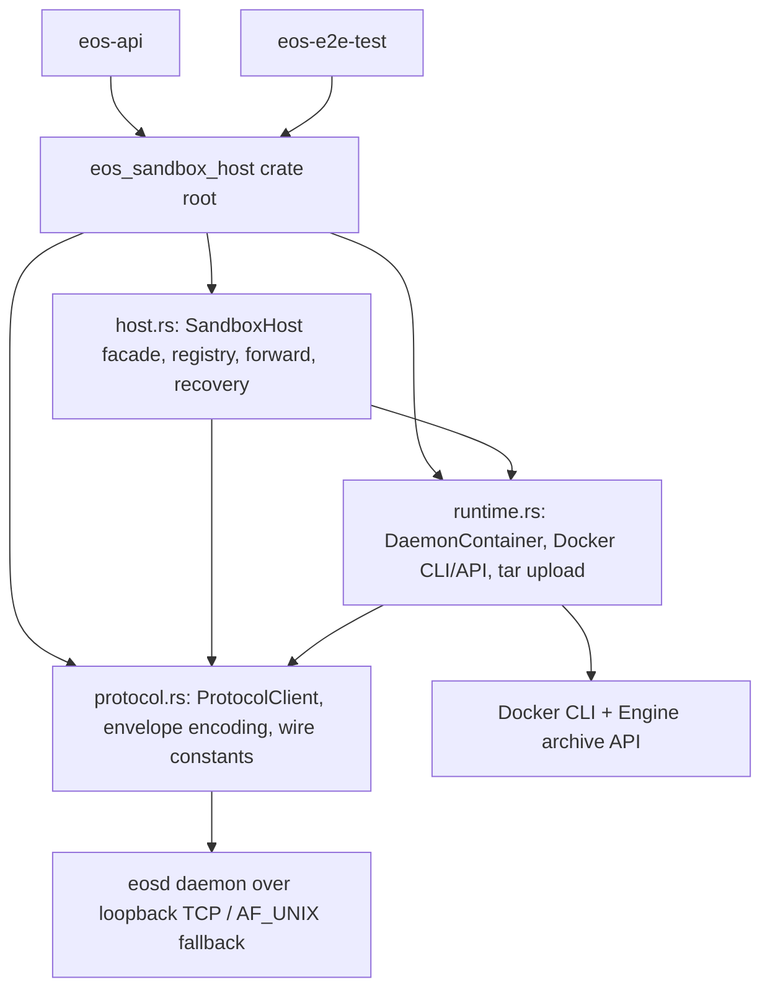

# eos-sandbox-host Source Consolidation SPEC

Status: Implemented
Date: 2026-06-11
Owner: sandbox/crates
Scope: `sandbox/crates/eos-sandbox-host/src`,
`sandbox/crates/eos-sandbox-host/tests`, and direct import rewrites in
`sandbox/crates/eos-api` and `sandbox/crates/eos-e2e-test`.

## 1. Goal

Aggressively simplify the `eos-sandbox-host` source tree while preserving its
current ownership boundary: host-side sandbox transport, Docker-backed daemon
container lifecycle, fleet registry, endpoint resolution, forwarding, and the
recovery ladder.

This is a source-shape and API-surface cleanup, not a behavior migration. The
required outcome is a four-file `src/` tree, narrower public module surface,
explicit E2E harness support exports, and a measurable source LOC reduction.

The selected target intentionally keeps `protocol.rs` separate from the host
engine implementation. The protocol client and duplicated wire constants are a
real boundary: they are the host-side copy of the daemon envelope contract and
are tested against frozen contract fixtures.

Implemented result:

- `sandbox/crates/eos-sandbox-host/src` now contains exactly `lib.rs`,
  `protocol.rs`, `host.rs`, and `runtime.rs`.
- Source LOC is 1,597, below the 1,745 hard cap and 1,650 stretch target.
- Old public module paths were removed from live Rust and maintained sandbox
  docs; the old-path references below are retained as baseline/migration
  history.
- `eos-sandbox-host` and `eos-api` narrow checks pass. `eos-e2e-test`
  verification is currently blocked before this boundary by unrelated
  `eos-plugin::host` and macOS `rustix::pty` workspace failures.

## 2. Baseline

Measured on 2026-06-11:

```sh
find sandbox/crates/eos-sandbox-host/src -maxdepth 1 -type f -name '*.rs' \
  -print0 | xargs -0 wc -l | sort -n
find sandbox/crates/eos-sandbox-host -maxdepth 3 -type f | sort
rg -n 'eos_sandbox_host::(client|container|docker|lifecycle|recovery|registry|wire)|use eos_sandbox_host::\{|eos_sandbox_host::wire' \
  sandbox/crates -g '*.rs' --glob '!target'
```

Baseline:

- Rust source files under `src`: 11
- Rust source LOC under `src`: 1,925
- Crate-local tests: 4 files, 195 LOC
- Junk source-tree files:
  - `sandbox/crates/eos-sandbox-host/.DS_Store`

Current source files:

| File | LOC | Diagnosis |
| --- | ---: | --- |
| `container.rs` | 453 | Correct runtime owner, but repeats handle/client/log-path construction and depends on scattered Docker helpers. |
| `docker.rs` | 354 | Correct runtime support, but includes single-use archive/tar helpers and duplicated Docker command error handling. |
| `lifecycle.rs` | 260 | Correct host facade, but registry, endpoint, forwarding, and recovery are split away from the facade that owns them. |
| `recovery.rs` | 218 | Correct recovery ladder, but exported as a public module for only `ForwardError`. |
| `client.rs` | 215 | Correct protocol owner, but exported as a broad public module for E2E convenience. |
| `registry.rs` | 208 | Internal host state exposed as a public module and public type surface. |
| `tar.rs` | 70 | Single-use Docker archive helper; should not be a standalone source file. |
| `endpoint.rs` | 40 | Tiny cache/resolve helper; should fold into host ownership. |
| `wire.rs` | 38 | Correct protocol data, but should pair with the encoder/client. |
| `lib.rs` | 37 | Public facade exports too many implementation modules. |
| `forward.rs` | 32 | Tiny wrapper around protocol encoding plus recovery. |

Current public surface diagnosis:

- Production `eos-api` needs `HostConfig`, `SandboxHost`, `SandboxStatus`,
  `ForwardError`, and `MAX_REQUEST_BYTES`.
- Contract tests need protocol envelope builders and protocol constants.
- `eos-e2e-test` needs `ProtocolClient`, response helpers, live
  `DaemonContainer`, Docker availability/reap/adoption helpers, and daemon
  spec types.
- No production caller should import host registry records, endpoint helpers,
  Docker archive internals, or recovery implementation modules.

## 3. Non-Goals

- Do not merge `eos-sandbox-host` into `eos-api`, `eos-daemon`, or
  `eos-e2e-test`.
- Do not introduce dependencies on workspace-internal daemon, protocol,
  layerstack, overlay, plugin, namespace, command, file, or isolated-workspace
  crates. Host/box compiled-code isolation remains mandatory.
- Do not change daemon request/response wire JSON field names, auth placement,
  protocol-version placement, request ordering, retry delays, error kind names,
  ready-gate semantics, or Docker container labels.
- Do not replace the frozen host-side wire vocabulary with shared compiled
  daemon code.
- Do not keep compatibility modules solely for old internal paths such as
  `eos_sandbox_host::registry` or `eos_sandbox_host::recovery`.
- Do not collapse everything into `lib.rs`. The crate root must remain a thin
  facade.
- Do not use a 3-file target for this migration; `protocol.rs` is intentionally
  retained as its own boundary.

## 4. Target Ownership



| Owner | Keeps | Must not expose as public module path |
| --- | --- | --- |
| `lib.rs` | Thin public facade, stable root exports, and explicit `e2e_support` re-exports. | Implementation module internals. |
| `protocol.rs` | `ProtocolClient`, `ClientError`, envelope builders, response helpers, and host-side wire constants. | Docker lifecycle, registry, or recovery ladder implementation. |
| `runtime.rs` | `DaemonContainer`, container/daemon specs, Docker command helpers, Engine archive upload, tar helper. | Fleet registry, public host facade, or op forwarding policy. |
| `host.rs` | `HostConfig`, `SandboxHost`, `SandboxStatus`, registry records, endpoint cache, forward path, recovery ladder, `ForwardError`. | Raw Docker upload/tar implementation or protocol fixture ownership. |

## 5. Required Target Source Tree

Acceptance requires this exact source shape:

```text
sandbox/crates/eos-sandbox-host/
  Cargo.toml
  src/
    lib.rs          # public facade + e2e_support re-exports
    protocol.rs     # client.rs + wire.rs
    runtime.rs      # container.rs + docker.rs + tar.rs
    host.rs         # lifecycle.rs + registry.rs + endpoint.rs + forward.rs + recovery.rs
  tests/
    contract.rs
    unit/
      protocol.rs   # optional, if protocol unit coverage grows
      runtime.rs    # old docker.rs + tar.rs tests
      host.rs       # old registry.rs tests
```

Required moves and deletions:

| Current path | Target |
| --- | --- |
| `src/client.rs` | `src/protocol.rs` |
| `src/wire.rs` | fold into `src/protocol.rs` |
| `src/container.rs` | `src/runtime.rs` |
| `src/docker.rs` | fold into `src/runtime.rs` |
| `src/tar.rs` | fold into `src/runtime.rs` |
| `src/lifecycle.rs` | `src/host.rs` |
| `src/registry.rs` | fold into `src/host.rs` |
| `src/endpoint.rs` | fold into `src/host.rs` |
| `src/forward.rs` | fold into `src/host.rs` |
| `src/recovery.rs` | fold into `src/host.rs` |
| `tests/unit/docker.rs` | `tests/unit/runtime.rs` |
| `tests/unit/tar.rs` | fold into `tests/unit/runtime.rs` |
| `tests/unit/registry.rs` | `tests/unit/host.rs` |
| `sandbox/crates/eos-sandbox-host/.DS_Store` | delete |

The following paths must not exist after the migration:

```text
src/client.rs
src/container.rs
src/docker.rs
src/endpoint.rs
src/forward.rs
src/lifecycle.rs
src/recovery.rs
src/registry.rs
src/tar.rs
src/wire.rs
tests/unit/docker.rs
tests/unit/registry.rs
tests/unit/tar.rs
.DS_Store
```

`tests/unit/protocol.rs` is optional. Add it only if the migration introduces
new protocol-private unit coverage that does not belong in `tests/contract.rs`.

## 6. Public API Shape

The crate root remains the production-facing API.

Required root exports:

```rust
pub use host::{ForwardError, HostConfig, SandboxHost, SandboxStatus};
pub use protocol::MAX_REQUEST_BYTES;
```

Required public modules:

```rust
pub mod e2e_support;
pub mod protocol;
```

`protocol` remains public because host contract tests and direct envelope guard
tests intentionally validate the host-side protocol copy. It must not contain
runtime or host registry code.

`e2e_support` is the only public escape hatch for live harness code. It should
re-export the minimum surface currently consumed by `eos-e2e-test`:

```rust
pub mod e2e_support {
    pub use crate::protocol::{error_kind, is_success, ClientError, ProtocolClient};
    pub use crate::runtime::{
        container_label, docker_available, remove_labeled_containers, running_container_ids,
        ContainerLifetime, ContainerSpec, DaemonContainer, DaemonSpec,
    };
}
```

The following public module paths are removed:

- `eos_sandbox_host::client`
- `eos_sandbox_host::container`
- `eos_sandbox_host::docker`
- `eos_sandbox_host::lifecycle`
- `eos_sandbox_host::recovery`
- `eos_sandbox_host::registry`
- `eos_sandbox_host::wire`

Downstream import rewrites:

| Current caller | Current import | Target import |
| --- | --- | --- |
| `eos-api/src/main.rs` | `eos_sandbox_host::{HostConfig, SandboxHost}` | unchanged |
| `eos-api/src/lib.rs` | `eos_sandbox_host::{ForwardError, SandboxHost, SandboxStatus}` | unchanged |
| `eos-api/src/router.rs` | `eos_sandbox_host::ForwardError` | unchanged |
| `eos-api/src/wire.rs` | `eos_sandbox_host::wire::MAX_REQUEST_BYTES` | `eos_sandbox_host::MAX_REQUEST_BYTES` |
| `eos-sandbox-host/tests/contract.rs` | `eos_sandbox_host::{client, wire}` | `eos_sandbox_host::protocol::{...}` |
| `eos-e2e-test/src/lib.rs` | `pub use eos_sandbox_host::client` | local `pub mod client { pub use eos_sandbox_host::e2e_support::{error_kind, is_success, ClientError, ProtocolClient}; }` |
| `eos-e2e-test/src/container.rs` | `eos_sandbox_host::{container, docker}` | `eos_sandbox_host::e2e_support::{...}` |
| `eos-e2e-test/tests/core/test_core_protocol_envelope_guards.rs` | `eos_sandbox_host::wire::MAX_REQUEST_BYTES` | `eos_sandbox_host::MAX_REQUEST_BYTES` |

## 7. Reduction Requirements

Baseline is 1,925 Rust source LOC under
`sandbox/crates/eos-sandbox-host/src`.

Hard acceptance target:

- Rust source files under `src`: **4**
- Rust source LOC under `src`: **1,745 or fewer**
- Required source LOC reduction: **at least 180 LOC** (`9.4%`)
- No `.DS_Store` or other non-Rust junk files under this crate

Stretch target:

- Rust source LOC under `src`: **1,650 or fewer**
- Required source LOC reduction: **at least 275 LOC** (`14.3%`)

This is a final-code target, not a net-diff target. Pure file movement without
deleting wrapper modules, public module ceremony, repeated imports/docs,
duplicated Docker command handling, unused public methods, and redundant
constructor setup does not satisfy the spec.

Expected reduction sources:

| Cleanup | Expected LOC drop |
| --- | ---: |
| Delete standalone `endpoint.rs`, `forward.rs`, `wire.rs`, and `tar.rs` module ceremony | 35-60 |
| Collapse repeated file-level docs and import blocks after merging files | 45-90 |
| Make registry records/private helpers internal to `host.rs` and remove public docs that only supported exported module paths | 30-55 |
| Remove unused `SandboxHost::knows` and unused `DaemonContainer::name` if still uncalled at implementation time | 8-20 |
| Deduplicate `DaemonContainer` handle/client/log-path setup across start/adopt/recovery handles | 20-45 |
| Reuse one Docker command runner/error path for remove/list helpers | 15-35 |
| Merge Docker/tar unit tests into one runtime unit module | 5-15 |
| Delete `.DS_Store` | non-Rust cleanup |

## 8. Implementation Phases

### Phase 0: Baseline and Import Audit

- Re-run the baseline LOC and import scans from Section 2.
- Confirm `cargo metadata --manifest-path sandbox/Cargo.toml --format-version=1 --no-deps`
  still includes `eos-sandbox-host`, `eos-api`, and `eos-e2e-test`.
- Confirm no concurrent work has already moved `eos-sandbox-host/src`.
- Record any pre-existing broad-workspace failures before editing.

Verification:

```sh
cargo metadata --manifest-path sandbox/Cargo.toml --format-version=1 --no-deps
cargo check --manifest-path sandbox/Cargo.toml -p eos-sandbox-host --all-targets
```

### Phase 1: Protocol Consolidation

- Create `src/protocol.rs` from `client.rs` plus `wire.rs`.
- Keep protocol constants and envelope builders in the same file as
  `ProtocolClient`.
- Preserve byte-for-byte envelope fixture behavior.
- Update contract tests to import from `eos_sandbox_host::protocol`.
- Export `MAX_REQUEST_BYTES` at the crate root for production callers.
- Remove `pub mod client` and `pub mod wire`.

Verification:

```sh
cargo test --manifest-path sandbox/Cargo.toml -p eos-sandbox-host --test contract
cargo test --manifest-path sandbox/Cargo.toml -p eos-sandbox-host
```

### Phase 2: Runtime Consolidation

- Create `src/runtime.rs` from `container.rs`, `docker.rs`, and `tar.rs`.
- Inline `tar_single_file` as a private runtime helper.
- Keep Docker CLI/Engine API helpers private unless they are re-exported through
  `e2e_support`.
- Deduplicate Docker command error handling for list/remove paths.
- Deduplicate `DaemonContainer` construction paths.
- Move `tests/unit/docker.rs` and `tests/unit/tar.rs` into
  `tests/unit/runtime.rs`.
- Remove `pub mod container` and `pub mod docker`.

Verification:

```sh
cargo test --manifest-path sandbox/Cargo.toml -p eos-sandbox-host
cargo check --manifest-path sandbox/Cargo.toml -p eos-e2e-test --all-targets
```

### Phase 3: Host Engine Consolidation

- Create `src/host.rs` from `lifecycle.rs`, `registry.rs`, `endpoint.rs`,
  `forward.rs`, and `recovery.rs`.
- Keep `SandboxHost`, `HostConfig`, `SandboxStatus`, and `ForwardError`
  root-exported.
- Make `SandboxRegistry`, `SandboxRecord`, label constants, endpoint cache
  helpers, and recovery attempt types private unless a direct downstream caller
  proves otherwise.
- Fold `forward.rs` into `SandboxHost::forward` or a private host helper.
- Fold endpoint cache resolution into private host/recovery helpers.
- Move `tests/unit/registry.rs` to `tests/unit/host.rs`.
- Remove `pub mod lifecycle`, `pub mod registry`, and `pub mod recovery`.

Verification:

```sh
cargo test --manifest-path sandbox/Cargo.toml -p eos-sandbox-host
cargo check --manifest-path sandbox/Cargo.toml -p eos-api --all-targets
```

### Phase 4: E2E Support Surface

- Add `e2e_support` in `lib.rs` with only the live harness symbols listed in
  Section 6.
- Update `eos-e2e-test` imports to use `e2e_support`.
- Keep `eos_e2e_test::client` available as an `eos-e2e-test` local wrapper so
  subsystem tests do not depend on `eos_sandbox_host::protocol` directly.
- Update direct `MAX_REQUEST_BYTES` imports to use the crate-root export.

Verification:

```sh
cargo check --manifest-path sandbox/Cargo.toml -p eos-e2e-test --all-targets
cargo test --manifest-path sandbox/Cargo.toml -p eos-sandbox-host
```

### Phase 5: Delete Old Files and Stale Artifacts

- Delete all source files listed as forbidden in Section 5.
- Delete crate-local `.DS_Store`.
- Update maintained docs that name the old file layout:
  - `sandbox/README.md`
  - `sandbox/docs/SPEC.md`
- Regenerate or update generated inventory only if the current branch is
  maintaining generated inventory artifacts. Otherwise, exclude generated
  inventory from stale-source scans and report it as follow-up.
- Re-run source scans to prove the old public module paths are gone.

Verification:

```sh
find sandbox/crates/eos-sandbox-host/src -maxdepth 1 -type f -name '*.rs' | sort
find sandbox/crates/eos-sandbox-host/src -maxdepth 1 -type f -name '*.rs' -print0 | xargs -0 wc -l | sort -n
find sandbox/crates/eos-sandbox-host -name '.DS_Store' -print
rg -n 'eos_sandbox_host::(client|container|docker|lifecycle|recovery|registry|wire)|eos_sandbox_host::wire' \
  sandbox/crates -g '*.rs' --glob '!target'
```

## 9. Final Verification

Required narrow gates:

```sh
cargo fmt --manifest-path sandbox/Cargo.toml -p eos-sandbox-host -- --check
cargo check --manifest-path sandbox/Cargo.toml -p eos-sandbox-host --all-targets
cargo test --manifest-path sandbox/Cargo.toml -p eos-sandbox-host
cargo clippy --manifest-path sandbox/Cargo.toml -p eos-sandbox-host --all-targets -- -D warnings
cargo check --manifest-path sandbox/Cargo.toml -p eos-api --all-targets
cargo check --manifest-path sandbox/Cargo.toml -p eos-e2e-test --all-targets
git diff --check
```

Run broader sandbox checks only if the touched import surface crosses beyond
`eos-api` and `eos-e2e-test`, or after unrelated concurrent sandbox work
settles.

## 10. Acceptance Criteria

- [ ] `sandbox/crates/eos-sandbox-host/src` contains exactly
  `lib.rs`, `protocol.rs`, `runtime.rs`, and `host.rs`.
- [ ] The old source files listed in Section 5 no longer exist.
- [ ] Crate source LOC is `1,745` or fewer, with a stretch target of `1,650` or
  fewer.
- [ ] `lib.rs` is a thin facade and does not contain implementation bodies.
- [ ] Production callers use root exports only.
- [ ] E2E-only runtime/container/Docker support is exposed only through
  `e2e_support`.
- [ ] `protocol.rs` preserves byte-identical host envelope encoding against the
  frozen fixtures.
- [ ] `host.rs` owns registry, endpoint cache, forward, and recovery internals;
  those types are not public module paths.
- [ ] No workspace-internal crate dependency is added to `eos-sandbox-host`.
- [ ] Crate-local `.DS_Store` is deleted.
- [ ] Required verification commands in Section 9 pass or have a documented
  pre-existing external blocker.
