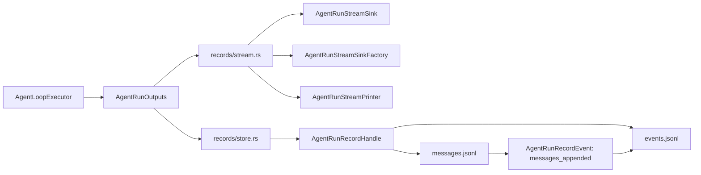

# eos-engine Agent-Run Records and Stream Output Merge - SPEC

Status: Proposed
Date: 2026-06-09
Owner: `eos-engine`

Scope:
- `agent-core/crates/eos-engine/src/event.rs`
- `agent-core/crates/eos-engine/src/event/`
- `agent-core/crates/eos-engine/src/records.rs`
- `agent-core/crates/eos-engine/src/records/`
- `agent-core/crates/eos-engine/src/agent_loop/{executor,launcher}.rs`
- `agent-core/crates/eos-engine/tests/message_records.rs`
- `agent-core/workspace-guard/tests/public_surface.rs`
- backend imports that consume `eos_engine::records::*` or root stream exports

Related:
- `docs/plans/agent-core-workspace-architecture-rules/phase-04-eos-engine-agent-run_SPEC.md`
- `docs/plans/agent-core-workspace-architecture-rules/phase-03b-execution-lineage-materialization_SPEC.md`

## 1. Intent

Merge the current `eos-engine` `event` module into `records` and simplify the
record implementation at the same time. The engine should have one local owner
for agent-run output surfaces:

- durable `messages.jsonl`,
- durable `events.jsonl`,
- live stream observations,
- live stream sinks,
- stream printing,
- the output fan-out object passed into the agent loop.

After this refactor, `records` is the umbrella module, `stream` names live
observation, and `record` names durable disk state. The file layout should get
smaller, not just move the current split under a new folder.

## 2. Problem

The live tree has two adjacent owners with overlapping vocabulary:

```text
crates/eos-engine/src/
  event.rs
  event/
    event.rs
    outputs.rs
    printer.rs
    sink.rs

  records.rs
  records/
    error.rs
    handle.rs
    io.rs
    kind.rs
    layout.rs
    record.rs
    writer.rs
```

That creates three naming problems:

- `event/` is not the `events.jsonl` owner; `records/` is.
- `NodeEvent` is a durable `events.jsonl` row, not a live stream event.
- `EngineEventOutputs` carries an `AgentRunRecordWriter`, so live output and
  durable output are already coupled but named as if only event streaming is
  involved.

The durable file pair is one aggregate today:

- `AgentRunRecordHandle` carries both `messages_path` and `events_path`.
- `append_messages` writes `messages.jsonl` and then appends a
  `messages_appended` row to `events.jsonl`.
- `start_agent_run` writes `node_started`, initial message rows, and
  `messages_initialized`.
- `finish` appends the terminal record event.

The previous larger merge target split this aggregate into `messages.rs`,
`events.rs`, `handle.rs`, and `store.rs`. That is more file structure than the
behavior needs. The simpler target keeps the aggregate cohesive in one store
module until there is a real reason to split it.

## 3. Goals

- Remove the top-level `event` module from `eos-engine`.
- Move live stream event types, stream sink, sink factory, printer, and output
  fan-out under `records/stream.rs`.
- Collapse durable record internals into `records/store.rs`.
- Keep `records/error.rs` and a small `records/layout.rs`.
- Remove engine-local duplicate layout classification (`AgentRunRecordKind` and
  `AgentRunRecordStart`) from the target path; use
  `StartAgentLoopRequest.record_target.task_agent_run_kind` and the
  pre-resolved `record_target.record_dir`.
- Rename types and fields so:
  - `record` means durable agent-run record state,
  - `stream` means live observation,
  - bare `event` is avoided unless the type says `StreamEvent` or
    `RecordEvent`.
- Keep `messages.jsonl` and `events.jsonl` literal file names unchanged.
- Keep `eos-engine` as the owner. Do not move these files into
  `eos-agent-run`, `eos-types`, or a new crate.
- Preserve the public root exports that callers need, but route them through
  `records`.

## 4. Non-Goals

- No disk format change for `messages.jsonl`.
- No disk format change for `events.jsonl`.
- No rename of persisted `events.jsonl` `kind` strings such as
  `node_started`, `messages_initialized`, `messages_appended`, or
  `node_finished`.
- No DB materialization redesign.
- No change to `AgentRunRecordTarget`, `AgentRunRecordDir`, or Phase 03B
  lineage path derivation.
- No new port crate or shared service crate.
- No trait abstraction around output fan-out. The output set is closed and can
  stay a concrete struct.
- No compatibility module named `event` in the final state.
- No broad agent-loop behavior changes beyond imports, field names, and record
  output wiring.

## 5. Simplification Plan

The simplification is not only a rename. It deliberately deletes file boundaries
that no longer carry independent ownership.

| Area | Current | Larger Merge Draft | Simplified Target |
| --- | --- | --- | --- |
| Live stream module | `event.rs` plus `event/{event,outputs,printer,sink}.rs` | `records/{stream,outputs,printer,sink}.rs` | `records/stream.rs` owns stream event, sink, sink factory, printer, and outputs |
| Durable records | `records/{handle,io,record,writer}.rs` | `records/{messages,events,handle,store}.rs` | `records/store.rs` owns store, handle, row DTOs, append/read helpers |
| Layout facts | engine-local `AgentRunRecordKind` can derive paths | keep `kind.rs` | remove target use of engine-local kind; consume `AgentRunRecordTarget` |
| Path helper | `records/layout.rs` can format from kind | keep layout module | shrink to root-join and safe segment validation |
| Output aggregate | `EngineEventOutputs` | `AgentRunOutputs` | `AgentRunOutputs` in `records/stream.rs` |
| Live sink factory | recently added root/event export | missing from larger draft | keep as `AgentRunStreamSinkFactory` |
| Public module | `pub mod event` and `pub mod records` | `pub mod records` only | `pub mod records` only |
| Backend/API callers | import `AgentRunRecordWriter`, `NodeEvent`, root stream types | not scoped | migrate imports or keep temporary aliases until backend compiles |
| Workspace guard | expects `mod:event` / `use:event` | optional update | required update |

Expected impact in `agent-core/crates/eos-engine/src/{event,records}`:

| Measure | Estimate |
| --- | ---: |
| Current relevant LOC | about 1,300 |
| Raw deleted/moved LOC | about 1,100 |
| Replacement LOC | about 850-950 |
| Net final-code reduction | about 200-350 LOC |

The net reduction is intentionally modest because stream events and JSONL
recording still exist. The win is removing duplicated classification, nested
micro-modules, and the misleading `event` owner.

## 6. Target File Structure

```text
agent-core/crates/eos-engine/
|-- src/
|   |-- lib.rs
|   |-- agent_loop.rs
|   |-- agent_loop/
|   |   |-- contracts.rs
|   |   |-- executor.rs
|   |   |-- launcher.rs
|   |   `-- state.rs
|   |-- records.rs
|   |-- records/
|   |   |-- error.rs       # AgentRunRecordError and Result
|   |   |-- layout.rs      # root join + safe record_dir segment validation
|   |   |-- store.rs       # durable JSONL store, handle, row DTOs, helpers
|   |   `-- stream.rs      # live stream event, sink, sink factory, printer, outputs
|   |-- provider_stream.rs
|   |-- provider_stream/
|   |   |-- messages.rs
|   |   `-- source.rs
|   |-- tool_call.rs
|   |-- tool_call/
|   |-- background.rs
|   `-- background/
`-- tests/
    |-- message_records.rs
    `-- notifications/
```

Deleted final paths:

```text
agent-core/crates/eos-engine/src/event.rs
agent-core/crates/eos-engine/src/event/
agent-core/crates/eos-engine/src/records/handle.rs
agent-core/crates/eos-engine/src/records/io.rs
agent-core/crates/eos-engine/src/records/kind.rs
agent-core/crates/eos-engine/src/records/record.rs
agent-core/crates/eos-engine/src/records/writer.rs
```

Do not replace those deleted paths with `records/messages.rs`,
`records/events.rs`, `records/outputs.rs`, `records/printer.rs`, or
`records/sink.rs` in this phase. If `store.rs` or `stream.rs` later grows
because of a real ownership split, make that a separate follow-up with a
specific reason.

## 7. Naming Rules

Use these rules consistently in the moved code:

| Rule | Applies To | Example |
| --- | --- | --- |
| `record` means durable disk state | store, handle, identity, finish status | `AgentRunRecordHandle` |
| `stream` means live observation | live event enum, sink, printer, sink factory | `AgentRunStreamEvent` |
| `messages` means `messages.jsonl` | file path, byte reads, append range | `messages_path`, `MessageAppendRange` |
| `events` means `events.jsonl` | file path, sequence reads, row append | `events_path`, `AgentRunRecordEvent` |
| avoid `node` in Rust type/field names | record dirs and handles | `record_dir`, not `node_dir` |
| preserve `node_*` wire values | durable event `kind` strings | `node_started` remains unchanged |
| avoid bare `event_*` fields | every event-like name must say stream or record | `stream_sink`, `read_record_events` |

The final code should not introduce `Service`, `Manager`, `Port`, or
inheritance-style trait names for this refactor.

## 8. Type and Field Rename Map

| Current | Target | Reason |
| --- | --- | --- |
| `EngineEventOutputs` | `AgentRunOutputs` | output aggregate covers stream and durable records |
| `live_event_sink` | `stream_sink` | sink receives live stream events |
| `EngineEventSink` | `AgentRunStreamSink` | stream surface, not durable event rows |
| `EngineEventSinkFactory` | `AgentRunStreamSinkFactory` | per-run stream sink factory must survive the merge |
| `event_printer` | `stream_printer` | printer renders stream events |
| `EngineEventPrinter` | `AgentRunStreamPrinter` | stream surface, not durable event rows |
| `StreamEvent` | `AgentRunStreamEvent` | names the owner and live-stream role |
| `AssistantMessageComplete` | `AssistantMessageComplete` | keep; payload name is already precise |
| `event_outputs` | `run_outputs` | aggregate is per agent run |
| `with_event_outputs` | `with_run_outputs` | constructor attaches all run outputs |
| `with_live_event_sink_factory` | `with_stream_sink_factory` | factory returns stream sinks |
| `run_record_writer` | `record_store` | reads and writes; `Writer` is too narrow |
| `AgentRunRecordWriter` | `AgentRunRecordStore` | durable store over record dirs |
| `AgentRunRecordHandle::node_dir` | `record_dir` | avoid node vocabulary in Rust API |
| `NodeEvent` | `AgentRunRecordEvent` | durable `events.jsonl` row |
| `NodeFinishStatus` | `AgentRunRecordFinishStatus` | durable finish record status |
| `RecordIdentity` | `AgentRunRecordIdentity` | durable row identity columns |
| `RecordBytes` | `MessageBytes` | raw bytes are from `messages.jsonl` |
| `append_event` | `append_record_event` | durable event row append |
| `read_events` | `read_record_events` | durable events, not stream events |
| `read_events_at` | `read_record_events_at` | durable events, not stream events |

Compatibility aliases may exist during one mechanical step if they keep the
patch reviewable or downstream backend compilation green. The final checked-in
target should use the target names in production code and tests unless backend
API stability requires an explicit alias.

## 9. Resulting Types and Fields

### 9.1 Agent-loop fields

| Type | Fields |
| --- | --- |
| `TokioAgentLoopLauncher` | `provider_stream_source: AgentLoopProviderStream`; `tool_registry_factory: Arc<dyn AgentLoopToolRegistryFactory>`; `execution_metadata_reader: Arc<dyn ToolExecutionMetadataReader>`; `background_sessions: Option<BackgroundSessionRuntimeFactory>`; `hook_stores: Option<ToolCallHookStores>`; `run_outputs: AgentRunOutputs`; `stream_sink_factory: Option<AgentRunStreamSinkFactory>` |
| `AgentLoopExecutorInput` | `provider_stream_source: AgentLoopProviderStream`; `tool_registry_factory: Arc<dyn AgentLoopToolRegistryFactory>`; `execution_metadata_reader: Arc<dyn ToolExecutionMetadataReader>`; `cancel_signal: AgentLoopCancelSignal`; `background_sessions: Option<BackgroundSessionRuntimeFactory>`; `hook_stores: Option<ToolCallHookStores>`; `run_outputs: AgentRunOutputs`; `agent_run_api: Arc<dyn AgentRunApi>` |
| `AgentLoopExecutor` | same owned fields as `AgentLoopExecutorInput` |

### 9.2 `records/stream.rs`

| Type | Fields |
| --- | --- |
| `AgentRunOutputs` | `stream_sink: Option<AgentRunStreamSink>`; `stream_printer: Option<AgentRunStreamPrinter>`; `record_store: Option<AgentRunRecordStore>` |
| `AgentRunStreamEvent` | same variants and JSON shape as today's `StreamEvent`: `ReasoningDelta`, `AssistantTextDelta`, `AssistantMessageComplete`, `ToolUseDelta`, `ToolExecutionStarted`, `ToolExecutionCompleted`, `ToolExecutionProgress`, `ToolExecutionCancelled`, `SystemNotification` |
| `AssistantMessageComplete` | `message: Message`; `usage: UsageSnapshot`; `stop_reason: Option<StopReason>` |
| `AgentRunStreamPrinter` | closure/writer field equivalent to today's printer; no durable record fields |
| `AgentRunStreamSink` | type alias: `Arc<dyn Fn(&AgentRunStreamEvent) + Send + Sync>` |
| `AgentRunStreamSinkFactory` | type alias: `Arc<dyn Fn(&StartAgentLoopRequest) -> Option<AgentRunStreamSink> + Send + Sync>` |

`AgentRunOutputs` methods:

```rust
impl AgentRunOutputs {
    pub fn new() -> Self;
    pub fn with_stream_sink(self, sink: Option<AgentRunStreamSink>) -> Self;
    pub fn with_stream_printer(self, printer: Option<AgentRunStreamPrinter>) -> Self;
    pub fn with_record_store(self, store: Option<AgentRunRecordStore>) -> Self;

    pub(crate) fn observe_stream(&self, event: &AgentRunStreamEvent);
    pub(crate) fn record_store(&self) -> Option<&AgentRunRecordStore>;
}
```

### 9.3 `records/store.rs`

| Type | Fields |
| --- | --- |
| `AgentRunRecordStore` | `root: PathBuf` |
| `AgentRunRecordHandle` | `record_dir: PathBuf`; `messages_path: PathBuf`; `events_path: PathBuf`; `identity: AgentRunRecordIdentity`; `initial_message_count: usize` |
| `AgentRunRecordIdentity` | `request_id: String`; `task_id: String`; `agent_run_id: String` |
| `AgentRunRecordEvent` | `request_id: String`; `task_id: String`; `agent_run_id: String`; `seq: u64`; `kind: String`; `payload: JsonObject`; `created_at: UtcDateTime` |
| `AgentRunRecordFinishStatus` | enum variants: `Completed`, `Failed` |
| `MessageAppendRange` | `count: usize`; `start_byte: u64`; `end_byte: u64` |
| `MessageBytes` | `bytes: Vec<u8>`; `next_byte_offset: u64` |

Store methods:

```rust
impl AgentRunRecordStore {
    pub fn new(root: impl Into<PathBuf>) -> Self;
    pub async fn start_agent_run_at(
        &self,
        record_target: &AgentRunRecordTarget,
        agent_name: &str,
        system_prompt: &str,
        initial_messages: &[Message],
    ) -> Result<AgentRunRecordHandle>;
    pub async fn read_messages_at(
        &self,
        record_dir: &AgentRunRecordDir,
        after_byte: u64,
    ) -> Result<MessageBytes>;
    pub async fn read_record_events_at(
        &self,
        record_dir: &AgentRunRecordDir,
        after_seq: u64,
    ) -> Result<Vec<AgentRunRecordEvent>>;
}
```

Handle methods:

```rust
impl AgentRunRecordHandle {
    pub fn record_dir(&self) -> &Path;
    pub fn initial_message_count(&self) -> usize;
    pub async fn append_messages(&self, messages: &[Message])
        -> Result<MessageAppendRange>;
    pub async fn read_messages(&self, after_byte: u64) -> Result<MessageBytes>;
    pub async fn read_record_events(
        &self,
        after_seq: u64,
    ) -> Result<Vec<AgentRunRecordEvent>>;
    pub async fn finish(&self, status: AgentRunRecordFinishStatus) -> Result<()>;

    pub(crate) async fn append_record_event(
        &self,
        kind: impl Into<String>,
        payload: JsonObject,
    ) -> Result<()>;
}
```

Do not keep a target `AgentRunRecordKind` or `AgentRunRecordStart` in
`eos-engine`. If tests still need hand-built records, they should construct an
`AgentRunRecordTarget` with a closed `TaskAgentRunKind` from `eos-types`.

## 10. Public Export Target

`records.rs` becomes the single local export surface for record and stream
outputs:

```rust
mod error;
mod layout;
mod store;
mod stream;

pub use error::{AgentRunRecordError, Result};
pub use store::{
    AgentRunRecordEvent, AgentRunRecordFinishStatus, AgentRunRecordHandle,
    AgentRunRecordIdentity, AgentRunRecordStore, MessageAppendRange, MessageBytes,
};
pub use stream::{
    stamp_identity, AgentRunOutputs, AgentRunStreamEvent, AgentRunStreamPrinter,
    AgentRunStreamSink, AgentRunStreamSinkFactory, AssistantMessageComplete,
};
```

`lib.rs` should re-export from `records`, not from `event`:

```rust
pub mod records;

pub use records::{
    stamp_identity, AgentRunOutputs, AgentRunRecordStore, AgentRunStreamEvent,
    AgentRunStreamPrinter, AgentRunStreamSink, AgentRunStreamSinkFactory,
    AssistantMessageComplete,
};
```

Do not keep `pub mod event` in the final state.

## 11. Migration Plan

### Step 1: Collapse durable records into `records/store.rs`

- Move `AgentRunRecordWriter`, `AgentRunRecordHandle`, row DTOs, byte-range DTOs,
  and JSONL append/read helpers into `records/store.rs`.
- Rename `AgentRunRecordWriter` to `AgentRunRecordStore`.
- Rename `NodeEvent` to `AgentRunRecordEvent`.
- Rename `RecordBytes` to `MessageBytes`.
- Keep persisted row JSON shape and event `kind` strings unchanged.
- Replace target call sites with `AgentRunRecordTarget` instead of
  `AgentRunRecordStart` / `AgentRunRecordKind`.
- Run:
  - `cargo fmt -p eos-engine`
  - `cargo check -p eos-engine --all-targets`
  - `cargo test -p eos-engine message_records --test message_records`

### Step 2: Move stream outputs into `records/stream.rs`

- Move live stream event, sink, sink factory, printer, and output fan-out into
  `records/stream.rs`.
- Rename `EngineEventOutputs` to `AgentRunOutputs`.
- Rename `EngineEventSink` to `AgentRunStreamSink`.
- Rename `EngineEventSinkFactory` to `AgentRunStreamSinkFactory`.
- Rename `EngineEventPrinter` to `AgentRunStreamPrinter`.
- Rename `StreamEvent` to `AgentRunStreamEvent`.
- Update imports from `crate::event::*` to `crate::records::*`.
- Remove `event.rs` and `event/`.
- Run:
  - `cargo fmt -p eos-engine`
  - `cargo check -p eos-engine --all-targets`
  - `cargo test -p eos-engine --lib`

### Step 3: Migrate public consumers

- Update backend runtime event-bus imports from root `EngineEvent*` /
  `StreamEvent` names to the new root exports or `eos_engine::records::*`.
- Update backend API record imports from `AgentRunRecordWriter` / `NodeEvent`
  to `AgentRunRecordStore` / `AgentRunRecordEvent`, unless an explicit
  compatibility alias is required for API stability.
- Update backend API tests and support helpers.
- Update `workspace-guard/tests/public_surface.rs` to remove `mod:event` and
  `use:event` from the `eos-engine` allowlist.
- Run:
  - `cargo check -p eos-engine --all-targets`
  - `cargo check -p eos-backend-runtime --all-targets`
  - `cargo check -p eos-backend-api --all-targets`
  - `cargo test -p workspace-guard public_surface_matches_target_allowlist`

### Step 4: Final cleanup

- Remove temporary compatibility aliases unless explicitly retained for public
  API stability.
- Confirm there are no production imports of `crate::event`,
  `EngineEventOutputs`, `EngineEventSink`, `EngineEventSinkFactory`,
  `StreamEvent`, `AgentRunRecordWriter`, `NodeEvent`, or `RecordBytes`.
- Run:
  - `cargo test -p eos-engine`
  - `cargo test -p eos-backend-api`
  - `cargo clippy -p eos-engine --all-targets -- -D warnings`
  - `git diff --check`

## 12. Verification Ladder

Narrow checks:

```bash
cd agent-core
cargo fmt -p eos-engine
cargo check -p eos-engine --all-targets
cargo test -p eos-engine message_records --test message_records
```

Broader checks after public export or backend import changes:

```bash
cd agent-core
cargo test -p eos-engine
cargo clippy -p eos-engine --all-targets -- -D warnings
cargo test -p workspace-guard public_surface_matches_target_allowlist
git diff --check
```

Backend checks when downstream imports change:

```bash
cd backend-server
cargo check -p eos-backend-runtime --all-targets
cargo check -p eos-backend-api --all-targets
cargo test -p eos-backend-api
```

Broaden to `cargo check --workspace --all-targets` only if imports in other
downstream crates change or workspace guard failures show that public exports
are consumed outside the scoped crates.

## 13. Acceptance Criteria

- `agent-core/crates/eos-engine/src/event.rs` does not exist.
- `agent-core/crates/eos-engine/src/event/` does not exist.
- `records/` contains exactly the target files from section 6 unless the
  implementation updates this spec with a concrete ownership reason.
- `records/store.rs` owns durable JSONL store, handle, row DTOs, and append/read
  helpers for both `messages.jsonl` and `events.jsonl`.
- `records/stream.rs` owns live stream event, sink, sink factory, printer, and
  output fan-out.
- `AgentRunOutputs` is the only output aggregate passed through launcher and
  executor.
- `AgentRunStreamSinkFactory` remains available for backend runtime to bind a
  request-scoped live sink per loop.
- Production code uses `stream_*` for live observations and `record_*` for
  durable record state.
- No target production code imports or exports `AgentRunRecordKind` or
  `AgentRunRecordStart` from `eos-engine`.
- `messages.jsonl` and `events.jsonl` file names and row JSON shapes remain
  unchanged.
- Persisted record event `kind` values remain unchanged.
- Backend API and backend runtime imports are migrated or explicitly covered by
  compatibility aliases.
- `workspace-guard/tests/public_surface.rs` no longer expects `mod:event` or
  `use:event` for `eos-engine`.
- `cargo check -p eos-engine --all-targets` passes.
- `cargo test -p eos-engine message_records --test message_records` passes.
- `cargo test -p workspace-guard public_surface_matches_target_allowlist` passes
  or the remaining failure is documented as unrelated concurrent work.

## 14. Final Shape Summary



The conceptual boundary is:

| Surface | Module | Primary Names |
| --- | --- | --- |
| live model/tool/system observations | `records/stream.rs` | `AgentRunStreamEvent`, `AgentRunStreamSink`, `AgentRunStreamSinkFactory`, `AgentRunStreamPrinter` |
| output fan-out for one run | `records/stream.rs` | `AgentRunOutputs` |
| durable message rows | `records/store.rs` | `MessageAppendRange`, `MessageBytes` |
| durable event rows | `records/store.rs` | `AgentRunRecordEvent` |
| durable record lifecycle | `records/store.rs` | `AgentRunRecordStore`, `AgentRunRecordHandle` |
| path safety | `records/layout.rs` | root join and safe segment validation only |
