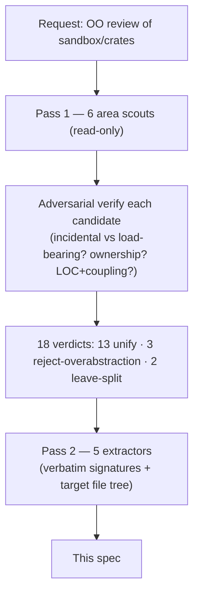

# SPEC: sandbox/crates Generalization & Polymorphism Review

Status: DRAFT
Date: 2026-06-05
Owner workspace: `sandbox/`
Scope: `sandbox/crates/eos-workspace-api`, `eos-isolated-workspace`,
`eos-ephemeral-workspace`, `eos-occ`, `eos-layerstack`, `eos-runner`, `eosd`,
`eos-overlay`, `eos-daemon`.

This spec exports the review of what in `sandbox/crates` should move toward
idiomatic Rust object-oriented design (generalization via generics, polymorphism
via traits / `dyn` / enum dispatch). In this repo "OOP" does **not** mean class
hierarchies, and — critically — both the repo `CLAUDE.md` and the loaded
`rust-skills` guide forbid abstraction-for-extensibility (`anti-over-abstraction`,
`anti-type-erasure`). Therefore every recommendation here is **duplication-anchored**:
it unifies code that *already* exists in N≥2 places, or removes hand-rolled /
single-impl polymorphism. Nothing is justified by "more flexible / future-proof".

The headline conclusion is deliberately counterintuitive: of 13 warranted changes,
**zero add a new trait, `dyn`, or enum, and zero add a new struct, field, or type**.
Eleven collapse duplicated code behind seams that *already exist* (shared free fn /
inherent method / the `fn<P>` generics already in place); two **delete** an
over-built `trait` + `Box<dyn>`. Applying Rust OO best practice in this codebase
means *reducing* polymorphism ceremony, not adding it.

This is the sandbox sibling of
`docs/plans/agent-core-type-driven-oop-review_SPEC.md`. Do not merge the two.

---

## 1. Review Method

Two read-only dynamic workflows fanned out over the crates. Pass 1 discovered
candidates per area and **adversarially verified** each (an independent agent read
both sides, defaulting to "leave it" unless unification clearly paid for itself).
Pass 2 extracted the exact target file tree and verbatim item signatures.



Verification rubric applied to every candidate (kill on any one):

- similarity is incidental, or divergence is load-bearing (a shared path would
  branch on caller intent anyway);
- only benefit is flexibility / cleanliness;
- requires a cross-workspace back-edge or new broad dependency;
- is single-impl type erasure dressed up as polymorphism.

Pass criteria: concrete N≥2 duplicated sites, a shared owner crate both sides
already depend on, net LOC reduction, mechanism justified over the alternatives.

---

## 2. Executive Result

- **13 warranted changes** (this spec). **5 rejected / leave-split** (§10).
- **1 file created** (`eos-layerstack/src/fsutil.rs`), **9 files deleted**,
  **~23 files modified**.
- **0 new structs / enums / traits / fields.** New named items = 17 free fns +
  5 inherent methods + 1 module.
- Net **~ -400 to -550 LOC**.
- One change (LS-2) is a **latent correctness bug fix**, not cosmetics.

Mechanism distribution of the 13:

| Mechanism | Count | Findings |
|---|---|---|
| extract shared free fn / inherent method | 9 | OCC-1, LS-1, LS-2, LS-3, LS-4, DM-1, DM-2, DM-3, DM-4 |
| keep existing `fn<P>` generics, thread params | 2 | WS-1, WS-2 |
| **remove** `trait` + `Box<dyn>` (de-abstraction) | 2 | RUN-1a, RUN-1b |
| add new trait / `dyn` / enum | **0** | — |

---

## 3. Existing-Polymorphism Scorecard

What is already correct (leave alone) vs the one mis-applied seam.

| Trait | Prod impls | Test double | Dispatch | Verdict |
|---|---|---|---|---|
| `CommitTransactionPort` (eos-occ) | 3 | — | `dyn` | ✅ Warranted — genuine multi-impl |
| `OccRouteProvider` (eos-occ) | 2 | — | `dyn` | ✅ Warranted — genuine multi-impl |
| `AuditSink` | 1 | `RecordingAudit` | generic `A:` | ✅ Exemplary — real 2nd impl + zero-cost static dispatch |
| `LayerStackSnapshotPort` | 1 | `RecordingLayerStack` | generic `S:` | ✅ Exemplary |
| `NamespaceRuntimePort` | 1 | `NoopRuntime` | generic `R:` | ✅ Exemplary |
| `WorkspacePublisherPort` | 1 | — | generic `P:` | 🟡 Defensible — single-impl but a *generic* dependency-inversion seam keeping the leaf crate off `eos-daemon`. Leave. |
| `KernelMountPort` + `MountedOverlay` (eos-runner) | 1 | — | **`Box<dyn>`** | ❌ Over-abstraction → remove (RUN-1) |

Also leave alone (named correct): the `Handler = for<'ctx> fn(&Value, DispatchContext) -> Result<Value, DaemonError>` `OP_TABLE` (correct closed-set fn-pointer dispatch); per-crate `thiserror` enums; newtype IDs; `eos-protocol` / `eos-config` enums (wire contracts).

---

## 4. Diff / Comparison Table

`▸ create  ✗ delete  ~ modify`. LOC is net (negative = reduction).

| ID | Finding | Crate(s) | Files | Mechanism | + New | − Removed | Net LOC |
|---|---|---|---|---|---|---|---|
| **WS-1** | read/write/edit identical bodies hoisted | workspace-api ← isolated, ephemeral | `~`file_ops.rs · `✗`6 (read/write/edit ×2) | static generics `fn<P>`, thread `mode`/`mutation_source` | 3 fns | 6 per-crate fns | −90/−120 |
| **WS-2** | response builders identical | workspace-api ← isolated, ephemeral | `~`file_ops.rs · `✗`2 (response ×2) · `~`mod.rs ×2 | shared free fns (params, not a `dyn` builder) | 4 fns + 1 priv const fn | 2 response modules (incl. `const MODE`, `mutation_source`) | −60 |
| **OCC-1** | duplicated changeset→wire helpers | eos-occ ← eos-daemon | `~`route.rs · `~`3 daemon files | inherent methods on existing types | 5 methods | 8 daemon fns | −50/−70 |
| **LS-1** | pure fs helpers re-implemented | eos-layerstack | `▸`fsutil.rs · `~`lib.rs · `~`stack.rs · `~`fs.rs · `~`workspace_base.rs | new `pub(crate) mod fsutil` (free fns) | 1 mod + 3 fns | 5 copies | −26/−35 |
| **LS-2** | drifted manifest IO (**BUG**) | eos-layerstack | `~`workspace_base.rs · `~`fs.rs · `~`manifest_io.rs | converge on canonical (promote visibility) | (visibility) | 3 drifted copies (+ dup static) | −90 |
| **LS-3** | layer-dir resolve repeated ×3 | eos-layerstack | `~`fsutil.rs · `~`stack.rs · `~`publish.rs | pure `resolve_layer_path` (no I/O); `layer_dir` stays | 1 fn | — (3 inlined) | −2/−4 |
| **LS-4** | layer-path safety predicate ×2 | eos-layerstack | `~`fsutil.rs · `~`manifest_io.rs · `~`squash.rs | shared `check_layer_path(&str)` | 1 fn | — (2 inlined) | −9 |
| **RUN-1a** | `MountedOverlay` marker + `Box<dyn>` erasure | eos-runner, eosd | `✗`mount.rs · `~`lib.rs · `~`fresh_ns.rs · `~`setns.rs · `~`eosd/runner.rs | return concrete `OverlayMount` | 0 | trait + blanket impl | (with 1b) |
| **RUN-1b** | `KernelMountPort` single-impl indirection | eos-runner, eosd | (same files) | call `eos_overlay::mount_overlay` directly | 0 | trait + `MountInputs` + adapter | −40/−60 |
| **DM-1** | `timing_map` defined twice | eos-daemon | `~`response_timings.rs · `~`file_ports.rs · `~`finalize.rs | shared free fn | 1 fn | 2 fns | −3 |
| **DM-2** | `resolve_path` shared tail | eos-daemon | `~`file_ports.rs | private free fn (`&WorkspaceBinding`) | 1 fn | — (2 tails) | −8 |
| **DM-3** | service-status lookup repeated (P2) | eos-daemon | `~`state.rs · `~`refresh.rs | `pub(super)` immutable accessor | 1 fn | — (2 inlined) | −6/−10 |
| **DM-4** | connected vs self-managed dispatch (P3) | eos-daemon | `~`connected.rs | private fn branching on `Option<PathBuf>` | 1 fn | — (2 inlined) | −20/−25 |

**Aggregate:** 1 created, 9 deleted, ~23 modified · ~ −400/−550 LOC · 0 new types/fields.

---

## 5. Resulting File / Folder Structure

`▸ create  ✗ delete  ~ modify  ·  unchanged`

```
sandbox/crates/
├── eos-workspace-api/src/
│   ├── file_ops.rs            ~  +8 free fns (read/write/edit_file, 4 builders, search_replace_message)
│   ├── lib.rs                 ~  optionally widen `pub use file_ops::{…}`
│   └── response.rs · mode.rs · read_view.rs · mutation.rs   ·  own the reused DTOs (unchanged)
│
├── eos-isolated-workspace/src/file_ops/
│   ├── mod.rs                 ~  impl<P> body → 1-line delegations; `#[cfg(test)] mod tests` STAYS
│   ├── read.rs ✗  write.rs ✗  edit.rs ✗   (byte-identical to ephemeral → hoisted)
│   └── response.rs ✗          (only `const MODE` + `mutation_source` differed → threaded as params)
│
├── eos-ephemeral-workspace/src/file_ops/
│   ├── mod.rs                 ~  same thinning; tests STAY
│   └── read.rs ✗  write.rs ✗  edit.rs ✗  response.rs ✗
│
├── eos-occ/src/
│   └── route.rs               ~  +5 inherent methods on OccStatus / ChangesetResult / FileResult
│
├── eos-layerstack/src/
│   ├── fsutil.rs           ▸  NEW pub(crate) module: 5 pure free fns  (the ONLY new file)
│   ├── lib.rs                 ~  + `pub(crate) mod fsutil;`
│   ├── stack.rs               ~  − record_elapsed, − join_layer_path  (layer_dir STAYS: does is_dir I/O)
│   ├── stack/fs.rs            ~  remove_path → fsutil; write_atomic promote pub(super)→pub(crate)
│   ├── stack/manifest_io.rs   ~  read/write_manifest promote pub(crate); validate_layer_ref delegates
│   ├── workspace_base.rs      ~  ✗ 6 DRIFTED copies → converge on canonical    ⚠️ BUG FIX (LS-2)
│   ├── squash.rs              ~  layer_path delegates to fsutil::check_layer_path
│   └── publish.rs             ~  parent_absent_from_manifest uses fsutil::resolve_layer_path
│
├── eos-runner/src/
│   ├── mount.rs            ✗  FULLY DELETED (its entire content is the removed port)
│   ├── lib.rs                 ~  − `pub mod mount;`, − re-export, run() loses `&dyn KernelMountPort`
│   ├── fresh_ns.rs            ~  − dyn param (both arms); inline eos_overlay::mount_overlay(…)
│   ├── setns.rs               ~  − dyn param (both arms); inline call + keeps mem::forget
│   └── error.rs            ·  UNCHANGED but now load-bearing (From<OverlayError> is the live `?` path)
│
├── eosd/src/
│   └── runner.rs              ~  ✗ struct OverlayMountPort + its impl; call sites drop `&OverlayMountPort`
│
├── eos-overlay/               ·  unchanged — provides OverlayHandle / OverlayMount / mount_overlay
│
└── eos-daemon/src/   ⚠️ daemon module tree is being refactored by a parallel agent — paths are LIVE
    ├── runtime/response_timings.rs   ~  + timing_map; − occ_status_wire/first_conflict/published_file_count
    ├── services/workspace/file_ports.rs ~ + resolve_layer_path; − timing_map, − occ helpers; cfg-import move
    ├── services/command_session/finalize.rs ~ − timing_map  (no occ helper here — review's :348 was stale)
    ├── services/plugins/occ_callbacks.rs ~ − occ_status_wire
    ├── services/plugins/state.rs     ~  + find_service_status
    ├── services/plugins/refresh.rs   ~  2 fns become find_service_status delegations
    ├── services/plugins/connected.rs ~  + round_trip_connected_route; 2 fns delegate
    ├── services/plugins/overlay.rs   ~  drop published_file_count import
    └── services/overlay/mod.rs       ~  optionally adopt ChangesetResult::published_paths()
```

---

## 6. Item Inventory (verbatim target signatures)

No new struct / enum / trait / field is introduced anywhere. The new named items:

### 6.1 `eos-workspace-api/src/file_ops.rs` — 8 free fns (WS-1, WS-2)

```rust
pub fn read_file<P>(ports: &P, mode: WorkspaceMode, request: ReadFileRequest)
    -> Result<ReadFileOutcome, WorkspaceApiError>
where P: WorkspaceReadView;

pub fn write_file<P>(ports: &P, mode: WorkspaceMode, mutation_source: &str, request: WriteFileRequest)
    -> Result<WriteFileOutcome, WorkspaceApiError>
where P: WorkspaceReadView + WorkspaceMutationSink;

pub fn edit_file<P>(ports: &P, mode: WorkspaceMode, mutation_source: &str, request: EditFileRequest)
    -> Result<EditFileOutcome, WorkspaceApiError>
where P: WorkspaceReadView + WorkspaceMutationSink;

pub fn read_outcome(mode: WorkspaceMode, content: String, exists: bool, timings: WorkspaceTimings)
    -> ReadFileOutcome;
pub fn write_conflict(mode: WorkspaceMode, mutation_source: &str, path: &str, status: &str,
    reason: &str, message: &str, timings: WorkspaceTimings) -> WriteFileOutcome;
pub fn edit_conflict(mode: WorkspaceMode, mutation_source: &str, path: &str, status: &str,
    reason: &str, message: &str, timings: WorkspaceTimings) -> EditFileOutcome;
pub fn insert_total(timings: &mut WorkspaceTimings, verb: &str, start: std::time::Instant);

const fn search_replace_message(err: &SearchReplaceError) -> &'static str;  // private
```

Current per-crate signature (deleted in BOTH crates), for contrast:
`pub(super) fn read_file<P>(ports: &P, request: ReadFileRequest) -> Result<ReadFileOutcome, WorkspaceApiError> where P: WorkspaceReadView`.
The two divergence points become parameters: `const MODE` → `mode: WorkspaceMode`;
the per-crate `mutation_source` fn → `mutation_source: &str` literal at the call site
(isolated `"isolated_workspace"`; ephemeral `"api_write"` / `"api_edit"`).

### 6.2 `eos-occ/src/route.rs` — 5 inherent methods (OCC-1)

```rust
impl OccStatus      { pub const fn wire_str(self) -> &'static str; }   // keep `_ => "failed"` (non_exhaustive)
impl ChangesetResult {
    pub fn first_conflict(&self) -> Option<&FileResult>;
    pub fn published_paths(&self) -> Vec<String>;
    pub fn published_file_count(&self) -> usize;
}
impl FileResult     { pub fn conflict_message<'a>(&'a self, fallback: &'a str) -> &'a str; }
```

`wire_str` takes `self` by value (Copy) to match the existing `is_published`/`is_success` const fns.

### 6.3 `eos-layerstack/src/fsutil.rs` — 1 module + 5 pure free fns (LS-1, LS-3, LS-4)

```rust
// lib.rs: pub(crate) mod fsutil;
pub(crate) fn remove_path(path: &Path) -> Result<(), LayerStackError>;
pub(crate) fn join_layer_path(root: &Path, rel: &str) -> PathBuf;
pub(crate) fn record_elapsed(timings: &mut BTreeMap<String, f64>, key: &str, start: Instant);
pub(crate) fn check_layer_path(path: &str) -> Result<(), LayerStackError>;   // LS-4: shared path-safety predicate
pub(crate) fn resolve_layer_path(storage_root: &Path, path: &str) -> PathBuf; // LS-3: pure abs-or-join, NO I/O
```

`layer_dir` is **not** moved — it does `is_dir()` I/O and consumes `LayerRef`; it stays as
`MergedView::layer_dir` and is rewritten to call `resolve_layer_path` + `check_layer_path`.
LS-2 promotes (not moves) `stack/fs.rs::write_atomic` and `stack/manifest_io.rs::{read_manifest, write_manifest}`
from `pub(super)` to `pub(crate)` so `workspace_base.rs` converges onto them.

### 6.4 `eos-daemon` — 4 free fns (DM-1..DM-4)

```rust
// runtime/response_timings.rs
pub(crate) fn timing_map(timings: serde_json::Map<String, Value>) -> WorkspaceTimings;
// services/workspace/file_ports.rs  (un-gated)
fn resolve_layer_path(binding: &WorkspaceBinding, request_path: &str)
    -> Result<ResolvedWorkspacePath, WorkspaceApiError>;
// services/plugins/state.rs
pub(super) fn find_service_status<'a>(state: &'a DaemonPluginState, service_instance_id: &str)
    -> Option<&'a PluginServiceStatus>;
// services/plugins/connected.rs
fn round_trip_connected_route(route: &PluginOperationRoute, invocation_id: &str, args: &Value,
    layer_stack_root: Option<PathBuf>) -> Result<Option<Value>, DaemonError>;
```

### 6.5 Removed items

| Kind | Item | From |
|---|---|---|
| free fn ×8 | `read_file`/`write_file`/`edit_file` + `read_outcome`/`write_conflict`/`edit_conflict`/`insert_total` + `const MODE` + `mutation_source` | isolated & ephemeral `file_ops/{read,write,edit,response}.rs` (files deleted) |
| free fn ×8 | 3× `occ_status_wire`, 2× `first_conflict`, 2× `published_file_count`, 1× `conflict_message` | daemon `response_timings.rs`, `file_ports.rs`, `occ_callbacks.rs` |
| free fn ×9 | `record_elapsed`/`join_layer_path` (stack.rs), `remove_path` (fs.rs), + 6 **drifted** copies | layerstack `stack.rs`, `stack/fs.rs`, `workspace_base.rs` |
| **struct** | `MountInputs { workspace_root, layer_paths, upperdir, workdir }` | eos-runner/mount.rs |
| **trait** | `MountedOverlay` (marker) + blanket `impl<T: Debug>` | eos-runner/mount.rs |
| **trait** | `KernelMountPort { fn mount_overlay(&self, &MountInputs) -> Result<Box<dyn MountedOverlay>, _> }` | eos-runner/mount.rs |
| **struct + impl** | `OverlayMountPort` + `impl KernelMountPort for OverlayMountPort` | eosd/runner.rs |
| free fn ×2 | `timing_map` | daemon file_ports.rs, finalize.rs |

### 6.6 Reused types (confirm: no field changes)

| Type | Defined in | Fields (unchanged) |
|---|---|---|
| `WorkspaceMode` | workspace-api/mode.rs | enum `Ephemeral` \| `Isolated` (now a param, not a per-crate const) |
| `ReadFileOutcome` | workspace-api/file_ops.rs | `mode, success, content, exists, encoding, timings` |
| `WriteFileOutcome`/`EditFileOutcome` | workspace-api/file_ops.rs | `mode, success, published, status, conflict, conflict_reason, changed_paths, changed_path_kinds, mutation_source, timings` (+`applied_edits` on Edit) |
| `OccStatus`/`ChangesetResult`/`FileResult` | occ/route.rs | 7 variants / `files, published_manifest_version, timings` / `path, status, message` |
| `OverlayHandle` | overlay/kernel_mount.rs | `upperdir, workdir, layer_paths` — note `MountInputs.workspace_root` becomes the first positional arg to `mount_overlay`, not a field |
| `WorkspaceBinding` | layerstack/workspace_binding.rs | `workspace_root, layer_stack_root, active_manifest_version, active_root_hash, base_manifest_version, base_root_hash` |
| `PluginServiceStatus` | plugin/service_registry.rs | `key, state, manifest_key, registered_ops, refresh_count, restart_count, last_error` |
| `LayerRef` | protocol/cas.rs | `layer_id, path` |

---

## 7. Acceptance Criteria

### Global (all phases)

- **AC-G1 Behavior preserved.** No wire/JSON response shape changes; all pre-existing
  unit + e2e tests pass unchanged (no test edits except LS-2's added cases).
- **AC-G2 No new types/fields.** `grep -rn "struct \|enum \|trait " <changed files>` shows
  no net-new struct/enum/trait; new items are only free fns / inherent methods / `mod fsutil`.
- **AC-G3 No new dependency edges.** No crate `Cargo.toml` gains a dependency; no
  cross-workspace back-edge (`eos-occ`↛`eos-workspace-api`, `eos-layerstack`↛`eos-workspace-api`).
- **AC-G4 Lint clean.** `cargo clippy -p <crate> --all-targets -- -D warnings` produces no
  new warnings attributable to the change (pre-existing parallel-agent noise reported, not suppressed).
- **AC-G5 Net reduction.** Final `git diff --stat` shows net negative LOC (~ −400/−550).

### Per-phase

| ID | Acceptance criterion | Verify |
|---|---|---|
| WS-1/WS-2 | 8 per-crate file_ops fns deleted; logic lives once in `eos-workspace-api`; each `mod.rs` is a thin delegation passing `WorkspaceMode` + `mutation_source`. **e2e mutation_source strings preserved**: `"isolated_workspace"`, `"api_write"`, `"api_edit"`. Per-crate `#[cfg(test)] mod tests` remain and pass. | `cargo test -p eos-workspace-api -p eos-isolated-workspace -p eos-ephemeral-workspace`; `cargo test -p eos-e2e-test direct_file_ops isolated_workspace` |
| OCC-1 | 3 `occ_status_wire` copies + the other 5 helper copies removed; replaced by methods on eos-occ types; wire strings identical (serde renames). `conflict_from_file`/inline `WorkspaceConflict::path(...)` stays in daemon. | `cargo test -p eos-occ -p eos-daemon`; golden/wire-string assertions unchanged |
| LS-1 | `fsutil.rs` created; `remove_path`/`join_layer_path`/`record_elapsed` exist once; stack.rs/fs.rs/workspace_base.rs import from `crate::fsutil`. | `cargo test -p eos-layerstack` |
| **LS-2** | **BUG FIX.** `workspace_base` no longer has non-fsynced `write_atomic` or unvalidated `read_manifest`; both paths use canonical fsynced/validating helpers. **New tests:** (a) too-new `schema_version` rejected via the workspace-base build/ensure path; (b) invalid layer ref (`..`/absolute/empty/NUL) rejected; (c) `manifest.json` write goes through the fsync path. | `cargo test -p eos-layerstack` (incl. 3 new tests) |
| LS-3 | `resolve_layer_path` (pure) used by `acquire_snapshot` and `publish.rs`; `MergedView::layer_dir` keeps its `is_dir` check; `squash::layer_path` keeps absolute-reject. | `cargo test -p eos-layerstack` |
| LS-4 | `check_layer_path(&str)` shared by `validate_layer_ref` (after its `layer_id` check) and `squash::layer_path`; path-traversal rejects unchanged. | `cargo test -p eos-layerstack` |
| RUN-1 | `eos-runner/src/mount.rs` deleted; `KernelMountPort`/`MountedOverlay`/`MountInputs`/`OverlayMountPort` gone; callers build `eos_overlay::OverlayHandle` and call `eos_overlay::mount_overlay` directly; RAII Drop (fresh_ns) and `mem::forget` (setns) semantics identical; `RunnerError::Overlay` + `From<OverlayError>` retained. | `cargo check -p eos-runner -p eosd --all-targets`; `cargo clippy -p eos-runner -p eosd --all-targets -- -D warnings`; live mount smoke (E2E Docker) |
| DM-1 | one `timing_map` in `response_timings.rs`; both call sites import it. | `cargo check -p eos-daemon --all-targets` |
| DM-2 | `resolve_layer_path(&WorkspaceBinding, &str)` shared by both `resolve_path` impls; `WorkspaceBinding` import un-gated; `read_bytes`/`commit_or_record` untouched. | `cargo test -p eos-daemon` |
| DM-3 | `find_service_status` added; the 2 read sites delegate and keep their own `is_some_and` closure; `service_status_mut` untouched. | `cargo test -p eos-daemon` |
| DM-4 | `round_trip_connected_route` added; read-only passes `None`, self-managed passes `Some(root)`; routes through the `pub(super)` `round_trip`/`round_trip_with_callbacks` (NOT the private `send_request`). | `cargo test -p eos-daemon` |

---

## 8. Phase Plan

Phases are crate-disjoint and can run in parallel by separate agents, except the
final sweep. Ordering prioritizes the bug fix and the de-abstraction.

- **Phase 0 — Spec export.** This document.
- **Phase 1 — eos-layerstack (LS-2 bug first, then LS-1/3/4).** Create `fsutil.rs`,
  converge drifted manifest IO (restores fsync + validation), add `resolve_layer_path`/
  `check_layer_path`, dedup pure helpers. Self-contained in one crate.
- **Phase 2 — eos-runner de-abstraction (RUN-1a + RUN-1b together).** Delete `mount.rs`,
  drop the `&dyn` threading, inline `eos_overlay::mount_overlay`. Touches eos-runner + eosd.
- **Phase 3 — eos-workspace-api file_ops hoist (WS-1 + WS-2).** Biggest LOC win. Hoist the
  8 fns, thin both leaf `mod.rs`, delete 8 files.
- **Phase 4 — eos-occ inherent methods (OCC-1).** Add 5 methods; delete daemon copies;
  rewrite call sites.
- **Phase 5 — eos-daemon helpers (DM-1..DM-4).** Four independent extractions. Coordinate
  with the in-flight daemon module refactor (§11).
- **Phase 6 — Contract & regression sweep.** `cargo test --workspace`,
  `cargo clippy --workspace --all-targets -- -D warnings`, the live E2E mount/file-ops
  smoke on Docker `linux/amd64` image `sweevo-dask__dask-10042:latest`.

---

## 9. Progress Tracker

Status: ☐ not started · ◐ in progress · ☑ done · ✗ dropped

| ID | Phase | Item | Status | Owner | Notes |
|---|---|---|---|---|---|
| P0 | 0 | Spec export | ☑ | — | this file |
| LS-2 | 1 | manifest IO converge (BUG: fsync + validation) | ☐ | | adds 3 tests |
| LS-1 | 1 | create `fsutil.rs`, dedup pure helpers | ☐ | | |
| LS-3 | 1 | `resolve_layer_path` (pure) | ☐ | | `layer_dir` stays |
| LS-4 | 1 | `check_layer_path` predicate | ☐ | | |
| RUN-1a | 2 | remove `MountedOverlay` + `Box<dyn>` | ☐ | | with RUN-1b |
| RUN-1b | 2 | remove `KernelMountPort` + `MountInputs` + adapter; delete `mount.rs` | ☐ | | |
| WS-1 | 3 | hoist read/write/edit to workspace-api | ☐ | | delete 6 files |
| WS-2 | 3 | hoist response builders; thin `mod.rs` | ☐ | | delete 2 files; preserve mutation_source strings |
| OCC-1 | 4 | 5 inherent methods; delete 8 daemon copies | ☐ | | |
| DM-1 | 5 | `timing_map` shared | ☐ | | |
| DM-2 | 5 | `resolve_layer_path` shared tail | ☐ | | cfg import move |
| DM-3 | 5 | `find_service_status` (P2) | ☐ | | |
| DM-4 | 5 | `round_trip_connected_route` (P3) | ☐ | | |
| SWEEP | 6 | workspace test + clippy + E2E | ☐ | | gates AC-G1..G5 |

---

## 10. Rejected / Leave-Alone Candidates

| ID | Candidate | Verdict | Reason |
|---|---|---|---|
| fileops-mod-impl-identical | unify the `impl<P> WorkspaceFileOps` blocks | reject-overabstraction | orphan rule forbids hoisting the impl; trait-default-impl alternative adds coupling to save ~12 lines of correct delegation (cleanliness only) |
| ops-passthrough-wrappers | collapse `ops/{command_sessions,isolated_workspace,plugins}.rs` into the registry | reject-overabstraction | `Handler` fn-pointer `OP_TABLE` is already correct closed-set dispatch; collapsing makes `registry.rs` heterogeneous and reaches into service internals (coupling ↑) |
| P1 service-teardown block | `detach_service_entry` helper | leave-split | maps are not an enforced unit (insert path proves it); similarity incidental; ~−5 LOC |
| P4 PPC envelope build | 5-arg `send` helper | leave-split | nets neutral/positive LOC; only argument is future-proofing; divergent return shape (ack vs unit) |
| LS-5 logical-whiteout marker | shared `.wh.` name builder | reject-overabstraction | only ~2 lines truly shared; deeper unify forces a `cfg(not(linux))` write helper into all-platform read code (coupling ↑) |

Also explicitly left alone (correct as-is): `OccRouteProvider`/`CommitTransactionPort`
(genuine multi-impl `dyn`), `AuditSink`/`LayerStackSnapshotPort`/`NamespaceRuntimePort`
(generic static dispatch + test doubles), `WorkspacePublisherPort` (generic dependency-inversion
seam), the `Handler`/`OP_TABLE`, per-crate `thiserror` enums, `eos-protocol`/`eos-config` enums.

---

## 11. Caveats & Risks

- **eos-daemon is mid-refactor by a parallel agent.** `response_timings.rs` now lives at
  `src/runtime/response_timings.rs` (mounted as `crate::response_timings` via `#[path]`),
  and a `mod runtime`/`mod transport` reshape is in flight. Phase 5 paths above are the
  current LIVE ones; re-resolve before editing. The original review's daemon line numbers
  (`:153/:195/:348/:198`) are stale — the real occ copies are 3 (response_timings, file_ports,
  occ_callbacks); `command_session/finalize.rs` has none.
- **LS-2 is a correctness fix, not cosmetics.** The `workspace_base` copies silently dropped
  `fsync` durability and manifest schema/layer-ref validation on `manifest.json` (the crate's
  declared single linearization point). Converging restores both — treat as a bug fix and add
  the validation tests before counting the LOC win.
- **`mount.rs` is deleted entirely**; `error.rs` is retained and becomes more load-bearing
  (`From<OverlayError>` is now the active `?` conversion the deleted adapter used to own).
  Five rustdoc intra-doc links to `KernelMountPort`/`mount::*` (lib.rs:19,41; fresh_ns.rs:7;
  setns.rs:9,82) need updating — accuracy edits, not build breakers (the workspace does not deny
  `rustdoc::broken_intra_doc_links`).
- **Per-crate `file_ops` tests cannot be hoisted** — isolated asserts two-layer reads +
  `"isolated_workspace"`, ephemeral asserts single-layer + `"api_write"`. They stay split.
- **`OverlayMount.workspace_root` is private**; the runner only holds/forgets/drops the guard,
  never reads the field, so returning the concrete type is safe.
