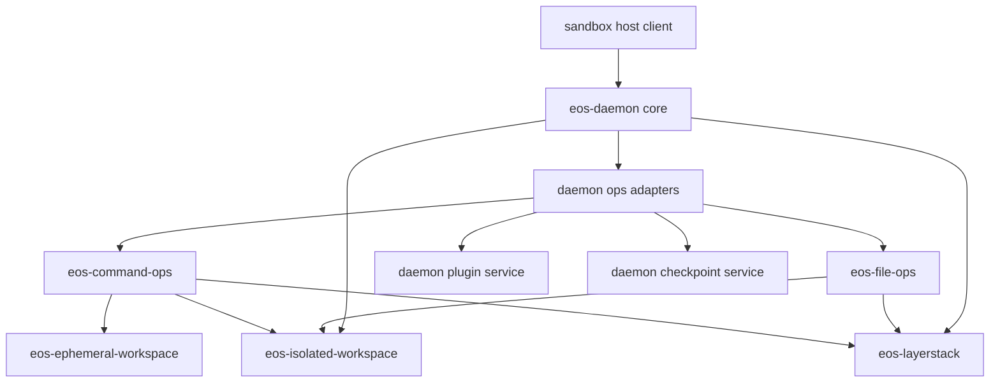

# Sandbox Daemon Core Service Refactor SPEC

Status: Implemented locally; contract gate needs Linux-capable runner
Date: 2026-06-11
Owner: sandbox/crates
Scope: `sandbox/crates/eos-daemon` and existing sandbox crates it already
depends on.

## 1. Goal

Make `eos-daemon` a thin in-box wrapper around durable services:

- transport and framing
- wire contract ownership
- operation dispatch
- JSON request/response adapters
- process-level service composition
- cross-service lifecycle timers

The daemon should stop being the implementation home for command runtime,
isolated-session mechanics, overlay workspace helpers, and owner-local timing
or cleanup policy where an existing crate already owns that domain.

This plan explicitly does not create new crates.

## 2. Baseline Diagnosis

Before this refactor, `eos-daemon/src` was about 7,093 Rust source lines, plus
three stray `.DS_Store` files under source directories. A raw `wc -l` over
every file in the tree reports 7,118 lines because it includes those junk
files. The layout mixes at least five responsibilities:

| Responsibility | Current home | Problem |
| --- | --- | --- |
| Transport, request framing, dispatch | `transport/`, `dispatch/`, `wire/` | Correct daemon responsibility. Keep it. |
| JSON op handlers | `control.rs`, `checkpoint/ops.rs`, `workspace/*/ops.rs`, `plugins/mod.rs` | Spread across feature folders, so it is hard to see what is wire adapter versus implementation. |
| Command runtime orchestration | `workspace/run/manager.rs`, `workspace/run/ops.rs`, server timers | The daemon wraps `eos-command-ops` and `eos-command-session` instead of letting the command crate own command lifecycle. |
| Isolated workspace session state | `workspace/isolated/state.rs`, `workspace/isolated/mod.rs` | Session TTL/status/touch/list mechanics belong to `eos-isolated-workspace`; storage lease custody stays in daemon. |
| Ephemeral overlay helper glue | `overlay/mod.rs` | Runtime overlay directory allocation belongs with `eos-ephemeral-workspace`; daemon should keep only namespace runner launch details. |
| Plugin runtime | `plugins/*` | Plugin process/runtime work must stay in daemon because `eos-plugin` is intentionally a pure contract crate, but it should be grouped as an internal daemon service. |
| Checkpoint git pipeline | `checkpoint/*` | Keep in daemon because it has one consumer, but split adapter from implementation. |
| Response timing assembly | `runtime/response_timings.rs` | Generic wire response shaping is mixed with command/file/plugin-specific timing details. |

The architectural smell is not that all of this code lives in one crate. The
smell is that daemon-core modules own too much domain logic and too many
lifecycle details.

## 3. Non-Goals

- Do not create new crates.
- Do not move plugin process/runtime code into `eos-plugin`.
- Do not add any storage, `eos-layerstack`, or lease dependency to
  `eos-isolated-workspace`.
- Do not merge plugin service process lifecycle with command-session lifecycle
  behind a fake generic process abstraction.
- Do not change the wire protocol, operation names, envelope shape, or host
  side duplicated wire constants.
- Do not reintroduce broad compatibility shims for old module paths.
- Do not regenerate unrelated TypeScript inventories or touch
  `eos-agent-core/`.

## 4. Target Ownership



| Owner | Owns | Does not own |
| --- | --- | --- |
| `eos-daemon` core | Transport, dispatch, wire, service construction, timers, cross-service cleanup, JSON adapters. | Command registry internals, isolated session TTL mechanics, reusable overlay dir helpers. |
| `eos-command-ops` | Command lifecycle policy, registry, sweep/reap/recovery, caller cleanup, conversion from isolated binding to command target. | Wire envelope parsing, daemon transport timers. |
| `eos-ephemeral-workspace` | Runtime overlay directory allocation, mount-plan helpers, capture/discard primitives. | Daemon namespace runner process launch. |
| `eos-isolated-workspace` | Isolated session manager, handle lifecycle, TTL/status/touch/list/reset mechanics, in-memory session invariants. | Storage leases, layerstack mutation, durable publish. |
| `eos-file-ops` | File operation semantics over direct and isolated backends. | Daemon JSON request parsing. |
| `eos-plugin` | Pure plugin contracts, DTOs, refresh protocol types. | Daemon-owned process management, overlay execution, PPC callback application. |

## 5. Target File Structure

### 5.1 `eos-daemon/src`

```text
src/
  lib.rs
  transport/
    mod.rs
    framing.rs
    server.rs
  dispatch/
    mod.rs
    dispatcher.rs
    registry.rs
  wire/
    mod.rs
    canonical.rs
    envelope.rs
    ops.rs
    version.rs
  runtime/
    mod.rs
    context.rs
    error.rs
    invocation_registry.rs
    request_args.rs
    response.rs
    ns_runner.rs
  ops/
    mod.rs
    control.rs
    cancel.rs
    command.rs
    files.rs
    isolation.rs
    checkpoint.rs
    plugin.rs
  services/
    mod.rs
    workspace.rs
    checkpoint.rs
    checkpoint/
      commit.rs
    plugin/
      mod.rs
      callbacks.rs
      connected.rs
      dispatch.rs
      overlay.rs
      process.rs
      refresh.rs
      setup.rs
      state.rs
```

`runtime/context.rs` contains the narrow per-dispatch context that operation
adapters need (`DispatchContext`). It deliberately does not grow into a broad
service locator; constructed service ownership remains either in sibling crates,
daemon-owned `services/*`, or `transport/server.rs` timer setup.

`ops/*` should be JSON adapters only:

- parse `serde_json::Value`
- validate request fields using shared request helpers
- call one service method
- build one wire response

`services/*` should contain daemon-owned implementations that cannot move to an
existing crate without breaking the crate ownership rules above.

### 5.2 Existing crate additions

```text
sandbox/crates/eos-command-ops/src/
  runtime.rs

sandbox/crates/eos-ephemeral-workspace/src/
  runtime_dirs.rs

sandbox/crates/eos-isolated-workspace/src/
  manager.rs
```

These modules are not new abstraction layers for their own sake. Each one
receives code that already belongs to that crate's domain:

- `eos-command-ops::runtime`: command reaping, recovery, caller cleanup, and
  command registry runtime wrappers.
- `eos-ephemeral-workspace::runtime_dirs`: overlay run directory allocation and
  mount-plan helper construction.
- `eos-isolated-workspace::manager`: isolated session manager operations that
  do not require storage access.

## 6. File Movement Map

| Current file | Target | Notes |
| --- | --- | --- |
| `eos-daemon/src/control.rs` | `eos-daemon/src/ops/control.rs` | Adapter-only move. |
| `eos-daemon/src/checkpoint/ops.rs` | `eos-daemon/src/ops/checkpoint.rs` | Adapter-only move. |
| `eos-daemon/src/checkpoint/commit.rs` | `eos-daemon/src/services/checkpoint/commit.rs` | Keep git/projection implementation in daemon, behind `services/checkpoint.rs` DTOs. |
| `eos-daemon/src/checkpoint/mod.rs` | delete or shrink to service docs | Avoid a second checkpoint namespace after the move. |
| `eos-daemon/src/workspace/files/ops.rs` | `eos-daemon/src/ops/files.rs` | Keep as thin adapter over `eos-file-ops`. |
| `eos-daemon/src/workspace/run/ops.rs` | `eos-daemon/src/ops/command.rs` | Adapter over `eos-command-ops::runtime`. |
| `eos-daemon/src/workspace/run/wire.rs` | `eos-daemon/src/ops/command.rs` or `runtime/response.rs` | Keep only daemon response shaping. |
| `eos-daemon/src/workspace/run/manager.rs` | mostly `eos-command-ops/src/runtime.rs` | Daemon retains only timer scheduling and service construction. |
| `eos-daemon/src/workspace/cancel.rs` | `eos-daemon/src/ops/cancel.rs` plus `services/workspace.rs` | Keep cancellation as a thin cross-service adapter over command cleanup and isolated exit. |
| `eos-daemon/src/workspace/isolated/mod.rs` | `eos-daemon/src/ops/isolation.rs` | Adapter calls daemon workspace service. |
| `eos-daemon/src/workspace/isolated/state.rs` | split: `eos-isolated-workspace/src/manager.rs` and `eos-daemon/src/services/workspace.rs` | Manager logic moves; lease acquisition/release stays in daemon. |
| `eos-daemon/src/workspace/mod.rs` | delete after children move | Replace with `ops` and `services/workspace.rs`. |
| `eos-daemon/src/overlay/mod.rs` | split: `eos-ephemeral-workspace/src/runtime_dirs.rs` and `runtime/ns_runner.rs` | Dir allocation moves; daemon runner launch stays. |
| `eos-daemon/src/plugins/mod.rs` | `eos-daemon/src/ops/plugin.rs` | Operation adapter only. |
| `eos-daemon/src/plugins/*.rs` | `eos-daemon/src/services/plugin/*.rs` | Internal daemon service, not a new crate. |
| `eos-daemon/src/runtime/response_timings.rs` | `runtime/response.rs` plus owner-local timing helpers | Also fix `manifest_path_count` so it is not populated from manifest depth. |
| `eos-daemon/src/.DS_Store`, `src/adapters/.DS_Store`, `src/adapters/workspace_run/.DS_Store` | delete | Source tree cleanup. |

## 7. Duplicate Reduction Rules

### 7.1 Command runtime duplication

Create a command runtime facade in `eos-command-ops` and delete daemon wrapper
functions that only delegate to command operations.

Sketch:

```rust
pub struct CommandRuntime {
    ops: CommandOps,
}

impl CommandRuntime {
    pub async fn exec_command(&self, req: ExecCommandRequest) -> Result<ExecOutcome, CommandError>;
    pub async fn write_stdin(&self, req: WriteStdinRequest) -> Result<ProgressOutcome, CommandError>;
    pub async fn read_progress(&self, req: ReadProgressRequest) -> Result<ProgressOutcome, CommandError>;
    pub async fn cancel(&self, req: CancelCommandRequest) -> Result<CancelOutcome, CommandError>;
    pub async fn sweep_expired(&self) -> SweepReport;
    pub async fn cleanup_caller(&self, caller_id: &str) -> CleanupReport;
    pub async fn recover_orphans(&self) -> RecoveryReport;
}
```

The daemon should schedule `sweep_expired` and `recover_orphans`, but the
command crate should decide what those operations mean.

### 7.2 Isolated workspace duplication

Move state-only isolated lifecycle operations into `eos-isolated-workspace`.
The daemon remains the storage custodian:

```text
enter:
  daemon acquires layerstack snapshot and lease
  daemon calls IsolatedManager::enter(snapshot fields)
  daemon records lease id against isolated workspace id

exit:
  daemon calls IsolatedManager::exit(id)
  daemon releases the recorded layerstack lease
```

This reduces daemon state logic without giving isolated workspaces a storage
edge.

### 7.3 Ephemeral overlay helper duplication

Move run directory allocation and mount-plan helper construction into
`eos-ephemeral-workspace`. The daemon should pass paths and runner inputs
rather than construct the same overlay directory shape itself.

Keep namespace runner process launch in `eos-daemon`, because it is daemon
binary/runtime behavior.

### 7.4 Response/timing duplication

`runtime/response.rs` should hold common wire response helpers. Owner-specific
timing keys should live near the owner code:

- command timing helpers in `eos-command-ops`
- file timing helpers in `eos-file-ops` when they are semantic file timings
- plugin timing helpers in `services/plugin`
- generic envelope timing helpers in `eos-daemon`

Also fix the existing `manifest_path_count` bug where a path-count field is
filled from manifest depth.

### 7.5 Plugin process duplication

Do not combine plugin process lifecycle and command-session lifecycle. They
look superficially similar because both manage child processes, but they have
different invariants:

- command sessions are caller-visible, PTY-backed, and settle once
- plugin services are daemon-managed, long-lived, refreshable, and PPC-backed

The only valid cleanup is naming and folder ownership, not a shared generic
process service.

## 8. Implementation Plan

### Phase 0: Baseline and stale-source cleanup

Success criteria:

- Record the current daemon file list and package checks.
- Delete only non-code source trash files (`.DS_Store`) if this phase is being
  implemented, not just planned.
- Remove `src/adapters/` and `src/adapters/workspace_run/` if they become empty
  after deleting the ignored junk files.
- Confirm no unrelated dirty `sandbox/` edits are present before moving files.

Verification:

```bash
cargo metadata --manifest-path sandbox/Cargo.toml --format-version=1 --no-deps
cargo check --manifest-path sandbox/Cargo.toml -p eos-daemon --all-targets
git diff --check
```

### Phase 1: Move daemon JSON adapters under `ops/`

Moves:

- `control.rs` -> `ops/control.rs`
- `checkpoint/ops.rs` -> `ops/checkpoint.rs`
- `workspace/files/ops.rs` -> `ops/files.rs`
- `workspace/run/ops.rs` -> `ops/command.rs`
- `workspace/isolated/mod.rs` adapter portions -> `ops/isolation.rs`
- `plugins/mod.rs` operation entrypoints -> `ops/plugin.rs`

Rules:

- No behavior changes.
- Keep re-export shims only inside the phase if needed for small commits.
- Remove shims before completing the phase.

Verification:

```bash
cargo check --manifest-path sandbox/Cargo.toml -p eos-daemon --all-targets
cargo test --manifest-path sandbox/Cargo.toml -p eos-daemon --all-targets
```

### Phase 2: Move command runtime wrappers into `eos-command-ops`

Moves:

- most of `workspace/run/manager.rs` -> `eos-command-ops/src/runtime.rs`
- command caller cleanup and orphan recovery wrappers -> `eos-command-ops`
- isolated binding to command target conversion -> `eos-command-ops` if it
  returns `CommandBinding` or command-owned target types

Daemon keeps:

- timer task spawning
- service construction
- wire response shaping

Verification:

```bash
cargo test --manifest-path sandbox/Cargo.toml -p eos-command-ops --all-targets
cargo test --manifest-path sandbox/Cargo.toml -p eos-daemon --all-targets
```

### Phase 3: Move ephemeral overlay helpers

Moves:

- reusable run directory allocation from `overlay/mod.rs` ->
  `eos-ephemeral-workspace/src/runtime_dirs.rs`
- reusable mount-plan helper construction -> `eos-ephemeral-workspace`

Daemon keeps:

- namespace runner child launch
- daemon binary path handling
- process-level error conversion

Verification:

```bash
cargo test --manifest-path sandbox/Cargo.toml -p eos-ephemeral-workspace --all-targets
cargo test --manifest-path sandbox/Cargo.toml -p eos-daemon --all-targets
```

### Phase 4: Move isolated session manager logic

Moves:

- state-only session map operations from `workspace/isolated/state.rs` ->
  `eos-isolated-workspace/src/manager.rs`
- TTL/status/touch/list/reset mechanics -> `eos-isolated-workspace`

Daemon keeps:

- layerstack snapshot acquisition
- lease id recording
- lease release on exit/reset/cleanup
- cross-caller cleanup orchestration

Verification:

```bash
cargo test --manifest-path sandbox/Cargo.toml -p eos-isolated-workspace --all-targets
cargo test --manifest-path sandbox/Cargo.toml -p eos-daemon --all-targets
```

### Phase 5: Introduce daemon service context

Add `runtime/context.rs` with the small per-dispatch context that adapters need.
The goal is to thread runtime state explicitly without turning the daemon into a
new service-locator layer.

Required properties:

- Operation adapters receive a context reference for request-scoped runtime
  state.
- Server startup constructs daemon-owned long-lived services and timer tasks in
  one place.
- Timers call the owning sibling-crate/service APIs directly.
- Test seams are explicit and crate-local.

Verification:

```bash
cargo check --manifest-path sandbox/Cargo.toml -p eos-daemon --all-targets
cargo test --manifest-path sandbox/Cargo.toml -p eos-daemon --all-targets
```

### Phase 6: Re-home plugin runtime inside daemon services

Moves:

- `plugins/connected.rs` -> `services/plugin/connected.rs`
- `plugins/dispatch.rs` -> `services/plugin/dispatch.rs`
- `plugins/occ_callbacks.rs` -> `services/plugin/callbacks.rs`
- `plugins/overlay.rs` -> `services/plugin/overlay.rs`
- `plugins/process.rs` -> `services/plugin/process.rs`
- `plugins/refresh.rs` -> `services/plugin/refresh.rs`
- `plugins/service.rs` -> `services/plugin/service.rs`
- `plugins/setup.rs` -> `services/plugin/setup.rs`
- `plugins/state.rs` -> `services/plugin/state.rs`

Rules:

- Keep `eos-plugin` pure.
- Do not introduce a new plugin runtime crate.
- Keep PPC callback storage application in daemon-owned service code.

Verification:

```bash
cargo test --manifest-path sandbox/Cargo.toml -p eos-daemon --all-targets
```

### Phase 7: Re-home checkpoint and response cleanup

Moves:

- `checkpoint/commit.rs` -> `services/checkpoint/commit.rs`
- response helpers from `runtime/response_timings.rs` -> `runtime/response.rs`
- owner-local timing helpers to their owner modules when practical

Fixes:

- Correct `manifest_path_count` so it represents path count, not manifest
  depth.

Verification:

```bash
cargo test --manifest-path sandbox/Cargo.toml -p eos-daemon --all-targets
cargo xtask check-contract
```

If `cargo xtask check-contract` is not available from the repo root, run the
current contract check documented by `sandbox/docs/SPEC.md` and record the
replacement command in the implementation PR.

### Phase 8: Final cleanup

Checklist:

- Remove empty old module directories:
  - `workspace/run`
  - `workspace/files`
  - `workspace/isolated`
  - `workspace`
  - `plugins`
  - `checkpoint`
- Remove short-lived re-export shims.
- Remove stale path comments and module docs.
- Update `sandbox/docs/SPEC.md` only where it names the old daemon source
  layout.
- Run `cargo machete` or the repo's dependency hygiene tool and remove daemon
  dependencies that became unused, especially direct `eos-command-session` if
  it is no longer needed by daemon tests or service code.
- Regenerate only sandbox-owned generated inventories if this repo tracks
  daemon source paths there.

Verification:

```bash
cargo metadata --manifest-path sandbox/Cargo.toml --format-version=1 --no-deps
cargo check --manifest-path sandbox/Cargo.toml --workspace --all-targets
cargo test --manifest-path sandbox/Cargo.toml -p eos-daemon --all-targets
cargo test --manifest-path sandbox/Cargo.toml -p eos-command-ops --all-targets
cargo test --manifest-path sandbox/Cargo.toml -p eos-ephemeral-workspace --all-targets
cargo test --manifest-path sandbox/Cargo.toml -p eos-isolated-workspace --all-targets
git diff --check
```

## 9. Acceptance Criteria

The refactor is complete when:

- `eos-daemon/src` has a clear split between `ops/`, `services/`, `runtime/`,
  `transport/`, `dispatch/`, and `wire/`.
- The daemon operation modules are adapter-sized and do not own command,
  isolated-session, or overlay domain mechanics.
- `eos-command-ops` owns command reaping, recovery, cleanup, and registry
  runtime policy.
- `eos-ephemeral-workspace` owns reusable runtime overlay directory helpers.
- `eos-isolated-workspace` owns isolated session manager mechanics without
  depending on `eos-layerstack`.
- Plugin runtime remains inside `eos-daemon`, grouped under
  `services/plugin/`.
- Checkpoint implementation remains inside `eos-daemon`, grouped under
  `services/checkpoint.rs`.
- No new crates were added.
- Wire contract checks remain green on a Linux-capable test runner.
- The `manifest_path_count` timing bug is fixed.
- No `.DS_Store` files remain under `sandbox/crates/eos-daemon/src`.
- No empty `sandbox/crates/eos-daemon/src/adapters*` directories remain after
  junk-file cleanup.

## 10. Implementation Verification

Local checks completed on 2026-06-11:

```bash
cargo metadata --manifest-path sandbox/Cargo.toml --format-version=1 --no-deps
cargo check --manifest-path sandbox/Cargo.toml -p eos-command-ops --all-targets --target x86_64-unknown-linux-gnu
cargo check --manifest-path sandbox/Cargo.toml -p eos-ephemeral-workspace --all-targets --target x86_64-unknown-linux-gnu
cargo check --manifest-path sandbox/Cargo.toml -p eos-isolated-workspace --all-targets --target x86_64-unknown-linux-gnu
cargo check --manifest-path sandbox/Cargo.toml -p eos-daemon --all-targets --target x86_64-unknown-linux-gnu
rustfmt --edition 2021 --check <touched Rust files>
git diff --check
```

Local checks blocked by host/toolchain constraints:

- `cargo run -p xtask -- check-contract` compiles host-target
  `eos-command-session` and fails on macOS because `rustix::pty::ioctl_tiocgptpeer`
  and `OpenptFlags::CLOEXEC` are Linux-gated.
- `cargo test --manifest-path sandbox/Cargo.toml -p eos-daemon --all-targets --target x86_64-unknown-linux-gnu --no-run`
  reaches linking, then macOS `cc` rejects Linux linker flags such as
  `--as-needed` and `-Bstatic`.

## 11. Review Risks

| Risk | Mitigation |
| --- | --- |
| Accidental wire response drift | Keep adapter moves behavior-only first; run contract checks after each response helper change. |
| Moving storage custody into isolated workspace | Keep lease acquisition and release in daemon service code; enforce no `eos-layerstack` dependency in `eos-isolated-workspace/Cargo.toml`. |
| Over-abstracting process lifecycle | Keep command runtime and plugin runtime separate. |
| Large rename diff hides behavior changes | Phase adapter file moves before implementation moves; run `git diff --check` and focused package tests per phase. |
| Dirty parallel worktree | Inspect `git status --short` before each implementation phase and avoid unrelated `eos-agent-core/` changes. |
