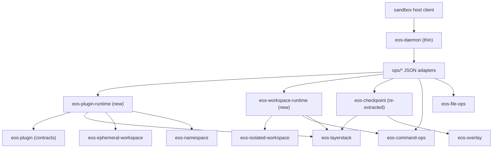

# Sandbox Daemon Runtime Crate Extraction SPEC

Status: Proposed
Date: 2026-06-11
Owner: sandbox/crates
Scope: `sandbox/crates/eos-daemon`, two new crates (`eos-plugin-runtime`,
`eos-workspace-runtime`), one re-extracted crate (`eos-checkpoint`), and
small additions to `eos-config` and `eos-plugin`.
Predecessor: `docs/plans/sandbox-daemon-core-service-refactor_SPEC.md`
(implemented 2026-06-11).

## 1. Goal

Finish making `eos-daemon` a thin wrapper of services. The predecessor spec
regrouped the daemon into `ops/` + `services/` but kept all domain
implementations in-crate under the constraint "this plan explicitly does not
create new crates". This spec lifts that constraint and moves the
`services/` tree out:

- `services/plugin/*` (2,520 LOC) -> new crate `eos-plugin-runtime`
- `services/workspace.rs` + the lifecycle halves of `ops/isolation.rs` and
  `ops/cancel.rs` (~430 LOC of policy) -> new crate `eos-workspace-runtime`
- `services/checkpoint/*` (471 LOC) -> re-extracted crate `eos-checkpoint`

It is also an aggressive net-LOC-reduction pass, not a pure relocation. The
move is sequenced behind in-place refactors that delete the daemon's global
singleton state, its `#[cfg(test)]` shadow implementations, its duplicated
argument/response helpers, and its duplicated config defaults. The LOC budget
in §9 is part of the acceptance criteria.

After this migration `eos-daemon` contains only: transport + framing, the
wire contract, dispatch, the invocation registry, JSON adapters, service
construction, and timer scheduling.

## 2. Relationship to the Predecessor Spec

| Predecessor rule | Status here |
| --- | --- |
| "Do not create new crates" | **Superseded.** That was a scoping decision for the regrouping pass; this spec is the follow-on extraction. |
| "Do not move plugin process/runtime code into `eos-plugin`" | **Preserved.** `eos-plugin` stays contract-only; the runtime goes to a new crate that depends on it. |
| "Do not add `eos-layerstack` dependency to `eos-isolated-workspace`" | **Preserved.** The layerstack/isolated composition moves to `eos-workspace-runtime`; `eos-isolated-workspace` stays storage-free. |
| "Do not merge plugin and command-session process lifecycle" | **Preserved.** They land in different crates. |
| "Do not change the wire protocol, op names, envelope shape" | **Preserved.** All wire shapes are byte-stable; contract checks gate every phase. |
| "Checkpoint stays in daemon because it has one consumer" | **Superseded.** Single-consumer absorption loses to the thin-daemon goal; `eos-checkpoint` is re-extracted (§7, Phase 5). |

## 3. Baseline Diagnosis

`eos-daemon/src` is 6,952 LOC; `eos-daemon/tests` is 4,760 LOC. Roughly 46%
of src (`services/` 3,192 + lifecycle logic inside `ops/` ~430) is domain
implementation, not daemon.

Beyond placement, deep-read findings that the extraction must fix rather
than relocate:

### 3.1 Handlers are fn pointers, so all service state is process-global

`Handler = for<'ctx> fn(&Value, DispatchContext<'ctx>)` (`dispatch/dispatcher.rs:37`)
cannot close over services, so every service lives in a
`static OnceLock<Mutex<...>>`:

- plugin registry: `services/plugin/state.rs:55`
- plugin runtime config cell: `services/plugin/setup.rs:31`
- isolated workspace state: `services/workspace.rs:177`
- isolated workspace config cell: `services/workspace.rs:127`

Consequences: `reset_state_for_tests` / `reset_for_tests` hacks,
`StateLockPoisoned` error paths, `configure_*` mutation entry points, and the
inability to construct two daemons in one test process. Extracted library
crates must not inherit globals.

### 3.2 Layering inversions

- Service reaches up into the adapter layer:
  `services/plugin/setup.rs:69` calls
  `crate::ops::isolation::caller_has_active_handle`.
- Adapters act as the API for other adapters: `ops/files.rs`,
  `ops/command.rs`, `ops/cancel.rs` import `ops::isolation` for
  `command_handle_for_args` / `exit_isolated` / `touch_isolated`; and
  `ops/isolation.rs::op_exit` calls back into
  `ops/cancel.rs::cancel_workspace_runs_by_caller_id` — an adapter↔adapter
  cycle around what is really one workspace-run service.
- Wire shaping inside a service: `services/plugin/overlay.rs` builds the full
  wire response (`guarded_changeset_response`, `changed_path_kinds`,
  status/error fields) via `crate::response`, unlike
  `services/checkpoint` which is DTO-in/DTO-out.

### 3.3 `serde_json::Value` used as internal control flow

`process.status_json()["running"] != true` decides process reaping and
restart in four places (`services/plugin/service.rs:237`, `:251`,
`services/plugin/refresh.rs:324`, `:400`). The wire view is the state.

### 3.4 `#[cfg(test)]` shadow implementations inside src

Production modules carry parallel test implementations and test-only seams,
~330 LOC total in `services/plugin/` alone:

- `service_overlay_for_snapshot` test variant (`services/plugin/service.rs:299-311`)
- `spawn_overlay_runner` test variant (`services/plugin/process.rs:125-132`)
- `remount_workspace_overlay` test variant (`services/plugin/process.rs:292-306`)
- test spec constructors (`services/plugin/process.rs:382-424`)
- `register_ppc_client_for_tests`, `reset_for_tests`, and a ~45-line
  `#[cfg(test)]` import wall (`services/plugin/mod.rs`)
- `ppc_socket_root` test branch (`services/plugin/setup.rs:40-46`)

These exist because the ns-runner launch path is hardwired (§3.5) and the
state is global (§3.1). With those fixed, the shadows are deleted, not moved.

### 3.5 Hardwired `current_exe` + `ns-runner` contract

`runtime/ns_runner.rs:18`, `services/plugin/process.rs:99`, and the
`nsenter ... current_exe ns-runner --remount-overlay` path
(`services/plugin/process.rs:251-263`) all assume "the running binary has an
`ns-runner` subcommand". That contract is owned by the `eosd` binary and
cannot be assumed by a library crate.

### 3.6 Duplication inventory (deletion targets)

| Duplication | Locations | ~LOC saved |
| --- | --- | --- |
| Four required-arg helpers with three error conventions | `ops/mod.rs::require_arg`, `runtime/request_args.rs::require_string`, `ops/command.rs::require_command_string`, `ops/command.rs::require_nonempty_string` | 50 |
| Config defaults duplicated from `eos-config` | `services/plugin/setup.rs::default_plugin_runtime_config`, `services/workspace.rs::default_isolated_workspace_config` (no `Default` impls exist in `eos-config/src/configs/daemon.rs`) | 45 |
| Guarded-write wire shape built twice | `runtime/response.rs::guarded_changeset_response` vs `ops/files.rs::GuardedWireResponse` | 50 |
| `LoadedPluginRuntime` mirrors `ParsedEnsure` field-for-field, plus `loaded_matches_parsed` field comparison and the field-copy in `op_ensure` | `services/plugin/state.rs:18-25`, `:154-160`, `services/plugin/mod.rs:103-113` | 55 |
| Hand-rolled JSON mappers for contract types | `state.rs::route_to_json`, `process.rs::process_spec_to_json` (neither `PluginOperationRoute` nor `PluginProcessSpec` derives `Serialize`; `PluginServiceStatus` already does and is serialized directly) | 50 |
| Repeated `lock_state()` round-trips in the refresh flow | `refresh.rs::service_was_started_before`, `service_is_ready_on_manifest`, `ppc_client_for_service`, `refresh_lock_for_service`, `service_process_pid` each take the global lock; collapse into instance methods once state is owned | 60 |
| Pure pass-through module | `ops/plugin.rs` (21 LOC of one-line delegation; after extraction it becomes the real adapter and the delegation layer dies) | 20 |

## 4. Non-Goals

- No wire protocol, op name, envelope, or response-shape changes. The three
  existing error conventions (`invalid_argument` payloads vs
  `invalid_envelope` envelopes) keep their current per-op assignments; only
  the implementation helpers are unified.
- No merging of plugin-service and command-session process lifecycles.
- No `eos-layerstack` dependency added to `eos-isolated-workspace`.
- No plugin runtime code moved into `eos-plugin` (contracts only; additive
  `Serialize` derives are allowed where the wire shape is reproduced
  exactly).
- No changes to `eos-sandbox-host`, `eos-api`, or the deliberate wire
  vocabulary duplication between them and the daemon.
- No new generic abstractions: the only new trait is the ns-runner launcher
  seam (§6.3), which sits at a real binary/process boundary.
- No `eos-agent-core/` changes.

## 5. Target Ownership



| Owner | Owns | Does not own |
| --- | --- | --- |
| `eos-daemon` | Transport, framing, wire catalog, dispatch, invocation registry, JSON adapters, `Services` construction, timer scheduling, the `NsRunnerLauncher` implementation (current_exe + `ns-runner`), daemon process telemetry (`runtime/response.rs` cgroup/proc sampling). | Plugin process lifecycle, isolated-session/lease policy, checkpoint git pipeline. |
| `eos-plugin-runtime` | Plugin service-process spawn/PPC handshake, registered-op routing, refresh state machine, oneshot overlay execution, OCC callback application, health probes, plugin runtime state. Typed DTOs in, typed outcomes out. | Wire `Value` shaping, ns-runner binary identity, isolated-caller policy gate. |
| `eos-workspace-runtime` | Isolated workspace enter/exit/status/list, lease custody (acquire on enter, release on exit/sweep), TTL sweep policy, caller-keyed and whole-sandbox cancel coordination, `CommandBinding` lookup, activity touch. | Namespace mechanics (stays `eos-isolated-workspace`), command registry internals (stays `eos-command-ops`), wire shaping. |
| `eos-checkpoint` | Pathspec policy, overlay-or-projection worktree preparation, git staging/commit pipeline. `CommitRequest` in, `CommitOutcome`/`CheckpointError` out (already true today). | Envelope parsing, response mapping. |
| `eos-config` | `Default` impls for `PluginRuntimeConfig` and `IsolatedWorkspaceConfig` (moved from daemon hardcoding). | — |
| `eos-plugin` | Contracts, DTOs, PPC protocol, plus additive `Serialize` derives where the daemon's wire shape is reproducible by derive + rename attrs. | Runtime behavior. |

External consumers are unaffected: `eosd` uses `ServerConfig`,
`DaemonServer::with_daemon_config`, and `wire::*`; `eos-e2e-test` uses
`wire::ops` only. Both surfaces are unchanged.

## 6. Target Design

### 6.1 `Services` on `DispatchContext` (replaces all globals)

```rust
// eos-daemon/src/runtime/services.rs
pub struct Services {
    pub plugin: eos_plugin_runtime::PluginRuntime,
    pub workspace: eos_workspace_runtime::WorkspaceRuntime,
}

// runtime/context.rs — one added field, handlers stay fn pointers
pub struct DispatchContext<'ctx> {
    services: Option<&'ctx Services>,
    invocation_registry: Option<&'ctx InFlightRegistry>,
    file_limits: Option<FileLimitsConfig>,
    read_request_s: Option<f64>,
}
```

`DaemonServer` owns `Services`, constructed once in
`with_daemon_config` from typed config (no `configure_*` mutation paths —
those functions are deleted). The predecessor spec's warning that
`DispatchContext` must not become a service locator is amended: carrying the
two extracted service handles is exactly the explicit threading that replaces
hidden globals; nothing else may be added to it.

`PluginRuntime` and `WorkspaceRuntime` are plain structs over
`Mutex<State>` instance fields. Mutex poisoning keeps the existing
`unwrap_or_else(PoisonError::into_inner)` / error-variant behavior so wire
responses do not drift.

### 6.2 Typed boundaries (DTO-in / outcome-out, like checkpoint)

- `PluginServiceProcess` gets `fn is_running(&mut self) -> bool` and a typed
  `ServiceProcessStatus` (serde `Serialize` for the wire view). All four
  `status_json()["running"] != true` sites switch to the typed call.
- `services/plugin/overlay.rs` returns a typed `PluginOverlayOutcome`
  (runner result, changeset, plugin result, path kinds, phase timings); the
  `ops/plugin.rs` adapter shapes the wire response and splices daemon
  resource telemetry, mirroring `ops/files.rs::enrich_direct_timings`.
- `LoadedPluginRuntime` is deleted; the registry stores the host-parsed
  `ParsedEnsure` (or a shared `PluginRuntimeSpec` DTO in `eos-plugin` if
  field trimming is needed), making "already loaded" an `==` comparison.
- `op_ensure`/`op_status` move their arg parsing and `json!` response
  assembly into `ops/plugin.rs`; `PluginRuntime` exposes
  `ensure(EnsureRequest) -> EnsureOutcome` and
  `status(StatusRequest) -> StatusOutcome`.

### 6.3 `NsRunnerLauncher` seam

```rust
// eos-plugin-runtime/src/launcher.rs
pub trait NsRunnerLauncher: Send + Sync {
    /// Run one ns-runner request to completion (oneshot overlay).
    fn run(&self, request: &RunRequest) -> Result<RunResult, LaunchError>;
    /// Spawn a long-lived ns-runner child (connected service with overlay).
    fn spawn_detached(&self, request: &RunRequest) -> Result<std::process::Child, LaunchError>;
    /// Re-run a remount request inside an existing child's namespaces.
    fn remount_in(&self, target_pid: u32, request: &RunRequest, timeout: Duration)
        -> Result<(), LaunchError>;
}
```

The daemon implements it once (`runtime/ns_runner.rs` becomes the impl:
`current_exe` + `ns-runner`, `nsenter` remount, invocation-registry process
group bookkeeping). `PluginRuntime::new(config, Arc<dyn NsRunnerLauncher>)`
receives it. All `#[cfg(test)]` shadow implementations in §3.4 are deleted;
tests use a fake launcher.

This is the only `dyn` seam introduced; it is load-bearing for both the
crate split (binary identity stays with the binary) and test deletion.

### 6.4 Cross-domain policy gates move to adapters

The isolated-caller gate (`ForbiddenInIsolatedWorkspace`) is composed in the
daemon, not inside the plugin runtime:

```text
ops/plugin.rs (and the dispatcher's registered-op fallback):
  validate_plugin_caller_fields(args)           # eos-plugin, unchanged
  if services.workspace.caller_has_active_handle(caller_id):
      return DaemonError::Plugin(ForbiddenInIsolatedWorkspace)
  services.plugin.<dispatch>(...)
```

`eos-plugin-runtime` therefore has no dependency on workspace state, and the
`services -> ops` upward import (§3.2) disappears structurally. The gate
covers both builtin plugin ops and the dynamic `plugin.*` fallback exactly as
today (`dispatch/dispatcher.rs:111-127` routes the fallback through the same
adapter function).

### 6.5 `WorkspaceRuntime` API

```rust
pub struct WorkspaceRuntime { /* owns Option<BoundState>, config */ }

impl WorkspaceRuntime {
    pub fn enter(&self, caller_id: &str, root: &Path) -> Result<EnterOutcome, WorkspaceRunError>;
    pub fn exit(&self, caller_id: &str, grace_s: Option<f64>) -> Result<ExitOutcome, WorkspaceRunError>;
    pub fn status(&self, caller_id: &str) -> Option<HandleStatus>;
    pub fn list_open(&self) -> Vec<String>;
    pub fn touch(&self, caller_id: &str);
    pub fn caller_has_active_handle(&self, caller_id: &str) -> bool;
    pub fn command_binding_for(&self, caller_id: &str) -> Option<CommandBinding>;
    pub fn cancel_runs_for_caller(&self, caller_id: &str, grace_s: Option<f64>) -> CallerCancel;
    pub fn cancel_all_runs(&self, grace_s: Option<f64>) -> (usize, usize);
    pub fn ttl_sweep(&self) -> usize;
    pub fn test_reset(&self) -> Vec<String>;   // backs sandbox.isolation.test_reset
}
```

This absorbs: `services/workspace.rs` wholesale; from `ops/isolation.rs` the
lifecycle half (`ensure_state` + enter compensation, `exit_isolated`,
`exit_response` outcome assembly as a typed `ExitOutcome`, `exit_all_and_reap`,
`ttl_sweep`, `touch_isolated`, `caller_has_active_handle`,
`command_handle_for_args`); from `ops/cancel.rs` the `CallerCancel`
coordinator and `cancel_all_workspace_runs`. The adapters keep arg parsing,
`error_payload` mapping, and response `json!` assembly. The
adapter↔adapter cycle (§3.2) dissolves: `op_exit` calls
`services.workspace.cancel_runs_for_caller(...)` directly.

Lock-order discipline carries over verbatim: workspace state lock before
command-session registry, never across the existing blocking teardown calls.

### 6.6 Helper and config consolidation

- One arg-helper module (`runtime/request_args.rs`) with the
  `DaemonError`-returning helpers and one thin `require_arg_json` wrapper for
  the ops that encode misses as `invalid_argument` payloads. The
  `ops/command.rs` private duplicates are deleted.
- `impl Default for PluginRuntimeConfig` and
  `impl Default for IsolatedWorkspaceConfig` move into `eos-config` with the
  daemon's current literal values; both daemon `default_*_config` functions
  are deleted.
- `ops/files.rs::GuardedWireResponse` and
  `runtime/response.rs::guarded_changeset_response` merge into one builder in
  `runtime/response.rs` parameterized by the (small) field differences;
  contract tests pin byte-stability.
- `Serialize` derives with `#[serde(rename = ...)]` are added to
  `PluginOperationRoute` / `PluginProcessSpec` in `eos-plugin` **only if**
  the derive output is byte-identical to today's `route_to_json` /
  `process_spec_to_json` (including the computed `dispatch_mode`, which can
  be a `serialize_with` or a small wrapper). If exact parity is awkward, the
  mappers move into `eos-plugin-runtime` unchanged and this line item is
  dropped — wire stability outranks the ~50 LOC.

## 7. File Movement Map

| Current file (LOC) | Disposition |
| --- | --- |
| `services/plugin/mod.rs` (273) | Split: op facade + response shaping -> `eos-daemon/src/ops/plugin.rs`; runtime entry -> `eos-plugin-runtime/src/lib.rs`. `#[cfg(test)]` wall, `reset_for_tests`, `register_ppc_client_for_tests` deleted (fake launcher + instance state replace them). |
| `services/plugin/state.rs` (160) | -> `eos-plugin-runtime/src/state.rs`; `LoadedPluginRuntime` + `loaded_matches_parsed` deleted (§6.2); `*_values` JSON mappers move to the daemon adapter or become serde derives (§6.6). |
| `services/plugin/service.rs` (324) | -> `eos-plugin-runtime/src/service.rs`; test-variant `service_overlay_for_snapshot` deleted. |
| `services/plugin/process.rs` (428) | -> `eos-plugin-runtime/src/process.rs`; spawn/remount go through `NsRunnerLauncher`; test variants + test spec constructors deleted; `status_json` replaced by typed status. |
| `services/plugin/refresh.rs` (441) | -> `eos-plugin-runtime/src/refresh.rs`; `lock_state` round-trip helpers collapse into instance methods. |
| `services/plugin/overlay.rs` (383) | -> `eos-plugin-runtime/src/overlay.rs`; returns `PluginOverlayOutcome`; wire shaping + telemetry splice stay in `ops/plugin.rs`. |
| `services/plugin/callbacks.rs` (200) | -> `eos-plugin-runtime/src/callbacks.rs` (depends on `eos_layerstack::service::commit_direct`, an ordinary dependency). |
| `services/plugin/connected.rs` (105), `dispatch.rs` (92) | -> `eos-plugin-runtime/src/{connected,dispatch}.rs`; the caller-family gate moves out per §6.4. |
| `services/plugin/setup.rs` (114) | Config cell deleted (constructor input + `eos-config` `Default`); `ensure_plugin_family_allowed` split per §6.4; remainder -> `eos-plugin-runtime`. |
| `services/workspace.rs` (196) | -> `eos-workspace-runtime/src/state.rs`; config cell deleted. |
| `ops/isolation.rs` (351) | Lifecycle half -> `eos-workspace-runtime`; adapter half (~160 LOC: `op_enter/exit/status/list_open/test_reset`, `error_payload`) stays. |
| `ops/cancel.rs` (99) | Coordinator -> `eos-workspace-runtime`; two `op_*` adapters (~55 LOC) stay. |
| `services/checkpoint.rs` (90) + `checkpoint/commit.rs` (381) | -> `eos-checkpoint/src/{lib,commit}.rs`. `usize_to_f64_saturating` (its one daemon import) moves with it or inlines. `From<CheckpointError> for DaemonError` stays in `runtime/error.rs`. |
| `runtime/ns_runner.rs` (49) | Becomes the daemon's `NsRunnerLauncher` impl (grows to ~120 absorbing the spawn/remount process code from `process.rs`). |
| `ops/plugin.rs` (21) | Replaced by the real adapter (~170: ensure/status parsing, overlay response shaping, isolated gate, registered-op fallback entry). |
| `lib.rs` (50) | Drops `services` module; gains `runtime/services.rs` re-export. Public surface (`DaemonServer`, `ServerConfig`, `OpTable`, `InFlightRegistry`, `DispatchContext`, `wire`) unchanged. |
| `tests/unit/plugin/*` (2,325), `tests/unit/plugin_process/*` (166) | -> `eos-plugin-runtime/tests/` (normal integration tests; the `#[path]` indirection ends). `eos-plugin` `test-root-override` dev-dep feature moves to the new crate. |
| `tests/unit/isolated_workspace/service.rs` (233) | Split: lifecycle tests -> `eos-workspace-runtime/tests/`; adapter tests stay in daemon. |
| `tests/unit/checkpoint/commit.rs` (224) | -> `eos-checkpoint/tests/`. |
| Everything else (`transport/`, `wire/`, `dispatch/`, `runtime/{context,error,invocation_registry,request_args,response}`, `ops/{control,checkpoint,command,files}`) | Stays; touched only by helper consolidation (§6.6) and `DispatchContext` threading. |

## 8. New Crate Manifests

```toml
# eos-plugin-runtime
[dependencies]
eos-plugin.workspace = true        # contracts + host PPC client
eos-layerstack.workspace = true    # leases, commit_direct, publish_capture
eos-ephemeral-workspace.workspace = true  # overlay run dirs, capture
eos-namespace.workspace = true     # RunRequest/RunResult protocol
eos-config.workspace = true        # PluginRuntimeConfig
serde.workspace = true
serde_json = { workspace = true, features = ["preserve_order"] }
thiserror.workspace = true

[dev-dependencies]
eos-plugin = { workspace = true, features = ["test-root-override"] }

# eos-workspace-runtime
[dependencies]
eos-isolated-workspace.workspace = true
eos-command-ops.workspace = true
eos-layerstack.workspace = true
eos-config.workspace = true
serde_json.workspace = true
thiserror.workspace = true

# eos-checkpoint
[dependencies]
eos-layerstack.workspace = true
eos-overlay.workspace = true
thiserror.workspace = true
uuid.workspace = true
```

Each crate owns a `thiserror` error enum (`PluginRuntimeError`,
`WorkspaceRunError`, existing `CheckpointError`); `runtime/error.rs` folds
them into `DaemonError` via `From` impls that preserve today's `wire_kind`
classification (in particular `ForbiddenInIsolatedWorkspace`, which the
daemon now constructs itself at the §6.4 gate).

`eos-daemon` drops direct deps that move with the code (expected after
Phase 5: `eos-overlay`; verify with `cargo machete` whether
`eos-ephemeral-workspace` and `nix` survive — `nix` stays for
`terminate_process_group`).

## 9. LOC Budget (acceptance-gated)

Budgets are ceilings measured by `find <crate>/src -name '*.rs' | xargs wc -l`.

| Unit | Before | Budget after | Driver |
| --- | --- | --- | --- |
| `eos-daemon/src` | 6,952 | **≤ 3,700** | `services/` (−3,192) and ops lifecycle (−235) leave; adapter growth (+~210), launcher impl (+~70), helper dedup (−~100) |
| `eos-plugin-runtime/src` | — | **≤ 2,100** | 2,520 in, minus adapter extraction (~150), test scaffolding (~330), dedup items §3.6 (~165) |
| `eos-workspace-runtime/src` | — | **≤ 450** | ~430 of policy in, minus global plumbing and config defaults |
| `eos-checkpoint/src` | — | **≤ 490** | 471 mostly as-is |
| `eos-config` + `eos-plugin` additions | — | **≤ +80** | `Default` impls; optional serde derives |
| **Workspace total (these units)** | **6,952** | **≤ 6,420 (net ≥ −530)** | |

Test LOC moves with its code; the ~330 LOC of in-src test scaffolding is a
hard deletion, replaced by a fake `NsRunnerLauncher` (~60 LOC, in the new
crate's `tests/`).

If any budget cannot be met without distorting the design, the overage and
its reason must be recorded in the implementing PR rather than silently
accepted.

## 10. Implementation Plan

Run all verification from `sandbox/`. On macOS, `eos-daemon` tests and
`check-contract` require the Docker commands recorded in the predecessor
spec §10; per-crate `cargo check --target x86_64-unknown-linux-gnu` works
natively.

### Phase 0: Baseline

- Record `wc -l` baselines for §9.
- `git status --short` — distinguish this work from parallel agent edits.

```bash
cargo check -p eos-daemon --all-targets
cargo test -p eos-daemon --all-targets        # via Docker on macOS
```

### Phase 1: De-globalize (in-crate, no moves)

- Add `runtime/services.rs` (`Services`), thread `&Services` through
  `DispatchContext`; construct in `DaemonServer::{new,with_daemon_config}`.
- Convert `DaemonPluginState` + plugin config cell into a `PluginRuntime`
  struct; convert isolated state + config cell into `WorkspaceRuntime`
  (still under `services/` for now).
- Move config defaults to `eos-config` `Default` impls; delete
  `configure_plugin_runtime`, `configure_isolated_workspace`,
  `default_*_config`, `reset_*_for_tests`.
- Success: zero `OnceLock` service/config state in `eos-daemon` except
  `daemon_uptime_s` and `monotonic_seconds` (clock anchors, not state).

```bash
cargo test -p eos-daemon --all-targets
cargo test -p eos-config --all-targets
```

### Phase 2: Fix layering + types (in-crate)

- §6.4 gate to adapters; delete the `services -> ops` import.
- §6.5 lifecycle logic from `ops/isolation.rs` / `ops/cancel.rs` into the
  `WorkspaceRuntime` service; adapters become thin.
- §6.2 typed process status, typed `PluginOverlayOutcome`, delete
  `LoadedPluginRuntime`, collapse refresh lock round-trips.
- §6.6 arg-helper and guarded-response consolidation.
- Success: no `ops::` import inside `services/`; no `ops::isolation` import
  from other `ops/*` modules; zero `status_json()[...]` control flow;
  contract checks green (wire byte-stability).

```bash
cargo test -p eos-daemon --all-targets
cargo run -p xtask -- check-contract           # via Docker on macOS
```

### Phase 3: Launcher seam

- Introduce `NsRunnerLauncher` (still in-crate), implement over
  `runtime/ns_runner.rs` + the process-spawn/remount code; inject into
  `PluginRuntime`.
- Delete every `#[cfg(test)]` shadow implementation in §3.4; port affected
  tests to a fake launcher.
- Success: `grep -rn "cfg(test)" src/services/plugin` returns only
  `#[path]` test-module hooks (which die in Phase 4) — no parallel
  implementations.

```bash
cargo test -p eos-daemon --all-targets
```

### Phase 4: Extract `eos-plugin-runtime` and `eos-workspace-runtime`

- Create the crates (workspace members + manifests per §8); move the
  Phase 1–3-shaped modules and their tests; add the `From<...Error>` impls
  to `runtime/error.rs`; rewrite daemon adapters onto the crate APIs.
- Delete `services/plugin/`, `services/workspace.rs`; `services/mod.rs`
  shrinks to checkpoint only.
- No re-export shims may survive the phase.

```bash
cargo metadata --format-version=1 --no-deps
cargo test -p eos-plugin-runtime --all-targets
cargo test -p eos-workspace-runtime --all-targets
cargo test -p eos-daemon --all-targets
cargo run -p xtask -- check-contract
```

### Phase 5: Re-extract `eos-checkpoint` + final cleanup

- Move `services/checkpoint/*` to the crate; delete `services/` entirely.
- `cargo machete` (or the repo's dependency hygiene tool) on `eos-daemon`;
  drop dead deps.
- Record final LOC against §9 budgets in the PR description.
- Update `sandbox/docs/SPEC.md` where it names the daemon source layout, and
  mark this spec Implemented.

```bash
cargo check --workspace --all-targets
cargo test -p eos-checkpoint --all-targets
cargo test -p eos-daemon --all-targets
cargo test -p eos-e2e-test --no-run            # surface compatibility
cargo run -p xtask -- check-contract
git diff --check
```

## 11. Acceptance Criteria

- `eos-daemon/src` contains only `transport/`, `wire/`, `dispatch/`,
  `runtime/`, `ops/`, `lib.rs` — no `services/`.
- `ops/*` modules are adapter-sized: parse args, gate cross-domain policy,
  call one service method, shape one response.
- No `OnceLock`-backed service or config state anywhere in the three crates;
  services are instances owned by `DaemonServer` and threaded through
  `DispatchContext`.
- No `#[cfg(test)]` parallel implementations in any `src/` tree; test seams
  are the `NsRunnerLauncher` fake and crate-local constructors.
- No `serde_json::Value` reads as internal control flow in
  `eos-plugin-runtime` (wire views are produced from typed status at the
  daemon adapter).
- `eos-isolated-workspace` still has no `eos-layerstack` dependency;
  `eos-plugin` still has no runtime/publish dependencies.
- LOC budgets in §9 met, or overages justified in the PR.
- Wire contract checks and the full per-crate test ladder green; `eosd` and
  `eos-e2e-test` compile without source changes.

## 12. Review Risks

| Risk | Mitigation |
| --- | --- |
| Wire drift while consolidating response helpers and moving `op_ensure`/`op_status` shaping | Phase 2 lands shaping changes behind unchanged contract tests before any file moves; `check-contract` runs at Phases 2, 4, 5. |
| `Serialize` derives on `PluginOperationRoute`/`PluginProcessSpec` change field order/names | Optional item; require byte-identical output (preserve_order is load-bearing) or keep the hand mappers in `eos-plugin-runtime`. |
| Global-to-instance state conversion changes lock granularity and reintroduces lock-across-blocking-IO bugs | Keep the existing pattern: clone what you need, drop the guard, then do PPC/process IO; the per-service refresh lock map moves as-is. |
| Launcher trait drifts toward a generic process abstraction | Trait stays exactly three methods mapped to today's three launch shapes; command sessions and isolated namespaces never use it. |
| Cancel/exit ordering regressions when the adapter cycle is dissolved | `cancel_runs_for_caller` preserves the documented order (sessions first, then isolated teardown); the unit tests for `ops/cancel.rs` move with the coordinator. |
| Large move diff hides behavior changes | Phases 1–3 are behavior-preserving in-crate refactors with full test runs; Phase 4 is then (mostly) `git mv` + import rewrites. |
| Parallel agent activity in `sandbox/` | Check `git status --short` before each phase; scope commits to this migration. |
