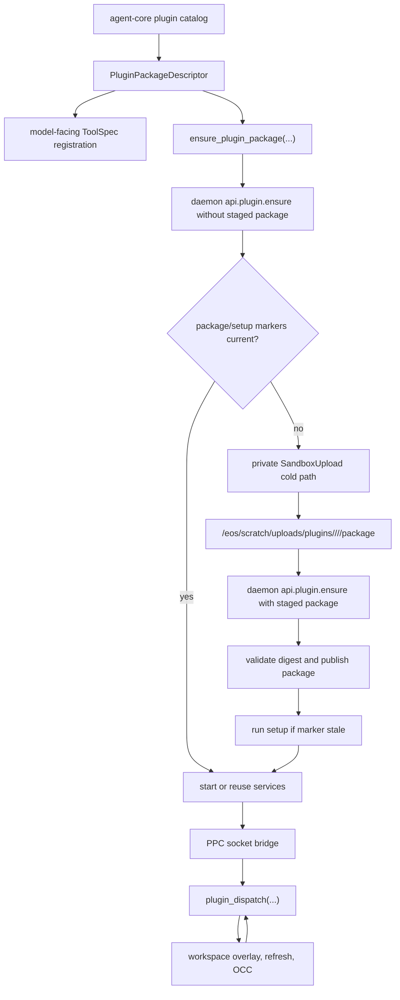
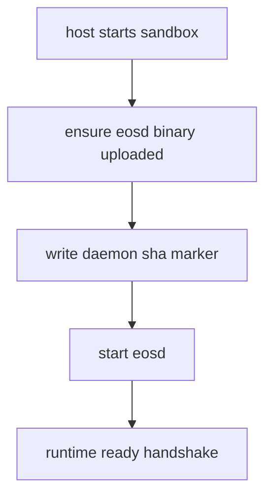
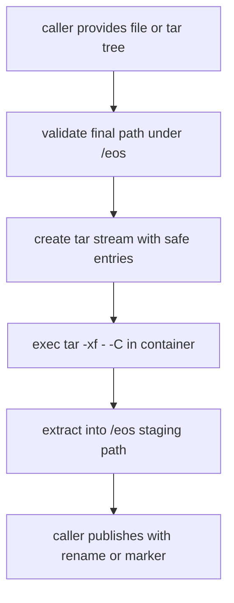
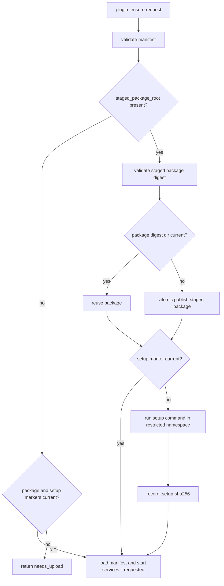
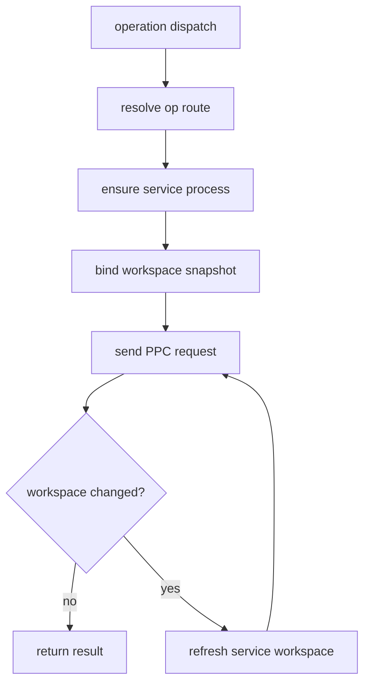
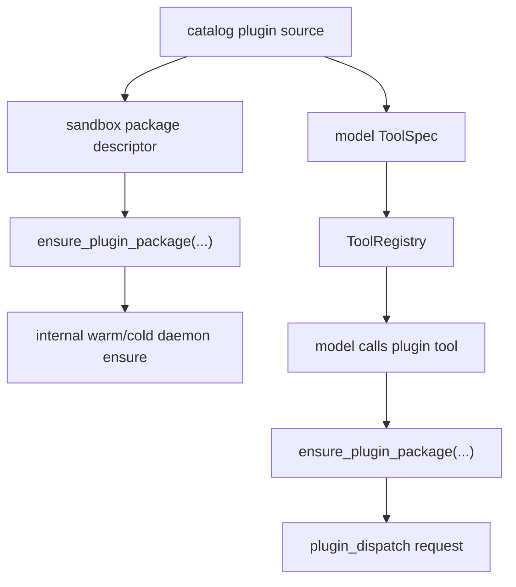

# Unified Sandbox Upload And Generic Plugin Runtime Plan

**Status:** proposed
**Owner:** TBD
**Last updated:** 2026-06-04
**Scope:** Rust sandbox upload, bootstrap artifacts, generic sandbox plugin package
installation, plugin service lifecycle, agent-core catalog integration, and
`/eos` filesystem consolidation.

This document replaces the older Python-host upload plan. The benchmark finding
is preserved: Docker's native archive endpoint is not the right way to write
into the `/eos` tmpfs. The target implementation is Rust-first and plugin-generic.
LSP is only the first real package used to prove the generic plugin path.

---

## 1. Normative Requirements

The terms MUST, MUST NOT, SHOULD, and MAY are used as implementation contracts.

1. Managed sandbox files MUST be created, modified, uploaded, and deleted only
   under `/eos`.
2. The sandbox plugin subsystem MUST be generic. It MUST NOT know about LSP,
   Pyright, Node, model-facing tool schemas, or agent-core catalog internals.
3. Agent-core plugin catalog code MUST own model-facing tool definitions and
   plugin package source metadata.
4. Sandbox-host code MUST own transport and upload into a running sandbox.
5. Sandbox-daemon code MUST own plugin registry, setup execution, service
   lifecycle, workspace refresh, PPC routing, status, and teardown.
6. Bootstrap artifact code MUST own only daemon bootstrap artifacts, such as
   `eosd`, daemon version/protocol constants, and daemon upload markers.
7. Plugin dependencies MUST be package-scoped under
   `/eos/runtime/packages/<plugin>/`.
8. Plugin runtimes SHOULD use absolute dependency paths. They SHOULD NOT rely on
   global aliases such as `NODE_HOME` or on PATH mutation.
9. Acceptance criteria for each phase MUST pass before implementation moves to
   the next phase.
10. Phases that change daemon bootstrap, upload, plugin lifecycle, workspace
    refresh, or filesystem layout MUST run live Docker E2E tests from
    `sandbox/crates/eos-e2e-test/tests`.
11. Named components in this document are roles, not mandatory new classes. The
    implementation MUST extend existing generic modules before adding new
    modules, structs, or registry files.
12. Agent-core callers MUST use purpose-specific APIs. Daemon bootstrap uses
    `ensure_daemon_bootstrap(...)`; plugin setup uses
    `ensure_plugin_package(...)`. Raw upload and staged package references are
    internal implementation details, not the normal caller workflow.

Non-`/eos` paths that cannot be migrated are limited to kernel or namespace
control surfaces, such as `/proc`, cgroups, mount namespace state, netlink/nft,
and Docker/container metadata. These are not managed sandbox files.

---

## 2. Problem Statement

Two independent issues were previously conflated:

1. Docker `put_archive` cannot reliably write into the `/eos` tmpfs through
   Docker's archive endpoint. Docker extracts archive payloads daemon-side into
   the rootfs behind the tmpfs mount. This can return success while `/eos` stays
   empty.
2. The async Pyright runtime launched `pyright-langserver` without
   `/eos/env/eos-node22/bin` on PATH. The launcher used `#!/usr/bin/env node`,
   so Node was not found and the symptom surfaced as an LSP initialize timeout.

The first problem is a transport and mount-namespace problem. The fix is to keep
the fast archive-style upload shape, but stream tar through an in-container
`tar -xf - -C <dest>` process so extraction happens inside the container mount
namespace.

The second problem is a plugin packaging problem. The fix is not to add another
global environment path. The plugin package must install its dependencies under
its own package directory and start services with absolute paths.

---

## 3. Upload Finding To Preserve

Real-container benchmark on the existing `/eos` tmpfs path:

| Payload | Current exec+tar into `/eos` | Archive to rootfs then move |
| --- | ---: | ---: |
| 0.05 MB | 46.9 ms | 385.8 ms |
| 3 MB | 63.3 ms | 402.2 ms |
| 20 MB | 173.1 ms | 535.7 ms |
| 40 MB | 297.6 ms | 701.0 ms |

The current Docker adapter branch that streams tar through exec is the fast
transport. The migration MUST optimize around this path:

- batch related files into one tar stream;
- extract directly into an `/eos` staging path;
- publish with `rename`/`mv` where possible;
- avoid `cp -a` recopy steps;
- avoid rootfs detours;
- avoid login-shell round trips in upload paths.

---

## 4. Target Roles

| Role | Owner | Responsibility |
| --- | --- | --- |
| `BootstrapArtifact` | `agent-core/crates/eos-sandbox-host` | Upload/start daemon bootstrap artifacts only. |
| `SandboxUpload` | `agent-core/crates/eos-sandbox-host` | Fast, `/eos`-only upload primitive over exec+tar. |
| `DaemonBootstrapApi` | `agent-core/crates/eos-sandbox-host` | Purpose-specific daemon setup API that uses private upload helpers internally. |
| `PluginPackageSetupApi` | `agent-core/crates/eos-sandbox-host` | Purpose-specific plugin setup API: probe, cold-path upload, daemon ensure, setup, and service start. |
| `PluginPackageDescriptor` | `agent-core/crates/eos-plugin-catalog` | Catalog-owned package source, digest, setup, services, operations, and tool metadata. |
| `SandboxPluginManifest` | `sandbox/crates/eos-plugin` | Neutral sandbox contract for package, services, operations, setup, and refresh strategy. |
| `PluginRegistry` | `sandbox/crates/eos-daemon` | In-memory loaded plugin state plus digest-marker checks; no persistent registry file for this migration. |
| `SetupRunner` | `sandbox/crates/eos-daemon` | Runs plugin setup scripts under `/eos`, records setup digest, reports failures. |
| `PluginServiceSupervisor` | `sandbox/crates/eos-daemon` | Starts, monitors, refreshes, and stops generic plugin service processes. |
| `PluginPpcRouter` | `sandbox/crates/eos-daemon` | Routes operation calls over PPC sockets and enforces protocol limits. |
| `WorkspaceRefreshManager` | `sandbox/crates/eos-daemon` | Handles overlay/snapshot refresh when the workspace changes. |
| `AgentCatalogBridge` | `agent-core/crates/eos-runtime` | Registers model tools, calls `ensure_plugin_package(...)`, then dispatches plugin operations. |

The sandbox side consumes descriptors. It does not import or inspect
`agent-core/crates/eos-plugin-catalog` source trees.

These roles SHOULD map onto existing files where ownership already exists. For
example, `sandbox/crates/eos-plugin/src/manifest.rs`,
`sandbox/crates/eos-daemon/src/plugin/ensure_args.rs`,
`sandbox/crates/eos-daemon/src/plugin/process.rs`, and
`sandbox/crates/eos-daemon/src/plugin/service.rs` already implement much of the
generic service/operation lifecycle. The migration SHOULD add only the missing
package/setup/upload pieces and rename LSP-shaped fixtures.

---

## 5. Target Workflow



### 5.1 High-Level Plugin Package Ensure

1. Agent-core resolves the plugin from the catalog.
2. Agent-core registers the model-facing tool specs.
3. Runtime calls `ensure_plugin_package(sandbox_id, catalog_package,
   start_services)` with a generic descriptor:
   - plugin identity and digest;
   - canonical package tree or package source metadata;
   - setup command;
   - service specs;
   - operation routes;
   - refresh strategy;
   - package-scoped dependency paths.
4. `ensure_plugin_package` first calls daemon `api.plugin.ensure` without a
   staged package root.
5. If the daemon has a matching package digest and setup marker, it loads the
   manifest, starts missing services when requested, and returns ready.
6. If the daemon returns `needs_upload`, `ensure_plugin_package` uploads the
   canonical package tree into an `/eos/scratch/uploads` staging directory.
7. `ensure_plugin_package` calls daemon `api.plugin.ensure` again with the staged
   package root and expected digest.
8. Daemon validates the staged package, atomically publishes it to the digest
   directory when needed, runs setup when markers require it, and starts declared
   services when requested.

Agent-core model-tool callers SHOULD NOT call raw upload plus `plugin_ensure`
manually. They call `ensure_plugin_package` before dispatch, or use a future
`call_plugin_operation` helper that performs ensure plus dispatch.

### 5.2 Generic Plugin Dispatch

1. Runtime calls `plugin_dispatch(plugin_id, op_name, input)`.
2. Daemon resolves `op_name` to a service route.
3. Daemon ensures the service is bound to the current workspace snapshot.
4. Daemon sends the request over the service PPC socket.
5. Read-only results return directly.
6. Write-capable results publish through the existing overlay/OCC path when the
   operation declares that behavior.

### 5.3 Workspace Refresh

Plugins that need a current workspace view declare a refresh strategy in their
service manifest. The daemon owns the refresh flow:

1. detect workspace generation change or explicit refresh requirement;
2. quiesce the service if the strategy requires it;
3. swap or remount the service workspace view;
4. notify the service through PPC if declared;
5. run health check;
6. resume operation dispatch.

The plugin service is bound to the workspace through sandbox-provided environment
and paths such as `EOS_PLUGIN_WORKSPACE_ROOT`, PPC socket path, layer-stack root,
and operation metadata. The plugin package does not invent its own workspace
mount policy.

### 5.4 Internal Package Upload Handoff

The host/daemon package handoff is internal to `ensure_plugin_package(...)` and
MUST be exact:

1. Agent-core catalog builds a deterministic package tree and package digest.
2. Sandbox-host uploads that tree with the `/eos` upload primitive to:

   ```text
   /eos/scratch/uploads/plugins/<plugin-id>/<plugin-digest>/<upload-id>/package/
   ```

3. Sandbox-host writes no package files directly into
   `/eos/runtime/plugins/catalog`.
4. The cold-path daemon `api.plugin.ensure` request carries:

   ```text
   PluginEnsurePackage {
     plugin_id,
     plugin_digest,
     staged_package_root,
     sandbox_manifest,
     start_services,
   }
   ```

5. Daemon rejects `staged_package_root` unless it is under
   `/eos/scratch/uploads/plugins/<plugin-id>/<plugin-digest>/`.
6. Daemon recomputes the canonical package tree digest or verifies an equivalent
   daemon-readable digest marker before publish.
7. Daemon publishes by atomic rename into:

   ```text
   /eos/runtime/plugins/catalog/<plugin-id>/<plugin-digest>/
   ```

8. If that digest directory already exists and `.package-sha256` matches,
   daemon skips publish.
9. Daemon removes stale staging directories after success or failure cleanup.

The install source of truth is the digest directory plus digest-local markers.
The plan does not require persistent `/eos/state/plugins/registry.json` or
`services.json`; daemon service status can remain in memory unless a later
requirement proves durable plugin status is needed.

`api.plugin.status` remains diagnostic. It is not required for the core
`ensure_plugin_package` warm/cold decision unless an implementation can reuse it
without adding extra state.

### 5.5 Public API Reduction

The upload transport is shared, but the public APIs are purpose-specific:

```text
public host APIs:
  ensure_daemon_bootstrap(sandbox_id)
  ensure_plugin_package(sandbox_id, catalog_package, start_services)

public daemon/model operation API:
  plugin_dispatch(plugin_id, op_name, args)

private host helpers:
  upload_tree_into_eos(...)
  upload_file_into_eos(...)
```

Do not expose `upload_plugin_package(...)` as the normal agent-core workflow.
That helper may exist privately behind `ensure_plugin_package(...)`, but callers
should not manually chain upload plus daemon ensure.

`ensure_plugin_package(...)` prepares a plugin package. `plugin_dispatch(...)`
executes one operation. Model-facing tool code MAY use a convenience helper that
calls both in sequence, but daemon install/setup and operation dispatch remain
separate contracts.

### 5.6 Live E2E Package Setup Contract

Live E2E tests MUST prove the same package contract used by production:

- host/agent-core E2E calls `ensure_plugin_package(...)`;
- protocol-only sandbox E2E fabricates the same canonical package tree, stages it
  under `/eos/scratch/uploads/plugins/<plugin-id>/<plugin-digest>/...`, and
  calls daemon `api.plugin.ensure` in cold mode;
- generic plugin package E2E is mandatory and MUST NOT be LSP-shaped;
- optional LSP E2E packages LSP through the same package contract and then calls
  the same setup/ensure path;
- E2E tests MUST cover warm re-ensure with no package upload after the first
  successful setup.

---

## 6. Final `/eos` Structure

```text
/eos/
├── runtime/
│   ├── daemon/
│   │   ├── eosd
│   │   ├── runtime.sock
│   │   ├── runtime.pid
│   │   ├── runtime.log
│   │   ├── runtime.env
│   │   └── .eosd-sha256
│   ├── plugins/
│   │   ├── bridge/
│   │   └── catalog/
│   │       └── <plugin-id>/
│   │           └── <plugin-digest>/
│   │               ├── sandbox-plugin.json
│   │               ├── .package-sha256
│   │               ├── setup.sh
│   │               ├── .setup-sha256
│   │               └── runtime/
│   └── packages/
│       └── <plugin-id>/
│           ├── archives/
│           ├── cache/
│           └── <installed-dependency>/
├── state/
│   ├── layer-stack/
│   │   ├── manifest.json
│   │   ├── workspace.json
│   │   ├── .storage-writer.lock
│   │   ├── .layer-metadata/
│   │   ├── layers/
│   │   └── staging/
└── scratch/
    ├── uploads/
    ├── setup/
    │   └── <plugin-id>/
    │       └── <plugin-digest>/
    │           └── tmp/
    ├── overlay/
    │   └── <pid>-<invocation>/
    │       ├── upper/
    │       └── work/
    ├── command-sessions/
    │   └── <session-id>/
    ├── plugin-services/
    │   └── <plugin-id>/
    │       └── <service-id>/
    │           ├── ppc.sock
    │           ├── service.pid
    │           └── service.log
    └── isolated/
        ├── manager.json
        ├── audit.jsonl
        └── <workspace-handle-id>/
            ├── upper/
            ├── work/
            ├── resolv.conf
            └── command-sessions/
```

### 6.1 Naming Rules

- `runtime/` contains executable runtime material and installed immutable
  package versions.
- `state/` contains durable mutable daemon state.
- `scratch/` contains transient state that can be removed after sessions,
  invocations, or service lifecycles end.
- Plugin package directories are keyed by `<plugin-id>/<plugin-digest>` so
  upgrades and rollbacks do not overwrite a live package in place.
- Plugin dependency installs are keyed by `<plugin-id>` because dependencies are
  package-owned and must not leak into a global environment.
- Plugin install idempotency is marker-driven. `.package-sha256` records the
  canonical package digest, and `.setup-sha256` records the setup marker digest.

---

## 7. Progress Tracker

| Phase | Status | Scope | Gate before next phase |
| --- | --- | --- | --- |
| 0. Spec baseline | Proposed | Plan, contracts, progress tracker | This document is accepted as the source plan. |
| 1. Bootstrap artifact split | Not started | Remove plugin logic from bootstrap upload | Sandbox-host has no LSP/plugin bootstrap coupling. |
| 2. Unified `/eos` upload primitive | Not started | Rust upload transport | Fast upload works and rejects managed non-`/eos` writes. |
| 3. Generic plugin package contract | Not started | Protocol and manifest types | Package/manifest model has no LSP-only fields. |
| 4. Package install and setup | Not started | Daemon registry and setup runner | Generic package installs, sets up, and re-ensures idempotently. |
| 5. Plugin server lifecycle | Not started | Start/status/refresh/stop/PPC | Non-LSP plugin service passes live dispatch and refresh tests. |
| 6. Agent-core catalog bridge | Not started | Catalog to sandbox interface | Agent-core sends generic descriptors; sandbox stays decoupled. |
| 7. LSP example package | Not started | LSP package proves generic path | LSP works with package-scoped absolute Node path. |
| 8. Filesystem consolidation | Not started | `/eos` layout cleanup | Managed sandbox files match the final structure. |
| 9. Final verification and cleanup | Not started | Broad checks and doc closure | All gates pass; stale Python-era plan language is gone. |

Each phase below is written as a spec. The implementation MUST NOT proceed to
the next phase until the listed acceptance criteria pass.

---

## 8. Phase 0: Spec Baseline

### 8.1 Contract

The plan document is the migration source of truth. It MUST define ownership,
interfaces, workflows, acceptance criteria, and live E2E requirements before
implementation starts.

### 8.2 Implementation Scope

- Replace Python-only upload plan language with Rust-first sandbox-host and
  sandbox-daemon ownership.
- Preserve upload benchmark conclusions.
- Add generic plugin architecture, not LSP-only migration notes.
- Add progress tracker.
- Add per-phase gates.

### 8.3 Files

- `docs/plans/unified_sandbox_upload_PLAN.md`

### 8.4 Acceptance Criteria

- The document states that LSP is an example plugin only.
- The document states that sandbox plugin infrastructure is generic.
- The document lists the final `/eos` layout.
- The document lists live E2E gates from `sandbox/crates/eos-e2e-test/tests`.

### 8.5 Filesystem Result

No sandbox filesystem changes in this phase.

---

## 9. Phase 1: Bootstrap Artifact Split

### 9.1 Contract

Bootstrap artifact code MUST only manage daemon bootstrap. It MUST NOT upload,
configure, or start plugin packages.

### 9.2 Workflow



### 9.3 Implementation Scope

- Rename `runtime_artifact.rs` to `bootstrap_artifact.rs`.
- Keep daemon constants and daemon upload helpers.
- Remove builtin LSP runtime upload from bootstrap.
- Remove LSP PPC service wrapper from sandbox-host bootstrap.
- Remove `/eos/plugin-packages/lsp` and `/eos/env/eos-node22` from bootstrap.
- Expose daemon setup through `ensure_daemon_bootstrap(...)` or the current
  equivalent lifecycle method after rename; it MUST NOT accept plugin packages.
- Update references in lifecycle, docker tests, error messages, and exports.
- Do not move daemon files from `/eos/daemon` to `/eos/runtime/daemon` in this
  phase. Path consolidation is Phase 8.

### 9.4 Diff Items

| File | Change |
| --- | --- |
| `agent-core/crates/eos-sandbox-host/src/runtime_artifact.rs` | Rename to `bootstrap_artifact.rs`; delete plugin-specific logic. |
| `agent-core/crates/eos-sandbox-host/src/lib.rs` | Export daemon constants only. |
| `agent-core/crates/eos-sandbox-host/src/lifecycle.rs` | Call daemon bootstrap only. |
| `agent-core/crates/eos-sandbox-host/src/docker.rs` | Update test imports from `runtime_artifact` to `bootstrap_artifact`. |
| `agent-core/crates/eos-sandbox-host/src/error.rs` | Update references to bootstrap artifact module. |
| `agent-core/crates/eos-runtime/src/plugin_tools.rs` | Stop importing sandbox-host LSP path. |

### 9.5 Acceptance Criteria

- `rg "BUILTIN_LSP|ensure_builtin_lsp|plugin-packages/lsp|eos-node22" agent-core/crates/eos-sandbox-host/src` returns no matches.
- `rg "runtime_artifact" agent-core/crates/eos-sandbox-host/src` returns no stale references.
- Daemon setup API has no plugin package parameters and uploads no plugin files.
- `cd agent-core && cargo check -p eos-sandbox-host --all-targets` passes.
- Live E2E gate passes:
  - `cd sandbox && cargo test -p eos-e2e-test --features e2e --test setup runtime_ready_handshake`
  - `cd sandbox && cargo test -p eos-e2e-test --features e2e --test setup workspace_binding_roundtrip`
  - `cd sandbox && cargo test -p eos-e2e-test --features e2e --test protocol_smoke`

### 9.6 Filesystem Result

```text
/eos/daemon/
├── eosd
├── runtime.sock
├── runtime.pid
├── runtime.log
├── runtime.env
└── .eosd-sha256
```

No plugin files are created by bootstrap in this phase.
The final daemon path remains `/eos/runtime/daemon`, but that migration is
deliberately isolated to Phase 8 to avoid mixing bootstrap decoupling with
filesystem reorganization.

---

## 10. Phase 2: Unified `/eos` Upload Primitive

### 10.1 Contract

The upload primitive MUST be the only sandbox-host path for managed file uploads.
It MUST reject managed destinations outside `/eos`. For `/eos`, it MUST stream a
tar archive through in-container extraction so writes land in the tmpfs mount.

### 10.2 Workflow



### 10.3 Upload Spec

The primitive SHOULD support:

```text
SandboxUploadRequest {
  destination: AbsoluteEosPath,
  payload: FileBytes | TarTreeBytes,
  mode: optional file mode for FileBytes,
  publish: CallerManaged,
}
```

Path rules:

- `destination` MUST resolve under `/eos`.
- tar entries MUST be relative.
- tar entries MUST NOT contain `..`.
- absolute tar entries MUST be rejected.
- unsafe symlink or hardlink entries MUST be rejected unless a future typed
  policy explicitly permits them.
- staging defaults MUST live under `/eos/scratch/uploads`.

Transport rules:

- `/eos` uploads MUST use exec+tar inside the container.
- the upload path MUST NOT fall back to Docker archive extraction into rootfs.
- multi-file package and daemon uploads SHOULD be batched into one tar stream.
- upload commands SHOULD avoid `bash -lc` when direct argv is sufficient.

### 10.4 Diff Items

| File | Change |
| --- | --- |
| `agent-core/crates/eos-sandbox-host/src/sandbox_upload.rs` | New `/eos` upload primitive. |
| `agent-core/crates/eos-sandbox-host/src/docker.rs` | Keep `/eos` exec+tar branch; route through typed upload helper where practical. |
| `agent-core/crates/eos-sandbox-host/src/bootstrap_artifact.rs` | Use upload primitive for daemon binary upload. |
| `agent-core/crates/eos-sandbox-host/src/lib.rs` | Export upload types only if another crate needs them. |

### 10.5 Acceptance Criteria

- Upload unit tests prove `/tmp`, `/proc`, `/root`, `/var`, and path traversal are rejected.
- Upload unit tests prove `/eos/...` payloads are extracted through the tmpfs-safe path.
- Daemon binary upload avoids `cat staging/eosd > eosd` and uses rename or another atomic publish.
- `cd agent-core && cargo test -p eos-sandbox-host upload --all-targets` passes.
- `cd agent-core && cargo check -p eos-sandbox-host --all-targets` passes.
- Live E2E gate passes:
  - `cd sandbox && cargo test -p eos-e2e-test --features e2e --test setup`
  - `cd sandbox && cargo test -p eos-e2e-test --features e2e --test protocol_contract`

### 10.6 Filesystem Result

```text
/eos/scratch/uploads/
└── <upload-id>/
```

Temporary upload directories are removed after publish or failure cleanup.

---

## 11. Phase 3: Generic Plugin Package Contract

### 11.1 Contract

The sandbox plugin contract MUST describe packages, setup, services, operations,
refresh, and PPC routing without embedding a plugin type. It MUST NOT contain
LSP-specific field names.

### 11.2 Manifest Spec

The sandbox-side manifest SHOULD have this shape:

```text
SandboxPluginManifest {
  plugin_id: PluginId,
  plugin_version: SemverOrOpaqueVersion,
  plugin_digest: Sha256Digest,
  package: PluginPackageSpec,
  setup: Option<PluginSetupSpec>,
  services: Vec<PluginServiceSpec>,
  operations: Vec<PluginOperationSpec>,
}

PluginPackageSpec {
  package_root: AbsoluteEosPath,
  dependency_root: AbsoluteEosPath,
  runtime_root: AbsoluteEosPath,
}

PluginSetupSpec {
  command: Vec<String>,
  working_dir: AbsoluteEosPath,
  marker_digest: Sha256Digest,
  timeout_ms: u64,
}

PluginServiceSpec {
  service_id: ServiceId,
  service_profile_digest: Sha256Digest,
  command: Vec<String>,
  working_dir: AbsoluteEosPath,
  service_mode: persistent | oneshot_overlay,
  refresh_strategy: RefreshStrategy,
  ppc_protocol_version: u32,
}

PluginOperationSpec {
  op_name: OperationName,
  intent: read_only | write_allowed,
  service_id: Option<ServiceId>,
  auto_workspace_overlay: bool,
  timeout_ms: u64,
}
```

The exact Rust type names may differ, but the ownership boundary MUST remain.

### 11.3 Digest Semantics

Digest fields MUST have stable meanings:

| Field | Covers | Used for |
| --- | --- | --- |
| `plugin_digest` | Canonical package tree, including `sandbox-plugin.json`, setup script, runtime files, and packaged dependency archives; excluding runtime markers such as `.package-sha256` and `.setup-sha256`. | Package identity, install directory, publish idempotency. |
| `.package-sha256` | The accepted `plugin_digest` written after daemon validation. | Re-ensure skip for an already published package. |
| `setup_marker_digest` | `plugin_digest` plus setup command, setup timeout, setup environment contract, and declared external dependency digests if any are not inside the package tree. | Setup idempotency and rerun decision. |
| `.setup-sha256` | The accepted `setup_marker_digest` written only after setup succeeds. | Re-ensure skip for setup. |
| `service_profile_digest` | Service command argv, service mode, refresh strategy, PPC protocol version, package digest, and any service working-directory contract. | Service restart/stale detection. |

Canonical package hashing SHOULD sort paths, normalize file modes where the
package format permits it, and reject path traversal before hashing. The exact
hashing helper should live in one place and be reused by catalog packaging,
sandbox-host upload tests, and daemon validation tests.

### 11.4 DTO Ownership

The neutral ensure/manifest DTO that crosses the sandbox boundary SHOULD live in
`eos-sandbox-api` or `eos-protocol` when it is part of the daemon wire contract.
`eos-plugin-catalog` MAY build that DTO, but MUST NOT define a near-duplicate
wire shape. `sandbox/crates/eos-plugin` owns daemon-consumed plugin manifest
validation. The catalog owns source discovery and model tool specs.

### 11.5 Implementation Scope

- Add or extend package manifest types in `sandbox/crates/eos-plugin`.
- Keep current generic `PluginManifest`, `PluginServiceManifest`, and
  `PluginOperationManifest` behavior where it already matches this spec.
- Add package/setup fields only where daemon needs them.
- Rename LSP-shaped test fixtures to generic fixtures.
- Prefer extending the existing manifest and ensure argument parsing over adding
  a parallel manifest type.

### 11.6 Diff Items

| File | Change |
| --- | --- |
| `sandbox/crates/eos-plugin/src/manifest.rs` | Extend or split manifest types for package/setup fields. |
| `sandbox/crates/eos-plugin/src/package.rs` | New package-specific contract if splitting keeps `manifest.rs` small. |
| `sandbox/crates/eos-plugin/src/lib.rs` | Re-export package types as needed. |
| `sandbox/crates/eos-daemon/src/plugin/ensure_args.rs` | Parse package/setup fields generically. |
| `sandbox/crates/eos-daemon/tests/plugin/support.rs` | Replace LSP-only fixtures with generic plugin fixtures. |

### 11.7 Acceptance Criteria

- `rg -n "lsp|pyright|node" sandbox/crates/eos-plugin sandbox/crates/eos-daemon/tests/plugin/support.rs` has no generic fixture dependency except explicitly named LSP example tests.
- Manifest validation rejects:
  - package roots outside `/eos`;
  - setup working directories outside `/eos`;
  - service working directories outside `/eos`;
  - duplicate operation routes;
  - invalid service references.
- Tests cover `plugin_digest`, `.package-sha256`, `setup_marker_digest`, and
  `service_profile_digest` change behavior.
- There is one neutral ensure DTO owner; catalog code does not define a
  duplicate sandbox wire shape.
- `cd sandbox && cargo test -p eos-plugin --all-targets` passes.
- `cd sandbox && cargo test -p eos-daemon plugin --all-targets` passes.

### 11.8 Filesystem Result

No live filesystem changes are required yet. This phase defines the contract
used by later installs:

```text
/eos/runtime/plugins/catalog/<plugin-id>/<plugin-digest>/
├── sandbox-plugin.json
├── .package-sha256
├── setup.sh
├── .setup-sha256
└── runtime/
```

---

## 12. Phase 4: Generic Package Install And Setup

### 12.1 Contract

The daemon MUST manage installed plugin package state. Setup execution MUST be
driven by the generic manifest and digest markers, not by plugin-specific code.

### 12.2 Workflow



Daemon `api.plugin.ensure` has two modes:

- warm mode, with no `staged_package_root`: validate the requested manifest
  against installed digest-local markers. If package/setup are current, load the
  manifest and start missing services when requested. If the package or setup
  marker is missing or stale, return `needs_upload` without mutating package
  state.
- cold mode, with `staged_package_root`: validate the staged package digest,
  publish the package if needed, run setup if needed, load the manifest, and
  start services when requested.

### 12.3 Setup Spec

Setup execution MUST:

- run from the package-declared working directory;
- inherit only sandbox-approved environment variables;
- receive package-scoped dependency paths;
- write managed outputs only under `/eos`;
- write caches under `/eos/runtime/packages/<plugin-id>/cache` or another
  package-owned `/eos/runtime/packages/<plugin-id>/...` path;
- record setup success by digest;
- report setup failure through plugin status;
- not start services if setup fails.

Setup enforcement MUST be implemented, not left to convention:

- setup runs through the existing sandbox runner/namespace machinery where
  practical, not through an unconstrained host shell;
- the setup namespace makes the rootfs read-only except approved `/eos` mounts;
- `TMPDIR`, cache variables, and tool-specific temporary directories point under
  `/eos/scratch/setup/<plugin-id>/<plugin-digest>/`;
- if `/tmp` compatibility is needed, `/tmp` in the setup namespace is a bind or
  mount view backed by `/eos/scratch/setup/<plugin-id>/<plugin-digest>/tmp`;
- attempts to create managed files under `/root`, `/var`, or other rootfs paths
  fail and surface as setup failure;
- namespace and mount operations are kernel control surfaces, not managed
  sandbox files. Persisted setup outputs still live under `/eos`.

### 12.4 Diff Items

| File | Change |
| --- | --- |
| `sandbox/crates/eos-daemon/src/plugin/package.rs` | New only if existing plugin modules cannot stay small; owns package publish/setup helpers. |
| `sandbox/crates/eos-daemon/src/plugin/paths.rs` | Centralize plugin `/eos` paths. |
| `sandbox/crates/eos-daemon/src/plugin/mod.rs` | Wire package install into `plugin.ensure`. |
| `sandbox/crates/eos-daemon/src/plugin/status.rs` | Add only if setup/install status cannot be represented by current plugin status payloads. |
| `sandbox/crates/eos-protocol` | Add request/status fields only if protocol shape requires it. |
| `sandbox/crates/eos-e2e-test/tests/plugin_packages.rs` | New live E2E test for a tiny generic plugin package. |

### 12.5 Acceptance Criteria

- Generic package install writes only under:
  - `/eos/runtime/plugins/catalog/<plugin-id>/<plugin-digest>`;
  - `/eos/runtime/packages/<plugin-id>`;
  - `/eos/scratch/uploads`;
  - `/eos/scratch/setup`.
- Re-ensuring the same digest skips setup.
- Changing package digest reruns setup.
- Warm `api.plugin.ensure` without `staged_package_root` returns ready for an
  installed/current package and `needs_upload` for a missing package.
- Cold `api.plugin.ensure` with `staged_package_root` validates, publishes,
  sets up, and starts services.
- Setup failure is visible in plugin status and prevents service start.
- A setup fixture that writes to `/tmp` stores backing files under `/eos/scratch/setup` or leaves no persistent rootfs file outside `/eos`.
- A setup fixture that writes to `/root` or `/var` fails.
- Package idempotency uses `.package-sha256` and `.setup-sha256`; no persistent
  `/eos/state/plugins/registry.json` is required.
- `cd sandbox && cargo test -p eos-daemon plugin --all-targets` passes.
- Live E2E gate passes:
  - `cd sandbox && cargo test -p eos-e2e-test --features e2e --test plugin_packages generic_package_installs_and_sets_up`
  - `cd sandbox && cargo test -p eos-e2e-test --features e2e --test plugin_packages generic_package_reensure_is_idempotent`
- The live generic package fixture is a canonical package tree staged under
  `/eos/scratch/uploads/plugins/...`, not a special in-daemon test shortcut.
- The live re-ensure case proves no package upload is required after the first
  successful install/setup.

### 12.6 Filesystem Result

```text
/eos/runtime/plugins/catalog/echo/<digest>/
├── sandbox-plugin.json
├── .package-sha256
├── setup.sh
├── .setup-sha256
└── runtime/server.sh

/eos/runtime/packages/echo/
├── archives/
└── cache/
```

The `echo` plugin is only a fixture. It proves the generic path without LSP.

---

## 13. Phase 5: Generic Plugin Server Lifecycle

### 13.1 Contract

The daemon MUST manage plugin service lifecycle generically. Services MUST bind
to the current workspace through sandbox-provided paths and refresh strategy.

### 13.2 Workflow



### 13.3 Lifecycle Spec

The service supervisor MUST support:

- start persistent services;
- run oneshot overlay services;
- report status and health;
- stop services during reset or teardown;
- reject operations while isolated workspace mode blocks plugin use;
- refresh workspace views using declared strategy;
- enforce PPC frame and audit limits;
- avoid plugin-specific service assumptions.

The service environment MAY include:

```text
EOS_PLUGIN_ID
EOS_PLUGIN_SERVICE_ID
EOS_PLUGIN_PACKAGE_ROOT
EOS_PLUGIN_DEPENDENCY_ROOT
EOS_PLUGIN_WORKSPACE_ROOT
EOS_PLUGIN_LAYER_STACK_ROOT
EOS_PLUGIN_PPC_SOCKET
```

These names are sandbox infrastructure contracts, not plugin-specific aliases.

### 13.4 Diff Items

| File | Change |
| --- | --- |
| `sandbox/crates/eos-daemon/src/plugin/process.rs` | Ensure process start uses generic package/service paths. |
| `sandbox/crates/eos-daemon/src/plugin/service.rs` | Bind service lifecycle to package registry and workspace snapshots. |
| `sandbox/crates/eos-daemon/src/plugin/refresh.rs` | Keep refresh generic and strategy-driven. |
| `sandbox/crates/eos-daemon/src/plugin/ppc_router/*` | Route operations by manifest route only. |
| `sandbox/crates/eos-daemon/tests/plugin/*` | Add generic lifecycle, refresh, failure, and status coverage. |
| `sandbox/crates/eos-e2e-test/tests/plugin_packages.rs` | Extend live E2E for dispatch and refresh. |

### 13.5 Acceptance Criteria

- A non-LSP test plugin starts and answers a PPC request.
- Workspace mutation triggers refresh for a refresh-enabled generic service.
- Service crash or setup failure is reflected in status.
- Plugin operation is rejected while isolated workspace mode is active.
- `cd sandbox && cargo test -p eos-daemon plugin --all-targets -- --test-threads=1` passes.
- Live E2E gate passes:
  - `cd sandbox && cargo test -p eos-e2e-test --features e2e --test plugin_packages generic_plugin_dispatch_roundtrip`
  - `cd sandbox && cargo test -p eos-e2e-test --features e2e --test plugin_packages generic_plugin_refreshes_after_workspace_edit`
  - `cd sandbox && cargo test -p eos-e2e-test --features e2e --test plugin_packages generic_plugin_rejected_in_isolated_workspace`
  - `cd sandbox && cargo test -p eos-e2e-test --features e2e --test isolated_workspace`

### 13.6 Filesystem Result

```text
/eos/scratch/plugin-services/<plugin-id>/<service-id>/
├── ppc.sock
├── service.pid
└── service.log
```

---

## 14. Phase 6: Agent-Core Catalog Bridge

### 14.1 Contract

Agent-core MUST provide plugin package descriptors and tool specs. Sandbox-host
and sandbox-daemon MUST consume neutral descriptors and MUST NOT depend on
agent-core catalog internals.

### 14.2 Workflow



### 14.3 Catalog Spec

The catalog SHOULD expose:

```text
CatalogPlugin {
  plugin_id
  plugin_version
  plugin_digest
  model_tool_specs
  plugin_package
  package_tree
}
```

The runtime bridge SHOULD:

- register tool specs from the catalog;
- call `ensure_plugin_package(...)` with the catalog package descriptor;
- keep package upload and daemon `api.plugin.ensure` calls hidden inside
  `ensure_plugin_package(...)`;
- call `plugin_dispatch` for operation execution;
- avoid inline plugin-specific daemon manifests in runtime code.

Model-facing plugin tools MAY use a helper such as:

```text
call_plugin_operation(plugin_package, op_name, args) {
  ensure_plugin_package(plugin_package, start_services=true)
  plugin_dispatch(plugin_package.plugin_id, op_name, args)
}
```

That helper is an agent-core convenience. It does not merge daemon install/setup
with daemon operation dispatch; it only reduces caller boilerplate.

### 14.4 Diff Items

| File | Change |
| --- | --- |
| `agent-core/crates/eos-plugin-catalog/src/package.rs` | New catalog package descriptor API. |
| `agent-core/crates/eos-plugin-catalog/src/lib.rs` | Export descriptor lookup. |
| `agent-core/crates/eos-plugin-catalog/src/tool_specs.rs` | Keep model-facing tool specs catalog-owned. |
| `agent-core/crates/eos-runtime/src/plugin_tools.rs` | Remove inline LSP daemon manifest; use catalog descriptors. |
| `agent-core/crates/eos-sandbox-host/src/plugin_package.rs` | New only if needed: high-level `ensure_plugin_package(...)` wrapper around warm/cold daemon ensure and private upload. |
| `agent-core/crates/eos-sandbox-api/src/tool_api/plugin.rs` | Own daemon-facing `api.plugin.ensure` and `plugin_dispatch` DTOs only. |
| `sandbox/crates/eos-protocol` | Own package ensure DTOs only if the fields cross the daemon wire contract. |

### 14.5 Acceptance Criteria

- `agent-core/crates/eos-runtime/src/plugin_tools.rs` does not hardcode service
  commands or LSP package paths.
- `agent-core/crates/eos-sandbox-host` has no dependency on
  `eos-plugin-catalog`.
- Catalog code builds or returns the single neutral ensure DTO; it does not
  define a duplicate sandbox manifest shape.
- Runtime calls `ensure_plugin_package(...)`; it does not manually chain raw
  package upload plus daemon `plugin_ensure`.
- Package upload is private to the cold path inside `ensure_plugin_package(...)`
  and never writes directly to `/eos/runtime/plugins/catalog`.
- Plugin tool execution calls `plugin_dispatch` only after package ensure has
  succeeded, directly or through `call_plugin_operation`.
- The public agent-core setup API is `ensure_plugin_package(...)`; there is no
  normal public `upload_plugin_package(...)` workflow.
- `cd agent-core && cargo test -p eos-plugin-catalog --all-targets` passes.
- `cd agent-core && cargo test -p eos-runtime plugin --all-targets` passes, or
  the closest focused plugin runtime tests pass if the full package selector is
  not available.
- `cd agent-core && cargo check -p eos-sandbox-api -p eos-runtime --all-targets` passes.

### 14.6 Filesystem Result

No new sandbox filesystem paths are introduced. This phase changes how package
descriptors are produced and sent.

---

## 15. Phase 7: LSP Example Package

### 15.1 Contract

LSP MUST be implemented as a normal plugin package. It MUST NOT be treated as a
sandbox bootstrap feature.

### 15.2 LSP Package Spec

The LSP package MAY install Node and Pyright, but the install paths MUST be
package-owned:

```text
/eos/runtime/packages/lsp/node22/
/eos/runtime/packages/lsp/pyright/
/eos/runtime/packages/lsp/npm-cache/
```

Pyright launch SHOULD use absolute Node:

```text
/eos/runtime/packages/lsp/node22/bin/node \
  /eos/runtime/packages/lsp/node22/lib/node_modules/pyright/langserver.index.js \
  --stdio
```

The package MUST NOT depend on:

```text
/eos/env/eos-node22
NODE_HOME
PATH containing node22/bin
```

### 15.3 Implementation Scope

- Move or recreate LSP package material under
  `agent-core/crates/eos-plugin-catalog/lsp`.
- Convert setup script paths from global env paths to package-scoped paths.
- Convert Pyright runtime launch to absolute Node path.
- Register LSP tools through the catalog bridge.
- Ensure LSP uses generic package install, setup, service start, refresh, and
  dispatch paths.

### 15.4 Diff Items

| File | Change |
| --- | --- |
| `agent-core/crates/eos-plugin-catalog/lsp/plugin.md` | LSP package metadata and model tool listing. |
| `agent-core/crates/eos-plugin-catalog/lsp/setup.sh` | Install Node/Pyright under `/eos/runtime/packages/lsp`. |
| `agent-core/crates/eos-plugin-catalog/lsp/runtime/*` | Launch Pyright with absolute Node. |
| `agent-core/crates/eos-plugin-catalog/src/tool_specs.rs` | Keep LSP tool specs catalog-owned. |
| `sandbox/crates/eos-e2e-test/tests/plugin_lsp.rs` | Optional live LSP E2E if package size and image constraints allow it. |

### 15.5 Acceptance Criteria

- `rg "/eos/env|NODE_HOME|pyright-langserver --stdio|plugin-packages/lsp" agent-core sandbox` has no target-runtime matches.
- LSP package ensure uses the same generic install/setup path as the generic
  fixture plugin.
- LSP service starts through generic service lifecycle.
- At least one LSP operation succeeds against a small workspace file.
- `cd agent-core && cargo test -p eos-plugin-catalog lsp --all-targets` passes, or the closest focused catalog tests pass.
- Live E2E gate passes when LSP package test is added:
  - `cd sandbox && cargo test -p eos-e2e-test --features e2e --test plugin_lsp`
- If LSP live test is deferred due package size or image constraints, the phase
  MUST still pass the generic plugin E2E gate from Phase 5 and record the LSP
  live-test deferral as an explicit follow-up.

### 15.6 Filesystem Result

```text
/eos/runtime/plugins/catalog/lsp/<digest>/
├── sandbox-plugin.json
├── .package-sha256
├── setup.sh
├── .setup-sha256
└── runtime/

/eos/runtime/packages/lsp/
├── archives/
├── node22/
├── pyright/
└── npm-cache/
```

---

## 16. Phase 8: `/eos` Filesystem Consolidation

### 16.1 Contract

All managed sandbox files MUST match the final `/eos` structure. Stale paths
from previous Python or bootstrap-coupled implementations MUST be removed.

### 16.2 Migration Rules

Remove or migrate:

| Old path | Target |
| --- | --- |
| `/eos/daemon` | `/eos/runtime/daemon` |
| `/eos/daemon/plugins` | `/eos/runtime/plugins` |
| `/eos/plugin-packages/<plugin>` | `/eos/runtime/packages/<plugin>` |
| `/eos/env/eos-node22` | `/eos/runtime/packages/lsp/node22` |
| `/eos/plugin-archives` | `/eos/scratch/uploads` |
| ad hoc isolated scratch paths | `/eos/scratch/isolated` |
| ad hoc overlay scratch paths | `/eos/scratch/overlay` |

### 16.3 Diff Items

| Area | Change |
| --- | --- |
| sandbox daemon path constants | Centralize final `/eos` paths. |
| sandbox host path constants | Use final daemon/upload paths. |
| plugin package setup | Use `/eos/runtime/packages/<plugin>`. |
| isolated workspace paths | Use `/eos/scratch/isolated`. |
| command session paths | Use `/eos/scratch/command-sessions`. |
| docs and tests | Remove stale path assertions. |

### 16.4 Acceptance Criteria

- `rg "/eos/daemon|/eos/plugin-packages|/eos/env|/eos/plugin-archives" agent-core sandbox docs/plans` returns only documented historical references or no matches.
- Managed writes outside `/eos` are rejected or absent.
- Live E2E gate passes:
  - `cd sandbox && cargo test -p eos-e2e-test --features e2e --test setup`
  - `cd sandbox && cargo test -p eos-e2e-test --features e2e --test command_sessions`
  - `cd sandbox && cargo test -p eos-e2e-test --features e2e --test tool_calls`
  - `cd sandbox && cargo test -p eos-e2e-test --features e2e --test isolated_workspace`
  - `cd sandbox && cargo test -p eos-e2e-test --features e2e --test overlay_isolated`
  - `cd sandbox && cargo test -p eos-e2e-test --features e2e --test plugin_packages`

### 16.5 Filesystem Result

The filesystem result is the final structure in Section 6.

---

## 17. Phase 9: Final Verification And Cleanup

### 17.1 Contract

The migration is complete only when focused Rust checks, live E2E gates, stale
path scans, and documentation updates all pass.

### 17.2 Verification Matrix

| Area | Required checks |
| --- | --- |
| sandbox host upload/bootstrap | `cd agent-core && cargo check -p eos-sandbox-host --all-targets`; focused upload/bootstrap tests |
| sandbox plugin contract | `cd sandbox && cargo test -p eos-plugin --all-targets` |
| daemon plugin lifecycle | `cd sandbox && cargo test -p eos-daemon plugin --all-targets -- --test-threads=1` |
| agent catalog/runtime bridge | `cd agent-core && cargo test -p eos-plugin-catalog --all-targets`; focused runtime plugin tests |
| live setup/protocol | `cd sandbox && cargo test -p eos-e2e-test --features e2e --test setup`; `--test protocol_smoke`; `--test protocol_contract` |
| live plugin package | `cd sandbox && cargo test -p eos-e2e-test --features e2e --test plugin_packages` |
| live workspace/isolated | `cd sandbox && cargo test -p eos-e2e-test --features e2e --test tool_calls`; `--test isolated_workspace`; `--test overlay_isolated` |
| formatting/static guard | `git diff --check`; scoped `cargo fmt --check` where code was touched |

Live E2E commands require a usable Docker image. The existing test harness reads
`EOS_LIVE_E2E_IMAGE`.

### 17.3 Cleanup Criteria

- No plugin package is uploaded by bootstrap.
- No plugin-specific path is exported from `eos-sandbox-host`.
- No sandbox code imports agent-core plugin catalog code.
- No managed path outside `/eos` remains.
- No persistent plugin registry files are introduced unless a later durable-status
  requirement is accepted; package install state is marker-driven.
- This plan's progress tracker is updated with completed status and evidence.

---

## 18. Current-To-Target Diff Table

| Dimension | Current | Target |
| --- | --- | --- |
| Bootstrap module | `runtime_artifact.rs` includes daemon plus builtin LSP runtime | `bootstrap_artifact.rs` contains daemon bootstrap only |
| `/eos` upload | Docker adapter has tmpfs-safe exec+tar branch, but callers still have bespoke logic | Shared Rust upload primitive validates `/eos` and batches tar extraction |
| Plugin package source | LSP package behavior is wired through sandbox-host/bootstrap paths | Agent-core catalog supplies generic package descriptor |
| Plugin setup API | Runtime manually calls daemon `plugin_ensure`; package upload is not represented cleanly | Runtime calls high-level `ensure_plugin_package(...)`; private cold path uploads, daemon validates/publishes/setup/starts |
| Plugin setup | LSP setup is special and uses global `/eos/env` | Daemon runs generic setup under package root |
| Plugin service command | Runtime hardcodes LSP PPC command path | Catalog descriptor provides service command; daemon starts it generically |
| Plugin dependency path | `/eos/plugin-packages/lsp`, `/eos/env/eos-node22` | `/eos/runtime/packages/<plugin>/...` |
| Workspace refresh | Existing daemon plugin refresh code is generic but tested through LSP-shaped fixtures | Generic fixture tests plus LSP example coverage |
| Live E2E | Existing setup/workspace tests, no generic plugin package E2E | Add `plugin_packages.rs`; optional `plugin_lsp.rs` |
| Filesystem layout | Mixed `/eos/daemon`, `/eos/plugin-packages`, `/eos/env` | Consolidated `/eos/runtime`, `/eos/state`, `/eos/scratch` |

---

## 19. Non-Goals

- Do not introduce a new network upload protocol.
- Do not use Docker archive extraction into rootfs as the fast path.
- Do not add global plugin dependency aliases.
- Do not make the sandbox aware of agent-core catalog internals.
- Do not make LSP a privileged sandbox feature.
- Do not reintroduce Python sandbox internals as the target implementation.

---

## 20. Resolved And Open Decisions

Resolved:

1. Package install state is digest-local and marker-driven. Do not introduce
   `/eos/state/plugins/registry.json` or `services.json` for this migration.
2. Phase 1 only splits bootstrap ownership. The `/eos/daemon` to
   `/eos/runtime/daemon` path move belongs to Phase 8.
3. Sandbox plugin components are roles. Do not add new classes/modules when an
   existing generic plugin module can own the behavior cleanly.
4. Normal agent-core callers use `ensure_plugin_package(...)`. Raw package
   upload and staged package refs are private cold-path details.
5. `plugin_dispatch(...)` remains the operation execution API. It is separate
   from package setup, though model-tool code may use a helper that calls ensure
   then dispatch.

Open:

1. Whether LSP live E2E should be required in Phase 7 or deferred behind image
   size/package availability. Generic plugin E2E is mandatory either way.
2. Whether the upload primitive should expose one enum-based API or two
   convenience helpers, `upload_file_into_eos` and `upload_tree_into_eos`. The
   contract is the same: validated `/eos`, exec+tar, caller-managed publish.
