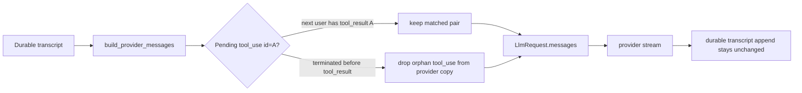

# Rust Parity Audit — Authoritative Synthesis Report

Scope: EphemeralOS Rust port (two workspaces: `agent-core/` and `sandbox/`, joined
by `eos-protocol`) vs Python/docs ground truth (`docs/architecture` +
`backend/src` + materialized pre-cutover Python at `/tmp/oldpy`). This report
synthesizes 25 independently-investigated-and-verified areas. **This audit gates
deletion of `backend/src`.**

Source precedence everywhere: Python ground truth > architecture docs > checklist
wording. Where the independent verifier disagreed with the investigator, this
report **prefers the verifier** and marks the disagreement.

---

## 1. Executive summary

**Two-layer verdict. Per-component fidelity is HIGH; production integration is
INCOMPLETE. `backend/src` deletion is NOT yet safe.**

- **Component fidelity (the dynamics, in isolation) is high and frequently
  byte-exact.** The sandbox storage spine — overlay mount/capture, LayerStack
  lease/snapshot/publish, squash segmentation + deferred GC, OCC commit gate,
  CAS hashing, persistence/state stores — reproduces the Python dynamics
  faithfully, much of it re-derived bilaterally by the verifiers (constants like
  `AUTO_SQUASH_MAX_DEPTH=100`, `MAX_OCC_CAS_RETRIES=3`, batch=64/window=0.002,
  `ceil(1.5×limit)` ceiling, the `present_status` vs `_normalize_status` outcome
  split, the 6-tool terminal enum, the no-inflight gate fail-open tags). Several
  invariants are *stronger* in Rust (build-time no-OCC guard for isolated
  workspaces; atomic JSON-append; CAS-based root-fail; extra bridge peer-isolation
  nft rules).

- **The original Phase-1 integration stubs have been retired in Rust.** The
  advisor gate, root registry seeding, subagent runner, and background finalizer
  are now Rust-native; the live, non-injected `root → delegate → terminal` proof
  is covered by `eos-runtime::tests::root_delegates_waits_and_submits_terminal`.
  Remaining backend-deletion risk is in the later correctness / robustness rows,
  not in a Phase-1 Python fallback.
  1. **Advisor gate runs in Rust instead of a deny-all port stub**: `ask_advisor`
     launches an advisor agent and the terminal gate scans transcript verdict
     state. (advisor D1/D2, tools_framework D1)
  2. **The shipped binary seeds the root registry from `.eos-agents`** so `root`
     resolves without an injected test registry. (request_completion NF1)
  3. **Subagent supervision is now a real Rust background runner**: it validates
     targets, spawns `run_ephemeral_agent`, settles `SubagentRecord`, and drains
     agent-scoped subagents before terminal submission. (subagent D1/D9,
     background_supervisor §4/§5/NF-3)

- **Headline real bugs / missed dynamics (most likely to bite, ranked):**
  1. **Subagent + background-supervisor criticals are closed by the Rust runner and
     split-ledger supervisor**: subagents, workflows, and command sessions now have
     typed records, agent-scoped counts, and `cancel_for_parent_exit` cleanup.
  2. **Advisor pass-before-terminal is no longer a deny-all port stub** — the gate
     scans transcript state and `ask_advisor` is engine-driven in Rust.
  3. **Background command sessions now have the per-request heartbeat and parent-exit
     cancellation path**; remaining command risk is the separate `write_stdin`
     daemon op-name / retry-set mismatch below.
  4. **Provider-message sanitization was missing; fixed in this revision** — Rust now
     sends a provider-safe copy of the durable transcript, so orphaned `tool_use` /
     `tool_result` pairs are dropped before Anthropic validation (HIGH; query_engine
     D2 = model_provider NF1).
  5. **Termination-condition prompt rewrite closed by sign-off** — the requested
     remediation was dropped; Rust keeps the current prompt text as an accepted
     redesign rather than restoring the Python `<Termination Condition>` wrapper.
  6. **Continuation deferred-iteration start-failure compensation is closed** —
     the next iteration is cancelled, its coordinator is deregistered, and the
     workflow fails on first-attempt start failure (workflow_lifecycle D5 =
     deferred_goal_depth inv-1).
  7. **`write_stdin` source-level wire/retry mismatch is closed; live respawn
     proof is still pending** — the client now uses `api.v1.write_stdin` and the
     host fail-closed retry set includes the stdin ops, but the remaining gate is
     a real-`eosd` respawn check that proves stdin is not double-applied
     (sandbox_tools D1/D2 = daemon_protocol D1).
  8. **OCC gitignore routing is fixed at the source level** — routing now uses a
     shared `ignore`-crate-backed matcher over per-dir `.gitignore` files from the
     merged snapshot, with nested / `**` / `!` / slash-sensitive tests (occ D1 +
     verifier N2/N3).
  9. **Per-agent skill scoping is restored** — skill reads are constrained by the
     bound agent's `AgentDefinition.skill`, closing the cross-skill reference leak
     (tools_framework D7).

Several of items 1–3 were the "engine-only / Phase-6/7" migration frontier. The
current checkout crosses that Phase-1 frontier: advisor, subagent, background,
workflow-agent runner, and registry wiring all run through the Rust composition
root, and the non-injected root delegation proof now closes the Phase-1 exit.
Delete `backend/src` only after the later open Phase 2–4 rows are resolved or
explicitly deferred.

---

## 2. Cross-domain disparity table (ranked by severity)

Every high/medium disparity from all 25 area pairs, plus the load-bearing lows.
When the verifier's `independent_status` disagrees with the investigator, the
verifier wins and the disagreement is marked. "Sev" is the final
(verifier-preferred) severity.

| Sev | Domain | Area | Invariant / dynamic | Python anchor | Rust status + anchor | Verifier verdict | Suggested fix |
|---|---|---|---|---|---|---|---|
| CRITICAL | agent-core | subagent | Subagent launched as bg task; result surfaces back | `run_subagent.py:217-251`; `task_supervisor.py:310` | **FIXED:** `BackgroundSupervisorHandle` implements the real `SubagentSupervisorPort`: validates, spawns `run_ephemeral_agent`, stores an `AbortHandle`, and settles `SubagentRecord` on completion. | CLOSED by Rust-only remediation; no Python runner port. | Done. Verified by `eos-engine background::`, `eos-tools model_tools::`, and scoped Clippy. |
| CRITICAL | agent-core | subagent | Phantom `Running` record blocks parent terminal via no-inflight gate | `task_supervisor.py:329-382` settles task; `:217` `uses_sandbox` excludes subagents | **FIXED:** the no-inflight hook drains agent-scoped subagents to zero before terminal/exit, while the split supervisor reports `{ total, subagent, workflow, command_session }`. | CLOSED structurally; live command sessions stay on daemon-authoritative deny/cancel paths. | Done. Verified by `hooks::require_no_inflight_background_tasks` and `eos-engine background::`. |
| CRITICAL | agent-core | subagent | Documented validation gates (recursion / exists / is-subagent) unenforced | `run_subagent.py:125-150` | **FIXED:** `spawn(ctx, …)` enforces recursion, existence, and subagent-type checks against the registry and returns in-band rejection text. | CLOSED; the documented port contract now matches code. | Done. Covered by subagent lifecycle and taxonomy tests. |
| HIGH | agent-core | advisor / tools_framework | Pass verdict required before terminal; decision logic + runner are production stubs | `advisor_approval.py:66-119`; `ask_advisor.py:184-211` | **FIXED:** the `AdvisorPort` stub was deleted; `ask_advisor` is engine-driven and terminal approval is a transcript-scanning hook. | CLOSED by Rust-only remediation; root gating is kept intentionally. | Done. Verified by advisor gate tests plus `eos-tools model_tools::` / scoped Clippy. |
| HIGH | agent-core | advisor / request_completion / tools_framework | Rust gates `submit_root_outcome`; Python does not → root cannot complete under deny-all stub | `submit_root_outcome.py:42` (only `RequireNoInflight`) | **FIXED:** `submit_root_outcome` remains gated, but the gate now has a real Rust advisor path and no deny-all default. | CLOSED as accepted Rust semantics. | Done. Covered by root terminal approval tests in the advisor lane. |
| HIGH | agent-core | query_engine / terminal_tools / background_supervisor | Background supervisor lifecycle unwired in the query loop (create / drain / parent-exit cancel / hard-exit cleanup) | `loop.py:113-116,238-241,305-307,313-315,329-331` | **FIXED:** runtime creates one `BackgroundSupervisorHandle`, command completions drain via the per-request heartbeat, and `finalize_background_for_agent` / `RequestEntryHandle` call `cancel_for_parent_exit` for `ToolStop`, `TerminalNotSubmitted`, errors, join, and shutdown. | CLOSED by Rust-only split-ledger supervisor; the old `terminate_for_parent_exit` helper is gone. | Done. Verified by `cargo check -p eos-engine -p eos-tools -p eos-runtime`, `eos-engine background::`, `eos-tools model_tools::`, `hooks::require_no_inflight_background_tasks`, and scoped Clippy. |
| HIGH | agent-core | query_engine / model_provider | Provider-message sanitization missing (`build_provider_messages`/`sanitize_tool_sequence`) | `request.py:29`; `provider_history.py:20-39` | FIXED in this revision: `query/provider_messages.rs` builds a provider-safe copy; `request.rs:25-30` routes `build_query_run_request` through it; `loop_.rs` records prompt reports from the provider view | CONFIRMED gap, now remediated. Orphaned `tool_use`/`tool_result` pairs are filtered from the provider request without mutating durable history | Done: `build_provider_messages` ports the sanitizer under the clearer `provider_messages.rs` name. Verified with `cargo fmt -p eos-engine`, `cargo test -p eos-engine provider_messages`, and `cargo test -p eos-engine build_request_uses_provider_safe_history` |
| HIGH | agent-core | model_provider | `build_termination_condition_prompt` text fully rewritten (no `<Termination Condition>` wrapper, no one-way-exit WARNING lines) | `runtime_prompt.py:52-61` | `prompt/runtime_prompt.rs:13-27` still emits the Rust prompt text | CLOSED by sign-off: terminal-condition restoration was dropped from active remediation | No code change; leave Rust prompt unchanged as the accepted redesign |
| HIGH | agent-core | workflow_lifecycle / deferred_goal_depth | Continuation (deferred-goal) iteration start-failure compensation | `lifecycle.py:122-147,207-231` (cancel new iter, deregister, close FAILED; `finally` deregister) | **FIXED:** `start_iteration_with_deferred_goal` cancels the new iteration, deregisters the new coordinator, and closes the workflow FAILED after a first-attempt start failure; the old coordinator is deregistered up front. | CLOSED; `continuation_start_failure_compensates` covers the failure path. | Done. |
| HIGH | sandbox | sandbox_tools / daemon_protocol | `write_stdin` source contract and retry-gating | `transport.py:17`; daemon `dispatcher.rs:149-152` | **FIXED source-level:** `ops.rs` maps `DaemonOp::ExecStdin` to `api.v1.write_stdin`; daemon registers `api.v1.write_stdin`. | CLOSED for source contract; residual proof is the live-`eosd` respawn check. | Keep the live respawn test as the remaining Phase 2 proof. |
| HIGH | sandbox | sandbox_tools / daemon_protocol | Host empty-response fail-closed set for stdin writes | `host/daemon_client.py:619-624` | **FIXED source-level:** `daemon_client.rs` fail-closes `api.v1.write_stdin` and `api.v1.command.write_stdin`. | CLOSED for the retry set; residual proof is the same real-daemon replay check. | Verify respawn-during-`write_stdin` does not double-apply. |
| HIGH | sandbox | occ | Gitignore routing DIRECT↔GATED classification | `gitignore.py:36-194` (pathspec, per-dir, dir-seal, `**`, `!`) | **FIXED:** daemon routing uses the shared `ignore`-crate-backed matcher over per-dir `.gitignore` files from the merged snapshot. | CLOSED by parity tests for nested rules, `**`, `!`, dir-seal, metrics-vs-route, and slash-sensitive matching. | Done. |
| HIGH | agent-core | tools_framework | Per-agent skill scoping | `tools/skills/_factory.py:40-88` (`allowed_slugs=[skill_slug]`) | **FIXED:** `CallerScope.skill_slug` constrains `LoadSkillReference` to the bound agent's skill. | CLOSED; cross-skill reference leaks are rejected. | Done. |
| HIGH | sandbox | plugins | Rust plugin facade landed; native runtime payload/ensure path still missing | `host_dispatch.py:77-225`; `install.py:155-468` | **PARTIAL FIX:** `ToolKey` accepts dynamic `lsp.*` names; `eos-runtime/src/plugin_tools.rs` registers catalog tools; `tool_api/plugin.rs` + `SandboxTransport::call_dynamic` route `plugin.<plugin>.<op>` through the Rust daemon. No Python `call_plugin`/`install.py` port. | CONFIRMED residual high: the Node/Pyright plugin payload and trust/ensure path are still not proven in production; an untrusted `setup.sh` must remain refused. | Implement a Rust-native runtime artifact/manifest ensure path for the Node/Pyright PPC server; do not port Python install glue except for native Python plugin servers. |
| MEDIUM | agent-core | tools_framework | Inner pipeline ORDER inverted: Rust pre-hooks on raw JSON then parse; Python parse then hooks on validated model | `tool_call.py:157,163,187` | **DOCUMENTED seam:** the pipeline intentionally runs pre-hooks on raw input and parses inside the executor body; hooked fields are required today. | CLOSED as document-the-seam path with `pre_hook_denies_before_parse`. | Restore parse-before-hooks only if a future hook reads defaulted fields. |
| MEDIUM | agent-core | tools_framework | Post-hook execution stage dropped (result replacement + re-validation seam) | `hook_pipeline.py:110-188` | `execution.rs:7-9` "post-hook stage is dropped"; `Hook` enum pre-only | CONFIRMED (no current behavior change — no wired post_hooks; capability gap) | Record as known capability gap; restore the seam if ever needed |
| MEDIUM | agent-core | deferred_goal_depth / tools_framework | Nested-planner-deferral hook is fail-OPEN (Python fail-CLOSED) and not wired into a live planner path | `disallow_nested_planner_deferral.py:38-50` | `hooks.rs:614-616` returns `pass()` when `workflow_id`/`workflow_control` absent; both `None` for workflow agents (Phase-6) | CONFIRMED high (deferred_goal_depth D1); tools_framework D3 rates low. The only mechanism bounding nesting | Make the hook fail-CLOSED; populate `workflow_control` for planner contexts OR enforce in `apply_plan_submission` |
| MEDIUM | sandbox | squash / daemon_protocol | Auto-squash audit reduced to one `squash_completed` event reason `auto_squash`; drops `squash_triggered`/`squash_failed` + `post_publish_depth` | `layer_stack_runtime.py:248-290`; `maintenance.py:63-93` | **FIXED:** `dispatcher.rs:3285-3341` emits `squash_triggered` then `squash_completed`/`squash_failed` from `layer_stack.auto_squash.*` timing keys, uses `post_publish_depth`, and attaches `manifest_root_hash` when the active manifest version matches the squash result. | CLOSED by Rust-only remediation: no protocol fields, no new files, no Python-shaped maintenance result class, and no `occ.maintenance.*` compatibility flags. | Done. Verified with `cargo test -p eos-daemon auto_squash_audit --lib`, full `cargo test -p eos-daemon`, and `cargo clippy -p eos-occ -p eos-daemon --all-targets -- -D warnings`. |
| MEDIUM | sandbox | plugins | Manifest identifier validator diverges from `_PLUGIN_NAME_RE` (accepts `my-plugin`, rejects op-names Python accepts) | `op_registry.py:78,109` | manifest path uses `validate_identifier` (`service.rs:127-148`); faithful `is_valid_plugin_name` unused | CONFIRMED medium; verifier: no-manifest path `validate_public_identifier` IS faithful — only manifest path diverges | Validate `plugin_id` with `^[A-Za-z_][A-Za-z0-9_]*$`; relax `op_name` to non-empty |
| MEDIUM | sandbox | plugins | Auto-overlay WRITE trigger has no producer; Python auto-selected the overlay write path by intent | `op_registry.py:230-235` | `dispatch_oneshot_overlay_route` requires `service_mode==OneshotOverlay`; only test producer (`mod.rs:1413,1799`) | verifier NF-1 elevates investigator "info" → HIGH-adjacent; dormant today (no prod plugin) | When the host facade lands, emit `oneshot_overlay` for WRITE_ALLOWED+auto-overlay ops, or add a default-overlay fallback |
| MEDIUM | sandbox | perf | `acquire_snapshot` takes the exclusive storage-writer lock; Python used a lighter process-local lock | `stack.py:108-135` (`self._lock` RLock only) | `stack.rs:343-344` `writer_lock.exclusive()` — same mutex as publish/squash/release | CONFIRMED medium; verifier stress-tested: daemon is fresh-`LayerStack`-per-request so the per-root `ReentrantMutex` is the real serializer → contention NOT moot | Add a shared/read lock mode for snapshot, or revert to a process-local lock; re-baseline throughput |
| MEDIUM | sandbox | overlay | Remount/teardown uses a single lazy umount, no peel-loop → can leak stacked mounts across bundle upgrades | `kernel_mount.py:97-121` (64× peel-loop) | `eosd/main.rs:504` `unmount_overlay(.., true)` → single `MNT_DETACH` (`kernel_mount.rs:149-157`) | CONFIRMED medium; verifier: Drop path keeps the loop — divergence isolated to the remount caller | Give `unmount_overlay` a peel-loop (loop ≤64, plain umount, lazy fallback, stop at non-mountpoint) |
| MEDIUM | agent-core | attempt_harness | Production `RuntimeAgentRunner` terminal capture / harness completion | `dispatch.py` drives harness end-to-end | **FIXED:** `RuntimeAgentRunner` wires the recording plan-submission port; `root_delegates_waits_and_submits_terminal` proves root delegation through workflow completion and terminal submission. | CLOSED by Phase 1 proof. | Done. |
| MEDIUM | agent-core | attempt_harness | Workflow task lifecycle diagnostics (`workflow.task.ready/launched/failed`) | `run_stage.py:123-153` | **FIXED as diagnostics:** `AttemptStageAdvancer` emits `workflow.task.ready` / `launched` / `failed` trace rows under `eos_workflow::diagnostics`; no attempt `audit_sink` field is retained. | CLOSED as observability-only diagnostics; correctness remains state/transcript-proven. | Done. |
| MEDIUM | sandbox | provider_network | Docker provider seam unit-tested but not seeded into the production composition root | n/a | `app_state.rs:444` builds `ProviderRegistry::new()`; no production `set_default` | verifier NF-2 (new; reachability gap, corollary of mid-migration HEAD). Not a parity break of the ported units | Add the composition-root seed when wiring lands; revisit D1 (dropped first-call-wins sentinel) then |
| MEDIUM | agent-core | workflow_lifecycle | `delegate_workflow` "already outstanding" error flag | `delegate_workflow.py:67-81` (`is_error=True`) | **FIXED:** the outstanding branch returns `ToolResult::error(payload)`. | CLOSED by `delegate_workflow_outstanding_is_error`. | Done. |
| MEDIUM | sandbox | overlay / occ | Overlay write conversion re-reads bytes into memory + drops the precomputed hash | `overlay_change_conversion.py:32-46` (threads `content_path`+hash) | `path_change.rs:118-124` `fs::read` → `LayerChange::Write{content}` | overlay verifier ADJUSTED medium→low (correctness-equivalent; perf/double-read). occ D4 low | Thread `content_path`+`final_hash` to the OCC stager (reflink), or at least reuse the computed hash |
| MEDIUM→LOW | agent-core | model_provider | `next_seq` off-by-one: Rust first seq=0 vs Python first seq=1 | `prompt_report_recorder.py:33-35` | `prompt_report.rs:90-95` | verifier ADJUSTED medium→LOW (golden seq 1/2/3 is hand-authored, matches neither live impl; no consumer keys on it) | Optional: pre-increment to match Python; regenerate the golden |
| LOW | sandbox | ephemeral_workspace | Overlay-capture OCC `atomic` hardcoded `true` (Python `len(distinct_paths)>1`) | `workspace_publish.py:214-221` | `dispatcher.rs:1771` hardcodes `true` | **verifier REFUTED** investigator HIGH "silent-success on lost race": race-loser surfaces `aborted_version` on both sides; only delta is a benign batching nuance → LOW. NOT a headline risk | Optional: derive `atomic` like Python; no correctness fix |
| LOW | sandbox | ephemeral_workspace | Command-session prepare-error path leaks the overlay run_dir (no RAII cleanup) | `lifecycle.py:100-103` | `prepare_command_session` has no `RunDirCleanup` (`command.rs:867`) | CONFIRMED; verifier downgraded medium→LOW (lease released; leak is an empty scratch dir on a rare path) | `let _cleanup = RunDirCleanup(dirs.run_dir.clone());` after allocation |
| LOW | sandbox | isolated_workspace | Daemon exit-drain / per-agent dispatch quiesce (`exit_pending`/`begin_exit_drain`) absent | `_control_plane/workspace_handle_lifecycle.py:207-253` | re-expressed as `active_command_sessions` gate (`isolated.rs:407-434`) | **verifier REFUTED** investigator MEDIUM → none: those symbols belong to DELETED control-plane; the live in-tree host lifecycle has no such drain either. NOT a headline risk | None (no divergence from live ground truth) |
| LOW | sandbox | isolated_workspace | `RequireNoInflightBackgroundTasks` prehook allegedly not wired on isolated tools | `enter/exit definition.py:34` | `meta.rs:65-67` | **verifier REFUTED** investigator MEDIUM → none (false alarm): hook IS wired on both Enter+Exit. NOT a headline risk | None |
| LOW | sandbox | isolated_workspace | `isolated_workspace.sampled` sampler loop unimplemented; startup orphan reaper lacks `/proc` ns-holder scan | `pipeline.py:246-294`; `orphan_reaper.py:257-310` | no sampler in `eos-isolated/src`; persisted-row reap only (`session.rs:687-703`) | CONFIRMED low (observability / partial GC; mitigated by in-process holder tracking) | Add sampler tick; add `/proc` marker scan |
| LOW | agent-core | attempt_harness | Generator-capability role gate dropped; reducer↔reducer duplicate-id slips through | `_schemas.py:136-167`; `plan_dag.py:47-55` | existence-only `agent_registry.get` (`orchestrator.rs:224-229`); Vec push duplicates (`orchestrator.rs:262`) | verifier ADJUSTED investigator D1 medium→LOW: gen/red-collision headline is a FALSE ALARM (caught by lane-shape+dangling checks); only reducer↔reducer dup survives | Require `AgentRole::Generator`; union-dedup `tasks` ∪ `reducers` |
| LOW | sandbox | layerstack | `validate_workspace_binding_paths` raw `starts_with`, no symlink resolution | `workspace_binding.py:122-130` | `workspace_base.rs:394` raw prefix | CONFIRMED low (paths daemon-controlled) | Resolve symlinks before the inside-workspace check |
| LOW | sandbox | overlay | Symlink-to-existing-directory captured by Rust, dropped by Python | `capture.py:80-88` | `path_change.rs:181-188` emits Symlink | CONFIRMED low edge case (Rust arguably more correct; still a behavior change) | Decide intended semantics |
| LOW | sandbox | provider_network | First-call-wins provider sentinel dropped; Daytona is a hard parse error in Rust | `bootstrap.py:40-53`; `sandbox.py:41` | `registry.rs:72-74`; `sandbox.rs:108-114` | CONFIRMED low/intentional (Docker-only); sentinel presently moot (no production seed, NF-2) | `OnceCell`/debug-assert single-seed; targeted "daytona unsupported" message |
| LOW | agent-core | workflow_lifecycle / deferred_goal_depth | `is_nested_workflow` single-hop check vs full ancestry walk + cycle guard | `workflow_depth.py:10-49` | `ports.rs:228-236` | CONFIRMED low (boolean equivalent for well-formed trees; loses cycle detection) | Document the single-hop simplification, or port the walk |
| LOW | agent-core | context_engine | `<terminal_tool_selection>` block format diverges (colon rows + extra "Pick exactly one" header) | `registry.py:120` + `skill_message.py:30-33` | `composer.rs:172-184` | verifier CONFIRMED MEDIUM (kept): live prompt bytes diverge every workflow launch; ported from a stale docstring, not intended wire shape | Mirror `render_terminal_catalog` (backtick rows, `\n\n`, no header) |
| LOW | sandbox | sandbox_tools | `api.exec_command.dispatch_total_s` timing dropped; grep/glob primitive semantics unpinned | `command.py:60-61` | no `dispatch_total` in agent-core; `tool_primitives.rs:233-248` | verifier upgraded Q1 → confirmed LOW (N1); grep/glob divergence-without-anchor | Record dispatch-total timing; pin grep/glob wire contract in the arch doc |
| LOW | sandbox | daemon_protocol | `cancel` skips bounded 5s cleanup-wait (`cleanup_done` inverted); `internal_error` lacks uuid; `runtime.*` timings stubbed 0.0 | `builtin_operations.py:182-198`; `dispatcher.py:122-131,198-212` | `dispatcher.rs:300-317,234-243,3089-3106` | CONFIRMED low (no field consumer; `canonical.rs` drops `timings` before compare) | Mirror Python if a consumer appears; add `error_id` |
| LOW | agent-core | model_provider | Neutral `Reasoning` block serializes `type:"reasoning"` not `"thinking"`; empty tool_use id fails stream | `message.py:30-34,189-190` | `message.rs:62-67`; `anthropic.rs:218-227` | CONFIRMED low (documented GC rename uncaught by golden; providers always send ids). Persistence-visible: Rust→Python read-compat for reasoning blocks breaks (persistence NF-2) | Add a reasoning-block golden row; mint a default id |
| LOW | agent-core | terminal_tools / query_engine / budget_notifications | `terminal_not_submitted` failure message drops structured counts | `loop.py:50-57` | `loop_.rs:31-37` | CONFIRMED low across three areas (event shape matches; only prose differs) | Render the Python format if string parity wanted |
| LOW | agent-core | budget_notifications | Profile `notification_triggers` never merged (planner loses `nested_planner_deferral_disabled` reminder) | `factory.py:382-387` | `factory.rs:144` hardcodes defaults | CONFIRMED low (only planner populates the field); D3 placement REFUTED to none | Thread `agent.notification_triggers` into `build_query_context`, dedupe by name |
| LOW | agent-core | persistence_state | Empty-`task_id` outcome record silently dropped on attempt/workflow parse path | `outcomes.py:200-225` (always emits) | `rows.rs:198` `parse().ok()?` drops on empty `TaskId` | CONFIRMED low (first-party writer never emits empty id; reachable only for legacy/corrupt rows) | Document the drop, or surface a loud error |
| LOW(cov) | agent-core | persistence_state | Live migration `0001_initial.sql` never diffed against canonical schema; message snapshot is self-referential | `parity/sqlite/schema.sql` | test greps only the capture (`sqlite_schema.rs:16-55`); `schema_snapshots.rs:20-35` pins fixture-vs-itself | CONFIRMED low/medium coverage hole (runtime equivalent via SQLite affinity); NF-1 no live Rust Message type | Add a `PRAGMA table_info` introspection test against the executed migration |
| LOW | sandbox | squash | `eos-occ::AutoSquashMaintenancePolicy` dead code; doc over-claims a `_squash_lock`+re-read it doesn't implement | `maintenance.py:44-95` | **FIXED:** the dead `MaintenancePolicy`, `LayerSquashPort`, `AutoSquashMaintenancePolicy`, and duplicate `eos-occ::AUTO_SQUASH_MAX_DEPTH` export were deleted; live auto-squash remains daemon-owned. | CLOSED by deletion; no Rust public call sites existed. | Done. Verified with `cargo test -p eos-occ` and scoped Clippy. |

Refuted-and-dropped (listed above only where a residual low remains; explicitly
NOT headline risks): ephemeral_workspace D1 silent-success → benign batching nuance;
isolated_workspace D1/D2 → belong to deleted control-plane / wired in `meta.rs`;
model_provider D2/D3/D4 → false alarms (no Python ground truth: `OpenAiClient` is a
generic client, not Codex); attempt_harness D1 headline → caught by other checks.

---

## 3. Per-domain detail

### Sandbox

**Faithful spine (confirmed, several bilaterally re-derived):** overlay mount op
order + fd-pinned lowerdirs + `/eos/mount` + whiteout/opaque detection
(`kernel_mount.rs`, `path_change.rs`); LayerStack lease dual-set, atomic
publish/CAS/digest-after-rename, manifest newest-first, `commit_to_workspace`
lease guard (`stack.rs`, `lease.rs`, `cas.rs`); squash segment-around-lease-heads +
deferred GC + dual `<=`/`min_reduction` guards (`squash.rs`); OCC gate mechanism,
queue serialization, CAS retries=3, batch=64/window=0.002 (`commit_queue.rs`,
`dispatcher.rs`); daemon wire envelope, 16 MiB cap, 30s read timeout, thin-client
97/98, connect-retry delays, register_op collision, auth pop (`eos-protocol`,
`server.rs`, `dispatcher.rs`); isolated-workspace constants byte-exact + build-time
no-OCC guard; provider Docker caps/tmpfs/daemon-TCP + ns-holder/setns/fresh-ns
sequencing (Linux-source-only, runtime-unverified on darwin).

**Confirmed bugs / missing dynamics (file:line both sides in §2):**
- write_stdin op-name + fail-closed set (`tool_api/command.rs:74` /
  `eos-sandbox-host/.../daemon_client.rs:582-592` vs `transport.py:17` /
  `host/daemon_client.py:619-624`; daemon `dispatcher.rs:149-152`). HIGH×2.
- OCC gitignore hand-rolled matcher (`dispatcher.rs:1731-1746,2379-2417` vs
  `gitignore.py:36-194`). HIGH; over-match (`*` crossing `/`) is data-loss-class
  against invariant #3 (verifier N3).
- Plugin host orchestration + install/setup-trust gate unported
  (`host_dispatch.py`/`install.py` → ABSENT). HIGH.
- Overlay remount single lazy umount (`eosd/main.rs:504`,
  `kernel_mount.rs:149-157` vs `kernel_mount.py:97-121`). MEDIUM.
- `acquire_snapshot` exclusive lock concurrency regression (`stack.rs:343-344` vs
  `stack.py:108-135`). MEDIUM.
- Squash audit reduced to one event + wrong reason (`dispatcher.rs:3286-3307` vs
  `layer_stack_runtime.py:248-290`). MEDIUM.
- Plugin manifest validator + auto-overlay-write-trigger producer gaps
  (`service.rs:127-148`; `mod.rs:1413`). MEDIUM.

**Intentional / refuted:** the in-sandbox Python runtime was deleted in
`37c13f3db`; many sandbox primitives now have only a wire contract or `/tmp/oldpy`
as truth. Ephemeral persistent-mount subsystem correctly dormant on the dispatch
path. Isolated control-plane drain machinery belongs to deleted code; the live host
lifecycle is faithfully mirrored. Extra Rust nft peer-isolation rules are hardening,
not regression.

### Agent-core

**Faithful spine (confirmed):** query-loop terminal-forced exit (ends only on a
successful terminal stamp, never on text; `ceil(1.5×limit)` ceiling with `>=`;
once-per-id counting); terminal-tool exclusivity + success-only stamping + 6-tool
enum (`dispatch.rs`, `execution.rs`, `terminal.rs`); budget tiers 75/100/125% +
repeating reminder (`notifications.rs`); request→completion boundary
(`submit_root_outcome` sole writer, root Task minted directly, no workflow wrap);
workflow→iteration→attempt creation rules, budget=2, strict `<`, compensation saga
on the *initial* path; attempt PLAN→RUN→CLOSED + reducer exit gate (logic-level);
context-engine role packets + XML render + recipe validation, workflow-only routing
(`engine.rs`, `xml.rs`); persistence 7-table model, OCC flip, `finish_request`
idempotency, atomic `close_succeeded`, outcome-normalization split, store-only
coordination (`rows.rs`, repositories); provider Anthropic SSE decode + retry/backoff
constants + tool_result/system_notification wire shapes (`anthropic.rs`,
`retry.rs`).

**Confirmed bugs / missing dynamics (file:line both sides in §2):**
- Subagent supervisor stub + phantom-Running terminal wedge + unenforced validation
  are now closed by the Rust runner, typed split-ledger supervisor, and
  drain-to-zero terminal gate. CRITICAL → fixed.
- Advisor deny-all stub + root-gating divergence are now closed by the Rust
  engine-driven advisor runner and transcript-scanning terminal hook. HIGH → fixed.
- Background supervisor query-loop wiring is now closed by the per-request
  heartbeat plus `cancel_for_parent_exit` cleanup on `ToolStop`,
  `TerminalNotSubmitted`, errors, join, and shutdown. HIGH → fixed.
- Provider-message sanitization gap closed in this revision (`request.rs:25-30`,
  `query/provider_messages.rs` vs `provider_history.py:20-39`). HIGH.
- Termination-condition prompt restoration dropped by sign-off; Rust keeps the
  current prompt text (`runtime_prompt.rs:13-27` vs `runtime_prompt.py:52-61`).
- Continuation deferred-iteration compensation is closed by
  `start_iteration_with_deferred_goal` (`lifecycle.rs:164-205` vs
  `lifecycle.py:122-147,207-231`). HIGH → fixed.
- Per-agent skill scoping is restored (`CallerScope.skill_slug` +
  `LoadSkillReference` allowlist vs `_factory.py:40-88`). HIGH → fixed.
- Tools-framework pipeline-order divergence is documented and pinned by
  `pre_hook_denies_before_parse` (`execution.rs:48,65` vs
  `tool_call.py:157,163,187`). MEDIUM → accepted seam.
- Nested-planner-deferral hook fail-OPEN + unwired (`hooks.rs:614-616` vs
  `disallow_nested_planner_deferral.py:38-50`). MEDIUM.
- `RuntimeAgentRunner` terminal capture / recording harness is live and proven by
  `root_delegates_waits_and_submits_terminal`. MEDIUM/Phase-7 → fixed.
- `delegate_workflow` outstanding branch now returns `is_error=true`. MEDIUM →
  fixed.
- The shipped binary seeds the root registry from `.eos-agents`. MEDIUM
  (shipped) → fixed.

**Intentional / structural:** root `outcomes[]` row relocated into
`terminal_tool_result` (no `Root` ExecutionRole variant — data relocated, not lost);
OAuth/coding-plan provider axis dropped (GC-llm-client-04); `OpenaiClient` is a new
generic client with no Python source (so its Codex-comparison disparities are false
alarms); CAS-based `fail_unfinished_root` is stricter than Python.

---

## 4. Cross-cutting invariants — reconciled

| Invariant | Single source of truth | Final status |
|---|---|---|
| **advisor-pass-before-terminal** (advisor) | `advisor_approval.py` (Python gates planner/generator/reducer only) | **CLOSED by Rust redesign.** The old `AdvisorPort` decision stub is deleted; `ask_advisor` runs an advisor agent and the terminal hook scans transcript verdict state. Rust still gates `submit_root_outcome` intentionally. |
| **no-terminal-while-background-running** (background_supervisor) | `require_no_inflight_background_tasks.py` + `task_supervisor.count_by_agent` | **CLOSED for the Phase-1 background kinds.** The hook drains agent-scoped subagents before terminal/exit, denies outstanding delegated workflows via persisted workflow state, and leaves live command sessions on daemon-authoritative deny/cancel semantics. The supervisor's split report includes `subagent`, `workflow`, and `command_session`. |
| **workflow depth ≤ 2 + planner@depth-2-cannot-defer** (deferred_goal_depth) | `starter.py`/`delegate_workflow.py` (no depth cap) + `disallow_nested_planner_deferral.py` | **No hard depth cap in EITHER impl** — the "cap" is emergent from the no-nested-defer rule (a nested generator can still delegate to depth 3+). Checklist wording is inaccurate vs ground truth. The enforcing rule (planner@depth-2 cannot defer) is present as a hook but is **fail-OPEN** in Rust (Python fail-CLOSED) and **not wired into a live planner path** (`workflow_control:None`). HIGH (deferred_goal_depth D1): the only mechanism bounding nesting is currently unreachable + fail-open. |
| **isolated-workspace-never-OCC-merged** (isolated_workspace) | `eos-isolated/Cargo.toml` (no `eos-occ` dependency) | **MATCH, and STRONGER than Python.** Enforced by the type system / dependency graph: the crate has no publish method to call; isolated file/exec stamps `"published": false`. The strongest possible form of the invariant. Clean. |
| **terminal-tool-called-alone** (terminal_tools) | `engine/tool_call/dispatch.py::_validate_tool_batch` | **MATCH (byte-exact).** `reject_terminal_batch` (`dispatch.rs:63-103`) rejects every call in a batch containing a terminal with the byte-identical message; none execute; success-only stamping confirmed; production `is_terminal` wiring verified (not just test-built tools). Clean. |
| **ephemeral upperdir→OCC merge & discard** (ephemeral_workspace + occ) | `ephemeral_workspace/pipeline.py` + `occ/commit_transaction.py` | **MATCH.** Per-call fresh overlay, upperdir captured and published through the shared OCC writer, lease released and run_dir discarded; verifier chased "writes land in upperdir" into the ns-runner and confirmed. Two caveats, both downgraded: the `atomic` flag is hardcoded `true` (verifier REFUTED the silent-success claim → benign batching nuance), and the prepare-error path can leak an empty run_dir (LOW). The OCC merge gate itself is faithful; its routing depends on the (divergent) gitignore oracle — see occ N3. |

Also reconciled: **context_engine D4** (possible success↔failed flip from
missing-status normalization) deferred itself "to the eos-db/eos-state audit."
That audit is **persistence_state invariant 2e**, which **confirms** the
`present_status`(done→success) vs `_normalize_status`(done→failed) split is
correctly reproduced (`rows.rs:170-235`). **D4 CLOSES → MATCH**; not carried
forward as an open item.

---

## 5. Coverage matrix (area × final verdict)

| Area | Domain | Final verdict | Notes / unproven flags |
|---|---|---|---|
| overlay | sandbox | High fidelity; 1 MEDIUM (remount peel-loop), lows | **unproven:** D4 path-char policy (`validate_overlay_path_text` not materialized) |
| layerstack | sandbox | High fidelity; all invariants confirmed_match | 1 LOW (symlink resolution in binding-path validation) |
| squash | sandbox | Core algorithm faithful; audit D3 FIXED; lows remain | dead `AutoSquashMaintenancePolicy` deleted; shell pre-mount squash remains a low/deferrable delta |
| occ | sandbox | Gate mechanism faithful; HIGH gitignore routing **FIXED** (Phase 2) | ~~unproven: no Rust parity test~~ — nested/`**`/dir-only/`!`/seal/`*`-slash now covered by 7 `dispatcher.rs` parity tests |
| ephemeral_workspace | sandbox | High fidelity; investigator HIGH REFUTED → lows | atomic-flag silent-success refuted; run_dir leak LOW |
| isolated_workspace | sandbox | High fidelity; both MEDIUMs REFUTED → none; lows | sampler/orphan-reaper lows |
| sandbox_tools | sandbox | 9 match / 2 disparity (HIGH write_stdin) / 1 unproven | **unproven:** C6 glob/file-byte constants; grep/glob semantics divergence-without-anchor |
| daemon_protocol | sandbox | Faithful; 1 HIGH (fail-closed set = write_stdin), lows | accurate, well-anchored |
| plugins | sandbox | Mechanism partly landed; residual HIGH runtime payload/ensure + auto-overlay, MEDIUMs | Rust model-facing facade is wired; native Node/Pyright payload and setup-trust proof remain open |
| provider_network | sandbox | Units faithful; NF-2 wiring gap MEDIUM, lows | **unproven (Linux):** ns-holder/setns/fresh-ns/nft runtime behavior (source-only on darwin) |
| perf | sandbox | Complexity properties match; 1 MEDIUM (snapshot lock) | **unproven:** D1 space-property not benchmarked (shared gap); shell-pre-mount squash absent |
| query_engine | agent-core | Terminal-exit faithful; 2 HIGH (bg supervisor, sanitization) | bg-supervisor + sanitization confirmed by verifier |
| budget_notifications | agent-core | All 5 invariants match; D3 placement REFUTED; lows | profile-trigger merge LOW |
| terminal_tools | agent-core | Core contract faithful; D2 bg-drain MEDIUM, D3 REFUTED | clean terminal mechanism |
| workflow_lifecycle | agent-core | Creation rules faithful; 1 HIGH (continuation compensation) | D5 = deferred_goal_depth inv-1 |
| attempt_harness | agent-core | Harness logic faithful; D5 production-drivability HIGH | D1 headline REFUTED→low; D8 audit MEDIUM. Prior clean-sheet verify pass superseded — current substantive pass (D1–D8) used |
| deferred_goal_depth | agent-core | 0 match / 3 disparity / 1 investigator_missed | inv-1 continuation-compensation = workflow_lifecycle D5 (HIGH); D1 hook fail-open HIGH |
| context_engine | agent-core | 4/4 invariants match; D1 prompt-block MEDIUM | D4 CLOSED by persistence_state 2e |
| advisor | agent-core | Phase-1 HIGH closed by Rust engine-driven advisor | root gate kept intentionally; transcript-scanning hook replaces the stubbed port |
| subagent | agent-core | Phase-1 CRITICAL closed by Rust subagent runner | validation, spawn, settle, progress/cancel taxonomy, audit, and drain-to-zero landed |
| background_supervisor | agent-core | Phase-1 HIGH closed by split-ledger supervisor | typed subagent/workflow/command ledgers, heartbeat, and `cancel_for_parent_exit` landed |
| request_completion | agent-core | NF1 shipped-binary empty registry closed | `.eos-agents` registry seeding resolves `root`; broad non-injected E2E remains the deletion gate |
| model_provider_prompt | agent-core | Anthropic faithful; NF1 sanitization FIXED; D1 prompt dropped by sign-off | **unproven:** whole `OpenaiClient` (no Python source — Codex comparison refuted); D7 seq LOW |
| tools_framework | agent-core | 12 match / 7 disparity + NF1 investigator_missed | D1 advisor + D7 skills HIGH; NF1 pipeline-order MEDIUM |
| persistence_state | agent-core | High fidelity; 2 LOW disparities, tests green | NF-1 message snapshot self-referential; D2 migration-never-diffed coverage hole |

**Manual-follow-up gaps (unproven — cannot be settled from available sources):**
1. `validate_overlay_path_text` rule set (overlay D4) — module not materialized.
2. Plugin refresh dynamics (plugins inv-6) — LSP runtime Python not materialized;
   the Rust 7-step handshake is a fresh design, unverifiable as a port.
3. ~~OCC nested/`**`/dir-only gitignore behavior (occ) — no Rust parity test.~~
   **Closed (Phase 2):** the matcher now uses the `ignore` crate over per-dir
   snapshot reads; nested/`**`/dir-only/`!`/seal/`*`-not-crossing-`/` are covered
   by 7 in-process `dispatcher.rs` parity tests.
4. Linux-only ns-holder/setns/fresh-ns/nft runtime behavior (provider_network) —
   source-only on darwin; needs a Linux integration run.
5. `OpenaiClient` correctness (model_provider) — net-new generic client, no Python
   ground truth; needs real OpenAI-Responses-API validation, not Codex parity.
6. sandbox_tools C6 glob/file constants + grep/glob primitive semantics —
   divergence-without-anchor (Python primitive deleted); pin in the arch doc.
7. Space-complexity property is unbenchmarked on both sides (perf D1, shared gap).

**Checklist-vs-code disagreements (flagged per mandate):**
- **OCC "outside-workspace direct merge" is NOT an OCC route** (occ E1/N1):
  neither side has an "outside-workspace" branch; both reject absolute/`..` paths,
  so such a path cannot become a changeset. DIRECT = gitignored-only. The checklist
  phrase describes a higher-layer dispatch bypass, not the OCC DIRECT route.
- **"Cap at depth 2" is not a hard rule** (deferred_goal_depth D2): no depth
  comparison in either `starter`; the cap is emergent from the no-nested-defer rule.
- **"Root AND workflow agents gated by advisor"** (advisor inv-1): matches Rust,
  NOT Python ground truth (Python omits root). Counted as a divergence from truth.

---

## 6. Prioritized recommended fixes + suggested tests

**P0 — production-blocking integration (must land before `backend/src` deletion):**
1. **Done:** the advisor port stub was removed. `ask_advisor` launches a Rust
   advisor agent and terminal approval scans transcript state.
2. **Done:** the subagent runner is Rust-native, validates the target, spawns
   `run_ephemeral_agent`, settles `SubagentRecord`, and drains agent-scoped
   subagents before terminal submission.
3. **Done:** the background supervisor is wired through the query/runtime loop:
   command completions drain through the heartbeat and `cancel_for_parent_exit`
   covers `ToolStop`, `TerminalNotSubmitted`, errors, request join, and shutdown.
4. **Done:** the shipped binary seeds the root registry from `.eos-agents`.
5. **Done:** broad non-injected `root → delegate → terminal` E2E is now covered by
   `cargo test -p eos-runtime root_delegates_waits_and_submits_terminal`.

**P1 — correctness bugs (data-loss / API-failure class):**
5. **Done source-level; live proof still required:** `write_stdin` op-name AND the
   fail-closed retry set have both landed (sandbox_tools D1/D2, daemon_protocol
   D1). *Remaining test:* integration against the real `eosd` binary (not a
   mocked `DaemonOp::ExecStdin`); a respawn-during-write_stdin must not
   double-apply.
6. **Replace the OCC gitignore matcher** with the `ignore`/`gitignore` crate reading
   per-directory `.gitignore` from the snapshot (occ D1, N2, N3). *Test:* nested
   `.gitignore`, dir-only `node_modules/`, `**`, `!`, and `*`-not-crossing-`/`; assert
   `logs/*.log` routes GATED (not DIRECT-then-clobber).
7. **Provider-message sanitization landed** (`sanitize_tool_sequence`) before every
   request (query_engine D2 / model_provider NF1). `build_query_run_request` now
   sends the sanitized provider copy, not the raw durable transcript. *Test:* a
   transcript with an orphaned `tool_use` produces a sanitized request, not a 400.
8. **Add continuation-iteration compensation** (workflow_lifecycle D5,
   deferred_goal_depth inv-1): unconditional old-iter deregister; on
   `create_and_start_first_attempt` failure cancel the new iteration + deregister +
   `close_workflow(false)`. *Test:* inject a planner-launch failure on a deferred
   handoff; assert the workflow closes FAILED and no coordinator leaks.
9. **Termination-condition prompt remediation dropped by sign-off** (model_provider
   D1). No active code change; Rust keeps the current prompt text instead of
   restoring the Python `<Termination Condition>` block.
10. **Scope `load_skill_reference` per-agent** (tools_framework D7). *Test:* agent A
    cannot read agent B's skill references; not-found error lists only A's skill.
11. **Make the nested-planner-deferral hook fail-CLOSED + wire it** (deferred_goal_depth
    D1) or enforce nesting in `apply_plan_submission`. *Test:* a nested planner with a
    deferred goal is rejected.

**P2 — robustness / parity hardening:**
12. Overlay remount peel-loop (overlay D1); reconsider `acquire_snapshot` lock mode
    (perf D2); plugin runtime payload/ensure + manifest validator/setup-trust
    verification (plugins D1/D6).

**P3 — observability / telemetry parity (no control-flow impact):**
13. Squash audit D3 is fixed; remaining P3 items are workflow
    `task.*` audit events (attempt_harness D8); plugin `8 MiB` response cap +
    caller-field caps (plugins D7); `dispatch_total_s` timing (sandbox_tools N1);
    `internal_error` uuid + `runtime.*` timings (daemon_protocol); prompt-report seq
    + reasoning-block golden row (model_provider D5/D7); migration-vs-canonical schema
    introspection test + FK-CASCADE test (persistence_state D2).

**Phase 2 `model_provider_prompt` implementation note (this revision):**



| Surface | Before | After | Key highlight |
|---|---|---|---|
| Provider request | `request.rs` sent `messages.to_vec()` directly | `request.rs` calls `build_provider_messages(messages)` | Provider sees only matched tool-use/result pairs |
| Prompt report | Recorded raw `messages` | Records `run_request.request.messages` | Report matches the exact provider-facing transcript |
| Durable transcript | Needed to carry all local state | Still unchanged | Sanitization is a projection, not state mutation |
| Termination prompt | Proposed Python literal restore | Dropped by sign-off | No `<Termination Condition>` wrapper change is made |

Resulting structure:

```text
agent-core/crates/eos-engine/src/query/
  mod.rs
  request.rs
  loop_.rs
  provider_messages.rs
```

Class and field impact: no new public class/type and no persisted field. The only
new API is crate-private `build_provider_messages(messages: &[Message]) ->
Vec<Message>`. Blast radius is limited to query request construction, prompt-report
recording, and unit tests in `eos-engine`; provider clients and durable message
storage are untouched.

---

## 7. Phase rollout plan & progress tracker

The §6 fixes, **grouped by area first** (the report's own domain / area vocabulary —
each links to its `areas/*.html` page), then batched into **phases where every area
in a phase is independent and can be worked in parallel**. Phase ordering follows
real cross-area dependencies, **not** severity.

**Dependency model.** There is exactly **one hard sequential edge**: the Phase 1
*integration seams* must land before any later area can be exercised in a live,
non-injected `root → delegate → terminal` run (exec-summary §1 — also the gate for
deleting `backend/src`). That edge is on **integrated / e2e verification**, not on
code: a Phase 2–4 area's fix can still be written and unit-tested independently.
**Phases 2–4 have no hard edges between them** — they are parallel batches grouped by
focus (correctness → sandbox robustness → tails); run them concurrently or in the
shown order by team bandwidth. Two area pairs are **coupled** (one subsystem,
co-developed in a single lane): `subagent ⊕ query_engine` (background supervisor +
no-inflight gate) and `sandbox_tools ⊕ daemon_protocol` (the `write_stdin` op-name
end-to-end).

**Placement rule.** Each area sits in the phase of its **most-blocking** fix and
carries all of its fixes; a lower-severity item (see **Sev**) inside an
earlier-phase area is tagged *(deferrable)* and may slip to a later wave without
moving the area.

**How to track:** a fix is open `☐` or done `☑`. Progress lives in source — flip the
glyph in `REPORT.md` and regenerate (`python3 _md2html.py REPORT.md`); the git
history is the audit trail. (`REPORT.html` is generated — do not hand-edit it.)
**Sev** is the verifier-preferred severity from §2; **Disparity · anchor** points
back to the §2 row and the Rust `file:line`. Items not explicitly ranked in §6 are
marked **(Derived)**.

> **Landed remediation tracks (forward-design, tracked separately).** Some
> remediation runs as standalone design docs alongside this report
> (`*-remediation-PLAN.md`), not as in-line glyph flips. **Status as of this revision:**
>
> - **Command-session supervision + daemon "sense-2" + Ctrl-C/`terminate` decoupling** ([`command-session-supervision-IMPLEMENTATION-PLAN.md`](command-session-supervision-IMPLEMENTATION-PLAN.md)) — **implemented & committed** (Slices 1–3). Delivered: command sessions tracked in the unified `BackgroundTaskSupervisor`, a per-request completion **heartbeat**, and the query loop now **drains the `NotificationSink` each turn** and injects `[BACKGROUND COMPLETED]` (instance-identity wired in `entry.rs`, proven by an end-to-end test through the real `start_request`); the notification rules refactored into a `NotificationRule` trait with one rule per file under `notifications/rules/`; the daemon lifecycle rebuilt as one idempotent `try_finalize` + unified `wait_for_yield` + a `CommandSessionReaper` (timeout backstop + unpolled finalize) + startup orphan recovery + a UTF-8 carry-over decode fix (both per-session detached finalizer threads removed; `CommandWorkspace` → `EphemeralCommandWorkspace`); and `write_stdin` gains a `terminate` flag (SIGTERM→SIGKILL) with `\x03` reduced to SIGINT-only.
>   - **Effect on this report's items:** a forward redesign layered on the audited spine. Together with the subagent/background lanes it closes the Phase-1 *background-supervisor-in-loop* item (`query_engine D1` / `background_supervisor §4/§5`). It **supersedes the command-session finalizer architecture** behind the ephemeral `command.rs` run_dir anchor (§2/§5 ephemeral_workspace LOW) and the `write_stdin` flat-sleep. It does **not** by itself fix or prove the `write_stdin` live-respawn check (Phase 2, `sandbox_tools D1/D2`).
>   - **Verification:** agent-core slices green + `clippy`-clean (incl. the e2e instance-identity test); the daemon compiles + `clippy`-clean on `aarch64-unknown-linux-musl` and macOS host tests pass, but its **syscall-bound paths (PTY reaping / `killpg` / lease release / OCC publish) are compile-verified only** — they need a Linux runtime to exercise (same caveat as provider_network in §5's manual-follow-up list).
> - **Subagent supervisor (real runner + drain-to-0 terminal gate)** ([`subagent-remediation-PLAN.md`](subagent-remediation-PLAN.md)) — **implemented & committed.** The engine `BackgroundSupervisorHandle` (renamed from `SharedSubagentSupervisor`) is the real `SubagentSupervisorPort`: `spawn(ctx, …)` validates (recursion/exists/is-subagent, verbatim Python text, in-band `SpawnedSubagent::Rejected`), `tokio::spawn`s the child via the relocated `eos_engine::run_ephemeral_agent`, and **settles** the record on completion — classified by terminal *presence*, not `is_error` (D1/D2/D3/D5). The no-inflight prehook (relocated to `hooks/require_no_inflight_background_tasks.rs`) **drains** the agent's subagents to `0` at every terminal/exit, so a live or phantom subagent never wedges `submit_*_outcome` (D9). D7 dead `dispatch.rs`/`policy.rs` + `Agent`/`bg_<n>` kind + `EarlyStop` + `progress_lines` + `enable_background_tasks` deleted; D8 `background_tool.*` emitted from the supervisor.
>   - **Effect on this report's items:** flips the CRITICAL subagent runner and inflight-count rows to `☑`; together with command-session supervision and query-loop parent-exit cleanup, the coupled subagent⊕query_engine Phase-1 rows are now `☑`.
>   - **Deviation (flagged):** command sessions are **not** drained at terminal (the §3e open item) — they stay on the daemon-authoritative deny+bailout path because a committed command session is a live daemon process, so draining one would kill a running build (a divergence from the plan's "drain everything", which assumed cheap in-process records; not needed to close D9). Live-peek (`check_subagent_progress` mid-run message tail) is cut for v1.
>   - **Verification:** `eos-tools` 37, `eos-engine` background 8 + subagent 7 (classification/taxonomy), `eos-runtime` `subagent_lifecycle` 3 (real child → `finished`; live subagent drained → root `Done`; unknown-agent rejected with Python text) — all green, `clippy`-clean in the touched crates. The one failing workspace test (`eos-agent-def::loads_bundled_profiles`) is an unrelated parallel-lane fixture gap (no bundled profile tree on disk), independent of this lane.

### Rollout at a glance

| Phase | Dependency role | Parallel area lanes (‖ independent · ⊕ coupled) |
|-------|-----------------|--------------------------------------------------|
| **1** | **Hard gate complete** — unblocks live non-injected e2e validation; deletion still depends on later open rows | advisor ‖ (subagent ⊕ query_engine) ‖ attempt_harness ‖ request_completion |
| **2** | Parallel after Phase 1 (no edge to 3/4) — correctness / data-safety | (sandbox_tools ⊕ daemon_protocol) ‖ occ ‖ model_provider_prompt ‖ workflow_lifecycle ‖ deferred_goal_depth ‖ tools_framework |
| **3** | Parallel after Phase 1 — sandbox robustness & parity | plugins ‖ overlay ‖ perf ‖ provider_network ‖ squash |
| **4** | Parallel after Phase 1 — observability & low-severity tails | context_engine ‖ budget_notifications ‖ persistence_state ‖ low-severity backlog |

### Phase 1 — Integration seams (hard gate)

**Lanes (parallel):** `advisor` ‖ `subagent ⊕ query_engine` ‖ `attempt_harness` ‖
`request_completion`. **Exit:** a non-injected `root → delegate → terminal` run.
This is now covered by `root_delegates_waits_and_submits_terminal`, which drives
root delegation, workflow planner/generator/reducer completion through the real
runtime runner, `check_workflow_status`, advisor approval, and `submit_root_outcome`.

| ✓ | Area | Sev | Fix & verify | Disparity · anchor |
|---|------|-----|--------------|--------------------|
| ☑ | agent-core / [advisor](areas/advisor.html) | HIGH | **Done — round-3 (`advisor-remediation-PLAN.md`), superseding the `AdvisorPort` fix.** The whole `AdvisorPort` trait (+ `AdvisorApproval`, `AdvisorService`, the `#[cfg(test)] ApprovingAdvisor`) is **deleted**. `ask_advisor` is now engine-driven: `dispatch_assistant_tools` intercepts `ToolName::AskAdvisor` (after running its `BlockInIsolatedMode` pre-hook) and runs an ephemeral advisor agent via `run_ephemeral_agent` — **relocated to `eos-engine`, off `&AppState`** to explicit `EngineRunHandles` carried on `QueryContext`. The advisor's `submit_advisor_feedback` verdict rides back into the caller transcript natively (**D3 by construction** — no projection layer). The gate is a **stateless** transcript-scanning pre-hook (`eos-tools/src/hooks/advisor_approval.rs`, verbatim 6-way classify `missing→advisor_failed→structural→rejected→unpaired→wrong_tool`) reading the new `ExecutionMetadata.conversation` (port of `conversation_messages`); no cached verdict, no port, no engine/agent advisor state. Root-gating kept (**D2**). *Deviation (documented in `advisor.rs`):* the Rust runtime seeds a **single** user message (not Python's two), so `build_advisor_user_msg_1` degrades the helper-message contract for the single-seed case (`user_msg_1=messages[0]`, `user_msg_2=`parent role/system prompt, transcript from `messages[1:]`) instead of hard-erroring — else the first `ask_advisor` could never yield a verdict. *Verified (no injected fake):* `successful_root_keeps_engine_terminal` drives a **real** advisor `approve` → `submit_root_outcome` passes; `root_terminal_blocked_without_advisor_approval` blocks via transcript-`missing`; `backgrounded_completion_lands_as_system_notification` exercises the gate e2e; the 6 classify tags are unit-tested (**eos-runtime 14/14, eos-tools 37, eos-engine green**). | advisor D1/D2/D3, tools_framework D1 · `eos-engine/{advisor,agent_loop}.rs`, `eos-tools/hooks/advisor_approval.rs`, `meta.rs:72-84` |
| ☑ | agent-core / [subagent](areas/subagent.html) ⊕ [query_engine](areas/query_engine.html) | CRITICAL | **Done — `subagent-remediation-PLAN.md`.** `SubagentSupervisorPort::spawn` is widened to take the caller `ExecutionMetadata` and is the **real** impl on `BackgroundSupervisorHandle` (renamed from `SharedSubagentSupervisor`, threaded with `EngineRunHandles` + `AuditSink` + `Clock` at `entry.rs`): it validates recursion / exists / is-subagent against the registry (**verbatim Python error text**, returned in-band via a new `SpawnedSubagent::{Launched,Rejected}`), `tokio::spawn`s the child through the relocated `eos_engine::run_ephemeral_agent`, stores the `AbortHandle`, and **settles** the record on completion (precedence latch). **D3 classification keys on terminal *presence*, not `is_error`** — a terminal-with-`is_error=true` settles `Completed`/`finished`; crash and no-terminal settle `Failed` with the distinct Python messages + `subagent_terminal_called:false`. `progress`/`cancel` now return a `ToolResult` rendering the `control.py` JSON payload + taxonomy (running/finished/failed/cancelled/terminated); E5/E6 missing/unknown → `is_error`. Live-peek cut (v1, documented gap). D7 dead `dispatch.rs`/`policy.rs` + the `Agent`/`bg_<n>` kind + `StopMode::EarlyStop` + `progress_lines`/`push_progress` + the set-but-unread `enable_background_tasks` deleted. D8 audit: `background_tool.{started,completed,failed,cancelled}` emitted from the supervisor. *Verified (no fake supervisor):* `subagent_runs_and_reports_finished` (real explorer child → `submit_exploration_result` → `check` returns `finished`), `unknown_subagent_is_rejected_in_band` (Python error text), 7 classify/taxonomy unit tests + 8 supervisor unit tests; **eos-tools 37, eos-engine background green, eos-runtime subagent_lifecycle 3/3**. | subagent D1/D2/D3/D5/D7/D8 · `eos-engine/background/{subagent,supervisor}.rs`, `eos-tools/{ports,model_tools/subagent,hooks}.rs` |
| ☑ | agent-core / [subagent](areas/subagent.html) ⊕ [query_engine](areas/query_engine.html) | CRITICAL | **Done — drain-to-0 (`subagent-remediation-PLAN.md` §3e) + split supervisor cleanup.** The `RequireNoInflightBackgroundTasks` prehook drains the agent's in-flight subagents (settle `Cancelled` + abort) on terminals/`exit_isolated_workspace`, while `enter_isolated_workspace` keeps reject. `BackgroundInflightReport { total, subagent, workflow, command_session }` now reports all three background kinds from typed ledgers (`SubagentRecord`, `WorkflowBackgroundRecord`, `CommandSessionRecord`), scoped by `agent_id`. Command sessions stay daemon-authoritative; delegated workflows stay persisted-state authoritative for terminal gating but are tracked for parent-exit cleanup. *Verified:* `hooks::require_no_inflight_background_tasks`, `eos-engine background::`, `eos-tools model_tools::`, and scoped Clippy. | subagent D9, background_supervisor NF-3 · `eos-tools/hooks/require_no_inflight_background_tasks.rs`, `eos-engine/background/supervisor.rs` |
| ☑ | agent-core / [subagent](areas/subagent.html) ⊕ [query_engine](areas/query_engine.html) | HIGH | **Done — unified parent-exit cleanup.** `BackgroundSupervisorHandle` is created at request entry, the per-request heartbeat drains command completions, `finalize_background_for_agent` calls `cancel_for_parent_exit` after `ToolStop`, `TerminalNotSubmitted`, and engine errors, and `RequestEntryHandle::{join,shutdown}` performs final request-level cleanup. The old `terminate_for_parent_exit` helper and `enable_background_tasks` flag are gone. *Verified:* `cargo check -p eos-engine -p eos-tools -p eos-runtime`, `eos-engine background::`, `eos-tools model_tools::`, `hooks::require_no_inflight_background_tasks`, and scoped Clippy. | query_engine D1, terminal_tools D2, background_supervisor §4/§5 · `agent_loop.rs`, `entry.rs`, `background/supervisor.rs` |
| ☑ | agent-core / [attempt_harness](areas/attempt_harness.html) | HIGH | **Done — Path A-recording** (`attempt_harness-remediation-PLAN.md`). The production `RuntimeAgentRunner` wires the recording `PlanSubmissionAdapter` into workflow-agent metadata (`plan_submission = Some(recording)`); submit tools record straight to the orchestrator's non-advancing `record_*`; the single `advance_run_stage` (kicked once by `settle_planner`) owns launch+close, so D4's nested-advancer hazard is closed by construction; `AgentTerminal`/`apply_terminal`/advancing variants deleted. *Verified:* `delegated_workflow_drives_to_succeeded_via_real_runner` drives planner → generator → reducer to `WorkflowStatus::Succeeded` through the real `RuntimeAgentRunner`; `root_delegates_waits_and_submits_terminal` extends that to the Phase-1 exit by having root observe the succeeded workflow and submit `submit_root_outcome`. | attempt_harness D5/D4 · `agent_runner.rs`, `entry.rs`, `orchestrator.rs`, `run_stage.rs`, `ports.rs` |
| ☑ | agent-core / [attempt_harness](areas/attempt_harness.html) | MED | **Done as diagnostics.** `AttemptStageAdvancer` emits `workflow.task.ready`/`launched`/`failed` trace rows under `eos_workflow::diagnostics`; the old attempt `audit_sink` field is not retained because the rows are reconstructable from workflow state and terminal results. *Verified:* `launch_failure_marks_task_failed` still covers the failed-launch state transition. | attempt_harness D8 · `run_stage.rs` |
| ☑ | agent-core / [attempt_harness](areas/attempt_harness.html) | LOW | **Done.** `materialize_plan_tasks` requires `AgentRole::Generator` for generator tasks (D6); `validate_plan_shape` union-dedups `tasks ∪ reducers` (D1, reducer↔reducer dup-id). *Verified:* `record_plan_rejects_bad_shape_with_real_ack` returns a real `Rejected` ack (the recording parity win). | attempt_harness D1/D6 · `orchestrator.rs` |
| ☑ | agent-core / [request_completion](areas/request_completion.html) | MED | **Done.** The shipped binary now seeds the registry via `agents_dir`: `main.rs::build_app_state` points at the bundled profile tree (`EOS_AGENTS_DIR` overrides), so `build_agent_registry` loads `root` instead of returning the empty registry. The profile + coupled skills trees were **relocated off the retiring Python backend** to the repo-root `.eos-agents/` bundle (`profile/` + `skills/`; the three `skill:` paths rewritten to `../../skills/<x>/SKILL.md`); `compatibility_mode` is set on the bundled path to mask `lsp.*` tools not yet ported to the Rust `ToolName` enum. *Verified:* `agents_dir_seeds_registry_so_root_resolves` (synthetic profile, real `validate_agent_tools`, no injection) + `eos-agent-def` `loads_bundled_profiles` (relocated `.eos-agents/profile`, skill resolution) + `root_delegates_waits_and_submits_terminal` for non-injected request completion after delegation. | request_completion NF1 · `main.rs`, `app_state.rs:421-423` |

### Phase 2 — Correctness & data-safety (parallel after Phase 1)

**Lanes (parallel):** `sandbox_tools ⊕ daemon_protocol` ‖ `occ` ‖
`model_provider_prompt` ‖ `workflow_lifecycle` ‖ `deferred_goal_depth` ‖
`tools_framework`. **Exit:** each fix lands with a failing→passing reproduction.

| ✓ | Area | Sev | Fix & verify | Disparity · anchor |
|---|------|-----|--------------|--------------------|
| ☑ | sandbox / [sandbox_tools](areas/sandbox_tools.html) ⊕ [daemon_protocol](areas/daemon_protocol.html) | HIGH | Fix `write_stdin` source contract: rename the client wire op `api.v1.exec_stdin` → `api.v1.write_stdin` **and** set the host fail-closed retry set to the stdin ops (renaming alone re-opens a replay double-apply). *Remaining verify:* integration against the real `eosd` (not a mocked `DaemonOp::ExecStdin`); respawn-during-`write_stdin` does not double-apply. **Landed:** `ops.rs` wire string + `daemon_client.rs` fail-closed set (both `api.v1.write_stdin` + `api.v1.command.write_stdin`) + pinning tests (`daemon_op_wire_strings`, `empty_response_gating_matches_python_set`, `exec_stdin_request` snapshot) green; live-`eosd` respawn check remains a Phase 2 proof item, not a Phase 1 gate. | sandbox_tools D1/D2, daemon_protocol D1 · `tool_api/command.rs:74`, `daemon_client.rs:582-592` |
| ☐ | sandbox / [sandbox_tools](areas/sandbox_tools.html) | LOW | *(deferrable)* Record `api.exec_command.dispatch_total_s` timing; pin the grep/glob wire contract in the arch doc. | sandbox_tools N1 · `tool_primitives.rs:233-248` |
| ☐ | sandbox / [daemon_protocol](areas/daemon_protocol.html) | LOW | *(deferrable)* Add `internal_error` uuid + real `runtime.*` timings; honor the bounded 5s `cancel` cleanup-wait. | daemon_protocol · `dispatcher.rs:300-317,234-243` |
| ☑ | sandbox / [occ](areas/occ.html) | HIGH | Replace the hand-rolled root-only gitignore matcher with the `ignore`/`gitignore` crate reading per-dir `.gitignore` from the snapshot (nested, `**`, dir-only `node_modules/`, `!`, `*`-not-crossing-`/`). Prevents DIRECT↔GATED misroute + silent clobber. *Verify:* `logs/*.log` routes GATED, not DIRECT-then-clobber. **Landed (`occ-remediation-PLAN.md`):** the three root-only matchers (`gitignore_matches`/`gitignore_rule_matches`/`wildcard_match`) deleted and replaced by one shared free fn `path_is_ignored` (+ `dir_is_excluded`/`match_with_inheritance`/`matcher_for`/`join_rel`) — an ancestor-dir snapshot walk with a **per-level** `ignore::gitignore::Gitignore`, a caller-owned **directory seal**, and a deeper-wins fold, porting Python `PathspecGitignoreOracle`. Every `.gitignore` is read via `LayerStack::read_bytes` (the active **merged manifest**, newest-layer-wins + whiteout-aware — the same view the overlay mount projects, never a disk-walk); the `ignore` crate is fed in-memory bytes only. `is_ignored` is now a thin per-call-re-read adapter and `occ_route_metrics` calls the same routine (its independent root-`.gitignore` read deleted, so telemetry can no longer diverge from routing). `ignore = "0.4"` added to `[workspace.dependencies]` + `ignore.workspace = true` on `eos-daemon`. **0 new files / types / fields**; `LayerStackRouteProvider` stays `{ root }`. *Verified:* 8 new parity tests (N2 dir-only any-depth, N3 `*`-not-crossing-`/` → GATED, nested scoping, `**`, `!` re-include, directory seal, metrics-match-route, **cross-layer published-`.gitignore` resolution through the merged manifest**) + the two existing routing tests + 74/74 `eos-daemon` lib tests green, `cargo clippy -p eos-daemon --all-targets` clean. (Syscall-bound publish paths compile-verified; routing is in-process unit-tested.) **Follow-up fix (this review — double-strip / data-loss):** per-level matchers were built `GitignoreBuilder::new(dir_rel)`, whose `matched()` re-strips its root by raw byte prefix — so a candidate whose child component repeats the dir name (`a/.gitignore` `/x` vs `a/a/x`) double-stripped to `x`, matched the anchored `/x`, and routed the *tracked* file `a/a/x` DIRECT (gate bypassed → silent clobber); `git check-ignore` confirms `a/a/x` is NOT ignored. Root-caused against the locked `ignore 0.4.25` `strip()` (`self.root != Path::new(".")` guard). Fixed by rooting per-level matchers at `.` (the caller already relativizes the candidate; anchoring is pattern-driven, not root-driven) — a one-line change in `matcher_for`. Added `git-check-ignore`-grounded regression `nested_anchored_pattern_not_double_stripped_on_prefix_replay` (9 parity tests now); 21/21 dispatcher tests + `cargo clippy --all-targets` green. | occ D1, N2, N3 · `dispatcher.rs` `path_is_ignored`/`is_ignored`/`occ_route_metrics`/`matcher_for` |
| ☑ | agent-core / [model_provider_prompt](areas/model_provider_prompt.html) | HIGH | **Done.** Ported provider-facing message sanitization into `query/provider_messages.rs` and routed `build_query_run_request` through it; prompt-report recording now uses `run_request.request.messages`, so the report matches the provider view. Added sanitizer parity tests plus a request-boundary test that proves the durable transcript input is not mutated. *Verified:* `cargo fmt -p eos-engine`; `cargo test -p eos-engine provider_messages`; `cargo test -p eos-engine build_request_uses_provider_safe_history`. | query_engine D2, model_provider NF1 · `provider_messages.rs`, `request.rs`, `loop_.rs` |
| ☑ | agent-core / [model_provider_prompt](areas/model_provider_prompt.html) | HIGH | **Dropped by sign-off.** Terminal-condition prompt restoration is no longer active remediation; Rust prompt remains unchanged as the accepted prompt redesign/scope decision. | model_provider D1 · `runtime_prompt.rs:13-27` |
| ☐ | agent-core / [model_provider_prompt](areas/model_provider_prompt.html) | LOW | *(deferrable)* Add a reasoning-block golden row, mint a default `tool_use` id, and pre-increment `next_seq` to match Python. | model_provider D5/D7 · `message.rs:62-67` |
| ☑ | agent-core / [workflow_lifecycle](areas/workflow_lifecycle.html) | HIGH | **Done — `workflow_lifecycle-remediation-PLAN.md`.** `handle_iteration_closed` deregisters the closed iteration's coordinator **up front** (mirrors Python's `finally`, closing FP2's old-coordinator leak), then routes succeeded+deferred → a new private `start_iteration_with_deferred_goal`, else `close_workflow(succeeded)`. `start_iteration_with_deferred_goal` creates the next iteration+coordinator and, on a first-attempt **start** failure (FP1), runs the bespoke compensation saga — deregister the new coordinator, set the new iteration `Cancelled`, `close_workflow(false)` — then logs the error via `tracing::warn!` and **swallows** it (Python's `except` + `logger.exception`; the attempt is already closed `StartupFailed` by `start_attempt`, so it is not re-closed). Retry + deferral dynamics are untouched (they live in `iteration/mod.rs`). *Verified:* `continuation_start_failure_compensates` (deferred handoff whose planner launch fails via `agent_registry_without_planner` → workflow **FAILED**, new iteration **CANCELLED**, **both** coordinators deregistered, parent untouched); guards `retry_and_continue`, `deferred_goal_starts_next_iteration`, `close_does_not_touch_parent`, `compensation_rolls_back` still green (`cargo test -p eos-workflow` 24/24, clippy-clean). | workflow_lifecycle D5, deferred_goal_depth inv-1 · `lifecycle.rs:156-199` |
| ☑ | agent-core / [workflow_lifecycle](areas/workflow_lifecycle.html) | MED | **Done.** The `delegate_workflow` already-outstanding short-circuit now returns `ToolResult::error(payload)` (was `ToolResult::ok`), matching Python `delegate_workflow.py:67-81` (`is_error=True`); the flag is consumed downstream (supervisor/dispatch/audit). The cosmetic `"status":"running"` literal is left as-is — `OutstandingWorkflow` carries no `status` field, so aligning it to `existing.status.value` would be the structural change the plan defers. *Verified:* `delegate_workflow_outstanding_is_error` asserts `is_error` on the outstanding branch (`cargo test -p eos-tools` 40/40, clippy-clean). | workflow_lifecycle D3 · `model_tools/workflow.rs:67-80` |
| ☑ | agent-core / [deferred_goal_depth](areas/deferred_goal_depth.html) | HIGH | **Done (this session).** Hook relocated out of the `hooks.rs` monolith into `hooks/disallow_nested_planner_deferral.rs` (mirrors `advisor_approval.rs`/`require_no_inflight_background_tasks.rs`) and config-wired through the `.eos-agents/tools/submit_planner_outcome.md` `hooks:` list (there is no `meta.rs`; `config.rs::parse_hooks` is the source of truth). The boolean `is_nested_workflow` is replaced by a **configurable depth** check: `WorkflowControlPort::workflow_depth(id) -> u32` (full delegation-ancestry walk via each workflow's parent task's owning `workflow_id`, cycle-guarded; `eos-workflow/src/ports.rs`), and the hook denies when `workflow_depth > max_depth`. `max_depth` is a per-tool param in the `.md` entry (`{disallow_nested_planner_deferral: {max_depth: N}}`, parsed by `config.rs::parse_hook_item`/`hook_from_token`; default 1); `submit_planner_outcome.md` ships `max_depth: 1` (depth > 1 ⇒ nested ⇒ denied — the historical rule, now tunable). **Reachability closed:** `workflow_control` is now populated for workflow-agent contexts — late-bound into `RuntimeAgentRunner` via a `OnceLock` to break the runner→attempt_deps→starter→workflow_control construction cycle, `set()` once built in `entry.rs` — so the hook fires at runtime for nested planners (and the no-inflight hook's `find_outstanding` also resolves for workflow agents). **Deviation:** the fail-OPEN `let-else` (pass when `workflow_id`/`workflow_control` absent) was **not** flipped to fail-closed; with the port now populated for planner contexts it is unreachable for workflow planners, so the silent-allow harm is closed by wiring rather than the fail-closed flip. *Verified:* eos-tools 61/61 (+ `disallow_nested_max_depth_parses_from_entry`), eos-workflow 25/25, eos-runtime 23/23 (incl. `delegated_workflow_drives_to_succeeded_via_real_runner`), clippy-clean. | deferred_goal_depth D1 · `hooks/disallow_nested_planner_deferral.rs`, `ports.rs` (`workflow_depth`), `config.rs`, `agent_runner.rs`/`entry.rs` (`OnceLock`) |
| ☑ | agent-core / [tools_framework](areas/tools_framework.html) | HIGH | **Done — `tools_framework-remediation-PLAN.md` Part A.** Per-agent skill scoping restored via the existing `CallerScope` seam (no new port, no `ExecutionMetadata` field): `CallerScope` gains `skill_slug`; `agent_loop.rs` derives it from the bound `AgentDefinition.skill`'s parent-folder name (Python `defn.skill.parent.name`); `LoadSkillReference` now holds a `Vec<SkillName>` allowlist, builds `available` from the **scoped** skill(s), and **gates `skill_name ∈ available` before serving** — the unscoped `list_skills()` read is gone (verbatim port of `load_skill_reference.py:52-82`). Integrated with the concurrent `ToolConfigSet` migration (description sourced from `config.get(LoadSkillReference).description`, byte-identical to the prior const). *Verified:* `scoped_agent_cannot_read_other_skill` (agent scoped to `a` reading `b` → `is_error`, content never leaks, `available=["a"]`), `scoped_agent_reads_own_reference`, `skill_less_agent_has_empty_allowlist`, `register_scopes_to_caller_skill_slug` — eos-tools **58/58** lib + clippy clean; eos-engine/eos-runtime build green. | tools_framework D7 · `model_tools/skills.rs` (allowlist), `model_tools/mod.rs` (`CallerScope.skill_slug`), `eos-engine/agent_loop.rs` |
| ☑ | agent-core / [tools_framework](areas/tools_framework.html) | MED | **Done (document-the-seam path) — `tools_framework-remediation-PLAN.md` Part B.** The generic pipeline runs pre-hooks on **raw** input, then parses inside the executor body; `execution.rs` now documents the seam (module doc + step-2 comment): pre-hooks observe pre-`serde`-default input and a hook-`Deny` precedes a parse error — inert for every wired hook (all read required fields, none a defaulted field). The full parse-before-hooks reorder is recorded as the deferred alternative (a per-tool normalize seam, needed only if a future hook reads a defaulted field). *Verified:* `pre_hook_denies_before_parse` — an input both destructive (`cmd`) and unparseable (missing required field) returns the hook `Deny` (`policy=destructive_shell`), not the parse error, and the body never runs — locking the precedence. | tools_framework NF1 · `execution.rs` (module doc + `pre_hook_denies_before_parse`) |

### Phase 3 — Sandbox robustness & parity (parallel after Phase 1)

**Lanes (parallel):** `plugins` ‖ `overlay` ‖ `perf` ‖ `provider_network` ‖ `squash`.
**Exit:** parity tests green; no leaked mounts or lock regressions.

| ✓ | Area | Sev | Fix & verify | Disparity · anchor |
|---|------|-----|--------------|--------------------|
| ◐ | sandbox / [plugins](areas/plugins.html) | HIGH | **Partial landed — Rust-only facade.** `lsp.*` tools now register from `eos-plugin-catalog` via `ToolKey` and dispatch through `eos-runtime/src/plugin_tools.rs` → `eos-sandbox-api::plugin_dispatch` → `SandboxTransport::call_dynamic` → daemon `plugin.<plugin>.<op>`. No Python `call_plugin`/`install.py` port. **Remaining:** Rust-native runtime artifact/manifest ensure for the Node/Pyright PPC server, plus proof that untrusted `setup.sh` is refused. | plugins D1/D6 · partial Rust facade; runtime payload/ensure residual |
| ☐ | sandbox / [plugins](areas/plugins.html) | MED | Validate manifest `plugin_id` with `^[A-Za-z_][A-Za-z0-9_]*$` and relax `op_name` to non-empty (use the faithful `is_valid_plugin_name`). | plugins (manifest) · `service.rs:127-148` |
| ☐ | sandbox / [plugins](areas/plugins.html) | MED | Emit `oneshot_overlay` for WRITE_ALLOWED + auto-overlay ops (or add a default-overlay fallback) so the WRITE path has a producer. *Intra-area edge: needs the host facade (HIGH item above).* (**Derived:** §2 MEDIUM, dormant today.) | plugins (auto-overlay) · `mod.rs:1413` |
| ☐ | sandbox / [plugins](areas/plugins.html) | LOW | *(deferrable)* Add the plugin `8 MiB` response cap + caller-field caps. | plugins D7 |
| ☑ | sandbox / [overlay](areas/overlay.html) | MED | **Done — simplified peel-loop.** `unmount_overlay` now owns the 64-pass peel loop, tries plain `umount` first, uses `MNT_DETACH` only as fallback, and stops when `workspace_root` is no longer a mountpoint. `OverlayMount::drop` delegates to the same helper without lazy fallback, the old public `lazy` flag was removed, and `eosd` remount now calls `unmount_overlay(&workspace_root)`. *Verified:* `cargo test -p eos-overlay`, `cargo test -p eosd`, and `cargo clippy -p eos-overlay -p eosd --all-targets`; Linux-target check attempted but stalled outside overlay, so live stacked-mount runtime proof remains pending. | overlay D1 · `kernel_mount.rs:125-139`, `kernel_mount.rs:269-296`, `eosd/main.rs:493` |
| ☐ | sandbox / [perf](areas/perf.html) | MED | Give `acquire_snapshot` a shared/read lock mode instead of the exclusive storage-writer lock; re-baseline throughput. | perf D2 · `stack.rs:343-344` |
| ☐ | sandbox / [provider_network](areas/provider_network.html) | MED | Seed the Docker provider into the production composition root (`set_default`) when provider wiring lands; revisit the dropped first-call-wins sentinel then. (**Derived:** §2 NF-2 reachability gap.) | provider_network NF-2 · `app_state.rs:444` |
| ☑ | sandbox / [squash](areas/squash.html) | MED | **Done — Rust-only simplification.** `emit_auto_squash_audit` now emits `layer_stack.squash_triggered` with `post_publish_depth`, followed by `squash_completed` or `squash_failed`; completed events include `manifest_root_hash` when the active manifest still matches the squash-result version. The dead `eos-occ` maintenance mirror was deleted rather than repaired, and the daemon no longer emits `occ.maintenance.*` compatibility timings. *Verified:* focused auto-squash audit tests, full `eos-daemon`, `eos-occ`, and scoped Clippy. | squash D3 · `dispatcher.rs:3285-3341`; dead policy deletion · `eos-occ/src/service.rs` |

### Phase 4 — Observability & low-severity tails (parallel after Phase 1)

**Lanes (parallel):** `context_engine` ‖ `budget_notifications` ‖ `persistence_state`
‖ the low-severity backlog below. **Exit:** audit / golden / timing parity. No
control-flow impact.

| ✓ | Area | Sev | Fix & verify | Disparity · anchor |
|---|------|-----|--------------|--------------------|
| ☐ | agent-core / [context_engine](areas/context_engine.html) | MED | Mirror `render_terminal_catalog` for the `<terminal_tool_selection>` block (backtick rows, `\n\n`, no extra header) — live prompt bytes diverge each workflow launch. (**Derived:** §2 verifier kept MEDIUM; not in the §6 P3 list.) | context_engine D1 · `composer.rs:172-184` |
| ☐ | agent-core / [budget_notifications](areas/budget_notifications.html) | LOW | Thread `agent.notification_triggers` into `build_query_context`, deduped by name (restores the planner's `nested_planner_deferral_disabled` reminder). | budget_notifications · `factory.rs:144` |
| ☐ | agent-core / [persistence_state](areas/persistence_state.html) | LOW | Add a `PRAGMA table_info` introspection test against the executed migration + an FK-CASCADE test. | persistence_state D2 · `sqlite_schema.rs:16-55` |

**Phase 4 — remaining low-severity parity backlog (tracked as one batch):** the §2
LOW rows with a concrete suggested fix not broken out above — overlay-write re-reads
bytes + drops the precomputed hash (overlay/occ D4, thread `content_path`+hash);
isolated-workspace sampler tick + `/proc` orphan-reaper scan; layerstack
binding-path symlink resolution; overlay symlink-to-existing-dir capture semantics;
provider first-call-wins `OnceCell` + targeted "daytona unsupported" message;
`is_nested_workflow` ancestry-walk + cycle guard; ephemeral prepare-error
`RunDirCleanup`; `terminal_not_submitted` structured counts in the message;
empty-`task_id` outcome-drop loud error.

**Excluded — investigated and refuted (not rollout work):** ephemeral_workspace D1
atomic-flag "silent-success" (REFUTED → benign batching nuance); isolated_workspace
D1/D2 (REFUTED → belong to deleted control-plane / already wired in `meta.rs`);
model_provider D2/D3/D4 (false alarms — `OpenaiClient` is a net-new generic client
with no Python ground truth); attempt_harness D1 gen↔red-collision headline (false
alarm — caught by lane-shape + dangling checks).
