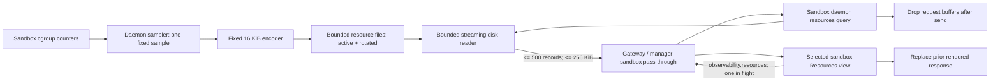

# Daemon-served disk-backed resource observability specification

Status: Implementation-ready; live admission test is red until product work lands
Owners: `sandbox-config`, `sandbox-operation-catalog`, `sandbox-manager`,
`sandbox-daemon`, `sandbox-observability-query`,
`sandbox-observability-telemetry`, web console
Target: observability storage v3

## 1. Decision

The ordinary selected-sandbox Resources view continues to poll the public
`observability.resources` operation. System scope remains manager-owned, while
sandbox scope is forwarded to the selected sandbox daemon. The daemon answers
from a bounded resource-history store on disk. A read never collects a fresh
sample and never appends telemetry.

The daemon may perform an independent periodic resource sample. Each tick owns
only one fixed-size sample and encoder buffer, writes it directly to the
resource store, and releases both before the tick completes. Neither the
daemon nor the web console retains an accumulating history in memory.

This design intentionally accepts bounded request-time allocation and bounded
periodic sampling work. In this document, **memory-free** means zero retained
history and zero growth with sample count or poll count. It does not mean a
zero-byte process or zero work while a request is active.

## 2. Relationship to the resource-isolation specifications

For sandbox-scoped `observability.resources`, this specification supersedes:

- `M1`, `P2`, and `P3` in
  [`sandbox-observability-resource-isolation-spec.md`](sandbox-observability-resource-isolation-spec.md);
- `MEM-03` and `READ-02` in
  [`sandbox-observability-disk-only-state-spec.md`](sandbox-observability-disk-only-state-spec.md).

It does not weaken their zero-retained-history, bounded-response, read-purity,
huge-page, failure-isolation, or total-disk-cap requirements. Fleet views may
remain manager-owned and must not fan out to every daemon. This specification
applies when an operator has selected one sandbox and requests its resource
history.

## 3. Public contract

`observability.resources` with sandbox scope is routed intact through the
manager and gateway to the selected daemon. The manager must not replace the
daemon's series with manager-owned samples. System-scoped
`observability.resources` remains a manager operation and must not fan out to
daemons.

A successful response has the following stable fields:

```json
{
  "view": "resources",
  "scope": "sandbox",
  "sandbox_id": "eos-...",
  "source": "daemon_disk",
  "availability": "available",
  "errors": [],
  "series": []
}
```

The daemon reads `series` from its resource files. Resource polling does not
collect process topology; the explicit `observability.topology` operation owns
that work. `source: daemon_disk` is an assertionable origin marker, not a
configurable label. If the store has no usable samples, the daemon returns an
empty series, `availability: partial`, and a bounded structured error; it does
not sample on demand.

Every client keeps at most one request in flight per selected sandbox. A new
poll replaces the previous rendered response. The console must not append
responses to an in-memory array, retain old response bodies, or queue missed
polls. Closing or hiding the resource panel stops polling.

## 4. State placement and limits

| State | Owner | Lifetime | Limit |
|---|---|---|---:|
| Current resource sample | sampler tick | one tick | 1 fixed record |
| Resource encoder | sampler tick | one append | 16 KiB |
| Resource history | daemon filesystem | configured retention | 1 MiB default |
| Resource query input | request | one request | 16 KiB line buffer |
| Resource query result | request | one response | 500 records and 256 KiB |
| Console resource result | selected panel | until next response | 1 response |
| Drop and corruption health | daemon | process | fixed-width counters |

Resource history is stored separately from runtime events so resource cadence
cannot evict incident events:

```text
/eos/runtime/daemon/observability/resources.ndjson
/eos/runtime/daemon/observability/resources.ndjson.1
```

Product code must not memory-map these files. It must not retain decoded
records, a response cache, an append queue, an error retry queue, or a buffer
whose capacity grows with the files.

## 5. Write path

The default sample interval is two seconds. Aggregate cgroup counters are
sampled even when no workload process is running so the chart remains current.
At daemon startup the sampler resolves its unified-cgroup path once. If the
daemon is placed in the reserved `_daemon` child, the resource target is its
parent sandbox cgroup; otherwise the target is the daemon's current cgroup.
The sampled fields are the available aggregate values from `cpu.stat`,
`memory.current`, `memory.max`, `io.stat`, and `pids.current`. Unsupported
fields are omitted rather than reported as zero. An idle tick must not walk
process topology; topology is a bounded explicit query concern.

Under the resource-store lock, one tick:

1. reads the current aggregate counters;
2. encodes one line into a buffer of at most 16 KiB;
3. reads both segment lengths;
4. removes the older rotated segment and atomically renames active to rotated
   before an append would cross the active-segment limit;
5. appends the complete line once; and
6. drops all sample and encoder state before releasing the tick task.

`resource_stats.max_disk_bytes` is a total budget. Each segment is limited to
half that budget. After every successful append:

```text
active.len <= resource_stats.max_disk_bytes / 2
rotated.len <= resource_stats.max_disk_bytes / 2
active.len + rotated.len <= resource_stats.max_disk_bytes
```

Append-then-rotate is forbidden. A sample larger than 16 KiB is dropped and
counted. `ENOSPC`, permission, corruption, and rotation failures drop the
sample without failing, delaying, or retrying a runtime operation.

## 6. Read path

The reader scans rotated and then active storage with a reusable capped line
buffer. It applies scope and time-window filters while streaming and retains
only the newest response-bounded records. Malformed UTF-8, malformed JSON,
oversized lines, and a partial crash tail are skipped and counted.

A poll must not:

- collect or refresh a resource sample;
- update file content, length, allocated blocks, inode, or modification time;
- emit an observability event about the read into either resource segment;
- retain request capacity after transport completion; or
- allow disconnected or slow clients to create an unbounded response queue.

The public response is rejected or truncated before it exceeds 500 records or
256 KiB encoded. The request's live heap is bounded independently of persisted
file size.

## 7. Configuration

```yaml
observability:
  resource_stats:
    enabled: true
    sample_interval_ms: 2000
    max_disk_bytes: 1048576
```

Validation rules:

- `sample_interval_ms`: 250 through 600,000 inclusive;
- `max_disk_bytes`: 128 KiB through 4 MiB inclusive and divisible by two;
- maximum encoded record: fixed at 16 KiB;
- maximum response: fixed at 500 records and 256 KiB.

The 600,000 ms interval is a supported operational setting used by read-purity
qualification; it is not a test-only switch.

## 8. Memory and pressure gates

After a fixed warm-up request count:

- daemon anonymous memory must not grow with resource-file size or completed
  poll count;
- 192 polls over an incident-sized resource store may increase peak anonymous
  memory by at most 2 MiB and final anonymous memory by at most 1 MiB;
- `AnonHugePages` and cgroup `anon_thp` remain zero;
- the daemon retains zero decoded samples after response transmission; and
- disk limits win over losslessness under pressure.

The implementation must satisfy these gates without allocator purge APIs,
`malloc_trim`, cgroup reclaim, daemon restart, or console reload.

## 9. Workflow



The sampler and reader share only a bounded file lock, paths, scalar limits,
and fixed counters. No historical collection connects them in heap memory.

## 10. Feature implementation plan

Implementation is one coordinated contract change across core and console.
Each component keeps a single responsibility.

### 10.1 Configuration

`sandbox-config` owns the typed `observability.resource_stats` section,
defaults, merge behavior, and validation. Invalid intervals, odd budgets, and
budgets outside the declared range fail before daemon startup. Production code
receives a validated value and does not repeat YAML parsing or policy checks.

### 10.2 Telemetry storage primitives

`sandbox-observability-telemetry` owns the resource paths, bounded two-segment
writer, capped streaming reader, record codec, and fixed health counters. The
resource writer may reuse the existing sink's locking and pre-append rotation
mechanics, but event and resource files must have independent paths, budgets,
and counters. The resource reader exposes a resource-specific streaming fold;
it must not route through a whole-history `Vec` or the event response cache.

Required storage tests cover exact-boundary append, pre-append rotation, total
budget preservation, partial tail, malformed and oversized lines, concurrent
read/write, read purity, and result limits.

### 10.3 Daemon sampling and query composition

`sandbox-daemon` resolves the sandbox aggregate cgroup target, starts one
sampler task when `resource_stats.enabled` is true, and stops it with the daemon
lifecycle. The task owns no collection keyed by sandbox, process, tick, or
request. One failed tick increments a fixed counter and waits for the next
normal interval; it creates no retry queue.

`sandbox-observability-query` registers a sandbox-scoped `resources` handler.
Its input port receives a dedicated resource reader rather than reusing the
runtime event reader. The handler validates `window_ms`, streams disk records,
computes adjacent counter deltas within the bounded result, and returns the
public response from section 3. It never invokes topology, a live resource
collector, or the event observer.

Required daemon/query tests prove cgroup-path selection, optional metric
handling, sampler shutdown, storage-failure isolation, empty/partial response,
disk-source response, response deltas, and zero writes during reads.

### 10.4 Catalog and manager routing

The observability catalog changes the `resources` execution owner by scope:

| Scope | Execution owner | Data source |
|---|---|---|
| system | manager | manager fleet-current ring |
| sandbox | daemon | daemon resource files |

The manager removes its sandbox-scoped `RESOURCES_SPEC` handler. Normal
sandbox routing forwards the original request and response without rebuilding
the series. The manager's sampling ring remains only for fleet current usage
and manager snapshots; it is not consulted by a selected-sandbox resource
request. The existing `cgroup`/topology behavior is outside this route change.

Required routing tests prove one daemon call for sandbox scope, zero daemon
calls for system scope, no manager-ring lookup for sandbox scope, and response
pass-through including `source` and structured errors.

### 10.5 Web console

The console keeps its existing `fetchSandboxResources` call for the ordinary
Resources view. Its response type adds the fixed `source: "daemon_disk"`
field. TanStack Query owns one cache entry for the selected sandbox, scope, and
window. One request may be in flight; the completed response replaces that
entry, and charts derive only from that response. Leaving the view aborts the
request and stops its interval; a hidden tab does not poll. No component copies
each response into React state, an array, IndexedDB, or another query key.

Required console tests use fake timers and a controlled unresolved promise to
prove one in-flight request, replacement rather than append, abort on unmount,
no hidden-tab polling, and recovery after an error without queued catch-up
requests.

### 10.6 Compatibility and rollout

This is a coordinated core/console revision because catalog routing and the
sandbox response schema change together. Rollout order is:

1. land config, storage, sampler, query, routing, and core tests;
2. package the daemon and rebuild the Docker gateway;
3. pass the focused live admission suite;
4. publish the immutable core revision;
5. update the console's contract/catalog/client pins and lockfile together;
6. pass console unit/browser coverage and a live selected-sandbox smoke test.

No manager-ring migration is performed. A new daemon begins with an empty
resource store and reaches `available` after its first successful periodic
sample. Missing files on startup are valid empty state. Old event files are
not copied into the resource store. A mixed deployment may return a normal
unsupported-operation failure; the console must render it as unavailable and
must not fall back to manager history under the same sandbox request.

## 11. Verification matrix

| Requirement | Unit/integration proof | Live E2E proof |
|---|---|---|
| Sandbox route reaches daemon disk | catalog, manager router, query response tests | DP-01 marker plus `source` oracle |
| Fleet route never fans out | manager router invocation-count test | existing fleet observability suite |
| Poll is side-effect-free | resource-reader fingerprint test | DP-01 before/after segment fingerprint |
| Poll memory is history-independent | capped-reader allocation test | DP-01 192-poll memory envelope |
| Store is strictly bounded | writer boundary and failure tests | DP-02 near-cap rotation under polling |
| Rotation preserves readable NDJSON | codec/concurrency tests | DP-02 inode and parseability checks |
| Console retains one response | fake-timer controlled-promise tests | live CLI proves backend; console smoke proves rendering |
| Runtime failures are isolated | sampler storage-error tests | covered by existing daemon failure-isolation suite |
| Time budgets are enforced | collection-time declaration assertions | pytest case/session timeouts |

## 12. Fast load-bearing E2E coverage

The focused live suite is
`ephemeral-sandbox-test/e2e/observability/resource_isolation/test_daemon_disk_polling.py`.
It uses real Docker sandboxes, the packaged daemon, and public CLI requests.
Docker access is limited to installing deterministic resource segments and
measuring filesystem and `/proc` evidence.

Two tests are required:

- DP-01 performs 24 warm-up polls and 192 measured polls at concurrency four
  while taking daemon memory checkpoints between batches. It proves disk
  origin, read purity, response limits, and bounded post-warm-up memory.
- DP-02 fills both resource segments to a rotation boundary, then continuously
  polls and fingerprints the store while the normal two-second sampler forces
  a pre-append rotation. It proves the hard disk cap and parseability under
  concurrent load.

Neither case contains an observation sleep. DP-01 spends the observation
window issuing public requests. DP-02 spends it issuing public requests and
checking the store while genuine periodic sampling advances the state.

Hard budgets are:

| Limit | Value |
|---|---:|
| DP-01 declared timeout | 110 seconds |
| DP-02 declared timeout | 110 seconds |
| Per-test pytest kill timeout | 120 seconds |
| Sum of declared test budgets | 220 seconds |
| Focused session timeout | 600 seconds |

The qualification command disables rebuild work because a packaged-daemon
rebuild is an explicit prerequisite:

```bash
E2E_REBUILD_BINARY=0 PYTHONPATH=e2e .venv/bin/python -m pytest \
  e2e/observability/resource_isolation/test_daemon_disk_polling.py -q \
  --timeout=120 --session-timeout=600 \
  --test-repository-root /Users/yifanxu/Ephemeral-AI-Lab/ephemeral-sandbox-test \
  --product-root /Users/yifanxu/Ephemeral-AI-Lab/ephemeral-sandbox
```

## 13. Definition of done

The feature is accepted only when all implementation items in section 10 are
complete, focused Rust and console tests pass, the packaged daemon is rebuilt,
and the focused live suite passes through the public CLI. The suite must
enforce a ten-minute session budget, declare each case below two minutes, and
spend its observation windows on poll or sampling load rather than dry waits.
Static collection alone is not acceptance, and an `xfail`, skip, source-marker
fallback, or manager-ring fallback cannot make the feature green.
