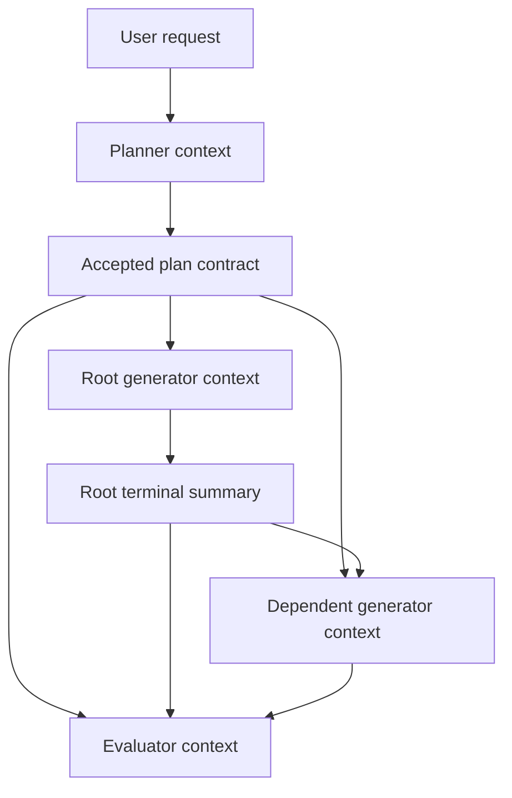
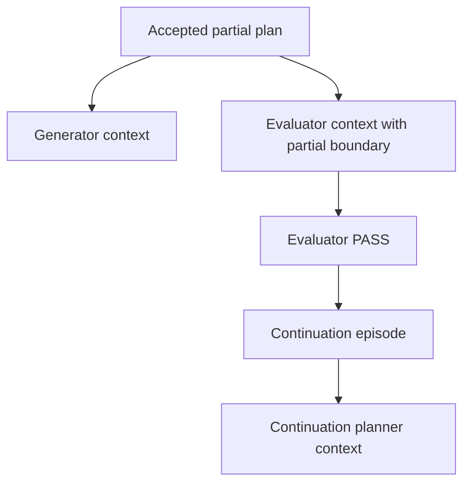
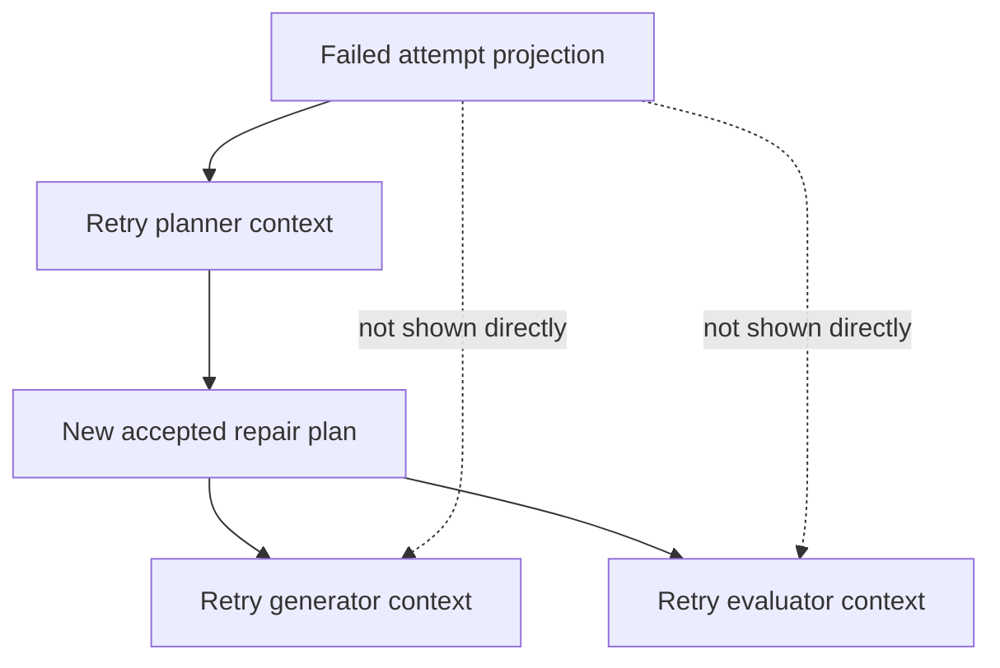
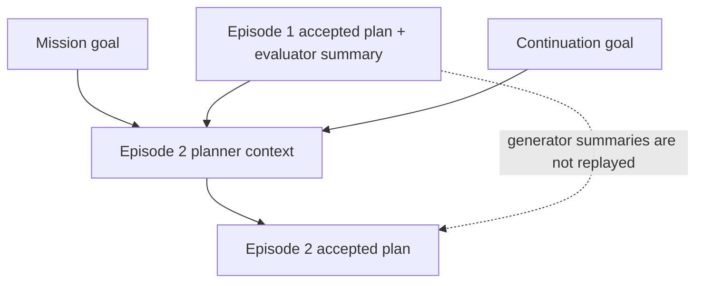
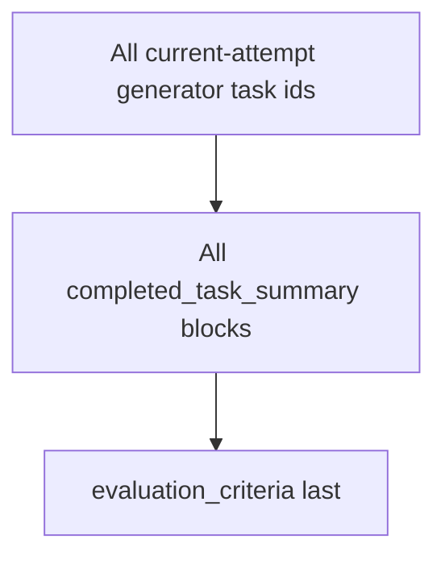
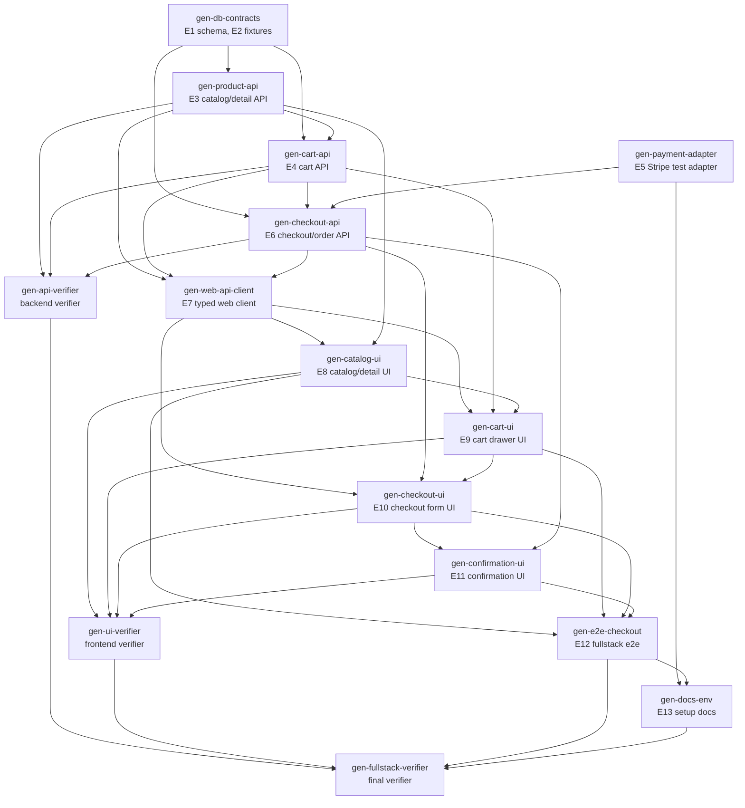

# Role Context Example: E-commerce Fullstack Build

This page gives one concrete, end-to-end example of what the rendered context
would look like while building a fullstack e-commerce slice. It is synthetic,
but it follows the same context shapes described in [[role-planner]],
[[role-generator]], and [[role-evaluator]]:

- The planner sees mission/episode framing and, on retries, failed-attempt
  landscape. It writes the DAG, the whole-attempt contract, and the evaluator's
  rubric.
- Each generator sees the whole-attempt contract as framing, only its own
  dependency summaries, and its own assigned task last.
- The evaluator sees mission/episode framing, the frozen attempt contract, every
  completed generator summary, and the criteria last.

The emphasis here is element dependency flow: how database tables, API
contracts, service behavior, React screens, test fixtures, and docs move from
planner intent into generator handoffs and finally into evaluator judgment.

## Scenario

Mission id: `mission-commerce-001`

Episode id: `episode-commerce-001`

Attempt id: `attempt-commerce-001-a1`

User request:

> Build a fullstack e-commerce checkout MVP for "Northwind Market". Customers
> must be able to browse products, open a product detail view, add items to a
> persistent cart, enter shipping/payment details, place an order using Stripe
> test mode, and see an order confirmation. The backend should expose typed
> FastAPI endpoints backed by Postgres. The React web app should use the
> existing app layout and API client pattern. Add focused backend, frontend, and
> end-to-end tests. Defer merchant admin, returns, refunds, coupons, and real
> fulfillment.

The planner turns that broad request into a first attempt whose scope is the
customer checkout path only. Anything outside that path is either excluded or
deferred through a continuation episode.

## Element Dependency Ledger

The planner is not just splitting work by files. It is splitting by product
elements whose outputs are needed by later elements. In this example, an
"element" is any artifact or behavior other tasks depend on: schema, endpoint,
client type, UI route, fixture, invariant, test, or documentation block.

| Element id | Element | First owner | Depends on | Downstream consumers | Handoff requirement |
|---|---|---|---|---|---|
| `E1` | Product/order/cart database schema | `gen-db-contracts` | none | all backend APIs, seed data, integration tests | Migration names, table names, enum values, rollback notes |
| `E2` | Product seed fixtures | `gen-db-contracts` | `E1` | product API, catalog UI, e2e test | Stable product slugs and variant ids |
| `E3` | Product catalog/detail API | `gen-product-api` | `E1`, `E2` | web API client, catalog UI, product detail UI | Endpoint paths, response shapes, pagination defaults |
| `E4` | Cart API and cart pricing model | `gen-cart-api` | `E1`, `E3` | cart drawer, checkout API, e2e test | Cart id behavior, item merge rules, subtotal semantics |
| `E5` | Stripe test adapter | `gen-payment-adapter` | environment config | checkout API, docs, e2e test | Test key env names, fake payment method ids, failure mode |
| `E6` | Checkout/order API | `gen-checkout-api` | `E1`, `E4`, `E5` | checkout UI, confirmation UI, evaluator | Order creation transaction, idempotency key, total calculation |
| `E7` | Shared web API client/types | `gen-web-api-client` | `E3`, `E4`, `E6` | all React tasks | Typed client methods, DTO names, error shape |
| `E8` | Catalog/product detail UI | `gen-catalog-ui` | `E3`, `E7` | cart UI, e2e test | Routes, selectors, add-to-cart entry point |
| `E9` | Cart drawer UI | `gen-cart-ui` | `E4`, `E7`, `E8` | checkout UI, e2e test | Quantity controls, persisted cart id handling |
| `E10` | Checkout form UI | `gen-checkout-ui` | `E6`, `E7`, `E9` | confirmation UI, e2e test | Validation states, submit flow, payment error surface |
| `E11` | Order confirmation UI | `gen-confirmation-ui` | `E6`, `E7`, `E10` | e2e test, evaluator | Route param, displayed order id, total, items |
| `E12` | Fullstack e2e test | `gen-e2e-checkout` | `E3`..`E11` | verifier, evaluator | Command, browser path, fixture identity, expected order total |
| `E13` | Setup docs | `gen-docs-env` | `E5`, `E12` | evaluator, future maintainer | Env vars, Stripe test card, local run command |

Important rule: these element dependencies do not automatically give later
generators the full history of upstream work. Later generators receive only the
latest prose summary from dependency tasks. If `gen-payment-adapter` forgets to
name `STRIPE_TEST_SECRET_KEY` in its summary, `gen-checkout-api` may not know
the env contract even though the task's artifacts list contains it.

## Context Shapes By Scenario

The context engine builds role-specific packets, not one shared context blob.
For episode 1, the internal block kind is `episode_goal`, but the rendered
heading is `# Mission / Current Episode`. Planners and evaluators are not
missing mission context in episode 1; it is collapsed into that single block.
Generators intentionally omit mission and episode framing.

### Scenario 1: First Attempt In The First Episode

The first planner receives only the mission/current-episode goal. After the
planner submits a plan, generator and evaluator contexts are projections of the
accepted contract, not the planner's private reasoning.



Planner packet:

```text
Final block sequence (planner_v1, packet order):
  [0] episode_goal (mission/current episode)         REQUIRED  heading=# Mission / Current Episode
```

Root generator packet:

```text
Final block sequence (generator_v1, packet order):
  [0] task_specification                             HIGH      heading=# Attempt Plan
  [1] planned_task_spec        (gen-db-contracts)    REQUIRED  heading=# Assigned Task
```

Dependent generator packet:

```text
Final block sequence (generator_v1, packet order):
  [0] task_specification                             HIGH      heading=# Attempt Plan
  [1] dependency_summary       (gen-db-contracts)    MEDIUM    group=# Dependency Results
  [2] planned_task_spec        (gen-product-api)     REQUIRED  heading=# Assigned Task
```

Evaluator packet:

```text
Final block sequence (evaluator_v1, packet order):
  [0] episode_goal (mission/current episode)         REQUIRED  heading=# Mission / Current Episode
  [1] task_specification                             REQUIRED  heading=# Attempt Plan
  [2] completed_task_summary   (gen-db-contracts)    HIGH      group=# Dependency Results
  [3] completed_task_summary   (gen-product-api)     HIGH      group=# Dependency Results
  [...]
  [N] evaluation_criteria                            REQUIRED  heading=# Evaluation Criteria
```

### Scenario 2: Partial Attempt

A partial plan changes evaluator context and later continuation-planner context.
It does not change generator context: generators still see the attempt plan,
direct dependency summaries, and their assigned task.



Generator packet:

```text
Final block sequence (generator_v1, packet order):
  [0] task_specification                             HIGH      heading=# Attempt Plan
  [1] dependency_summary       (direct dependency)   MEDIUM    group=# Dependency Results
  [2] planned_task_spec        (assigned task)       REQUIRED  heading=# Assigned Task
```

Evaluator packet:

```text
Final block sequence (evaluator_v1, packet order):
  [0] episode_goal (mission/current episode)         REQUIRED  heading=# Mission / Current Episode
  [1] task_specification                             REQUIRED  heading=# Attempt Plan
  [2] partial_plan_boundary                          REQUIRED  heading=# Partial Plan Boundary
  [3] completed_task_summary   (gen-*)               HIGH      group=# Dependency Results
  [...]
  [N] evaluation_criteria                            REQUIRED  heading=# Evaluation Criteria
```

Continuation planner packet:

```text
Final block sequence (planner_v1, packet order):
  [0] mission_goal                                   REQUIRED  heading=# Mission
  [1] prior_episode_specification (Ep#1)             HIGH      group=# Previous Episode Results
  [2] prior_episode_summary       (Ep#1)             HIGH      group=# Previous Episode Results
  [3] episode_goal                (Ep#2, current)    REQUIRED  heading=# Current Episode
```

### Scenario 3: Retry After A Failed Attempt

Failed-attempt history belongs to the retry planner. The next generators and
evaluator only see the new attempt contract unless the retry planner copies
relevant facts into the new plan or task specs.



Retry planner packet:

```text
Final block sequence (planner_v1, packet order):
  [0] episode_goal (mission/current retry scope)     REQUIRED  heading=# Mission / Current Episode
  [1] failed_attempt_landscape (Attempt#1 in Ep#1)   HIGH      group=# Prior Failed Attempts
  [2] failed_attempt_landscape (Attempt#2 in Ep#1)   HIGH      group=# Prior Failed Attempts
```

Retry generator packet:

```text
Final block sequence (generator_v1, packet order):
  [0] task_specification          (retry attempt)    HIGH      heading=# Attempt Plan
  [1] dependency_summary          (new dependency)   MEDIUM    group=# Dependency Results
  [2] planned_task_spec           (new task)         REQUIRED  heading=# Assigned Task
```

Retry evaluator packet:

```text
Final block sequence (evaluator_v1, packet order):
  [0] episode_goal (mission/current episode)         REQUIRED  heading=# Mission / Current Episode
  [1] task_specification          (retry attempt)    REQUIRED  heading=# Attempt Plan
  [2] completed_task_summary      (retry gen-*)      HIGH      group=# Dependency Results
  [...]
  [N] evaluation_criteria         (retry criteria)   REQUIRED  heading=# Evaluation Criteria
```

### Scenario 4: Continuation Episode

Continuation carries forward episode-level closure, not every task-level
detail. The next planner sees the prior accepted plan and evaluator pass
summary, then plans against the new current episode goal.



Continuation planner packet:

```text
Final block sequence (planner_v1, packet order):
  [0] mission_goal                                   REQUIRED  heading=# Mission
  [1] prior_episode_specification (Ep#1)             HIGH      group=# Previous Episode Results
  [2] prior_episode_summary       (Ep#1)             HIGH      group=# Previous Episode Results
  [3] episode_goal                (Ep#2, current)    REQUIRED  heading=# Current Episode
```

If episode 2 retries, failed attempts from episode 2 append after the current
episode goal:

```text
Final block sequence (planner_v1, packet order):
  [0] mission_goal                                   REQUIRED  heading=# Mission
  [1] prior_episode_specification (Ep#1)             HIGH      group=# Previous Episode Results
  [2] prior_episode_summary       (Ep#1)             HIGH      group=# Previous Episode Results
  [3] episode_goal (Ep#2 current retry scope)        REQUIRED  heading=# Current Episode
  [4] failed_attempt_landscape (Attempt#1 in Ep#2)   HIGH      group=# Prior Failed Attempts
```

### Scenario 5: Large Evaluator Context

The evaluator receives every current-attempt generator summary. This is
intentional: the evaluator judges the complete current attempt, so the context
engine should not silently omit high-priority judgment evidence or replace it
with a manifest.



Evaluator packet:

```text
Final block sequence (evaluator_v1, packet order):
  [0] episode_goal (mission/current episode)         REQUIRED  heading=# Mission / Current Episode
  [1] task_specification                             REQUIRED  heading=# Attempt Plan
  [2] completed_task_summary   (gen-1)               HIGH      group=# Dependency Results
  [3] completed_task_summary   (gen-2)               HIGH      group=# Dependency Results
  [...]
  [N-1] completed_task_summary (gen-N)               HIGH      group=# Dependency Results
  [N] evaluation_criteria                            REQUIRED  heading=# Evaluation Criteria
```

## Runtime Gates And Context Policies Represented By This Example

Visible context shape is not always enforcement. Hard gates are runtime
validation or lifecycle rules that reject or block invalid states. Context
policies shape what the agent sees, but they do not force an agent's final
judgment unless the runtime separately validates the state.

### Hard runtime gates

| Gate | Runtime effect | Why it prevents drift |
|---|---|---|
| Planner terminal schema | Requires nonblank `task_specification`, nonblank `evaluation_criteria`, nonempty `tasks`, and matching `task_specs`. | The planner cannot submit vague work or orphan task specs. |
| Planner DAG validation | Rejects duplicate ids, unknown generator agents, unknown deps, and dependency cycles. | The execution graph is dispatchable before generators launch. |
| Missing dependency invariant | A missing dependency task row raises context assembly failure. | The harness does not silently launch a generator with truncated dependency context. |
| Attempt retry lifecycle | Failed generator or evaluator outcomes close the current attempt and start a new planner when budget remains. | Repair scope is re-authored by a planner instead of improvised by a worker or evaluator. |

### Context-shaping policies

| Policy | Rendered effect | Why it reduces drift |
|---|---|---|
| Generator context recipe | Emits attempt spec, direct dependency summaries, and the assigned task spec only. | A generator is not invited to reason about sibling work unless the planner encoded it into local task or dependency summaries. |
| Evaluator partial boundary | Emits `plan_kind: partial` and `continuation_goal` for partial attempts. | The evaluator is told not to fail intentionally deferred continuation work, but the judgment remains an agent decision. |
| Evaluator criteria last | Places criteria after dependency results. | The final prompt section anchors the evaluator on the planner's accepted rubric. |
| Failed-attempt projection | Retry planner receives prior failed attempts framed as accepted plan, generator outcomes, and evaluator judgment when present. | The repair plan can be narrow without replaying raw work logs or raw failure fields. |
| Continuation summary boundary | Next episode sees prior accepted plan and evaluator pass summary. | Cross-episode reuse depends on deliberate close summaries, not context sprawl. |

## How Each Summary Is Obtained

Summaries are agent-authored terminal outputs. Dependency, evaluator, retry,
and continuation surfaces are context-engine projections of those stored
summaries.

| Surface | Producer | Stored as | Rendered by | Selection rule |
|---|---|---|---|---|
| Planner `task_specification` | Planner terminal call, `submit_full_plan` or `submit_partial_plan`. | Attempt plan contract. | Planner output becomes generator/evaluator framing. | Frozen for the attempt once accepted. |
| Planner `evaluation_criteria` | Planner terminal call. | Attempt plan contract. | Evaluator criteria block. | Rendered last for evaluator. |
| Planner `continuation_goal` | Planner terminal call when using partial plan. | Attempt plan contract and later episode continuation goal. | Evaluator partial boundary, next episode goal after pass. | Present only for partial attempts; omitted from retry failed-attempt framing by default. |
| Generator task summary | Generator terminal success/failure submission. | Task row `summaries[]`, appended as `{outcome, summary, payload}`. | Dependency summaries, evaluator dependency results, failed-attempt generator outcome details. | Latest summary entry only; `summary` is preferred over `outcome`. |
| Generator dependency summary | Context-engine projection from direct `needs`. | Not separately stored. | Generator recipe. | One latest summary per direct dependency. |
| Evaluator pass/fail summary | Evaluator terminal success/failure submission. | Evaluator task row `summaries[]`, appended as `{outcome, summary, payload}`. | Episode close summary, retry evaluator-judgment surface. | Latest evaluator summary for the attempt. |
| Failed-attempt generator outcomes | Context-engine projection from a failed attempt's generator task ids and task rows. | Not separately stored. | Planner recipe through failed-attempt landscape. | Status summary for every generator task id; detailed sections only for useful stored summaries; blocked tasks stay status-only unless they recorded a real summary. |
| Continuation episode summary | Episode close path. | Episode row `task_summary`, derived from evaluator pass summary. | Planner recipe for later episodes. | Does not include every prior generator summary. |

## Stage 1: Planner Context, First Attempt

For a first attempt in the first episode, `planner_v1` renders only the episode
goal. The planner does not see filesystem state or prior task summaries because
neither exists yet.

Rendered `task_input`:

```md
# Mission / Current Episode

Build a fullstack e-commerce checkout MVP for "Northwind Market". Customers
must be able to browse products, open a product detail view, add items to a
persistent cart, enter shipping/payment details, place an order using Stripe
test mode, and see an order confirmation. The backend should expose typed
FastAPI endpoints backed by Postgres. The React web app should use the existing
app layout and API client pattern. Add focused backend, frontend, and end-to-end
tests. Defer merchant admin, returns, refunds, coupons, and real fulfillment.
```

What the planner must infer from this narrow context:

| Need | Planner decision |
|---|---|
| Fullstack scope is too broad for one flat task | Build a DAG with backend contracts first, then frontend, then verification |
| Several UI tasks depend on response shapes | Put API/client tasks before UI tasks |
| Checkout depends on cart and payment semantics | Make checkout API depend on cart API and Stripe adapter |
| Evaluator needs binary criteria | Write criteria around observable endpoints, UI flows, totals, and tests |
| Deferred work exists | Use a partial plan with a continuation goal for merchant/admin work |

## Stage 2: Planner Submission

The planner submits one frozen plan. Plain reasoning before the terminal call is
discarded; these submitted fields become the durable contract.

### `task_specification`

```md
Deliver the customer shopping and checkout path for Northwind Market. The DAG
must add database schema and seed fixtures for products, carts, and orders;
backend APIs for catalog, cart, and checkout; a Stripe test-mode payment
adapter; typed web API client methods; React catalog, cart, checkout, and order
confirmation screens; focused backend/frontend tests; a browser e2e test that
places one successful order; and setup documentation for local Stripe test-mode
configuration. Do not implement merchant admin, returns, refunds, coupons,
email notifications, inventory replenishment, or real fulfillment.
```

### `evaluation_criteria`

```md
- Product listing and product detail endpoints return seeded products with
  stable ids, slugs, prices, inventory counts, and image URLs.
- A customer can add a seeded product variant to the cart, update quantity,
  refresh the app, and keep the same cart state.
- Checkout creates exactly one order for an idempotency key, stores line items,
  shipping address, payment status, subtotal, shipping, tax, and grand total.
- The React app supports the path `/products` -> product detail -> cart drawer
  -> `/checkout` -> `/orders/:orderId` without unhandled console errors.
- Stripe is used only through the test adapter; local setup is documented with
  env vars and test card instructions.
- Backend unit/integration tests, frontend tests, and the checkout e2e test are
  present and documented with their exact commands.
- Totals displayed in the cart, checkout review, backend order response, and
  confirmation page agree for the e2e fixture.
```

### Generator DAG



### `tasks[]`

| Task id | Agent profile | Needs | Primary elements |
|---|---|---|---|
| `gen-db-contracts` | `executor.default` | none | `E1`, `E2` |
| `gen-product-api` | `executor.default` | `gen-db-contracts` | `E3` |
| `gen-cart-api` | `executor.default` | `gen-db-contracts`, `gen-product-api` | `E4` |
| `gen-payment-adapter` | `executor.default` | none | `E5` |
| `gen-checkout-api` | `executor.default` | `gen-db-contracts`, `gen-cart-api`, `gen-payment-adapter` | `E6` |
| `gen-web-api-client` | `executor.default` | `gen-product-api`, `gen-cart-api`, `gen-checkout-api` | `E7` |
| `gen-catalog-ui` | `executor.default` | `gen-web-api-client`, `gen-product-api` | `E8` |
| `gen-cart-ui` | `executor.default` | `gen-web-api-client`, `gen-cart-api`, `gen-catalog-ui` | `E9` |
| `gen-checkout-ui` | `executor.default` | `gen-web-api-client`, `gen-checkout-api`, `gen-cart-ui` | `E10` |
| `gen-confirmation-ui` | `executor.default` | `gen-web-api-client`, `gen-checkout-api`, `gen-checkout-ui` | `E11` |
| `gen-e2e-checkout` | `executor.default` | `gen-catalog-ui`, `gen-cart-ui`, `gen-checkout-ui`, `gen-confirmation-ui` | `E12` |
| `gen-docs-env` | `executor.default` | `gen-payment-adapter`, `gen-e2e-checkout` | `E13` |
| `gen-api-verifier` | `verifier.default` | `gen-product-api`, `gen-cart-api`, `gen-checkout-api` | Backend verification |
| `gen-ui-verifier` | `verifier.default` | `gen-catalog-ui`, `gen-cart-ui`, `gen-checkout-ui`, `gen-confirmation-ui` | UI verification |
| `gen-fullstack-verifier` | `verifier.default` | `gen-api-verifier`, `gen-ui-verifier`, `gen-e2e-checkout`, `gen-docs-env` | Whole attempt verification |

### `task_specs`

Only the assigned generator receives its own entry from this map. Siblings do
not see each other's task specs unless the planner repeats content in a
dependency summary later, which it cannot do directly.

#### `gen-db-contracts`

```md
Create the backend schema and fixture foundation for customer checkout.

Required outputs:
- Add a migration for products, product_variants, carts, cart_items, orders,
  order_items, and payment_attempts.
- Add model/store code following the backend's existing persistence pattern.
- Add seed fixtures for exactly three products:
  - `ceramic-mug-blue`, variant `mug-blue-12oz`, price 1299, inventory 24
  - `linen-tote-natural`, variant `tote-natural`, price 2499, inventory 13
  - `desk-lamp-matte-black`, variant `lamp-black`, price 5999, inventory 7
- Include a short backend test proving the fixture loader creates all three
  products and variants.

Summary must name the migration file, table names, fixture ids, and test
command.
```

#### `gen-product-api`

```md
Implement customer product browse APIs on top of the schema and fixtures from
`gen-db-contracts`.

Required outputs:
- `GET /api/storefront/products` returns paginated product cards.
- `GET /api/storefront/products/{slug}` returns product detail with variants.
- Response DTOs include product id, slug, title, description, price_cents,
  currency, image_url, variant id, inventory_count, and availability.
- Add backend tests for listing, detail, not-found, and out-of-stock display
  semantics.

Use the fixture slugs from the dependency summary. Summary must include endpoint
paths, DTO names, fixture slugs, and test command.
```

#### `gen-cart-api`

```md
Implement persistent anonymous cart APIs.

Required outputs:
- `POST /api/storefront/cart/items` creates or updates a cart item by variant id.
- `GET /api/storefront/cart/{cartId}` returns cart items and subtotal.
- `PATCH /api/storefront/cart/{cartId}/items/{itemId}` updates quantity.
- `DELETE /api/storefront/cart/{cartId}/items/{itemId}` removes an item.
- Quantity updates must merge duplicate variant lines and reject unavailable
  variants.
- Add tests for add, merge, quantity update, delete, and stale variant id.

Use product DTO/store behavior from dependencies. Summary must state the cart id
contract, subtotal semantics, and test command.
```

#### `gen-payment-adapter`

```md
Create a Stripe test-mode payment adapter for checkout.

Required outputs:
- Add a narrow backend adapter interface with `authorize_payment(amount_cents,
  currency, payment_method_token, idempotency_key)`.
- Add a Stripe-backed implementation using env vars `STRIPE_TEST_SECRET_KEY`
  and `STRIPE_TEST_WEBHOOK_SECRET`.
- Add a fake/test implementation for unit tests.
- Map declined test card behavior to a typed checkout error.
- Add tests for success, decline, and idempotent duplicate authorization.

Do not add webhook processing or real fulfillment. Summary must name env vars,
test payment tokens/cards, adapter files, and test command.
```

#### `gen-checkout-api`

```md
Implement checkout and order creation.

Required outputs:
- `POST /api/storefront/checkout` accepts cart_id, shipping_address,
  payment_method_token, and idempotency_key.
- The endpoint validates cart contents, computes subtotal, fixed shipping
  `599`, tax as 8.25 percent rounded to cents, grand total, and creates one
  order transactionally.
- Store order_items copied from cart items, payment_attempt status, and the
  Stripe test authorization id.
- Return order id, order number, line items, subtotal, shipping, tax, grand
  total, payment status, and confirmation route data.
- `GET /api/storefront/orders/{orderId}` returns the confirmation payload.
- Add tests for success, empty cart, declined payment, and idempotent retry.

Use the cart id contract and payment adapter contract from dependencies.
Summary must include endpoint paths, total formula, idempotency behavior, DTO
names, and test command.
```

#### `gen-web-api-client`

```md
Add typed web API client support for storefront checkout.

Required outputs:
- Add TypeScript types for ProductCard, ProductDetail, Cart, CartItem,
  CheckoutRequest, CheckoutResponse, OrderConfirmation, and ApiError.
- Add client functions for product list/detail, cart get/add/update/delete,
  checkout submit, and order get.
- Preserve the existing `@/*` import style and TanStack Query conventions.
- Add small tests or type-level checks if the web app has an established
  pattern.

Use endpoint paths and DTO names from API dependency summaries. Summary must
include file paths, exported function names, and any generated or manual type
source.
```

#### `gen-catalog-ui`

```md
Build the product listing and product detail UI.

Required outputs:
- `/products` renders seeded product cards using the typed API client.
- `/products/:slug` renders product detail, variant availability, quantity
  picker, and an add-to-cart button.
- Loading, empty, and API error states must match existing page patterns.
- Add component tests for product card rendering and product detail add-to-cart
  action wiring.

Use `ceramic-mug-blue` as the primary fixture in tests. Summary must include
routes, component files, selectors/test ids, and test command.
```

#### `gen-cart-ui`

```md
Build the cart drawer and persistence behavior.

Required outputs:
- Add a cart provider/hook that stores the current cart id in localStorage.
- Add a cart badge in the app shell and a drawer with line items, quantity
  steppers, remove action, subtotal, and checkout button.
- Product detail add-to-cart must create/reuse the cart and update the drawer.
- Add component tests for persisted cart id, quantity update, remove, and
  checkout button routing.

Use route/selectors from `gen-catalog-ui` and cart API functions from
`gen-web-api-client`. Summary must include provider name, localStorage key,
drawer selectors, and test command.
```

#### `gen-checkout-ui`

```md
Build the checkout page.

Required outputs:
- `/checkout` loads the current cart, blocks empty cart checkout, and renders
  shipping address fields, payment token/test card field, order summary, and
  submit button.
- On submit, call the checkout API with an idempotency key and route to
  `/orders/:orderId` on success.
- Show declined payment and validation errors without losing cart state.
- Display subtotal, shipping, tax, and grand total using the backend response
  or the same documented formula before submit.
- Add component tests for empty cart, validation errors, declined payment, and
  successful submit routing.

Use the cart provider and checkout client dependency summaries. Summary must
name route file, form fields, idempotency key source, total display rule, and
test command.
```

#### `gen-confirmation-ui`

```md
Build the order confirmation page.

Required outputs:
- `/orders/:orderId` loads the order confirmation API.
- Render order number, payment status, shipping address, line items, subtotal,
  shipping, tax, grand total, and a link back to `/products`.
- Add loading, not-found, and API error states.
- Add component tests for a successful confirmation payload and not-found.

Use checkout response and order confirmation DTO names from dependencies.
Summary must include route, component files, displayed total fields, and test
command.
```

#### `gen-e2e-checkout`

```md
Add one browser e2e test for the successful customer checkout path.

Required outputs:
- Start at `/products`, open `ceramic-mug-blue`, add quantity 2 to cart, open
  cart drawer, go to checkout, submit shipping/payment details using the Stripe
  test success token, and assert the confirmation page.
- Assert the displayed total equals:
  subtotal 2598 + shipping 599 + tax 214 = grand total 3411.
- Assert no unhandled console errors.
- Document the exact command and any required backend/frontend startup
  assumptions in the test file or nearby docs.

Use selectors and route names from UI dependency summaries. Summary must include
test file path, fixture product, expected total, and command.
```

#### `gen-docs-env`

```md
Document local setup for the checkout MVP.

Required outputs:
- Add/update docs that explain required env vars for Stripe test mode.
- Include the Stripe test success token/card and declined token/card.
- Include backend, frontend, and e2e commands needed to validate checkout.
- State deferred work explicitly: merchant admin, returns/refunds, coupons,
  fulfillment, webhook processing.

Use payment adapter and e2e dependency summaries. Summary must include doc path
and the commands documented.
```

#### `gen-api-verifier`

```md
Verify the backend API slice without editing implementation files.

Required outputs:
- Inspect product, cart, checkout, order, and payment adapter tests.
- Run the narrow backend tests named in dependency summaries.
- Confirm idempotent checkout creates exactly one order for a repeated key.
- Confirm total formula is subtotal + fixed shipping 599 + 8.25 percent tax
  rounded to cents.
- If a small issue blocks success, use `ask_resolver`; otherwise submit failure
  with unresolved issues.

Summary must list checks run, pass/fail outcome, and any resolver actions.
```

#### `gen-ui-verifier`

```md
Verify the customer UI slice without editing implementation files.

Required outputs:
- Inspect catalog, product detail, cart drawer, checkout, and confirmation
  components.
- Run the frontend tests named in dependency summaries.
- Confirm routes and selectors are stable for e2e.
- Confirm total display labels are consistent across cart, checkout, and
  confirmation.
- If a small issue blocks success, use `ask_resolver`; otherwise submit failure
  with unresolved issues.

Summary must list checks run, pass/fail outcome, and any resolver actions.
```

#### `gen-fullstack-verifier`

```md
Verify the integrated checkout attempt without editing implementation files.

Required outputs:
- Run or inspect the backend, frontend, and e2e verification commands from
  dependency summaries.
- Confirm the e2e fixture total is 3411 for two ceramic mugs.
- Confirm docs contain Stripe env vars and test payment instructions.
- Confirm no deferred scope accidentally shipped as active behavior.

Summary must list the final command set, integrated outcome, and any remaining
risk.
```

### `continuation_goal`

Because the first attempt deliberately excludes merchant operations, the
planner should use `submit_partial_plan`:

```md
Add merchant/admin capabilities for the e-commerce system: product management,
inventory adjustment, order status management, refund/return workflows, coupon
codes, fulfillment status, and payment webhook processing. Preserve the
customer checkout APIs and UI created in the previous episode.
```

## Stage 3: Generator Context, Root Backend Task

The dispatcher can launch `gen-db-contracts` immediately because it has no
dependencies. `generator_v1` renders only the attempt plan and assigned task.
It does not render the mission goal or evaluation criteria.

Rendered `task_input` for `gen-db-contracts`:

```md
# Attempt Plan

Deliver the customer shopping and checkout path for Northwind Market. The DAG
must add database schema and seed fixtures for products, carts, and orders;
backend APIs for catalog, cart, and checkout; a Stripe test-mode payment
adapter; typed web API client methods; React catalog, cart, checkout, and order
confirmation screens; focused backend/frontend tests; a browser e2e test that
places one successful order; and setup documentation for local Stripe test-mode
configuration. Do not implement merchant admin, returns, refunds, coupons,
email notifications, inventory replenishment, or real fulfillment.

# Assigned Task

Create the backend schema and fixture foundation for customer checkout.

Required outputs:
- Add a migration for products, product_variants, carts, cart_items, orders,
  order_items, and payment_attempts.
- Add model/store code following the backend's existing persistence pattern.
- Add seed fixtures for exactly three products:
  - `ceramic-mug-blue`, variant `mug-blue-12oz`, price 1299, inventory 24
  - `linen-tote-natural`, variant `tote-natural`, price 2499, inventory 13
  - `desk-lamp-matte-black`, variant `lamp-black`, price 5999, inventory 7
- Include a short backend test proving the fixture loader creates all three
  products and variants.

Summary must name the migration file, table names, fixture ids, and test
command.
```

Example terminal summary written by `gen-db-contracts`:

```md
Added migration `20260513_001_storefront_checkout.py` creating
`products`, `product_variants`, `carts`, `cart_items`, `orders`,
`order_items`, and `payment_attempts`. Added seed fixture loader with product
slugs `ceramic-mug-blue`, `linen-tote-natural`, `desk-lamp-matte-black` and
variant ids `mug-blue-12oz`, `tote-natural`, `lamp-black`. Added
`backend/tests/storefront/test_seed_fixtures.py`; command:
`uv run pytest backend/tests/storefront/test_seed_fixtures.py -q`.
```

Dependency implication: every downstream backend task that needs table names,
fixture ids, or migration names must learn them from this summary. The
artifacts list is not rendered into later prompts.

## Stage 4: Generator Context, Mid-DAG Checkout API

`gen-checkout-api` waits for `gen-db-contracts`, `gen-cart-api`, and
`gen-payment-adapter`. It receives summaries from exactly those dependencies,
not summaries from product UI work or sibling tasks.

Dependency summaries available to this task:

```md
gen-db-contracts:
Added migration `20260513_001_storefront_checkout.py` creating
`products`, `product_variants`, `carts`, `cart_items`, `orders`,
`order_items`, and `payment_attempts`. Added seed fixture loader with product
slugs `ceramic-mug-blue`, `linen-tote-natural`, `desk-lamp-matte-black` and
variant ids `mug-blue-12oz`, `tote-natural`, `lamp-black`. Added
`backend/tests/storefront/test_seed_fixtures.py`; command:
`uv run pytest backend/tests/storefront/test_seed_fixtures.py -q`.

gen-cart-api:
Implemented cart endpoints `POST /api/storefront/cart/items`,
`GET /api/storefront/cart/{cartId}`,
`PATCH /api/storefront/cart/{cartId}/items/{itemId}`, and
`DELETE /api/storefront/cart/{cartId}/items/{itemId}`. Cart ids are UUIDs
returned on first add and expected from localStorage on subsequent reads.
Duplicate variant adds merge into one line. `subtotal_cents` is the sum of
current line quantity times product variant price and excludes shipping/tax.
Tests: `uv run pytest backend/tests/storefront/test_cart_api.py -q`.

gen-payment-adapter:
Added `PaymentAuthorizer` with Stripe test implementation and fake test
implementation. Env vars are `STRIPE_TEST_SECRET_KEY` and
`STRIPE_TEST_WEBHOOK_SECRET`. Success token is `pm_card_visa`; declined token
is `pm_card_chargeDeclined`. Duplicate idempotency keys return the prior
authorization id. Tests:
`uv run pytest backend/tests/storefront/test_payment_adapter.py -q`.
```

Rendered `task_input` for `gen-checkout-api`:

```md
# Attempt Plan

Deliver the customer shopping and checkout path for Northwind Market. The DAG
must add database schema and seed fixtures for products, carts, and orders;
backend APIs for catalog, cart, and checkout; a Stripe test-mode payment
adapter; typed web API client methods; React catalog, cart, checkout, and order
confirmation screens; focused backend/frontend tests; a browser e2e test that
places one successful order; and setup documentation for local Stripe test-mode
configuration. Do not implement merchant admin, returns, refunds, coupons,
email notifications, inventory replenishment, or real fulfillment.

# Dependency Results

## gen-db-contracts

Added migration `20260513_001_storefront_checkout.py` creating
`products`, `product_variants`, `carts`, `cart_items`, `orders`,
`order_items`, and `payment_attempts`. Added seed fixture loader with product
slugs `ceramic-mug-blue`, `linen-tote-natural`, `desk-lamp-matte-black` and
variant ids `mug-blue-12oz`, `tote-natural`, `lamp-black`. Added
`backend/tests/storefront/test_seed_fixtures.py`; command:
`uv run pytest backend/tests/storefront/test_seed_fixtures.py -q`.

## gen-cart-api

Implemented cart endpoints `POST /api/storefront/cart/items`,
`GET /api/storefront/cart/{cartId}`,
`PATCH /api/storefront/cart/{cartId}/items/{itemId}`, and
`DELETE /api/storefront/cart/{cartId}/items/{itemId}`. Cart ids are UUIDs
returned on first add and expected from localStorage on subsequent reads.
Duplicate variant adds merge into one line. `subtotal_cents` is the sum of
current line quantity times product variant price and excludes shipping/tax.
Tests: `uv run pytest backend/tests/storefront/test_cart_api.py -q`.

## gen-payment-adapter

Added `PaymentAuthorizer` with Stripe test implementation and fake test
implementation. Env vars are `STRIPE_TEST_SECRET_KEY` and
`STRIPE_TEST_WEBHOOK_SECRET`. Success token is `pm_card_visa`; declined token
is `pm_card_chargeDeclined`. Duplicate idempotency keys return the prior
authorization id. Tests:
`uv run pytest backend/tests/storefront/test_payment_adapter.py -q`.

# Assigned Task

Implement checkout and order creation.

Required outputs:
- `POST /api/storefront/checkout` accepts cart_id, shipping_address,
  payment_method_token, and idempotency_key.
- The endpoint validates cart contents, computes subtotal, fixed shipping
  `599`, tax as 8.25 percent rounded to cents, grand total, and creates one
  order transactionally.
- Store order_items copied from cart items, payment_attempt status, and the
  Stripe test authorization id.
- Return order id, order number, line items, subtotal, shipping, tax, grand
  total, payment status, and confirmation route data.
- `GET /api/storefront/orders/{orderId}` returns the confirmation payload.
- Add tests for success, empty cart, declined payment, and idempotent retry.

Use the cart id contract and payment adapter contract from dependencies.
Summary must include endpoint paths, total formula, idempotency behavior, DTO
names, and test command.
```

Example terminal summary written by `gen-checkout-api`:

```md
Implemented `POST /api/storefront/checkout` and
`GET /api/storefront/orders/{orderId}` with DTOs `CheckoutRequest`,
`CheckoutResponse`, `OrderLineItemDTO`, and `OrderConfirmationDTO`. Total
formula is `subtotal_cents + 599 shipping + round(subtotal_cents * 0.0825)`.
The endpoint stores one `orders` row, copied `order_items`, and a
`payment_attempts` row inside one transaction. Reusing an idempotency key for
the same cart returns the existing order id and does not create duplicate
orders. Tests:
`uv run pytest backend/tests/storefront/test_checkout_api.py -q`.
```

The summary explicitly carries the total formula and idempotency behavior
because checkout UI, e2e, verifier, and evaluator all depend on those facts.

## Stage 5: Generator Context, UI Task With Multiple Dependencies

`gen-checkout-ui` is downstream of the typed client, checkout API, and cart UI.
It does not see product API details directly unless an immediate dependency
mentions them in its summary.

Rendered `task_input` for `gen-checkout-ui`:

```md
# Attempt Plan

Deliver the customer shopping and checkout path for Northwind Market. The DAG
must add database schema and seed fixtures for products, carts, and orders;
backend APIs for catalog, cart, and checkout; a Stripe test-mode payment
adapter; typed web API client methods; React catalog, cart, checkout, and order
confirmation screens; focused backend/frontend tests; a browser e2e test that
places one successful order; and setup documentation for local Stripe test-mode
configuration. Do not implement merchant admin, returns, refunds, coupons,
email notifications, inventory replenishment, or real fulfillment.

# Dependency Results

## gen-web-api-client

Added `frontend/web/src/lib/storefrontApi.ts` exporting `listProducts`,
`getProduct`, `getCart`, `addCartItem`, `updateCartItem`, `removeCartItem`,
`submitCheckout`, and `getOrderConfirmation`. Exported types
`ProductCard`, `ProductDetail`, `Cart`, `CartItem`, `CheckoutRequest`,
`CheckoutResponse`, `OrderConfirmation`, and `ApiError`. API errors normalize
to `{code, message, fieldErrors}`. Type check:
`cd frontend/web && npm run build`.

## gen-checkout-api

Implemented `POST /api/storefront/checkout` and
`GET /api/storefront/orders/{orderId}` with DTOs `CheckoutRequest`,
`CheckoutResponse`, `OrderLineItemDTO`, and `OrderConfirmationDTO`. Total
formula is `subtotal_cents + 599 shipping + round(subtotal_cents * 0.0825)`.
The endpoint stores one `orders` row, copied `order_items`, and a
`payment_attempts` row inside one transaction. Reusing an idempotency key for
the same cart returns the existing order id and does not create duplicate
orders. Tests:
`uv run pytest backend/tests/storefront/test_checkout_api.py -q`.

## gen-cart-ui

Added `CartProvider`, `useCart`, localStorage key `northwind.cartId`, app shell
cart badge, and `CartDrawer` selectors `cart-drawer`, `cart-line-item`,
`cart-quantity-stepper`, `cart-remove-item`, and `cart-checkout-button`.
Product detail add-to-cart opens the drawer after `addCartItem`. Frontend
tests: `cd frontend/web && npm run test -- CartDrawer`.

# Assigned Task

Build the checkout page.

Required outputs:
- `/checkout` loads the current cart, blocks empty cart checkout, and renders
  shipping address fields, payment token/test card field, order summary, and
  submit button.
- On submit, call the checkout API with an idempotency key and route to
  `/orders/:orderId` on success.
- Show declined payment and validation errors without losing cart state.
- Display subtotal, shipping, tax, and grand total using the backend response
  or the same documented formula before submit.
- Add component tests for empty cart, validation errors, declined payment, and
  successful submit routing.

Use the cart provider and checkout client dependency summaries. Summary must
name route file, form fields, idempotency key source, total display rule, and
test command.
```

Example terminal summary written by `gen-checkout-ui`:

```md
Added `/checkout` route in `frontend/web/src/pages/storefront/CheckoutPage.tsx`
using `useCart`, `submitCheckout`, and generated idempotency keys stored per
cart as `northwind.checkoutIdempotencyKey`. Form fields: name, line1, city,
state, postal_code, country, and payment_method_token. Empty cart redirects
back to `/products`; validation and declined-payment API errors render inline
without clearing cart state. Pre-submit totals use the documented formula:
subtotal + 599 shipping + rounded 8.25 percent tax. Successful submit routes to
`/orders/:orderId`. Tests:
`cd frontend/web && npm run test -- CheckoutPage`.
```

Element dependency effect:

- The checkout page can calculate the preview total because `gen-checkout-api`
  named the formula.
- It can persist idempotency correctly because `gen-checkout-api` named the
  idempotency behavior.
- It can route after success because `gen-web-api-client` named
  `CheckoutResponse` and `getOrderConfirmation`.
- It can read the cart because `gen-cart-ui` named the provider and
  localStorage key.

## Stage 6: Generator Context, Verifier Task

Verifier tasks still use `generator_v1`. The difference is the agent profile:
the verifier gets read-only tools plus `ask_resolver`, and success/failure
verification terminals.

Rendered `task_input` for `gen-fullstack-verifier`:

```md
# Attempt Plan

Deliver the customer shopping and checkout path for Northwind Market. The DAG
must add database schema and seed fixtures for products, carts, and orders;
backend APIs for catalog, cart, and checkout; a Stripe test-mode payment
adapter; typed web API client methods; React catalog, cart, checkout, and order
confirmation screens; focused backend/frontend tests; a browser e2e test that
places one successful order; and setup documentation for local Stripe test-mode
configuration. Do not implement merchant admin, returns, refunds, coupons,
email notifications, inventory replenishment, or real fulfillment.

# Dependency Results

## gen-api-verifier

Backend verification passed. Ran
`uv run pytest backend/tests/storefront/test_seed_fixtures.py backend/tests/storefront/test_product_api.py backend/tests/storefront/test_cart_api.py backend/tests/storefront/test_payment_adapter.py backend/tests/storefront/test_checkout_api.py -q`.
Confirmed duplicate checkout idempotency key returns the original order id and
does not insert a second order. Confirmed backend total formula for two
`mug-blue-12oz` items: subtotal 2598, shipping 599, tax 214, grand total 3411.

## gen-ui-verifier

Frontend verification passed after one resolver fix for a missing accessible
label on the checkout submit button. Ran
`cd frontend/web && npm run test -- Storefront CheckoutPage CartDrawer OrderConfirmation`.
Confirmed stable selectors for e2e: `product-card`, `add-to-cart-button`,
`cart-drawer`, `cart-checkout-button`, `checkout-submit`, and
`order-confirmation-total`.

## gen-e2e-checkout

Added `frontend/web/e2e/storefront-checkout.spec.ts`. The test opens
`/products`, selects `ceramic-mug-blue`, adds quantity 2, opens cart, checks out
with `pm_card_visa`, and asserts `/orders/:orderId` shows total 3411. The test
fails on unhandled console errors. Command:
`cd frontend/web && npm run e2e -- storefront-checkout.spec.ts`.

## gen-docs-env

Updated `docs/storefront-checkout.md` with env vars `STRIPE_TEST_SECRET_KEY`
and `STRIPE_TEST_WEBHOOK_SECRET`, success token `pm_card_visa`, declined token
`pm_card_chargeDeclined`, backend/frontend/e2e commands, and deferred work:
merchant admin, returns/refunds, coupons, fulfillment, and webhook processing.

# Assigned Task

Verify the integrated checkout attempt without editing implementation files.

Required outputs:
- Run or inspect the backend, frontend, and e2e verification commands from
  dependency summaries.
- Confirm the e2e fixture total is 3411 for two ceramic mugs.
- Confirm docs contain Stripe env vars and test payment instructions.
- Confirm no deferred scope accidentally shipped as active behavior.

Summary must list the final command set, integrated outcome, and any remaining
risk.
```

Example terminal summary written by `gen-fullstack-verifier`:

```md
Integrated checkout verification passed. Confirmed backend test aggregate,
frontend test aggregate, and e2e command from dependency summaries. Rechecked
fixture total for two `mug-blue-12oz` items: subtotal 2598 + shipping 599 + tax
214 = grand total 3411 in backend order response, checkout page, and
confirmation page. Docs include Stripe test env vars and success/decline token
instructions. Deferred features remain documented only; no active merchant
admin, refund, coupon, fulfillment, or webhook routes were added.
```

Notice the verifier did not receive every raw task summary. It received only the
summaries for tasks listed in its `needs`. That is why the planner gives it the
aggregate verifier tasks and e2e/docs tasks as dependencies.

## Stage 7: Evaluator Context, Successful Attempt

The evaluator is spawned only after all generator tasks are done. It receives
all generator summaries listed in `attempt.generator_task_ids`, not just a
subset. Its prompt closes on the criteria.

Rendered `task_input` shape for the evaluator:

```md
# Mission / Current Episode

Build a fullstack e-commerce checkout MVP for "Northwind Market". Customers
must be able to browse products, open a product detail view, add items to a
persistent cart, enter shipping/payment details, place an order using Stripe
test mode, and see an order confirmation. The backend should expose typed
FastAPI endpoints backed by Postgres. The React web app should use the existing
app layout and API client pattern. Add focused backend, frontend, and end-to-end
tests. Defer merchant admin, returns, refunds, coupons, and real fulfillment.

# Attempt Plan

Deliver the customer shopping and checkout path for Northwind Market. The DAG
must add database schema and seed fixtures for products, carts, and orders;
backend APIs for catalog, cart, and checkout; a Stripe test-mode payment
adapter; typed web API client methods; React catalog, cart, checkout, and order
confirmation screens; focused backend/frontend tests; a browser e2e test that
places one successful order; and setup documentation for local Stripe test-mode
configuration. Do not implement merchant admin, returns, refunds, coupons,
email notifications, inventory replenishment, or real fulfillment.

# Partial Plan Boundary

plan_kind: partial
continuation_goal: Add merchant/admin capabilities for the e-commerce system:
product management, inventory adjustment, order status management,
refund/return workflows, coupon codes, fulfillment status, and payment webhook
processing. Preserve the customer checkout APIs and UI created in the previous
episode.

This attempt is intentionally partial. If it passes, the continuation_goal
becomes the next episode. Do not treat continuation work as missing from the
current attempt; judge this attempt against the Attempt Plan and Evaluation
Criteria.

# Dependency Results

## gen-db-contracts

Added migration `20260513_001_storefront_checkout.py` creating
`products`, `product_variants`, `carts`, `cart_items`, `orders`,
`order_items`, and `payment_attempts`. Added seed fixture loader with product
slugs `ceramic-mug-blue`, `linen-tote-natural`, `desk-lamp-matte-black` and
variant ids `mug-blue-12oz`, `tote-natural`, `lamp-black`. Added
`backend/tests/storefront/test_seed_fixtures.py`; command:
`uv run pytest backend/tests/storefront/test_seed_fixtures.py -q`.

## gen-product-api

Implemented `GET /api/storefront/products` and
`GET /api/storefront/products/{slug}` using DTOs `ProductCardDTO` and
`ProductDetailDTO`. Responses include id, slug, title, description,
price_cents, currency, image_url, variant id, inventory_count, and
availability. Tests:
`uv run pytest backend/tests/storefront/test_product_api.py -q`.

## gen-cart-api

Implemented cart endpoints `POST /api/storefront/cart/items`,
`GET /api/storefront/cart/{cartId}`,
`PATCH /api/storefront/cart/{cartId}/items/{itemId}`, and
`DELETE /api/storefront/cart/{cartId}/items/{itemId}`. Cart ids are UUIDs
returned on first add and expected from localStorage on subsequent reads.
Duplicate variant adds merge into one line. `subtotal_cents` is the sum of
current line quantity times product variant price and excludes shipping/tax.
Tests: `uv run pytest backend/tests/storefront/test_cart_api.py -q`.

## gen-payment-adapter

Added `PaymentAuthorizer` with Stripe test implementation and fake test
implementation. Env vars are `STRIPE_TEST_SECRET_KEY` and
`STRIPE_TEST_WEBHOOK_SECRET`. Success token is `pm_card_visa`; declined token
is `pm_card_chargeDeclined`. Duplicate idempotency keys return the prior
authorization id. Tests:
`uv run pytest backend/tests/storefront/test_payment_adapter.py -q`.

## gen-checkout-api

Implemented `POST /api/storefront/checkout` and
`GET /api/storefront/orders/{orderId}` with DTOs `CheckoutRequest`,
`CheckoutResponse`, `OrderLineItemDTO`, and `OrderConfirmationDTO`. Total
formula is `subtotal_cents + 599 shipping + round(subtotal_cents * 0.0825)`.
The endpoint stores one `orders` row, copied `order_items`, and a
`payment_attempts` row inside one transaction. Reusing an idempotency key for
the same cart returns the existing order id and does not create duplicate
orders. Tests:
`uv run pytest backend/tests/storefront/test_checkout_api.py -q`.

## gen-web-api-client

Added `frontend/web/src/lib/storefrontApi.ts` exporting `listProducts`,
`getProduct`, `getCart`, `addCartItem`, `updateCartItem`, `removeCartItem`,
`submitCheckout`, and `getOrderConfirmation`. Exported types
`ProductCard`, `ProductDetail`, `Cart`, `CartItem`, `CheckoutRequest`,
`CheckoutResponse`, `OrderConfirmation`, and `ApiError`. API errors normalize
to `{code, message, fieldErrors}`. Type check:
`cd frontend/web && npm run build`.

## gen-catalog-ui

Added `/products` and `/products/:slug` pages with selectors `product-card`,
`product-detail`, `variant-picker`, and `add-to-cart-button`. Product detail
uses `ceramic-mug-blue` fixture in tests. Loading, empty, and API error states
match existing page components. Tests:
`cd frontend/web && npm run test -- ProductCatalog ProductDetail`.

## gen-cart-ui

Added `CartProvider`, `useCart`, localStorage key `northwind.cartId`, app shell
cart badge, and `CartDrawer` selectors `cart-drawer`, `cart-line-item`,
`cart-quantity-stepper`, `cart-remove-item`, and `cart-checkout-button`.
Product detail add-to-cart opens the drawer after `addCartItem`. Frontend
tests: `cd frontend/web && npm run test -- CartDrawer`.

## gen-checkout-ui

Added `/checkout` route in `frontend/web/src/pages/storefront/CheckoutPage.tsx`
using `useCart`, `submitCheckout`, and generated idempotency keys stored per
cart as `northwind.checkoutIdempotencyKey`. Form fields: name, line1, city,
state, postal_code, country, and payment_method_token. Empty cart redirects
back to `/products`; validation and declined-payment API errors render inline
without clearing cart state. Pre-submit totals use the documented formula:
subtotal + 599 shipping + rounded 8.25 percent tax. Successful submit routes to
`/orders/:orderId`. Tests:
`cd frontend/web && npm run test -- CheckoutPage`.

## gen-confirmation-ui

Added `/orders/:orderId` confirmation page rendering order number, payment
status, shipping address, line items, subtotal, shipping, tax, grand total, and
back-to-products link. Uses `getOrderConfirmation`. Selectors include
`order-confirmation-number` and `order-confirmation-total`. Tests:
`cd frontend/web && npm run test -- OrderConfirmation`.

## gen-e2e-checkout

Added `frontend/web/e2e/storefront-checkout.spec.ts`. The test opens
`/products`, selects `ceramic-mug-blue`, adds quantity 2, opens cart, checks out
with `pm_card_visa`, and asserts `/orders/:orderId` shows total 3411. The test
fails on unhandled console errors. Command:
`cd frontend/web && npm run e2e -- storefront-checkout.spec.ts`.

## gen-docs-env

Updated `docs/storefront-checkout.md` with env vars `STRIPE_TEST_SECRET_KEY`
and `STRIPE_TEST_WEBHOOK_SECRET`, success token `pm_card_visa`, declined token
`pm_card_chargeDeclined`, backend/frontend/e2e commands, and deferred work:
merchant admin, returns/refunds, coupons, fulfillment, and webhook processing.

## gen-api-verifier

Backend verification passed. Ran
`uv run pytest backend/tests/storefront/test_seed_fixtures.py backend/tests/storefront/test_product_api.py backend/tests/storefront/test_cart_api.py backend/tests/storefront/test_payment_adapter.py backend/tests/storefront/test_checkout_api.py -q`.
Confirmed duplicate checkout idempotency key returns the original order id and
does not insert a second order. Confirmed backend total formula for two
`mug-blue-12oz` items: subtotal 2598, shipping 599, tax 214, grand total 3411.

## gen-ui-verifier

Frontend verification passed after one resolver fix for a missing accessible
label on the checkout submit button. Ran
`cd frontend/web && npm run test -- Storefront CheckoutPage CartDrawer OrderConfirmation`.
Confirmed stable selectors for e2e: `product-card`, `add-to-cart-button`,
`cart-drawer`, `cart-checkout-button`, `checkout-submit`, and
`order-confirmation-total`.

## gen-fullstack-verifier

Integrated checkout verification passed. Confirmed backend test aggregate,
frontend test aggregate, and e2e command from dependency summaries. Rechecked
fixture total for two `mug-blue-12oz` items: subtotal 2598 + shipping 599 + tax
214 = grand total 3411 in backend order response, checkout page, and
confirmation page. Docs include Stripe test env vars and success/decline token
instructions. Deferred features remain documented only; no active merchant
admin, refund, coupon, fulfillment, or webhook routes were added.

# Evaluation Criteria

- Product listing and product detail endpoints return seeded products with
  stable ids, slugs, prices, inventory counts, and image URLs.
- A customer can add a seeded product variant to the cart, update quantity,
  refresh the app, and keep the same cart state.
- Checkout creates exactly one order for an idempotency key, stores line items,
  shipping address, payment status, subtotal, shipping, tax, and grand total.
- The React app supports the path `/products` -> product detail -> cart drawer
  -> `/checkout` -> `/orders/:orderId` without unhandled console errors.
- Stripe is used only through the test adapter; local setup is documented with
  env vars and test card instructions.
- Backend unit/integration tests, frontend tests, and the checkout e2e test are
  present and documented with their exact commands.
- Totals displayed in the cart, checkout review, backend order response, and
  confirmation page agree for the e2e fixture.
```

The evaluator can inspect files or run commands, but the prompt-level judgment
surface is these summaries. If a generator changed code but omitted the command
or artifact path from its final summary, the evaluator's structured context
does not recover that omission.

## Stage 8: Failed Evaluator and Retry Planner Context

Now assume the attempt almost passed, but the evaluator found this failure:

```md
The backend order response and confirmation page show grand total 3411, but the
checkout review page shows 3197 because it omitted tax from the pre-submit
preview. Failed criterion: totals displayed in cart, checkout review, backend
order response, and confirmation page agree for the e2e fixture.
```

The episode has retry budget, so attempt #2 starts with a new planner. The
planner sees the same current episode goal plus prior failed attempts. Each
failed attempt is framed as the accepted plan, generator outcomes, and evaluator
judgment when an evaluator actually ran. Generator-failed attempts omit the
evaluator section.

Attempt #2 id: `attempt-commerce-001-a2`

Rendered `planner_v1` context:

```md
# Mission / Current Episode

Build a fullstack e-commerce checkout MVP for "Northwind Market". Customers
must be able to browse products, open a product detail view, add items to a
persistent cart, enter shipping/payment details, place an order using Stripe
test mode, and see an order confirmation. The backend should expose typed
FastAPI endpoints backed by Postgres. The React web app should use the existing
app layout and API client pattern. Add focused backend, frontend, and end-to-end
tests. Defer merchant admin, returns, refunds, coupons, and real fulfillment.

# Prior Failed Attempts

## Attempt 1

### Accepted Plan

Plan type: partial

Specification:
Deliver the customer shopping and checkout path for Northwind Market. The DAG
must add database schema and seed fixtures for products, carts, and orders;
backend APIs for catalog, cart, and checkout; a Stripe test-mode payment
adapter; typed web API client methods; React catalog, cart, checkout, and order
confirmation screens; focused backend/frontend tests; a browser e2e test that
places one successful order; and setup documentation for local Stripe test-mode
configuration. Do not implement merchant admin, returns, refunds, coupons,
email notifications, inventory replenishment, or real fulfillment.

### Generator Outcomes

Status summary:
- gen-checkout-api: done
- gen-checkout-ui: done
- gen-e2e-checkout: done

#### gen-checkout-api

Implemented checkout/order endpoints and confirmed backend total for two
`mug-blue-12oz` items is 3411.

#### gen-checkout-ui

Added checkout route and preview total, but the preview formula omitted tax and
displayed 3197 before submit.

#### gen-e2e-checkout

Added successful checkout e2e; the assertion caught the preview/confirmation
total mismatch.

### Evaluator Judgment

Evaluation criteria:
  - Product listing and product detail endpoints return seeded products with
    stable ids, slugs, prices, inventory counts, and image URLs.
  - A customer can add a seeded product variant to the cart, update quantity,
    refresh the app, and keep the same cart state.
  - Checkout creates exactly one order for an idempotency key, stores line items,
    shipping address, payment status, subtotal, shipping, tax, and grand total.
  - The React app supports the path `/products` -> product detail -> cart drawer
    -> `/checkout` -> `/orders/:orderId` without unhandled console errors.
  - Stripe is used only through the test adapter; local setup is documented with
    env vars and test card instructions.
  - Backend unit/integration tests, frontend tests, and the checkout e2e test are
    present and documented with their exact commands.
  - Totals displayed in the cart, checkout review, backend order response, and
    confirmation page agree for the e2e fixture.

Evaluator summary:
Checkout review displayed 3197 before submit while backend order response and
confirmation displayed 3411. The preview omitted tax, breaking the
total-consistency criterion.
```

The retry planner should not rebuild the whole e-commerce app. It should plan a
targeted fix attempt with a smaller DAG:

| Task id | Agent profile | Needs | Purpose |
|---|---|---|---|
| `gen-pricing-contract` | `executor.default` | none | Document one shared storefront total contract for backend and UI |
| `gen-checkout-preview-fix` | `executor.default` | `gen-pricing-contract` | Fix checkout page preview total and labels |
| `gen-total-regression-test` | `executor.default` | `gen-pricing-contract`, `gen-checkout-preview-fix` | Add regression coverage for 3411 fixture total |
| `gen-total-verifier` | `verifier.default` | `gen-total-regression-test` | Verify criterion that failed attempt #1 |

Retry `task_specification`:

```md
Correct the storefront checkout total-consistency defect from the failed first
attempt. Establish a single documented total contract for the checkout preview,
backend order response, and confirmation page. Fix the checkout preview so the
two-mug fixture displays subtotal 2598, shipping 599, tax 214, and grand total
3411 before submit and after confirmation. Add focused regression coverage.
Do not rework unrelated catalog, cart, payment, docs, or order persistence
behavior.
```

Retry criteria:

```md
- Checkout review page displays subtotal 2598, shipping 599, tax 214, and
  grand total 3411 for quantity 2 of `mug-blue-12oz`.
- Backend order response and confirmation page still display the same 3411
  grand total for the same fixture.
- A focused regression test fails if checkout preview omits tax.
- No unrelated e-commerce behavior is changed.
```

Why this works:

- The planner is the only role that saw the prior failed-attempt projection and could
  narrow the next DAG.
- The new generators still do not see the old generator summaries directly;
  the retry planner must encode relevant facts into the new attempt plan or
  their task specs.
- The retry evaluator will judge only the retry attempt's summaries against the
  retry criteria.

## Stage 9: Continuation Episode Context

If the first customer-checkout episode passes via `submit_partial_plan`, the
continuation goal becomes the next episode goal. The next episode planner sees
mission framing, prior episode result pairs, and the current episode goal.

Episode #1 accepted plan:

```md
Deliver the customer shopping and checkout path for Northwind Market. The DAG
adds schema, seed fixtures, catalog/cart/checkout APIs, Stripe test adapter,
typed web client, catalog/cart/checkout/confirmation UI, tests, e2e checkout,
and setup docs. Merchant admin, returns/refunds, coupons, fulfillment, and
webhook processing are deferred.
```

Episode #1 summary:

```md
Customer checkout MVP is complete. Seed products are available through product
APIs and React catalog pages. Anonymous cart persists through localStorage key
`northwind.cartId`. Checkout creates idempotent orders through Stripe test-mode
adapter and displays matching totals across checkout, backend order response,
and confirmation page. Fullstack e2e covers two `mug-blue-12oz` items with
grand total 3411. Setup docs cover Stripe env vars and test tokens. Deferred
merchant/admin work remains unimplemented.
```

Episode #2 goal:

```md
Add merchant/admin capabilities for the e-commerce system: product management,
inventory adjustment, order status management, refund/return workflows, coupon
codes, fulfillment status, and payment webhook processing. Preserve the
customer checkout APIs and UI created in the previous episode.
```

Rendered `planner_v1` context for episode #2:

```md
# Mission

Build a fullstack e-commerce checkout MVP for "Northwind Market". Customers
must be able to browse products, open a product detail view, add items to a
persistent cart, enter shipping/payment details, place an order using Stripe
test mode, and see an order confirmation. The backend should expose typed
FastAPI endpoints backed by Postgres. The React web app should use the existing
app layout and API client pattern. Add focused backend, frontend, and end-to-end
tests. Defer merchant admin, returns, refunds, coupons, and real fulfillment.

# Previous Episode Results

## Episode 1 accepted plan

Deliver the customer shopping and checkout path for Northwind Market. The DAG
adds schema, seed fixtures, catalog/cart/checkout APIs, Stripe test adapter,
typed web client, catalog/cart/checkout/confirmation UI, tests, e2e checkout,
and setup docs. Merchant admin, returns/refunds, coupons, fulfillment, and
webhook processing are deferred.

## Episode 1 summary

Customer checkout MVP is complete. Seed products are available through product
APIs and React catalog pages. Anonymous cart persists through localStorage key
`northwind.cartId`. Checkout creates idempotent orders through Stripe test-mode
adapter and displays matching totals across checkout, backend order response,
and confirmation page. Fullstack e2e covers two `mug-blue-12oz` items with
grand total 3411. Setup docs cover Stripe env vars and test tokens. Deferred
merchant/admin work remains unimplemented.

# Current Episode

Add merchant/admin capabilities for the e-commerce system: product management,
inventory adjustment, order status management, refund/return workflows, coupon
codes, fulfillment status, and payment webhook processing. Preserve the
customer checkout APIs and UI created in the previous episode.
```

Element dependency implication: episode #2's planner can depend on the prior
customer checkout behavior only through the prior episode plan and summary. It
does not receive all episode #1 generator task summaries. Therefore the episode
#1 close summary must preserve cross-episode contracts such as route names,
cart id persistence, Stripe env vars, and total calculation.

## Dependency Lessons From The Example

| Rule | Concrete consequence in this e-commerce task |
|---|---|
| Planner submission has four audiences | `task_specification` frames generator/evaluator work; `evaluation_criteria` handcuffs evaluator; `tasks[]` drives dispatch; `task_specs` drives each generator |
| Dependency edges carry summaries, not artifacts | `gen-checkout-ui` learns the total formula only because `gen-checkout-api` says it in the summary |
| Generator context is intentionally narrow | UI tasks do not see mission goal, retry history, sibling specs, or criteria |
| Verifiers are still generator nodes | `gen-fullstack-verifier` receives dependency summaries and an assigned verification task, but uses a verifier profile |
| Evaluator sees the whole current attempt | It receives all generator summaries, the attempt plan, and criteria, but no failed-attempt landscape |
| Retry planner sees outcome projection, not all work logs | Attempt #2 planner gets the accepted plan, generator outcome statuses and useful summaries, plus evaluator criteria/summary only when an evaluator ran, then narrows the repair DAG |
| Continuation planner sees episode summaries | Episode #2 gets prior accepted plan and summary, so episode #1 summary must preserve reusable contracts |
| Bad summaries create downstream blindness | If a backend task omits endpoint names or total formula, frontend/evaluator tasks must rediscover them with tools or may fail |

## Summary Quality Checklist For Element Dependencies

Every generator summary should answer these questions for downstream agents:

1. What element did this task make true?
2. Which files, routes, schemas, DTOs, selectors, commands, or env vars define
   that element?
3. Which invariant should downstream tasks preserve?
4. Which fixture or concrete id should tests reuse?
5. Which command was run or should be run to verify it?
6. What was intentionally not implemented?

For the e-commerce example, the highest-risk dependency facts are:

- Product fixture ids and prices.
- Cart id persistence key.
- Checkout idempotency key behavior.
- Total calculation formula and rounding.
- Stripe test tokens and env vars.
- API DTO names and error shape.
- Route paths and UI selectors.
- E2E expected total `3411`.

Those facts must appear in summaries at the point they are created, because
later contexts are built from summaries rather than from task conversations.

## See also

- [[role-planner]] - planner context and submission contract.
- [[role-generator]] - generator context, dependency summaries, and verifier
  profile split.
- [[role-evaluator]] - evaluator context and binary verdict behavior.
- [[context-engine-recipes]] - block kinds, priorities, and renderer behavior.
- [[task-center-pipeline]] - lifecycle transitions that consume these contexts.
