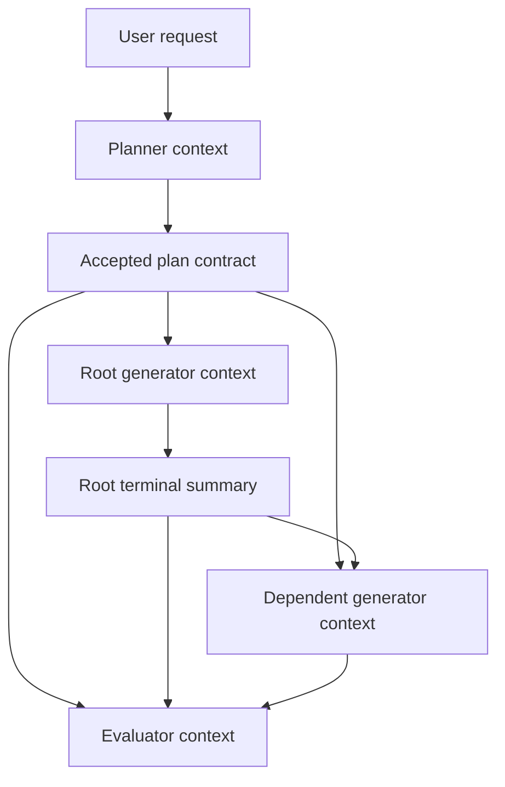
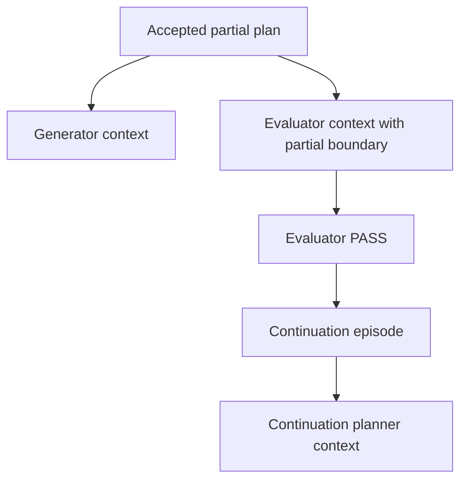
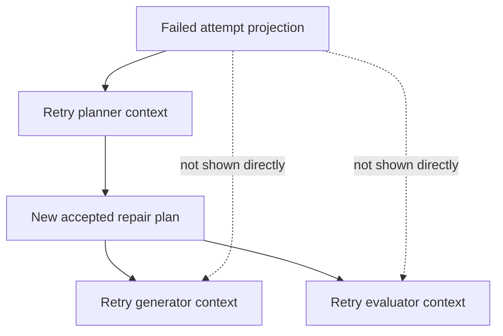
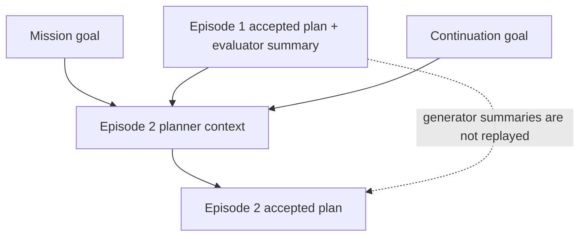
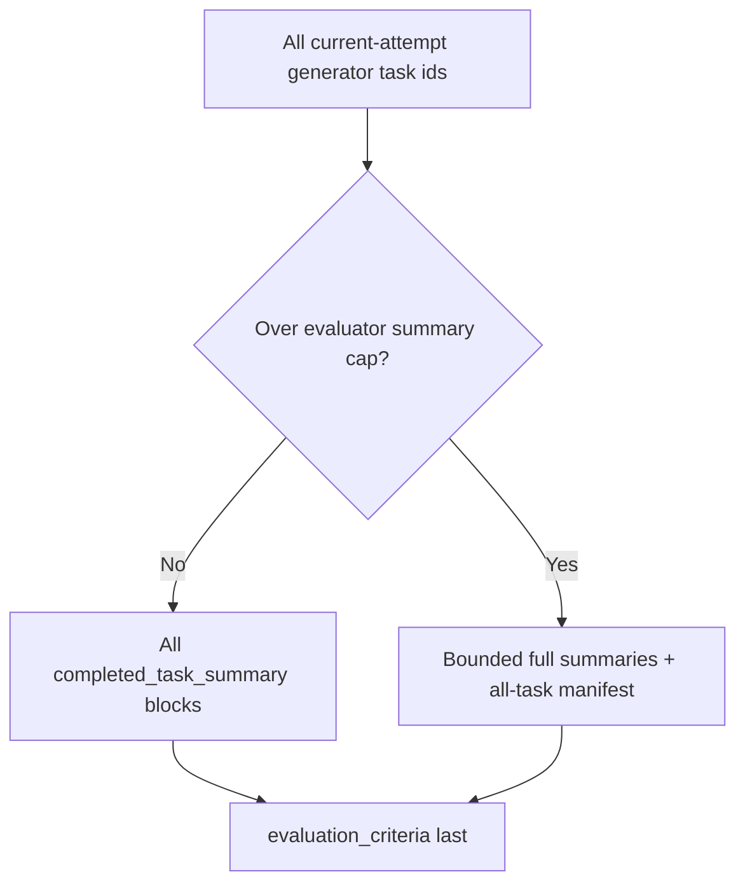

# Role Context Next Phase Report

This report defines the next phase for tightening the role-context e-commerce
example and the matching context-engine behavior. The review found that the
example already gives agents a useful picture of planner, generator, evaluator,
retry, and continuation context, but it needs a clearer split between hard
runtime gates and context-shaping prompt policy. It also needs a more explicit
summary provenance model. The review exposed one remaining scale issue:
evaluator context still receives every current-attempt generator summary without
a role-level bounding policy.

## Phase Goal

Make the role-context documentation and implementation communicate three
properties clearly:

1. Agents know what to do because each role receives the right contract for its
   authority level.
2. Drift is limited by hard harness gates where the runtime can enforce them,
   and reduced by explicit context-shaping policy where the runtime only shapes
   what an agent sees.
3. Context growth is bounded where previous attempt history is projected, and
   evaluator-scale behavior is either bounded or intentionally documented as
   unbounded.

The phase is complete when a reader can inspect the e-commerce example and tell
which facts are submitted by agents, which facts are derived by the context
engine, which boundaries are hard runtime gates, which boundaries are prompt
composition policy, and which large-context cases remain intentionally accepted.

## Findings To Close

| Finding | Current state | Next-phase action |
|---|---|---|
| Evaluator context can grow without a cap | `evaluator_v1` renders every id in `attempt.generator_task_ids` as `completed_task_summary`. | Implement bounded evaluator projection: keep small DAG behavior unchanged, but use verifier-first full summaries, boundary executor summaries, and an all-task manifest for large DAGs. |
| Verifier selection seam is implicit | Bounded evaluator projection needs to know which generator tasks were verifier-profile tasks, but context recipes currently receive stores, not agent registry objects. | Add a narrow agent-role lookup seam to `ContextEngineDeps` or persist resolved agent role on task rows before implementing verifier-first selection. Do not import global agent registries inside recipe code. |
| Hard gates and prompt policy are blurred | The e-commerce example shows rendered context but does not distinguish schema/lifecycle invariants from recipe ordering and omission policy. | Add a "Runtime Gates And Context Policies Represented By This Example" section to the example, with separate tables for enforceable gates and prompt-shaping policy. |
| Summary provenance is implicit | Example summaries are realistic, but the doc does not state where each summary comes from. | Add a summary provenance table that traces planner contract, generator summaries, dependency summaries, evaluator results, failed-attempt summaries, and continuation summaries. |
| A retry-planner lesson row is stale | The dependency lessons say the retry planner sees failed plan, criteria, and fail reason, but it now also sees `plan_kind`, `continuation_goal`, and capped generator summaries. | Update that row to match the current failed-attempt landscape. |
| Adjacent docs still describe missing deps as silently skipped | Current `generator_v1` raises context assembly failure when a dependency task row is missing, but older prose in `role-generator.md` and `context-engine-recipes.md` still says missing dependency rows are skipped. | Include those stale-doc fixes in the same documentation pass so the report does not create a new contradiction. |

## Target Agent Picture

The next version should preserve the current role split:

| Role | What the role should know | What the role should not need |
|---|---|---|
| Planner, first attempt | Mission or current episode goal, prior successful episode summaries if any, and failed-attempt landscape only on retry. | Raw generator logs, live filesystem state, or evaluator internals. |
| Generator | Attempt-level task specification, summaries for direct dependencies, and its own assigned task spec. | Failed-attempt history, sibling task specs, full criteria, continuation goal, or unrelated dependency logs. |
| Evaluator | Mission/episode frame, current attempt plan, partial boundary if present, current attempt dependency results, and criteria last. | Failed-attempt landscape or future continuation work. |
| Retry planner | Current episode goal plus failed-attempt projection: plan kind, continuation goal, task specification, criteria, capped generator summaries, and fail reason. | Full historical work logs or all artifact payloads. |
| Continuation planner | New episode goal plus prior accepted episode plan and evaluator pass summary. | All prior episode generator summaries. |

This division is the main anti-drift shape. The planner owns scope and criteria,
generators own local execution, the evaluator owns one binary judgment, and a
retry planner owns repair scope after a failure. Some of this is enforced by
runtime validation; some is context minimization that reduces the chance of a
role drifting into another role's authority.

## Context Shapes By Scenario

The e-commerce example should show context as role-specific packets, not as one
shared context blob. Each scenario should include both a workflow diagram and a
literal packet-order block sequence so readers can see exactly what lands in the
rendered prompt.

Important naming note: for episode 1, the internal block kind is
`episode_goal`, but the renderer heading is `# Mission / Current Episode`.
That block is the mission/current-episode frame. Planners and evaluators are not
missing the mission goal in episode 1; it is collapsed into that single block.
Only generators intentionally omit mission/episode framing.

### Scenario 1: First Attempt In The First Episode

The first planner receives only the mission/current-episode goal. Once it
submits a plan, generators and the evaluator receive accepted fields projected
through their own recipes, not the planner's reasoning.



Planner packet:

```text
Final block sequence (planner_v1, packet order):
  [0] episode_goal (mission/current episode)         REQUIRED  heading=# Mission / Current Episode
```

Root generator packet:

```text
Final block sequence (generator_v1, packet order):
  [0] task_specification                             HIGH      heading=# Attempt Plan
  [1] planned_task_spec        (gen-db-contracts)    REQUIRED  heading=# Assigned Task
```

Dependent generator packet:

```text
Final block sequence (generator_v1, packet order):
  [0] task_specification                             HIGH      heading=# Attempt Plan
  [1] dependency_summary       (gen-db-contracts)    MEDIUM    group=# Dependency Results
  [2] planned_task_spec        (gen-product-api)     REQUIRED  heading=# Assigned Task
```

Evaluator packet:

```text
Final block sequence (evaluator_v1, packet order):
  [0] episode_goal (mission/current episode)         REQUIRED  heading=# Mission / Current Episode
  [1] task_specification                             REQUIRED  heading=# Attempt Plan
  [2] completed_task_summary   (gen-db-contracts)    HIGH      group=# Dependency Results
  [3] completed_task_summary   (gen-product-api)     HIGH      group=# Dependency Results
  [...]
  [N] evaluation_criteria                            REQUIRED  heading=# Evaluation Criteria
```

### Scenario 2: Partial Attempt

A partial plan changes evaluator context and later continuation-planner context.
It does not change generator context: generators still see the attempt plan,
dependency summaries, and assigned task.



Generator packet:

```text
Final block sequence (generator_v1, packet order):
  [0] task_specification                             HIGH      heading=# Attempt Plan
  [1] dependency_summary       (direct dependency)   MEDIUM    group=# Dependency Results
  [2] planned_task_spec        (assigned task)       REQUIRED  heading=# Assigned Task
```

Evaluator packet:

```text
Final block sequence (evaluator_v1, packet order):
  [0] episode_goal (mission/current episode)         REQUIRED  heading=# Mission / Current Episode
  [1] task_specification                             REQUIRED  heading=# Attempt Plan
  [2] partial_plan_boundary                          REQUIRED  heading=# Partial Plan Boundary
  [3] completed_task_summary   (gen-*)               HIGH      group=# Dependency Results
  [...]
  [N] evaluation_criteria                            REQUIRED  heading=# Evaluation Criteria
```

Continuation planner packet:

```text
Final block sequence (planner_v1, packet order):
  [0] mission_goal                                   REQUIRED  heading=# Mission
  [1] prior_episode_specification (Ep#1)             HIGH      group=# Previous Episode Results
  [2] prior_episode_summary       (Ep#1)             HIGH      group=# Previous Episode Results
  [3] episode_goal                (Ep#2, current)    REQUIRED  heading=# Current Episode
```

### Scenario 3: Retry After A Failed Attempt

Failed-attempt history belongs to the retry planner. The new generators and
evaluator only see the new attempt contract unless the retry planner copies
relevant facts into the new task specs or plan.

Read the retry planner packet as: current episode goal first, then failed
attempts that occurred while trying to satisfy that same current episode. The
failed-attempt landscape is evidence for repair; it does not replace the episode
goal.



Retry planner packet:

```text
Final block sequence (planner_v1, packet order):
  [0] episode_goal (mission/current retry scope)     REQUIRED  heading=# Mission / Current Episode
  [1] failed_attempt_landscape (Attempt#1 in Ep#1)   HIGH      group=# Failed Attempts
  [2] failed_attempt_landscape (Attempt#2 in Ep#1)   HIGH      group=# Failed Attempts
```

Retry generator packet:

```text
Final block sequence (generator_v1, packet order):
  [0] task_specification          (retry attempt)    HIGH      heading=# Attempt Plan
  [1] dependency_summary          (new dependency)   MEDIUM    group=# Dependency Results
  [2] planned_task_spec           (new task)         REQUIRED  heading=# Assigned Task
```

Retry evaluator packet:

```text
Final block sequence (evaluator_v1, packet order):
  [0] episode_goal (mission/current episode)         REQUIRED  heading=# Mission / Current Episode
  [1] task_specification          (retry attempt)    REQUIRED  heading=# Attempt Plan
  [2] completed_task_summary      (retry gen-*)      HIGH      group=# Dependency Results
  [...]
  [N] evaluation_criteria         (retry criteria)   REQUIRED  heading=# Evaluation Criteria
```

### Scenario 4: Continuation Episode

Continuation carries forward episode-level closure, not every task-level detail.
The next planner sees the prior accepted plan and evaluator pass summary, then
plans against the new current episode goal.



Continuation planner packet:

```text
Final block sequence (planner_v1, packet order):
  [0] mission_goal                                   REQUIRED  heading=# Mission
  [1] prior_episode_specification (Ep#1)             HIGH      group=# Previous Episode Results
  [2] prior_episode_summary       (Ep#1)             HIGH      group=# Previous Episode Results
  [3] episode_goal                (Ep#2, current)    REQUIRED  heading=# Current Episode
```

If episode 2 itself later retries, the failed-attempt landscape is appended
after the current episode goal. The ordering makes the scope explicit: the
planner first sees the mission and prior accepted work, then the current episode
retry scope, then failed attempts from that same current episode.

```text
Final block sequence (planner_v1, packet order):
  [0] mission_goal                                   REQUIRED  heading=# Mission
  [1] prior_episode_specification (Ep#1)             HIGH      group=# Previous Episode Results
  [2] prior_episode_summary       (Ep#1)             HIGH      group=# Previous Episode Results
  [3] episode_goal (Ep#2 current retry scope)        REQUIRED  heading=# Current Episode
  [4] failed_attempt_landscape (Attempt#1 in Ep#2)   HIGH      group=# Failed Attempts
  [5] failed_attempt_landscape (Attempt#2 in Ep#2)   HIGH      group=# Failed Attempts
```

### Scenario 5: Large Evaluator Context

The current implementation renders every current-attempt generator summary. If
the next phase implements bounded evaluator projection, the packet should still
make every task visible through a manifest while limiting full prose blocks.



Current evaluator packet:

```text
Final block sequence (evaluator_v1, packet order):
  [0] episode_goal (mission/current episode)         REQUIRED  heading=# Mission / Current Episode
  [1] task_specification                             REQUIRED  heading=# Attempt Plan
  [2] completed_task_summary   (gen-1)               HIGH      group=# Dependency Results
  [3] completed_task_summary   (gen-2)               HIGH      group=# Dependency Results
  [...]
  [N-1] completed_task_summary (gen-N)               HIGH      group=# Dependency Results
  [N] evaluation_criteria                            REQUIRED  heading=# Evaluation Criteria
```

Proposed bounded evaluator packet:

```text
Final block sequence (evaluator_v1 bounded, packet order):
  [0] episode_goal (mission/current episode)         REQUIRED  heading=# Mission / Current Episode
  [1] task_specification                             REQUIRED  heading=# Attempt Plan
  [2] completed_task_summary   (selected verifier)   HIGH      group=# Dependency Results
  [3] completed_task_summary   (boundary executor)   HIGH      group=# Dependency Results
  [4] completed_task_manifest  (all generator ids)   HIGH      group=# Dependency Results
  [5] evaluation_criteria                            REQUIRED  heading=# Evaluation Criteria
```

## Runtime Gates And Context Policies To Document

The e-commerce example should include a short section that maps visible context
shape to either a hard runtime gate or an explicit prompt-composition policy.
Do not describe context omission or block ordering as enforcement unless the
runtime rejects or blocks the invalid state.

### Hard runtime gates

| Gate | Runtime effect | Why it prevents drift |
|---|---|---|
| Planner terminal schema | Requires nonblank `task_specification`, nonblank `evaluation_criteria`, nonempty `tasks`, and matching `task_specs`. | The planner cannot submit vague work or orphan task specs. |
| Planner DAG validation | Rejects duplicate ids, unknown generator agents, unknown deps, and dependency cycles. | The execution graph is dispatchable before generators launch. |
| Missing dependency invariant | A missing dependency task row raises context assembly failure. | The harness does not silently launch a generator with truncated dependency context. |
| Attempt retry lifecycle | Failed generator or evaluator outcomes close the current attempt and start a new planner when budget remains. | Repair scope is re-authored by a planner instead of improvised by a worker or evaluator. |

### Context-shaping policies

| Policy | Rendered effect | Why it reduces drift |
|---|---|---|
| Generator context recipe | Emits attempt spec, direct dependency summaries, and the assigned task spec only. | A generator is not invited to reason about sibling work unless the planner encoded it into its local task or dependency summaries. |
| Evaluator partial boundary | Emits `plan_kind: partial` and `continuation_goal` for partial attempts. | The evaluator is told not to fail intentionally deferred continuation work, but the judgment remains an agent decision. |
| Evaluator criteria last | Places criteria after dependency results. | The final prompt section anchors the evaluator on the planner's accepted rubric. |
| Failed-attempt projection | Retry planner receives failed-attempt fields and capped generator summaries. | The repair plan can be narrow without replaying every prior work log. |
| Continuation summary boundary | Next episode sees prior accepted plan and evaluator pass summary. | Cross-episode reuse depends on deliberate close summaries, not context sprawl. |

## Summary Provenance

The next documentation pass should add this table to the example or a linked
supporting section.

| Surface | Producer | Stored as | Rendered by | Selection rule |
|---|---|---|---|---|
| Planner `task_specification` | Planner terminal call, `submit_full_plan` or `submit_partial_plan`. | Attempt plan contract. | Planner output becomes generator/evaluator framing. | Frozen for the attempt once accepted. |
| Planner `evaluation_criteria` | Planner terminal call. | Attempt plan contract. | Evaluator criteria block. | Rendered last for evaluator. |
| Planner `continuation_goal` | Planner terminal call when using partial plan. | Attempt plan contract and later episode continuation goal. | Evaluator partial boundary, retry planner failed-attempt landscape, next episode goal after pass. | Present only for partial attempts. |
| Generator task summary | Generator terminal success/failure submission. | Task row `summaries[]`, appended as `{outcome, summary, payload}`. | Dependency summaries, evaluator dependency results, failed-attempt generator summaries. | Latest summary entry only; `summary` is preferred over `outcome`. |
| Generator dependency summary | Context-engine projection from direct `needs`. | Not separately stored. | Generator recipe. | One latest summary per direct dependency. |
| Evaluator pass/fail summary | Evaluator terminal success/failure submission. | Evaluator task row `summaries[]`, appended as `{outcome, summary, payload}`. | Episode close summary, retry failure reason surface. | Latest evaluator summary for the attempt. |
| Failed-attempt generator summaries | Context-engine projection from a failed attempt's generator task ids. | Not separately stored. | Planner recipe through failed-attempt landscape. | Capped first/last task ids, each summary truncated. |
| Continuation episode summary | Episode close path. | Episode row `task_summary`, derived from evaluator pass summary. | Planner recipe for later episodes. | Does not include every prior generator summary. |

The important distinction is that summaries are agent-authored terminal outputs,
but dependency, evaluator, retry, and continuation surfaces are context-engine
projections of those stored summaries.

## Evaluator Context Bound Decision

The current evaluator behavior is simple and high-recall: render every current
attempt generator summary. That is acceptable for small DAGs like the
e-commerce example, but it is the only remaining role surface in this flow that
can grow linearly with the full attempt graph.

Next-phase decision: implement bounded evaluator projection in `evaluator_v1`.
Docs-only clarification is not enough because the current recipe can still
overrun prompt budget on wide attempts and the renderer cannot drop REQUIRED or
HIGH evaluator blocks.

Proposed policy:

1. Always render the mission/episode frame, attempt plan, partial boundary, and
   evaluation criteria.
2. If the attempt has at most `MAX_EVALUATOR_FULL_SUMMARIES` generator tasks,
   render every generator summary as today.
3. If the attempt exceeds that limit, render:
   - up to `MAX_EVALUATOR_VERIFIER_FULL_SUMMARIES` verifier task summaries by
     planned order, prioritizing final aggregate verifier nodes when present;
   - first and last executor summaries by planned order, each capped by
     `MAX_EVALUATOR_EXECUTOR_BOUNDARY_SUMMARIES`;
   - a compact manifest line for every omitted generator task with task id,
     agent name, local status, and a short summary excerpt;
   - explicit omitted-count markers for verifier and executor prose.
4. Keep criteria last.

This avoids blind truncation. The evaluator still sees every task id and a
short signal for every omitted task, while full prose is reserved for a bounded
set of verifier summaries and boundary summaries most likely to contain
aggregate evidence.

Verifier detection must be explicit. The structural task role is `generator` for
both executors and verifiers, and task rows currently store `agent_name`, not the
resolved profile role. The implementation should choose one narrow seam before
adding summary selection:

1. Preferred low-schema-change path: add an optional agent-role lookup protocol
   to `ContextEngineDeps`, for example a `role_for_agent(agent_name)` method
   returning `str | None`, wired by the launch/composer layer from registered
   `AgentDefinition` objects and stubbed directly in recipe tests.
2. Acceptable persistence path: persist the resolved `AgentDefinition.role` on
   each generator task row when planner submissions are accepted.

Do not let `recipes/evaluator.py` import the global agent registry directly.
Terminal payloads such as `payload.generator_role` can remain fallback evidence,
but they should not drive selection because they are submitted after the task
runs.

## Implementation Plan

1. Patch `role-context-ecommerce-example.md`.
   - Add "Context Shapes By Scenario" with diagrams and literal "Final block
     sequence (in packet order)" examples for first attempt, partial attempt,
     retry, continuation, and large evaluator contexts.
   - Add "Runtime Gates And Context Policies Represented By This Example" after
     the element dependency ledger.
   - Keep hard runtime gates separate from context-shaping policies; do not say a
     recipe ordering or omitted block "prevents" behavior unless runtime rejects
     the invalid state.
   - Add "How Each Summary Is Obtained" near the evaluator or dependency lesson
     section.
   - Fix the retry-planner lesson row to include `plan_kind`,
     `continuation_goal`, and capped generator summaries.
   - Fix the missing-dependency prose in `role-generator.md` and
     `context-engine-recipes.md` so both say current `generator_v1` raises a
     context assembly error instead of silently skipping missing dependency
     rows.

2. Implement evaluator context bounding.
   - Add the verifier-role seam first: either a narrow `ContextEngineDeps`
     protocol for `agent_name` -> role lookup, or a persisted resolved agent role
     on generator task rows.
   - Add evaluator summary selection helpers and constants:
     `MAX_EVALUATOR_FULL_SUMMARIES`,
     `MAX_EVALUATOR_VERIFIER_FULL_SUMMARIES`,
     `MAX_EVALUATOR_EXECUTOR_BOUNDARY_SUMMARIES`, and
     `MAX_EVALUATOR_MANIFEST_EXCERPT_CHARS`.
   - Preserve current behavior when the generator-task count is less than or
     equal to `MAX_EVALUATOR_FULL_SUMMARIES`.
   - For large attempts, render selected full `completed_task_summary` blocks,
     a compact `completed_task_manifest` block covering every generator task, and
     explicit omitted-count markers.
   - Keep `evaluation_criteria` last and keep `partial_plan_boundary` before
     dependency results.
   - Add direct tests for small, large, verifier-heavy, executor-heavy,
     all-executor, partial-plan, and missing-task-row attempts.

3. Keep generator boundaries unchanged.
   - Do not add partial-plan boundary, continuation goal, failed-attempt
     landscape, or full criteria to generator context.
   - Ensure any new summary provenance prose does not imply generators receive
     artifact payloads or raw logs.

4. Update role docs after code policy lands.
   - `role-evaluator.md`: bounded current-attempt summary policy, manifest
     semantics, and partial boundary.
   - `role-planner.md`: failed-attempt planner receives summary projection, not
     full work logs.
   - `role-generator.md`: dependency summaries are latest prose summaries only.
   - `context-engine-recipes.md`: block kinds, role-lookup seam, manifest, and
     caps.

5. Verify.
   - Run focused context-engine tests.
   - Run ruff on touched backend files if code changes are made.
   - Run `git diff --check` for docs-only or mixed patches.

## Acceptance Criteria

- The e-commerce example explains rendered role context, hard runtime gates, and
  context-shaping policies without presenting prompt policy as enforcement.
- The example displays final packet block sequences in aligned, indexed order
  for each major role/scenario.
- The example contains a summary provenance table that answers how every shown
  summary was produced, stored, selected, and rendered.
- Retry planner documentation matches the current failed-attempt landscape:
  `plan_kind`, `continuation_goal`, task specification, criteria, capped
  generator summaries, and failure reason.
- Generator context remains narrow and does not receive the partial-plan
  boundary.
- `role-generator.md` and `context-engine-recipes.md` no longer say missing
  dependency task rows are silently skipped.
- Evaluator context scale behavior is code-backed and tested: small DAGs keep
  current all-summary behavior; large DAGs use bounded full summaries plus an
  all-task manifest.
- Verifier-first evaluator selection is based on a documented role seam
  (`agent_name` -> resolved agent role or persisted resolved role), not global
  registry access from recipe code or post-run terminal payloads.
- Focused tests cover small, large, verifier-heavy, executor-heavy, all-executor,
  partial-plan, missing dependency, and missing generator-task rows.

## Risks

| Risk | Mitigation |
|---|---|
| Evaluator cap hides a critical failed fact. | Use an all-task manifest and bounded verifier-first full prose before omitting executor prose. |
| Verifier detection couples recipes to agent globals. | Add a narrow role lookup protocol to `ContextEngineDeps` or persist resolved role on task rows; keep registry access outside recipe code. |
| Docs imply stronger gates than runtime has. | Separate hard runtime gates from context-shaping policy and link every hard gate claim to schema, lifecycle, or store behavior. |
| Summary provenance becomes another stale explanation. | Keep the table field-oriented and aligned to terminal submissions plus context-engine projections. |
| Retry planner receives too much history. | Keep failed-attempt generator summaries capped and make the omission explicit. |
| Continuation planner misses reusable contracts. | Require evaluator pass summaries to preserve route names, ids, env vars, formulas, and accepted exclusions. |
