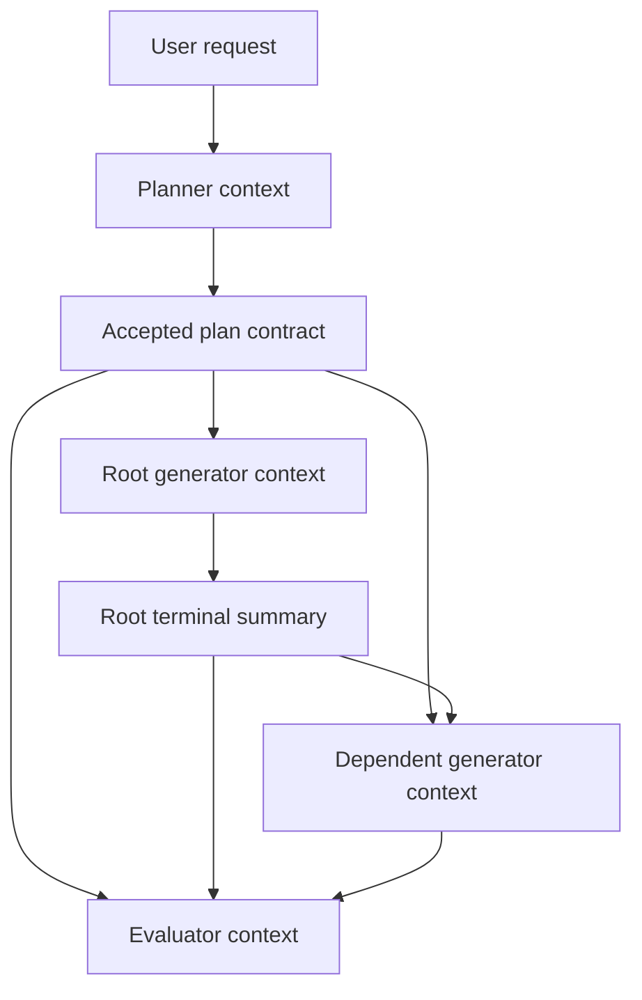
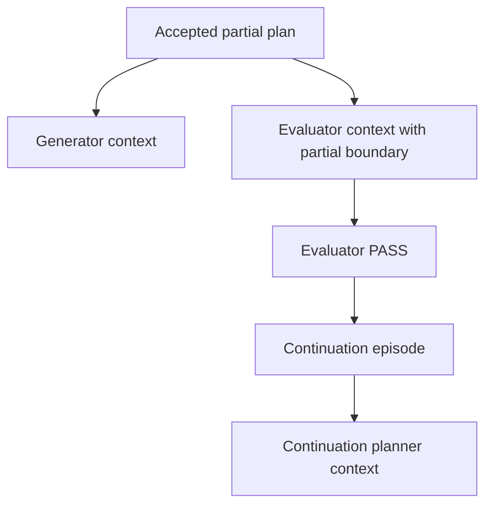
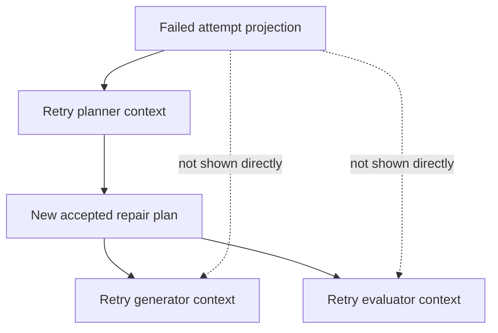
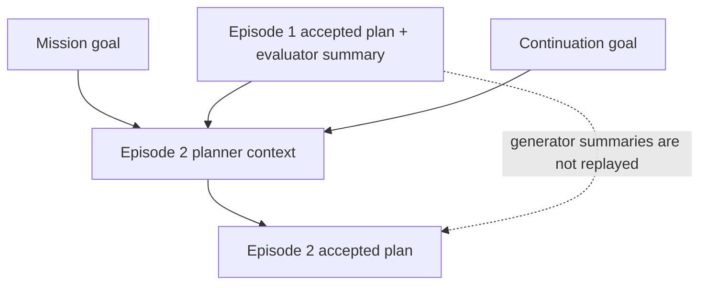
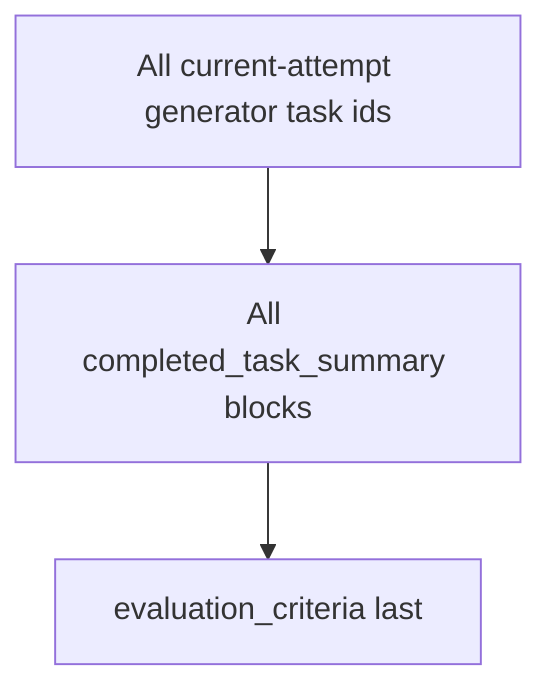

# Role Context Next Phase Report

This report defines the next phase for tightening the role-context e-commerce
example and the matching context-engine behavior. The review found that the
example already gives agents a useful picture of planner, generator, evaluator,
retry, and continuation context, but it needs a clearer split between hard
runtime gates and context-shaping prompt behavior. It also needs a more explicit
summary provenance model. The review exposed one scale choice to document:
evaluator context intentionally receives every current-attempt generator summary,
and this phase should preserve that high-recall behavior instead of adding
summary caps.

## Phase Goal

Make the role-context documentation and implementation communicate three
properties clearly:

1. Agents know what to do because each role receives the right contract for its
   authority level.
2. Drift is limited by hard harness gates where the runtime can enforce them,
   and reduced by explicit context-shaping behavior where the runtime only shapes
   what an agent sees.
3. Context growth is explicit where previous attempt history is projected, and
   evaluator-scale behavior is intentionally documented as all-summary rather
   than capped.

The phase is complete when a reader can inspect the e-commerce example and tell
which facts are submitted by agents, which facts are derived by the context
engine, which boundaries are hard runtime gates, which boundaries are prompt
composition behavior, and which large-context cases remain intentionally
accepted.

## Findings To Close

| Finding | Current state | Next-phase action |
|---|---|---|
| Evaluator context must stay uncapped | `evaluator_v1` renders every id in `attempt.generator_task_ids` as `completed_task_summary`. | Preserve this all-summary behavior. Do not add verifier-prioritized selection, boundary-summary selection, hidden-omission markers, or an all-task manifest. |
| Verifier selection seam is unnecessary | Summary-count restriction would require knowing verifier-profile tasks, but the desired behavior renders all summaries. | Do not add an agent-role lookup seam to `ContextEngineDeps` and do not persist resolved agent role only for evaluator selection. |
| Hard gates and prompt policy are blurred | The e-commerce example shows rendered context but does not distinguish schema/lifecycle invariants from recipe ordering and omission policy. | Add a "Runtime Gates And Context Policies Represented By This Example" section to the example, with separate tables for enforceable gates and prompt-shaping policy. |
| Summary provenance is implicit | Example summaries are realistic, but the doc does not state where each summary comes from. | Add a summary provenance table that traces planner contract, generator summaries, dependency summaries, evaluator results, failed-attempt outcomes, and continuation summaries. |
| Retry failed-attempt framing is too raw | The older failed-attempt landscape used raw fields such as `plan_kind`, `generator_summaries`, and `fail_reason`. | Use the [[failed-attempt-context-framing-implementation-plan]] frame: `Accepted Plan`, `Generator Outcomes`, and `Evaluator Judgment` when an evaluator ran. |
| Adjacent docs need the missing-dependency invariant | Current `generator_v1` raises context assembly failure when a dependency task row is missing, so `role-generator.md` and `context-engine-recipes.md` must not describe missing dependency rows as skipped. | Include those stale-doc fixes in the same documentation pass so the report does not create a new contradiction. |

## Target Agent Picture

The next version should preserve the current role split:

| Role | What the role should know | What the role should not need |
|---|---|---|
| Planner, first attempt | Mission or current episode goal, prior successful episode summaries if any, and failed-attempt landscape only on retry. | Raw generator logs, live filesystem state, or evaluator internals. |
| Generator | Attempt-level task specification, summaries for direct dependencies, and its own assigned task spec. | Failed-attempt history, sibling task specs, full criteria, continuation goal, or unrelated dependency logs. |
| Evaluator | Mission/episode frame, current attempt plan, partial boundary if present, current attempt dependency results, and criteria last. | Failed-attempt landscape or future continuation work. |
| Retry planner | Current episode goal plus prior failed-attempt projection: accepted plan, generator outcome status summary, useful generator summaries, and evaluator criteria/summary only when an evaluator ran. | Full historical work logs, all artifact payloads, default continuation-goal replay, or a separate failure-reason section. |
| Continuation planner | New episode goal plus prior accepted episode plan and evaluator pass summary. | All prior episode generator summaries. |

This division is the main anti-drift shape. The planner owns scope and criteria,
generators own local execution, the evaluator owns one binary judgment, and a
retry planner owns repair scope after a failure. Some of this is enforced by
runtime validation; some is context minimization that reduces the chance of a
role drifting into another role's authority.

## Context Shapes By Scenario

The e-commerce example should show context as role-specific packets, not as one
shared context blob. Each scenario should include both a workflow diagram and a
literal packet-order block sequence so readers can see exactly what lands in the
rendered prompt.

Important naming note: for episode 1, the internal block kind is
`episode_goal`, but the renderer heading is `# Mission / Current Episode`.
That block is the mission/current-episode frame. Planners and evaluators are not
missing the mission goal in episode 1; it is collapsed into that single block.
Only generators intentionally omit mission/episode framing.

### Scenario 1: First Attempt In The First Episode

The first planner receives only the mission/current-episode goal. Once it
submits a plan, generators and the evaluator receive accepted fields projected
through their own recipes, not the planner's reasoning.



Planner packet:

```text
Final block sequence (planner_v1, packet order):
  [0] episode_goal (mission/current episode)         REQUIRED  heading=# Mission / Current Episode
```

Root generator packet:

```text
Final block sequence (generator_v1, packet order):
  [0] task_specification                             HIGH      heading=# Attempt Plan
  [1] planned_task_spec        (gen-db-contracts)    REQUIRED  heading=# Assigned Task
```

Dependent generator packet:

```text
Final block sequence (generator_v1, packet order):
  [0] task_specification                             HIGH      heading=# Attempt Plan
  [1] dependency_summary       (gen-db-contracts)    MEDIUM    group=# Dependency Results
  [2] planned_task_spec        (gen-product-api)     REQUIRED  heading=# Assigned Task
```

Evaluator packet:

```text
Final block sequence (evaluator_v1, packet order):
  [0] episode_goal (mission/current episode)         REQUIRED  heading=# Mission / Current Episode
  [1] task_specification                             REQUIRED  heading=# Attempt Plan
  [2] completed_task_summary   (gen-db-contracts)    HIGH      group=# Dependency Results
  [3] completed_task_summary   (gen-product-api)     HIGH      group=# Dependency Results
  [...]
  [N] evaluation_criteria                            REQUIRED  heading=# Evaluation Criteria
```

### Scenario 2: Partial Attempt

A partial plan changes evaluator context and later continuation-planner context.
It does not change generator context: generators still see the attempt plan,
dependency summaries, and assigned task.



Generator packet:

```text
Final block sequence (generator_v1, packet order):
  [0] task_specification                             HIGH      heading=# Attempt Plan
  [1] dependency_summary       (direct dependency)   MEDIUM    group=# Dependency Results
  [2] planned_task_spec        (assigned task)       REQUIRED  heading=# Assigned Task
```

Evaluator packet:

```text
Final block sequence (evaluator_v1, packet order):
  [0] episode_goal (mission/current episode)         REQUIRED  heading=# Mission / Current Episode
  [1] task_specification                             REQUIRED  heading=# Attempt Plan
  [2] partial_plan_boundary                          REQUIRED  heading=# Partial Plan Boundary
  [3] completed_task_summary   (gen-*)               HIGH      group=# Dependency Results
  [...]
  [N] evaluation_criteria                            REQUIRED  heading=# Evaluation Criteria
```

Continuation planner packet:

```text
Final block sequence (planner_v1, packet order):
  [0] mission_goal                                   REQUIRED  heading=# Mission
  [1] prior_episode_specification (Ep#1)             HIGH      group=# Previous Episode Results
  [2] prior_episode_summary       (Ep#1)             HIGH      group=# Previous Episode Results
  [3] episode_goal                (Ep#2, current)    REQUIRED  heading=# Current Episode
```

### Scenario 3: Retry After A Failed Attempt

Failed-attempt history belongs to the retry planner. The new generators and
evaluator only see the new attempt contract unless the retry planner copies
relevant facts into the new task specs or plan.

Read the retry planner packet as: current episode goal first, then prior failed
attempts that occurred while trying to satisfy that same current episode. Each
failed attempt is framed as accepted plan, generator outcomes, and evaluator
judgment when an evaluator ran; it does not replace the episode goal.



Retry planner packet:

```text
Final block sequence (planner_v1, packet order):
  [0] episode_goal (mission/current retry scope)     REQUIRED  heading=# Mission / Current Episode
  [1] failed_attempt_landscape (Attempt#1 in Ep#1)   HIGH      group=# Prior Failed Attempts
  [2] failed_attempt_landscape (Attempt#2 in Ep#1)   HIGH      group=# Prior Failed Attempts
```

Retry generator packet:

```text
Final block sequence (generator_v1, packet order):
  [0] task_specification          (retry attempt)    HIGH      heading=# Attempt Plan
  [1] dependency_summary          (new dependency)   MEDIUM    group=# Dependency Results
  [2] planned_task_spec           (new task)         REQUIRED  heading=# Assigned Task
```

Retry evaluator packet:

```text
Final block sequence (evaluator_v1, packet order):
  [0] episode_goal (mission/current episode)         REQUIRED  heading=# Mission / Current Episode
  [1] task_specification          (retry attempt)    REQUIRED  heading=# Attempt Plan
  [2] completed_task_summary      (retry gen-*)      HIGH      group=# Dependency Results
  [...]
  [N] evaluation_criteria         (retry criteria)   REQUIRED  heading=# Evaluation Criteria
```

### Scenario 4: Continuation Episode

Continuation carries forward episode-level closure, not every task-level detail.
The next planner sees the prior accepted plan and evaluator pass summary, then
plans against the new current episode goal.



Continuation planner packet:

```text
Final block sequence (planner_v1, packet order):
  [0] mission_goal                                   REQUIRED  heading=# Mission
  [1] prior_episode_specification (Ep#1)             HIGH      group=# Previous Episode Results
  [2] prior_episode_summary       (Ep#1)             HIGH      group=# Previous Episode Results
  [3] episode_goal                (Ep#2, current)    REQUIRED  heading=# Current Episode
```

If episode 2 itself later retries, prior failed-attempt projections are appended
after the current episode goal. The ordering makes the scope explicit: the
planner first sees the mission and prior accepted work, then the current episode
retry scope, then failed attempts from that same current episode.

```text
Final block sequence (planner_v1, packet order):
  [0] mission_goal                                   REQUIRED  heading=# Mission
  [1] prior_episode_specification (Ep#1)             HIGH      group=# Previous Episode Results
  [2] prior_episode_summary       (Ep#1)             HIGH      group=# Previous Episode Results
  [3] episode_goal (Ep#2 current retry scope)        REQUIRED  heading=# Current Episode
  [4] failed_attempt_landscape (Attempt#1 in Ep#2)   HIGH      group=# Prior Failed Attempts
  [5] failed_attempt_landscape (Attempt#2 in Ep#2)   HIGH      group=# Prior Failed Attempts
```

### Scenario 5: Large Evaluator Context

The current and target implementation renders every current-attempt generator
summary. Large attempts can therefore produce large evaluator packets. That is
intentional: the evaluator is the role responsible for judging the complete
current attempt, so the context engine should not silently omit summaries or
replace them with a manifest.



Evaluator packet:

```text
Final block sequence (evaluator_v1, packet order):
  [0] episode_goal (mission/current episode)         REQUIRED  heading=# Mission / Current Episode
  [1] task_specification                             REQUIRED  heading=# Attempt Plan
  [2] completed_task_summary   (gen-1)               HIGH      group=# Dependency Results
  [3] completed_task_summary   (gen-2)               HIGH      group=# Dependency Results
  [...]
  [N-1] completed_task_summary (gen-N)               HIGH      group=# Dependency Results
  [N] evaluation_criteria                            REQUIRED  heading=# Evaluation Criteria
```

## Runtime Gates And Context Policies To Document

The e-commerce example should include a short section that maps visible context
shape to either a hard runtime gate or an explicit prompt-composition policy.
Do not describe context omission or block ordering as enforcement unless the
runtime rejects or blocks the invalid state.

### Hard runtime gates

| Gate | Runtime effect | Why it prevents drift |
|---|---|---|
| Planner terminal schema | Requires nonblank `task_specification`, nonblank `evaluation_criteria`, nonempty `tasks`, and matching `task_specs`. | The planner cannot submit vague work or orphan task specs. |
| Planner DAG validation | Rejects duplicate ids, unknown generator agents, unknown deps, and dependency cycles. | The execution graph is dispatchable before generators launch. |
| Missing dependency invariant | A missing dependency task row raises context assembly failure. | The harness does not silently launch a generator with truncated dependency context. |
| Attempt retry lifecycle | Failed generator or evaluator outcomes close the current attempt and start a new planner when budget remains. | Repair scope is re-authored by a planner instead of improvised by a worker or evaluator. |

### Context-shaping policies

| Policy | Rendered effect | Why it reduces drift |
|---|---|---|
| Generator context recipe | Emits attempt spec, direct dependency summaries, and the assigned task spec only. | A generator is not invited to reason about sibling work unless the planner encoded it into its local task or dependency summaries. |
| Evaluator partial boundary | Emits `plan_kind: partial` and `continuation_goal` for partial attempts. | The evaluator is told not to fail intentionally deferred continuation work, but the judgment remains an agent decision. |
| Evaluator criteria last | Places criteria after dependency results. | The final prompt section anchors the evaluator on the planner's accepted rubric. |
| Failed-attempt projection | Retry planner receives prior failed attempts framed as accepted plan, generator outcomes, and evaluator judgment when present. | The repair plan can be narrow without replaying raw work logs or raw failure fields. |
| Continuation summary boundary | Next episode sees prior accepted plan and evaluator pass summary. | Cross-episode reuse depends on deliberate close summaries, not context sprawl. |

## Summary Provenance

The next documentation pass should add this table to the example or a linked
supporting section.

| Surface | Producer | Stored as | Rendered by | Selection rule |
|---|---|---|---|---|
| Planner `task_specification` | Planner terminal call, `submit_full_plan` or `submit_partial_plan`. | Attempt plan contract. | Planner output becomes generator/evaluator framing. | Frozen for the attempt once accepted. |
| Planner `evaluation_criteria` | Planner terminal call. | Attempt plan contract. | Evaluator criteria block. | Rendered last for evaluator. |
| Planner `continuation_goal` | Planner terminal call when using partial plan. | Attempt plan contract and later episode continuation goal. | Evaluator partial boundary, next episode goal after pass. | Present only for partial attempts; omitted from retry failed-attempt framing by default. |
| Generator task summary | Generator terminal success/failure submission. | Task row `summaries[]`, appended as `{outcome, summary, payload}`. | Dependency summaries, evaluator dependency results, failed-attempt generator outcome details. | Latest summary entry only; `summary` is preferred over `outcome`. |
| Generator dependency summary | Context-engine projection from direct `needs`. | Not separately stored. | Generator recipe. | One latest summary per direct dependency. |
| Evaluator pass/fail summary | Evaluator terminal success/failure submission. | Evaluator task row `summaries[]`, appended as `{outcome, summary, payload}`. | Episode close summary, retry evaluator-judgment surface. | Latest evaluator summary for the attempt, rendered only when no generator failed prematurely. |
| Failed-attempt generator outcomes | Context-engine projection from a failed attempt's generator task ids and task rows. | Not separately stored. | Planner recipe through failed-attempt landscape. | Status summary for every generator task id; detailed sections only for useful stored summaries; blocked tasks stay status-only unless they recorded a real summary. |
| Continuation episode summary | Episode close path. | Episode row `task_summary`, derived from evaluator pass summary. | Planner recipe for later episodes. | Does not include every prior generator summary. |

The important distinction is that summaries are agent-authored terminal outputs,
but dependency, evaluator, retry, and continuation surfaces are context-engine
projections of those stored summaries.

## Evaluator Summary Count Decision

The current evaluator behavior is simple and high-recall: render every current
attempt generator summary. That is acceptable for small DAGs like the
e-commerce example, but it is the only remaining role surface in this flow that
can grow linearly with the full attempt graph.

Next-phase decision: keep `evaluator_v1` all-summary. Do not add
`MAX_EVALUATOR_*` constants, verifier-prioritized selection, executor boundary
selection, all-task manifests, or hidden-omission markers. The renderer should not
silently choose which HIGH judgment evidence the evaluator sees.

If a wide attempt overruns the prompt budget, treat that as an explicit
planner/attempt-size problem rather than a context-engine omission policy. The
planner can split work into smaller episodes or attempts, and the evaluator keeps
a complete view of the current attempt it is asked to judge.

Because all summaries are rendered, there is no need for evaluator-specific
verifier detection. Do not add an agent-role lookup protocol to
`ContextEngineDeps`, do not import agent registries inside recipe code, and do
not persist resolved agent roles only to support evaluator summary selection.

## Implementation Plan

1. Patch `role-context-ecommerce-example.md`.
   - Add "Context Shapes By Scenario" with diagrams and literal "Final block
     sequence (in packet order)" examples for first attempt, partial attempt,
     retry, continuation, and large evaluator contexts.
   - Add "Runtime Gates And Context Policies Represented By This Example" after
     the element dependency ledger.
   - Keep hard runtime gates separate from context-shaping policies; do not say a
     recipe ordering or omitted block "prevents" behavior unless runtime rejects
     the invalid state.
   - Add "How Each Summary Is Obtained" near the evaluator or dependency lesson
     section.
   - Fix the retry-planner lesson row to describe accepted plan, generator
     outcomes, and evaluator judgment instead of raw failure fields.
   - Fix the missing-dependency prose in `role-generator.md` and
     `context-engine-recipes.md` so both say current `generator_v1` raises a
     context assembly error instead of skipping missing dependency rows without
     an error.

2. Preserve all-summary context projections.
   - Keep `evaluator_v1` rendering every task id in
     `attempt.generator_task_ids` as `completed_task_summary`.
   - Remove failed-attempt count caps and generator-summary text-length caps so
     retry planners see every failed attempt, every generator status, and every
     useful latest generator summary.
   - Do not add evaluator summary selection helpers, `MAX_EVALUATOR_*`
     constants, manifests, hidden-omission markers, or verifier role lookup seams.
   - Keep `evaluation_criteria` last and keep `partial_plan_boundary` before
     dependency results.
   - Add direct tests proving all generator statuses render, blocked tasks show
     their blocker, useful summaries render without truncation, and missing task
     rows still surface explicitly.

3. Keep generator boundaries unchanged.
   - Do not add partial-plan boundary, continuation goal, failed-attempt
     landscape, or full criteria to generator context.
   - Ensure any new summary provenance prose does not imply generators receive
     artifact payloads or raw logs.

4. Update role docs after code policy lands.
   - `role-evaluator.md`: all-summary current-attempt behavior and partial
     boundary.
   - `role-planner.md`: failed-attempt planner receives outcome projection, not
     full work logs or raw failure fields.
   - `role-generator.md`: dependency summaries are latest prose summaries only.
   - `context-engine-recipes.md`: block kinds and all-summary retry/evaluator
     projection.

5. Verify.
   - Run focused context-engine tests.
   - Run ruff on touched backend files if code changes are made.
   - Run `git diff --check` for docs-only or mixed patches.

## Acceptance Criteria

- The e-commerce example explains rendered role context, hard runtime gates, and
  context-shaping policies without presenting prompt policy as enforcement.
- The example displays final packet block sequences in aligned, indexed order
  for each major role/scenario.
- The example contains a summary provenance table that answers how every shown
  summary was produced, stored, selected, and rendered.
- Retry planner documentation matches the current failed-attempt landscape:
  `Accepted Plan`, `Generator Outcomes`, and `Evaluator Judgment` when an
  evaluator ran.
- Generator context remains narrow and does not receive the partial-plan
  boundary.
- `role-generator.md` and `context-engine-recipes.md` no longer say missing
  dependency task rows are skipped without an error.
- Evaluator context scale behavior is code-backed and tested: every
  `attempt.generator_task_ids` entry renders as a `completed_task_summary`; no
  manifest or selection layer is introduced.
- Retry-planner failed-attempt projection renders one status entry for every
  generator task id, detailed sections for useful latest summaries, and no
  synthetic blocked-task detail sections.
- Focused tests cover retry outcome projection, hidden evaluator judgment on
  generator failure, partial-plan evaluator ordering, missing dependency rows,
  and missing generator-task rows.

## Risks

| Risk | Mitigation |
|---|---|
| Wide attempts produce large evaluator prompts. | Treat that as a planner/attempt-size concern. Do not silently omit HIGH judgment evidence in the context engine. |
| Future verifier detection couples recipes to agent globals. | Avoid verifier-specific evaluator selection in this phase, so recipes do not need registry access or a new role lookup seam. |
| Docs imply stronger gates than runtime has. | Separate hard runtime gates from context-shaping policy and link every hard gate claim to schema, lifecycle, or store behavior. |
| Summary provenance becomes another stale explanation. | Keep the table field-oriented and aligned to terminal submissions plus context-engine projections. |
| Retry planner receives many summaries on a wide failed attempt. | Keep status projection explicit for every generator task and render useful summaries without hidden omission; rely on planner graph sizing rather than context-engine selection. |
| Continuation planner misses reusable contracts. | Require evaluator pass summaries to preserve route names, ids, env vars, formulas, and accepted exclusions. |
