# MPLA architecture tournament and demonstrations

> **Status: architecture draft only.** This document proposes a Stage 04.6
> decision and evidence plan. No implementation, gateway rebuild, Docker run,
> E2E test, or benchmark result is part of this draft. Historical measurements,
> derived bounds, hypotheses, and future qualification gates are kept distinct.

## Executive panel

| Field | Draft decision |
|---|---|
| Recommendation | **SITA — Segmented Indexed Transaction Authority** |
| Portable publication core | One immutable `TxnObject`, one persistent replay-index update, one final `AuthorityCommit` |
| Canonical authority | Existing v3 `RootId` + `AttributionRootId` pair |
| Physical authority | External, admitted runtime root provider; never part of canonical identity |
| Universal meaning | One semantic contract; each exact adapter qualifies before mutation |
| Forbidden globally | Reflink, FUSE, mount/namespace control by MPLA, `ioctl`, `setns`, privilege elevation, and any new admin capability |
| Hot commit boundary | One `fdatasync` when appending to an already directory-durable segment |
| Same-ID replay | Persistent copy-on-write B+ tree selected by the same `AuthorityCommit` as the new branch head |
| Zero-copy/stationarity | Never inferred from an opaque handle; requires qualified physical evidence and accounting |
| App-managed memory | `8 MiB` design ceiling; unmeasured |
| Qualification | **Draft only; not implemented or qualified** |

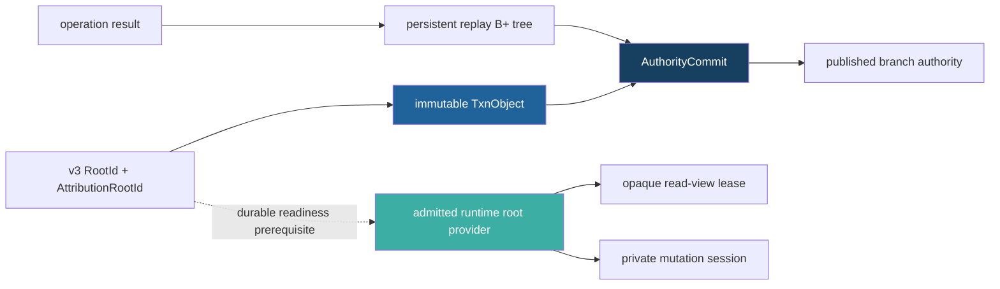

## 1. Independent architecture tournament

### 1.1 Current system diagnosis

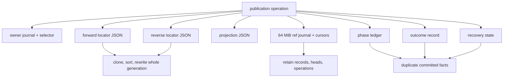

| Current property | Useful seam | Structural cost or defect |
|---|---|---|
| Canonical v3 semantic roots | Correct backend-neutral identity | Physical receipts are recopied into later control records |
| Stationary allocation adoption | Zero payload movement can be measured on an exact backend | Owner, locator, projection, operation, result, and ref stores coordinate it |
| Final paired-ref durability | Correct public-linearization intent | Roughly 90 phase/CLI ledger entries obscure one decision |
| Forward/reverse locators | Safe ownership direction | Whole-generation clone/sort/rewrite is `O(N)` per publication |
| Fixed ref journal | Bounded initial allocation | Whole histories and maps are retained in memory |
| Operation replay | Correct requirement | An old successful ID can fail after the branch advances |
| Projection receipts | Reusable activation evidence | Backend paths and allocation facts leak into publication machinery |

### 1.2 Candidate A — simplified current design


| Candidate A | Assessment |
|---|---|
| Core move | Merge owner, locator, ref, projection, outcome, and phase facts into one bounded journal |
| Strength | Smallest migration from the current implementation |
| Cost | Roughly nine conservative sync points remain |
| Failure | Placement stays coupled to reference history; indefinite replay is bounded only by journal capacity |
| Verdict | **Rejected as the final design; retained as a migration seam** |

### 1.3 Candidate B — clean-slate publication capsule

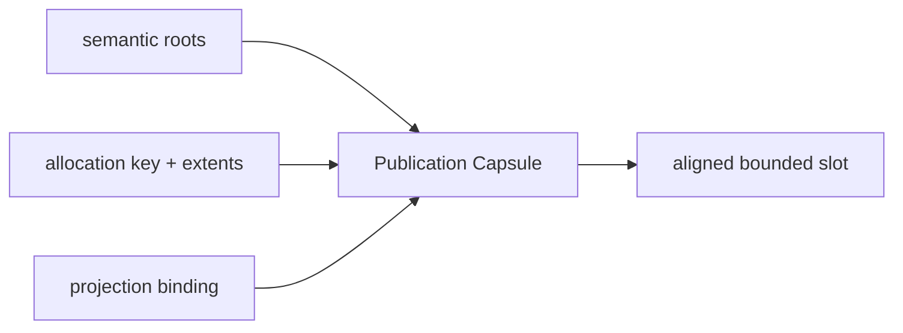

| Candidate B | Assessment |
|---|---|
| Strength | Fewest apparent control objects |
| Identity failure | Hashing allocation, extent, or projection fields makes relocation change logical identity |
| Durability failure | An aligned write plus checksum is not a universal crash-atomic durability primitive |
| Replay failure | A capped slot/log cannot retain indefinite same-ID results without another index |
| Verdict | **Rejected: violates identity, portability, and replay requirements** |

### 1.4 Candidate C — algorithm/data-structure redesign

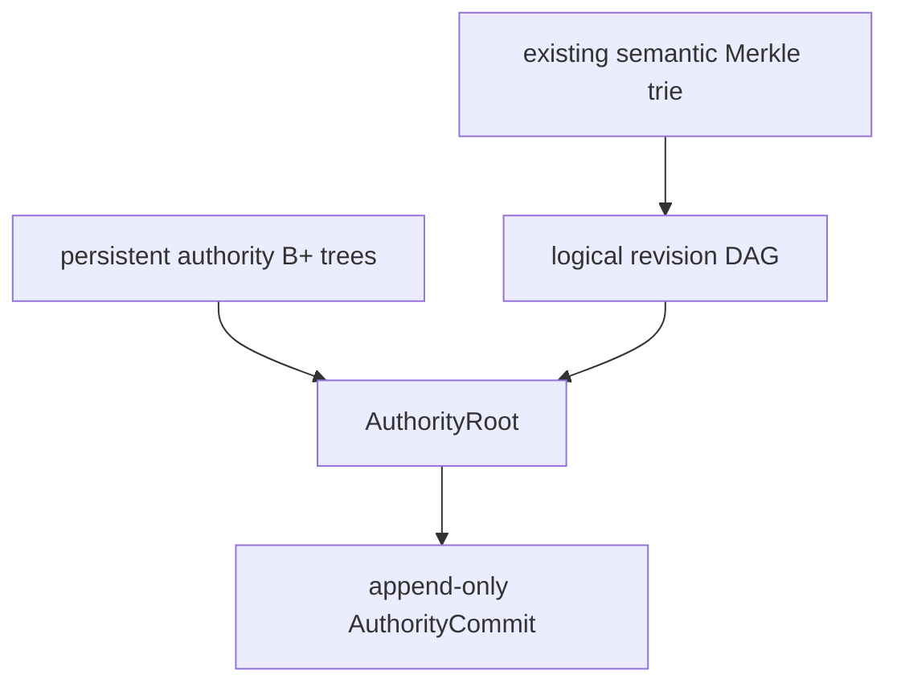

| Candidate C | Assessment |
|---|---|
| Core move | Immutable Merkle records, copy-on-write B+ indexes, segmented append commit |
| Strength | One-sync hot commit, `O(log_B N)` indexed update, bounded-memory replay and GC |
| Risk | A global authority root can over-couple branches and duplicate placement state already owned by the runtime |
| Retained | Segmented commit, persistent replay index, immutable transaction graph |

### 1.5 Candidate D — portability and failure-model redesign

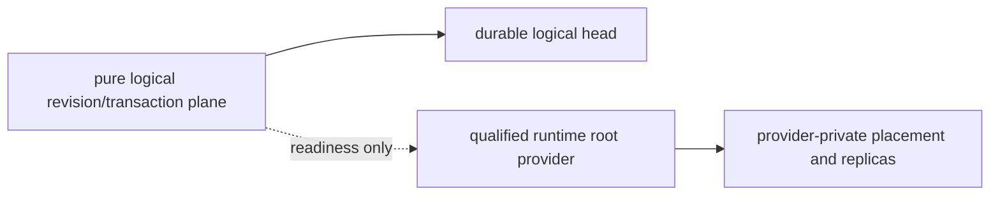

| Candidate D | Assessment |
|---|---|
| Core move | Pure logical authority plus an explicit runtime-owned physical authority |
| Strength | Relocation does not change root, attribution, transaction, or branch identity |
| Correction | Generic OCI, WASI, and Firecracker do not automatically satisfy sealing, isolation, CoW, or durability |
| Retained | Strict adapter admission, typed unsupported outcomes, physical evidence classes |

### 1.6 Initial decision matrix

Scores are architectural, not benchmark evidence: `2` satisfies by construction,
`1` is incomplete, and `0` conflicts with a hard invariant.

| Criterion | Current | Simplified | Capsule | PCRA synthesis |
|---|---:|---:|---:|---:|
| Canonical integrity and attribution | 2 | 2 | 2 | 2 |
| Placement-free logical identity | 1 | 1 | 0 | 2 |
| Old-or-complete-new recovery | 2 | 2 | 1 | 2 |
| Same-ID replay after later commits | 0 | 1 | 0 | 2 |
| Payload-stationary path | 2 | 2 | 2 | 2 |
| Relocation without republish | 1 | 0 | 0 | 2 |
| Bounded application memory | 1 | 2 | 2 | 2 |
| Metadata update asymptotics | 0 | 1 | 1 | 2 |
| Portable protocol | 1 | 1 | 0 | 2 |
| Operational simplicity | 0 | 2 | 2 | 1 |
| **Total `/20`** | **10** | **14** | **10** | **19** |

### 1.7 Refinement round: why SITA wins

The second investigation round attacked the original PCRA decomposition.

| Refinement | Durable mechanism | Replay | Main cost | Verdict |
|---|---|---|---|---|
| Immutable Transaction + `HEAD` | operation-keyed file plus three-round rename protocol | operation pathname | many inodes; three portable rounds; recovery invariants depend on roll-forward of every visible `Advance` | Correct minimal fallback |
| Full indexed PCRA | global B+ authority plus append commit | `O(log_B O)` | duplicates provider placement/replica state and couples unrelated branches | Too broad |
| **SITA** | per-branch segmented append plus B+ replay root and one commit frame | `O(log_B O)` | one index path copy; segment lifecycle | **Recommended** |

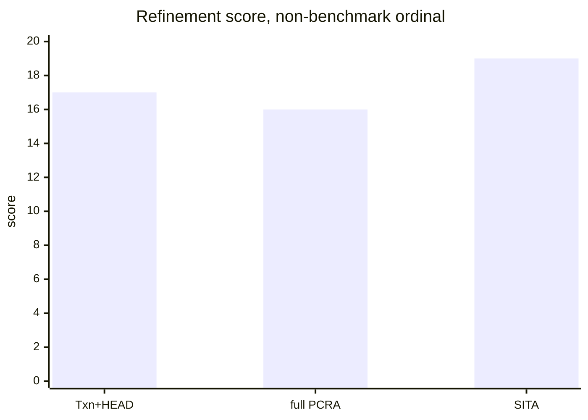

SITA keeps Candidate D's physical boundary and Candidate A's desire for one
transaction object, while using Candidate C's append/index substrate. It removes
standalone `RevisionRecord`, placement-plan, replica-set, activation-binding,
operation-index-selector, and mutable-`HEAD` authorities from the portable core.

## 2. Recommended draft architecture: SITA

### 2.1 Authority boundaries

| Object or service | Contains | Explicitly excludes | Authority |
|---|---|---|---|
| `TxnObject` | branch incarnation, operation/request IDs, publication ID, expected parent transaction, sequence, canonical root pair, logical operation, bounded exact result | path, allocation, replica, backend handle, projection | Immutable logical record |
| Replay B+ tree | scoped operation ID → request digest + exact terminal result/transaction ref | current-head dependency | Persistent root |
| `AuthorityCommit` | epoch, previous commit hash/address, selected head transaction, replay-index root, transaction-span hash, checksum | duplicated canonical roots and all provider data | Final branch authority |
| Canonical store | v3 semantic and attribution objects | physical placement | Existing content authority |
| Runtime root provider | root pair → durable readiness, pinned read views, private mutation sessions, physical accounting | canonical identity and branch history | External admitted service |
| Runtime profile | exact implementation digest and conformance capabilities | per-operation truth | Admission policy, not evidence |

```text
TxnObject {
  schema
  branch_scope
  branch_incarnation
  operation_id
  request_digest
  publication_id
  expected_parent_txn
  sequence
  root_id
  attribution_root_id
  primary_parent_txn
  secondary_parent_txns[]
  primary_depth
  primary_skip_txn
  logical_operation
  exact_result
}

AuthorityCommit {
  epoch
  previous_commit_address
  previous_commit_hash
  head_txn
  operation_index_root
  transaction_span_hash
  crc32c
  record_hash
}
```

The root pair is the portable revision identity. Distinct transactions may select
the same pair with different branch history, such as rollback or squash. `HEAD`
is not a separate file: it is `AuthorityCommit.head_txn`.

### 2.2 Universal runtime contract

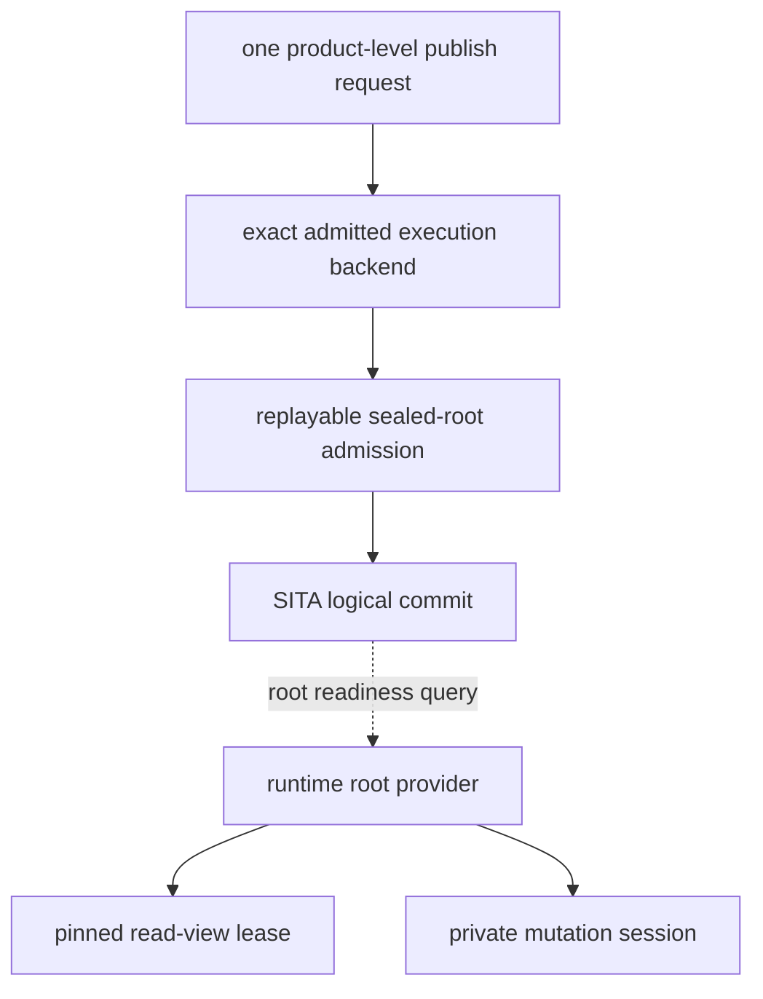

| Port | Required laws | Failure before mutation |
|---|---|---|
| Seal | same seal ID/digest returns identical evidence; prior writers are terminal; carrier survives session | `UnsupportedSeal` |
| Root readiness | selected root pair has durable, verified coverage independent of the active session | `UnsupportedRootReadiness` |
| Read view | resolution never returns mutation authority; an old pin survives provider generation replacement | `UnsupportedReadIsolation` |
| Private mutation | each activation is isolated from base and siblings; failure leaves committed roots unchanged | `UnsupportedPrivateMutation` |
| Relocation | destination verifies before switch; old pins drain; last verified realization is never retired | `UnsupportedRelocation` or policy-accepted immobility |
| Accounting | logical and physical bytes are separate; `unknown` is never rendered as zero | `UnsupportedAccounting` |
| Commit store | durable append/recovery contract, bounded records, one writer per branch incarnation | `UnsupportedCommitStore` |
| Authority | exact adapter uses no forbidden mechanism or new privilege | `UnsupportedAuthority` |

An opaque handle is an identifier, not proof. Stable handle equality does not
prove immutability, zero-copy, CoW, stationarity, or absence of backend-internal
copying. Admission is tied to an exact profile and implementation digest.

These restrictions apply globally, not merely at the SITA process boundary. An
adapter cannot conceal reflink, FUSE, mount/namespace control requested by MPLA,
`ioctl`, `setns`, privilege elevation, or a new admin capability. If the exact
backend cannot satisfy the contract with already-declared authority, it is rejected.

### 2.3 Normal publication sequence

```mermaid
sequenceDiagram
    participant C as Caller
    participant E as Admitted execution backend
    participant P as Runtime root provider
    participant M as Canonical builder
    participant S as SITA branch authority

    C->>E: publish(branch, expected, operation_id)
    E->>E: close admission; revoke writers; durable replayable seal
    E->>M: stream canonical delta or bounded fallback scan
    E->>P: register and prove durable root readiness
    par prerequisites
      M->>M: make v3 root pair durable
      P->>P: make provider readiness durable
    end
    E->>S: commit(root pair, expected, operation_id, exact profile)
    S->>S: lock branch incarnation and replay lookup
    alt same ID exists
      S-->>E: exact stored result or request-digest mismatch
    else expected parent conflicts
      S->>S: append durable Reject result + new replay root + AuthorityCommit
      S-->>E: exact durable conflict
    else advance
      S->>S: append TxnObject + path-copied replay pages + AuthorityCommit
      S->>S: fdatasync active segment; publish in-memory commit pointer
      S-->>E: exact durable success
    end
    E-->>C: terminal result
```

The public request remains one request/response. Runtime seal transitions are
backend-defined and reported separately. SITA itself performs no process,
privilege, mount, namespace, or device transition.

### 2.4 Durability modes and lower bounds

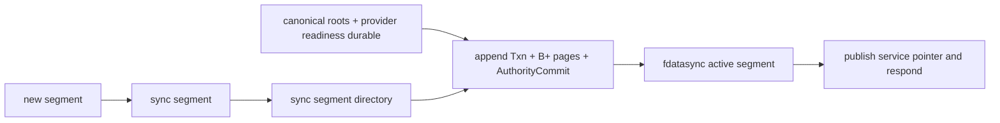

| Storage state | SITA metadata rounds | Rule |
|---|---:|---|
| Active segment already created and directory-durable | **1** | append the entire transaction span and final commit, then one `fdatasync` |
| New segment not yet directory-durable | **2** | sync the new segment, then its directory; a pre-created standby moves this off the hot path |
| File-per-object + `HEAD.tmp` portability fallback | **3** | sync transaction and temp head, sync containing directory, rename, sync directory |

End to end, the runtime seal/readiness boundary causally precedes SITA commit and
adds backend-defined durability work. It is never hidden inside the one-sync claim.
The one-round hot path also requires that readers use the authority service;
uncoordinated processes may not scan page-cache tail bytes as committed state.

The portable file-replacement fallback remains three rounds because syncing a
file does not necessarily persist its directory entry. The Linux
[`fsync(2)` documentation](https://www.man7.org/linux/man-pages/man2/fsync.2.html)
and SQLite's documented [atomic-commit protocol](https://www.sqlite.org/atomiccommit.html)
support this conservative separation of prerequisite and reference durability.

### 2.5 Linearization and crash proof

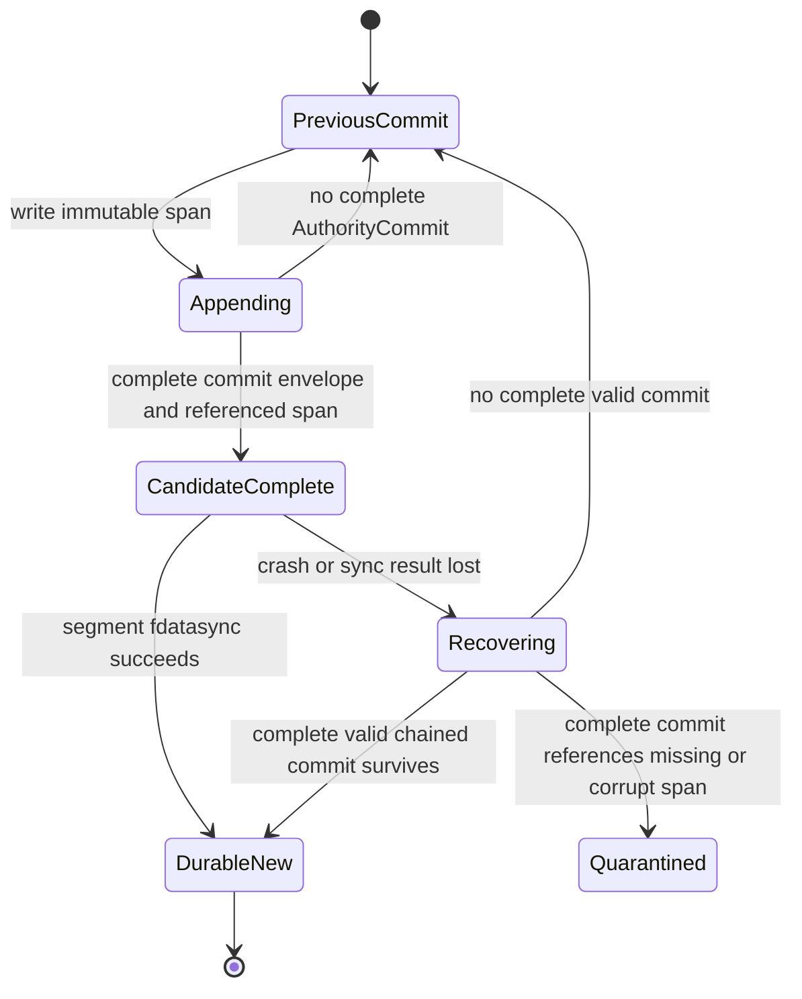

| Claim | Mechanical rule |
|---|---|
| Branch and replay change together | Both are roots named by one final `AuthorityCommit` frame |
| Partial/torn suffix | Ignored because it lacks a complete checksum/hash-valid commit envelope |
| Complete commit with incomplete graph | Quarantine; never silently select an older plausible state |
| Acknowledged success | No response before successful active-segment `fdatasync` |
| Response loss | Recovery selects the complete commit; replay B+ lookup returns the exact result |
| Later branch advance | Every later replay root structurally retains the old terminal operation entry |
| Direct readers | Forbidden; only the authority service publishes a post-sync root |
| Corruption of acknowledged data | Fail closed rather than silently rolling back |

### 2.6 Algorithm and data-structure selection

Let `O` be permanent operation entries, `B` B+ fanout, `Ppg` page bytes, `k`
keys changed in a transaction, `D` primary-lineage depth, and `V,E` the general
merge-DAG size.

| Structure | Strength | Rejection or retained role |
|---|---|---|
| Persistent B+ tree | `O(log_B O)` lookup/update, ordered streaming, bulk build, bounded page cache | **Selected for replay index** |
| HAMT/radix | Fixed-digest point lookup and structural sharing | Retain for existing semantic trie; unordered GC/range traversal and canonical collision handling are worse here |
| Append log alone | Cheapest durable append | Retained as substrate; rejected as replay index because lookup becomes `O(O)` or memory becomes `O(O)` |
| LSM | Cheap amortized ingest | Rejected: permanent replay keys are repeatedly compacted; manifest recovery and tail latency add state |
| Merkle DAG alone | Natural immutable transaction/lineage records | Retained for transactions; needs a named replay index |
| Operation-keyed files | Direct lookup through filesystem namespace | Correct three-round fallback; many inodes and directory durability prevent the one-sync hot path |

The B+ tree recommendation is based on required asymptotics and ordered external
processing, not an unmeasured latency claim. Persistent B+ tree shadowing is a
well-established snapshot technique; see the IBM/USENIX paper
[“B-trees, Shadowing, and Clones”](https://www.usenix.org/conference/2007-linux-storage-filesystem-workshop/b-trees-shadowing-and-clones).
HAMT remains a valid point-map alternative, as described in Bagwell's
[“Ideal Hash Trees”](https://lampwww.epfl.ch/papers/idealhashtrees.pdf), but does
not eliminate the ancestry or ordered-GC requirements.

| Operation | Derived application work |
|---|---:|
| Replay lookup | `O(log_B O)` page reads; rebuildable cache may reduce warm reads |
| Successful or rejected terminal operation | `O(log_B O)` path-copied pages plus bounded records |
| Metadata bytes per one-key transaction | `O(Ppg log_B O)` plus bounded transaction and commit frames |
| Live traversal memory | `O(log_B O)` stack plus a fixed charged page cache |
| Fork | one target-branch transaction and replay entry; zero payload allocation before activation |
| Rollback | one transaction selecting an existing root pair plus replay update |
| Primary ancestor query | `O(log D)` with one Fenwick-style skip link per transaction |
| Arbitrary merge-DAG ancestry | `O(V+E)` worst case with generation pruning and disk-backed visited state |
| Permanent replay disk | unavoidable `Ω(O)` |

Every transaction stores one primary skip link to the ancestor at
`depth - lowbit(depth)`. No draft claim extends the `O(log D)` primary-lineage
bound to adversarial crisscross merges.

## 3. Safety gate

### 3.1 Invariant mapping

| Invariant | SITA mechanism | Honest draft evidence |
|---|---|---|
| Content-addressed integrity | existing v3 canonical roots; hashed transaction spans and B+ pages | `DRAFT_DESIGN` |
| Exact identity and attribution | one paired root value in `TxnObject`; never duplicated in commit frame | `DRAFT_DESIGN` |
| Semantic write isolation | admitted read-view and private-mutation laws | `MODEL_ONLY` per generic runtime family |
| Zero-copy activation | optional measured backend class, separate from isolation | `UNKNOWN` |
| Physical stationary publication | only `physical_stationary_verified` admission can claim zero payload copy/write | `UNKNOWN` per exact adapter |
| Durable old-or-complete-new | append-only prefix plus one checksummed chained commit frame | `PENDING_MODEL_AND_CRASH_VALIDATION` |
| Same-ID recovery | branch and persistent replay root selected by the same commit | `DRAFT_DESIGN` |
| Read-only consumers | provider returns pinned read-view leases; adversarial writes must fail | `MODEL_ONLY` |
| Bounded memory | fixed page cache, bounded codecs, streamed recovery/GC | `PROJECTED` |
| Fail closed | corrupt commit/root/attestation/lease quarantines; no silent fallback | `DRAFT_DESIGN` |
| Logical portability | transaction and canonical IDs contain no provider fields | `DRAFT_DESIGN` |
| Relocation identity | provider generation changes outside SITA; root and transaction IDs stay unchanged | `DRAFT_DESIGN` |

### 3.2 Runtime and SITA states

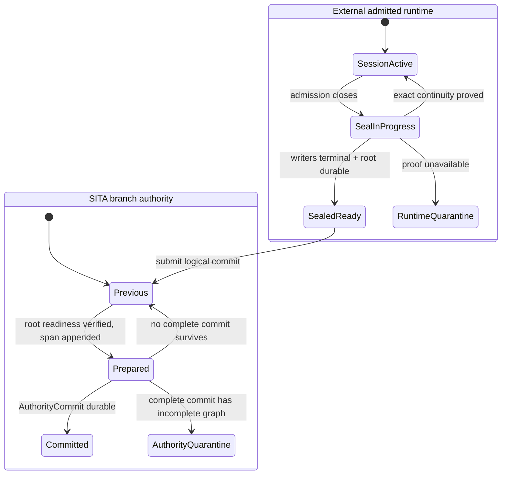

SITA never performs the runtime state transitions. A backend may return to the
active state only with exact continuity proof; partial drain or writer revocation
is not described as “session untouched.”

### 3.3 Crash and failure matrix

| Cut | Public authority | Required recovery |
|---|---|---|
| Profile/admission failure | Previous | Reject before mutation |
| Backend drain or revocation incomplete | Previous | Resume only with exact backend continuity proof; otherwise quarantine |
| Durable seal response lost | Previous | Same seal ID returns identical admission |
| Physical stationarity evidence missing | Previous | Stationary operation is unsupported; do not copy under the same name |
| Root ready, SITA unavailable | Previous | Provider retains/accounted root; retry later |
| Partial transaction/page append | Previous | Ignore unreachable suffix |
| Complete transaction, no complete commit | Previous | Ignore or reuse immutable suffix; no public change |
| Complete valid commit before sync result | Previous or complete new after recovery | Validate chain/span; selecting new is allowed |
| Complete commit references corrupt/missing bytes | None served | Quarantine; no silent rollback |
| `fdatasync` succeeds, response lost | New | Replay index returns exact result |
| Segment rotation before directory durability | Previous segment | Finish or reject new segment; never infer from filename alone |
| Disk full mid-append | Previous | Offered root remains provider-accounted; retry or operator recovery |
| Profile implementation digest changes | None for affected work | Quarantine; never infer compatibility |
| Provider loses selected root realization | Logical commit remains, activation unavailable | Fail closed; never silently substitute a different root |

### 3.4 Relocation and retirement

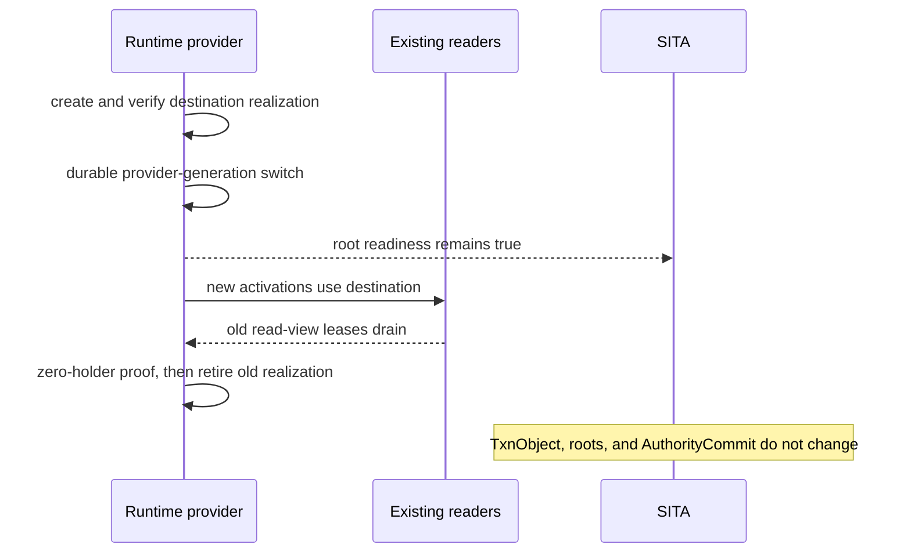

If a provider cannot prove old-handle lifetime and zero holders, it may add a
realization but must not retire the last old one. Relocation byte copy, verification,
switch, and deletion are provider work and are reported separately.

### 3.5 Memory, retention, and backpressure

| Charged resident partition | Draft ceiling |
|---|---:|
| Replay B+ page cache | `2 MiB` |
| Four worker buffers | `1 MiB` |
| Canonical codec/hash scratch | `2 MiB` |
| Transaction/recovery state | `1 MiB` |
| External mark/sort cursors | `1 MiB` |
| Accounting and emergency reserve | `1 MiB` |
| **Global total** | **`8 MiB`** |

This is a proposed budget, not evidence. All scans use bounded records and disk
cursors. No `Vec` or map may grow with operation count, payload bytes, carrier
count, or merge-DAG size.

Permanent exact replay has an information-theoretic `Ω(O)` disk cost. Segment
compaction may reclaim unreachable page versions but cannot delete terminal
operation results while the replay contract is indefinite. Payload retention is a
separate policy: a historical exact receipt may survive after activation returns a
typed `RevisionExpired`.

Metadata GC snapshots one valid commit, marks transaction and replay records with
external sorted runs or a disk-backed visited index, bulk-builds replacement B+
pages/segments, installs one representation-only commit, waits for reader epochs,
then deletes old segments. A crash after the new commit and before deletion leaks
space safely.

### 3.6 Migration

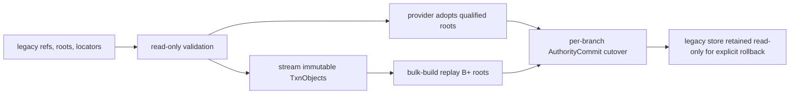

| Migration property | Rule |
|---|---|
| Payload copies | Zero only when the exact provider adopts a legacy realization in place; otherwise reject rather than silently copy |
| Payload reads | Zero with complete trusted legacy proof; otherwise bounded rehash or reject |
| Metadata work | `O(P)` logical refs plus `O(N)` for one complete live locator generation; worst-case historical preservation may already be `O(P²)` |
| Write mode | Never dual-write branch authority |
| Cutover | One imported commit per branch incarnation after root readiness validates |
| Corruption after cutover | Fail closed; no automatic legacy fallback |
| Historical conflicts | Do not invent exact outcomes absent from legacy evidence |

### 3.7 Focused qualification plan — future work, not executed

| Area | Required future test |
|---|---|
| Identity | provider relocation leaves root pair, transaction, and branch authority unchanged |
| Attribution | paired roots round-trip; mismatch fails before append |
| Replay | success and durable conflict replay after 1,000 later commits and after compaction |
| Append recovery | every byte boundary, torn tail, complete-commit/incomplete-span quarantine, response loss |
| Segment lifecycle | rotation crash, pre-created standby, compaction/publication race |
| Lineage | fork, rollback, squash, crisscross merge, corrupt/cyclic parent rejection |
| Isolation | sibling/private-session and adversarial base-write conformance |
| Physical evidence | zero-copy/stationarity counters; stable handle alone must fail the proof |
| Relocation | pin/switch/retire races, lost destination, last-realization protection |
| Cardinality | 1M operation results and one provider root with adversarial realization count |
| Memory | 1 GiB and 1M-entry streams remain within charged `8 MiB` |
| Universality | exact adapters use no reflink, FUSE, MPLA mount/namespace control, `ioctl`, `setns`, privilege elevation, or new admin capability |

## 4. User-visible demonstrations

### 4.1 Stationary publication and evidence boundary

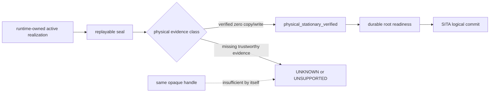

### 4.2 CoW fork fan-out

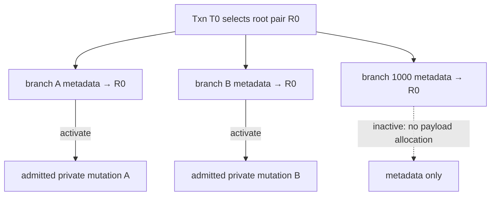

Semantic isolation is required. Physical CoW granularity and activation copy
bytes are backend measurements, not universal consequences of the diagram.

### 4.3 Rollback

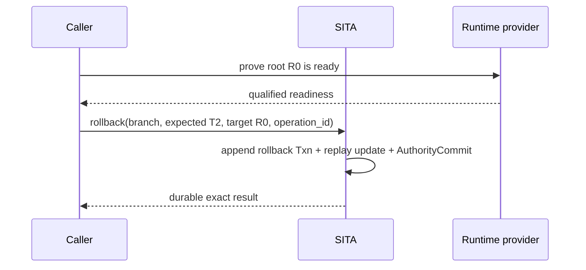

Rollback never repoints directly to an old transaction. It creates a new
transaction whose parent is the current head and whose root pair is the target.

### 4.4 Squash versus placement compaction

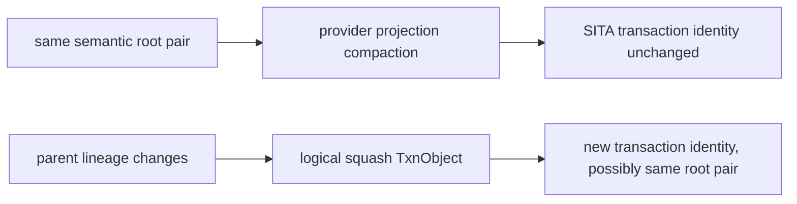

Provider compaction may preserve logical history only after exact root-readiness
verification. A true logical squash changes lineage and therefore creates a new
transaction even when semantic bytes are unchanged.

### 4.5 One-GiB one-byte edit

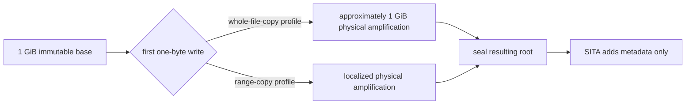

Both profiles may satisfy semantic isolation. Only measured accounting can label
physical CoW, zero-copy activation, or stationary publication.

### 4.6 Backend models, not qualifications

| Logical requirement | OCI adapter model | WASI adapter model | Firecracker adapter model |
|---|---|---|---|
| Current status | `MODEL_ONLY` | `MODEL_ONLY` | `MODEL_ONLY` |
| Root readiness | exact extension required | host extension required | host authority required |
| Read view | admitted runtime-owned lease | admitted host-resource lease | admitted host image/export lease |
| Private mutation | must pass isolation/accounting suite | must pass isolation/accounting suite | must pass isolation/accounting suite |
| Commit authority | unprivileged host metadata service | qualifying host durable append required | qualifying host authority, never guest |
| Backend fields in SITA IDs | none | none | none |

Generic runtime family names do not establish conformance. A backend without the
required contract is `UNSUPPORTED`, not a degraded MPLA implementation.

## 5. Performance and evidence panel

### 5.1 Historical/current facts

| Metric | Historical/current fact | Preserve gate | Stretch |
|---|---:|---:|---:|
| Cold build | historical `133.683 s`; current sealed `1.228642917 s` | `<5 s` | `<1 s` service |
| Warm attach | current `24.825208 ms` | `<50 ms` | `<10 ms` |
| Publication candidate | current median `58.136209 ms` | materially beat | measure, do not infer |
| Ratio | current `0.626872660×` | formal `≥100×` | preferred `≥500×` |
| Publication CLI ledger | current `90` phase entries | reduce materially | one receipt |
| Stream | current `1.005115703 GiB/s` | `≥1 GiB/s` | `≥5 GiB/s` |
| App-managed memory | current policy target | `≤8 MiB` | reduce |

### 5.2 Refined hypotheses

| Hypothesis | Physical/algorithmic basis | Verdict now |
|---|---|---|
| SITA materially reduces publication metadata latency | one hot-path sync; no standalone head/selector/outcome files; `O(log_B O)` path copies | `PROJECTED` |
| SITA beats the current `58.136209 ms` median | fewer sequential durability domains and bytes | `UNKNOWN` until matched measurement |
| One-sync SITA achieves formal `≥100×` | no credible measurement or identical-boundary comparator exists | `UNKNOWN`; do not infer |
| Warm replay remains bounded after 1M operations | B+ lookup and fixed cache | `DRAFT_DESIGN` |
| End-to-end publication is one durability round | false: runtime seal/readiness causally precedes SITA | `REJECTED_CLAIM` |
| Generic OCI/WASI/Firecracker provides zero-copy or CoW | family names do not prove physical behavior | `REJECTED_CLAIM` |

No new latency number is promoted by this draft. The append design improves the
architectural floor, but exact filesystem, segment, device, runtime, and batching
effects remain unmeasured.

### 5.3 Evidence ledger

| Gate | Required evidence | Current verdict |
|---|---|---|
| Four-proposal tournament | Independent initial proposals and adversarial comparison | `DRAFT_COMPLETE` |
| Algorithm refinement | file+HEAD, full authority graph, and SITA comparison | `DRAFT_COMPLETE` |
| Invariant mapping | §3.1 | `DRAFT_DESIGN` |
| Append linearization | executable crash model plus authority restart tests | `PENDING_IMPLEMENTATION` |
| Persistent replay | 1M entries, conflict/success replay, compaction | `PENDING_IMPLEMENTATION` |
| Runtime contract | exact adapter conformance and implementation digest | `MODEL_ONLY` |
| Memory | charged 8 MiB with 1 GiB/1M cases | `PENDING_MEASUREMENT` |
| Zero-copy/stationarity | qualified evidence class and trustworthy counters | `UNKNOWN` per backend |
| Cold build `<5 s` | matched live Docker result | `OUT_OF_SCOPE_DRAFT` |
| Warm attach `<50 ms` | matched live Docker result | `OUT_OF_SCOPE_DRAFT` |
| Publication improvement | matched ≥100-sample median/tails | `OUT_OF_SCOPE_DRAFT` |
| Formal `≥100×` | identical-boundary comparator | `UNKNOWN` |
| Gateway rebuild | exact repository-required command | `OUT_OF_SCOPE_DRAFT` |

## 6. Proposed implementation cut line — out of scope for this draft

```mermaid
flowchart LR
    M0["M0: decision + executable failure model"] --> M1["M1: branch segment + AuthorityCommit"]
    M1 --> M2["M2: persistent replay B+ tree"]
    M2 --> M3["M3: exact runtime-provider adapter conformance"]
    M3 --> M4["M4: publication integration"]
    M4 --> M5["M5: streaming legacy import"]
    M5 --> M6["M6: remove shadow authorities"]
    M6 --> M7["M7: qualification and benchmarks"]
```

| Milestone | Rollback point | No-go condition |
|---|---|---|
| Segment/commit | Legacy remains authoritative | torn-tail or complete-commit/incomplete-span test fails |
| Replay index | No SITA cutover | same-ID result changes after later commit or compaction |
| Runtime provider | Adapter disabled | forbidden mechanism, unproven writer revocation, or writable read view |
| Integration | Stop new SITA admissions; recover offered roots | partial visibility, lost exact result, or ambiguous writer |
| Migration | Per-branch cutover only | missing legacy evidence is guessed or payload is silently copied |
| Legacy retirement | Readers retained through an explicit rollback window | any fallback use or mixed-version ambiguity |
| Qualification | Feature stays disabled | semantic, crash, memory, space, security, or honest-boundary miss |

The recommended draft reduces the portable publication authority to immutable
logical transactions, one persistent replay index, and one append-only commit
point. Runtime root placement remains outside that authority behind a qualified
universal contract. Performance claims remain hypotheses until a future,
separately authorized implementation passes correctness and matched evidence.
